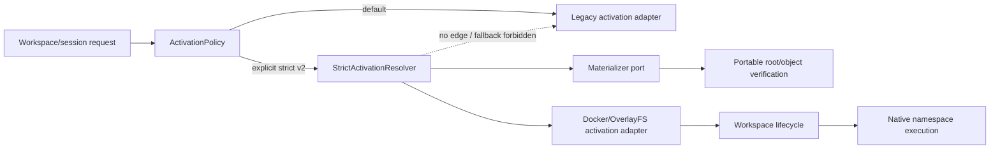
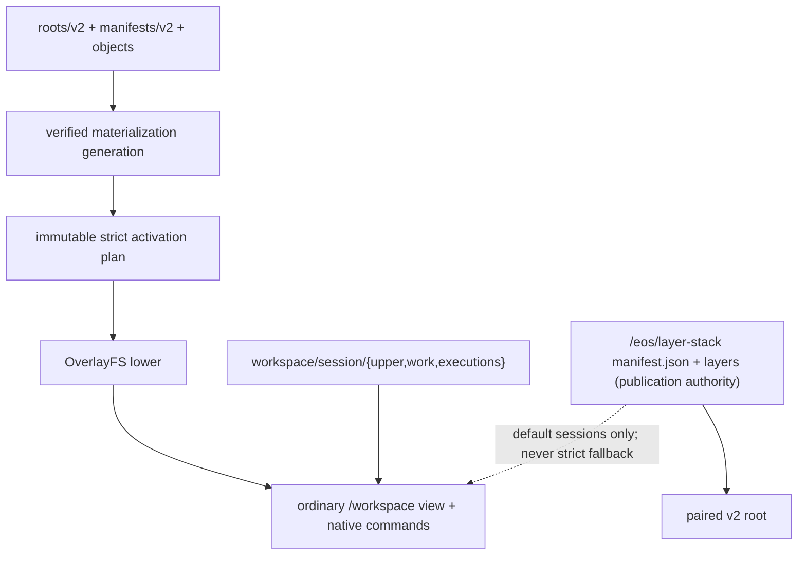
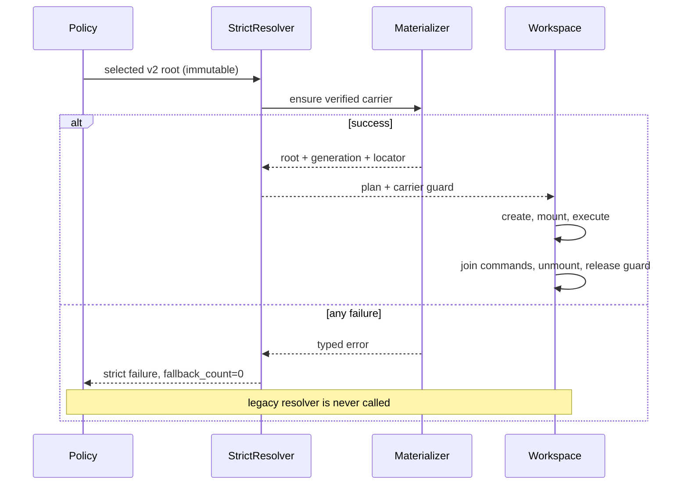

# Stage 06 — Strict opt-in candidate activation

Links: [implementation overview](../index.md) · [simplified storage contract](../layerstack_storage_contract.md) · [stage E2E plan](e2e_test.md) · [benchmark note](benchmark_note.md) · [portable storage contract](../../prep/01-cdc-cas-space-time-materialization-spec.md) · [migration/recovery contract](../../prep/03-seqcdc-cas-and-squash-decision.md) · [quantitative contract](../../prep/04-seqcdc-space-time-complexity-and-acceptance-criteria.md)

> **Normative storage update.** Stage 06 adds strict routing and
> process-lifetime activation guards but no durable storage family. It reads a
> verified materialization `CURRENT` and fails closed; later catalog/journal
> path sketches are superseded by the
> [simplified storage contract](../layerstack_storage_contract.md).

Proof tier: **POC proof tier**. This is the first packaged path that serves a candidate root. It is explicit opt-in, strict, and never falls back; legacy v1 remains the only publication authority and the default public route.

> **Performance arrival checkpoint.** Stage 06 is not reached until its
> [benchmark note](benchmark_note.md) has a new append-only row and the run emits versioned
> `.benchmark-state/results/<run-id>/stage-06-perf-report.json` and
> `stage-06-perf-report.md` with
> `schema_version="phase1.stage06.perf-report.v1"`. The reports must contain
> the frozen raw baseline actual, required pass target/cap, separately
> predeclared optimization target, candidate actual, delta, ratio, and
> headroom, complexity/work counters, logical-resource high-water counters,
> memory/RSS, physical space, the complete PTY supported/unsupported matrix,
> the fail-closed/recovery matrix, and the 64/256/1,024 MiB × 1/8/32
> clean-session space sweep,
> run/raw-artifact links, provenance, missing values, and a
> `DIAGNOSTIC_PASS|FAIL|OPEN` verdict. The first Markdown table exposes those
> comparison fields per stage-owned metric. The no-op control is frozen as
> direct `docker exec <container-id> ls` without a shell in a fresh ordinary
> container created for each matched invocation from the pinned OCI/platform
> digest. It has equivalent pristine root contents but no LayerStack-owned
> `/eos` root, candidate materialization/mount, root lease,
> session/namespace-holder setup, or public API wrapper. Pull/create/start/
> health/setup are untimed and separately recorded; the ready control is timed
> from the Docker exec request through complete exit/status/stdout/stderr
> drain. Pair it to candidate public `exec_command(["ls"])` on matched
> host/filesystem/root contents/cwd/env/Docker allocation/cache class/order/
> output drain. This is raw Docker execution, not bare-host `fork/exec`. The
> Prep cap remains
> `candidate <= docker_exec_ls*1.03+0.5 ms`; the separate predeclared stretch
> target is a saving of at least 80 ms at both p50 and p95, and is reported
> missed/impossible rather than rebased if the control is below 80 ms.
> Append the invocation and
> `Good`/`Defect`/`Fix` plus cleanup to `e2e/test-report.md`. This checkpoint is
> **diagnostic**; Stage 11 alone qualifies the Prep performance gates.

## 1. Stage contract

| Item | Contract |
| --- | --- |
| Status | Proposed, implementation-ready |
| Depends on | Stage 05 and its Stage 00/02–04 ancestry, especially exact private candidate materialization and zero-mismatch dual-read evidence. Stage 01 remains independent until Stage 10. |
| Owners / affected crates | `sandbox-runtime-layerstack-core` contracts, `sandbox-runtime-layerstack` activation adapter, `sandbox-runtime` orchestration, workspace/namespace mount plumbing, configuration, external E2E/benchmark lab |
| Objective | Resolve an explicitly opted-in v2 root to a verified native carrier and use it as the sandbox/workspace base through a strict packaged route with `fallback_count=0`. |
| Visible outcome | Candidate-opted-in workspace sessions execute ordinary native commands against the v2-derived tree; default sessions continue on legacy v1; route evidence proves which source served each session. |
| In scope | Validated strict rollout selection; immutable activation plan; warm/cold carrier resolution; provider mount adapter; in-process mounted-carrier guard; fail-closed errors; route proof; rollback switch. |
| Non-goals | Candidate publication/OCC/durable leases; automatic fallback; default enablement; mixed-root migration; pack/GC; candidate squash/remount; legacy removal; target-image helper. |
| Entry | Stage 05 exact comparison, warm idempotency, corruption/recovery, graph, and resource gates pass; selected v2 root is paired to a committed legacy head; implementation is on `upgrade-2.0-phase-1` created from the newest approved immutable product revision. Planning creates no branch. |
| Exit gate | Focused packaged tests prove exact candidate command/file/metadata and supported PTY behavior, deterministic unsupported PTY behavior, warm and cold activation, `fallback_count=0` on success and failure, no legacy read after route commit, mounted-carrier lifetime, exhaustive strict failure/recovery cells, clean-session zero payload growth and workspace-size-independent O(1) per-session metadata, bounded memory, and exact-zero dependency delta. |
| Rollback | Disable the opt-in/config allowlist. New sessions return to legacy default; active strict sessions finish on their pinned carrier or are explicitly destroyed. Candidate data is retained; no root/object/ref rewrite occurs. |

Mode/authority contract:

| Mode | Publication authority | Session read/materialization authority | Fallback | Accepted root versions | Mismatch/corruption | Rollback |
| --- | --- | --- | --- | --- | --- | --- |
| `legacy` | legacy v1 | legacy projection | not applicable | v1 | existing behavior | default |
| `shadow_write` | legacy v1 | legacy projection | not applicable | public v1/private v2 | observable shadow failure | disable shadow |
| `dual_read_verify` | legacy v1 | legacy public; candidate private comparison | candidate never serves | public v1/private v2 | comparison failure, legacy unaffected | shadow mode |
| `candidate_read_strict` | **legacy v1** | **v2 candidate for opted-in sessions**; legacy for non-opted-in sessions | **forbidden, always 0** | selected session v2 only; default v1 | selected session fails closed before/at activation; never retries legacy | remove opt-in for future sessions |

One logical publication still has one authority: strict reads consume only the v2 root already derived from a committed legacy publication.

## 2. Current evidence

| Status | Repository evidence | Finding / preserved contract |
| --- | --- | --- |
| observed | `ephemeral-sandbox/crates/sandbox-runtime/operation/src/services.rs:316-404,731-785` | Runtime construction maps typed configuration into concrete LayerStack/workspace services; this is the rollout injection seam. |
| observed | `ephemeral-sandbox/crates/sandbox-config/src/configs/runtime.rs:130-199`, `LayerstackConfig`, `StorageRolloutMode`, and `LayerstackConfig::validate` | `StorageRolloutMode` currently contains only default `Legacy`; candidate activation must be added as a typed/default-off contract. |
| observed | `ephemeral-sandbox/crates/sandbox-runtime/layerstack/src/workspace_base/layer.rs:16-17,34-45`, `WORKSPACE_BASE_LAYER_ID`, `SHARED_BASE_DIR`, and the base-layer builders; `ephemeral-sandbox/crates/sandbox-runtime/layerstack/src/workspace_base/binding.rs:11-45,127-137`, `WorkspaceBinding` and its read/write functions | Current workspace bases are native physical layers/bindings. |
| observed | `ephemeral-sandbox/crates/sandbox-runtime/overlay/src/kernel_mount.rs:38-48,105-210,287-354`, `OverlayHandle`, `mount_overlay`, and `ValidatedMountInputs::open` | OverlayFS mount consumes ordered physical lower directories; mounting is provider-specific. |
| observed | `ephemeral-sandbox/crates/sandbox-runtime/namespace-execution/src/types.rs:5-15`, `NamespaceExecutionId` and `NamespaceTarget` | Namespace execution target carries physical root/layers/upper/work/fds; logical root identity must not leak into process runner concerns. |
| observed | `ephemeral-sandbox/crates/sandbox-runtime/namespace-execution/src/registry.rs:8-27,38-120`, `ExecutionRegistry::{new,try_reserve,attach,abort,complete}` | Active executions already have bounded in-memory lifecycle ownership; activation guard release can align with it. |
| observed | `ephemeral-sandbox/crates/sandbox-runtime/namespace-process/src/runner/mod.rs:48-92`, `run` and `mask_model_shell_paths` | Native command entry uses namespaces/syscalls and does not require target-image helper programs. |
| observed | `ephemeral-sandbox/crates/sandbox-runtime/layerstack/src/stack/lease/registry.rs:17-34,50-83,103-107`, `LeaseRegistry`, `lock_shared_registry`, and the shared registry map | Current LayerStack leases are in-memory and insufficient for Stage 07 durable publication/retention, but can inspire a process-lifetime mounted-carrier guard. |
| proposed from Stage 05 | `Materializer::ensure` returns a verified provider locator/generation | The strict resolver may depend on this port, not reconstruct object paths or trust an unverified directory. |
| inferred | Selecting candidate only after mount fallback is too late | Route choice must be immutable before resolution/mount; otherwise a failed candidate can silently use legacy. |
| open | Exact opt-in granularity exposed by current external configuration grammar | Implement sandbox/root allowlist or explicit request field at the existing typed seam; do not add an unrelated public storage API. |

## 3. Resulting file and folder structure

### Product, tests, and evidence

```text
ephemeral-sandbox/
├── crates/sandbox-config/src/configs/runtime.rs                         [modify] — `CandidateReadStrict` + validation/default
├── crates/sandbox-runtime/layerstack-core/src/materialization.rs        [modify] — verified receipt contract only
├── crates/sandbox-runtime/layerstack/src/
│   ├── activation/mod.rs                                                [add] — strict resolver and immutable plan
│   ├── activation/guard.rs                                              [add] — process-lifetime mounted-carrier guard
│   ├── activation/docker_overlayfs.rs                                   [add] — locator-to-native-lower adapter
│   └── materialization/current.rs                                       [modify] — return generation-checked ready receipt
├── crates/sandbox-runtime/operation/src/
│   ├── layerstack/service/impls/activate.rs                             [add] — strict orchestration
│   ├── layerstack/service/core.rs                                       [modify] — inject resolver/route proof
│   ├── workspace_session/service/impls/create.rs                        [modify] — freeze source before workspace creation
│   ├── services.rs                                                      [modify] — construct validated mode/allowlist
│   └── projection/observability.rs                                      [modify] — activation source/fallback/generation
├── crates/sandbox-runtime/workspace/src/
│   ├── model.rs                                                         [modify] — internal base carrier handle, public DTO unchanged
│   ├── lifecycle/create.rs                                              [modify] — consume immutable activation plan
│   └── lifecycle/destroy.rs                                             [modify] — release guard after command/mount teardown
├── crates/sandbox-runtime/layerstack/tests/strict_activation.rs         [add]
└── crates/sandbox-runtime/operation/tests/strict_candidate_activation.rs [add]

ephemeral-sandbox-test/
├── e2e/runtime/layerstack_phase1/
│   ├── activation_helpers.py                                            [add]
│   ├── test_strict_candidate_activation.py                             [add]
│   └── test_spec.md                                                     [modify] — stable Phase 1 declarations
├── benchmark/presets/strict-activation-tiny.yml                        [add]
├── benchmark/tests/fixtures/golden/layerstack_phase1/
│   ├── strict-activation-tiny.json                                     [add] — deterministic corpus manifest
│   └── activation_result_v1.json                                       [add] — result validation fixture
├── .e2e-state/runs/<run-id>/evidence/                                  [add] — emitted at run time; route/tree/resource/dependency evidence
├── .benchmark-state/runs/<benchmark-run-id>/                           [add] — emitted at run time; lab-owned raw artifacts
└── .benchmark-state/results/<benchmark-run-id>/                        [add] — emitted at run time; lab-owned derived artifacts

ephemeral-sandbox-docs/implementation-plan/2.0 migration/phase 1/implementation/stage_06_strict_candidate_activation/
├── spec.md                                                              [add]
└── e2e_test.md                                                          [add]
```

### Superseded pre-simplification runtime inventory

This inventory is retained only for requirement traceability. Stage 06 adds no
new durable storage family; it reads the root ref and materialization `CURRENT`
defined by the
[simplified storage contract](../layerstack_storage_contract.md#stage-ownership).

No new durable storage family is required; Stage 06 consumes the Stage 05 ready carrier. A mounted guard is process memory, never a `RootId` field or durable lease.

```text
/eos/
├── runtime/daemon/
│   ├── runtime.sock                                                   [existing] runtime IPC; M
│   └── runtime.pid                                                    [existing] runtime lifecycle; M
├── layer-stack/                                                        [existing + additive v2] public legacy authority
│   ├── .storage-writer.lock                                           [existing] legacy writer lock; M
│   ├── manifest.json                                                  [existing] public v1 head; L_hot+M
│   ├── workspace.json                                                 [existing] v1 binding; M
│   ├── base/B000001-base/                                             [existing] legacy native base; L_hot
│   ├── layers/<layer_id>/                                             [existing] legacy whole-file layers; L_hot+H_cold
│   ├── staging/<layer_id>.staging/                                    [existing] legacy publish staging; P_staging
│   ├── .layer-metadata/
│   │   ├── <layer_id>.digest                                         [existing] v1 digest metadata; M
│   │   └── <layer_id>.bytes                                          [existing] v1 byte-count metadata; M
│   ├── format-v2.json                                                 [compat] v2 profile marker; M; not RootId
│   ├── roots/v2/<prefix>/<RootId>.root                                [compat] portable source of truth; RootId yes; M
│   ├── manifests/v2/<prefix>/<TreeManifestId>.manifest                [compat] canonical manifest; typed identity; M
│   ├── objects/v1/loose/                                               [compat reserved-empty] no Stage 04–06 payload writer; object reads resolve verified immutable v1 carrier ranges
│   ├── packs/v1/
│   │   ├── open/                                                       [compat reserved] Stage 08
│   │   └── sealed/                                                     [compat reserved] Stage 08
│   ├── indexes/v1/
│   │   ├── pages/<page_id>.idx                                        [compat] bounded locator page; M
│   │   └── index.catalog                                              [compat] atomic index generation; M
│   ├── catalogs/v1/
│   │   ├── roots.catalog                                              [compat] candidate root generations; M
│   │   ├── locators.catalog                                           [compat] verified object-to-v1-carrier-range locators; not RootId; M
│   │   ├── materializations.catalog                                  [compat] MaterializationKey=(RootId,backend_kind,backend_format_version,target_profile) -> MaterializationId, generation, carriers; activation read-only
│   │   ├── leases.catalog                                            [compat reserved] Stage 07 durable leases
│   │   └── retention.catalog                                         [compat reserved] Stage 08
│   ├── journals/v1/
│   │   ├── publication/                                               [compat] Stage 04 shadow records; Stage 07 writer
│   │   ├── hydration/<txn_id>.journal                                 [compat] hydration recovery active
│   │   ├── squash/                                                     [compat reserved] Stage 09
│   │   ├── compaction/                                                 [compat reserved] Stage 08
│   │   └── migration/                                                  [compat] migration evidence
│   ├── staging/v2/
│   │   ├── publication/                                               [compat] incomplete work never activated
│   │   ├── hydration/<txn_id>/                                        [compat] incomplete work never activated
│   │   ├── squash/                                                     [compat reserved] Stage 09
│   │   ├── compaction/                                                 [compat reserved] Stage 08
│   │   └── migration/                                                  [compat reserved]
│   ├── leases/v1/                                                     [compat reserved] Stage 07
│   ├── retention/v1/                                                  [compat reserved] Stage 08
│   ├── maintenance/v1/                                                [compat reserved] Stage 08
│   ├── materializations/docker-overlayfs/v1/<MaterializationId>/
│   │   └── carriers/<ordinal>/                                       [compat][activated when opted in] rebuildable lower carrier; L_hot while pinned
│   ├── quarantine/v1/<typed-id>/                                      [compat] never activated
│   └── trash/v1/                                                      [compat reserved] Stage 08
├── workspace/
│   ├── manager.json                                                   [existing] crash catalog
│   ├── .export/<spool_id>                                             [existing] export scratch
│   └── <session>/
│       ├── upper/                                                      [existing] active writes; ΣU_active
│       ├── work/                                                       [existing] OverlayFS work; ΣU_active
│       └── executions/<execution>/transcript.log                      [existing] command scratch; ΣU_active
├── namespace_execution/<legacy>/transcript.log                        [compat][remove-later Stage 11] no new writes
└── storage/
    ├── file_auditability/                                             [existing] audit
    └── workspace_recovery/                                            [existing] recovery
```

Delta from Stage 05: storage bytes are unchanged except ordinary active workspace upper/work/transcript data; the verified materialization becomes an actual read carrier for explicitly opted-in sessions. Legacy default and publication paths remain.

## 4. SRP, SOLID, and coupling design

The integrity risk is a route decision spread across config, materialization, workspace creation, and mount error handling. A boolean at the mount call would allow implicit legacy reconstruction or partially mutate a workspace. The complete small slice is an immutable activation plan selected before workspace creation, a strict resolver, a provider mount adapter, and a lifetime guard.

| Component | Responsibility | Dependency direction | Forbidden responsibility |
| --- | --- | --- | --- |
| `ActivationPolicy` | Validate whether a request/session is legacy or strict v2 | config/orchestration | filesystem resolution, fallback |
| `StrictActivationResolver` | Turn selected v2 root into one verified carrier receipt | adapter → core materializer port | legacy projection, publication |
| `ActivationPlan` | Immutable selected source/root/generation/lower carriers | internal value passed inward | retrying a different source |
| `DockerOverlayfsActivationAdapter` | Validate locator and build native lower descriptor | provider adapter | logical identity/hash decisions |
| `ActiveCarrierGuard` | Keep a ready generation alive through unmount | lifecycle adapter | durable reachability/GC policy |
| `WorkspaceManager` | Create/mount/destroy session using supplied plan | workspace orchestration | choosing storage mode |
| Route observation | Report authoritative source/fallback count | bounded projection | log-based truth or path cardinality |

Narrow signatures:

```rust
pub(crate) trait ActivationResolver {
    fn resolve(
        &self,
        selection: CandidateRootSelection,
        cancel: &CancellationToken,
    ) -> Result<VerifiedActivation, ActivationError>;
}

pub(crate) struct VerifiedActivation {
    root_id: RootId,
    tree_manifest_id: TreeManifestId,
    materialization_id: MaterializationId,
    materialization_generation: u64,
    provider: DockerOverlayfsV1,
    lower: NativeLowerDescriptor,
    guard: ActiveCarrierGuard,
}
```

`NativeLowerDescriptor` and `PathBuf` remain concrete/private in the Docker adapter because the current workspace/namespace runner needs Linux native paths. They never enter `RootId`, manifests, the public CLI, or `layerstack-core`. The core `Materializer` remains the Phase 3 port; no generic “activation manager” is invented in core. Construction flows validated config/request → policy → strict resolver → Stage 05 materializer/`CURRENT` resolver → Docker activation adapter → workspace. Errors translate adapter I/O/integrity to typed strict activation status and then the existing public error projection; translation never initiates legacy.

| Manifest/graph | Baseline packages/features/edges | Resolved package/version delta | Feature delta | Direct external edge delta or relocation | System/runtime delta | Internal edge change | Evidence |
| --- | --- | --- | --- | --- | --- | --- | --- |
| Product metadata | Stage 05 canonical set/features/direct edges | none | none | none | none | operation/workspace use internal activation module through existing LayerStack/workspace edges | canonical before/after JSON |
| Manifests/lock | Stage 05 | none | none | none | none | no new external edge | diff |
| Test/benchmark | Stage 05 env | none | none | none | none | cases/preset only | snapshot |
| Target runtime | existing namespace/OverlayFS syscalls | none | none | none | no target shell/helper/service dependency | no new target contract | helper-independence route evidence on the pinned Ubuntu 24.04 target |

The canonical report encodes exact zero as
`resolved_external_package_delta=[]`,
`enabled_external_feature_delta=[]`, `direct_external_edge_delta=[]`,
`cargo_lock_delta=[]`, `python_environment_delta=[]`,
`system_tool_delta=[]`, `runtime_service_delta=[]`, and
`target_image_helper_delta=[]`; `none` in the table above is not a substitute
for these machine-checked arrays.

| Boundary | Host/image assumption before | Assumption after | Core/adapter | Evidence now | Later evidence |
| --- | --- | --- | --- | --- | --- |
| Candidate identity | portable Stage 02–05 | unchanged | portable core | frozen goldens | required host triples and full Prep 04 Phase-1 image matrix in Stage 11 |
| Activation | private Docker carrier existed but was unmounted | Linux OverlayFS adapter mounts verified carrier | provider adapter | pinned Ubuntu 24.04 current arch | required hosts plus pinned Ubuntu/Debian glibc, Alpine musl, minimal/distroless, shell-less, read-only, and non-root rows in Stage 11; alternate providers in Phase 3 |
| Target image | no storage helper | still no shell/libc/userland dependency | provider adapter outside target | stage-local public API plus read-only/non-root variants of Ubuntu 24.04 OCI index `sha256:4fbb8e6a8395de5a7550b33509421a2bafbc0aab6c06ba2cef9ebffbc7092d90` only; no Phase-1 qualification claim | Stage 11 qualifies the full Prep 04 Phase-1 image matrix: pinned Ubuntu/Debian glibc, Alpine musl, minimal/distroless, shell-less, read-only, and non-root |
| Phase 2 consumer | root IDs not activatable publicly | branch/checkpoint/MCTS can request a root through neutral selection | orchestration + port | change-impact review | Phase 2 implementation |

Future exercises: a Phase 2 branch selects another `RootId` without changing manifest or mount types; an alternate object store changes Stage 05 reader only; Firecracker/WASM changes the activation/materializer adapters without changing root identity or policy semantics. Cycle/god-object audit rejects workspace → config, adapter → operation, core → native types, and resolver owning publication. `ActiveCarrierGuard` is transitional process safety; Stage 07 replaces/augments it with durable carrier/root leases. Stage-local SOLID review checks immutable selection, zero alternate source in every error branch, narrow interfaces, one owner, bounded cleanup, and contract tests.

## 5. Type, class, and field design

| Type / status / owner | Exact fields | Ownership / validation / bounds / persistence | Release / concurrency / error |
| --- | --- | --- | --- |
| `StorageRolloutMode` — modified, config public | add `CandidateReadStrict`; existing variants | default `Legacy`; strict requires explicit root/allowlist and v2 format; serialized config | invalid/missing selection rejects startup/request |
| `ActivationPolicy` — new, operation private | `mode`; `allowed_sandboxes: BoundedSet<SandboxId>` or existing equivalent; `root_selector` | immutable `Arc` config with bounded allowlist; no filesystem; transient | replaced on validated config reload; old sessions keep plan |
| `CandidateRootSelection` — new, operation internal | `key: MaterializationKey`; `expected_tree_manifest: TreeManifestId` | exact Stage 05 four-field key; owned IDs; v2 only; paired committed root; transient | typed stale/missing/kind/version/profile error |
| `ActivationPlan` — new, workspace internal | `source: LegacyV1 | CandidateV2Strict`; `candidate: Option<VerifiedActivation>` | immutable/move-only; exactly one source; transient | dropped only after destroy path releases guard |
| `VerifiedActivation` — new, layerstack adapter crate-visible | `root_id`; `tree_manifest_id`; `materialization_id`; `generation: u64`; `lower: NativeLowerDescriptor`; `guard` | created only from a verified materialization manifest selected by `CURRENT`, with contained ordered carrier locators | errors before workspace mutation; `Send`, not cloneable without guard clone |
| `ActiveCarrierGuard` — new, adapter internal | `key: CarrierKey`; `registry: Weak<CarrierRegistry>`; private token | one per mounted session; bounded by active sessions; not durable; no strong cycle | explicit release after unmount; drop fallback; restart OS unmount/recovery |
| `ActivationRouteProof` — new, operation structured result | `mode`; `root_id?`; `read_source`; `generation?`; `hydration_class?`; `fallback_count: u64`; `failure_reason?` | one per activation; bounded; transient/serialized observation | strict invariant `fallback_count==0`, success or failure |
| workspace internal base field — modified | `activation: ActivationPlan` (or equivalent internal handle) | public DTO/config unchanged; one per active session | teardown rejects commands, unmounts, then drops guard |

The carrier registry is capacity-bounded by active workspace sessions and keyed by compact IDs; it owns counts, not sessions. Guard back-reference is `Weak`, so no cycle survives. The Stage 05 shared cache/workers/permits retain their exact bounds. Existing public workspace/session/command types, legacy binding/projection/publication, `RootId`, object schema, and namespace execution behavior deliberately remain unchanged.

## 6. Data and compatibility design

No new logical/object schema or hash is introduced. Candidate v2 roots, `TreeManifestId` values, and `ObjectId` values remain domain-separated canonical SHA-256 with explicit widths, big-endian encoding, length-prefixed raw path bytes, canonical ordering, fixed scalar SeqCDC profile, and existing golden vectors. A `MaterializationId`, provider locator/generation, and activation source are never `RootId` inputs. The activation plan is transient and may appear only in bounded structured observation, not durable identity.

The resolver accepts only a generation selected by the materialization `CURRENT` pointer whose complete `MaterializationKey=(RootId,backend_kind,backend_format_version,target_profile)`, manifest, generation, relative locator containment, and tree digest agree. Warm resolution reads no object payload. Cold resolution delegates to the Stage 05 common transaction protocol—`intent` → durable outputs → `ready` → atomic `CURRENT` replacement—before returning. There is no path from `CandidateReadStrict` to legacy projection after selection—not for missing roots, unsupported formats, corrupt objects, mount errors, cancellation, restart, or disk full.

Legacy v1 remains default/publication authority and accepts v1; strict opted-in sessions accept v2 only. A mode reload affects new sessions only; active sessions pin an immutable plan. Downgrade disables opt-in and ignores rebuildable v2 carriers without rewriting them. Corrupt candidates fail closed and remain quarantined per Stage 05. No v1 fixture/identity is mutated; scalar/accelerated equivalence is not applicable because acceleration remains excluded.

## 7. Workflow and failure semantics

Happy warm path: request is explicitly selected → policy freezes `CandidateV2Strict` → resolver validates the v2 root and materialization `CURRENT` generation → warm Stage 05 ensure returns that verified generation with zero payload reads → adapter validates contained native lower → guard acquired → workspace upper/work created and carrier mounted → ordinary commands/files operate → teardown rejects/cancels/joins commands, unmounts, then drops guard and scratch.

Cold path differs only by bounded Stage 05 hydration before guard/mount. Any selection, verify, hydrate, `CURRENT`, locator, guard, mount, command-setup, cancellation, disk-full, or corruption failure returns a strict error. It increments no fallback attempt and never asks legacy projection. If failure occurs after workspace scratch creation, rollback unmounts/cleans that tracked session and releases the guard. Crash recovery relies on existing mount/session recovery plus common transaction recovery; no active session is reconstructed with an unproven alternate source.

Publication and OCC remain legacy. A strict session may publish only through the unchanged legacy publication path in this stage; the resulting next v2 shadow root may be selected only by a new activation, never mutate the active plan. Durable root/carrier leases and candidate publication are Stage 07. Packs/GC are Stage 08; squash/remount Stage 09; candidate authority Stage 10.

| Resource retained in memory | Owner | Acquire point | Hard item/byte bound and permit | Normal release | Error/cancel/panic release | Shutdown/restart behavior | Evidence |
| --- | --- | --- | --- | --- | --- | --- | --- |
| Selection/plan | workspace create future then session | admission | O(1) IDs/path descriptors per active session | session destroy | setup rollback | persisted workspace recovery does not invent alternate plan | plan/source gauges |
| Carrier guard/registry entry | active workspace session / registry | after verified locator, before mount | ≤active sessions; compact key/count; bounded registry | after command teardown and unmount | rollback guard; `Weak` back-edge | process reset; mount recovery cleans, Stage 07 later durabilizes | active/retained guards |
| Native lower descriptors | plan/session | adapter validation | depth ≤64; path bytes bounded by validated locator | unmount/drop | setup rollback | reconstructed only from the selected materialization manifest | lower count/bytes |
| Hydration buffers/workers/queue/permits | Stage 05 owner | cold activation | exact Stage 05: 256 KiB read/output, 32 KiB ring, ≤4 workers, queue 16/64 KiB, 64 MiB permits | hydration join | cancel/join ≤5 s | common transaction recovery | inherited gauges |
| Workspace/namespace tasks and FDs | existing lifecycle | create/mount/command | existing admission limits; no new detached work | command join/unmount | owner cleanup/recovery | existing manager recovery | task/FD/mapping counts |
| Route proof | operation result | plan selection | one bounded record/op | result drop/export | emitted on error | no in-memory retention | complete fields |
| Shared locator cache | storage service | locator SST lookup | 4,096×4 KiB =16 MiB | bounded retained | bad entry evicted | rebuilt | cache gauge |

Quiescence (100 ms polling, ≤5 s) requires no activation futures, temporary plans, hydration transactions/workers/permits, setup rollback work, or extra FDs; destroyed session has zero commands, mounts, guards, registry counts, and scratch; bounded shared cache returns within capacity. All work is joined or supervisor-owned. The only `Arc` shared registry edge returns via `Weak`; no plan owns its workspace/session owner.

## 8. Complexity and performance contract

Let `R,E,K` be cold reconstruction bytes/entries/chunks, `D≤64` native lower depth, and `U` active upper bytes.

| Operation | Inputs | Expected time | Worst-case time | Peak app memory | Temporary disk | Settled physical disk | I/O pattern |
| --- | --- | --- | --- | --- | --- | --- | --- |
| Strict selection | config/request/root IDs | O(1) | bounded allowlist lookup | O(1) | 0 | 0 | metadata |
| Warm root/session prepare | `CURRENT` generation | O(1)+workspace setup | bounded manifest/locator pages | cache + O(`D`) | workspace work/upper | carrier + `U` | zero CAS payload; metadata/mkdir |
| Cold activation | `R,E,K` | O(`R+E+K`) | same | Stage 05 bounded set | `C_target+≤5%` before promotion | carrier + `U` | sequential hydrate then mount |
| OverlayFS mount | `D` lowers | O(`D`) | O(`D`) | O(`D` path bytes) | 0 | mount metadata | syscalls only |
| Native command/file | workload | unchanged O(work) | unchanged | existing buffers | writes to upper | `U` | native filesystem/process |
| Clean session | workspace bytes `S`, admitted sessions `N` | O(`N`) setup plus native no-op; independent of `S` | bounded by admission | `M0+N*m_cap` metadata | no payload/carrier copy | exactly zero payload growth; metadata O(`N`) | metadata/syscalls only |
| Failure rollback | partial workspace/mount | O(created entries) | bounded session tree | bounded walker | recovery artifact if cleanup fails | zero or bounded recovery | unmount/delete |
| Destroy | commands + one mount/guard | O(active commands + upper entries) | streaming subtree | bounded lifecycle | 0 | frees `U`; carrier remains rebuildable | reject/join/unmount/delete |

Total physical space remains `L_hot + H_cold + ΣU_active + P_staging + M`; a pinned candidate carrier is in `L_hot`, legacy history remains in `H_cold`, cold hydration includes `P_staging`, and workspace upper/work/transcripts are `ΣU_active`. This stage does not duplicate a ready carrier per session.

The clean-session proof prebuilds exactly 64, 256, and 1,024 MiB immutable
fixtures, then runs concurrency 1, 8, and 32 with one excluded setup/warmup
per size and three measured repetitions per cell (27 measured cells). A clean
cell is create → public no-op exec → destroy with no file write. Before the
first candidate sample, freeze the raw-control `M0_bytes` and `m_cap_bytes`;
all nine cells must report `payload_allocated_delta_bytes=0`,
`carrier_copy_bytes=0`, and
`M_delta(size,N) <= M0_bytes + N*m_cap_bytes` using those unchanged constants.

The mandatory fail-closed matrix covers missing selected root/materialization;
stale generation, root mismatch, and quarantine; corrupt/truncated
locator/index/object; verification failure; hydration failure; ENOSPC at
preflight, mid-hydration, and after carrier visibility before `CURRENT`;
cancellation, mount failure, and restart recovery. Each cell requires the
declared strict error, `legacy_resolver_calls=0`, `fallback_count=0`, no
partial public state, and quiescence within 5 s.

| Inherited gate | Disposition | Exact contract |
| --- | --- | --- |
| Strict route/fallback | stage-gating | every selected success and failure has candidate source and `fallback_count=0`; no legacy read after commit |
| Warm root/session prep | stage-gating diagnostic | correct route, zero CAS payload reads; final p50/p95 ≤baseline+5%+2 ms deferred-to-final |
| Mount | stage-gating diagnostic | correct carrier and depth≤64; final p50/p95 ≤baseline+5%+2 ms deferred-to-final |
| Cold hydrate/activation | stage-gating diagnostic | exact Stage 05 bounds and carrier; final throughput ≥70% copy and p95 ≤1.5× copy + warm allowance deferred-to-final |
| Native command/file | stage-gating diagnostic | behavior exact; alert target throughput ≥97% |
| No-op command | stage-gating diagnostic | exact control is direct no-shell `docker exec <container-id> ls` in the ready ordinary non-LayerStack container defined at the arrival checkpoint; candidate is public `exec_command(["ls"])` under the matched root-content/cwd/env/allocation/cache/output protocol; Prep p50/p95 cap `candidate<=docker_exec_ls*1.03+0.5 ms`; separately report the frozen ≥80 ms p50/p95 saving stretch target without rebasing |
| PTY supported | stage-gating diagnostic | create ≤raw+3%+1 ms; drain/stdin/control-C/control-D ≤raw+3%+0.5 ms; exact byte/status behavior and zero storage hot-path lookups |
| PTY unsupported | stage-gating | resize, arbitrary signal, and literal EOF each preserve the exact frozen legacy deterministic unsupported code/status/body with no side effect or fallback; never score them as implemented-operation latency |
| Buffers/workers/cache/semaphore/RSS | stage-gating | Stage 05 caps; shared cache 16 MiB; RSS ≤384 MiB and ≤128 MiB idle-adjusted; logical release |
| Operation/pair duration | stage-gating | each ≤60 s; candidate/control pair ≤5 min (tiny planned ≤60 s) |
| Publication/OCC/small edit/disjoint concurrency | deferred-to-stage_07 | legacy publication only |
| Packs/space amplification/GC | deferred-to-stage_08 | absent |
| Squash/remount performance | deferred-to-stage_09 | absent |
| Mixed-root authority/cutover | deferred-to-stage_10 | opt-in read only |
| Full scale/history/required-host/image-matrix/normative p50/p95 | deferred-to-final | Stage 11 qualifies the Prep 04 Phase-1 matrix: pinned Ubuntu/Debian glibc, Alpine musl, minimal/distroless, shell-less, read-only, and non-root |

Warm working set is `shared_cache≤16 MiB + O(D path bytes) + one guard/plan`; cold adds Stage 05 per-operation/worker terms under the global 64 MiB semaphore. Concurrency multiplies guards/plans only by admitted sessions and hydration workers globally, not per session without bound. All temporary activation terms release; only bounded cache and active-session guards remain.

## 9. Diagrams







## 10. Implementation sequence

1. **Typed mode/policy only.** Add default-off strict variant, validation, immutable selection tests, and an adapter that still rejects candidate resolution. Preserve default behavior. Run config tests; rollback removes opt-in.
2. **Strict resolver and route proof.** Consume Stage 05 verified receipt, implement exhaustive no-fallback errors, and test a mock that panics if legacy is called. No workspace changes yet. Check layerstack tests.
3. **Provider adapter and carrier guard.** Validate locator/generation, produce native lower, bound registry by active sessions, and prove `Weak`/release lifecycle. Run failpoint/guard tests.
4. **Workspace lifecycle integration.** Freeze plan before scratch/mount, consume it without route choice, and release after command teardown/unmount. Preserve public DTO/native execution. Run operation/workspace integration.
5. **Cold/restart/rollback wiring.** Delegate cold work to Stage 05; prove setup rollback and new-session config rollback; active sessions remain pinned. Durable publication/lease behavior stays absent.
6. **External proof and tiny sentinel.** Add focused E2E, schema, corpus, preset, structured fields; append report and run only specified gates. Compare direct no-shell Docker `ls` to candidate public `exec_command(["ls"])`, command/file/metadata/PTY route, fail-closed fallback count, clean-session space, memory, disk, and dependencies.
7. **Review/checkpoint.** Audit all error branches for alternate source, full `/eos` tree, core/native separation, zero delta, current-host no-helper proof, and named deferrals.

## 11. Observability

One structured activation result includes:

`storage_mode`, `publication_authority=legacy_v1`, `selected_read_source=legacy_v1|candidate_v2_strict`, `root_id`, `tree_manifest_id`, `materialization_id`, `materialization_backend`, `materialization_generation`, `hydration_class=warm|cold`, `cas_payload_reads`, `fallback_count`, `fallback_reason` (must be absent), `native_lower_count`, `carrier_guard_count`, `mount_result`, `failure_reason`, and `rollback_complete`.

Resource evidence includes active/high-water plans, guards, registry entries, hydration buffers/workers/tasks/queue/permits, cache entries/bytes, FDs/mappings/mounts, workspace command owners, logical cleanup/quiescence, process RSS anonymous/file split, cgroup current/peak, first/last settled delta/slope, and allocated storage categories. No raw paths/root-cardinality logs; root IDs may be bounded artifact identifiers. Any missing strict route/fallback/resource field is a blocker.

## 12. Completion checklist

- [ ] Strict mode is explicit/default-off and selection is immutable before workspace mutation.
- [ ] Every strict error branch proves `fallback_count=0` and never calls legacy projection.
- [ ] Verified root/manifest/generation/locator becomes the actual mounted carrier; warm route reads zero CAS payload.
- [ ] Direct no-shell `docker exec <container-id> ls` runs in the ready ordinary non-LayerStack control with setup excluded and complete output/exit drain, and is paired to candidate public `exec_command(["ls"])`; the Prep cap and separate frozen ≥80 ms p50/p95 saving stretch target are both reported without rebasing.
- [ ] Ordinary command/file/metadata and supported PTY control-C/control-D behavior is exact; resize/arbitrary signal/literal EOF preserve the exact deterministic unsupported response; default legacy sessions and legacy publication remain unchanged.
- [ ] Full annotated `/eos` tree shows all legacy/candidate/scratch paths, authority, lifecycle, identity, bounds, and space.
- [ ] Carrier guard outlives commands/mount and releases after unmount; no cycle/detached work remains.
- [ ] Missing/stale/quarantined/corrupt/verification/hydration/ENOSPC/cancel/mount/restart failure cells fail closed with legacy and fallback counts zero and cleanup within 5 s.
- [ ] The exact 64/256/1,024 MiB × 1/8/32 clean-session sweep has zero payload/carrier-copy growth and satisfies one frozen workspace-size-independent `M0+N*m_cap` metadata bound.
- [ ] Stage-gating depth, duration, buffers, workers, semaphore, cache, physical peak, logical release, and RSS caps pass.
- [ ] External package, feature, direct-edge, lockfile, Python, system-tool, runtime-service, and target-helper delta arrays are all exactly `[]`.
- [ ] Frozen scalar/golden identity and focused helper-independence evidence pass on the stage-local pinned Ubuntu 24.04 target; Stage 11 still must qualify pinned Ubuntu/Debian glibc, Alpine musl, minimal/distroless, shell-less, read-only, and non-root.
- [ ] Focused E2E/tiny artifacts and append-only report are complete.
- [ ] Durable publication/leases, GC, squash, authority cutover, and full qualification remain deferred to Stages 07–11.
