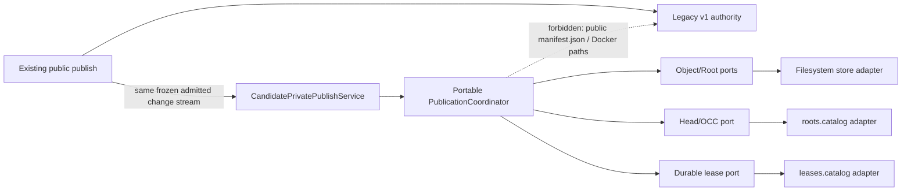
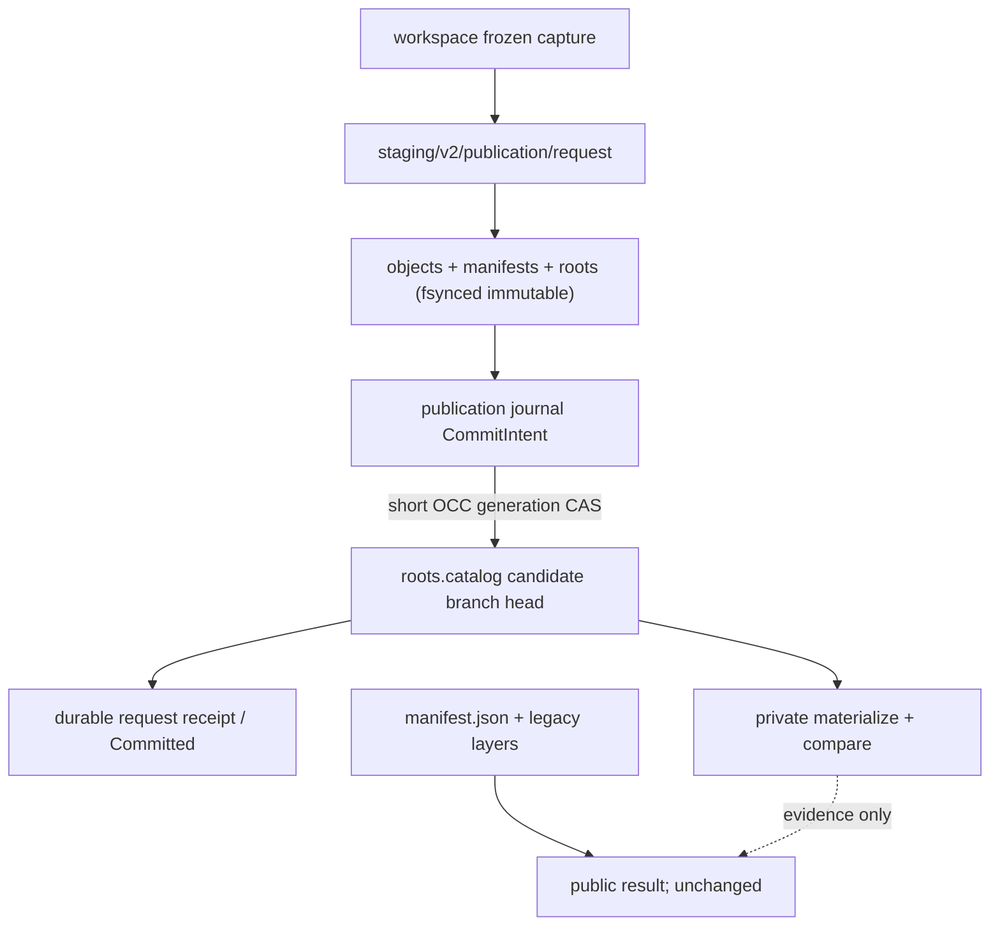
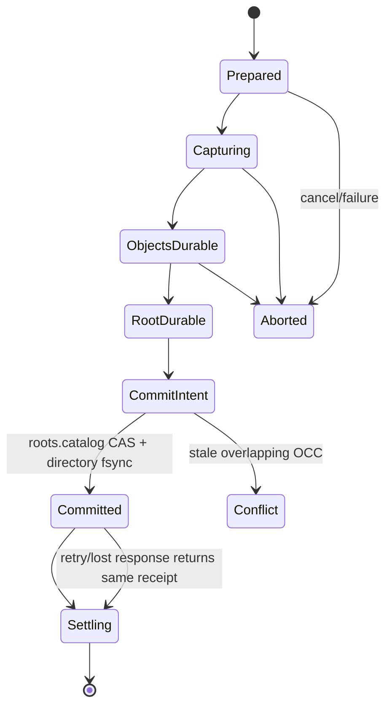

# Stage 07 — Durable candidate-private publication, OCC, leases, and recovery

Links: [implementation overview](../index.md) · [stage E2E plan](e2e_test.md) · [portable storage contract](../../prep/01-cdc-cas-space-time-materialization-spec.md) · [identity/recovery decision](../../prep/03-seqcdc-cas-and-squash-decision.md) · [quantitative contract](../../prep/04-seqcdc-space-time-complexity-and-acceptance-criteria.md)

Proof tier: **POC proof tier**. Candidate v2 publication is durable and packaged, but writes only an isolated validation branch. Legacy v1 remains the sole public publication authority until Stage 10.

## 1. Stage contract

| Item | Contract |
| --- | --- |
| Status | Proposed, implementation-ready |
| Depends on | Stage 06 and its Stage 00/02–05 ancestry: frozen baseline, portable schema/SeqCDC, shadow objects, verified materialization, and strict read activation. Stage 01 remains independent until Stage 10. |
| Owners / affected crates | `sandbox-runtime-layerstack-core`, `sandbox-runtime-layerstack`, `sandbox-runtime` publication/finalize orchestration, workspace capture seam, configuration, external publication E2E/benchmark lab |
| Objective | Durably publish immutable v2 roots with request idempotency, path OCC, fenced root/carrier/transaction leases, atomic head visibility, and deterministic restart recovery without changing the public legacy head. |
| Visible outcome | With `candidate_publish_private` explicitly enabled, a normal public legacy publish also drives one separately named candidate-validation transaction from the same frozen change stream; structured evidence exposes its private root/generation/receipt. |
| In scope | Portable publication/OCC values and ports; candidate validation-branch catalog; request receipts; streamed change merge; short generation CAS; durable journal/staging; leases/fencing; cancellation/retry/restart; private materialize/compare; failpoints. |
| Non-goals | No candidate public publication authority; no dual publisher for one logical head; no default candidate write; no retention deletion, pack/compaction/GC (Stage 08); no squash/remount (Stage 09); no authority cutover (Stage 10); no legacy deletion. |
| Entry | Stage 06 strict route, no-fallback, materialization, resource, graph, and rollback gates pass; publication input can be frozen after command admission is closed; implementation is on `upgrade-2.0-phase-1` created from the newest approved immutable product revision. Planning creates no branch. |
| Exit gate | Focused Rust and packaged probes prove atomic root/head commit, exact idempotent retry, disjoint merge/conflict/stale OCC, durable lease fencing, every visibility-boundary recovery class, no public-head mutation, bounded resources/space, and zero external dependency delta. |
| Rollback | Disable `candidate_publish_private`; stop new private transactions; recovery terminalizes journaled work, preserves committed immutable roots, releases expired/fenced leases, and removes only transaction-owned staging. Public legacy state and strict reads of prior roots remain valid. |

Authority and mode contract:

| Mode | Public writer/head | Candidate branch writer/head | Public reader | Fallback | Accepted roots | Failure behavior |
| --- | --- | --- | --- | --- | --- | --- |
| `legacy`, `shadow_write`, `dual_read_verify` | legacy v1 | none or derived shadow records | legacy v1 | not applicable | as prior stages | unchanged |
| `candidate_read_strict` | legacy v1 | none | opted-in v2 read | forbidden | strict v2 selection | fail closed |
| `candidate_publish_private` (orthogonal, opt-in) | **legacy v1 remains the one public authority** | **v2 publisher is sole authority only for `CandidateBranchId` validation namespace** | legacy default / Stage 06 strict opt-in | strict read fallback remains 0 | public v1, private v2 | candidate failure is structured and stage-blocking but cannot mutate/replace public result |

The candidate transaction is not a second publication of the public logical head. It has a distinct `CandidateBranchId`, Stage 02 `PublicationId`, OCC generation, catalog key, and receipt, consumes the already frozen/legacy-admitted change stream, and is never returned as the public publish result. Stage 10 deliberately changes that authority.

## 2. Current evidence

| Status | Repository evidence | Finding / preserved contract |
| --- | --- | --- |
| observed | `ephemeral-sandbox/crates/sandbox-runtime/layerstack/src/stack/ops/publish.rs:25-122` | Current publish plans/resolves/writes legacy physical layers under the stack writer path. |
| observed | `ephemeral-sandbox/crates/sandbox-runtime/layerstack/src/stack/publish/model.rs:5-64`, `PublishValidatedChangesRequest`, `ResolvedChangeset`, `PublishBase`, and `PublishValidatedChangesResult` | Existing publish DTOs are physical-layer oriented and must stay compatible for legacy authority. |
| observed | `ephemeral-sandbox/crates/sandbox-runtime/layerstack/src/stack/publish/plan.rs:42-139`, `PublishPlan` and `plan_publish` | Existing plan identifies changed entries; it is a capture seam, not the portable v2 transaction model. |
| observed | `ephemeral-sandbox/crates/sandbox-runtime/layerstack/src/stack/publish/resolve.rs:25-89,260-289`, `MergedPath`, `FileBytes`, `resolve_publish_changes`, `read_file`, and `read_command_bytes` | Existing OCC/merge is whole-file/path based; Stage 07 must preserve conflict semantics while moving candidate state to durable root generations. |
| observed | `ephemeral-sandbox/crates/sandbox-runtime/layerstack/src/stack/layer/write.rs:9-40`, `write_layer_changes`; `ephemeral-sandbox/crates/sandbox-runtime/layerstack/src/storage/fs.rs:113-139,151-179,201-240`, `write_atomic`, `fsync_dir`, `syncfs_storage_root`, `read_manifest`, and `write_manifest` | Current writes already use scoped filesystem and atomic write/fsync/rename primitives. |
| observed | `ephemeral-sandbox/crates/sandbox-runtime/workspace/src/overlay/capture.rs:63-114,142-194,241-388`, `PendingChange`, `capture_upperdir`, and its path/whiteout helpers | Capture currently retains mutable physical file sources until `CapturedChanges` is built; publication must consume a frozen/admission-closed snapshot, not read while commands mutate it. |
| observed | `ephemeral-sandbox/crates/sandbox-runtime/workspace/src/service/impls/capture_changes.rs:10-80`, `WorkspaceRuntimeService::{capture_changes,capture_changes_after_holder_quiesced}` and `capture_upperdir` | Workspace capture service is the provider adapter boundary for a portable change stream. |
| observed | `ephemeral-sandbox/crates/sandbox-runtime/layerstack/src/stack/lease/registry.rs:17-34,50-83,103-107`, `LeaseRegistry`, `lock_shared_registry`, and the shared registry map | Existing leases are in-process and disappear on restart; insufficient once durable roots/carriers can outlive a daemon. |
| observed | `ephemeral-sandbox/crates/sandbox-runtime/layerstack/src/stack/lease/rewrite.rs:1-12,25-80`, `SubstitutionRecord` and `LayerStack::{record_substitution,acquire_rewritten_lease}`; `ephemeral-sandbox/crates/sandbox-runtime/layerstack/src/stack/lease/cleanup.rs:68-136`, `SweepReport` and `sweep_storage_locked` | Substitution/cleanup knowledge is process-local and cannot be authoritative for v2 reachability. |
| observed | `ephemeral-sandbox/crates/sandbox-runtime/operation/src/layerstack/service/impls/export.rs:62-103,184-298`, `run_export_layerstack`, `run_read_export_chunk`, and `ExportFlight` | Existing export has restart-rerun semantics and workspace spool; publication gets its own journal/staging and must not overload `.export`. |
| proposed from Stages 02–06 | portable `RootId`, verified objects/manifests/materializations and strict reads | Stage 07 reuses identities/ports and never derives identity from a carrier path. |
| inferred | Holding the current whole-stack writer lock for chunking/I/O would serialize disjoint publishes | Build/merge must occur outside a brief fenced generation CAS. |
| open | Public legacy publish response lacks a v2 receipt field | Keep public DTO unchanged; expose private receipt through bounded observation/artifact, not a premature public storage API. |

## 3. Resulting file and folder structure

### Product, configuration, tests, and evidence

```text
ephemeral-sandbox/
├── crates/sandbox-runtime/layerstack-core/src/
│   ├── publication.rs                                              [add] — IDs, intents, receipts, state machine, ports
│   ├── occ.rs                                                      [add] — expected head, changed-path merge/conflict result
│   ├── lease.rs                                                    [add] — provider-neutral durable lease/fence values and port
│   ├── recovery.rs                                                 [add] — durable-state reconciliation decisions
│   ├── manifest.rs                                                 [modify] — streaming merge/canonical root construction
│   ├── object.rs                                                   [modify] — idempotent durable object-write port
│   ├── error.rs                                                    [modify] — publication/OCC/lease/recovery errors
│   └── lib.rs                                                      [modify] — exports
├── crates/sandbox-runtime/layerstack/src/
│   ├── publication/mod.rs                                          [add] — candidate branch publisher
│   ├── publication/journal.rs                                      [add] — fsynced transaction journal
│   ├── publication/catalog.rs                                      [add] — roots.catalog/head CAS/receipt adapter
│   ├── publication/merge.rs                                        [add] — bounded external changed-path merge
│   ├── publication/recovery.rs                                     [add] — startup replay/fencing
│   ├── lease/mod.rs                                                [add] — durable root/carrier/transaction lease adapter
│   ├── lease/catalog.rs                                            [add] — leases.catalog generation
│   ├── lease/clock.rs                                              [add] — injected bounded lease clock/test clock
│   ├── storage/fs.rs                                               [modify] — transaction-scoped fsync/rename primitives
│   └── stack/lease/                                                [modify] — legacy bridge only; no v2 authority
├── crates/sandbox-runtime/operation/src/
│   ├── layerstack/service/impls/publish_candidate_private.rs       [add] — post-legacy private orchestration
│   ├── layerstack/service/core.rs                                  [modify] — inject publisher/lease/recovery ports
│   ├── workspace_session/service/impls/finalize.rs                 [modify] — freeze/reuse admitted change stream
│   ├── services.rs                                                 [modify] — recover before admission; validate mode
│   └── projection/observability.rs                                 [modify] — private receipt/OCC/lease/recovery evidence
├── crates/sandbox-config/src/configs/runtime.rs                    [modify] — add default-off `candidate_publish_private`
├── crates/sandbox-runtime/layerstack-core/tests/
│   ├── publication_golden.rs                                      [add]
│   └── publication_properties.rs                                  [add]
├── crates/sandbox-runtime/layerstack/tests/
│   ├── publication_transaction.rs                                 [add]
│   ├── publication_occ.rs                                         [add]
│   └── publication_recovery.rs                                    [add]
└── crates/sandbox-runtime/operation/tests/candidate_private_publish.rs [add]

ephemeral-sandbox-test/
├── e2e/runtime/layerstack_phase1/
│   ├── publication_helpers.py                                     [add]
│   ├── test_candidate_private_publication.py                      [add]
│   └── test_spec.md                                               [modify] — stable Phase 1 declarations
├── benchmark/presets/candidate-publication-tiny.yml               [add]
├── benchmark/tests/fixtures/golden/layerstack_phase1/
│   ├── candidate-publication-tiny.json                            [add] — deterministic corpus manifest
│   └── publication_result_v1.json                                [add] — result validation fixture
├── .e2e-state/runs/<run-id>/evidence/                             [add] — emitted at run time; route/tree/resource/dependency evidence
├── .benchmark-state/runs/<benchmark-run-id>/                      [add] — emitted at run time; lab-owned raw artifacts
└── .benchmark-state/results/<benchmark-run-id>/                   [add] — emitted at run time; lab-owned derived artifacts

ephemeral-sandbox-docs/implementation-plan/2.0 migration/phase 1/implementation/stage_07_durable_publication/
├── spec.md                                                        [add]
└── e2e_test.md                                                    [add]
```

### Resulting runtime storage

Every entry is owner-only and masked from workloads. Logical source-of-truth entries are immutable; catalogs/journals use file+directory fsync and atomic rename. Provider locators/carriers/leases are not `RootId` inputs.

```text
/eos/
├── runtime/daemon/
│   ├── runtime.sock                                               [existing] runtime IPC; M
│   └── runtime.pid                                                [existing] writer-instance lifecycle; M
├── layer-stack/                                                    [existing parent] legacy public + candidate private
│   ├── .storage-writer.lock                                       [existing] process exclusion/fencing root; M
│   ├── manifest.json                                              [existing] **sole public v1 head**; legacy atomic writer; L_hot+M
│   ├── workspace.json                                             [existing] legacy binding; M
│   ├── base/B000001-base/                                         [existing] legacy native base; L_hot
│   ├── layers/<layer_id>/                                         [existing] legacy whole-file layers; L_hot+H_cold
│   ├── staging/<layer_id>.staging/                                [existing] legacy publication staging; P_staging
│   ├── .layer-metadata/
│   │   ├── <layer_id>.digest                                     [existing] v1 digest metadata; M
│   │   └── <layer_id>.bytes                                      [existing] v1 byte-count metadata; M
│   ├── format-v2.json                                             [compat] format/chunker/hash marker; not RootId; M
│   ├── roots/v2/<prefix>/<RootId>.root                            [compat/add] immutable canonical roots; candidate source; RootId yes; M
│   ├── manifests/v2/<prefix>/<TreeManifestId>.manifest            [compat/add] immutable reconstruction graphs; typed identity; M
│   ├── objects/v1/loose/<prefix>/<ObjectId>.obj                   [activate] first candidate loose-payload writer for new Stage 07 publication bytes; immutable typed bytes; Stage 04–06 verified v1 carrier-range locators remain valid
│   ├── packs/v1/
│   │   ├── open/                                                   [compat reserved] Stage 08 writer/limits
│   │   └── sealed/                                                 [compat reserved] Stage 08 writer/limits
│   ├── indexes/v1/
│   │   ├── pages/<page_id>.idx                                    [compat] bounded immutable pages; M
│   │   └── index.catalog                                          [compat] atomic generation; M
│   ├── catalogs/v1/
│   │   ├── roots.catalog                                         [modify] candidate branch head `(RootId, publication_generation)` and request receipts; commit linearization; M
│   │   ├── locators.catalog                                      [compat] durable object locators/generations; not RootId; M
│   │   ├── materializations.catalog                              [compat] MaterializationKey=(RootId,backend_kind,backend_format_version,target_profile) -> MaterializationId, generation, carriers; not RootId; M
│   │   ├── leases.catalog                                        [add] authoritative lease generation/fences; M
│   │   └── retention.catalog                                     [compat reserved] Stage 08 retention policy
│   ├── journals/v1/
│   │   ├── publication/<PublicationId>.journal                   [add] state, branch, expected/committed generation, receipt; fsynced; M/P_staging
│   │   ├── hydration/                                            [compat] Stage 05 transactions
│   │   ├── squash/                                               [compat reserved] Stage 09
│   │   ├── compaction/                                           [compat reserved] Stage 08
│   │   └── migration/                                            [compat] migration evidence
│   ├── staging/v2/
│   │   ├── publication/<PublicationId>/                          [add] transaction-owned object/root/catalog temps; never reader-visible; P_staging
│   │   ├── hydration/                                            [compat]
│   │   ├── squash/                                               [compat reserved]
│   │   ├── compaction/                                           [compat reserved]
│   │   └── migration/                                            [compat]
│   ├── leases/v1/<lease_id>.lease                                [add] durable root/carrier/transaction lease record; fence/TTL; M
│   ├── retention/v1/                                             [compat reserved] Stage 08 epochs
│   ├── maintenance/v1/                                           [compat reserved] Stage 08 cursors
│   ├── materializations/docker-overlayfs/v1/<MaterializationId>/
│   │   └── carriers/<ordinal>/                                   [compat] verified lower carrier; carrier lease protects active use; L_hot
│   ├── quarantine/v1/<typed-id>/                                 [compat] corrupt state/evidence; never authority
│   └── trash/v1/                                                 [compat reserved] Stage 08 grace deletion
├── workspace/
│   ├── manager.json                                              [existing] recovery catalog; outside session deletion
│   ├── .export/<spool_id>                                        [existing] export scratch only
│   └── <workspace_session_id>/
│       ├── upper/                                                 [existing] frozen before publish; ΣU_active
│       ├── work/                                                  [existing] provider work; ΣU_active
│       └── executions/<execution_id>/
│           └── transcript.log                                    [existing] command scratch; ΣU_active
├── namespace_execution/<legacy>/transcript.log                    [compat][remove-later Stage 11] no new writes
└── storage/
    ├── file_auditability/                                        [existing] audit
    └── workspace_recovery/                                       [existing] bounded failure recovery
```

Delta from Stage 06: candidate private publication actively writes immutable roots/manifests/objects, publication journals/staging, candidate branch generations/receipts, and durable leases. `manifest.json` and the legacy public response are never modified by the candidate transaction. Retention/GC/trash remain inactive until Stage 08.

## 4. SRP, SOLID, and coupling design

Current legacy publication binds physical layers, locking, merge, and visibility. Extending that manager with v2 objects, request receipts, leases, and recovery would create a god object and hold the global lock across O(`U`) work. The smallest safe design is a portable transaction coordinator over narrow persistence/OCC/lease ports, a provider capture adapter, and one short catalog CAS.

| Component | Single responsibility | Depends on | Must not know/do |
| --- | --- | --- | --- |
| `PublicationCoordinator` | Drive one durable state machine and return idempotent receipt | portable ports/values | `/eos`, OverlayFS, public mode policy |
| `ChangeStream` | Yield canonical frozen changes | provider-neutral interface implemented by workspace adapter | mutable upper after admission closes |
| `ObjectSink` / `RootStore` | Idempotently durabilize typed objects/root | portable persistence ports | provider carrier/mount |
| `OccMerger` | Stream changed-path base/head/intent and classify disjoint/conflict | manifest/index ports | acquire long filesystem lock |
| `CandidateHeadStore` | Generation compare-and-swap and receipt lookup | catalog adapter | public `manifest.json` |
| `DurableLeaseStore` | Acquire/renew/release/fence root/carrier/transaction leases | catalog/filesystem adapter | retention/GC policy |
| `PublicationRecovery` | Reconcile journal against authoritative catalogs/fences | persistence adapters | trust journal label alone |
| `CandidatePrivatePublishService` | Trigger after legacy admission/commit, select validation branch, emit outcome | operation policy | publish a competing public root |

Key portable ports:

```rust
pub trait CandidateHeadStore {
    fn load(&self, branch: &CandidateBranchId) -> Result<Head, HeadError>;
    fn committed_by_id(
        &self, branch: &CandidateBranchId, publication_id: PublicationId
    ) -> Result<Option<PublicationReceipt>, HeadError>;
    fn compare_and_swap(
        &self, expected: Head, prepared: PreparedRoot, fence: FencingEpoch
    ) -> Result<PublicationReceipt, CommitError>;
}

pub trait DurableLeaseStore {
    fn acquire(&self, request: LeaseRequest) -> Result<LeaseGuard, LeaseError>;
    fn renew(&self, token: &LeaseToken) -> Result<LeaseToken, LeaseError>;
    fn release(&self, token: LeaseToken) -> Result<(), LeaseError>;
}
```

Portable values contain IDs, generations, canonical metadata, and bounded counters—not paths, inode/mount handles, Docker, clocks as identity, or locators. Filesystem stores remain concrete because Phase 1 has one embedded implementation; ports exist at Phase 3/backend and durability seams. Construction: config → filesystem catalogs/stores/lease clock → core coordinator → candidate-private operation service. Provider capture errors translate at the adapter; persistence/integrity/OCC remain typed; operation projection maps them without changing legacy response.

| Manifest/graph | Baseline packages/features/edges | Resolved package/version delta | Feature delta | Direct external edge delta or relocation | System/runtime delta | Internal edge change | Evidence |
| --- | --- | --- | --- | --- | --- | --- | --- |
| Cargo resolved graph | Stage 06 canonical external set | none | none | none | none | core publication modules consumed by LayerStack adapter; operation uses existing LayerStack/workspace edges | canonical JSON diff |
| Manifests/lock | Stage 06 | none | none | none; no SQLite or clock crate | none | workspace-only modules/edges | git diff + direct-edge multiset |
| Python environment | Stage 06 | none | none | none | none | cases/preset only | frozen snapshot |
| Host/target runtime | existing Rust/fsync/rename/lock/syscalls | none | none | none | no DB/service/shell/helper | none | current-host failpoint/no-helper proof |

| Boundary | Host/image assumption before | Assumption after | Portable core / provider adapter | Evidence now | Later evidence |
| --- | --- | --- | --- | --- | --- |
| Root/OCC/lease encoding | v2 canonical identities, no durable v2 publisher | canonical fixed-width/versioned journal/catalog/lease values | portable core + filesystem store | goldens/current host restart | cross-host/arch Stage 11 |
| Capture | Linux workspace upper | frozen change stream adapter | provider adapter | Ubuntu 24.04 packaged publish | Phase 3 providers |
| Durability | same-filesystem fsync/atomic rename | explicit catalog linearization/fences | persistence adapter | failpoints + restart current Docker host | release triples Stage 11 |
| Target image | no storage helper | unchanged | host provider adapter | public edit/publish plus read-only/non-root runtime variants of sole pinned Ubuntu 24.04 OCI index `sha256:4fbb8e6a8395de5a7550b33509421a2bafbc0aab6c06ba2cef9ebffbc7092d90` | cross-image portability after Phase 1; not an acceptance or retirement gate |

Future impact: Phase 2 branches/checkpoints/MCTS use `CandidateBranchId`, `RootId`, expected generation, and leases without provider paths; another object backend implements object/root/head ports; Firecracker/WASM supplies capture/materialization adapters while publication identity/OCC stays unchanged. Cycle audit forbids core → adapter/operation/config, lease store → GC policy, and recovery → public CLI. No manager owns capture, transaction, catalog, lease, recovery, and mode. Durable leases survive; candidate validation namespace and private trigger are transitional until Stage 10 authority/cutover and Stage 11 cleanup policy.

## 5. Type, class, and field design

| Type / status / owner | Exact fields | Ownership, validation, persistence, bounds | Release, errors, concurrency |
| --- | --- | --- | --- |
| `PublicationId` — frozen in Stage 02, core public | `[u8; 16]` transparent newtype | caller-stable opaque bytes; nonzero; appears only as `PublicationIdentity.id` in the canonical root and as the idempotency key in journal/catalog/receipt | copy value; duplicate returns same receipt; representation and codec cannot change |
| `CandidateBranchId` — new, core public | bounded canonical bytes, max 128 | validation namespace, not a host path; serialized in catalog/journal but not tree manifest | rejects empty/noncanonical/reserved public name |
| `Head` — new, core public | `branch`; `root_id: Option<RootId>`; `publication_generation: u64` | durable catalog snapshot; generation monotonic/no overflow | stale CAS typed conflict |
| `PublicationIntent` — new, core public | `publication_id`; `branch`; `expected_head`; `base_root`; `changes: ChangeStreamId`; `author: BoundedBytes`; `required_capabilities`; `coalesce_key?` | one admitted frozen input; metadata bounds; transient with journal identity | no full tree/file ownership |
| `PublicationReceipt` — new, core public | `publication_id`; `branch`; `root_id`; `tree_manifest_id: TreeManifestId`; `publication_generation`; `outcome: Committed|CommittedSettling`; byte/chunk/path counters | durable through root catalog/journal; exact retry value | immutable; response loss safe |
| `PublicationState` — new, core serialized | `Prepared`, `Capturing`, `ObjectsDurable`, `RootDurable`, `CommitIntent`, `Committed`, `Settling`, `Aborted`, `Conflict` | monotonic; fixed u8/version; authoritative head decides commit | illegal/corrupt transition fails closed |
| `ChangedPathRecord` — new, core | canonical `path_bytes`; `base_entry_id?`; `new_entry_id?`; `change_kind`; `blame_ref?` | streamed/sorted; ≤256 B + encoded path amortized; no lossy UTF-8 | conflict holds bounded samples only |
| `LeaseRequest` / `LeaseToken` — new, core | `lease_id:[u8;16]`; `kind: Root|Carrier|Transaction`; typed subject; `owner_instance:[u8;16]`; `fencing_epoch:u64`; `expires_at_unix_ms:u64`; `catalog_generation:u64` | durable, versioned; bounded TTL; clock excluded from identity; token fenced by writer instance/catalog | renew/release CAS; stale token rejected |
| `PublicationTxn` — new, adapter private | intent; state; journal/staging paths; lease tokens; cancel; commit token; workers; byte permit; counters | one owner; ≤4 storage workers; journaled; no cloned coordinator back-edge | cancel revokes commit, joins ≤5 s; post-commit cannot abort |
| `PrivatePublicationConfig` — modified config | `enabled: bool=false`; bounded branch scope; lease TTL/renew interval within constants; max admitted ops | serialized/default-off; rejects public/default branch names and unsafe TTL | reload affects new attempts; recovery always runs |

`ChangeStreamId` identifies a frozen adapter-owned spool/snapshot and is not a filesystem locator in core; the adapter owns its concrete path and cleanup. Collections: metadata queue 16/≤64 KiB; external merge fan-in 8 with 64 KiB/read; one 256 KiB manifest/journal encoder/admitted op; ≤4 global workers; ≤4 borrowed chunks; 64 MiB global byte permits; shared cache 4,096×4 KiB. `Arc` is limited to immutable stores/supervisor/cancel state; tasks do not own the supervisor/join set and all back-references are `Weak`/IDs. Existing public legacy publish DTOs/LayerStack v1 models and Stage 02–06 identities/routes remain unchanged.

## 6. Data and compatibility design

The v2 root record is exactly the immutable Stage 02 `RootRecordV2`: `format`, `required_capabilities`, `chunk_profile`, complete `tree_manifest: TreeManifestId`, `parent`, `base`, and `publication: PublicationIdentity { generation, id: PublicationId }`, in that canonical order and with the frozen codec. `CandidateBranchId`, author, coalescing key, paths, locators, and receipt counters remain catalog/journal metadata outside `RootId`. `RootId` is a domain-separated typed SHA-256 of those exact root-record bytes. `TreeManifestId`, `ObjectId`, and chunk hashes remain separate typed domains. Integers use explicit widths and big-endian canonical encoding; byte strings are length-prefixed; raw paths are canonical byte-sorted; duplicates and noncanonical paths fail. SeqCDC remains `seqcdc-scalar-author-v1`: increasing, min 8,192, target 16,384, max/window 32,768, threshold 5, opposing 50, jump 512.

Publication consumes only frozen upper changes/required metadata and streams O(`U+E+K`); it does not scan/materialize the merged workspace. It may coalesce repeated edits before its durable head linearization, but every durably committed root remains a distinct root. OCC diffs changed paths via disk-backed pages or external sorted runs: disjoint changes rebase/merge against the current head and retry one bounded CAS; overlapping incompatible base/head/new entry IDs return conflict. Root ancestry is identity-bearing provenance but weak retention; reconstruction manifest/object references are strong.

Durability order:

1. create/fsync `Prepared` journal and transaction lease;
2. stream canonical changes; write/verify/fsync new objects and locator entries idempotently;
3. write/fsync manifest and immutable root, then containing directories;
4. persist/fsync `CommitIntent(expected head, prepared root, fence)`;
5. under the short catalog generation guard, revalidate expected head/fence and atomically write/fsync/rename `roots.catalog`;
6. fsync catalog directory — this durable generation swap is the linearization point;
7. persist terminal receipt/`Committed`, release transaction/base leases, and trigger private materialize/compare.

Legacy v1 is untouched and readable throughout. Candidate private accepts only v2. Upgrade initializes additive catalogs; downgrade ignores validation heads but preserves immutable bytes/terminal receipts so re-upgrade retry is safe. Corrupt/truncated journal/catalog/root/object/lease records fail typed validation; recovery trusts the last valid authoritative catalog generation, quarantines evidence, and never guesses a commit. No acceleration is introduced.

## 7. Workflow and failure semantics

Happy path: public finalize fences commands and freezes one capture → legacy v1 publishes and returns as before → private service obtains its distinct branch/request, checks terminal receipt, acquires parent/transaction leases, streams objects/root outside the commit guard, performs OCC merge, writes commit intent, CAS-swaps the private branch head, records receipt, releases transaction leases, privately materializes/compares, and emits evidence.

Idempotency: same `(branch, publication_id)` before commit resumes/reconciles one transaction; after commit returns the exact root/generation/receipt even if the original response was lost. Reuse with different intent digest is an error. Stale expected head either performs one bounded disjoint rebase or returns conflict; no last-writer overwrite. Concurrent disjoint throughput is measured without serializing chunk/I/O under the commit guard.

Cancellation before commit revokes a fenced commit token, stops admission, cancels and joins workers within 5 seconds, releases permits, and journals staging for recovery if blocking I/O does not stop. After linearization it returns `CommittedSettling`; it cannot roll back the root. Disk full before the catalog swap leaves the old head; disk full/lost response after it is recovered as committed. Startup takes the writer-instance fence, replays bounded journals against catalogs, terminalizes or resumes, releases/fences stale leases, and removes only proven transaction-owned unreachable staging. Corrupt catalog is fail-closed/no new candidate publication; legacy public operation remains available under its existing behavior but the Stage 07 gate fails.

Stage 07 marks reachability and leases but does not delete objects/carriers. Retention, locator evacuation, packs, compaction, trash grace, and bounded GC are Stage 08; squash/remount Stage 09. Thus a lease prevents later operations and is testable now, but no Stage 07 code treats lease expiry as deletion permission.

| Resource retained in memory | Owner | Acquire point | Hard item/byte bound and permit | Normal release | Error/cancel/panic release | Shutdown/restart behavior | Evidence |
| --- | --- | --- | --- | --- | --- | --- | --- |
| SeqCDC ring/views | publication worker | changed-file stream | 32 KiB ring/worker; ≤2 views/stream, ≤4 globally | chunk consumed | RAII before error | none retained | live/high-water views |
| Read/object-write buffers | worker | capture/object write | bounded under 64 MiB global permits; no complete file | flush/object durable | drop/permit return | durable object reused | buffers/permits |
| Metadata queue | coordinator | capture | 16 descriptors/≤64 KiB | drained | close/cancel/join | queue not replayed | item/byte gauges |
| External merge readers | OCC merger | sorted run merge | fan-in 8 ×64 KiB/read | run complete | close/delete txn runs | journal identifies staging | readers/FDs/bytes |
| Manifest/journal encoder | transaction | durable transition | ≤256 KiB/admitted op | fsync/drop | drop, journal recovery | replay bounded record | live bytes |
| Workers/tasks/join handles | transaction/supervisor | admitted publish | ≤4 global storage workers; configured bounded attempts | owner joins | cancel/revoke/join ≤5 s; panic typed | fenced recovery owns residue | active/join gauges |
| Byte permits | storage supervisor | before buffers/work | 64 MiB global | RAII | RAII/panic guard | rebuilt after reconciled recovery | in-use/high-water |
| Index cache | storage service | OCC/locator lookup | 4,096×4 KiB=16 MiB | retained/evicted | corrupt page evicted | rebuilt | cache gauge |
| Txn/lease registries | supervisor + durable stores | prepare/acquire | bounded admitted ops + active sessions; compact IDs; durable records | terminal receipt/release | fence/recovery | catalogs authoritative | counts/ages |
| Frozen capture handle | operation finalize | command fence | one per admitted publication; bytes on disk charged `C_capture`; O(1) in memory | private+legacy consumers finish | journaled ownership/recovery | provider cleanup after reconcile | handles/allocated bytes |
| FDs/mappings | adapters | stream/fsync/catalog | bounded by workers + merge fan-in + constant; mmap not required | close before terminal return | RAII | OS close + durable replay | FD/mapping gauges |

Quiescence, polled every 100 ms for ≤5 seconds after settling, requires no nonterminal publication, workers/tasks/queues/merge readers/borrowed views/permits/frozen capture handles/extra FDs; terminal receipt is durable; transaction leases released; active root/carrier leases equal declared sessions; staging absent; journals terminal; cache bounded. Missing stage-gating gauge blocks. There are no strong cycles or detached tasks: supervisor owns join handles; tasks own service clones and cancellation children, never the supervisor.

## 8. Complexity and performance contract

Let `U` be captured bytes, `E` entries, `K` chunks, `Q` changed paths, `N` relevant index entries, and `C_capture` frozen capture allocated bytes.

| Operation | Inputs | Expected time | Worst-case time | Peak app memory | Temporary disk | Settled physical disk | I/O pattern |
| --- | --- | --- | --- | --- | --- | --- | --- |
| Prepare/idempotency lookup | branch/request | O(log pages) | bounded sequential pages | cache+O(1) | journal | terminal receipt M | metadata |
| Capture/chunk/object durabilize | `U,E,K` | O(`U+E+K`) | same | bounded workers/buffers/permits | frozen capture + object temps/runs | unique objects + metadata | sequential streaming |
| OCC diff/rebase | `Q,N` | O(`Q log N`) or bounded sequential pages | external merge O(`Q log Q`) | fan-in 8×64 KiB + bounded records | sorted runs ≤changed metadata | root/manifest M | disk pages/sequential runs |
| Root/manifest durable write | changed manifest | O(changed metadata) | O(`E` manifest stream) | ≤256 KiB encoder | temp root/manifest | immutable root/manifest | write/fsync/rename |
| Head commit | expected/current head | O(1) catalog generation swap | bounded catalog page rewrite | ≤256 KiB | one catalog temp | one catalog generation/receipt | short lock, fsync/rename |
| Retry after lost response | branch/request | O(log pages) | bounded scan | O(1)+cache | 0 | 0 | metadata only |
| Recovery | `J` journals/leases | O(`J` + affected staging metadata) | bounded streaming per txn | one txn + capped queues | existing residue | terminal journals/receipts | catalog-first replay |
| Private post-commit materialize/compare | `R,E` | Stage 05 O(`R+E`) | same | Stage 05 caps | carrier staging | rebuildable carrier | sequential |

Complete physical accounting is `L_hot + H_cold + ΣU_active + P_staging + M`. Publication peak must be `C_capture + ≤5%` transaction overhead, excluding durable new unique payload that becomes `H_cold`; there is never a second complete capture. Settled journal/recovery residue is `≤1 MiB + min(1% of retained payload,64 MiB)` with no pending transaction.

| Inherited gate | Disposition | Exact stage contract |
| --- | --- | --- |
| SeqCDC/profile/chunk count | stage-gating | frozen scalar profile; `ceil(U/32KiB) ≤ K ≤ ceil(U/8KiB)`, final short chunk allowed |
| Publication correctness/idempotency/OCC/recovery | stage-gating | one private authority/branch, atomic head, exact retry receipt, disjoint merge/conflict, every Rust failpoint |
| Publish time | stage-gating diagnostic | each op <60 s; small edit diagnostic against p95 `baseline+15%+5 ms`; normative samples deferred-to-final |
| Concurrent disjoint throughput | stage-gating diagnostic | ≥90% baseline alert with OCC exact; normative corpus/sample deferred-to-final |
| Publication physical peak | stage-gating | `C_capture+≤5%`; no duplicate capture; full categories reported |
| Buffers/queue/workers/cache/managed memory | stage-gating | 32 KiB ring; ≤4 borrowed chunks/workers; queue 16/64 KiB; merge 8×64 KiB; encoder 256 KiB; cache 16 MiB; semaphore 64 MiB; managed/op ≤4 MiB excluding cache |
| RSS/logical release | stage-gating | RSS ≤384 MiB and ≤128 MiB above idle; no residual ephemeral owner/positive unexplained short slope |
| Metadata budgets | stage-gating diagnostic | chunk ≤96 B, segment ≤64 B, changed path ≤256 B+path; settled journal bound above; final scale confirmation deferred-to-final |
| Warm/cold activation/native command/PTY | inherited stage-gating regression sentinel from Stage 06; normative deferred-to-final | candidate publisher must not regress strict read route |
| Packs/slack/retention/GC/compaction | deferred-to-stage_08 | no deletion/packing in Stage 07 |
| Squash/remount | deferred-to-stage_09 | absent |
| Public candidate authority/mixed roots | deferred-to-stage_10 | private branch only |
| Full 64MiB/256MiB/1GiB × roots 1/16/64, amplification, required host/release-runner matrix using the sole pinned Ubuntu image, p50/p95 | deferred-to-final | Stage 11; each pair ≤5 min; cross-image portability is outside Phase 1 |

Working set is `shared_cache(16 MiB) + admitted_ops×(encoder≤256 KiB + queue≤64 KiB + txn state) + workers×(32 KiB ring + bounded I/O buffers) + merge fan-in(512 KiB)`, all under ≤4 workers and 64 MiB permits. Concurrency multiplies only admitted-operation terms; cache and worker/semaphore pools are global. All transaction terms release at quiescence; terminal receipts and active leases are bounded durable state, not heap growth.

## 9. Diagrams







## 10. Implementation sequence

1. **Portable values/goldens only.** Add publication/request/branch/head/receipt/lease encodings and state transition/property tests; preserve existing root/object vectors. Run core goldens. Rollback removes unused types.
2. **Persistence ports and adapters.** Add object/root/head/receipt/lease stores, fixed journal/catalog encodings, fsync/rename, injected lease clock, and corruption tests. No orchestration invokes them. Checkpoint isolates durability.
3. **Coordinator/idempotency.** Implement prepare→root durable state, duplicate request/different-intent rejection, cancellation fencing, bounded workers/queues/permits, and unit failpoints before visibility.
4. **OCC/head commit.** Implement disk-backed changed-path comparison, disjoint rebase, conflict, one short generation CAS, and exact linearization failpoints. Prove no reference to legacy `manifest.json`.
5. **Lease/recovery.** Acquire/release/fence root/carrier/transaction tokens; startup reconciles catalog-first, joins/fences residue, and never deletes reachable data. Run restart tests at every boundary.
6. **Provider/orchestration bridge.** Freeze one admitted capture, let legacy remain public, trigger one distinct candidate validation branch, privately materialize/compare, and emit receipt. Default off; rollback tested.
7. **Focused packaged tests/tiny sentinel.** Add cases/preset/schema; follow append-only reporting; collect exact authority/OCC/lease/recovery/memory/space/dependency evidence.
8. **Review/checkpoint.** Audit SRP/cycles, root/provider separation, all failpoints, full `/eos` tree, external zero delta, no target helper, and Stage 08–11 deferrals.

## 11. Observability

One bounded transaction record includes:

`storage_mode`, `public_write_authority=legacy_v1`, `candidate_branch_id_hash`, `publication_id`, `intent_digest`, `expected_root/generation`, `observed_root/generation`, `committed_root/generation`, `publication_state`, `idempotency_outcome=new|resumed|already_committed`, `occ_outcome=direct|disjoint_rebase|conflict`, `commit_linearized`, `objects/chunks/paths`, bytes scanned/hashed/reused/newly retained/read/written, journal fsync count, lease acquire/renew/release/fence counts, recovery action, private comparison/mismatch, and failure enum.

Resource evidence covers live/high-water buffers/borrowed views/workers/tasks/queues/permits/merge readers/cache/registries/transactions/leases/FDs/mappings/capture handles, quiescence, process RSS anonymous/file, cgroup current/peak, first/last settled delta/slope, and allocated bytes in every storage category. Avoid per-path/chunk logs and raw branch names; conflicts retain a bounded sample plus counts. Missing authority, linearization, idempotency, OCC, lease, recovery, or resource data blocks.

## 12. Completion checklist

- [ ] Candidate v2 publication owns only an isolated validation branch; public legacy head/response remains the sole public authority.
- [ ] Portable types/ports contain no host path, inode, mount, Docker, native locator, or clock-derived identity.
- [ ] Frozen capture is streamed once; root/object/schema/hash/goldens remain canonical and v1 fixtures are unchanged.
- [ ] Durable order, exact head linearization, idempotent lost-response retry, disjoint rebase, conflict, and stale OCC pass.
- [ ] Root/carrier/transaction leases are durable/fenced/recoverable; no Stage 07 deletion treats expiry as reachability proof.
- [ ] Every journal/object/root/head/receipt/lease failpoint is covered in Rust; representative packaged pre/post-commit restart passes.
- [ ] Full `/eos` layout, workspace scratch, legacy root, authority, lifecycle, identity, bounds, and complete physical space are verified.
- [ ] Worker/buffer/queue/merge/cache/semaphore/metadata/duration/physical peak/RSS gates and logical release pass.
- [ ] No strong cycle, detached work, unbounded registry, full-file/tree/history buffer, or long commit lock exists.
- [ ] Resolved external packages/features/direct edges and system/runtime/image helpers have exact zero delta.
- [ ] Focused helper-independence proof on the pinned Ubuntu 24.04 target, E2E/tiny artifacts, cleanup, and append-only report are complete.
- [ ] Packs/retention/GC, squash/remount, candidate public authority, and full qualification remain assigned to Stages 08, 09, 10, and 11.
