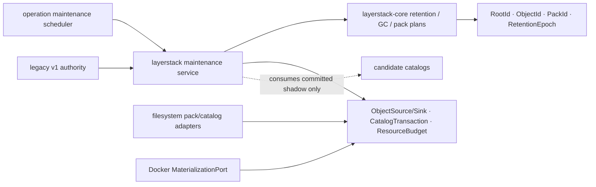
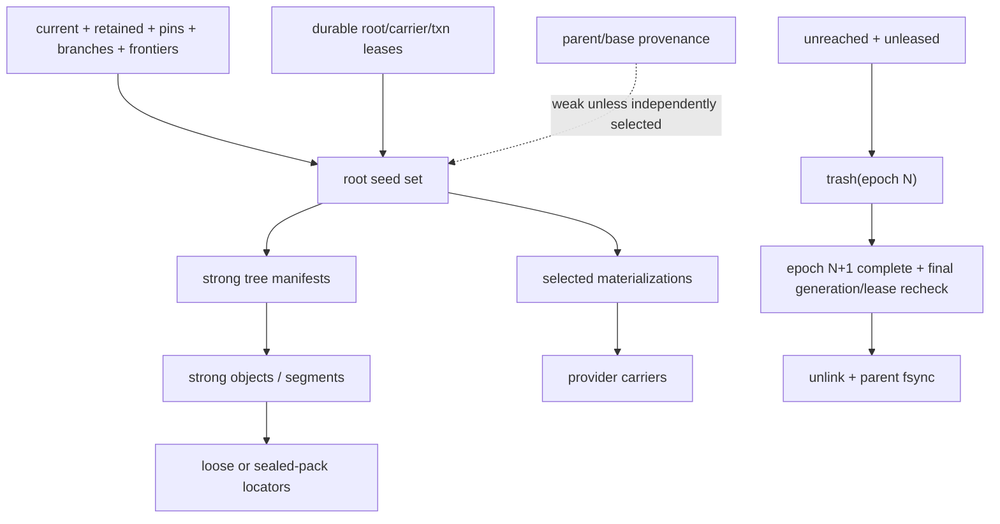
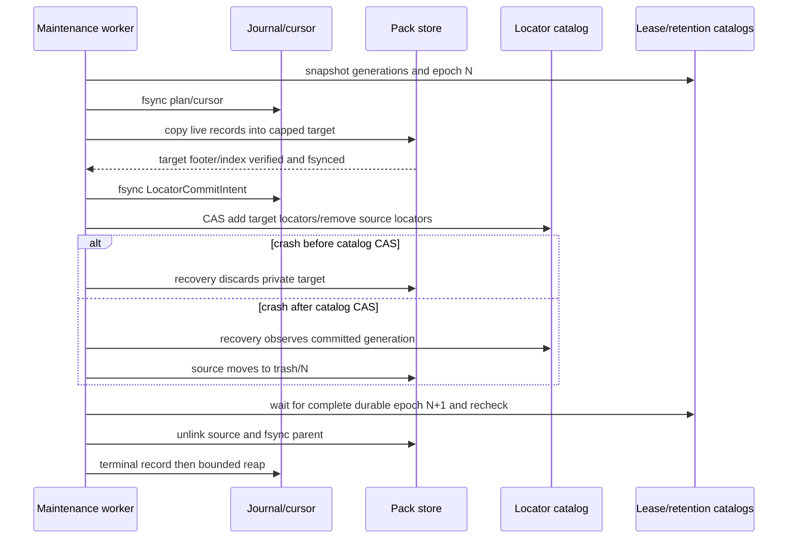

# Stage 08 — Bounded retention, garbage collection, and packs

[Implementation overview](../index.md) · [Stage 08 E2E plan](e2e_test.md) · [Preparation 03](../../prep/03-seqcdc-cas-and-squash-decision.md) · [Preparation 04](../../prep/04-seqcdc-space-time-complexity-and-acceptance-criteria.md)

Product root: `/Users/yifanxu/Ephemeral-AI-Lab/ephemeral-sandbox`
Test root: `/Users/yifanxu/Ephemeral-AI-Lab/ephemeral-sandbox-test`

## 1. Stage contract

| Field | Contract |
| --- | --- |
| Tier | **POC proof tier**; focused correctness, failure recovery, one 30–60 second tiny loop, and a coarse long-lived memory sentinel only |
| Branch policy | Planning creates no branch. Implementation requires the exact branch `upgrade-2.0-phase-1`, created from the newest approved immutable product revision before Phase 1 implementation begins. |
| Depends on | Stage 07 and its Stage 00/02–06 ancestry: frozen evidence, portable `layerstack-core`, SeqCDC/CAS objects, logical roots, Docker materialization, strict candidate reads, and durable candidate shadow publication. Stage 01 remains independent until Stage 10. |
| Useful capability at exit | Candidate storage has bounded sealed packs, deterministic retention selection, lease-safe graph marking, epoch-delayed deletion, resumable compaction, and last-locator evacuation. A crash at any maintenance boundary preserves a reconstructable committed root. |
| Authority | Legacy v1 remains the only publication and read rollback authority. Candidate maintenance consumes only candidate state derived from a committed legacy publication and must not mutate or delete any legacy carrier or v1 manifest. |
| Scope | Pack caps, locator catalog transactions, root-set retention, strong/weak graph rules, GC cursors, durable grace epochs, trash, pack compaction, evacuation, recovery, bounded work and memory, observations, focused tests |
| Non-goals | Identity-preserving squash (Stage 09), candidate authority (Stage 10), legacy retirement/default enablement, full performance/space/RSS/portability qualification (Stage 11), SIMD, another storage backend |
| Entry | Stage 07 has a recoverable candidate publication journal and byte-verified candidate roots while the configured authority remains `legacy_v1`; dependency fingerprints still equal Stage 00. |
| Exit | Focused tests prove leased/pinned/live root retention, unreachable unleased collection after the durable grace rule, all pack/transaction caps, crash-resumable locator replacement, zero last-locator loss, zero legacy mutation, bounded logical resource release, and zero external dependency delta. |
| Rollback | Disable candidate maintenance, recover or quarantine its private transactions, and continue entirely from untouched legacy `manifest.json`, `workspace.json`, `base/`, `layers/`, and `.layer-metadata/`. Candidate packs are never required for legacy rollback. |

Stage 08 bounds *work*, not only the final number of bytes. No scan, queue, journal, encoding, transaction, or in-memory root set may grow with total history without a persisted cursor or external run.

## 2. Current evidence

| Status | Repository-relative evidence | Current fact and consequence |
| --- | --- | --- |
| observed | `crates/sandbox-runtime/layerstack/src/stack/lease/registry.rs:10-31,50-67,103-107` | Leases are process-resident; they cannot protect durable candidate objects after restart. Stage 08 uses the Stage 07 durable lease catalog and treats lease generation as a deletion fence. |
| observed | `crates/sandbox-runtime/layerstack/src/stack/lease/cleanup.rs:68-136` | Current cleanup is a physical-manifest keep set. It does not traverse logical tree/object/locator reachability and is not reused as candidate GC. |
| observed | `crates/sandbox-runtime/layerstack/src/storage/fs.rs:113-139,161-179,201-240` | Same-filesystem temp, fsync, rename, parent fsync, and storage-root sync are available primitives for catalog/journal durability. |
| observed | `crates/sandbox-runtime/layerstack/src/stack/ops/publish.rs:55-115` | The current writer lock and OCC boundary are real. Maintenance must not become a second publication authority or hold that lock while scanning payload. |
| observed | `crates/sandbox-runtime/layerstack/src/model/mod.rs:74-97,170-228` | The v1 manifest names physical layers. It is retained untouched as the rollback truth through Stage 10. |
| observed | `crates/sandbox-runtime/layerstack/src/stack/squash.rs:160-348` | Existing squash replaces physical lowers but does not preserve a logical root/materialization distinction. Stage 08 does not call it for pack pressure. |
| observed | `crates/sandbox-runtime/operation/src/layerstack/autosquash_engine/worker.rs:49-122,195-228`, `AutosquashQueue` and `AutosquashEngine` | A coalescing background worker with explicit shutdown/join lifecycle ownership exists. Extend its scheduling ownership; do not add a daemon or independent scheduler. |
| observed | `crates/sandbox-runtime/operation/src/services.rs:316-404,731-785` | Operation services already compose runtime owners and bounded observations. Maintenance control remains an internal service capability. |
| observed | `crates/sandbox-runtime/workspace/src/lifecycle/remount.rs:203-306` | Provider leases overlap remount switching. Candidate carrier deletion must fence on these leases, not infer safety from root reachability alone. |
| observed | test `benchmark/backend/benchmark_lab/resource_sampling.py` | The benchmark laboratory already samples allocated/logical subtree bytes and public cgroup/container memory without requiring an image helper. |
| proposed | `sandbox-runtime-layerstack-core` | Add portable retention/mark planning and pack-record accounting behind the already-approved narrow storage/catalog ports. |
| inferred | Preparation 04 physical model | Pack slack, last-locator debt, and native carrier depth are separate pressures. Pack/locator pressure routes here and must not trigger squash. |

The architectural defect is that current deletion follows physical v1 layers rather than the complete reconstruction graph. A simpler age-only cleanup is rejected: age cannot protect a leased old root, distinguish a weak provenance parent, or prove that an object still has another committed locator.

## 3. Resulting file and folder structure

### Source and test delta

```text
ephemeral-sandbox/
├── crates/sandbox-runtime/layerstack-core/
│   ├── Cargo.toml                                             [modify] — internal modules only; no external edge
│   └── src/
│       ├── lib.rs                                             [modify] — expose cohesive maintenance types
│       ├── pack.rs                                            [add] — portable limits, record/footer accounting
│       ├── retention.rs                                       [add] — root-set selection and durable epochs
│       ├── gc.rs                                              [add] — strong-graph mark plan and bounded sweep
│       └── evacuation.rs                                      [add] — locator replacement state machine
├── crates/sandbox-runtime/layerstack/
│   ├── src/
│   │   ├── maintenance/
│   │   │   ├── mod.rs                                        [add]
│   │   │   ├── pack_writer.rs                                [add]
│   │   │   ├── retention.rs                                  [add]
│   │   │   ├── gc.rs                                         [add]
│   │   │   ├── compaction.rs                                 [add]
│   │   │   ├── evacuation.rs                                 [add]
│   │   │   └── recovery.rs                                   [add]
│   │   ├── storage/catalog.rs                                 [modify] — transactional locator/retention pages
│   │   └── service/observe.rs                                 [modify] — bounded maintenance gauges
│   └── tests/
│       ├── pack_bounds.rs                                     [add]
│       ├── retention_gc.rs                                    [add]
│       └── maintenance_recovery.rs                            [add]
└── crates/sandbox-runtime/operation/
    ├── src/layerstack/autosquash_engine/worker.rs             [modify] — schedule distinct maintenance work
    └── tests/layerstack_maintenance.rs                        [add]

ephemeral-sandbox-test/
├── e2e/runtime/layerstack_retention_gc/
│   ├── test_retention_gc.py                                  [add]
│   ├── test_pack_recovery.py                                 [add]
│   └── SPEC.md                                               [add]
└── benchmark/presets/layerstack-phase1-tiny-retention-gc.yml [add]
```

### Complete `/eos` view after Stage 08

Each bracket records
`change; class; owner; create→visible→durable→recover→delete; identity; access/authority; bound; space term; exposure`.
`truth` is authoritative candidate metadata, `carrier` is physical data, `txn` is private transactional state, `cache` is rebuildable, `scratch` is session-scoped. Every candidate entry is daemon-only and masked from workloads.

```text
/eos/
├── layer-stack/ [existing; truth root; LayerStack; install→open→directory fsync→boot scan→installation removal; v1+v2 namespace; daemon R/W, legacy authority; one; M; 0700/masked]
│   ├── .storage-writer.lock [existing; coordination; LayerStack; open→advisory lock→kernel durable scope→reacquire→close; none; daemon R/W; one FD; M; daemon-only]
│   ├── manifest.json [retained; legacy truth; legacy publisher; commit rename→active→file+parent fsync→v1 recovery→Stage11 retirement; physical v1 root; legacy R/W authority; one; L_hot metadata; daemon-only]
│   ├── workspace.json [retained; legacy truth; base builder; bootstrap→rename→fsync→validate→Stage11 retirement; v1 binding; legacy R/W; one; M; daemon-only]
│   ├── base/B000001-base/ [retained; legacy carrier; base builder; install→manifest-visible→syncfs→v1 recovery→Stage11 retirement; v1 physical ref; legacy R; one; L_hot; lower read-only/masked]
│   ├── layers/<layer_id>/ [retained; legacy carrier; legacy publish→v1 manifest commit→syncfs→v1 keep-set→Stage11 retirement; v1 physical ref; legacy R/W; current policy; L_hot; lower read-only/masked]
│   ├── staging/<layer_id>.staging/ [retained; legacy txn; legacy publisher; allocate→private→fsync→rename/reap→delete; none; legacy W; one admitted publish; P_staging; 0700/masked]
│   ├── .layer-metadata/
│   │   ├── <layer_id>.digest [retained; legacy digest metadata; legacy publisher; post-carrier→visible→atomic write→recompute→carrier deletion; v1 comparison only; legacy R/W; O(depth); M; daemon-only]
│   │   └── <layer_id>.bytes [retained; legacy byte-count metadata; legacy publisher; post-carrier→visible→atomic write→recompute→carrier deletion; v1 comparison only; legacy R/W; O(depth); M; daemon-only]
│   ├── format-v2.json [existing candidate; truth; format owner; Stage02 install→validated open→atomic fsync→reject/quarantine mismatch→Stage11+ version migration; format/profile IDs; candidate R; one; M; daemon-only]
│   ├── roots/v2/<prefix>/<RootId>.root [existing candidate; truth; publication; Stage07 commit→catalog-visible→fsync→journal recovery→retention+grace deletion; RootId typed SHA-256; candidate shadow R/W; retained-root bound; H_cold metadata; daemon-only]
│   ├── manifests/v2/<prefix>/<TreeManifestId>.manifest [existing candidate; truth; publication; object install→root-visible→fsync→strong-graph recovery→last-root+grace deletion; TreeManifestId; candidate shadow R/W; reachable graph; H_cold metadata; daemon-only]
│   ├── objects/v1/
│   │   └── loose/<prefix>/<ObjectId>.obj [existing→evacuated; carrier; object sink; write temp→verified rename→fsync→locator recovery→after sealed-pack locator+grace delete; ObjectId typed SHA-256; candidate shadow R/W; bounded staging/legacy loose debt; H_cold/P_staging; daemon-only]
│   ├── packs/v1/
│   │   ├── open/<PublicationId>.pack [add; txn carrier; pack writer; reserve→private append→flush/fsync→seal or truncate/reap→delete; records have ObjectId; candidate shadow W; ≤64MiB payload, ≤100k records, ≤80MiB allocation; P_staging; daemon-only]
│   │   └── sealed/<PackId>.pack [add; carrier; pack writer; verified seal→locator transaction visibility→file+dir fsync→footer/index recovery→evacuation+grace delete; PackId over typed bytes; candidate shadow R; exact caps above; H_cold; daemon-only]
│   ├── indexes/v1/
│   │   ├── pages/<page>.idx [existing→modify; cache/locator page; catalog store; page build→catalog generation→atomic fsync→generation rollback/rebuild→unreferenced-page grace delete; locator generation; candidate shadow R/W; 4KiB/page, shared cache 4096 pages; M/H_cold; daemon-only]
│   │   └── index.catalog [existing→modify; truth; catalog transaction; CAS generation→active→atomic fsync→journal replay/rollback→superseded generation grace delete; locator generation; candidate shadow R/W; paged/cursor-bounded; M; daemon-only]
│   ├── catalogs/v1/
│   │   ├── roots.catalog [existing; truth; publication; root CAS→visible→fsync→publication replay→retention removal; RootId+publication generation; candidate shadow R/W; paged; M; daemon-only]
│   │   ├── locators.catalog [existing→modify; truth; object store; add locator set→generation visible→fsync→evacuation replay→only after final recheck remove; ObjectId→locator generation; candidate shadow R/W; paged; M; daemon-only]
│   │   ├── materializations.catalog [existing; truth; provider catalog; hydrate→generation visible→fsync→provider recovery→lease+root release; MaterializationKey→MaterializationId/generation/carriers; candidate shadow R/W; active+retained bound; M; daemon-only]
│   │   ├── leases.catalog [existing→modify; truth; lease owner; acquire→catalog visible→fsync→expiry/owner recovery→explicit release; LeaseId/root/carrier/generation; candidate shadow R/W; active owner bound; M; daemon-only]
│   │   └── retention.catalog [add; truth; retention owner; policy evaluation→selected set visible→fsync→epoch recovery→next epoch supersedes; RootId selection+RetentionEpoch; candidate shadow R/W; paged/cursor-bounded; M; daemon-only]
│   ├── journals/v1/
│   │   ├── publication/<id>.journal [existing; txn truth; publisher; intent→phase records→fsync boundaries→roll forward/back→terminal reap; PublicationId; candidate shadow W; ≤256KiB/op; P_staging; daemon-only]
│   │   ├── hydration/<id>.journal [existing; txn truth; materializer; intent→verified carrier→fsync→recover/abort→terminal reap; MaterializationId; candidate shadow W; ≤256KiB/op; P_staging; daemon-only]
│   │   ├── squash/<id>.journal [existing reserved; txn truth; Stage09; absent now→private→N/A→boot ignores unknown absent entry→N/A; MaterializationId; no Stage08 writes; zero; zero; daemon-only]
│   │   ├── compaction/<id>.journal [add; txn truth; compactor; plan→replacement locators→each phase fsync→resume/rollback→terminal+grace reap; PackId/locator generation; candidate shadow W; ≤100k records or 64MiB payload and ≤256KiB journal; P_staging; daemon-only]
│   │   └── migration/<id>.journal [existing; txn truth; migration bridge; intent→phase→fsync→resume/abort→terminal reap; RootId; candidate shadow W; ≤256KiB/op; P_staging; daemon-only]
│   ├── staging/v2/
│   │   ├── publication/<id>/ [existing; txn; publisher; admit→private→bounded fsync→recover/reap→delete; PublicationId; candidate shadow W; one payload chunk/worker, four global; P_staging; daemon-only]
│   │   ├── hydration/<id>/ [existing; txn; materializer; admit→private→carrier fsync→recover/reap→delete; MaterializationId; candidate shadow W; 256KiB output/worker under 64MiB semaphore; P_staging; daemon-only]
│   │   ├── squash/<id>/ [existing reserved; txn; Stage09; absent→private→N/A→reap→delete; MaterializationId; no Stage08 writes; zero; zero; daemon-only]
│   │   ├── compaction/<id>/ [add; txn carrier; compactor; admitted batch→private target→fsync→journal recovery→seal/install or delete; PackId; candidate shadow W; ≤64MiB live payload/100k records/80MiB pack; P_staging; daemon-only]
│   │   └── migration/<id>/ [existing; txn; bridge; admit→private→fsync→recover/reap→delete; RootId; candidate shadow W; resource-budget bounded; P_staging; daemon-only]
│   ├── leases/v1/<LeaseId>.lease [existing→modify; truth mirror; lease owner; acquire→catalog generation→fsync→boot reconcile→release+grace delete; LeaseId; candidate shadow R/W; one/active lease; M; daemon-only]
│   ├── retention/v1/
│   │   ├── epochs/<RetentionEpoch>.epoch [add; truth; retention/GC; close epoch→catalog-visible→fsync→boot validate→after later complete epoch delete; RetentionEpoch+catalog generations; candidate shadow R/W; current+previous complete+active; M; daemon-only]
│   │   └── pins.catalog [add; truth; policy owner; pin CAS→visible→fsync→catalog recovery→explicit unpin; RootId; candidate shadow R/W; configured finite pins; M; daemon-only]
│   ├── maintenance/v1/
│   │   ├── gc.cursor [add; recovery truth; GC worker; checkpoint batch→next-visible→atomic fsync→resume generation/restart mark→terminal reset; RetentionEpoch+page key; candidate shadow R/W; one, ≤64KiB encoded; M; daemon-only]
│   │   └── compaction.cursor [add; recovery truth; compactor; checkpoint pack/batch→next-visible→atomic fsync→resume/replan→terminal reset; PackId+locator generation; candidate shadow R/W; one, ≤64KiB encoded; M; daemon-only]
│   ├── materializations/docker-overlayfs/v1/<MaterializationId>/
│   │   └── carriers/<ordinal>/ [existing; provider carrier; Docker adapter; hydrate→catalog visible→syncfs→generation+lease recovery→root/lease release; MaterializationId/generation, excluded from RootId; candidate shadow R; depth≤64; L_hot/C_target; lower read-only/masked]
│   ├── quarantine/v1/<opaque-id>/ [existing→modify; isolated evidence; recovery owner; detect invalid→never active→fsync evidence→manual/tool recovery→approved reap; typed source ID recorded; no reads; configured byte/count cap; P_staging; daemon-only]
│   └── trash/v1/<RetentionEpoch>/<opaque-id> [add; grace carrier; GC; final mark→rename invisible→dir fsync→epoch+generation+lease recheck→unlink+dir fsync; original typed ID; no normal reads; ≤one transaction plus one durable epoch; H_cold/P_staging; daemon-only]
├── workspace/ [existing; runtime scratch root; Workspace; session create→manager-visible→owner durability→boot reconcile→destroy; no RootId; provider R/W; active sessions; ΣU_active; 0700/masked]
│   ├── manager.json [existing; recovery truth; WorkspaceManager; handle CAS→visible→atomic fsync→boot reconcile→supersede; session IDs; workspace R/W; active handles; M; daemon-only]
│   ├── .export/<spool>/ [existing; bounded scratch; export owner; request→private→operation durability only→cancel/reap→delete; no RootId; export R/W; admitted export bound; P_staging; 0700/masked]
│   └── <workspace_session_id>/
│       ├── upper/ [existing; writable scratch; Workspace; session→mount-visible→native writes→recovery inspect→destroy; no RootId until capture; workspace R/W; ΣU_active; ΣU_active; projected at /workspace]
│       ├── work/ [existing; OverlayFS scratch; Docker adapter; mount→kernel-private→kernel state→unmount/reap→delete; none; provider R/W; one/session; ΣU_active metadata; masked]
│       └── executions/<namespace_execution_id>/transcript.log [Stage01 location; scratch; command owner; admission→command-visible→bounded append→Drop/workspace teardown/boot reap→delete; none; execution R/W; transcript cap; ΣU_active/M; masked]
├── namespace_execution/ [compat/remove-later; empty scratch root; boot recovery; old install→never receives new writes→directory fsync not required→boot reap stale children→Stage11 remove; none; no normal access; zero at quiescence; zero; masked]
├── storage/
│   ├── file_auditability/ [existing; service truth; owning service; operation→owner-visible→owner durability→boot validation→policy cleanup; none; service R/W; configured bound; M; daemon-only]
│   └── workspace_recovery/ [existing; recovery truth; workspace owner; failure→owner-visible→owner durability→boot retry→success cleanup; none; service R/W; configured bound; P_staging; daemon-only]
└── runtime/daemon/
    ├── runtime.sock [existing; control scratch; gateway; boot→ready→permission/stale recovery→shutdown; none; service R/W; one; M; 0600/masked]
    └── runtime.pid [existing; control identity; gateway; boot→ready→identity/stale recovery→shutdown; none; service R/W; one; M; daemon-only]
```

Delta from Stage 07: pack, retention, GC, compaction, evacuation, trash, and maintenance-cursor entries become active. Legacy entries and the consolidated workspace layout do not move.

## 4. SRP, SOLID, and coupling design

| Component | Single responsibility | Depends on | Must not own |
| --- | --- | --- | --- |
| core `PackLimits` / record codec | Deterministic record sizing and cap admission | `Digest32`, byte slices | filesystem, policy, workers |
| core `RetentionPlanner` | Select strong root seeds from explicit policy inputs | typed IDs/generations | file deletion, clocks, leases acquisition |
| core `MarkPlanner` | Traverse typed strong reconstruction edges in bounded batches | `ObjectSource`, catalog cursors | provider carriers, weak-history policy |
| core `EvacuationPlan` | Prove replacement locator coverage | locator snapshots | file rename/unlink |
| layerstack pack store | Durable pack/footer/index creation | core codec, object/catalog ports | retention decisions |
| layerstack GC worker | Execute persisted mark/sweep/grace batches | planner, catalogs, journals, `ResourceBudget` | publication authority |
| layerstack compactor | Copy live records and atomically replace locators | pack store, catalog transaction | root identity or squash |
| operation scheduler | Admit/cancel one maintenance work class | existing worker lifecycle | graph semantics or deletion proof |
| Docker materialization adapter | Protect native carriers with provider leases | `MaterializationPort` | logical root retention |



Dependency direction is inward: operation → layerstack → portable core; filesystem and Docker adapters implement ports. The core never imports operation, Docker, OverlayFS, paths, syscalls, wall clocks, or telemetry.

| Manifest/graph | Baseline packages/features/edges | Resolved package/version delta | Feature delta | Direct external edge delta or relocation | System/runtime delta | Internal edge change | Evidence |
| --- | --- | --- | --- | --- | --- | --- | --- |
| Rust resolved graph | Stage 00 frozen `(source,name,version,checksum)` set; descriptive all-feature count 271 external/291 total | none | none | none | none | none | canonical sorted `cargo metadata --locked` set equality |
| Rust feature graph | Stage 00 frozen enabled `(package,feature)` sets; descriptive all-feature count 490 pairs | none | none | none | none | none | exact target/invocation feature-set equality |
| Cargo direct-edge multiset | Stage 00 frozen product-wide multiset; descriptive count 116 | none | none | none; no relocation and no additive duplicate | none | add only `sandbox-runtime-layerstack -> sandbox-runtime-layerstack-core` if Stage 02 has not already added it; no cycle | manifest parser plus workspace-cycle audit |
| Python/npm/vendor manifests and locks | Stage 00 byte and inventory baseline | none | none | none | none | none | byte/hash and vendored-file inventory equality |
| Target image and host runtime | gateway, daemon, and existing Docker provider only | none | none | none | none: no package, helper, sidecar, service, process, socket, command, or download | none | image inventory plus process/socket/route evidence |

| Boundary | Host/image assumption before | Assumption after | Portable core or provider adapter | Evidence now | Later evidence |
| --- | --- | --- | --- | --- | --- |
| Serialization | current host scalar encoding | fixed-width, explicit byte order/sort, typed SHA-256; no inode/time/locale | portable core | scalar golden pack/footer/mark vectors | release host/CPU triples `deferred-to-stage_11` |
| Storage paths | host filesystem paths can reach orchestration code | identity carries validated Linux path bytes only; adapter maps `/eos` paths | portable core values + filesystem provider adapter | invalid/path-order contracts and outside-sandbox inventory | required hosts use the sole pinned Ubuntu image in Stage 11 |
| Memory/work | scheduler-local implicit capacity | `ResourceBudget` fixes buffers, queue, fan-in, and transaction batches | portable port, supplied by orchestration | exact logical gauges and cap tests | RSS/scale matrix `deferred-to-stage_11` |
| Target image | pinned Ubuntu proof environment | no target-image shell, libc, package manager, coreutils, helper, or userland storage reader | Docker/OverlayFS provider adapter outside image | public file/workspace proof on Ubuntu 24.04 OCI index `sha256:4fbb8e6a8395de5a7550b33509421a2bafbc0aab6c06ba2cef9ebffbc7092d90` | cross-image portability after Phase 1; not an acceptance or retirement gate |
| Future providers | Docker is the only implemented provider | roots, objects, retention, and GC remain provider-neutral | provider adapters implement materialization/activation | dependency boundary and contract signatures only | Firecracker/WASM are designed-compatible but unverified; named evidence `deferred-to-stage_11` |

## 5. Type, class, and field design

```rust
pub const PACK_PAYLOAD_MAX: u64 = 64 * 1024 * 1024;
pub const PACK_RECORDS_MAX: u32 = 100_000;
pub const PACK_ALLOCATION_MAX: u64 = 80 * 1024 * 1024;
pub const MAINTENANCE_PAYLOAD_MAX: u64 = 64 * 1024 * 1024;
pub const MAINTENANCE_RECORDS_MAX: u32 = 100_000;

#[derive(Clone, Copy, Debug, Eq, PartialEq)]
pub struct PackLimits {
    pub payload_bytes: u64,
    pub record_count: u32,
    pub allocated_bytes: u64,
}

impl PackLimits {
    pub const FIXED_V1: Self;
    pub fn reserve(&self, next_payload_bytes: u32, next_record_bytes: u32)
        -> Result<PackAdmission, PackLimitError>;
}

pub enum PackAdmission { Append, SealBeforeAppend }

pub struct RetentionSnapshot {
    pub epoch: RetentionEpoch,
    pub roots_generation: u64,
    pub leases_generation: u64,
    pub pins_generation: u64,
}

pub struct RootSeed {
    pub root_id: RootId,
    pub reason: RootSeedReason,
}

pub enum RootSeedReason {
    Current, RetainedHistory, Pin, Branch, Frontier, Lease(LeaseId), InFlight(PublicationId),
}

pub enum ReconstructionEdge {
    StrongTree(TreeManifestId),
    StrongObject(ObjectId),
    StrongMaterialization(MaterializationId),
    WeakProvenance(RootId),
}

pub struct GcBatch {
    pub epoch: RetentionEpoch,
    pub cursor: GcCursor,
    pub records: Vec<GcAction>, // encoded/queued under the fixed descriptor and byte caps
    pub payload_bytes: u64,
}

pub enum GcAction {
    KeepObject(ObjectId),
    TrashLoose(ObjectId),
    TrashPack(PackId),
    ReleaseMaterialization(MaterializationId, MaterializationGeneration),
}

pub struct LocatorReplacement {
    pub object_id: ObjectId,
    pub expected_generation: u64,
    pub add: PackLocator,
    pub remove: PackLocator,
    pub proves_surviving_locator: bool,
}

pub enum EvacuationState {
    Planned, Copying, TargetDurable, LocatorCommitIntent, LocatorsInstalled,
    SourceTrashed, GraceWaiting, Done, Aborted, Conflict,
}

pub trait MaintenanceCatalog {
    fn retention_snapshot(&self) -> Result<RetentionSnapshot, CatalogError>;
    fn roots_page(&self, cursor: Option<GcCursor>, limit: u16)
        -> Result<(Vec<RootSeed>, Option<GcCursor>), CatalogError>;
    fn transact_locators(
        &self,
        expected_generation: u64,
        replacements: &[LocatorReplacement],
    ) -> Result<u64, CatalogError>;
    fn close_epoch(&self, epoch: RetentionEpoch) -> Result<(), CatalogError>;
}
```

| Type/status | Owner and visibility | Responsibility / exact fields | Ownership, allocation, persistence, and release | Defaults, validation, errors, concurrency, compatibility |
| --- | --- | --- | --- | --- |
| `PackLimits` / `PackAdmission` / `PackLimitError` — new | `sandbox-runtime-layerstack-core::pack`; public to workspace crates, not product API | fields and variants exactly as above; pure next-record cap decision | copy values; no heap/cache/persistence; caller releases stack value immediately | only `FIXED_V1` is valid for format v1; checked arithmetic; error before mutation; `Send + Sync`; additive internal API |
| `RetentionSnapshot`, `RootSeed`, `RootSeedReason`, `ReconstructionEdge` — new | core `retention`; crate/workspace-public | exact epoch/generation/ID/reason fields above; separates strong reconstruction from weak provenance | owned values; paged vectors allocated by caller under budget and dropped after batch; snapshot/edge encodings persist only in epoch/mark evidence | explicit closed enums, typed IDs, deterministic ordering; unknown persisted discriminant fails closed; thread-safe immutable sharing; v1 authority unchanged |
| `GcBatch`, `GcAction`, `GcCursor` — new except shared typed cursor if introduced earlier | core `gc`; crate/workspace-public | exact batch fields/actions above; cursor references the next durable page/run position | one owner per GC transaction; vector ≤100,000 records, queue ≤16 descriptors/64 KiB, payload permits ≤64 MiB; journal/cursor persisted; drop releases permits on success/cancel/error, recovery reacquires | no implicit default; constructors validate epoch/caps/action legality; errors retain data; one mutable transaction owner, immutable worker inputs; versioned additive encoding |
| `LocatorReplacement`, `PackLocator` — new/modified | core `evacuation`; `PackLocator` remains existing locator module owner | exact object/generation/add/remove/proof fields; prove replacement and surviving coverage | batch-owned vector under transaction caps; encoded into journal/catalog CAS then dropped; locator records persist | generation and typed-object match required; false/last-locator risk is an error; conflict retries from fresh snapshot; no provider path in logical IDs |
| `EvacuationState` — new | layerstack maintenance journal schema; crate-visible state enum | exact closed states above | one persisted state/transaction; in-memory scalar freed at terminal; recovery owns nonterminal state | no default; monotonic transition table; unknown version/discriminant quarantines and keeps source; compatible as new v1 journal record |
| `MaintenanceCatalog` — new narrow port | core-facing trait; implemented by layerstack filesystem catalog adapter | signatures exactly above; snapshot/page/CAS/epoch-close only | implementation owns pages, locks, file handles; returned batches are caller-owned; cancellation drops handles/permits; daemon shutdown joins adapter users | object-safe use is not required; errors translate once to maintenance errors; catalog transaction serializes generation changes; no product API change |
| `RootId`, `ObjectId`, `TreeManifestId`, `PackId`, `PublicationId`, `MaterializationId`, `MaterializationGeneration`, `LeaseId`, `RetentionEpoch`, `Digest32`, `ObjectSource`, `ObjectSink`, `CatalogTransaction`, `MaterializationPort`, `ResourceBudget` — unchanged/reused | existing core/port owners and existing visibility | retain their prior exact representations/contracts | retain existing allocation, persistence, and reclamation owners | no representation/default/version change; Stage 08 only consumes them |

`Vec` above is not permission for unbounded allocation: constructors require the global `ResourceBudget`, at most 16 queued descriptors/64 KiB metadata, and the transaction record/payload caps. IDs are core-owned opaque typed digests; locator/provider values never enter `RootId`.

## 6. Data and compatibility design

- A complete root record and its complete tree manifest are strong reconstruction truth. Tree → child tree/file/segment/object edges are strong.
- Parent/base/provenance references are weak unless independently selected by current, retention history, pin, branch, frontier, lease, or in-flight transaction policy.
- Physical marking follows committed materialization records, carrier locators, and object locators. A root mark alone is not permission to retain every historical native carrier.
- A record loses its last locator only after a replacement is durable and the locator catalog generation commits. Any uncertain catalog result is `keep`, never `delete`.
- Deletion requires: unreachable in a complete mark, moved to trash, at least one *complete durable* later grace epoch, and a final roots/retention/lease/locator/materialization generation recheck.
- An open pack is not a readable committed locator. The writer reserves the next complete record and seals before crossing *any* payload, record, or allocation cap.
- Compaction and evacuation preserve `ObjectId`, `RootId`, publication generation, and materialization identity. They change only physical locators and locator generation.
- Candidate corruption or unsupported format quarantines candidate state and leaves legacy authority unchanged. No candidate recovery rewrites a v1 file.
- Old candidate readers reject a newer required format before mutation. New code reads Stage 07 loose objects plus Stage 04–06 verified v1-carrier-range locators and may evacuate the resolved bytes transactionally into packs.
- The compatibility bridge owner is layerstack migration; purpose is legacy rollback plus loose-object ingestion; removal gate is Stage 11 qualification and legacy retirement; latest removal is Stage 11.



## 7. Workflow and failure semantics

### Maintenance flow

1. Close retention epoch `N` from a generation-consistent snapshot; page root seeds to external sorted mark runs.
2. Traverse only strong reconstruction edges. External merge uses fan-in 8 and 64 KiB per-run readers; cursor/journal encoding stays within 256 KiB per operation.
3. Sweep in at most 100,000 records or 64 MiB payload. Rename candidates into `trash/v1/N/`; do not unlink.
4. For a pack at ≥20% dead bytes, or aggregate dead/slack >5%, copy live records to capped replacement packs.
5. Fsync replacement pack/footer/index, then atomically add replacement locators and remove old locators in one expected-generation catalog transaction.
6. After a complete durable epoch `N+1`, re-read root/retention/lease/locator/materialization generations. Only then unlink trash and fsync the parent.
7. On cancellation, finish the current atomic phase, persist the cursor, release permits, and stop. Publication remains available and never waits on payload copying.



| Resource | Owner | Allocation/admission bound | Release point | Crash/cancel recovery | Required gauge/evidence |
| --- | --- | --- | --- | --- | --- |
| publication chunk ring | publication worker | 32 KiB/worker; one borrowed payload chunk/worker, four global | after sink accepts record | journal owns no borrowed bytes | active buffers/borrowed chunks |
| pack-read buffer | maintenance worker | 256 KiB/worker; four storage workers global | end of batch/cancel safe point | reconstruct from cursor | buffers/workers/permits |
| hydration output | materialization worker | 256 KiB/worker | carrier write phase ends | private staging reaped/resumed | output buffers |
| metadata queue | scheduler | 16 descriptors and 64 KiB | item completion/cancel | cursor recreates work | queued items/bytes |
| external merge readers | GC mark | fan-in 8 × 64 KiB/run | merge pass ends | persisted run list/cursor | open readers/FDs |
| journal/manifest encoding | transaction owner | ≤256 KiB/op | fsync record emitted | durable journal replay | encoded bytes |
| shared index cache | layerstack | 4,096 × 4 KiB = 16 MiB | bounded LRU/daemon shutdown | rebuildable | entries/bytes/evictions |
| managed publication memory | publication | ≤4 MiB excluding cache | publication terminal | terminal replay | owned/high-water bytes |
| global storage data plane | `ResourceBudget` | 64 MiB semaphore; four workers | permit drop at phase boundary | boot resets only after journal scan | permits in use/high-water |
| mark runs/cursors | GC | disk-paged; one ≤64 KiB cursor, bounded run metadata | epoch terminal | resume/restart same generation | run count/cursor bytes |
| open/replacement pack | pack writer/compactor | ≤64 MiB payload, 100k records, 80 MiB allocation | seal/install or abort | truncate/discard private or resume from journal | staged bytes/records |
| trash grace bytes | GC | ≤one transaction newly moved per batch; may coexist for one durable epoch | post-epoch final recheck | conservative keep | trash bytes/age/epoch |
| root/carrier leases | lease owner/provider | active owners only | explicit owner teardown | durable catalog reconciliation | lease count/oldest age |

The sentinel uses one daemon without restart. Logical gauges must return to the warmed baseline after every cycle. Physical RSS/cgroup results are interpreted only against an equal-warmup legacy control noise band; no `malloc_trim`, allocator switch, cache purge, daemon restart, or RSS-only leak inference is allowed.

## 8. Complexity and performance contract

| Operation | Inputs | Expected time | Worst-case time | Peak app memory | Temporary disk | Settled physical disk | I/O pattern |
| --- | --- | --- | --- | --- | --- | --- | --- |
| retain-root selection | `R` policy-visible root/lease/pin records | `O(R)` paged scan plus external ordered merge | `O(R log R)` comparisons; ≤60 s per resumable operation | one page + ≤64 KiB cursor/run metadata | bounded external sort runs | retention epoch/cursor metadata only | sequential catalog reads/writes |
| graph mark | `V` reachable objects, `E` strong edges | `O(V+E)` | `O(V+E)` with external fan-in 8; ≤60 s per batch | eight 64 KiB run readers + one page + bounded queue | external mark runs and journal | one epoch/cursor until sweep commits | sequential manifests plus merge reads/writes |
| sweep | `A` catalog records | `O(A)` | `O(A)` resumable pages; ≤60 s per transaction | ≤100,000 record descriptors or 64 MiB payload permits, whichever first | one journal plus trash move batch | unreachable bytes become zero after grace; retained trash is categorized | paged scan, rename, fsync |
| pack append/seal | record payload `B`, record count `N` | `O(B)` | `O(B)`; seal before any cap and ≤60 s | 256 KiB writer buffer + descriptors under 64 MiB semaphore | open pack ≤64 MiB payload/100,000 records/80 MiB allocation | sealed payload + footer/index/slack | sequential append, footer/index fsync, atomic exposure |
| compaction/evacuation | live bytes `L_p` in selected packs | `O(L_p)` | `O(L_p)` in ≤64 MiB or 100,000-record transactions; ≤60 s each | one 256 KiB source buffer + one 256 KiB target buffer + 16 MiB shared cache | one bounded replacement plus old leased source during grace | live replacement + ≤2% target dead/slack; hard >5% | sequential source/target plus catalog CAS |
| locator lookup/update | lookup count `Q`, updated locators `U` | expected `O(Q + U log pages)` | bounded page walk/CAS retry; ≤60 s | shared 16 MiB page cache + ≤256 KiB encoding | one journal and catalog page staging | catalog/index pages only | random bounded pages then atomic rename |
| native command/file/PTY/stdin | existing native carrier depth `D≤64` | existing native cost | existing provider bound; ≤60 s harness timeout | existing native route only | none from CAS | unchanged `L_hot + H_cold + ΣU_active + P_staging + M` envelope | **zero** CDC, CAS, pack, manifest, or locator lookup |

| Preparation 04 gate | Exact Stage 08 state | Proof/owner |
| --- | --- | --- |
| fixed SeqCDC `seqcdc-scalar-author-v1`: 8,192/16,384/32,768 bytes; threshold 5, opposing 50, jump 512; typed SHA-256; 32 KiB window/two slices | `stage-gating` regression invariant | Stage 03 golden replay in focused pack cases |
| 32 KiB publication ring; 256 KiB pack-read and hydration buffers; four workers; one borrowed chunk/worker/four global; zero downstream payload bytes; 16 descriptors/64 KiB queue | `stage-gating` | cap/unit tests plus gauges |
| external merge fan-in 8, 64 KiB/run; encoding ≤256 KiB/op; 4,096×4 KiB index cache; publication ≤4 MiB excluding cache; 64 MiB global semaphore | `stage-gating` | resource-budget and recovery tests |
| native depth ≤64 | `stage-gating` safety invariant, but Stage 09 owns proactive squash | reject maintenance behavior that increases native depth beyond 64 |
| every individual operation ≤60 seconds | `stage-gating` POC timeout | typed cases and tiny cells |
| sealed pack payload ≤64 MiB, records ≤100,000, total allocation ≤80 MiB; reserve/seal before crossing any cap | `stage-gating` | boundary values and next-record tests |
| individual async compaction at ≥20% dead; aggregate urgent trigger >5%; settled target ≤2%, hard failure >5% | triggers and ≤5% hard condition `stage-gating`; final ≤2% steady-state claim `deferred-to-stage_11` | focused synthetic pack inventory now; scale corpus final |
| one GC/compaction txn ≤100k records or 64 MiB payload, whichever first | `stage-gating` | transaction observation and journal |
| deletion grace ≥one complete durable epoch plus final generation/lease recheck | `stage-gating` correctness | failpoint/restart matrix |
| unexplained unreachable unleased bytes = 0; any persistent bytes hard fail | `stage-gating` for focused corpus | post-quiescence inventory and mark explanation |
| last-locator safety and no live leased/root data loss | `stage-gating` correctness | evacuation race cases |
| peak publication `C_capture + staging ≤5% C_capture`; hydration `C_target +≤5%`; bounded source+target compaction | focused bounded source+target invariant `stage-gating`; percentage qualification `deferred-to-stage_11` | tiny allocated-byte series now, full corpora final |
| settled mixed/no-dedup ≤1.08 `D_ideal` (hard >1.15); many-small ≤1.15 (hard >1.25) | `deferred-to-stage_11` | final 64MiB/256MiB/1GiB corpora |
| avoidable native+pack duplicate ≤1% (hard >3%) | `deferred-to-stage_11` | candidate-authority settled state |
| metadata ≤96 bytes/chunk, ≤64 bytes/segment, ≤256+path bytes/changed path | focused encoder cap `stage-gating`; corpus-weighted qualification `deferred-to-stage_11` | unit accounting now, final many-small corpus |
| final memory matrix 64/256MiB/1GiB × roots 1/16/64, three reps; adjusted final/peak vary ≤16MiB; no 4× size/history adds >8MiB | `deferred-to-stage_11` | Stage 11 qualification |
| qualification RSS ≤384MiB absolute and ≤128MiB above idle raw | `deferred-to-stage_11` | Stage 11 long-lived matrix |
| matched candidate/baseline pair ≤5 minutes and normative p50/p95 throughput gates | `deferred-to-stage_11` | Stage 11 paired benchmark |
| squash depth/benefit/time and identity gates | identity and depth `deferred-to-stage_09`; percentile qualification `deferred-to-stage_11` | later stages |
| normal execution avoids CAS/pack path | `stage-gating` | route counters and native I/O cases |
| optional SIMD acceleration | `not-applicable` | Phase 1 uses portable scalar only |

No Stage 08 result is called final qualification.

## 9. Diagrams

The dependency, `/eos` reachability, and compaction recovery diagrams appear in Sections 4, 6, and 7. Together they establish: one inward dependency direction, strong versus weak graph semantics, and catalog-before-delete recovery ordering. They are normative; implementation tests bind state names to journal records.

## 10. Implementation sequence

1. `layerstack-core/src/pack.rs`: add fixed codecs/cap arithmetic and boundary tests; no I/O.
2. `layerstack-core/src/retention.rs` and `gc.rs`: add seed/edge rules, cursors, deterministic ordering, and property/golden tests.
3. `layerstack-core/src/evacuation.rs`: add pure locator-coverage/state transition checks.
4. `layerstack/src/storage/catalog.rs`: add generation-CAS pages and crash-safe catalog replacement.
5. `layerstack/src/maintenance/pack_writer.rs`: implement reserve-before-append, seal/footer/index durability, and recovery.
6. `retention.rs`/`gc.rs`: implement epoch close, external mark runs, trash, grace, and final recheck.
7. `compaction.rs`/`evacuation.rs`: implement target copy, locator CAS, source trash, replay, and conflicts.
8. `recovery.rs`: make all states idempotent; unknown/new format fails closed without touching legacy.
9. `operation` worker: add a distinct bounded maintenance work item and cancellation boundary; pack pressure never enqueues squash.
10. Observation and focused Rust tests: expose scalar/capped counts, generations, bytes, and last terminal state.
11. External E2E cases and tiny preset: use public operations for correctness and outside inspection only for allocated bytes/residue.
12. Re-capture exact dependency/system/runtime evidence; stop and redesign on any external delta.

Each step is independently revertible before candidate authority. Do not begin Stage 09 until recovery tests show no live-root or last-locator loss.

## 11. Observability

| Field | Type/bound | Meaning | Gate |
| --- | --- | --- | --- |
| `maintenance.state` | closed enum | idle/marking/sweeping/compacting/evacuating/grace_wait/recovering | missing/unknown fails |
| `retention.epoch` / catalog generations | `u64` scalars | durable snapshot and recheck evidence | monotonic/consistent |
| `gc.marked_{roots,objects,materializations}` | saturating counters | batch and run totals, no ID labels | exact for fixture |
| `gc.trash_bytes`, `gc.unexplained_bytes` | `u64` | allocated bytes awaiting grace / unaccounted | unexplained zero |
| `pack.{open_payload,records,allocated}` | bounded scalars | active writer cap position | never exceeds caps |
| `pack.{live,dead,slack}_bytes` | `u64` totals | compaction pressure/settled evidence | dispositions above |
| `locator.last_locator_risk_count` | monotonic counter | rejected unsafe removal attempts | zero committed losses |
| `maintenance.{queued_items,queued_bytes,workers,buffers,permits}` | bounded gauges/high-water | logical ownership | warmed idle after quiescence |
| `route.{write_authority,read_authority,fallback,mismatch}` | Stage 00 schema | must remain legacy/legacy/0/0 | any candidate authority blocks |
| `recovery.last_terminal_state` | closed enum + opaque txn digest | recovery outcome without paths/object labels | terminal required |

Logs may contain opaque transaction IDs but never per-object unbounded events. Histograms use fixed buckets. Missing physical memory sources are explicit `unavailable`; logical gauges and allocated-byte inventory remain mandatory.

## 12. Completion checklist

- [ ] Stage is labeled POC proof tier; no full suite or final qualification is claimed.
- [ ] Legacy remains sole publication/read authority and every v1 artifact is untouched.
- [ ] Pack reservation seals before 64 MiB payload, 100,000 records, or 80 MiB allocation would be crossed.
- [ ] Marking starts from all current/retained/pinned/branched/frontier/leased/in-flight roots and follows only defined strong edges.
- [ ] Sweep/compaction work is cursor-resumable and bounded to 100,000 records or 64 MiB payload.
- [ ] Deletion waits a complete durable grace epoch and repeats every generation and lease check.
- [ ] Locator replacement cannot remove a last committed locator.
- [ ] Focused crash states roll forward/back idempotently; corruption quarantines candidate state.
- [ ] Pack/locator pressure invokes compaction/evacuation, never squash.
- [ ] Native command, file, PTY, and stdin paths report zero CDC/CAS/pack/locator lookup.
- [ ] Logical resources return to warmed idle in one long-lived daemon; physical memory uses the frozen coarse-noise rule.
- [ ] External package/version, feature, direct-edge, helper, system, service, socket, and download deltas are exactly zero.
- [ ] Full scale, RSS, time, settled-space, and portability qualification remains explicitly deferred to Stage 11.
