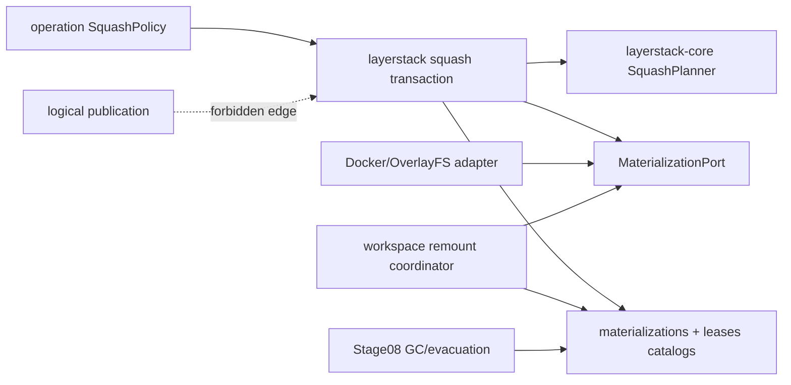
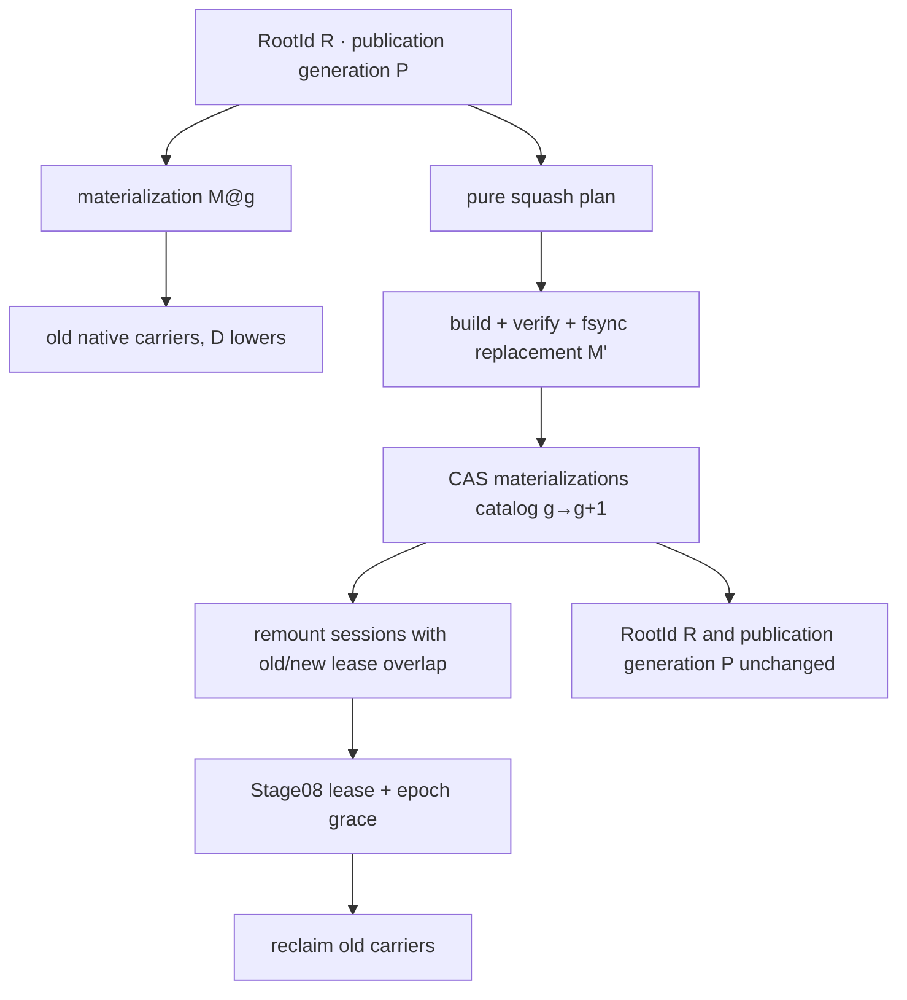

# Stage 09 — Identity-preserving materialization squash

[Implementation overview](../index.md) · [simplified storage contract](../layerstack_storage_contract.md) · [Stage 09 E2E plan](e2e_test.md) · [Benchmark note](benchmark_note.md) · [Preparation 03](../../prep/03-seqcdc-cas-and-squash-decision.md) · [Preparation 04](../../prep/04-seqcdc-space-time-complexity-and-acceptance-criteria.md)

> **Normative storage update.** Squash writes one verified materialization
> generation through the common transaction directory and atomically swaps
> only materialization `CURRENT`. It does not rewrite roots, branch heads,
> receipts, or checkpoint refs. All checkpoints therefore survive squash
> without copying payload.

Product root: `/Users/yifanxu/Ephemeral-AI-Lab/ephemeral-sandbox`
Test root: `/Users/yifanxu/Ephemeral-AI-Lab/ephemeral-sandbox-test`

## Performance arrival checkpoint

Stage 09 has not reached its exit until the tiny/sentinel run emits versioned
`.benchmark-state/results/<run-id>/stage-09-perf-report.json` and
`stage-09-perf-report.md` with
`schema_version="phase1.stage09.perf-report.v1"`. Both reports must identify
the frozen baseline actual, required pass target/cap, separately predeclared
optimization target, candidate actual, and delta/ratio/headroom; include
complexity/work counters, logical-resource high-water counters, memory/RSS,
complete physical-space terms, links
between the reports and to run/raw artifacts, and measurement provenance; and
issue `DIAGNOSTIC_PASS` or `FAIL`—never final `QUALIFIED`. The first Markdown
table exposes those comparison fields per stage-owned metric.

After the immutable reports exist, update the append-only tracker in
[the benchmark note](benchmark_note.md), update the
[overall scorecard](../stage_03_11_benchmark_note.md), and append the command,
outcome, report links, and cleanup to `e2e/test-report.md`. The healthy-run
planning estimate is **ESTIMATED**: 30–60 s for the core tiny loop, 12–24 s
for the fixed-`D` frozen-size sweep, 10–25 s for the serialized-`lowerdir`
boundary and squash-builder isolation cells, 35–72 s for the 20-cycle
sentinel, and 87–181 s for the full local bundle. Every
operation/cell remains ≤60 s and every matched invocation ≤5 min.

## 1. Stage contract

| Field | Contract |
| --- | --- |
| Tier | **POC proof tier**; focused correctness/recovery, a 30–60 second tiny loop, and a coarse long-lived memory sentinel |
| Branch policy | Planning creates no branch. Implementation requires the exact branch `upgrade-2.0-phase-1`, created from the newest approved immutable product revision before Phase 1 implementation begins. |
| Depends on | Stage 08 and its Stage 00/02–07 ancestry, especially immutable logical roots, durable materialization `CURRENT` and lease refs, strict candidate reads, bounded packs/GC/evacuation, and crash-safe common transactions. Stage 01 remains independent until Stage 10. |
| Useful capability at exit | A Docker/OverlayFS native materialization can be replaced by fewer carriers while `RootId`, root-record bytes, `PublicationId`, and publication/OCC generation remain unchanged. Only `MaterializationId`, materialization generation, provider locators, and carrier leases advance. |
| Authority | Legacy v1 remains the only publication authority and the rollback read authority. Candidate materialization squash operates on shadow candidate state; it cannot publish a root or mutate/delete legacy artifacts. |
| Scope | Pure squash planning/invariants, provider build/verify/fsync, materialization `CURRENT` CAS, live-session remount with overlapping leases, restart recovery, depth admission, routing pack/locator pressure away from squash, bounded observations/tests |
| Non-goals | Candidate publication/read authority (Stage 10), legacy retirement/default enablement, logical history rewrite, root republish, pack compaction (Stage 08), full time/space/RSS/portability qualification (Stage 11), another provider |
| Entry | Stage 08 has no unexplained candidate bytes, all locator/deletion rules pass, and legacy authority is intact. |
| Exit | Focused tests show byte-identical logical identity across squash, publication generation unchanged, every checkpoint still resolves, materialization generation advanced, old/new carrier lease overlap across remount/restart, proactive depth control, correct pressure routing, bounded release, and zero external dependency delta. |
| Rollback | Disable candidate squash. Before the `CURRENT` CAS, delete/quarantine the private target; after CAS, finish or retry remount while old carriers remain leased. Legacy continues to serve rollback without interpreting candidate transaction work. |

The stage is not “republish a flattened layer.” A republish would create or race a new logical root and violate the one-publication-authority law. Squash is a provider-materialization transaction beneath an already committed root.

Checkpoint refs point to `RootId`, not a materialization path or generation.
Squash builds `generations/<new>/`, verifies/fsyncs it, atomically advances
materialization `CURRENT`, and retains the old generation under overlapping
leases and grace. Therefore checkpoints, branch heads, receipts, and CAS
objects need no rewrite and remain valid before, during, and after squash.

## 2. Current evidence

| Status | Repository-relative evidence | Fact and design consequence |
| --- | --- | --- |
| observed | `crates/sandbox-runtime/layerstack/src/stack/squash.rs:160-348` | Current squash constructs a new physical layer and rewrites the v1 manifest. Its useful carrier-building behavior must be isolated behind `MaterializationPort`; its v1 identity semantics cannot define candidate squash. |
| observed | `crates/sandbox-runtime/layerstack/src/stack/squash/flatten.rs:14-29` | Flattening is Linux/filesystem-specific. It stays in the Docker provider adapter and never enters `layerstack-core`. |
| observed | `crates/sandbox-runtime/layerstack/src/stack/lease/rewrite.rs:1-12` | Current lease substitution is process-only. Candidate replacement uses the durable materialization/lease catalog and explicit generations established earlier. |
| observed | `crates/sandbox-runtime/layerstack/src/stack/lease/registry.rs:50-67` | Current readers can hold old physical layers. The target must preserve this overlap rather than delete a source at catalog commit. |
| observed | `crates/sandbox-runtime/workspace/src/lifecycle/remount.rs:29-55,203-306` | Workspace remount already quiesces, switches lowers, and overlaps lease ownership. It is the provider activation seam; core squash must not import workspace or OverlayFS. |
| observed | `crates/sandbox-runtime/workspace/src/lifecycle/persistence.rs:52-70`, `persisted_handle_json` | Workspace recovery currently persists physical `manifest_version`, `manifest_root_hash`, and `layer_paths`; it needs a versioned materialization reference plus generation, not a new logical root. |
| observed | `crates/sandbox-runtime/operation/src/layerstack/autosquash_engine/policies/squash_at_n_layers.rs:1-6`, `matches` | Existing policy is a single depth threshold. Preparation 04 requires projected-depth admission, benefit, and pressure-source rules. |
| observed | `crates/sandbox-runtime/operation/src/layerstack/autosquash_engine/worker.rs:49-122,195-228,247-326`, `AutosquashQueue`, `AutosquashEngine`, `worker_loop`, and `evaluate` | Queue coalescing, shutdown/join, and execution ownership already exist. Extend the typed action; do not add another worker pool. |
| observed | `crates/sandbox-runtime/operation/src/layerstack/actions/squash.rs:50-215,240-256`, `execute` and `SquashPhaseObserver::observe` | Existing action coordinates squash, remount sweep, and telemetry. Refactor orchestration around the materialization transaction and keep policy out of the provider. |
| observed | `crates/sandbox-runtime/layerstack/src/model/mod.rs:163-168` | Current `manifest_root_hash` includes physical paths; it cannot serve as the Stage 09 logical identity oracle. Use the Stage 05–07 typed `RootId`. |
| proposed | `sandbox-runtime-layerstack-core` | Add a pure plan/result invariant checker over `RootId`, publication and materialization generations; no filesystem dependency. |
| inferred | Preparation 03 identity decision | Root publication creates logical identity and OCC generation; squash creates a materialization and increments only materialization generation. |

Architectural defect: one v1 operation currently combines source selection, flattening, manifest mutation, lease rewrite, and telemetry. The target splits policy, pure identity plan, provider construction, catalog commit, remount activation, and observation by reason to change.

## 3. Resulting file and folder structure

### Source and test delta

```text
ephemeral-sandbox/
├── crates/sandbox-runtime/layerstack-core/
│   └── src/
│       ├── lib.rs                                           [modify] — export squash plan/result
│       └── squash.rs                                        [add] — pure identity/depth/benefit invariants
├── crates/sandbox-runtime/layerstack/
│   ├── src/
│   │   ├── maintenance/squash.rs                            [add] — journal + materialization catalog CAS
│   │   ├── maintenance/recovery.rs                          [modify] — squash state recovery
│   │   ├── materialization/port.rs                          [modify] — replacement/lease generations
│   │   ├── materialization/current.rs                       [modify] — replacement generation CAS
│   │   └── service/observe.rs                               [modify] — bounded squash observations
│   └── tests/
│       ├── squash_identity.rs                               [add]
│       └── squash_recovery.rs                               [add]
├── crates/sandbox-runtime/workspace/
│   ├── src/lifecycle/remount.rs                             [modify] — versioned materialization switch
│   └── tests/materialization_remount.rs                     [add]
└── crates/sandbox-runtime/operation/
    ├── src/layerstack/autosquash_engine/
    │   ├── policies/squash_at_n_layers.rs                   [modify] — replace with projected depth + benefit policy
    │   └── worker.rs                                        [modify] — schedule the typed squash action
    ├── src/layerstack/actions/squash.rs                     [modify] — orchestration only
    └── tests/identity_preserving_squash.rs                  [add]

ephemeral-sandbox-test/
├── e2e/runtime/layerstack_squash_v2/
│   ├── test_identity_preserving_squash.py                   [add]
│   ├── test_squash_remount_recovery.py                      [add]
│   └── SPEC.md                                              [add]
└── benchmark/presets/layerstack-phase1-tiny-squash-v2.yml  [add]
```

### Superseded pre-simplification `/eos` inventory

This inventory is retained only for requirement traceability. Stage 09 adds no
new durable storage family: squash publishes a materialization generation and
atomically replaces only that root/backend `CURRENT`, as defined by the
[simplified storage contract](../layerstack_storage_contract.md#stage-ownership).

Bracket order is
`[change; class; owner; create→visible→durable→recover→delete; identity; access/authority; bound; space; exposure]`.
All candidate paths are daemon-owned and masked.

```text
/eos/
├── layer-stack/ [existing; truth-root; LayerStack; install→open→dir-fsync→boot-scan→uninstall; v1+v2 namespaces; daemon R/W, legacy authority; one; M; 0700/masked]
│   ├── .storage-writer.lock [existing; coordination; LayerStack; open→lock→kernel→reacquire→close; none; daemon R/W; one FD; M; daemon-only]
│   ├── manifest.json [retained; legacy truth; legacy publisher; publish→active rename→file+parent fsync→v1 recover→Stage11 retirement; v1 physical root; legacy R/W authority; one; L_hot metadata; daemon-only]
│   ├── workspace.json [retained; legacy truth; base builder; bootstrap→rename→fsync→validate→Stage11 retirement; v1 binding; legacy R/W; one; M; daemon-only]
│   ├── base/B000001-base/ [retained; legacy carrier; base builder; install→manifest-visible→syncfs→v1 recover→Stage11 retirement; v1 ref; legacy R; one; L_hot; lower read-only/masked]
│   ├── layers/<layer_id>/ [retained; legacy carrier; publish→manifest-visible→syncfs→v1 keep/recover→Stage11 retirement; v1 ref; legacy R/W; existing depth policy; L_hot; lower read-only/masked]
│   ├── staging/<layer_id>.staging/ [retained; legacy txn; legacy publisher; allocate→private→fsync→rename/reap→delete; none; legacy W; one publish; P_staging; 0700/masked]
│   ├── .layer-metadata/ [retained; legacy metadata; legacy publisher; carrier→visible→atomic fsync→recompute→carrier delete; v1 only; legacy R/W; O(depth); M; daemon-only]
│   │   ├── <layer_id>.digest [retained; legacy digest metadata; legacy publisher; carrier→visible→atomic fsync→recompute→carrier delete; v1 digest only; legacy R/W; one/layer; M; daemon-only]
│   │   └── <layer_id>.bytes [retained; legacy size metadata; legacy publisher; carrier→visible→atomic fsync→recompute→carrier delete; v1 size only; legacy R/W; one/layer; M; daemon-only]
│   ├── format-v2.json [existing; truth; format owner; Stage02 install→validate→atomic fsync→reject mismatch→version migration; format/profile IDs; candidate R; one; M; daemon-only]
│   ├── roots/v2/<prefix>/<RootId>.root [existing; logical truth; publication; Stage07 commit→catalog-visible→fsync→journal recover→retention+grace delete; RootId; candidate shadow R/W; retention bound; H_cold metadata; daemon-only]
│   ├── manifests/v2/<prefix>/<TreeManifestId>.manifest [existing; logical truth; publication; object install→root-visible→fsync→strong-graph recover→last-root+grace delete; TreeManifestId; candidate shadow R/W; reachable graph; H_cold metadata; daemon-only]
│   ├── objects/v1/loose/<prefix>/<ObjectId>.obj [existing; carrier; object store; verified write→locator-visible→fsync→locator recover→evacuation+grace delete; ObjectId; candidate shadow R/W; bounded loose debt; H_cold/P_staging; daemon-only]
│   ├── packs/v1/
│   │   ├── open/<PublicationId>.pack [existing; txn carrier; pack writer; reserve→private append→fsync→seal/truncate→delete; record ObjectIds; candidate shadow W; ≤64MiB payload/100k records/80MiB allocation; P_staging; daemon-only]
│   │   └── sealed/<PackId>.pack [existing; carrier; pack store; seal→locator-visible→file+dir fsync→footer recover→evacuation+grace delete; PackId; candidate shadow R; exact pack caps; H_cold; daemon-only]
│   ├── indexes/v1/
│   │   ├── pages/<page>.idx [existing; cache/locator page; catalog; build→generation-visible→atomic fsync→rollback/rebuild→grace delete; locator generation; candidate shadow R/W; 4KiB/page, 4096 cached; M/H_cold; daemon-only]
│   │   └── index.catalog [existing; truth; catalog; CAS→active→atomic fsync→replay/rollback→grace delete; locator generation; candidate shadow R/W; paged; M; daemon-only]
│   ├── catalogs/v1/
│   │   ├── roots.catalog [existing; logical truth; publication; root CAS→visible→fsync→journal recover→retention remove; RootId+publication generation; candidate shadow R/W; paged; M; daemon-only]
│   │   ├── locators.catalog [existing; physical truth; object store; locator CAS→visible→fsync→evacuation recover→grace remove; ObjectId→locators; candidate shadow R/W; paged; M; daemon-only]
│   │   ├── materializations.catalog [modify; physical truth; materialization owner; target verify→generation CAS→atomic fsync→squash replay→lease+retention removal; MaterializationKey→MaterializationId/generation/carriers; candidate shadow R/W; retained+active bound; M; daemon-only]
│   │   ├── leases.catalog [modify; truth; lease owner; acquire→generation-visible→fsync→boot reconcile→release; LeaseId→root/carrier/generation; candidate shadow R/W; active owners; M; daemon-only]
│   │   └── retention.catalog [existing; truth; retention owner; select→generation-visible→fsync→epoch recover→supersede; RootId+RetentionEpoch; candidate shadow R/W; paged; M; daemon-only]
│   ├── journals/v1/
│   │   ├── publication/<id>.journal [existing; txn truth; publisher; intent→phase→fsync→replay/abort→terminal reap; PublicationId; candidate shadow W; ≤256KiB/op; P_staging; daemon-only]
│   │   ├── hydration/<id>.journal [existing; txn truth; materializer; intent→verified target→fsync→replay/abort→terminal reap; MaterializationId; candidate shadow W; ≤256KiB/op; P_staging; daemon-only]
│   │   ├── squash/<id>.journal [activate; txn truth; squash owner; plan→target/remount phases→each boundary fsync→resume/finish→terminal reap; RootId+old/new MaterializationId/generations; candidate shadow W; ≤256KiB/op; P_staging; daemon-only]
│   │   ├── compaction/<id>.journal [existing; txn truth; compactor; plan→locator phases→fsync→resume/rollback→terminal reap; PackId/generation; candidate shadow W; ≤256KiB/op and txn caps; P_staging; daemon-only]
│   │   └── migration/<id>.journal [existing; txn truth; bridge; intent→phase→fsync→resume/abort→terminal reap; RootId; candidate shadow W; ≤256KiB/op; P_staging; daemon-only]
│   ├── staging/v2/
│   │   ├── publication/<id>/ [existing; txn; publisher; admit→private→bounded fsync→recover/reap→delete; PublicationId; candidate shadow W; ResourceBudget; P_staging; daemon-only]
│   │   ├── hydration/<id>/ [existing; txn; materializer; admit→private→carrier fsync→recover/reap→delete; MaterializationId; candidate shadow W; 256KiB/worker; P_staging; daemon-only]
│   │   ├── squash/<id>/ [activate; txn carrier; Docker adapter; plan→private replacement→syncfs/verify→journal recover→install or delete; new MaterializationId; candidate shadow W; one replacement carrier under budget; C_target/P_staging; daemon-only]
│   │   ├── compaction/<id>/ [existing; txn carrier; compactor; admit→private target→fsync→journal recover→seal/install/delete; PackId; candidate shadow W; 64MiB/100k/80MiB caps; P_staging; daemon-only]
│   │   └── migration/<id>/ [existing; txn; bridge; admit→private→fsync→recover/reap→delete; RootId; candidate shadow W; budgeted; P_staging; daemon-only]
│   ├── leases/v1/<LeaseId>.lease [existing→modify; lease truth mirror; lease owner; acquire→catalog-visible→fsync→boot reconcile→release+grace; LeaseId; candidate shadow R/W; active owner bound; M; daemon-only]
│   ├── retention/v1/
│   │   ├── epochs/<RetentionEpoch>.epoch [existing; truth; retention/GC; close→catalog-visible→fsync→validate→later-epoch delete; RetentionEpoch/generations; candidate shadow R/W; active+two complete; M; daemon-only]
│   │   └── pins.catalog [existing; truth; policy owner; pin CAS→visible→fsync→recover→unpin; RootId; candidate shadow R/W; finite configured pins; M; daemon-only]
│   ├── maintenance/v1/
│   │   ├── gc.cursor [existing; recovery truth; GC; checkpoint→visible→atomic fsync→resume/restart→reset; epoch+page key; candidate shadow R/W; one ≤64KiB; M; daemon-only]
│   │   └── compaction.cursor [existing; recovery truth; compactor; checkpoint→visible→atomic fsync→resume/replan→reset; PackId+generation; candidate shadow R/W; one ≤64KiB; M; daemon-only]
│   ├── materializations/docker-overlayfs/v1/
│   │   ├── <old-MaterializationId>/carriers/<ordinal>/ [existing/source; provider carrier; Docker adapter; prior hydrate→catalog-visible→syncfs→lease/restart recover→all session leases+grace release; old materialization generation; candidate shadow R; old D including base; L_hot/source; lower read-only/masked]
│   │   └── <new-MaterializationId>/carriers/<ordinal>/ [add/target; provider carrier; Docker adapter; squash build→materialization CAS→syncfs before CAS→journal/remount recover→root/lease release; new ID/generation, excluded from RootId; candidate shadow R; replacement count with benefit; C_target/L_hot; lower read-only/masked]
│   ├── quarantine/v1/<opaque-id>/ [existing; isolated evidence; recovery owner; detect→never active→fsync→manual/tool recover→bounded reap; typed source recorded; no reads; configured cap; P_staging; daemon-only]
│   └── trash/v1/<RetentionEpoch>/<opaque-id> [existing; grace carrier; GC; mark→rename invisible→dir fsync→epoch+generation+lease recheck→unlink; original ID; no normal reads; one epoch+txn bound; H_cold/P_staging; daemon-only]
├── workspace/ [existing; scratch-root; Workspace; session create→manager-visible→owner durable→boot reconcile→destroy; no RootId; provider R/W; active sessions; ΣU_active; 0700/masked]
│   ├── manager.json [modify; recovery truth; WorkspaceManager; materialization/session CAS→visible→atomic fsync→boot reconcile→supersede; session+MaterializationId/generation; workspace R/W; active handles; M; daemon-only]
│   ├── .export/<spool>/ [existing; scratch; export owner; request→private→operation durability→cancel/reap→delete; none; export R/W; admitted bound; P_staging; masked]
│   └── <workspace_session_id>/
│       ├── upper/ [existing; writable scratch; Workspace; session→mount-visible→native writes→recovery inspect→destroy; captured to RootId only on publish; workspace R/W; ΣU_active; ΣU_active; /workspace projection]
│       ├── work/ [existing; OverlayFS scratch; Docker adapter; mount→kernel-private→kernel→unmount/reap→delete; MaterializationId/generation outside RootId; provider R/W; one/session; ΣU_active metadata; masked]
│       └── executions/<namespace_execution_id>/transcript.log [existing Stage01; scratch; command owner; admit→command-visible→bounded append→Drop/teardown/boot reap→delete; none; execution R/W; transcript cap; ΣU_active/M; masked]
├── namespace_execution/ [compat/remove-later; empty root; boot recovery; old install→no new writes→N/A→boot reap stale children→Stage11 remove; none; no normal access; zero; zero; masked]
├── storage/ [existing; service truth/recovery root; owning services; operation/failure→owner-visible→owner fsync→boot retry→policy cleanup; none; service R/W; configured; M/P_staging; daemon-only]
│   ├── file_auditability/ [existing; audit service truth/recovery; file-auditability service; operation/failure→owner-visible→owner fsync→boot retry→policy cleanup; none; service R/W; configured; M/P_staging; daemon-only]
│   └── workspace_recovery/ [existing; workspace recovery truth; workspace recovery service; operation/failure→owner-visible→owner fsync→boot retry→policy cleanup; none; service R/W; configured; M/P_staging; daemon-only]
└── runtime/
    └── daemon/ [existing; control scratch root; gateway; boot→ready→permission/identity record→stale recover→shutdown; none; service R/W; one daemon; M; 0600/masked]
        ├── runtime.sock [existing; control socket; gateway; bind→ready→kernel-visible→stale recover→shutdown unlink; none; service R/W; one; M; 0600/masked]
        └── runtime.pid [existing; process identity record; gateway; boot→ready→atomic write→stale recover→shutdown unlink; none; service R/W; one; M; 0600/masked]
```

Delta from Stage 08: `squash` journal/staging become active; materialization catalog and workspace manager persist versioned switch state; a replacement Docker carrier coexists with leased source carriers. No logical root/object/pack path changes.

## 4. SRP, SOLID, and coupling design

| Component | One responsibility | Dependencies | Must not own |
| --- | --- | --- | --- |
| core `SquashPlanner` | Validate source range, projected depth, benefit, and identity invariants | typed root/materialization values | filesystem, queue, remount |
| operation `SquashPolicy` | Decide enqueue/admit/reject from depth/native pressure | scalar observations | build, catalog mutation |
| layerstack squash transaction | Journal build and materialization generation CAS | core plan, catalogs, provider port | logical publication |
| Docker materialization adapter | Build/verify/fsync replacement native carrier | provider paths/syscalls | RootId/publication generation/policy |
| workspace remount coordinator | Quiesce and switch one session with lease overlap | versioned materialization handle | source selection, flattening |
| Stage 08 GC/evacuation | Reclaim old unleased carriers after grace | catalog/lease generations | remount or squash policy |
| observation mapper | Bounded phase/duration/resource counters | snapshots | mutation or per-path labels |



New dependencies point inward and remain acyclic: operation/workspace adapters depend on narrow layerstack contracts; layerstack depends on core; core imports no provider. There is no `core -> layerstack`, `layerstack -> workspace/operation`, or Docker type in a core public signature.

| Manifest/graph | Baseline packages/features/edges | Resolved package/version delta | Feature delta | Direct external edge delta or relocation | System/runtime delta | Internal edge change | Evidence |
| --- | --- | --- | --- | --- | --- | --- | --- |
| Rust resolved graph | Stage 00 frozen package/version/checksum set | none | none | none | none | none | canonical sorted `cargo metadata --locked` equality |
| Rust feature graph | Stage 00 frozen target/invocation feature sets | none | none | none | none | none | exact enabled `(package,feature)` set equality |
| Cargo direct-edge multiset | Stage 00 product-wide external edge multiset | none | none | none; no duplicate or relocation | none | reuse Stage 02 `sandbox-runtime-layerstack -> sandbox-runtime-layerstack-core` and existing `sandbox-runtime`/workspace inward relations; narrow internal materialization contract only; no cycle | manifest parser and workspace-cycle audit |
| Python/npm/vendor manifests and locks | Stage 00 bytes/inventory | none | none | none | none | none | byte/hash and vendored inventory equality |
| Target image and host runtime | existing gateway, daemon, and Docker provider | none | none | none | none: no package, helper, process, socket, service, command, or download | none | image inventory and route/process evidence |

| Boundary | Host/image assumption before | Assumption after | Portable core or provider adapter | Evidence now | Later evidence |
| --- | --- | --- | --- | --- | --- |
| Identity | current-host materialization implementation | explicit-width typed IDs/generations and deterministic byte order; provider locator excluded from `RootId` | portable core | scalar identity golden | cross-host/CPU release triples `deferred-to-stage_11` |
| Planning | Docker carrier paths visible to orchestration | carrier ordinals/counts only; no host paths, inodes, or times | portable core plan + provider adapter | pure contract tests | future providers are designed-compatible, unverified |
| Build/verify | Docker/OverlayFS is the only live implementation | immutable-root materialization port owns native copy/flatten/fsync/metadata verification | Docker provider adapter | pinned Ubuntu 24.04 Stage 09 POC | Stage 11 repeats the capability profile over every required host×image row |
| Activation | provider mechanics and logical switch are coupled | versioned handle/lease law in core-facing contract; quiesce/mount/remount in adapter | orchestration + Docker provider adapter | focused session recovery | release triples `deferred-to-stage_11` |
| Target image | Ubuntu image available during POC | no target-image command, helper, shell, userland, or libc dependency | provider adapter runs outside sandbox | public API correctness on Ubuntu 24.04 OCI index `sha256:4fbb8e6a8395de5a7550b33509421a2bafbc0aab6c06ba2cef9ebffbc7092d90` | Stage 11 Phase 1 matrix: pinned Ubuntu/Debian glibc, Alpine musl, minimal/distroless, shell-less, read-only, and non-root rows |

## 5. Type, class, and field design

```rust
#[derive(Clone, Debug, Eq, PartialEq)]
pub struct PublishedRootVersion {
    pub root_id: RootId,
    pub publication_id: PublicationId,
    pub publication_generation: u64,
    pub root_record_digest: Digest32,
}

#[derive(Clone, Debug, Eq, PartialEq)]
pub struct MaterializationVersion {
    pub materialization_id: MaterializationId,
    pub generation: MaterializationGeneration,
    pub carrier_count_including_base: u8,
}

pub struct SquashPlan {
    pub request_id: PublicationId, // opaque transaction correlation; not a publication
    pub root: PublishedRootVersion,
    pub source: MaterializationVersion,
    pub source_carrier_range: CarrierRange,
    pub expected_locator_generation: u64,
    pub expected_lease_generation: u64,
    pub target_materialization_id: MaterializationId,
    pub projected_depth: u8,
    pub expected_carrier_reduction: u8,
    pub manual: bool,
}

pub enum SquashAdmission {
    NotNeeded,
    EnqueueAsync,       // projected D >= 48 and routine benefit >= 8
    CompactBeforeAdmit, // a new lower would otherwise make D > 64
    RejectDepthLimit,
}

pub enum SquashState {
    Planned,
    Building,
    TargetVerified,
    CommitIntent,
    MaterializationInstalled,
    Remounting,
    SourceGraceWaiting,
    Done,
    Aborted,
    Conflict,
}

pub struct SquashCommitReceipt {
    pub root_before: PublishedRootVersion,
    pub root_after: PublishedRootVersion,
    pub materialization_before: MaterializationVersion,
    pub materialization_after: MaterializationVersion,
    pub remounted_sessions: u32,
    pub retained_old_session_leases: u32,
}

pub trait MaterializationPort {
    type Prepared;
    fn prepare_replacement(
        &self,
        root: RootId,
        source: &MaterializationVersion,
        range: CarrierRange,
        target: MaterializationId,
        budget: &ResourceBudget,
    ) -> Result<Self::Prepared, MaterializationError>;
    fn verify_and_sync(&self, prepared: &Self::Prepared, root: RootId)
        -> Result<MaterializationDescriptor, MaterializationError>;
    fn discard_private(&self, prepared: Self::Prepared) -> Result<(), MaterializationError>;
}

pub trait MaterializationCatalog {
    fn compare_exchange(
        &self,
        root: RootId,
        expected: MaterializationVersion,
        replacement: MaterializationDescriptor,
    ) -> Result<MaterializationVersion, CatalogError>;
}
```

| Type/status | Owner and visibility | Responsibility / exact fields | Ownership, allocation, persistence, and release | Defaults, validation, errors, concurrency, compatibility |
| --- | --- | --- | --- | --- |
| `PublishedRootVersion` — new view | `sandbox-runtime-layerstack-core::squash`; workspace-public internal | exact root/publication/generation/digest fields above; immutable logical fence | owned fixed-size value; persisted values remain owned by roots/publication catalogs; no heap; dropped with plan/receipt | no default; all fields must match committed record; mismatch is conflict; immutable `Send + Sync`; no wire-format mutation |
| `MaterializationVersion` — new view | core `squash`; workspace-public internal | exact materialization ID/generation/base-inclusive carrier count | fixed-size value; source/after values persist in materialization catalog; leases own carrier lifetime | count must be `1..=64`; after generation strictly advances; errors preserve old generation; provider locator excluded |
| `SquashPlan`, `CarrierRange`, `SquashAdmission` — new | core `squash`; workspace-public internal | exact plan fields/closed admission variants above; pure depth/benefit/source classification | one operation owner; fixed-size descriptors only; plan is transient, journal records durable intent; drop releases no carrier itself | no default; validate depth 48/64, routine benefits 7/8, manual selected-run widths 1/2, ranges, generations, IDs; stale values conflict; immutable after admission; additive internal API |
| `SquashState` — new | layerstack squash journal; crate-visible | exact closed transaction states above | one durable state/transaction and one in-memory scalar; terminal recovery deletes journal after catalog/manager proof | monotonic transition table; unknown state/version fails closed and retains both sources; one transaction writer |
| `SquashCommitReceipt` — new | layerstack squash service; internal response/evidence | exact before/after root/materialization and session/lease counters | fixed-size owned receipt; persisted in journal/evidence until terminal, then bounded evidence retention/eviction | validates root equality, generation advance, bounded counts; impossible postcondition is integrity error; safe immutable sharing |
| `MaterializationPort::Prepared` / `MaterializationDescriptor` / `MaterializationError` — modified narrow provider port | existing port owner in layerstack contracts; implemented by Docker adapter | signatures above; prepare, verify+sync, discard private replacement only | provider owns file descriptors/staging/carrier until descriptor or discard; cancellation/error invokes discard; recovery reconciles journal | no generic default; verified descriptor required before CAS; provider errors translate once; one mutable prepared owner; future providers implement same contract |
| `MaterializationCatalog` — modified narrow port | layerstack catalog contract; filesystem adapter | exact generation-fenced CAS signature above | adapter owns locks/pages; returned version caller-owned; successful replacement persists; old carrier release belongs to leases/GC | stale expected version returns conflict without mutation; serialized generation change; existing readers remain compatible |
| `RootId`, `PublicationId`, `Digest32`, `MaterializationId`, `MaterializationGeneration`, `ResourceBudget` — unchanged/reused | existing core/port owners | exact existing representation and meaning | existing persistence/reclamation rules | no default, version, or public API change |

`request_id` is a correlation value and must be renamed to a dedicated `SquashTransactionId` if reusing `PublicationId` is judged semantically leaky during implementation; it never enters the publication catalog. `root_before == root_after`, including root-record digest and publication generation, is a checked postcondition. `materialization_after.generation` is strictly greater; it is not hashed into `RootId`.

## 6. Data and compatibility design

- `D` counts the base carrier. Asynchronous work enqueues when projected `D ≥ 48`; a publication that would produce `D > 64` must first compact successfully or be rejected.
- Mount admission computes the exact serialized OverlayFS `lowerdir=` option
  from the provider-resolved absolute carrier paths. It admits only when both
  `D≤64` and `serialized_lowerdir_bytes≤declared_lowerdir_limit`; otherwise it
  compacts or returns `NeedCompaction` before the mount syscall and before any
  catalog/session visibility change. Tests freeze colon-safe paths at
  `L_limit-1`, `L_limit`, and `L_limit+1` bytes so the byte boundary is not
  conflated with the carrier-count boundary.
- Routine autosquash requires `source carriers - replacement carriers ≥ 8`. Manual squash accepts any range of at least two lowers only when it reduces depth.
- Pack dead/slack, locator debt, or CAS object pressure is not squash pressure; it invokes Stage 08 compaction/evacuation.
- The squash input is one committed root plus one expected materialization generation. It never selects multiple logical roots or changes retention/provenance.
- Target verification covers the complete logical tree, supported metadata, whiteouts/opaque directories, symlinks/hardlinks where supported, sparse/xattrs/ownership mapping, and provider descriptor. No target-image utility performs verification.
- Materialization CAS installs the replacement only if root ID, root-record digest, publication generation, source materialization generation, and relevant locator/lease fences still match.
- New activations use the installed generation. Existing sessions may remain on the old carriers under durable/session leases until remounted; this is valid, observed coexistence.
- A crash before CAS discards/quarantines a private target. A crash after CAS resumes remount and source grace; it never republishes or rolls back the logical root.
- Legacy v1 squash is not invoked by the candidate transaction. Legacy entries remain readable and byte-stable through Stage 10.
- Bridge owner: layerstack/workspace integration; purpose: translate the versioned materialization handle to current workspace persistence/remount; removal gate/latest stage: Stage 11, after candidate default and mixed-state recovery qualification.



## 7. Workflow and failure semantics

1. Policy snapshots projected depth/native bytes and distinguishes native pressure from pack/locator pressure.
2. Transaction snapshots root record/digest, publication generation, materialization/locator/lease generations, active session IDs, and source leases.
3. Journal `Planned`; provider builds one private replacement under `ResourceBudget`.
4. Provider verifies exact root semantics and `syncfs`/fsyncs target plus parent; journal `TargetVerified`.
5. Journal `CommitIntent`; materialization catalog CAS advances only materialization ID/generation.
6. Acquire target lease before exposing it to each workspace. Quiesce a session, switch lowers, persist manager generation, then release that session's old lease.
7. Crash/cancel resumes from catalog generation and per-session manager state. A failed session remains safely on leased old carriers and is retried.
8. When no session/transaction lease names old carriers, Stage 08 moves them
   through evacuation, grace, and recheck. Record `evacuation_ns` from release
   of the last protecting old-carrier lease (when final-locator movement can
   begin) until replacement locators are durable and the source is eligible
   for grace. If no locator must move, record zero plus a closed
   `evacuation_not_required_reason`. Journal becomes terminal and is reaped.

```mermaid
sequenceDiagram
  participant S as Squash transaction
  participant P as Docker MaterializationPort
  participant C as Materialization catalog
  participant W as Workspace sessions
  participant G as Lease/GC
  S->>S: snapshot R/P and M@g; fsync Planned
  S->>P: build, verify, sync M'
  P-->>S: durable descriptor
  S->>S: fsync CommitIntent
  S->>C: CAS R: M@g -> M'@(g+1)
  alt crash before CAS
    S->>P: discard/quarantine private M'
  else CAS committed
    S->>W: acquire M' lease, quiesce, remount, persist
    W-->>S: release old lease per session
    Note over W: failed sessions remain on leased old carriers
    S->>G: old carrier enters grace only after final lease
    G-->>S: epoch + generation recheck, reclaim
  end
  S->>S: assert R/P unchanged; terminal journal
```

| Resource | Owner | Bound | Release | Crash/cancel behavior | Evidence |
| --- | --- | --- | --- | --- | --- |
| squash plan/session snapshot | transaction | capped session descriptors; metadata queue 16/64 KiB | terminal/cancel checkpoint | rebuild from catalogs/manager | queued items/bytes |
| journal encoding | transaction | ≤256 KiB/op | terminal bounded reap | replay state enum | journal bytes/state |
| replacement carrier | Docker adapter | one complete `C_target`; old leased source may coexist | install or private discard; later root/lease release | private target discard or committed resume | source/target allocated bytes |
| copy/read/output buffers | provider worker | 256 KiB read + 256 KiB output/worker within four-worker/64 MiB global budget | phase end | no borrowed bytes in journal | buffers/permits/workers |
| source carrier leases | active sessions/transaction | one bounded lease/owner/carrier set | after each successful remount; final after transaction | durable reconciliation conservatively retains | lease count/age/generation |
| target leases | new sessions/remount | acquired before switch | session destroy/remount | manager/catalog reconcile | old/new lease overlap |
| remount freeze | workspace | one session at a time | mount switch completes/rolls back | old mount remains valid | frozen interval and state |
| shared index cache | layerstack | 16 MiB (4,096×4 KiB) | bounded eviction/shutdown | rebuildable | entries/bytes |
| global data-plane budget | `ResourceBudget` | 64 MiB, four workers | permit drop | journal recovery reacquires | current/high-water permits |
| old-carrier grace bytes | Stage 08 GC | source plus one replacement during bounded interval | epoch+generation+lease recheck | conservative retain | allocated bytes/epoch |

One daemon stays alive for the sentinel. Every logical owner must return to warmed idle; physical memory uses an equal-warmup raw control band and never relies on restart, `malloc_trim`, cache purge, allocator changes, or RSS alone.

## 8. Complexity and performance contract

| Operation | Inputs | Expected time | Worst-case time | Peak app memory | Temporary disk | Settled physical disk | I/O pattern |
| --- | --- | --- | --- | --- | --- | --- | --- |
| plan/source selection | native depth `D≤64`, active sessions `A` | `O(D+A)` | `O(D+A)` and ≤60 s | capped descriptors; no payload | one ≤256 KiB journal | none beyond journal metadata | bounded catalog/lease page reads |
| replacement build/verify | selected carrier bytes `S`, entries `E_s` | `O(S+E_s)` | `O(S+E_s)` and ≤60 s per resumable transaction | 256 KiB worker buffers, four workers, 16/64 KiB queue, shared 16 MiB cache, 64 MiB semaphore | one replacement native carrier plus journal | replacement carrier; old source remains only while leased/grace-protected | streaming carrier reads/writes, metadata verify, fsync |
| materialization CAS | affected catalog pages `P`, one expected generation | `O(P)` | bounded CAS retry/recovery and ≤60 s | ≤256 KiB encoding plus shared cache | catalog page staging + squash journal | one materialization record/generation | bounded pages, fsync, atomic rename |
| session remount | native depth `D≤64`, active tasks, verified FDs; `A` sessions total | frozen interval `O(D+tasks+verified FDs)` per switch, with no `U/R/K/S` work; all-session orchestration is the sum of bounded switches | serial one-session switches; ≤60 s per operation | one session handle plus old/new leases | provider mount staging only | one active materialization per session plus grace-protected old carrier | quiesce, verified-FD mount/remount, manager state fsync; zero payload read/hash/copy during freeze |
| recovery | one journal, affected sessions `A`, pages `P` | `O(A+P)` | no global payload rescan; ≤60 s | bounded journal/page buffers | private unfinished target or none | old-or-new complete generation only | journal/catalog reads and idempotent remount |
| native command/file/PTY/stdin | native carrier depth `D≤64` | existing native cost | existing provider bound and ≤60 s harness timeout | existing native route only | none from squash/CAS | unchanged `L_hot + H_cold + ΣU_active + P_staging + M` envelope | zero CDC/CAS/pack/manifest lookup |

| Preparation 04 gate | Exact Stage 09 state | Proof/owner |
| --- | --- | --- |
| `RootId`, root-record bytes, `PublicationId`, publication/OCC generation unchanged across squash | `stage-gating` correctness | exact before/after receipt and restart cases |
| new `MaterializationId`; materialization generation strictly advances | `stage-gating` correctness | catalog CAS/receipt |
| depth includes base; enqueue projected `D≥48`; compact/reject before `D>64` | `stage-gating` | boundary policy/admission cases |
| routine carrier benefit ≥8; manual selected run contains ≥2 lowers and the plan lowers depth | `stage-gating` | pure plan and live fixture |
| pack/locator pressure never triggers squash | `stage-gating` | queue/action counters |
| mount preflight checks both `D≤64` and the serialized `lowerdir=` byte limit | `stage-gating` | same-depth long-path cells at `L_limit-1`, `L_limit`, and `L_limit+1`; above-limit decision occurs before a mount syscall or visibility |
| one replacement target may coexist with old leased source | `stage-gating` bounded-peak shape; percentage/scale claim `deferred-to-stage_11` | allocated category series now; full corpus final |
| squash live-remount frozen p50/p95 ≤baseline+5%+2ms | `deferred-to-stage_11` | final paired benchmark |
| frozen remount work `O(D+tasks+verified FDs)` with no `U/R/K/S` work | `stage-gating` structural proof | fixed `D=8`, four-session, fixed-task/FD sweep over prebuilt 16/64/256 MiB targets; identical work counters and zero frozen payload bytes |
| full squash plan/build/commit p50/p95 ≤baseline+10%+5ms | `deferred-to-stage_11` | final paired benchmark |
| every operation ≤60s | `stage-gating` POC timeout | focused cases/tiny cells |
| matched candidate/baseline pair ≤5min | `deferred-to-stage_11` | final matrix |
| fixed memory limits: 256 KiB worker buffers, four workers, 16/64KiB queue, ≤256KiB encoding, 16MiB cache, ≤4MiB/publication, 64MiB semaphore | `stage-gating` | gauges/cap tests |
| native depth preemptively below 64; >64 hard failure | `stage-gating` | admission and settled observation |
| normal native hot paths have zero CAS payload reads/lookups | `stage-gating` | command/file/PTY/stdin route |
| background squash build does not enter command/PTY critical paths | `stage-gating` structural proof; numeric p50/p95 `deferred-to-stage_11` | synchronized idle-versus-builder-active command and PTY create/drain cells; maintenance-owned wait/lock/permit/CDC/CAS/manifest/pack counters remain zero |
| sealed pack ≤64 MiB payload/100,000 records/80 MiB allocation; GC/compaction transaction ≤100,000 records or 64 MiB; individual compaction at ≥20% dead; aggregate urgent >5%; settled dead/slack target ≤2%, hard >5%; deletion grace ≥one complete durable epoch plus generation/lease recheck; last-locator safety | hard bounds/triggers/safety `stage-gating`; ≤2% settled corpus claim `deferred-to-stage_11` | focused coexistence/reclaim case now; final corpus later |
| final memory matrix 64/256MiB/1GiB × roots1/16/64 ×3; adjusted final/peak ≤16MiB and 4× size/history ≤8MiB | `deferred-to-stage_11` | final qualification |
| qualification RSS ≤384MiB and ≤128MiB above idle | `deferred-to-stage_11` | final long-lived process |
| settled mixed/no-dedup ≤1.08 `D_ideal`, many-small ≤1.15, hard 1.15/1.25; native+pack duplicate ≤1%, hard >3%; pack dead/slack ≤2%, hard >5% | `deferred-to-stage_11` | candidate-authority settled matrix |
| metadata budgets 96/chunk, 64/segment, 256+path/changed path | focused encoder regression `stage-gating`; corpus qualification `deferred-to-stage_11` | Stage 08/09 unit evidence and Stage 11 |
| SeqCDC `seqcdc-scalar-author-v1`: min 8,192, target 16,384, max/window 32,768 bytes, threshold 5, opposing 50, jump 512, 32 KiB ring/two slices, typed SHA-256 identities | `stage-gating` regression invariant | exact root/object replay |
| SIMD acceleration | `not-applicable` | scalar remains sole implementation |
| candidate publication/read authority and legacy retirement | `deferred-to-stage_10` / `deferred-to-stage_11` | later authority/final stages |

No time percentile, scale, RSS, settled amplification, or required host×image
row becomes qualified here.

## 9. Diagrams

Sections 4, 6, and 7 contain the required dependency, identity/data-flow, and failure/recovery sequence diagrams. The identity diagram's split between logical root and provider materialization is the normative Stage 09 invariant.

## 10. Implementation sequence

1. Add pure `layerstack-core/src/squash.rs` types and tests for identity, depth, benefit, and pressure classification.
2. Extend the materialization catalog CAS with root/publication fences and strictly advancing materialization generation.
3. Extract current Linux flatten/copy mechanics into the Docker `MaterializationPort` implementation; keep all paths/syscalls/provider IDs outside core.
4. Add squash journal states and recovery; prove every state idempotent before remount integration.
5. Version workspace manager materialization handles and add old/new lease-overlap remount tests.
6. Refactor autosquash policy/action: policy decides; action orchestrates; pack/locator pressure routes to Stage 08.
7. Add bounded observations and exact postcondition receipt.
8. Run focused Rust contract/recovery tests, then typed E2E
   identity/remount/depth/serialized-`lowerdir` cases, then the tiny preset and
   synchronized idle-versus-squash-builder command/PTY isolation cell.
9. Re-capture exact dependency/runtime evidence; any external delta is a blocker.
10. Do not enable candidate authority or delete legacy code/data; hand Stage 10 a proven materialization transaction.

## 11. Observability

| Field | Bound/meaning | Gate |
| --- | --- | --- |
| `squash.state` | closed state enum | terminal known state |
| `squash.reason` | `depth_async`, `depth_admission`, `manual`, never pack/locator | exact routing |
| `root_id_before/after_digest` | bounded typed digest | equal |
| `root_record_digest_before/after` | typed digest | equal |
| `publication_generation_before/after` | `u64` | equal |
| `materialization_id_before/after` | typed opaque digests | different |
| `materialization_generation_before/after` | explicit-width | after > before |
| `depth_before/projected/after`, `carrier_reduction` | `u8` scalars | policy limits/benefit |
| `remount.{pending,completed,old_lease,new_lease}` | bounded counters | pending zero at terminal; no unleased interval |
| `lowerdir.{serialized_bytes,declared_limit,preflight_decision,mount_syscalls}` | exact scalars/closed enum | admit iff both byte and depth limits pass; rejected preflight has zero mount syscalls |
| `squash.evacuation_ns`, `squash.evacuation_not_required_reason` | monotonic interval or exact zero with closed reason | present for every squash result; ≤60 s operation bound |
| `source/target/grace_allocated_bytes` | category totals, no path labels | one bounded replacement shape |
| `workers/buffers/queues/permits/leases/transactions` | current/high-water gauges | warmed idle after quiescence |
| `native_hot_path_cas_lookups/payload_reads` | monotonic route counters | zero |
| `native_hot_path_maintenance_waits/locks/permits` by squash-builder owner | monotonic route counters | zero during synchronized command/PTY isolation cells |
| Stage 00 authority/fallback/mismatch | closed enums/counters | legacy/legacy/0/0 |

Per-session IDs belong only in bounded run evidence, not metric labels/log storms. Missing identity, generation, lease, or hot-path route evidence fails; unavailable optional RSS sources remain explicit.

## 12. Completion checklist

- [ ] POC proof tier is explicit; Stage 11 owns full qualification.
- [ ] Root ID, root-record digest, publication ID, and publication/OCC generation are exactly unchanged before/after/restart.
- [ ] A new materialization ID is installed and its generation strictly advances.
- [ ] Source and target carrier verification covers exact content and supported metadata without target-image tools.
- [ ] Catalog CAS fences root/publication/materialization/locator/lease generations.
- [ ] Existing sessions keep old leases until a verified target lease and remount persist.
- [ ] Every crash/cancel state resumes or aborts idempotently without republishing.
- [ ] Projected depth 48/64, routine benefit ≥8 carriers, and manual selected-run width ≥2 lowers are exact; depth includes base.
- [ ] Serialized `lowerdir=` bytes are checked independently at
      `L_limit-1/L_limit/L_limit+1`; an over-limit mount never reaches the
      kernel or becomes partially visible.
- [ ] Pack/locator pressure invokes Stage 08, never squash.
- [ ] Old carriers pass through Stage 08 grace/recheck only after all leases release.
- [ ] Legacy authority/artifacts remain untouched and usable for rollback.
- [ ] Native execution has zero CAS/pack/manifest lookup.
- [ ] Command and PTY create/drain remain behaviorally exact while the squash
      builder is active, with zero maintenance-owned wait/lock/permit or
      storage-transform work in their critical paths.
- [ ] Every squash report includes the defined evacuation interval or an exact
      zero with a closed no-evacuation reason.
- [ ] Logical resources quiesce in one long-lived daemon and the coarse physical sentinel is within rule.
- [ ] External dependency, feature, edge, helper, package, service, socket, and download delta is zero.
