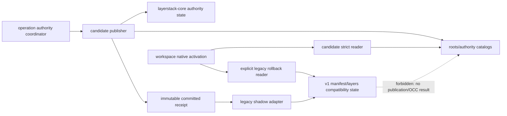
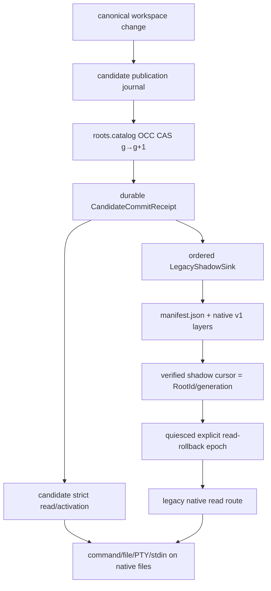

# Stage 10 — Candidate authority with legacy shadow and read rollback

[Implementation overview](../index.md) · [Stage 10 E2E plan](e2e_test.md) · [Preparation 03](../../prep/03-seqcdc-cas-and-squash-decision.md) · [Preparation 04](../../prep/04-seqcdc-space-time-complexity-and-acceptance-criteria.md)

Product root: `/Users/yifanxu/Ephemeral-AI-Lab/ephemeral-sandbox`
Test root: `/Users/yifanxu/Ephemeral-AI-Lab/ephemeral-sandbox-test`

## 1. Stage contract

| Field | Contract |
| --- | --- |
| Tier | **POC proof tier**; first explicit candidate-authority exercise, focused correctness/recovery, bounded soak/tiny loop, coarse long-lived memory sentinel |
| Branch policy | Planning creates no branch. Implementation requires the exact branch `upgrade-2.0-phase-1`, created from the newest approved immutable product revision before Phase 1 implementation begins. |
| Depends on | Stages 00–09: frozen authority/resource evidence, portable identities and publications, strict candidate read, durable shadow publication, bounded retention/GC/packs, and identity-preserving materialization squash |
| Useful capability at exit | In explicit `candidate_authoritative_with_legacy_shadow` mode, the candidate root-catalog CAS is the single publication linearization point and candidate strict read is normal authority. A derived legacy v1 shadow stays generation-correlated for an explicit, quiesced read rollback. |
| First-authority rule | This is the first stage allowed to report candidate write/read authority. Stages 00–09 must remain legacy-authoritative. |
| Scope | Durable authority epoch, candidate receipt/retry semantics, candidate-strict read, ordered legacy shadow adapter/cursor, parity checks, explicit caught-up legacy read rollback, mixed-root restart, failpoints, bounded POC soak, observations |
| Non-goals | Candidate default for ordinary deployments, silent legacy fallback, legacy writer competition, deletion/retirement of any legacy path/code/config, full affected suite or normative time/space/RSS/portability qualification; all are Stage 11 |
| Entry | Stage 09 passes exact identity and lease invariants; Stage 08 reports zero unexplained bytes; all candidate roots required for cutover reconstruct; legacy and candidate shadow agree at a recorded generation; dependency fingerprint equals Stage 00. |
| Exit | Focused candidate publications/retries/restarts have one receipt and one root generation; candidate reads never silently fall back; legacy shadow reaches exact parity; explicit read rollback serves only a cursor proven equal to current candidate generation; mixed roots survive restart; bounded soak releases resources; no legacy artifact is retired; external delta is zero. |
| Rollback | Quiesce publication, require legacy-shadow cursor/digest parity with the selected candidate generation, durably select `legacy_read_rollback`, and keep candidate as the only publication authority. If parity is unavailable, reads fail closed and authority stays candidate; no stale or silent fallback is allowed. |

Stage 10 separates *publication authority* from *compatibility materialization*. Updating `manifest.json` after a candidate commit is a derived shadow step. It cannot win an OCC race, assign a logical root, change the candidate outcome, or make the legacy writer a second authority.

## 2. Current evidence

| Status | Repository-relative evidence | Fact and consequence |
| --- | --- | --- |
| observed | `crates/sandbox-runtime/layerstack/src/stack/ops/publish.rs:25-122` | V1 publish currently plans, stages, fsyncs/renames, rechecks OCC, and replaces `manifest.json`. Under Stage 10 this code is wrapped as a one-way shadow sink, not called as client publication authority. |
| observed | `crates/sandbox-runtime/layerstack/src/stack/publish/resolve.rs:25,260-289` | Existing OCC decisions are expressed against v1 physical manifest state. Candidate publication uses the Stage 07 logical root generation; v1 OCC cannot compete. |
| observed | `crates/sandbox-runtime/layerstack/src/stack/publish/model.rs:5-64` | Current DTOs describe physical layers. The legacy bridge consumes a committed candidate receipt/change set and emits them only as compatibility state. |
| observed | `crates/sandbox-runtime/layerstack/src/storage/fs.rs:113-139,161-179,201-240` | Atomic file/parent durability primitives support authority/shadow catalog records and v1 shadow replacement. |
| observed | `crates/sandbox-runtime/workspace/src/model.rs:56-80,83-125`, `LayerStackSnapshotView` and `LayerStackSnapshotRef`; `crates/sandbox-runtime/workspace/src/lifecycle/create.rs:11-41`, `WorkspaceManager::initialize_handle`; `crates/sandbox-runtime/workspace/src/namespace/setns_runner.rs:24-48`, `NamespaceRuntime::mount_overlay`; `crates/sandbox-runtime/namespace-execution/src/engine.rs:171-193,384-396`, `NamespaceExecutionEngine::mount_overlay` and `build_request`; `crates/sandbox-runtime/namespace-process/src/runner/setns/mount_overlay.rs:8-37`, `setns_overlay_mount`; `crates/sandbox-runtime/overlay/src/kernel_mount.rs:38-48,105-210,287-354`, `OverlayHandle`, `mount_overlay`, and `ValidatedMountInputs::open` | The live runtime route carries leased physical `layer_paths` through workspace lifecycle and the namespace runner into OverlayFS. Candidate authority must therefore activate a verified native materialization through this route; it is not an execution VFS. |
| observed | `crates/sandbox-runtime/layerstack/src/stack/projection/mod.rs:269-275`, `MergedView::project`; call sites in `crates/sandbox-runtime/layerstack/tests/stack.rs:28,215,263` and `crates/sandbox-runtime/layerstack/tests/occ_merge_bench.rs:804-816,1167-1180,1211-1227` | `MergedView::project` is exercised by tests and projection benchmarks, not by the live workspace mount route; it is an oracle/utility seam, not evidence of runtime routing. |
| observed | `crates/sandbox-runtime/workspace/src/lifecycle/persistence.rs:14-49,52-70`, `WorkspaceManager::persist_handles` and `persisted_handle_json` | Current restart state persists manifest version/hash and physical `layer_paths`; candidate routing needs an explicit authority/materialization generation to reject ambiguous restart state. |
| observed | `crates/sandbox-runtime/workspace/src/lifecycle/remount.rs:203-306` | Quiesce and versioned remount already provide the read-route switch boundary; no per-I/O fallback branch is added. |
| observed | `crates/sandbox-runtime/operation/src/services.rs:316-404,731-785` | Operation services are the composition root for mode/authority routing and existing observations. |
| observed | `crates/sandbox-config/src/configs/runtime.rs:130-197,199-318` | Typed validation exists; add closed candidate-authority/read-rollback states and reject invalid combinations. |
| observed | `crates/sandbox-observability/telemetry/src/record.rs:59-103` | Existing telemetry lacks candidate authority/shadow cursor fields. Add bounded scalars to the Stage 00 observation seam, not a new service. |
| observed | test publication IDs `runtime.workspace-session.publish.*` | Existing surface/changed/no-op/active-command/OCC/conflict/retry/binary/destroy/race/parallel/special-file cases are the affected regression basis; Stage 10 selects focused representatives only. |
| proposed | `sandbox-runtime-layerstack-core` | Add a pure authority receipt/retry and shadow-parity state model independent of filesystem/provider/config transport. |
| inferred | one-authority architecture law | Candidate commit must remain committed even if the subsequent legacy shadow step or response transport fails; retry returns the same receipt and resumes shadow idempotently. |

The architectural defect is implicit authority: current code equates the writable v1 manifest with both logical truth and native materialization. A simple “try candidate then fall back to v1” branch is rejected because it hides corruption, permits divergent read results, and makes evidence unable to prove which backend passed.

## 3. Resulting file and folder structure

### Source and test delta

```text
ephemeral-sandbox/
├── crates/sandbox-runtime/layerstack-core/
│   └── src/
│       ├── lib.rs                                           [modify] — authority values
│       └── authority.rs                                     [add] — pure receipt/retry/parity transitions
├── crates/sandbox-runtime/layerstack/
│   ├── src/
│   │   ├── authority/
│   │   │   ├── mod.rs                                      [add]
│   │   │   ├── receipt.rs                                  [add]
│   │   │   ├── legacy_shadow.rs                            [add]
│   │   │   └── recovery.rs                                 [add]
│   │   ├── checkpoint/publication.rs                        [modify] — candidate CAS is authoritative
│   │   ├── stack/ops/publish.rs                             [modify] — expose legacy shadow sink only
│   │   ├── storage/catalog.rs                               [modify] — authority/shadow generation records
│   │   └── service/observe.rs                               [modify] — bounded authority/parity evidence
│   └── tests/
│       ├── candidate_authority.rs                           [add]
│       ├── legacy_shadow.rs                                 [add]
│       └── authority_recovery.rs                            [add]
├── crates/sandbox-config/src/configs/runtime.rs              [modify] — closed Stage10 modes/validation
├── crates/sandbox-runtime/workspace/
│   ├── src/lifecycle/persistence.rs                          [modify] — explicit read-route generation
│   ├── src/lifecycle/remount.rs                              [modify] — explicit read-route generation
│   └── tests/authority_route_restart.rs                      [add]
└── crates/sandbox-runtime/operation/
    ├── src/services.rs                                      [modify] — construct one publication authority
    └── tests/candidate_authority.rs                          [add]

ephemeral-sandbox-test/
├── e2e/runtime/layerstack_candidate_authority/
│   ├── test_candidate_authority.py                          [add]
│   ├── test_legacy_read_rollback.py                         [add]
│   ├── test_mixed_root_restart.py                           [add]
│   └── SPEC.md                                              [add]
└── benchmark/presets/layerstack-phase1-tiny-authority-soak.yml [add]
```

### Complete `/eos` view after Stage 10

Bracket order:
`[change; class; owner; create→visible→durable→recover→delete; identity; access/authority; bound; space; exposure]`.
Candidate storage is daemon-only and masked; legacy entries remain present for shadow/rollback.

```text
/eos/
├── layer-stack/ [existing; truth-root; LayerStack; install→open→dir-fsync→boot-scan→uninstall; v1+v2 namespaces; daemon R/W, candidate publication authority in explicit mode; one; M; 0700/masked]
│   ├── .storage-writer.lock [existing; coordination; LayerStack; open→lock→kernel→reacquire→close; none; daemon R/W; one FD; M; daemon-only]
│   ├── manifest.json [role-change; derived legacy shadow/read-rollback truth; LegacyShadowSink; committed candidate receipt→atomic replace→file+parent fsync→shadow replay/validate→Stage11 retirement only; correlated candidate RootId/generation stored outside v1 hash; shadow W/explicit rollback R, never publication authority; one; L_hot metadata; daemon-only]
│   ├── workspace.json [retained; legacy binding; legacy adapter; bootstrap/shadow→visible→fsync→validate→Stage11 retirement; v1 binding; shadow W/rollback R; one; M; daemon-only]
│   ├── base/B000001-base/ [retained; legacy carrier; legacy adapter; install→manifest-visible→syncfs→v1 recover→Stage11 retirement; v1 ref; shadow/rollback R; one; L_hot; lower read-only/masked]
│   ├── layers/<layer_id>/ [role-change; derived legacy carrier; LegacyShadowSink; candidate receipt→shadow manifest visible→syncfs→shadow replay→Stage11 retirement/legacy policy; v1 ref correlated to candidate generation; shadow W/rollback R; bounded by shadow policy; L_hot; lower read-only/masked]
│   ├── staging/<layer_id>.staging/ [retained; legacy shadow txn; LegacyShadowSink; receipt→private→fsync→rename/reap→delete; candidate publication receipt correlation; shadow W; one ordered shadow op; P_staging; 0700/masked]
│   ├── .layer-metadata/ [retained; legacy shadow metadata; LegacyShadowSink; carrier→visible→atomic fsync→recompute/replay→carrier delete; v1 only; shadow R/W; O(shadow depth); M; daemon-only]
│   │   ├── <layer_id>.digest [retained; legacy shadow digest metadata; LegacyShadowSink; carrier→visible→atomic fsync→recompute/replay→carrier delete; v1 digest only; shadow R/W; one/layer; M; daemon-only]
│   │   └── <layer_id>.bytes [retained; legacy shadow size metadata; LegacyShadowSink; carrier→visible→atomic fsync→recompute/replay→carrier delete; v1 size only; shadow R/W; one/layer; M; daemon-only]
│   ├── format-v2.json [modify; format/config truth; format owner; Stage02 install→authority epoch visible→atomic fsync→reject/recover mismatch→future migration; format/profile+mode compatibility; candidate R/W; one; M; daemon-only]
│   ├── roots/v2/<prefix>/<RootId>.root [authority; logical truth; candidate publisher; object install→roots-catalog CAS→fsync→publication recover→retention+grace delete; RootId; candidate R/W authority; retained-root bound; H_cold metadata; daemon-only]
│   ├── manifests/v2/<prefix>/<TreeManifestId>.manifest [authority; logical truth; candidate publisher; object install→root-visible→fsync→strong-graph recover→last-root+grace delete; TreeManifestId; candidate R/W authority; reachable graph; H_cold metadata; daemon-only]
│   ├── objects/v1/loose/<prefix>/<ObjectId>.obj [existing; carrier; candidate object store; verified write→locator-visible→fsync→locator recover→evacuation+grace delete; ObjectId; candidate R/W; bounded loose debt; H_cold/P_staging; daemon-only]
│   ├── packs/v1/
│   │   ├── open/<PublicationId>.pack [existing; txn carrier; candidate pack writer; reserve→private append→fsync→seal/truncate→delete; record ObjectIds; candidate W; ≤64MiB payload/100k records/80MiB allocation; P_staging; daemon-only]
│   │   └── sealed/<PackId>.pack [existing; carrier; candidate store; seal→locator-visible→file+dir fsync→footer recover→evacuation+grace delete; PackId; candidate R; exact caps; H_cold; daemon-only]
│   ├── indexes/v1/
│   │   ├── pages/<page>.idx [existing; cache/locator; catalog; build→generation-visible→atomic fsync→rollback/rebuild→grace delete; locator generation; candidate R/W; 4KiB/page, 4096 cached; M/H_cold; daemon-only]
│   │   └── index.catalog [existing; truth; catalog; CAS→active→atomic fsync→replay/rollback→grace delete; locator generation; candidate R/W; paged; M; daemon-only]
│   ├── catalogs/v1/
│   │   ├── roots.catalog [authority; logical truth; candidate publisher; OCC CAS→linearized→atomic fsync→receipt/journal replay→retention remove; RootId+PublicationId+publication generation; candidate R/W authority; paged; M; daemon-only]
│   │   ├── locators.catalog [existing; physical truth; object store; locator CAS→visible→fsync→evacuation recover→grace remove; ObjectId→locators; candidate R/W; paged; M; daemon-only]
│   │   ├── materializations.catalog [existing; physical truth; materialization owner; hydrate/squash→generation CAS→fsync→journal/remount recover→lease+retention remove; MaterializationKey→MaterializationId/generation/carriers; candidate R/W; active+retained bound; M; daemon-only]
│   │   ├── leases.catalog [existing; lease truth; lease owner; acquire→generation-visible→fsync→boot reconcile→release; LeaseId→root/carrier; candidate R/W; active owners; M; daemon-only]
│   │   ├── retention.catalog [existing; retention truth; policy owner; select→generation-visible→fsync→epoch recover→supersede; RootId+RetentionEpoch; candidate R/W; paged; M; daemon-only]
│   │   ├── authority.catalog [add; authority truth; authority owner; quiesced mode CAS→active epoch→atomic fsync→boot validate→Stage11 transition/retire legacy fields; authority epoch/mode/read route; candidate R/W; one active+previous; M; daemon-only]
│   │   └── legacy-shadow.catalog [add; compatibility cursor truth; LegacyShadowSink; apply receipt→cursor CAS→atomic fsync→replay/verify→Stage11 retirement; candidate RootId/generation→legacy manifest digest/generation/status; shadow R/W; one cursor+bounded failures; M; daemon-only]
│   ├── journals/v1/
│   │   ├── publication/<id>.journal [authority; txn truth; candidate publisher; intent→root CAS phases→each boundary fsync→return same receipt/replay→terminal reap; PublicationId; candidate W authority; ≤256KiB/op; P_staging; daemon-only]
│   │   ├── hydration/<id>.journal [existing; txn truth; materializer; intent→verified target→fsync→resume/abort→terminal reap; MaterializationId; candidate W; ≤256KiB/op; P_staging; daemon-only]
│   │   ├── squash/<id>.journal [existing; txn truth; squash owner; plan→materialization/remount phases→fsync→resume/finish→terminal reap; RootId+materialization generations; candidate W; ≤256KiB/op; P_staging; daemon-only]
│   │   ├── compaction/<id>.journal [existing; txn truth; compactor; plan→locator phases→fsync→resume/rollback→terminal reap; PackId/generation; candidate W; ≤256KiB/op+txn caps; P_staging; daemon-only]
│   │   └── migration/<id>.journal [activate shadow; txn truth; migration/LegacyShadowSink; committed receipt→v1 shadow phases→fsync→resume/idempotent finish→terminal reap; RootId+candidate generation+legacy digest; candidate-to-shadow W; ≤256KiB/op; P_staging; daemon-only]
│   ├── staging/v2/
│   │   ├── publication/<id>/ [authority; txn; candidate publisher; admit→private→bounded fsync→journal recover/reap→delete; PublicationId; candidate W authority; chunk/resource caps; P_staging; daemon-only]
│   │   ├── hydration/<id>/ [existing; txn; materializer; admit→private→carrier fsync→recover/reap→delete; MaterializationId; candidate W; 256KiB/worker; P_staging; daemon-only]
│   │   ├── squash/<id>/ [existing; txn carrier; Docker adapter; plan→private target→syncfs/verify→recover→install/delete; MaterializationId; candidate W; one replacement; C_target/P_staging; daemon-only]
│   │   ├── compaction/<id>/ [existing; txn carrier; compactor; admit→private pack→fsync→recover→seal/install/delete; PackId; candidate W; fixed pack/txn caps; P_staging; daemon-only]
│   │   └── migration/<id>/ [activate shadow planning; txn; bridge; receipt→private encoded plan→fsync→replay/reap→delete; RootId/generation; shadow W; budgeted; P_staging; daemon-only]
│   ├── leases/v1/<LeaseId>.lease [existing; lease truth mirror; lease owner; acquire→catalog-visible→fsync→boot reconcile→release+grace; LeaseId; candidate R/W; active owner bound; M; daemon-only]
│   ├── retention/v1/
│   │   ├── epochs/<RetentionEpoch>.epoch [existing; truth; retention/GC; close→catalog-visible→fsync→validate→later-epoch delete; epoch/generations; candidate R/W; active+two complete; M; daemon-only]
│   │   └── pins.catalog [existing; truth; policy; pin CAS→visible→fsync→recover→unpin; RootId; candidate R/W; finite; M; daemon-only]
│   ├── maintenance/v1/
│   │   ├── gc.cursor [existing; recovery truth; GC; checkpoint→visible→atomic fsync→resume/restart→reset; epoch+page; candidate R/W; one ≤64KiB; M; daemon-only]
│   │   └── compaction.cursor [existing; recovery truth; compactor; checkpoint→visible→atomic fsync→resume/replan→reset; PackId+generation; candidate R/W; one ≤64KiB; M; daemon-only]
│   ├── materializations/docker-overlayfs/v1/<MaterializationId>/
│   │   └── carriers/<ordinal>/ [existing; provider carrier; Docker adapter; hydrate/squash→catalog-visible→syncfs→generation+lease recover→root/lease release; MaterializationId/generation excluded from RootId; candidate strict R; D≤64; L_hot/C_target; lower read-only/masked]
│   ├── quarantine/v1/<opaque-id>/ [existing; isolated evidence; recovery owner; detect→never active→fsync→manual/tool recover→bounded reap; typed source; no reads; configured cap; P_staging; daemon-only]
│   └── trash/v1/<RetentionEpoch>/<opaque-id> [existing; grace carrier; GC; mark→rename invisible→dir fsync→epoch+generation+lease recheck→unlink; original ID; no normal reads; one-epoch/txn bound; H_cold/P_staging; daemon-only]
├── workspace/ [existing; scratch-root; Workspace; session create→manager-visible→owner durable→boot reconcile→destroy; active RootId/materialization/read-route refs excluded from identity; route-specific native R/W; active sessions; ΣU_active; 0700/masked]
│   ├── manager.json [modify; recovery truth; WorkspaceManager; authority/read-route/session CAS→visible→atomic fsync→boot reconcile→supersede; authority epoch+RootId+materialization generation+read route; workspace R/W; active handles; M; daemon-only]
│   ├── .export/<spool>/ [existing; scratch; export owner; request→private→operation durability→cancel/reap→delete; none; export R/W; admitted bound; P_staging; masked]
│   └── <workspace_session_id>/
│       ├── upper/ [existing; writable scratch; Workspace; session→mount-visible→native writes→recovery inspect→publish/destroy; capture feeds candidate authority; workspace R/W; ΣU_active; ΣU_active; /workspace projection]
│       ├── work/ [existing; OverlayFS scratch; Docker adapter; mount→kernel-private→kernel→unmount/reap→delete; materialization/read-route refs; provider R/W; one/session; ΣU_active metadata; masked]
│       └── executions/<namespace_execution_id>/transcript.log [existing; scratch; command owner; admit→command-visible→bounded append→Drop/teardown/boot reap→delete; none; execution R/W; transcript cap; ΣU_active/M; masked]
├── namespace_execution/ [compat/remove-later; empty root; boot recovery; old install→no new writes→N/A→boot reap stale children→Stage11 remove; none; no normal access; zero; zero; masked]
├── storage/ [existing; service truth/recovery root; owning services; operation/failure→visible→owner fsync→boot retry→policy cleanup; none; service R/W; configured; M/P_staging; daemon-only]
│   ├── file_auditability/ [existing; audit service truth/recovery; file-auditability service; operation/failure→visible→owner fsync→boot retry→policy cleanup; none; service R/W; configured; M/P_staging; daemon-only]
│   └── workspace_recovery/ [existing; workspace recovery truth; workspace recovery service; operation/failure→visible→owner fsync→boot retry→policy cleanup; none; service R/W; configured; M/P_staging; daemon-only]
└── runtime/
    └── daemon/ [existing; control scratch root; gateway; boot→ready→permission/identity record→stale recover→shutdown; none; service R/W; one daemon; M; 0600/masked]
        ├── runtime.sock [existing; control socket; gateway; bind→ready→kernel-visible→stale recover→shutdown unlink; none; service R/W; one; M; 0600/masked]
        └── runtime.pid [existing; process identity record; gateway; boot→ready→atomic write→stale recover→shutdown unlink; none; service R/W; one; M; 0600/masked]
```

Delta from Stage 09: candidate roots/publication journal become authoritative; explicit authority and legacy-shadow cursor records are added; v1 paths change role from authority to ordered derived shadow/read rollback. Nothing is deleted.

## 4. SRP, SOLID, and coupling design

| Component | One responsibility | Depends on | Must not own |
| --- | --- | --- | --- |
| core authority state machine | Validate one-authority transitions, idempotent receipts, cursor parity | typed IDs/generations | filesystem, config transport, workers |
| candidate publisher | Linearize root/OCC CAS and return durable receipt | object/root/catalog ports, journal, budget | legacy manifest update |
| legacy shadow adapter | Apply one committed receipt in order to v1 compatibility state | read-only committed receipt/change source, existing v1 writer internals | OCC authority, candidate rollback |
| authority coordinator | Quiesce and durably select configured mode/read route | publisher/shadow/read ports | content identity or carrier building |
| candidate strict reader | Resolve/activate verified native materialization for exact root generation | root/materialization ports | legacy fallback |
| legacy rollback reader | Read only a legacy shadow cursor proven equal to authority generation | shadow cursor, native v1 projection | publication |
| workspace | Persist and activate selected native route per authority epoch | route/materialization handle | mode policy |
| observation | Report bounded authority/cursor/mismatch/route fields | snapshots | mutation, automatic remediation |



The dependency rule is one-way: candidate commit → immutable receipt → compatibility shadow. The legacy adapter cannot call candidate publication, amend its receipt, or be selected by a per-read catch/fallback.

| Manifest/graph | Baseline packages/features/edges | Resolved package/version delta | Feature delta | Direct external edge delta or relocation | System/runtime delta | Internal edge change | Evidence |
| --- | --- | --- | --- | --- | --- | --- | --- |
| Rust resolved graph | Stage 00 frozen package/version/checksum set | none | none | none | none | none | canonical sorted `cargo metadata --locked` equality |
| Rust feature graph | Stage 00 frozen target/invocation feature sets | none | none | none | none | none | exact enabled `(package,feature)` set equality |
| Cargo direct-edge multiset | Stage 00 product-wide external edge multiset | none | none | none; no relocation or additive duplicate | none | existing `sandbox-runtime`/workspace → layerstack contracts → core; legacy implementation behind inward `LegacyShadowSink`; no reverse edge/cycle | manifest parser and cycle audit |
| Python/npm/vendor manifests and locks | Stage 00 bytes/inventory | none | none | none | none | none | byte/hash and vendored inventory equality |
| Target image and host runtime | existing gateway, daemon, and Docker provider | none | none | none | none: no package, helper, command, process, socket, service, or download | none | image inventory and route/process evidence |

| Boundary | Host/image assumption before | Assumption after | Portable core or provider adapter | Evidence now | Later evidence |
| --- | --- | --- | --- | --- | --- |
| identity/receipt | current-host persistence implementation | explicit-width/order, typed digests, no host/provider values | portable core; filesystem adapter persists atomically | scalar golden and restart | cross-host/CPU release triples `deferred-to-stage_11` |
| candidate read | Docker is the only live provider | immutable root + provider-neutral materialization contract | Docker adapter activates verified native carrier | public API on sole pinned Ubuntu 24.04 OCI index `sha256:4fbb8e6a8395de5a7550b33509421a2bafbc0aab6c06ba2cef9ebffbc7092d90` | required hosts use that same image in Stage 11; cross-image portability is after Phase 1 and non-gating |
| legacy shadow | v1 filesystem shape is coupled to legacy authority | semantic tree/change input plus generation correlation | legacy compatibility adapter owns v1 encoding | exact parity/inventory | retirement decision `deferred-to-stage_11` |
| rollback | legacy fallback could be mistaken for recovery | explicit epoch/cursor parity and no implicit fallback | authority orchestration + quiesced provider remount | focused recovery | full soak/operator gate `deferred-to-stage_11` |
| future providers | Docker-only implementation | same root/receipt/lease/retention contracts | provider adapters own materialization/activation | dependency boundary only; designed-compatible | unverified until named/executed in Stage 11 |

No target-image shell/libc/package/tool is used by storage logic. Invoking an intentionally absent user command on the pinned Ubuntu 24.04 target remains a normal user-command error; public file/workspace operations prove storage compatibility without using that command as an inspection helper.

## 5. Type, class, and field design

```rust
#[derive(Clone, Copy, Debug, Eq, PartialEq, serde::Deserialize)]
#[serde(rename_all = "snake_case")]
pub enum StorageRolloutMode {
    Legacy,
    ShadowWrite,
    DualReadVerify,
    CandidateReadStrict,
    CandidateAuthoritativeWithLegacyShadow,
    CandidateAuthoritativeLegacyReadRollback,
}

pub enum PublicationAuthority { LegacyV1, CandidateV2 }
pub enum ReadAuthority { LegacyV1, CandidateV2 }

#[derive(Clone, Debug, Eq, PartialEq)]
pub struct AuthorityEpoch {
    pub epoch: u64,
    pub mode: StorageRolloutMode,
    pub publication_authority: PublicationAuthority,
    pub read_authority: ReadAuthority,
    pub candidate_generation_fence: u64,
}

#[derive(Clone, Debug, Eq, PartialEq)]
pub struct CandidateCommitReceipt {
    pub authority_epoch: u64,
    pub publication_id: PublicationId,
    pub previous_root_id: RootId,
    pub committed_root_id: RootId,
    pub previous_generation: u64,
    pub committed_generation: u64,
    pub root_record_digest: Digest32,
    pub semantic_change_digest: Digest32,
}

pub enum LegacyShadowState {
    Pending,
    Applying,
    Durable,
    Verified,
    Degraded,
}

pub struct LegacyShadowCursor {
    pub authority_epoch: u64,
    pub candidate_root_id: RootId,
    pub candidate_generation: u64,
    pub candidate_change_digest: Digest32,
    pub legacy_manifest_digest: Digest32,
    pub legacy_generation: u64,
    pub state: LegacyShadowState,
}

pub enum CandidateReadError {
    MissingRoot,
    MissingObject,
    IntegrityMismatch,
    MissingMaterialization,
    UnsupportedFormat,
    ShadowLagDuringRollback,
}

pub trait PublicationAuthorityPort {
    fn publish(
        &self,
        expected_generation: u64,
        publication_id: PublicationId,
        change: &CanonicalChangeSet,
        budget: &ResourceBudget,
    ) -> Result<CandidateCommitReceipt, PublicationError>;
    fn retry(&self, publication_id: PublicationId)
        -> Result<CandidateCommitReceipt, PublicationError>;
}

pub trait LegacyShadowSink {
    fn apply_committed(
        &self,
        receipt: &CandidateCommitReceipt,
        change: &CanonicalChangeSet,
        budget: &ResourceBudget,
    ) -> Result<LegacyShadowCursor, ShadowError>;
    fn verify(&self, cursor: &LegacyShadowCursor) -> Result<(), ShadowError>;
}

pub trait ReadRouteSelector {
    fn candidate_strict(&self, epoch: AuthorityEpoch, root: RootId)
        -> Result<MaterializationHandle, CandidateReadError>;
    fn legacy_rollback(
        &self,
        epoch: AuthorityEpoch,
        cursor: LegacyShadowCursor,
    ) -> Result<LegacyLayerHandle, CandidateReadError>;
}
```

| Type/status | Owner and visibility | Responsibility / exact fields | Ownership, allocation, persistence, and release | Defaults, validation, errors, concurrency, compatibility |
| --- | --- | --- | --- | --- |
| `StorageRolloutMode` — modified | `sandbox-config` storage schema; public configuration value | adds the exact candidate-authority/read-rollback variants above while retaining earlier variants | copy scalar in config/authority epoch; deserialized config owned by existing config lifecycle | default remains legacy; invalid combinations rejected before activation; unknown string is config error; additive config compatibility |
| `PublicationAuthority`, `ReadAuthority` — new | core authority module; workspace-public internal | closed, independent write/read authority values above | fixed-size values persisted in `AuthorityEpoch`; no heap | no implicit default; transition validator enforces candidate write in Stage 10 and verified legacy read only in explicit rollback; thread-safe scalar |
| `AuthorityEpoch` — new | `sandbox-runtime-layerstack-core::authority`; persisted by layerstack authority catalog | exact epoch/mode/write/read/candidate-fence fields | one immutable durable epoch plus bounded current snapshot; coordinator owns transition; old snapshot dropped after sessions acknowledge | epoch strictly advances; combination/fence validated; stale transition conflicts; atomic catalog publication; versioned additive schema |
| `CandidateCommitReceipt` — new | core/layerstack publication contract; workspace-public internal | exact authority/publication/root/generation/digest fields above; immutable outcome of root CAS | fixed-size owned value persisted with journal/catalog evidence; retry returns same bytes; bounded terminal evidence eviction | no default; generation advances exactly once and digest/IDs verify; unknown/mismatch is integrity error; immutable concurrent reads |
| `LegacyShadowState`, `LegacyShadowCursor` — new | layerstack legacy-shadow compatibility module; internal/observability projection | exact state and epoch/root/generation/change/manifest fields above | one cursor persists in `legacy-shadow.catalog`; queue holds IDs/descriptors only, zero payload; shadow owner releases work on terminal/cancel; recovery resumes | contiguous candidate generations only; `Verified` requires exact parity; gap/mismatch degrades/fails rollback without changing authority; one ordered writer |
| `CandidateReadError` — new | core-facing read contract; internal error enum | exact closed variants above | transient owned error; no persistence except bounded event/counter | no fallback conversion; corrupt/missing/unsupported fails closed; new enum is internal compatibility addition |
| `PublicationAuthorityPort` — modified/extracted narrow port | layerstack publication contract; candidate publisher implementation | exact publish/retry signatures above | publisher owns journal, buffers, and permits; caller owns receipt; terminal/cancel/error releases permits and joins work; recovery owns nonterminal journal | OCC conflict and idempotent retry semantics explicit; one linearizing CAS; no public CLI shape change |
| `LegacyShadowSink` — new narrow port | layerstack compatibility contract; existing v1 writer adapter implementation | exact apply/verify signatures above | adapter owns v1 staging/file handles during call; queue has bounded descriptor only; successful cursor persists; failure releases private staging or recovers | cannot choose OCC/root outcome; ordered single writer; errors translate to degraded shadow while candidate receipt remains committed |
| `ReadRouteSelector`, `MaterializationHandle`, `LegacyLayerHandle` — modified/extracted | workspace/layerstack route contract; provider handles remain adapter-owned | exact strict-candidate and explicit rollback signatures above | coordinator owns epoch transition; session owns leased handle; quiescence swaps one session at a time; teardown releases lease, GC reclaims after grace | strict route never catches to legacy; rollback requires verified cursor equality; restart uses persisted epoch; existing legacy handle format retained |
| `RootId`, `PublicationId`, `Digest32`, `CanonicalChangeSet`, `ResourceBudget` — unchanged/reused | existing core/port owners | existing exact representations/contracts | existing persistence, budget, and reclamation rules | no default/version/public API change |

Mode validation admits `CandidateAuthoritativeLegacyReadRollback` only when publication authority is candidate and the verified shadow cursor equals the authority generation/root. `candidate_strict` never catches an integrity error to call `legacy_rollback`. A retry keyed by `PublicationId` returns the byte-identical committed receipt.

## 6. Data and compatibility design

- The candidate roots-catalog CAS from generation `g` to `g+1` is the sole linearization point. Candidate journal recovery determines old or committed state.
- Once CAS commits, shadow failure cannot undo or reinterpret it. The public retry surface returns the same receipt; shadow replay resumes from that receipt.
- In normal Stage 10 mode, write authority = candidate, read authority = candidate strict, fallback count = zero.
- The legacy shadow consumes committed receipts in contiguous generation order. It verifies exact tree/content/metadata parity and records candidate root/generation plus v1 manifest digest before `Verified`.
- `manifest.json`, v1 layers, metadata, v1 reader, configuration support, and recovery remain through Stage 10. None is retired or hidden from rollback.
- Explicit read rollback is an authority-epoch transition, not exception handling. It quiesces admissions, requires verified cursor equality to the current candidate root/generation, persists the new read route, remounts, then resumes.
- Candidate remains publication authority during legacy read rollback. Reads fence on shadow cursor ≥ committed generation; if the shadow lags or degrades, reads wait within their bound or fail closed—never serve stale state.
- Transition back to candidate read similarly quiesces, verifies the candidate root/materialization, persists the epoch, and remounts.
- Pre-existing v1 roots remain recoverable. Mixed-state import maps them to stable candidate roots without changing their v1 bytes; candidate v2 roots and legacy shadow generations can coexist.
- Candidate corruption or missing object is a hard candidate error. It increments mismatch/integrity evidence and blocks Stage 10; it does not silently read v1.
- Feature-off/default configuration stays legacy until Stage 11. Stage 10 authority is explicitly enabled only in focused POC environments.
- Compatibility owner: layerstack authority team; purpose: shadow/read rollback; removal gate: Stage 11 full qualification, operator rollback rehearsal, and approval; latest-removal stage: Stage 11. No deletion earlier.



## 7. Workflow and failure semantics

### Candidate publication and shadow

1. Authority coordinator validates the durable epoch and candidate mode; publication snapshots expected root generation.
2. Candidate publication chunks/persists objects, root, and journal under all fixed budgets, then CASes `roots.catalog`. The CAS is the outcome.
3. Persist/return one `CandidateCommitReceipt`. A lost response followed by retry reads it; it does not republish.
4. Queue exactly one ordered legacy shadow item containing receipt plus bounded/reconstructable semantic change reference. Queueing stores no payload bytes.
5. Legacy adapter builds/fsyncs v1 staging, atomically updates `manifest.json`, verifies parity, and advances `legacy-shadow.catalog`.
6. Candidate strict reads can proceed after candidate activation. A rollback-mode read waits for cursor parity; a degraded shadow cannot become a stale read.

### Cutover/recovery sequence

```mermaid
sequenceDiagram
  participant O as Authority coordinator
  participant C as Candidate publisher
  participant A as roots/authority catalogs
  participant L as LegacyShadowSink
  participant W as Workspace/read route
  O->>A: validate candidate authority epoch
  O->>C: publish(PublicationId, expected g)
  C->>A: CAS root g→g+1
  A-->>C: committed
  C-->>O: durable receipt R@(g+1)
  O->>L: apply committed receipt in order
  alt crash/shadow failure
    L-->>O: cursor Pending/Degraded
    Note over C,A: candidate commit remains authority
    O->>L: restart replays same receipt
  else shadow durable and verified
    L-->>O: cursor R@(g+1)
  end
  alt normal mode
    O->>W: candidate strict native materialization
  else explicit legacy read rollback
    O->>O: quiesce; require cursor == authority generation
    O->>A: persist rollback read epoch
    O->>W: remount verified legacy native shadow
  end
```

| Resource | Owner | Allocation/admission bound | Release | Crash/cancel recovery | Evidence |
| --- | --- | --- | --- | --- | --- |
| publication chunk ring/borrowed chunks | candidate publication | 32 KiB/worker; one/worker, four global | object sink accepts/end phase | journal contains references, no payload | buffers/borrowed/high-water |
| publication managed memory | candidate publication | ≤4 MiB excluding 16 MiB shared index cache | terminal receipt | replay under same budget | owned bytes |
| global data plane/workers | `ResourceBudget` | 64 MiB, four workers | permits/worker task finish | reacquire after journal scan | permits/workers |
| shadow queue | authority coordinator | 16 descriptors/64 KiB, zero payload bytes | verified/degraded terminal cursor | rebuild gap from contiguous receipts | queued items/bytes/gap |
| shadow v1 staging | LegacyShadowSink | one ordered shadow transaction | manifest commit or abort/reap | existing v1 atomic recovery + migration journal | staged allocated bytes |
| journal/receipt/cursor encodings | owning transaction/catalog | ≤256 KiB/op | terminal bounded reap/supersede | fsynced state replay | encoding bytes |
| hydration/pack buffers | candidate storage worker | 256 KiB/worker; existing pack caps | phase end | Stage 07/08 recovery | buffers/permits |
| native materialization/carrier leases | workspace/provider | active sessions and retained policy | session/remount/destroy, then grace | durable catalog/manager reconcile | leases/oldest age |
| read-route quiescence/remount | authority coordinator | one cutover; one session switch at a time | route epoch active or rollback | old durable route remains valid | epoch/pending sessions |
| candidate/legacy coexistence bytes | retention + shadow owners | exact policy-retained candidate plus bounded current legacy shadow | Stage 11 retirement only for legacy; candidate GC by policy | conservative retain | categorized allocated bytes |
| observations | existing sampler | fixed fields/buckets/ring | sample flush/end | missing explicit | sample count/gaps |

The 20-cycle POC soak uses one daemon and no reset. Logical gauges must settle. Physical RSS/cgroup is compared with an equal-warmup control band only; no restart, `malloc_trim`, allocator change, cache purge, or RSS-only inference.

## 8. Complexity and performance contract

| Operation | Inputs | Expected time | Worst-case time | Peak app memory | Temporary disk | Settled physical disk | I/O pattern |
| --- | --- | --- | --- | --- | --- | --- | --- |
| candidate publication | captured bytes `C_capture`, changed paths `P`, catalog pages `G` | `O(C_capture+P+G)` | same streaming order plus bounded OCC retry; ≤60 s/operation | 32 KiB ring; 256 KiB worker buffers ×4; 16/64 KiB queue; ≤256 KiB encoding; 16 MiB shared cache; ≤4 MiB/publication; 64 MiB semaphore | journal + objects/manifest/root staging with `P_staging≤5% C_capture` target | deduplicated objects/root plus categorized metadata under complete envelope | sequential CDC/object writes, bounded catalog pages, fsync/rename |
| root OCC/receipt retry | one expected generation and `PublicationId` | bounded catalog lookup/CAS | bounded conflict/restart path; ≤60 s | ≤256 KiB receipt/catalog encoding | one journal until terminal | one committed root/receipt; retry adds no payload | bounded pages and atomic CAS |
| candidate warm activation | native depth `D≤64` | `O(D)` | provider switch bound; ≤60 s | native descriptors/leases only | provider mount staging | selected native carriers | zero CAS payload reads; native mount |
| legacy shadow | committed change bytes `C`, changed paths `P` | `O(C+P+v1 carrier write)` | ordered single transaction/restart; ≤60 s | bounded streaming buffer; zero independent payload queue | v1 layer staging + shadow journal | current retained legacy shadow plus candidate policy state; categorized coexistence | sequential compatibility write, cursor fsync/rename |
| explicit read rollback | active sessions `A` | `O(A × remount)` | one quiesced switch/session; ≤60 s | one session handle plus old/new leases | provider mount staging only | one active read route plus grace-protected old carrier | epoch/cursor read, manager fsync, remount |
| recovery | bounded journals `J`, cursor gaps `K`, affected pages/sessions `P` | `O(J+K+P)` | payload only for one unfinished owned transaction; ≤60 s | bounded journal/page/worker budget | unfinished private staging only | one authority epoch and one complete candidate generation | journal/catalog scan and idempotent resume |
| command/file/PTY/stdin | active native carrier depth `D≤64` | existing native cost | existing provider bound; ≤60 s harness timeout | existing native route only | none from candidate storage | unchanged complete storage envelope | no CDC/CAS/pack lookup |

| Preparation 04 / authority gate | Exact Stage 10 state | Proof/owner |
| --- | --- | --- |
| exactly one publication authority; candidate root CAS is linearization | `stage-gating` | failpoint/retry/OCC receipt cases |
| candidate strict normal read; no silent legacy fallback | `stage-gating` | read route and fallback counter zero |
| ordered verified legacy shadow and explicit caught-up read rollback | `stage-gating` | cursor/digest/epoch/remount cases |
| candidate corruption/missing data fails closed | `stage-gating` | fault cases; mismatch blocks |
| legacy artifacts/code/config retained, no retirement | `stage-gating` | source/runtime inventory |
| mixed v1/v2 roots and restart recovery | `stage-gating` | focused mixed-root case |
| fixed SeqCDC `seqcdc-scalar-author-v1`: min 8,192, target 16,384, max/window 32,768 bytes, threshold 5, opposing 50, jump 512, 32 KiB ring/two slices, typed SHA-256; 256 KiB buffers, four workers, 16 descriptors/64 KiB queue, ≤256 KiB encoding, 16 MiB cache, ≤4 MiB/publication, 64 MiB semaphore | `stage-gating` regression invariant | publication/resource evidence |
| sealed pack ≤64 MiB payload/100,000 records/80 MiB allocation; transaction ≤100,000 records or 64 MiB; compaction trigger ≥20% dead and aggregate urgent >5%; settled target ≤2%, hard >5%; grace ≥one complete durable epoch plus generation/lease recheck; last-locator safety; focused unexplained unreachable unleased bytes=0 | hard bounds/triggers/safety `stage-gating`; ≤2% settled corpus claim `deferred-to-stage_11` | Stage08 focused checks during soak now; final corpus later |
| squash preserves RootId/publication generation; depth 48/64 and benefit 8/2 | `stage-gating` regression invariant | Stage09 focused checks during soak |
| every operation ≤60s | `stage-gating` POC timeout | focused/tiny cases |
| bounded 20-cycle candidate-authority soak in one daemon | `stage-gating` POC stability | logical quiescence/coarse memory rule |
| warm resolve/session and mount p50/p95 ≤baseline+5%+2ms; no-op exec ≤+3%+0.5ms; PTY create ≤+3%+1ms; PTY operations ≤+3%+0.5ms | `deferred-to-stage_11` | final paired benchmark |
| small-edit publish p95 ≤baseline+15%+5ms; cold activation ≤1.5× native-copy + warm allowance | `deferred-to-stage_11` | final paired benchmark |
| matched pair ≤5min, full affected suite/soak | `deferred-to-stage_11` | final qualification |
| memory matrix 64/256MiB/1GiB × roots1/16/64 ×3; adjusted final/peak ≤16MiB; 4× scale/history ≤8MiB | `deferred-to-stage_11` | final matrix |
| RSS ≤384MiB absolute and ≤128MiB above idle | `deferred-to-stage_11` | final long-lived qualification |
| settled mixed/no-dedup ≤1.08 `D_ideal`, many-small ≤1.15; hard 1.15/1.25 | `deferred-to-stage_11` | authoritative settled corpus |
| native+pack duplicate ≤1% hard >3%; pack dead/slack ≤2% hard >5%; metadata budgets | focused hard-safety regression `stage-gating`; normative settled claims `deferred-to-stage_11` | tiny now/full corpus final |
| candidate default enablement and legacy retirement | `deferred-to-stage_11` | final go/no-go and operator approval |
| SIMD acceleration | `not-applicable` | scalar only |

No POC soak or single pinned environment is final qualification.

## 9. Diagrams

Sections 4, 6, and 7 provide the dependency graph, candidate→shadow `/eos` data flow, and crash/rollback sequence. Their normative invariant is that no arrow returns from v1 shadow into candidate publication outcome.

## 10. Implementation sequence

1. Add core authority/receipt/parity types and exhaustive pure state-transition tests.
2. Add `authority.catalog` and `legacy-shadow.catalog` generation-CAS records using existing atomic storage primitives.
3. Switch candidate publication to return durable idempotent receipts while mode remains disabled by default.
4. Wrap existing v1 writer internals behind `LegacyShadowSink`; remove any ability for that adapter to select logical OCC outcome.
5. Implement ordered gap recovery, parity verification, and bounded degraded status; no payload bytes in the queue.
6. Add candidate-strict read route with fail-closed integrity errors and zero-fallback observation.
7. Add explicit, quiesced, cursor-fenced legacy read rollback and return-to-candidate transitions.
8. Version workspace persistence with authority epoch/read route and test every restart boundary.
9. Add bounded observations and focused Rust tests.
10. Run explicit-mode E2E authority/shadow/rollback/mixed-root cases and the bounded tiny soak.
11. Re-capture exact dependency/runtime evidence and legacy source/path inventory.
12. Leave defaults and all legacy code/data intact for Stage 11 qualification and retirement decision.

## 11. Observability

| Field | Bound/meaning | Stage 10 gate |
| --- | --- | --- |
| `authority.epoch/mode` | scalar + closed enum | durable expected mode |
| `authority.write/read` | closed enums | candidate/candidate normal; candidate/legacy only explicit rollback |
| `publication.id/generation/root_digest` | typed bounded values | one receipt/generation |
| `publication.retry_same_receipt_count` | monotonic | expected increments under injected loss; no duplicate commit |
| `shadow.state/candidate_generation/legacy_generation` | closed enum/scalars | verified and caught up at quiescence |
| `shadow.lag_generations`, `shadow.mismatch_count` | scalar/counter | zero at Stage 10 exit |
| `fallback_count` | monotonic | zero; explicit rollback has a route epoch, not fallback |
| `read_route_switch.pending_sessions` | bounded scalar | zero at terminal |
| `candidate_integrity_error_count` | monotonic | zero in success/soak; injected exact count |
| `native_hot_path_cas_{lookups,payload_reads}` | monotonic | zero |
| `workers/buffers/queues/permits/leases/transactions` | current/high-water | fixed caps and warmed-idle return |
| `legacy_inventory_digest` | evidence digest, not metric label | paths retained; changes correlate one-to-one with receipts |

No root/path/object ID becomes an unbounded metric label. Logs use opaque transaction IDs and fixed events. Missing authority/cursor/route evidence fails; physical source absence is explicit and needs the approved independent fallback.

## 12. Completion checklist

- [ ] Stage is explicitly POC proof tier and candidate mode is opt-in, not default.
- [ ] Candidate roots-catalog CAS is the only publication linearization point.
- [ ] Every retry returns the same receipt; shadow or transport failure never republishes.
- [ ] Candidate strict reads have zero silent fallback; corruption fails closed.
- [ ] Legacy shadow consumes committed receipts in order and reaches exact tree/metadata/generation parity.
- [ ] Explicit legacy read rollback quiesces and requires a verified cursor equal to authority root/generation.
- [ ] Candidate remains publication authority during read rollback; stale shadow reads are impossible.
- [ ] Mixed v1/v2 roots, every crash boundary, and return-to-candidate read route recover deterministically.
- [ ] Pack/GC/squash/depth/identity invariants remain true during bounded soak.
- [ ] Native command, file, PTY, and stdin paths do no CDC/CAS/pack work.
- [ ] Logical resources settle in one daemon and coarse memory evidence stays within the predeclared rule.
- [ ] Legacy paths/code/config are retained; no retirement/deletion/default enablement occurs.
- [ ] External package/version, feature, edge, helper, process, socket, service, system/image package, and download delta is exactly zero.
- [ ] Full affected suite and normative time/space/RSS/portability/default/retirement gates remain Stage 11.
