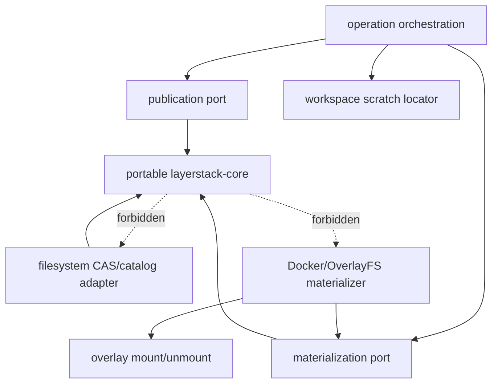
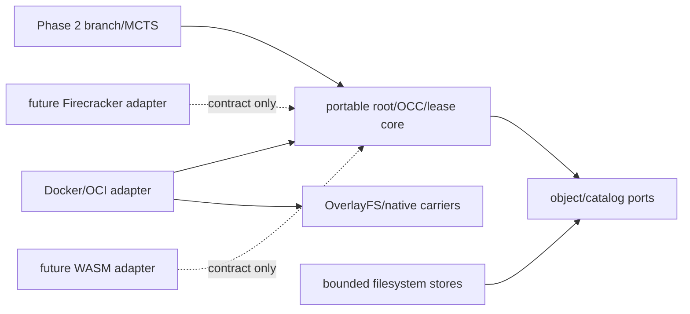
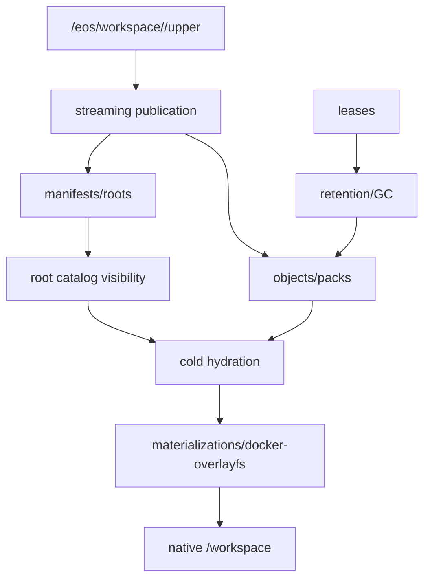
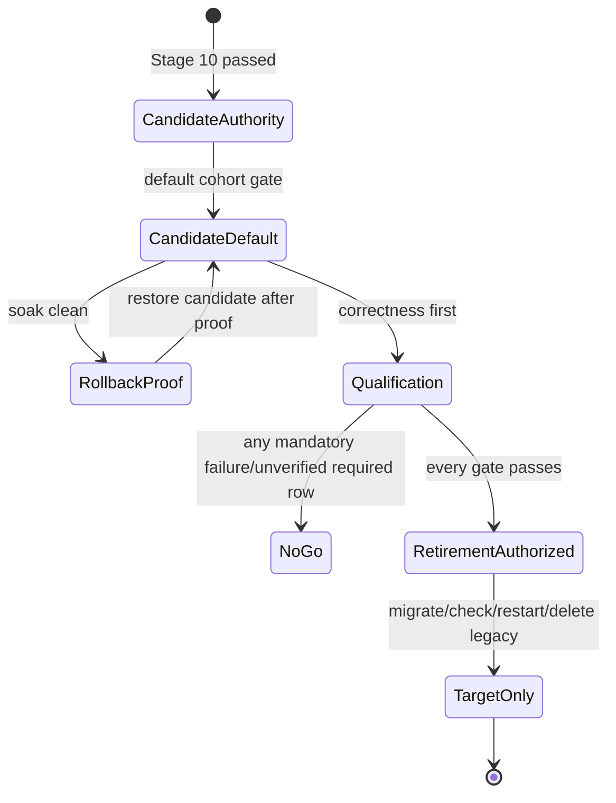

# Stage 11 — Qualification, default enablement, and legacy retirement

[Implementation overview](../index.md) · [Stage 11 E2E plan](e2e_test.md) · [Preparation 03](../../prep/03-seqcdc-cas-and-squash-decision.md) · [Preparation 04](../../prep/04-seqcdc-space-time-complexity-and-acceptance-criteria.md)

Product root: `/Users/yifanxu/Ephemeral-AI-Lab/ephemeral-sandbox`
Test root: `/Users/yifanxu/Ephemeral-AI-Lab/ephemeral-sandbox-test`

## 1. Stage contract

| Field | Contract |
| --- | --- |
| Status | Proposed final integration and qualification tier |
| Dependencies | Stages 00–10, including the completed Stage 10 candidate-authority soak interval and a demonstrated rollback |
| Owners / affected crates | All Phase 1 storage, workspace-scratch, operation, overlay adapter, config, CLI, E2E, benchmark, packaging, and release-matrix owners |
| Objective | Make the qualified candidate the default, prove every cumulative Phase 1 correctness/resource/time/space/dependency/portability gate, demonstrate rollback once more, and only then retire legacy writers/readers and transitional artifacts. |
| User-visible outcome | Existing command, file, PTY, stdin, workspace, publish, export, squash, and recovery behavior remains compatible; storage defaults to portable SeqCDC/CAS roots with native Docker/OverlayFS materializations. |
| Scope | Complete affected regression, normative Docker Desktop/Ubuntu qualification, all required host-release rows using the sole pinned Ubuntu 24.04 target image, long-lived memory and disk matrices, candidate default/soak/rollback, mixed-root migration completion, legacy retirement, final documentation. |
| Non-goals | Firecracker or WASM implementation; Windows containers; new PTY parity; a resident materialization for every inactive root; execution-time CAS VFS; Phase 2 branch/MCTS policy. |
| Entry | Stage 10 candidate authority has zero unexplained mismatch/corruption/fallback, its soak duration and cohort are approved, all legacy roots are readable/migratable, rollback preserves candidate data, and the recorded implementation lineage proves all Phase 1 changes descend from the newest approved immutable base on mandated branch `upgrade-2.0-phase-1`. |
| Exit | Every mandatory correctness gate precedes and passes before scoring; every prep-04 normative gate passes; all required-release host rows execute using Ubuntu 24.04 OCI index `sha256:4fbb8e6a8395de5a7550b33509421a2bafbc0aab6c06ba2cef9ebffbc7092d90` and record the resolved platform manifest; external dependency delta is exactly zero; scalar core is safe and ≤300 physical non-test Rust lines or has an approved exception; rollback passes; then legacy writes/readers/data are retired and restart recovery proves the target-only tree. Cross-image portability is deferred beyond Phase 1 and is not an acceptance or retirement gate. |
| Rollback | Before retirement, restore Stage 10 `candidate_authoritative_with_legacy_shadow`. After retirement is authorized, rollback is a versioned restore procedure from the retained pre-retirement snapshot/backup into a binary that still contains the compatibility reader; destructive cleanup never precedes that proof. |

No row, metric, or workload is “passed” by this document. Missing evidence is
`unverified`; any unverified required-release host row or normative metric is a
no-go. Cross-image portability is deferred beyond Phase 1 and cannot create a
Phase 1 no-go.

## 2. Current evidence

| Status | Repository / path | Symbol / evidence | Effect |
| --- | --- | --- | --- |
| observed | product `README.md:45-79` | released host artifacts | Current releases name Linux amd64, macOS arm64, and Windows amd64. These define required-release host families. |
| observed | product `docs/windows-setup.md:4-17` | Windows contract | Windows 11 uses Docker Desktop Linux containers; Windows containers are out of scope. |
| observed | product `docs/macos-setup.md:4-8,102-106` | macOS contract | Apple-silicon arm64 is published; Intel macOS is not. |
| observed | product `config/linux-amd64.yml`, `config/macos-arm64.yml`, `config/windows-amd64.yml` | provider platform | The target daemon is Linux musl amd64/arm64 inside Docker even when the host is macOS/Windows. |
| observed | product `crates/sandbox-runtime/namespace-process/src/lib.rs:1-7` and overlay kernel mount code | Linux provider mechanics | Linux namespace/mount/unsafe mechanics are provider-side and cannot enter portable core identity. |
| observed | test `benchmark/backend/benchmark_lab/resource_sampling.py:19-204` | resource sources | Logical/allocated disk and public cgroup sources exist. Daemon RSS is explicit `unavailable` when process identity cannot be proven; Docker sampling is the independent fallback. |
| observed | test `benchmark/backend/benchmark_lab/artifacts.py:52-127,535-751` | artifact formats | Immutable run bundles and bounded evidence already exist; final results extend these rather than create another store. |
| observed | test `e2e/manager/management/squash/`, `export/`, `e2e/compound/stress/`, `e2e/observability/resource_*` | affected regression assets | Existing suites cover squash/remount, export, stress, resource isolation/efficiency; Stage 11 adds the Phase 1 matrix and promotes earlier planned-final cases. |
| proposed | Stages 02–10 | v2 root/CAS/materialization contracts | Stage 11 validates their accumulated implementation, then deletes only compatibility code whose removal gate passes. |
| open | release owner | exact execution infrastructure | Linux and Windows runners must be available at the frozen versions below; unavailable required rows block production go/no-go. |
| open | legal owner | adapted SeqCDC notice | Apache-2.0 provenance/notice review must be recorded before release. |

The original planning preflight—product `main` at `7e8f4562f9079f27dcb5b514f6e4546b87e5aa04`, Darwin 25.4 arm64, Docker Desktop 4.76.0/Engine 29.5.2—is provenance only. Qualification uses the final implementation commits and clean artifacts.

## 3. Resulting file and folder structure

### Cumulative target source/test tree

```text
ephemeral-sandbox/
├── Cargo.toml                                                        [modify] — internal core member only
├── Cargo.lock                                                        [unchanged contract] — external identities/features
├── config/
│   ├── prd.yml                                                       [modify] — candidate_default; no legacy scratch root
│   ├── bench.yml                                                     [modify] — qualification settings
│   ├── linux-amd64.yml                                               [modify] — target format/mode
│   ├── macos-arm64.yml                                               [modify] — target format/mode
│   └── windows-amd64.yml                                             [modify] — target format/mode
├── docs/maintainer-architecture.md                                   [modify] — portable core/provider laws
├── crates/sandbox-config/src/configs/runtime.rs                       [modify] — final rollout/config schema
├── crates/sandbox-runtime/layerstack-core/
│   ├── Cargo.toml                                                    [add] — std/internal dependencies only
│   ├── src/
│   │   ├── lib.rs                                                   [add]
│   │   ├── canonical.rs                                             [add]
│   │   ├── path.rs                                                  [add]
│   │   ├── identity.rs                                              [add]
│   │   ├── manifest.rs                                              [add]
│   │   ├── seqcdc.rs                                                [add]
│   │   ├── publication.rs                                           [add]
│   │   ├── lease.rs                                                 [add]
│   │   ├── retention.rs                                             [add]
│   │   ├── maintenance.rs                                           [add]
│   │   └── ports.rs                                                 [add]
│   └── tests/
│       ├── golden.rs                                                [add]
│       ├── fragmentation.rs                                         [add]
│       ├── contracts.rs                                             [add]
│       └── resource_bounds.rs                                       [add]
├── crates/sandbox-runtime/layerstack/
│   ├── src/
│   │   ├── object_store.rs                                          [add]
│   │   ├── pack_store.rs                                            [add]
│   │   ├── index_store.rs                                           [add]
│   │   ├── catalog_store.rs                                         [add]
│   │   ├── journal_store.rs                                         [add]
│   │   ├── recovery.rs                                              [add]
│   │   ├── docker_materializer.rs                                   [add]
│   │   ├── storage_budget.rs                                        [add]
│   │   ├── observe.rs                                               [modify]
│   │   └── legacy_v1/                                               [remove] — after gate
│   └── tests/
│       ├── publication_recovery.rs                                  [add]
│       ├── materialization.rs                                       [add]
│       ├── retention_gc.rs                                          [add]
│       ├── squash_identity.rs                                       [add]
│       └── mixed_migration.rs                                       [add]
├── crates/sandbox-runtime/workspace/
│   ├── src/
│   │   ├── scratch_locator.rs                                       [add]
│   │   ├── overlay/capture.rs                                       [modify]
│   │   └── session/manager.rs                                       [modify]
│   └── tests/
│       ├── execution_scratch.rs                                     [add]
│       └── streaming_capture.rs                                     [add]
├── crates/sandbox-runtime/operation/
│   ├── src/
│   │   ├── services.rs                                              [modify]
│   │   ├── observability.rs                                         [modify]
│   │   ├── command/service/exec_command.rs                          [modify]
│   │   ├── command/exec_value.rs                                    [modify]
│   │   └── layerstack/                                              [modify] — orchestration only
│   └── tests/
│       ├── candidate_routes.rs                                      [add]
│       ├── migration.rs                                             [add]
│       └── scratch_lifecycle.rs                                     [add]
├── crates/sandbox-runtime/overlay/                                    [unchanged contract] — mount/unmount adapter
├── crates/sandbox-runtime/namespace-execution/                        [unchanged contract] — command/process contract
├── crates/sandbox-runtime/namespace-process/                          [unchanged contract] — command/process contract
└── crates/sandbox-cli/                                                [modify] — compatible structured observation

ephemeral-sandbox-test/
├── e2e/runtime/layerstack_phase1/                                     [add] — cumulative route/recovery/migration cases
├── e2e/runtime/workspace_session/                                     [modify] — scratch and publication assertions
├── e2e/manager/management/squash/                                     [modify]
├── e2e/manager/management/export/                                     [unchanged contract]
├── e2e/compound/stress/                                               [modify]
├── e2e/observability/resource_isolation/                              [modify]
├── e2e/observability/resource_efficiency/                             [modify]
├── e2e/fixtures/layerstack_phase1/                                    [add] — corpora, roots, image records
├── e2e/schemas/layerstack_phase1/                                     [add] — evidence schemas
├── benchmark/presets/
│   ├── layerstack-phase1-tiny.yml                                     [add]
│   ├── layerstack-phase1-selection.yml                                [add]
│   ├── layerstack-phase1-rss.yml                                      [add]
│   ├── layerstack-phase1-space.yml                                    [add]
│   └── layerstack-phase1-qualification.yml                            [add]
├── .e2e-state/                                                        [unchanged contract] — run-owned evidence
└── .benchmark-state/                                                  [unchanged contract] — run-owned evidence
```

`layerstack-core/src/lib.rs` exports explicit modules/value types; it is not a grouping façade that re-exports provider implementations. Test support remains in `tests/`.

### Final `/eos` tree

Annotation format:
`[change; class; owner; create→visible→durable→recover→delete; RootId; R/W; bound; space; permissions/exposure]`.

```text
/eos/
├── layer-stack/ [migrate; truth-root; filesystem adapter; install→open→dir-fsync→catalog recovery→uninstall; no; candidate R/W; one; M; 0700/masked]
│   ├── .storage-writer.lock [existing; coordination; catalog adapter; open→lock→kernel durable→reacquire→close; no; candidate R/W; one FD; M; daemon-only]
│   ├── format-v2.json [add; format truth; adapter; first migration→atomic visible→fsync→validate→format retirement only; no; candidate R; one≤4KiB; M; daemon-only]
│   ├── roots/v2/<prefix>/<RootId>.root [add; logical truth; core schema/adapter; publication→catalog commit visibility→fsync→hash/recovery→retention GC; contains identity; candidate R/W; retained roots; H_cold metadata; 0440 daemon]
│   ├── manifests/v2/<prefix>/<TreeManifestId>.manifest [add; logical truth; core schema/adapter; publication→root strong edge→fsync→hash/recovery→reachability GC; hashed by RootId; candidate R/W; streamed E records; H_cold/M; daemon-only]
│   ├── objects/v1/loose/<prefix>/<ObjectId>.obj [add; logical truth/temporary locator; object store; ingest→locator commit→fsync→hash verify→pack/GC; strong content edge; candidate R/W; one chunk 1..32768B; H_cold; daemon-only]
│   ├── packs/v1/
│   │   ├── open/<PublicationId>.pack [add; txn; pack writer; publication→private→fsync/seal→journal replay→delete/promote; no until locators commit; candidate W; ≤64MiB/100k records/80MiB allocation; P_staging; 0600]
│   │   └── sealed/<PackId>.pack [add; logical truth locator; pack store; seal→locator commit→fsync→index recovery→GC/compaction; object IDs cover payload; candidate R/W; ≤64MiB payload; H_cold; 0440]
│   ├── indexes/v1/
│   │   ├── pages/<page>.idx [add; rebuildable bounded index; index store; flush→catalog pointer→fsync→rebuild→supersede; no; candidate R/W; 4KiB/page, cache≤4096 pages; M; daemon-only]
│   │   └── index.catalog [add; rebuildable root; index store; page flush→atomic pointer→fsync→rebuild→supersede; no; candidate R/W; bounded root; M; daemon-only]
│   ├── catalogs/v1/
│   │   ├── roots.catalog [add; truth; catalog transaction; publish commit→atomic generation→fsync→journal replay→compact; publication identity; candidate R/W; disk-backed; M; daemon-only]
│   │   ├── locators.catalog [add; truth; object locator owner; object/pack verify→atomic generation→fsync→rebuild/replay→GC; no logical identity; candidate R/W; disk-backed; M; daemon-only]
│   │   ├── materializations.catalog [add; provider truth; materializer; verified carrier→generation swap→fsync→recovery→evacuate; MaterializationKey→MaterializationId/generation/carriers, excluded from RootId; candidate R/W; active+leased generations; L_hot metadata; daemon-only]
│   │   ├── leases.catalog [add; durable safety truth; lease store; acquire→commit→fsync→expiry/recovery→release; no; candidate R/W; bounded active leases; M; daemon-only]
│   │   └── retention.catalog [add; retention truth; retention owner; pin→epoch commit→fsync→recovery→unpin; weak ancestry only when pinned; candidate R/W; disk-backed; M; daemon-only]
│   ├── journals/v1/
│   │   ├── publication/<PublicationId>.journal [add; txn truth; publication; intent→phase fsync→commit recovery→terminal compact; no; candidate R/W; ≤256KiB/op; P_staging/M; 0600]
│   │   ├── hydration/<id>.journal [add; txn truth; materializer; intent→phase fsync→resume/abort→terminal compact; no; candidate R/W; ≤256KiB; P_staging/M; 0600]
│   │   ├── squash/<id>.journal [add; txn truth; squash orchestrator; plan→phase fsync→state-machine recovery→DONE compact; no; candidate R/W; ≤256KiB; P_staging/M; 0600]
│   │   ├── compaction/<id>.journal [add; txn truth; maintenance; intent→phase fsync→resume→DONE compact; no; candidate R/W; ≤256KiB; P_staging/M; 0600]
│   │   └── migration/<id>.journal [add; txn truth; migration; root claim→phase fsync→resume→DONE compact; no; candidate R/W; ≤256KiB; P_staging/M; 0600]
│   ├── staging/v2/
│   │   ├── publication/<id>/ [add; txn; publication; admit→private→verify/fsync→promote/reap; no; candidate W; capture+≤5%; P_staging; 0700]
│   │   ├── hydration/<id>/ [add; txn; materializer; miss→private→verify/fsync→catalog swap/reap; no; candidate W; C_target+≤5%; P_staging; 0700]
│   │   ├── squash/<id>/ [add; txn; squash; plan→private→verify/fsync→catalog swap/evacuate; no; candidate W; one replacement+leased old; P_staging; 0700]
│   │   ├── compaction/<id>/ [add; txn; maintenance; slice→private→verify/fsync→locator swap/reap; no; candidate W; one bounded source+target; P_staging; 0700]
│   │   └── migration/<id>/ [add; txn; migrator; legacy root→private→verify→catalog commit/reap; no; candidate W; admitted bounded txn; P_staging; 0700]
│   ├── leases/v1/<LeaseId>.lease [add; durable safety truth; lease store; acquire→catalog-visible→fsync→restart validate→release; no; candidate R/W; active bounded; M; daemon-only]
│   ├── retention/v1/
│   │   ├── epochs/<epoch>.epoch [add; durable GC frontier; retention; seal→catalog-visible→fsync→recovery→grace expiry; no; candidate R/W; ≥one complete durable epoch; M; daemon-only]
│   │   └── pins.catalog [add; durable roots; retention; pin→commit→fsync→recover→unpin; weak root retention; candidate R/W; disk-backed; M; daemon-only]
│   ├── maintenance/v1/
│   │   ├── gc.cursor [add; resumable GC cursor truth; maintenance; slice start→checkpoint→fsync→resume→completion; no; candidate R/W; ≤100k records or 64MiB/slice; M; daemon-only]
│   │   └── compaction.cursor [add; resumable compaction cursor truth; maintenance; slice start→checkpoint→fsync→resume→completion; no; candidate R/W; ≤100k records or 64MiB/slice; M; daemon-only]
│   ├── materializations/docker-overlayfs/v1/<MaterializationId>/
│   │   └── carriers/<ordinal>/ [add; rebuildable provider cache/native hot carrier; materializer; hydrate/squash→catalog swap→syncfs→validate/rebuild→lease-safe evacuation; excluded from RootId; Docker adapter R/W then lower R; D≤64; L_hot/C_target; read-only lower/masked]
│   ├── quarantine/v1/<id>/ [add; isolated corruption evidence; recovery; detect→never active→fsync→operator inspect→policy delete; no; no normal reader; bounded by explicit policy; M/P_staging; 0700]
│   └── trash/v1/<epoch>/ [add; recoverable deletion staging; GC; final checks→rename→dir-fsync→restart recheck→unlink; no; maintenance W; one bounded epoch/slice; P_staging; 0700]
├── storage/
│   ├── file_auditability/ [existing; separate truth; FileService; unchanged lifecycle; no; service R/W; configured; M; daemon-only]
│   └── workspace_recovery/ [existing conditional; cleanup recovery; workspace; failure→fsync→boot retry→success delete; no; recovery R/W; ≤1MiB/1024 entries/depth32 per current cap; P_staging; daemon-only]
├── workspace/
│   ├── manager.json [existing; crash-recovery truth; WorkspaceManager; handle update→atomic visibility→fsync→boot reap→supersede; no; workspace R/W; bounded active sessions; M; daemon-only]
│   ├── .export/ [existing ephemeral; export owner; request→private/stream→bounded artifact→boot cleanup→delete; no; operation R/W; configured spool bound; P_staging; daemon-only]
│   └── <workspace_session_id>/
│       ├── upper/ [existing; native active scratch; workspace; create→mount→native writes→recovery→post-command teardown; no; workspace R/W; ΣU_active; masked except `/workspace`]
│       ├── work/ [existing; provider scratch; overlay; mount→kernel-private→kernel→unmount→delete; no; adapter R/W; per session; ΣU_active metadata; masked]
│       └── executions/<namespace_execution_id>/
│           └── transcript.log [migrate; command scratch; command owner; admission→command-visible→bounded write→owner release→workspace deletion; no; namespace execution R/W; transcript configured cap; ΣU_active/M; 0600/masked]
└── runtime/daemon/
    ├── runtime.sock [existing; ephemeral control; gateway; boot→ready→socket permission/stale recovery→shutdown; no; service R/W; one; M; 0600/masked]
    └── runtime.pid [existing; ephemeral control; gateway; boot→ready→identity/stale recovery→shutdown; no; service R/W; one; M; daemon-only]
```

Removed only after the retirement gate: `manifest.json`, `workspace.json`, `base/`, `layers/`, legacy `staging/<layer>.staging`, `.layer-metadata/`, and the global `/eos/namespace_execution/`. `/eos/attempts` never exists. Deletion requires a complete migration catalog, no legacy-authority/read counters during the soak, a restorable pre-retirement snapshot, restart validation, and final lease/root recheck.

## 4. SRP, SOLID, and coupling design

| Component/type | One responsibility | Dependencies | Dependents | Extension seam | Reason to change | Must not own |
| --- | --- | --- | --- | --- | --- | --- |
| portable domain values | Canonical logical identity and format | std + `Digest32` capability | publication/storage adapters | versioned codecs | logical schema | `/eos`, Docker, telemetry |
| scalar SeqCDC | Deterministic boundary selection | std | ingest | versioned `ChunkerProfile` | algorithm/profile | object persistence, async |
| publication state machine | OCC and single-root visibility | ports/value types | operation adapter | contract implementation | transaction rules | materialization/mount |
| filesystem object/catalog stores | Durable bytes and locators | existing sha2/serde/rustix edges | portable ports | format adapters | filesystem format | rollout policy |
| Docker materializer | Reconstruct and verify native carriers | object source + overlay contracts | workspace orchestration | `MaterializationPort` | provider mechanics | RootId/publication/GC policy |
| retention/GC owners | Reachability and bounded reclamation | catalogs/leases | maintenance supervisor | policy inputs | retention policy | provider activation |
| workspace scratch locator | Validated session-local execution paths | workspace identity | command orchestration | provider locator impl | scratch layout | transcript lifecycle |
| operation orchestration | Sequence public workflows and mode | narrow ports/config | daemon APIs | rollout enum | workflow | storage internals |



The disruptive split repairs three observed defects: physical paths determine current identity; process-only leases/substitution cannot protect restart recovery; projection/capture can retain whole-tree/file data. A module-only split was considered but cannot compile-enforce provider isolation or the std-only dependency budget. The compatibility bridge was legacy v1 plus staged modes; Stage 11 deletes it only after evidence.

Forbidden edges: core → filesystem/Docker/overlay/operation/telemetry; provider → root/publication/retention policy; namespace execution → storage; workspace → catalogs; test code → production `src/`; any cycle; any broad context that exposes unrelated capabilities.

### Dependency delta

| Manifest/graph | Baseline | Resolved package/version delta | Feature delta | Direct external edge delta/relocation | System/runtime delta | Internal edge | Evidence |
| --- | --- | --- | --- | --- | --- | --- | --- |
| all frozen Cargo target/feature invocations | exact Stage 00 sets; current host diagnostic 291 resolved/271 external/116 direct/490 feature pairs | none | none | none | none | add root workspace→core and layerstack→core only | exact before/final canonical sets |
| `layerstack-core/Cargo.toml` | absent | none | none | zero external | none | std/internal only | manifest audit |
| Python/npm | Stage 00 lock/manifests | none | none | none | none | none | byte/hash comparison |
| system/image/runtime | gateway+daemon+Docker | none | none | none | none | none | process/socket/package/helper inventory |

`sha2`, `serde`, `serde_json`, `rustix`, compression, and async facilities stay with existing owning crates. Core uses a narrow `Digest32` implementation supplied by layerstack; no wrapper exists merely to game counts.

### Portability and change impact

| Boundary | Before | After | Owner | Final evidence |
| --- | --- | --- | --- | --- |
| path | UTF-8/host `PathBuf` leaks into legacy change handoff | validated Linux byte path at provider boundary; canonical bytes in core | core/provider | golden cross-host/path corpus |
| CPU/byte order | host serializer/runtime assumptions | explicit-width canonical big-endian encoding; scalar safe SeqCDC | core | scalar forced on amd64/arm64 |
| target image | command/userland often assumed by tests | storage uses host/daemon syscalls only | Docker adapter | public API proof plus read-only/non-root runtime variants of the sole pinned Ubuntu 24.04 image on each required host |
| provider | physical lower paths in revision | `MaterializationId` and provider locator excluded from `RootId` | adapter | squash/root stability and alternate adapter contract tests |

Adding an approved StreamCDC profile changes only a new core profile implementation, profile registry, goldens, and selection config; RootId includes the versioned profile, while publication/leases/providers remain stable. Adding Firecracker changes a new materializer/activation adapter and capability report; adding WASM/WASI does the same. Neither edits logical identity, object formats, OCC, leases, retention, journals, recovery, or GC. Contract tests are shared against each `MaterializationPort`. Phase 2 uses `RootId`, parent/base provenance, OCC, diff/blame, activation, leases, retention, rollback without a resident sandbox per node. Phase 3 adapters use the same truth plane.

The god-object audit rejects any type owning two of chunking, persistence, publication, materialization, policy, and telemetry. Constructor inputs list each port/budget/clock explicitly. Errors translate at adapter boundaries and never expose `/eos` or mount handles in core.

## 5. Type, class, and field design

Final central signatures:

```rust
#[repr(transparent)]
pub struct Digest32([u8; 32]);
#[repr(transparent)]
pub struct RootId(Digest32);
#[repr(transparent)]
pub struct TreeManifestId(Digest32);

pub enum ObjectKind {
    FileSegments = 2,
    ChunkPayload = 3,
    Transition = 4,
}

pub struct ObjectId {
    pub kind: ObjectKind,
    pub digest: Digest32,
}

#[repr(transparent)]
pub struct PublicationId([u8; 16]); // caller-stable, nonzero idempotency value
pub struct MaterializationId(Digest32);
pub struct MaterializationGeneration(pub u64);
pub struct RetentionEpoch(pub u64);

pub struct RootRecordV2 {
    pub format: FormatVersion,
    pub required_capabilities: CapabilitySet,
    pub chunk_profile: ChunkProfileId,
    pub tree_manifest: TreeManifestId,
    pub parent: Option<RootId>,
    pub base: Option<RootId>,
    pub publication: PublicationIdentity,
}

pub struct PublicationIdentity {
    pub generation: u64,
    pub id: PublicationId,
}

pub struct PublicationRequest<'a> {
    pub publication_id: PublicationId,
    pub expected_root: RootId,
    pub changes: &'a mut dyn ChangeStream,
}

pub struct PublicationCommit {
    pub root: RootId,
    pub publication_generation: u64,
    pub disposition: PublicationDisposition,
}

pub trait TypedDigest {
    fn digest(&mut self, domain: HashDomain, bytes: &[u8]) -> Result<Digest32, Error>;
}

pub trait ObjectSink {
    fn put_verified(&mut self, id: ObjectId, bytes: BorrowedChunk<'_>)
        -> Result<PutDisposition, ObjectError>;
}

pub trait ObjectSource {
    fn read_verified(
        &self,
        id: ObjectId,
        budget: &mut dyn ResourceBudget,
        out: &mut dyn std::io::Write,
    ) -> Result<u64, ObjectError>;
}

pub trait CatalogTransaction {
    fn compare_and_commit(
        &mut self,
        expected: RootId,
        record: &RootRecordV2,
        idempotency: PublicationId,
    ) -> Result<PublicationCommit, CommitError>;
}

pub trait MaterializationPort {
    type Locator;
    fn ensure(
        &self,
        root: RootId,
        key: MaterializationKey,
        budget: &mut dyn ResourceBudget,
    ) -> Result<VerifiedMaterialization<Self::Locator>, MaterializeError>;
}
```

Identity/config types are immutable validated values; arrays and explicit-width integers avoid architecture dependence. `RootRecordV2`, `PublicationIdentity`, and `PublicationId` above deliberately reuse the exact Stage 02 names, fields, representations, and canonical encoding: no qualification-stage alias or codec mapping exists. `RootId` covers that exact canonical root record; parent/base is identity-bearing provenance but a weak GC edge unless pinned. The complete tree manifest and referenced metadata/content are strong reconstruction edges. `MaterializationKey = (RootId, backend_kind, backend_format_version, target_profile)` and provider locator/generation are excluded from logical identity.

Owned buffers belong to admitted operations and draw from the 64 MiB global byte semaphore. Back-references are IDs or `Weak`; supervisors own bounded worker join handles. No detached task survives a transaction. Collections are disk-backed or bounded: index cache 4096×4 KiB, metadata queue 16/≤64 KiB, four workers, four borrowed chunks, descriptors/catalog roots only in memory.

Rollout enum ends as `CandidateDefault`; legacy variants remain deserializable only in the pre-retirement restore binary and are rejected by the target-only binary with a precise format error. Public command/file/PTY/stdin and workspace APIs remain unchanged. Unsupported PTY operations remain deterministically unsupported.

## 6. Data and compatibility design

- Hashing is typed, domain-separated SHA-256 with distinct domains for roots, tree manifests, metadata, chunks, file/segment descriptors, packs, and catalogs.
- Canonical encoding uses explicit field tags, widths, lengths, big-endian integers, deterministic byte ordering, no locale/time/inode/host-order data, and validated Linux byte paths. There is no host-native normalization round trip.
- Fixed SeqCDC profile `seqcdc-scalar-author-v1`: Increasing; min 8,192 B, effective average 16,384 B, max/window 32,768 B; threshold 5; opposing trigger 50; jump 512; one 32 KiB circular window; at most two borrowed slices; scalar safe implementation.
- Files stream descriptors referencing chunks/segments and metadata. Modes, ownership mapping, symlinks, supported hardlink groups, sparse extents, whiteouts, opaque directories, relevant xattrs, and required timestamps round-trip without target-image utilities.
- Objects and manifests are immutable. Pack locators can change; object identity cannot. Every read verifies typed ID and length.
- Publication journals intent and object/manifest work, fsyncs, then atomically commits one root-catalog generation. OCC and `PublicationId` make retry idempotent.
- Hydration stages a complete target, verifies content/metadata, fsyncs it and its parent, then swaps the materialization catalog. Partial targets are never visible.
- Squash changes only materialization ID/generation, not `RootId` or publication generation.
- Corrupt/missing/truncated/mismatched data fails closed and is quarantined; strict mode has no legacy fallback.
- Legacy v1 readers/writers are removed only after every legacy root has a v2 mapping and target-only restart passes. Fixtures remain historical evidence; they are not mutated.

Downgrade after retirement requires the documented restore binary/snapshot and never asks an older binary to interpret v2 in place. The final target writes only v2.

## 7. Workflow and failure semantics

Final publish: quiesce/lease captured upper → stream canonical changes through SeqCDC/object sink → journal and verify objects/manifests → OCC compare-and-commit one root → expose publication generation → release source/buffers/permits → asynchronously maintain packs within bounds.

Final activation: resolve root and materialization catalog in `O(D)` with zero CAS payload when warm; otherwise journal cold hydration, stream missing bytes into a private carrier, verify/fsync, atomically swap catalog, acquire overlapping lease, mount via overlay, then expose workspace. Normal command/file/PTY/stdin use native files only.

Final squash: `PLANNED→BUILDING→VERIFIED→COMMIT_INTENT→INSTALLED→REMOUNTING→EVACUATING→DONE`; `ABORTED/CONFLICT` only before `INSTALLED`. Build outside freeze; materialization-catalog generation swap is linearization; leases overlap; remount uses verified FDs; durable trash deletion waits one epoch and final generation/lease recheck.

GC/compaction streams a disk-backed live set and bounded cursor; it never loads all roots/objects. Content/metadata edges are strong; provenance is weak absent pins. A fault at every journal/fsync/rename/catalog/locator/lease/mount/trash boundary has an idempotent restart outcome. Disk full fails before visibility and never deletes authoritative input.

### Memory resource lifecycle

| Resource retained in memory | Owner | Acquire | Hard bound / permit | Normal release | Error/cancel/panic | Shutdown/restart | Evidence |
| --- | --- | --- | --- | --- | --- | --- | --- |
| SeqCDC window + publication ring | publication worker | admitted file | 32 KiB +32 KiB; global semaphore | after final chunk/file | RAII; source lease release | journal replay has no buffer | live/high-water bytes |
| borrowed chunks | object sink call | boundary emit | ≤1/worker, ≤4 global, at most 2 slices/chunk | after synchronous hash/write | stack unwind | none durable | borrowed count |
| payload queue | none | N/A | exactly 0 bytes | synchronous | synchronous | N/A | queue bytes=0 |
| metadata queue | publication | descriptor emit | 16 items and≤64 KiB | consumer ack | drain/drop/join | journal resumes | queue gauges |
| manifest/journal encoder | admitted operation | encode phase | ≤256 KiB/op | phase fsync | drop; prior phase replay | replay allocates same bound | owned bytes |
| hydration/pack output | storage worker | admitted read/write | 256 KiB each/worker | worker phase end | drop/fence | restart cursor | buffer gauge |
| merge readers | maintenance | external merge | fan-in8×64 KiB | run completion | close/drop | cursor replay | FD/buffer gauge |
| index cache | shared index owner | page lookup | 4096×4 KiB=16 MiB | LRU eviction/shutdown | poison fails closed | cold rebuild | cache current/high-water |
| publication managed memory | transaction | admission | ≤4 MiB excluding cache | quiescence | cancel/drop/join | journal only | transaction bytes |
| storage workers | bounded supervisor | daemon boot | 4 global | shutdown cancel+join | panic contained/replaced within bound | boot recovery | worker count |
| storage permits | budget owner | operation admission | 64 MiB global | RAII permit drop | unwind/drop | reset after replay ownership | permit bytes |
| leases/registries | durable stores + bounded handles | acquire | active owners + configured terminal caps | explicit release/eviction | cleanup guard | recover from catalogs | counts |
| mappings/FDs | adapter transaction | open verified files | bounded by workers/fan-in/D | close after phase/remount | RAII/fenced late worker | reopen from durable IDs | FD/map counts |

Cancellation requests the owner, stops admission, joins within the documented five-second deadline, fences any late worker from visibility, and returns permits. Operation handle completion, empty queues, zero transaction-owned bytes/permits, expected idle workers, released temporary leases/mappings/FDs, terminal registries within capacity, and no owned staging define logical quiescence. Poll at 100 ms for ≤5 seconds; missing data fails.

## 8. Complexity and performance contract

| Operation | Inputs | Expected / worst time | Peak app memory | Temporary disk | Settled disk | I/O |
| --- | --- | --- | --- | --- | --- | --- |
| boundary/hash | `U,K` | `O(U+K)=O(U)` | 32 KiB window/ring + descriptors | none | objects only | sequential |
| publication | `U,E,K` | `O(U+E+K)`; external order up to `O(E log E)` | `O(B)`, ≤4 MiB/op excl cache | `C_capture` +≤5% staging | unique objects/manifests/native current | sequential + bounded merge |
| warm prepare/mount | `D≤64` | `O(D)` | descriptors/FDs bounded by D | none | none | metadata only; zero CAS payload |
| cold hydration/activation | `R,E,D` | `O(R+E)` / `O(R+E+D)` | 256 KiB/worker + bounded metadata | `C_target`+≤5% | one current native target | sequential |
| squash | `S,E_s,D` | build `O(S+E_s)`; freeze `O(D+tasks+verified FDs)` | `O(B)` | one replacement + leased old | one selected generation | sequential + metadata |
| GC/compaction | `G` | `O(G)`/slice | bounded fan-in/cache | one bounded source+target | live packs, slack target | sequential/external merge |
| diff/OCC/blame | `Q,N` | `O(Q log N)` + bounded output | index pages/output cap | none | none | indexed |

Complete physical accounting is always:

```text
T(t) = L_hot + H_cold + ΣU_active + P_staging + M
D_ideal = C_current + H_unique
```

### Final stage-gating numeric contract

Every row below is `stage-gating`:

- warm root resolve/session preparation p50/p95 ≤ baseline +5%+2 ms, zero CAS payload; OverlayFS mount same;
- frozen remount p50/p95 ≤ baseline +5%+2 ms; full squash p50/p95 ≤ baseline +10%+5 ms;
- no-op exec p50/p95 ≤ baseline +3%+0.5 ms; native command throughput ≥97%;
- PTY create ≤baseline +3%+1 ms; drain/supported stdin/control-C/control-D ≤baseline +3%+0.5 ms; resize/arbitrary signal/literal EOF preserve deterministic unsupported behavior;
- sequential native read/write ≥97%; concurrent disjoint publication ≥90%; small-edit publish p95 ≤baseline +15%+5 ms;
- cold hydration ≥70% native copy; cold activation p95 ≤1.5× verified native copy + warm allowance;
- fixed SeqCDC chunk count `ceil(U/32KiB)≤K≤ceil(U/8KiB)` for nonempty U; sub-min file one actual-length chunk; measured mean within 5% of16 KiB;
- SeqCDC selection advantage ≥10% for localized-large-source and mixed-tree, no-dedup/many-small regression≤3%, three fresh matched sets, ≥5 interleaved samples/workload/invocation, counterbalanced, paired-bootstrap 95% lower bound≥0.10; equal StreamCDC distribution has same min/max, means within5%, p10/p50/p90 within10%;
- SeqCDC unique retained≤1.14× StreamCDC; localized F≥16MiB/edit≤64KiB target `changed+2×32KiB+segment overhead`, algorithm hard failure median>4×target or any≥25%F;
- managed publication memory≤4MiB excluding 16MiB index cache; 64MiB semaphore; four workers/chunks; exact buffer/queue/fan-in bounds above; native depth≤64;
- RSS≤384MiB absolute and≤128MiB above idle raw at every cold point: inputs 64MiB/256MiB/1GiB × roots1/16/64, three reps each; adjusted median final/peak variation≤16MiB across series and no 4× input/history adds>8MiB;
- first/last settled windows and robust slope inside frozen raw noise and16MiB tolerance; logical release passes independently; no restart/purge/trim/allocator swap;
- mixed/no-dedup settled amplification target≤1.08, hard>1.15; many-small target≤1.15, hard>1.25; avoidable duplication target≤1%, hard>3%; pack dead/slack target≤2%, hard>5%; persistent unexplained unreachable bytes zero; depth>64 fails;
- metadata≤96B/chunk,≤64B/segment ref,≤256B+path bytes/changed path; recovery residue≤1MiB+min(1% retained payload,64MiB) and no pending transaction;
- enqueue autosquash projected D≥48; compact/reject before D>64; routine benefit≥8 carriers; manual≥2;
- pack payload≤64MiB, records≤100k, allocation≤80MiB; individual compaction≥20% dead; urgent aggregate>5%; slice≤100k or64MiB; grace≥one durable epoch plus final check;
- corpora: mixed≥512MiB/20k files; large source≥256MiB; no-dedup≥512MiB; many-small≥100k files; sparse≥8GiB logical; repeated small/large histories;
- scalar core≤300 physical non-test Rust lines or approved exception; no unsafe/SIMD requirement; optional acceleration only safe runtime detection and byte-identical;
- no operation>60 seconds; each matched pair/invocation≤5 minutes. Each RSS point has its own five-minute raw/candidate invocation×3. Selection uses separate raw/Stream and raw/Seq invocations, the two-invocation set×3. Aggregate suite budget is separate.

Correctness, recovery, OCC, lease, atomic visibility, namespace isolation, dependency, and portability gates pass before performance or space scoring. Hard failures from prep 04 apply without weakening.

## 9. Diagrams







## 10. Implementation sequence

1. Freeze final product/test commits, clean state, binaries, configs, target-feature dependency snapshots, the sole pinned Ubuntu 24.04 OCI index and resolved per-host platform manifests, machine allocation, seeds, corpora, and raw controls. No behavior change.
2. Promote configuration from Stage 10 cohort authority to `candidate_default`; retain legacy shadow/read compatibility. Run all accumulated focused route/recovery tests.
3. Run the complete correctness/failpoint/mixed-root/scratch/resource suite. Stop before performance on any failure.
4. Execute default-mode soak, verify zero legacy authority/fallback/mismatch and bounded memory/disk, then perform and document rollback to Stage 10 and forward restoration.
5. Run the normative Docker Desktop+Ubuntu performance/space/memory matrices and SeqCDC-vs-Stream selection exactly as specified.
6. Run every required-release host triple using the same Ubuntu 24.04 OCI index `sha256:4fbb8e6a8395de5a7550b33509421a2bafbc0aab6c06ba2cef9ebffbc7092d90`, recording its resolved platform manifest, including scalar-forced differential and all available safe acceleration paths. Do not add a second target image; cross-image portability is post-Phase-1 and non-gating.
7. Compare dependency, feature, edge, system/runtime/helper, license, process, socket, and image inventories exactly; obtain Apache-2.0 provenance approval.
8. Create a durable pre-retirement snapshot and migration inventory. Prove every legacy root maps to verified v2, no legacy reader/writer counter changed during the approved soak, no legacy lease exists, and restore works.
9. In separate commits remove the legacy writer, then legacy read selection, then legacy code/config, then legacy `/eos` artifacts/global scratch. After each slice, boot/recovery and target-only focused tests pass.
10. Run target-only restart, recovery, cleanup, affected E2E regression, and a short post-retirement sentinel. Publish the immutable evidence bundle and final architecture docs.

Refactor, mode change, qualification assets, and deletion commits remain distinct. Any result-changing fix invalidates the affected evidence and is rerun narrowly before cumulative sign-off.

## 11. Observability

Final structured evidence includes mode/authority/read source; route/fallback/mismatch/shadow counts; bytes scanned/hashed/reused/new/read/written; chunk/object/file/root/layer/pack/index/journal/staging counts; root/publication/materialization generations; warm/cold classification and reconstructed bytes; lease/retention/GC/compaction decisions; live/high-water buffers/tasks/workers/queues/permits/maps/FDs/caches/registries/transactions; logical cleanup/quiescence; process RSS and scope, anonymous/file-backed when available, cgroup current/peak, Docker fallback, allocated disk by category; first/last settled delta and slope.

Evidence labels are bounded closed enums and aggregates, not object/path cardinality. Every artifact records the final commits, dirty states, environment, image index/platform digest, cache state, corpus/seed, config/mode, sampling scope, and `measured/derived/estimated/unknown`. Missing normative data is no-go.

## 12. Completion checklist

- [ ] All Stages 00–10 focused proofs are promoted and pass cumulatively.
- [ ] Correctness/recovery/OCC/lease/namespace/atomic-visibility gates pass before scoring.
- [ ] Full time, throughput, memory, lifecycle, physical-space, SeqCDC selection/locality, pack, squash, and maintenance gates pass exactly.
- [ ] Every matched pair/scale point uses its own allowed invocation and repetitions.
- [ ] Long-lived logical release and physical stability pass without restart or allocator/page-cache manipulation.
- [ ] Target `/eos` tree, permissions, lifecycle, recovery, masking, and absence of `/eos/attempts` are verified.
- [ ] Exact external package/version, feature, direct-edge, system/service/helper delta is zero on every target/feature invocation.
- [ ] Scalar implementation is safe, deterministic, portable, and within the LOC gate or has approved exception.
- [ ] Every required host row executes with the sole pinned Ubuntu 24.04 OCI index; no unverified required-release host row remains.
- [ ] Target-image shell/libc/package-manager/network independence is proven through public APIs and runtime variants of that same image.
- [ ] Cross-image portability is recorded as deferred beyond Phase 1 and does not block qualification or retirement.
- [ ] Phase 2 consumer and Phase 3 provider contract tests pass; only Docker adapter is implemented.
- [ ] Candidate default soak and rollback proof pass before retirement.
- [ ] Every transitional component meets its deletion gate; legacy deletion is separately committed and restart-tested.
- [ ] Final artifacts are complete, immutable, schema-valid, and retained.
- [ ] Only then is Phase 1 qualified and production enablement permitted.
