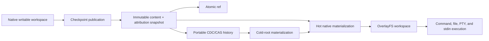

# Phase 1 — LayerStack 2.0 storage

> **Historical phase — superseded.** The current Phase 01 selected
> filesystem-native complete-Version storage in the existing LayerStack
> package; it did not select this CDC/CAS object graph, its exact `/eos`
> layout, or its retention/lease/GC model. Start current work from the V2
> [architecture](../../../ephemeral-sandbox-v2/architecture_design.md), not
> this work order. See the [archive compatibility map](../../README.md).
>
> Overview for the first phase of the
> [Ephemeral Sandbox 2.0 migration](../index.md).

| Field | Decision |
| --- | --- |
| Status | Proposed; evidence-gated |
| Goal | Replace LayerStack historical storage without replacing native execution |
| Product implementation | Rust |
| Benchmark verification | Python |
| Initial environment | Pinned Ubuntu 24.04 Docker image |
| Portability contract | Frozen supported-host release matrix plus versioned Linux-image capability profile |
| Phase 2 handoff | Stable content/attribution snapshots, refs, operations, leases, and native materialization |

## 1. Purpose

Phase 1 makes LayerStack an efficient and dependable checkpoint foundation for
the later branch and MCTS system.

The current runtime already provides fast native workspace execution through
LayerStack and OverlayFS. Phase 1 keeps that execution model and changes how
immutable history is identified, retained, reconstructed, and reclaimed.

The intended result is:

- native files for active execution;
- typed immutable CDC/CAS objects for portable, reusable historical content;
- immutable content `RootId` plus a separate immutable `AttributionRootId`;
- small atomic branch, checkpoint, pin, and lease refs;
- incremental publication through one recoverable, idempotent operation protocol;
- blame independent of content identity and temporary operation history; and
- bounded memory and disk-backed maintenance state.

## 2. Architecture boundary



CDC/CAS is not a replacement for OverlayFS. It participates in checkpoint
publication, retained history, verification, hydration, squash, and garbage
collection. Ordinary command and PTY execution continues to use the native
filesystem.

## 3. Phase 1 abstractions

| Abstraction | Purpose |
| --- | --- |
| Content `RootId` | Portable identity of one immutable logical filesystem tree |
| `AttributionRootId` | Separate portable blame snapshot for the content root selected by a ref |
| Typed object graph | Bounded-page content, attribution, and chunk representation |
| Ref | Independently atomic branch visibility, checkpoint/pin retention, or active-use lease |
| Native materialization | Mount-ready representation used by OCI/Linux execution |
| Operation | Sole bounded recovery/idempotency record for a multi-boundary workflow |
| Locator | Physical location of non-loose bytes; excluded from logical identity |
| Retention and tracing GC | Reclaims only unreachable, unleased, rechecked state |

## 4. What Phase 1 changes

Phase 1 changes:

- the identity and format of immutable LayerStack roots;
- how changed file content is retained across revisions;
- how old roots are materialized when they are no longer hot;
- how publication, leases, blame, recovery, and garbage collection are made
  durable; and
- how existing LayerStack roots migrate to the new format.

Phase 1 does not change:

- the ordinary `/workspace` filesystem seen by sandboxed commands;
- command, PTY, stdin, signal, cancellation, or child-reaping semantics;
- namespace isolation;
- the private writable upper owned by each active execution; or
- the requirement that target images need no LayerStack utility.

## 5. Complete `/eos` structure

This is the complete migration-time ownership tree. It is duplicated here deliberately
so a reader of the 2.0 migration specification does not have to infer whether
WorkspaceManager, runtime, or v1 compatibility paths belong to LayerStack. The
canonical field, durability, and deletion rules remain in the
[minimal storage contract](implementation/layerstack_storage_contract.md#4-complete-eos-ownership-and-storage-tree).

Directories are created only when a feature first persists a child. The bracketed v1
entries are pre-existing compatibility artifacts in their current locations; they are
not a new `legacy/` namespace.

```text
/eos/
├── layer-stack/                                      LayerStack durable owner
│   ├── .storage-writer.lock                          brief cross-process commit fence
│   ├── CONTROL                                       format/authority/retirement fence
│   ├── objects/
│   │   ├── loose/<kind>/<digest-prefix>/<typed-id>   canonical immutable logical bytes
│   │   ├── packs/<pack-id>.pack                      optional immutable compaction output
│   │   └── locators/
│   │       ├── <run-id>.sst                          immutable non-loose location map
│   │       └── CURRENT                               selected locator-run set
│   ├── refs/
│   │   ├── heads/<branch-id>                         mutable branch visibility + OCC
│   │   ├── checkpoints/<checkpoint-id>               named immutable-snapshot retention
│   │   ├── pins/<pin-id>                             explicit policy retention
│   │   └── leases/<lease-id>                         active snapshot/location/generation protection
│   ├── operations/<operation-id>/
│   │   ├── STATE                                     sole recovery/idempotency record
│   │   └── work/                                     bounded private spill/build/mark/trash
│   ├── materializations/<materialization-id>/
│   │   ├── CURRENT                                   selected immutable native generation
│   │   └── generations/<generation>/
│   │       ├── MANIFEST                              verified generation description
│   │       └── carriers/<carrier-id>/...             backend-native immutable tree/carrier
│   ├── gc/
│   │   └── CURRENT                                   active GC operation pointer
│   ├── manifest.json                                 [v1 compatibility window only]
│   ├── workspace.json                                [v1 compatibility window only]
│   ├── base/<base-id>/...                            [v1 compatibility window only]
│   ├── layers/<layer-id>/...                         [v1 compatibility window only]
│   ├── staging/<layer-id>.staging/...                [v1 compatibility window only]
│   └── .layer-metadata/<layer-id>.{digest,bytes}     [v1 compatibility window only]
├── workspace/                                        WorkspaceManager runtime owner
│   ├── manager.json                                  restart recovery catalog
│   ├── .export/<spool-id>                            bounded export scratch
│   └── <workspace-session-id>/
│       ├── upper/                                    unpublished session writes
│       ├── work/                                     OverlayFS kernel work directory
│       └── executions/<execution-id>/
│           └── transcript.log                        command/PTY session scratch
├── storage/                                          non-LayerStack service storage
│   ├── file_auditability/...                         audit service owner
│   └── workspace_recovery/...                        failed-cleanup recovery artifacts
└── runtime/                                          daemon runtime owner
    └── daemon/
        ├── runtime.sock                              local IPC
        └── runtime.pid                               daemon lifecycle
```

There is no durable `/eos/legacy`,
`/eos/layer-stack/refs/legacy`, or `/eos/namespace_execution`. Existing v1 paths
remain rollback-capable until exact-path retirement in Stage 07. `/workspace` is the
per-session mount exposed inside a private mount namespace, not another durable
directory under `/eos`. LayerStack GC owns only `/eos/layer-stack`; it never scans or
deletes `/eos/workspace`, `/eos/storage`, or `/eos/runtime`.

## 6. Work order

| Stage | Milestone | Outcome |
| ---: | --- | --- |
| 00 | Freeze baseline evidence | Existing correctness, speed, space, and ownership are reproducible |
| 01 | Isolate workspace scratch | New execution transcripts and writable session state have explicit owners |
| 02 | Freeze portable-root v2 evidence | Accepted v2 bytes remain readable; no candidate storage is written |
| 03 | Correct identity and implement private publication | Owner-approved bounded v3 content/attribution graphs, refs, OCC, idempotency, and recovery work end to end while v1 stays public |
| 04 | Materialize and activate strictly | Cold roots become verified native generations; sessions lease exact generations and use no fallback |
| 05 | Add retention, compaction, GC, and squash | The common locator/generation/operation mechanisms prove safe physical reclamation |
| 06 | Make candidate authority reversible | One fenced writer cuts over and can roll back to complete v1 read/write authority |
| 07 | Qualify, default, and retire | All gates pass before default; v1 removal is a separate destructive approval |

The former Stage 04 shadow-ingest design is deleted. Optional v1/candidate comparison
uses the normal private Stage 03 publication protocol and produces bounded evidence,
not a second storage format or state machine. The
[implementation index](implementation/index.md#5-old-stage-to-new-stage-mapping)
contains the complete old-stage-to-new-stage mapping.

The compatibility window is additive: existing roots remain readable in their current
paths while the candidate is introduced and qualified. This does not require a
permanent dual writer, a new legacy directory, or a bulk destructive rewrite.

## 7. Parallel work

Three lanes can proceed in parallel after the contracts are frozen:

| Lane | Responsibility |
| --- | --- |
| Baseline and benchmark | Unified baseline runner, measurements, and Python verification |
| Storage implementation | Rust implementation of roots, CDC/CAS, publication, materialization, and retention |
| Compatibility and correctness | Old-root reading, migration comparison, fault injection, and recovery evidence |

Phase 2 graph schemas may be explored during this work, but the Phase 2 runtime
must wait for the Phase 1 exit gate.

If an implementation finishes before the shared benchmark is ready, its
evaluation clock begins only after the baseline and verifier are available.

## 8. Evaluation priorities

Phase 1 is judged in this order:

1. exact filesystem correctness;
2. OCC, lease, blame, recovery, and GC correctness;
3. materialization, mount/remount, squash, command, and PTY performance;
4. total physical storage, including active native state and staging;
5. bounded memory and operational simplicity; and
6. future portability.

A correctness or memory failure cannot be offset by better speed or storage.

No CDC algorithm is selected by this overview. Candidate algorithms and storage
layouts must use the same contract and baseline. The selected implementation
must be based on measured evidence rather than research scores alone.

## 9. Phase 1 exit gate

Phase 1 is complete only when:

- existing and new roots remain readable;
- published and materialized workspaces preserve exact filesystem behavior;
- old leased roots remain usable while newer roots, squash, and GC exist;
- stale publishers cannot silently overwrite newer work;
- blame survives edits, renames, merges, materialization, squash, and GC;
- crashes cannot expose a partial or corrupt root;
- command and PTY execution remain on the native filesystem path;
- warm materialization and mount performance remain competitive with the
  current LayerStack baseline;
- total physical storage is measured honestly rather than reporting CAS bytes
  alone;
- live resources are logically reclaimed after repeated success, failure,
  cancellation, timeout, and shutdown cycles, while settled process memory,
  queues, workers, and maintenance operations remain within the frozen bounds;
- the resolved external package/version and enabled-feature sets are unchanged,
  the direct external manifest-edge multiset does not grow, and no build,
  test, system-tool, runtime-service, or target-image dependency is added;
- no target-image helper, shell, libc utility, package manager, network
  download, FUSE path, external database service, SQLite dependency, or
  required reflink is introduced;
- the deterministic scalar SeqCDC path works on every required CPU
  architecture, optional acceleration is selected safely at runtime, and all
  available paths produce identical boundaries and object identities;
- every required row in the frozen host-OS/architecture/Docker release matrix
  and versioned Linux-image capability profile has execution evidence; and
- the normative Ubuntu 24.04 Docker performance qualification suite passes.

The pinned Ubuntu environment owns normative performance qualification.
Portability is a separate contract and execution matrix: an unavailable
required-release row remains unverified and blocks the portability/production
gate. The architecture targets any host supported by the declared Docker
release and any Linux image satisfying the capability profile; it does not
claim qualification for an unexecuted host or for an image that lacks the
declared OCI, architecture, mount, namespace, filesystem, or security
prerequisites.

## 10. Explicit non-goals

- SandboxGraph product APIs;
- MCTS scheduling, evaluation, or backpropagation;
- recursively nested native workspace mounts;
- exact process-memory rollback or CRIU;
- one sandbox per retained checkpoint;
- distributed or remote CAS;
- FUSE, JuiceFS, or a CAS-backed execution VFS;
- a required reflink path;
- production WASI execution; and
- exhaustive testing of every historical or future host release and image tag
  beyond the frozen release matrix and capability profile.

Future provider capabilities belong to Phase 2 or later. A newly supported
host release or image capability outside the frozen Phase 1 matrix must be
added and qualified before making that support claim.

## 11. Normative Phase 1 documents

This index is an overview, not the implementation contract. The current normative
documents are:

- [implementation plan and reduced stage sequence](implementation/index.md);
- [canonical minimal storage contract](implementation/layerstack_storage_contract.md);
- [Stage 02→03 implementation handoff](implementation/stage_02_portable_root_contract/handoff_to_stage_03.md);
- [Stage 03–07 benchmark scorecard](implementation/stage_03_07_benchmark_note.md);
- the five Stage 03–07 specifications, E2E plans, and benchmark notes linked from the
  implementation index; and
- the preparation decision set below.

Stage 03 implementation must not begin until the owner approves the v3 bounded
content and attribution codecs identified by the storage contract and handoff.

The current preparation decision set is:

- [CDC/CAS space, time, and native materialization
  specification](prep/01-cdc-cas-space-time-materialization-spec.md);
- [StreamCDC versus SeqCDC examination
  review](prep/02-storage-solution-examination-review.md);
- [SeqCDC/CAS and identity-preserving squash
  decision](prep/03-seqcdc-cas-and-squash-decision.md); and
- [SeqCDC space/time complexity and acceptance
  criteria](prep/04-seqcdc-space-time-complexity-and-acceptance-criteria.md).

The current read-only storage-selection prompt is
[prompts/storage-solution-examination-review.md](prompts/storage-solution-examination-review.md).

The prompt for generating the evidence-backed, independently testable staged
implementation plan is
[prompts/staged-implementation-plan.md](prompts/staged-implementation-plan.md).
It requires per-stage memory-lifecycle and leak sentinels, an exact
zero-new-external-dependency delta, deterministic scalar/SIMD equivalence, and
an explicit host-OS/Linux-image portability matrix without overstating
unexecuted qualification.
