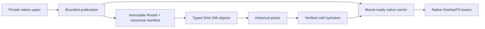
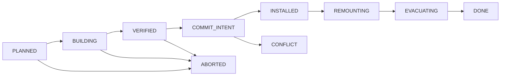

# Phase 1 decision — SeqCDC/CAS and identity-preserving squash

> Implementation-facing decision record derived from the
> [Phase 1 overview](../index.md), the
> [CDC/CAS space, time, and materialization specification](01-cdc-cas-space-time-materialization-spec.md),
> and the
> [StreamCDC versus SeqCDC examination](02-storage-solution-examination-review.md).
> The examination remains the detailed evidence record; this document records
> the resulting decisions and the required squash revision. The
> [SeqCDC complexity and acceptance contract](04-seqcdc-space-time-complexity-and-acceptance-criteria.md)
> supplies the quantitative implementation gates.

| Field | Decision |
| --- | --- |
| Status | Selected for gated implementation; production enablement blocked |
| Chunker | Internal scalar SeqCDC |
| Historical storage | Versioned CDC manifests and typed SHA-256 CAS |
| Active execution | Existing native OverlayFS path |
| Squash meaning | Physical materialization compaction, never logical-history rewriting |
| Fallback | Internal synchronous StreamCDC if SeqCDC fails its gates |
| Initial qualification | Pinned Ubuntu 24.04 Docker environment |

## 1. Executive decision

Proceed with a small, internal, safe-Rust implementation of scalar SeqCDC.
Match the pinned authors' algorithm exactly and expose it through a genuinely
bounded streaming adapter.

The selection is conditional:

- do not depend on `puntakana/seqcdc-rs`;
- do not require SIMD or x86-specific instructions;
- do not use async CDC or add a third-party runtime dependency;
- preserve native LayerStack, OverlayFS, command, file, PTY, stdin, namespace,
  publication, remount, and recovery behavior;
- keep large-file memory independent of file size and history size;
- demonstrate a repeatable integrated publication advantage of at least 10%
  over the internal StreamCDC-equivalent at an equal effective chunk-size
  distribution;
- keep the SeqCDC production core within 300 physical non-test Rust lines
  unless a separate exception is approved; and
- pass every correctness, recovery, lease, space, memory, and five-minute
  qualification gate.

StreamCDC remains the evidence-adjusted default and mandatory fallback. It has
the stronger maintained Rust implementation and maturity evidence. SeqCDC is
selected because the user accepts its published storage trade-off and prefers
testing the smaller scalar core, not because the existing evidence already
proves a production win.

RapidCDC, another chunking format, and a hybrid format are not Phase 1
finalists. Changing the chunking algorithm or fixed parameters creates a new
versioned format; it must never silently rechunk or reinterpret an old root.

## 2. Stable identities and generations

Phase 1 must separate logical history from physical representation.

| Identity or generation | Meaning | Changed by publication | Changed by squash |
| --- | --- | ---: | ---: |
| `RootId` | Deterministic identity of one immutable logical checkpoint record | Yes | No |
| Publication/OCC generation | Ordering used to reject stale publishers | Yes | No |
| `MaterializationId` | Identity of one mount-ready physical representation | No | Yes |
| Materialization generation | CAS generation for carrier substitutions | No | Yes |
| Object/chunk ID | Typed SHA-256 identity of canonical content | When content is new | No |

This distinction is normative:

```text
publish  = new logical checkpoint
squash   = new physical representation of the same checkpoint
retain   = decide which logical checkpoints remain reachable
GC       = reclaim unreachable, unleased physical storage
```

Maintenance must not create a different `RootId` merely because carrier paths,
layer IDs, packing, or materialization layout changed. Phase 2 branches and
checkpoints must be able to name a stable root independent of background
maintenance.

`RootId` covers the canonical root record, including its tree-manifest ID,
format and chunker versions, parent/base root, and required publication
identity. Two checkpoints with the same visible tree but different required
history or publication identity may therefore have different `RootId`s. A
committed no-op publication may create a new `RootId`; an attempt coalesced
before the durable publication linearization point does not.

The Phase 1 tree manifest is a complete reconstruction graph. Its manifest,
metadata, segment, and chunk references are strong GC edges. Parent/base IDs
inside the canonical root record are identity-bearing provenance but weak
retention edges: GC does not follow them unless retention policy separately
pins those roots. Native lower/base dependencies belong to a materialization
record and its carrier leases, not to logical ancestry. A future delta-root
format may make an ancestor a strong reconstruction edge only under a new
format version; it must rebase to a self-contained root before latest-only
retention can reclaim that ancestor.

Squash verifies the merged target projection against the canonical tree
manifest already named by the root record. It does not derive logical identity
from a carrier directory, and it does not rewrite that root record.

This decision supersedes the new-root wording in
[§2.4 of the Phase 1 storage specification](01-cdc-cas-space-time-materialization-spec.md#24-squash-and-live-remount).
The existing `squash(root_range)` contract becomes an internal
materialization-substitution operation for the same `RootId`, and the
`replacement_root` remount argument becomes, or resolves to, a replacement
`MaterializationId` paired with that unchanged `RootId`. Only publication
creates a new logical root.

## 3. SeqCDC findings

### 3.1 Correctness of the available implementations

The pinned authors' DedupBench implementation is the boundary oracle:

- commit
  [`8e2697cbf6332ac5da6dc615bfab82a720e820e4`](https://github.com/UWASL/dedup-bench/commit/8e2697cbf6332ac5da6dc615bfab82a720e820e4);
- increasing-sequence mode;
- adjacent equal bytes ignored;
- an increasing run triggers a cut using the authors' exact inspected-byte
  convention; and
- an opposing run triggers the authors' exact jump convention.

The audited `seqcdc-rs` v0.1.0 package is not a production dependency or
boundary oracle. Its jump resumes one byte differently from the authors'
implementation, its direct API can produce a cut beyond the supplied slice,
validation is incomplete, it has no authoritative golden corpus, and its file
helper reads the whole file. Reusing it would violate both exact-boundary and
bounded-streaming requirements.

The internal implementation must differential-test every cut position against
the pinned authors' source, especially jump, EOF, exact-minimum,
exact-maximum, and fragmented-read cases.

### 3.2 Fixed Phase 1 profile

| Parameter | Fixed value |
| --- | ---: |
| Mode | Increasing |
| Minimum chunk | 8 KiB |
| Declared target average | 16 KiB |
| Maximum chunk/window | 32 KiB |
| Sequence threshold | 5 |
| Opposing trigger | 50 |
| Jump | 512 bytes |
| Stream buffer | One 32 KiB circular window |

The declared average field does not drive the authors' cut loop. The effective
average and distribution must therefore be measured. A result more than 5%
away from 16 KiB on required Phase 1 corpora reopens the profile and format
decision.

### 3.3 Hardware and portability

SeqCDC's selected loop uses scalar byte comparisons, counters, and checked
integer arithmetic. It requires:

- no SIMD instruction;
- no `unsafe`;
- no CPUID dispatch;
- no x86 target feature;
- no special alignment; and
- no helper process, service, image package, kernel module, FUSE, or new
  privilege.

It therefore does not require SIMD-capable x86 hardware. Algorithm portability
does not, by itself, qualify the complete system on macOS, Windows, native
Linux, or arbitrary Docker/kernel/filesystem combinations.

### 3.4 Speed evidence

The SeqCDC paper reports approximately 8.0–8.8 GB/s for scalar SeqCDC versus
approximately 2.0–2.7 GB/s for its FastCDC baseline, summarized as about
3.1 times raw chunking throughput.

That result is a useful hypothesis, not a LayerStack performance claim:

- the paper's FCDC uses a different Gear table and loop from the proposed
  internal StreamCDC-equivalent;
- the benchmark is CPU- and corpus-specific;
- it measures boundary selection rather than complete publication;
- LayerStack also performs reads, SHA-256, manifest construction, catalog
  lookup, pack or carrier writes, fsync, and transactional commit; and
- ordinary command, file, mount, remount, and PTY paths do not run either
  chunker.

Production selection therefore depends on the integrated equal-profile
benchmark, not the paper's 3.1-times number. If SeqCDC cannot retain a
repeatable 10% integrated publication advantage, revert to StreamCDC.

## 4. Bounded streaming and large files

The SeqCDC adapter must have memory bounded by configured capacities rather
than input size:

- one fixed 32 KiB circular input window per publication worker;
- at most two borrowed slices for a wrapped chunk;
- one synchronous hash/write callback while those slices are valid;
- no owned payload `Vec` per emitted chunk;
- no collection of chunks;
- no payload in a downstream queue;
- bounded metadata descriptors only;
- four storage data-plane/background workers globally; and
- a 64 MiB storage-owned byte semaphore covering worker buffers, queues,
  external sorting, manifests, journals, and the shared index cache.

The complete limits in
[the acceptance contract](04-seqcdc-space-time-complexity-and-acceptance-criteria.md#6-application-memory-complexity-and-limits)
are normative: 256 KiB pack/hydration buffers, 16 descriptors and 64 KiB of
queued metadata, eight 64 KiB merge readers, 256 KiB manifest/journal
encoders, a 16 MiB index cache, at most 4 MiB managed memory per publication,
and the stated RSS ceilings. Cancellation gets five seconds to join and clean
up; after that, fenced transaction-owned state remains journaled and charged
until recovery.

A 1 KiB, 1 GiB, or 1 TiB file uses the same configured application-buffer
budget. Processing time and I/O are linear in bytes, but application memory
must not grow with the file. A leak is still possible if implementation code
incorrectly retains slices, descriptors, cache pages, or transaction state;
flat RSS under increasing file and history sizes is therefore a release gate,
not an assumption.

Short reads fill the existing ring. `Interrupted` is retried; other I/O errors
abort the transaction. EOF emits the remaining bytes exactly once. A cut must
always be within `1..=available`.

## 5. CDC/CAS and native-materialization decision

CDC/CAS stores immutable history; it does not replace the live execution
filesystem.



The required behavior is:

- active sessions execute on ordinary native OverlayFS files;
- publication scans the captured upper and required metadata, not the complete
  merged workspace;
- a native immutable carrier may be the authoritative location of current
  payload chunks;
- current payload must not be permanently duplicated in a second pack merely
  to claim CAS coverage;
- canonical manifests and small metadata use packed objects;
- historical-only chunks are evacuated into dense packs before their final
  carrier is deleted;
- cold hydration reconstructs into a unique staging carrier, verifies all
  objects and the canonical root, fsyncs files and directories, and atomically
  exposes the carrier before mounting; and
- inactive branches retain `RootId`s, pins, manifests, and unique historical
  content rather than resident processes or permanent workspaces.

Chunk identity and blame are independent. Identical content can deduplicate
without transferring authorship.

### 5.1 Materialization-speed decision

Materialization speed is a hard decision criterion, but SeqCDC's raw chunking
throughput is not materialization throughput. Neither warm nor cold activation
should run the CDC boundary detector.

| Path | Required work | Expected complexity | SeqCDC involvement |
| --- | --- | --- | --- |
| Warm activation | Resolve and lease existing native carriers, prepare the session, and mount OverlayFS | `O(D)` in native lower depth, with `D ≤ 64`; independent of workspace bytes | None |
| Cold hydration | Resolve manifest segments, stream missing bytes into a staging carrier, restore metadata, verify, fsync, and rename | `O(R + E)` for reconstructed bytes `R` and entries `E`, with bounded locator probes | None; boundaries were recorded at publication |
| Cold activation | Cold hydration followed by the ordinary warm path | `O(R + E + D)` | None |
| Squash remount | Use the already built native carrier, exchange leases, move and verify mounts | Frozen interval depends on lower depth and verified task/FD state, not workspace bytes | None |

SeqCDC can affect materialization indirectly through chunk count, reuse, pack
locality, and metadata volume. At the held 8/16/32 KiB profile, those effects
must be measured against StreamCDC at the same effective distribution. They do
not justify reconstructing or rechunking files during activation.

The revised squash improves warm activation by bounding native lower depth and
installing a flat current projection. Its filesystem traversal and carrier
construction happen before remount quiescence. The frozen interval contains no
CDC, pack scan, cold hydration, or workspace-sized work.

The Phase 1 benchmark gates remain:

| Materialization operation | Required result |
| --- | --- |
| Warm root resolve and session preparation | p50 and p95 `≤ baseline + 5% + 2 ms`; zero CAS payload reads |
| OverlayFS mount | p50 and p95 `≤ baseline + 5% + 2 ms` |
| Squash live-remount frozen interval | p50 and p95 `≤ baseline + 5% + 2 ms` |
| Full squash plan/build/commit | p50 and p95 `≤ baseline + 10% + 5 ms` |
| Cold hydration | Verified payload throughput at least 70% of a same-filesystem native sequential-copy control |
| Cold activation end to end | p95 `≤ 1.5 ×` verified native-copy control plus the warm-mount allowance |

There is no trustworthy absolute millisecond baseline yet. The benchmark must
first freeze raw LayerStack results on the same hardware, filesystem, Docker
environment, cache condition, and corpus. Docker startup, image pull, and
unrelated setup are reported separately rather than charged to only one
candidate.

## 6. Interpreting the 13.9% storage result

The accepted paper result says that, on the paper's RDS corpus:

```text
paper FCDC retained fraction = 1 - 0.9015 = 0.0985
SeqCDC retained fraction     = 1 - 0.8878 = 0.1122
relative retained fraction   = 0.1122 / 0.0985 ≈ 1.139
```

SeqCDC stored about 13.9% more than that baseline's retained result. It does
not mean 13.9% of the original input is always added.

For a hypothetical 1.000 GB corpus with exactly that reuse pattern:

- paper FCDC retains about 0.0985 GB;
- SeqCDC retains about 0.1122 GB; and
- the difference is about 0.0137 GB, or 13.7 MB.

For one previously unseen 1 GB file with no reusable content or history, both
algorithms retain approximately 1 GB of payload plus metadata. The paper's
corpus ratio cannot be applied to an arbitrary isolated file.

The accepted 1.139-times algorithm result does not waive total-physical-space
requirements. Settled accounting remains:

```text
T(t) =
    hot native carriers
  + cold packs and slack
  + active private uppers
  + transaction staging
  + manifests, indexes, blame, leases, journals, trash, and quarantine

D_ideal = current native content + unique retained historical content
settled_amplification = T_settled / D_ideal
```

| Required corpus | Target | Hard failure |
| --- | ---: | ---: |
| Mixed and no-dedup | `≤ 1.08 × D_ideal` | `> 1.15 × D_ideal` |
| Many-small-file | `≤ 1.15 × D_ideal` | `> 1.25 × D_ideal` |

## 7. Code repositories and small-file history

With the fixed 8 KiB minimum:

- a file shorter than 8 KiB is one actual-length chunk;
- it is not padded or reserved as an 8 KiB payload;
- identical content across paths or roots reuses the same chunk ID;
- changing one byte in a sub-8-KiB file creates a new whole-file chunk;
- files from 8–32 KiB contain only a few chunks, so localized reuse is coarse;
  and
- above 32 KiB, CDC boundary behavior increasingly affects reuse.

For example, ten distinct published versions of a 4 KiB file retain roughly
40 KiB of unique payload plus metadata while all ten roots are retained.
Identical rewrites add no new payload. Dense packs avoid paying one filesystem
block and inode per historical tiny chunk, but packing cannot delete reachable
content.

For PRD, source, lockfile, generated, and npm-heavy repositories, total space
depends more on:

- how many successful checkpoints are retained;
- how many small files obtain distinct bytes per checkpoint;
- whether dependency trees repeat exactly;
- canonical subtree and object sharing;
- compact path, segment, root, blame, and index records;
- native-carrier evacuation; and
- pack compaction and GC.

SeqCDC and StreamCDC have the same one-whole-chunk behavior below 8 KiB under
the chosen profile. SeqCDC's paper-level storage trade-off should not be
mistaken for the dominant cost of tiny-file history.

## 8. Publication coalescing, squash, retention, and GC

These mechanisms solve different problems and must remain separate.

| Mechanism | May remove or prevent | Must not remove |
| --- | --- | --- |
| Publication coalescing | Intermediate writes inside one upper/request before durable root-publication linearization; retain only the final state per path | Any durably linearized immutable checkpoint, including one whose response was lost |
| Squash | Current-stack depth, shadowed native entries, net-zero deltas, and superseded carrier overhead | Logical roots or reachable historical versions |
| Carrier evacuation | Historical-only extents from a carrier by moving their last locators into packs | Reachable content |
| Pack compaction | Dead holes and slack inside mixed packs | Live records |
| Retention | Roots from the durable keep/pin set under explicit product policy | Leased, pinned, or policy-retained roots |
| GC | Objects and root metadata proven unreachable after retention | Anything retention has not released |

The critical rule is:

```text
ten edits before one durable publication may become one root
ten durably committed publications remain ten roots
```

Squash can make the current mounted representation shallow and remove native
duplication. Only retention followed by GC and pack compaction can delete the
unique payload of committed historical roots. Client acknowledgment is not the
cutoff: a retry after a lost response must return the already committed root
rather than coalesce new writes into it.

## 9. Why the current squash is insufficient

The existing three-phase structure is useful, but its identity and durability
model must change:

- [`squash.rs`](/Users/yifanxu/Ephemeral-AI-Lab/ephemeral-sandbox/crates/sandbox-runtime/layerstack/src/stack/squash.rs:163)
  partitions physical layers around the newest layer of every live lease;
- it builds flattened `S` layers outside the writer lock and commits them
  before the remount sweep, which should be preserved;
- the current manifest hash incorporates physical layer IDs and paths, so a
  physical substitution changes that hash even when visible filesystem content
  is identical;
- [`rewrite.rs`](/Users/yifanxu/Ephemeral-AI-Lab/ephemeral-sandbox/crates/sandbox-runtime/layerstack/src/stack/lease/rewrite.rs:1)
  explicitly keeps substitutions in process memory, so restart loses rewrite
  knowledge;
- the current flattener can hold per-directory maps and too many source file
  descriptors, so it is not yet bounded by the Phase 1 budgets; and
- releasing the plan lease and immediately treating the result as GC is unsafe
  once source carrier extents can be authoritative CAS locations.

Live leases should no longer be semantic squash boundaries. They should pin
old carriers while a new compact materialization of the same `RootId` is
installed. Old sessions may continue using their leased carriers until they
are safely remounted or destroyed.

## 10. Revised squash algorithm

Retain the current high-level Plan → Build → Commit → Remount shape, but make
the transaction durable and identity-preserving.



`ABORTED` and `CONFLICT` are legal only before `INSTALLED`.

### 10.1 Plan

Under a brief shared generation guard:

1. snapshot the logical `RootId` and publication generation;
2. snapshot the materialization generation, ordered carrier run, lower/base
   context, and source locator generations;
3. choose the carrier interval to compact, including the base when required to
   meet latest-only physical-space gates;
4. allocate a unique target carrier and transaction ID;
5. persist the plan journal; and
6. acquire durable root, plan, and source-carrier leases before releasing the
   guard.

The normal settled target is the shallowest mount-ready representation that
meets the physical-space gates. Reusing an unchanged shared base suffix is an
optimization, not an invariant: when shadowed base extents would cause the
latest-only state to retain avoidable bytes, the target must be allowed to
subsume the base into a full-current carrier so the old base can retire.
Conversely, base bytes required by retained historical roots remain
`H_unique`. A partial run is allowed only when its exact before/after carrier
count and allocated-byte reduction meet the scheduler rules.

### 10.2 Build

Outside writer locks and outside live-remount quiescence:

1. enumerate the planned logical projection with bounded disk-backed ordered
   cursors or capped external-merge runs;
2. cap simultaneously open source descriptors and merge fan-in;
3. resolve each path against the planned lower/base context:
   - final value equals the lower value: emit nothing;
   - absent over absent: emit nothing;
   - absent over present: emit one whiteout;
   - present and different: emit one final winner;
4. preserve directory opacity, sparse extents, hardlink groups, symlinks,
   xattrs, modes, ownership, timestamps required by the root format, and all
   other canonical metadata;
5. hardlink an immutable winner when its inode data and metadata are already
   exact; otherwise use the bounded copy/reconstruction path;
6. reuse existing object IDs and native extents; and
7. perform no CDC, rechunking, pack compaction, or GC.

The current hardlink fast path should be retained because it can construct a
new carrier directory without duplicating winner payload blocks on the same
filesystem. After linking, target construction must never normalize mode,
ownership, xattrs, or timestamps through the shared inode. If any required
inode metadata differs, create a fresh inode through the bounded
copy/reconstruction path.

### 10.3 Verify and prepare

Before visibility:

1. compute the canonical tree and metadata of the merged projection formed by
   the target carrier plus its planned lower/base context;
2. require that tree-manifest ID to equal the tree-manifest ID already named by
   the existing `RootId` record, and require the root record itself to remain
   byte-identical;
3. verify all referenced extents and object IDs;
4. fsync target files and directories;
5. atomically rename staging to an immutable target carrier;
6. fsync its parent; and
7. persist the prepared target and target lease.

Any mismatch is corruption or an implementation error. It must not be
accepted as a new root.

### 10.4 Commit

Under the short exclusive materialization-generation gate:

1. reread the head and materialization catalog;
2. require the planned head `RootId`, publication generation, materialization
   generation, carrier run, lower/base context, and source locator generations
   to remain exact;
3. record `CONFLICT` and replan if any of them changed, including a concurrently
   prepended publication;
4. atomically install the target as a new materialization generation for the
   same `RootId`; and
5. fsync the materialization-catalog record and its containing directory before
   recording `INSTALLED`.

The linearization point is the durable materialization-catalog generation
swap. Publication/OCC generation and `RootId` remain unchanged.

The initial implementation deliberately rejects concurrent head changes. A
later optimization may substitute an unchanged interval beneath descendants
only after it defines and proves one atomic rewrite covering every affected
descendant materialization.

### 10.5 Remount

After storage commit:

1. new sessions resolve the new materialization;
2. select only sessions whose exact `RootId` and materialization chain have a
   valid replacement;
3. durably record a per-session remount intent and acquire its replacement
   carrier lease before freezing it;
4. keep carrier construction outside quiescence, but freeze for the current
   namespace operation: lift and restore masks, create scratch paths, mount and
   probe the staged OverlayFS, perform both mount moves, probe the visible
   mount, and attempt strict unmount of the old mount;
5. if failure occurs before the first move, record a clean skip, resume on the
   old handle, and release only the replacement lease;
6. if the new mount is verified and old strict unmount succeeds, resume
   promptly, then atomically persist and apply the replacement handle before
   releasing the old lease;
7. if the new mount is verified but old strict unmount returns `EBUSY`, treat
   the switch as successful, resume, persist and apply the replacement handle,
   and park the old mount and lease for later reap; and
8. after any failure or uncertainty following the first move, retain both
   leases, mark the session faulty, resume nothing, and use the existing
   destroy/boot-reap recovery path.

There is no verified move-back rollback in the current runner. Handle-file
fsync is not added to the frozen interval; the durable pre-freeze intent makes
the post-resume handle update recoverable. Every applied switch is persisted,
including a successful `pinned:rollback_unmount_busy` outcome. Moving staged
mount construction outside quiescence would require a separate
helper-namespace/graft design and its own safety proof.

A failed session remount does not roll back an already installed storage
materialization. Old carriers remain valid while their leases remain.

### 10.6 Evacuate and reclaim

Source deletion is a separate resumable transaction:

1. hold a durable evacuation transaction lease and snapshot the carrier,
   locator, retention, and catalog generations;
2. find retained chunks whose last durable locator is in that carrier;
3. write only those historical-only chunks to an append-only pack;
4. verify checksums and typed SHA-256 IDs;
5. fsync pack records and footer;
6. atomically commit the replacement locator generation;
7. under a brief exclusive fenced catalog transaction, mark the source carrier
   `RETIRING`, remove it from resolver eligibility, redirect or reject new
   native-path leases, persist the retirement generation, and release the
   fence;
8. outside the catalog fence, wait only until the operation deadline for old
   native-path leases to drain, persisting a retry cursor if any remain;
9. reacquire the fence briefly, require the exact retirement, catalog, locator,
   and retention generations to remain valid, require zero native-path leases
   other than the retirement transaction, atomically rename the carrier into
   durable trash, fsync the containing directory, and release the fence; and
10. delete it only after its grace epoch and a final generation/lease recheck.

Current winner extents that were hardlinked into the target receive target
carrier locators and do not need a second packed copy. Retention and GC later
decide whether packed historical chunks remain reachable.

### 10.7 Pack, retention, compaction, and GC policy

Before authoritative rollout, versioned configuration must freeze the packing
threshold, sealed-pack output limit, compaction trigger, GC slice bound, and
grace rule. The initial contract is:

- historical-only chunks and canonical small objects are packed; current
  native payload is not duplicated merely for CAS coverage;
- a sealed pack contains at most 64 MiB of payload, 100,000 records, and
  80 MiB of total allocated bytes including headers, indexes, and footer; the
  writer reserves the next record and seals before any limit would be crossed;
- an individual pack becomes an asynchronous compaction candidate at 20%
  dead bytes, aggregate dead bytes or slack above 5% is urgent, and explicit
  settling compacts until the 2% target is met;
- one GC or compaction transaction visits at most 100,000 records or 64 MiB of
  payload, whichever comes first, then persists its cursor;
- the durable mark root set includes current roots, root/carrier leases,
  explicit pins, active branches, ancestors explicitly selected by retention
  policy, frontier and in-flight roots, and every root or object named by a
  pending journal, hydration, materialization, evacuation, or compaction
  transaction; ancestry fields alone do not retain a root; and
- sweep uses bounded disk-backed mark/sort/merge, rechecks the catalog and
  retention generations, enters durable trash, waits at least one complete
  grace epoch, and rechecks generations and leases before deletion.

These limits bound transaction work, not memory: buffers and workers remain
inside the acceptance contract's 64 MiB global byte budget.

For each retained root, logical marking follows only the complete tree
manifest's strong reconstruction edges. Physical marking separately follows
active materialization records to required carriers and locators. Weak
provenance parents are retained only when a pin, branch, lease, transaction, or
configured history window selects them.

## 11. Squash scheduling

Use both depth and physical-debt signals.

Initial scheduler decisions, subject to qualification tuning:

- count every mounted lower carrier, including a base carrier, in depth `D`;
- enqueue asynchronous squash when projected `D ≥ 48`;
- reject or compact before admission when projected `D > 64`;
- start early enough to leave build-time headroom;
- preflight both the new mount API's layer/kernel limits and the legacy
  serialized `lowerdir=` byte limit;
- before entering publication's exclusive writer section, compact
  synchronously or return `NeedCompaction`; after compaction, retry publication
  with fresh OCC validation rather than recursively squashing under the writer
  lock;
- avoid routine tiny autosquashes unless
  `selected_source_carriers - replacement_carriers ≥ 8`;
- allow manual squash for any run of at least two layers;
- override the minimum-benefit rule only for a hard depth/mount limit, a manual
  request, or explicit settling/physical pressure when the squash plan predicts
  a reduction in mounted depth, resident native carriers, or native allocated
  bytes sufficient to move toward the applicable gate;
- route pack slack/dead-byte pressure to pack compaction and last-locator debt
  to evacuation rather than scheduling a squash that cannot repair either; and
- run evacuation whenever superseded unleased carriers have authoritative
  historical locators.

The `48/64` values are proposed Phase 1 qualification settings; the current
production count threshold is 100. The scheduler API must carry an explicit
cause and minimum-removal requirement so manual, asynchronous, hard-limit, and
settle requests do not collapse into the existing count-only behavior.

Depth-only autosquash cannot satisfy the space contract. A benchmark or
workload is not settled until its current projection is compact, required
evacuation and GC cursors have converged, trash/grace accounting is included,
and remaining duplication is explained by live leases or explicit policy.

## 12. Crash, cancellation, and retry rules

Every transition is journaled by stable request/attempt ID and fencing epoch.
Recovery trusts the authoritative catalog generation, not merely the last
journal label.

| Observed durable state | Recovery action |
| --- | --- |
| `PLANNED` or `BUILDING` | Fence the attempt, remove only transaction-owned staging, then release its plan/source leases |
| `VERIFIED` or `COMMIT_INTENT` | Inspect the authoritative generation; retry/abort if absent, advance to `INSTALLED` if already committed |
| `INSTALLED` or `REMOUNTING`, same process | Keep both required carrier generations and resume or terminalize idempotent per-session remount intents |
| `INSTALLED` or `REMOUNTING`, daemon restart | Treat persisted sessions as dead under the existing `PDEATHSIG` contract; reap handles, resolve and release both lease generations, terminalize their remount intents, and resume only storage settling/evacuation |
| `EVACUATING` | Resume pack, locator, trash, or deletion work from the durable cursor; never delete a catalog-named carrier |
| Uncertain mount switch | Retain both leases and fail closed until ordinary faulty-session recovery resolves it |

Cancellation before `INSTALLED` first revokes the commit token, stops
admission, and joins workers. If blocking I/O cannot stop within the deadline,
leave journaled staging and charged resources for recovery; the fenced worker
cannot publish. Cancellation after `INSTALLED` reports
`committed/settling` and cannot roll back the materialization swap.

Failpoints are required around every journal fsync, carrier lease change,
target fsync and rename, catalog swap, mount move, mount verification, handle
persistence, old-lease release, locator swap, trash rename, deletion, and
restart boundary.

Before durable roots or historical locators ship, replace the current boot
sweep that keeps only active `manifest.json` carriers and clears all staging.
Startup cleanup must derive its keep/replay set from the materialization
catalog, root and carrier leases, journals, locators, retirement/trash state,
and in-flight transaction ownership. It may remove only state proven
transaction-owned and unreachable after generation recheck.

## 13. Small-file churn after the revision

Consider a history containing exactly 100 retained roots with distinct 4 KiB
versions of one file. If a seed root already contains the first version, the
workload performs 99 additional publications; otherwise it performs 100.

| Retention state | Expected payload after settling |
| --- | --- |
| All 100 roots retained | About 400 KiB plus metadata; one current native winner and approximately 99 historical versions densely packed |
| Only latest root retained | About 4 KiB plus current metadata after all old leases, grace epochs, trash, and in-flight readers drain and retention, GC, and pack compaction finish |
| 100 writes before one successful publication | One final 4 KiB version, because uncommitted writes may be coalesced |
| Some versions identical | One payload object per distinct byte sequence, plus root/path/blame metadata |

Squash reduces current native depth, shadowed entries, and avoidable carrier
allocation. It cannot improve SeqCDC's sub-8-KiB granularity and cannot delete
payload reachable from retained roots.

For a large file edited and published repeatedly, native OverlayFS copy-up may
temporarily put complete versions in successive carriers. Revised squash and
evacuation must converge that state toward:

```text
one native current file
+ unique retained historical chunks
+ bounded metadata and pack slack
```

It must not settle as one complete native file per publication. If a retained
old root uniquely requires base bytes, those bytes remain in `H_unique`; if no
retained root requires them, full-current squash must be able to retire the
shadowed base rather than leave a permanent second copy.

## 14. Required implementation changes

| Area | Required change |
| --- | --- |
| Layer/root model | Split logical `RootId`/publication generation from native materialization ID/generation and carrier digest |
| Squash plan | Snapshot durable root, materialization generation, carrier run, lower/base context, locator generations, target, and leases |
| Squash build | Replace depth/fanout-sized maps and source-FD use with bounded ordered cursors and capped merge fan-in |
| Squash commit | Commit a durable materialization substitution for the same `RootId`; never rewrite logical history |
| Lease rewrite | Replace process-memory substitutions with durable root/carrier leases and materialization generations |
| Publication | Create new logical roots and trigger maintenance; never conflate publication with squash |
| Remount | Assert the replacement has the same `RootId`; exchange overlapping carrier leases around the verified switch |
| Autosquash | Replace count-only policy with soft/hard depth, mount-budget, physical-debt, and settle triggers |
| Evacuation/GC | Make locator replacement, trash, compaction, and collection separate resumable transactions |
| Boot recovery | Replace manifest-only carrier cleanup with catalog-, lease-, journal-, locator-, trash-, and transaction-aware replay/sweep |
| Telemetry | Report `root_id_before == root_id_after`, old/new materialization generations, depth, allocated bytes, evacuation debt, and blocked leases |

The main current source areas are:

- `crates/sandbox-runtime/layerstack/src/model/mod.rs`;
- `crates/sandbox-runtime/layerstack/src/stack/squash.rs`;
- `crates/sandbox-runtime/layerstack/src/stack/squash/flatten.rs`;
- `crates/sandbox-runtime/layerstack/src/stack/lease/`;
- `crates/sandbox-runtime/layerstack/src/stack/ops/publish.rs`;
- `crates/sandbox-runtime/operation/src/layerstack/actions/squash.rs`;
- `crates/sandbox-runtime/operation/src/layerstack/autosquash_engine/`;
- the operation-level publish/finalize admission paths;
- `crates/sandbox-runtime/operation/src/services.rs`;
- `crates/sandbox-runtime/workspace/src/model.rs`;
- `crates/sandbox-runtime/workspace/src/lifecycle/persistence.rs`;
- `crates/sandbox-runtime/workspace/src/lifecycle/remount.rs`;
- `crates/sandbox-runtime/workspace/src/service/impls/remount_workspace.rs`;
- `crates/sandbox-runtime/namespace-process/src/runner/setns/remount_overlay.rs`;
- `crates/sandbox-runtime/layerstack/src/stack/lease/cleanup.rs`; and
- `crates/sandbox-runtime/sandbox-config/src/configs/runtime.rs` plus its
  configuration wiring.

### 14.1 Reusable core and materialization backends

The reusable product is not one OverlayFS-specific `LayerStack + CAS + CDC`
monolith. It is a platform-neutral checkpoint-storage core with
backend-specific capture and materialization adapters:

```text
portable core:
    canonical RootId and manifests
    + typed content objects and CDC/CAS
    + packs/indexes
    + publication/OCC/leases
    + retention/GC/recovery

backend adapters:
    Linux/Docker   -> native carriers + OverlayFS + live remount
    WASM           -> preopened-directory or virtual-filesystem materialization
    Firecracker    -> guest-visible filesystem/block-image materialization
```

Portable identity must not contain host paths, inode numbers, OverlayFS layer
IDs, mount handles, or backend cache locations. Those belong to a replaceable
materialization record:

```text
MaterializationKey =
    (RootId, backend_kind, backend_format_version, target_profile)
```

The manifest preserves byte paths and the complete canonical metadata needed
by the root, plus an explicit capability/feature set. Full-tree manifests name
the final logical tree; any transition representation uses backend-neutral
`RemoveEntry` and `ReplaceSubtree` semantics. The Linux adapter alone encodes
those operations as whiteouts and opaque-directory xattrs.

A backend either materializes the required semantics exactly or refuses with a
capability error; it must not silently drop xattrs, hardlinks, sparse extents,
ownership, deletion/subtree-replacement semantics, or other identity-bearing
state. Backend locators and carriers are outside logical identity, but they are
not necessarily disposable caches: a carrier may be the sole authoritative
physical CAS location for current payload. Such a carrier is removable only
after verified replacement locators have been committed for every reachable
object. Only materializations whose reachable bytes have another durable
locator are rebuildable caches.

Phase 1 qualifies only the pinned Linux/Docker backend. The boundary is a
design gate for future WASM and Firecracker reuse, not a claim that either
backend is currently implemented or performance-qualified.

## 15. Production gates and fallback

SeqCDC is rejected or reverted to StreamCDC before production enablement if
any algorithm-specific condition holds:

- any cut differs from the pinned authors' oracle;
- any cut is zero, beyond available input, nondeterministic, or dependent on
  `Read` fragmentation;
- the fixed profile's effective average misses 16 KiB by more than 5% on
  required corpora without a separately versioned and requalified decision;
- SeqCDC stores more than 1.14 times internal StreamCDC's unique payload at an
  equal effective distribution on a required corpus;
- localized CDC-friendly changes breach the quantitative hard ceiling in the
  acceptance contract; missing the
  `changed_bytes + 2 × 32 KiB + segment_overhead` target is reported and
  reviewed but is not by itself an automatic chunker fallback;
- the SeqCDC production core exceeds 300 non-test lines without approval;
- it introduces `unsafe`, async CDC, a new third-party async runtime
  dependency, external setup, or hardware-specific requirements; or
- it fails to demonstrate a repeatable integrated publication improvement of
  at least 10% over the internal StreamCDC-equivalent.

Common architecture failures—including total-space ceilings, unbounded RSS or
queues, native hot-path regression, materialization/remount failure, lost
leased roots, metadata mismatch, OCC/blame/recovery defects, or the
five-minute qualification contract—block Phase 1 for both chunkers. They are
not evidence that switching from SeqCDC to StreamCDC fixes the system. No speed
or space score can compensate for them.

## 16. Final decision record

Implement and qualify:

- internal scalar author-semantic SeqCDC;
- increasing mode with 8/16/32 KiB profile, threshold 5, trigger 50, and jump
  512;
- one borrowed 32 KiB circular streaming window;
- typed, domain-separated SHA-256 objects;
- versioned canonical root and filesystem manifests;
- durable root/OCC/lease/blame/journal/catalog state;
- native current carriers and densely packed historical-only content;
- verified atomic cold hydration;
- publication coalescing only before durable root-publication linearization;
- identity-preserving squash with a separate materialization generation;
- overlapping leases during remount;
- transactional carrier evacuation before deletion;
- explicit retention followed by bounded GC and pack compaction; and
- soft/hard native-depth control at 48/64 with physical-space convergence.

Do not use `seqcdc-rs`, SIMD, async CDC, a hybrid chunker, or logical-history
deletion disguised as squash.

Retain the Apache-2.0 license, source provenance, and required notices for any
code adapted from the pinned authors' DedupBench implementation.

Implementation work may begin behind gates. Production rollout remains blocked
until the differential oracle suite, equal-effective-profile comparison,
filesystem round-trip suite, crash matrix, large-file flat-RSS proof,
many-small-file and mixed-corpus physical-space gates, squash/remount recovery
tests, and unified five-minute benchmark all pass.
