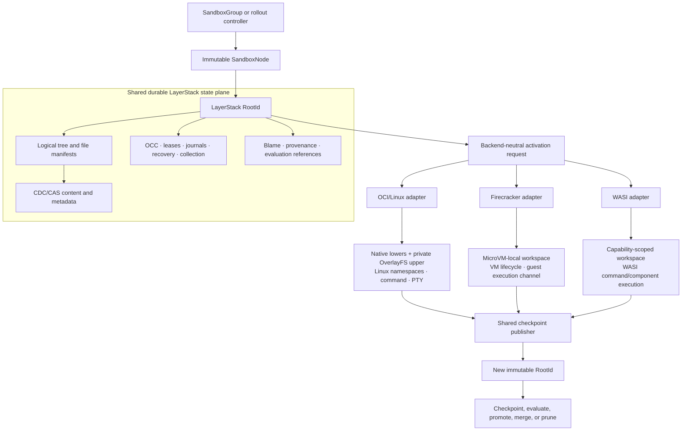
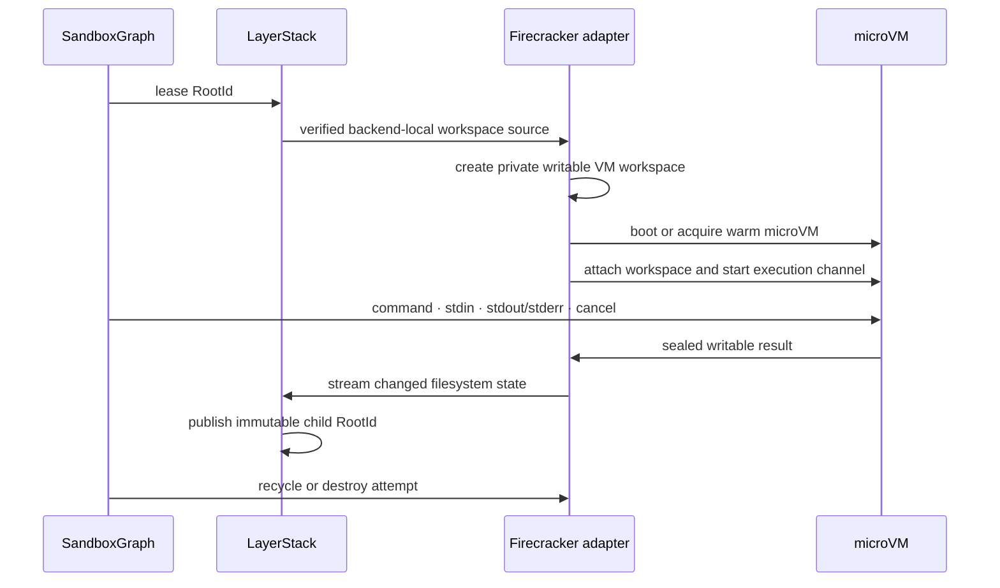
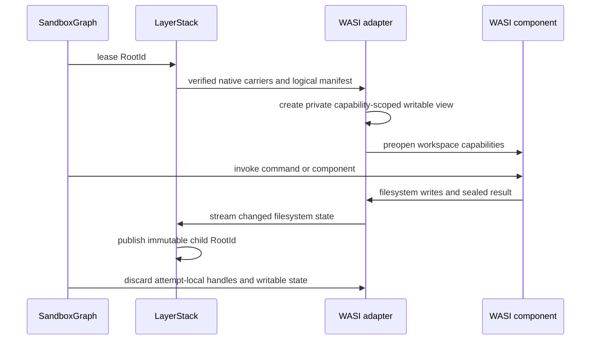

# Phase 3 — portable execution backends

> Abstract and dependency order for adding Firecracker and WebAssembly/WASI
> execution without creating a second LayerStack architecture.

| Field | Decision |
| --- | --- |
| Status | Proposed; begins only after Phase 1 storage and Phase 2 graph contracts are stable |
| Goal | Run the same immutable LayerStack checkpoint through OCI/Linux, Firecracker, or WASI |
| State plane | Reuse the Phase 1 CDC/CAS design without a backend-specific fork |
| Orchestration plane | Reuse Phase 2 groups, nodes, attempts, leases, evaluation, and promotion |
| Replace per backend | Workspace projection, isolation, process execution, streams, cancellation, and lifecycle |
| Preserve | Root identity, manifests, publication, OCC, blame, recovery, retention, and collection |
| Firecracker boundary | Linux/KVM worker with a microVM-local workspace and execution channel |
| WASI boundary | Capability-scoped workspace and component/command execution |

## 1. Phase 3 in one sentence

Phase 3 keeps LayerStack as the single durable source of workspace truth and
adds backend adapters that replace the OCI/Linux OverlayFS and namespace
execution layer for Firecracker and WASI.

The organizing rule is:

> **One checkpoint identity and storage engine; multiple isolated execution
> adapters.**

Firecracker and WASI must not introduce their own checkpoint format, CAS,
deduplication index, lease model, blame system, or promotion rules.

## 2. Architecture boundary



The state plane owns durable truth. An executor owns only one attempt's
temporary writable state and process lifecycle.

## 3. What remains unchanged

The following contracts are reused across all backends:

- immutable, deterministic, versioned `RootId`;
- the selected Phase 1 CDC algorithm and parameters;
- typed content identity and digest rules;
- file, directory, sparse-extent, symlink, hardlink, metadata, and xattr
  manifests;
- native-carrier and packed-object lifecycle;
- disk-backed locator and index formats;
- transactional publication and compare-and-swap root advancement;
- leases for current, old, branch, frontier, and in-flight roots;
- OCC conflict detection and deterministic merge, rebase, or rejection;
- file blame as separate transition metadata;
- journals, idempotent recovery, quarantine, retention, and bounded collection;
- Phase 2 `SandboxGroup`, `SandboxNode`, `ExecutionAttempt`, `Evaluation`, and
  promotion semantics; and
- logical rollback by activating an earlier immutable node.

Backend selection must not change a checkpoint's identity. Worker-local
materialization locations, VM disks, guest identifiers, WASI handles, caches,
and process state are not part of `RootId`.

## 4. What becomes replaceable

Phase 3 introduces two narrow interfaces around the existing OCI/Linux path:

| Interface | Responsibility |
| --- | --- |
| `WorkspaceAdapter` | Prepare one root for one attempt, expose an isolated writable workspace, capture changes, and discard or recover temporary state |
| `ExecutionAdapter` | Start and stop the execution environment; run commands/components; connect stdin/stdout/stderr; cancel work; report exit and capability state |

The current OCI/Linux implementation remains one adapter:

```text
WorkspaceAdapter = native lowers + private OverlayFS upper/work
ExecutionAdapter = Linux mount/PID/workspace namespaces + process/PTY paths
```

Firecracker and WASI replace these adapter implementations. They do not replace
the shared checkpoint publisher or retained-history engine.

## 5. Firecracker adapter

### Role

The Firecracker adapter supplies a stronger VM isolation boundary for workloads
that need a Linux kernel but should not share the worker's kernel namespaces.

Its conceptual flow is:



The final implementation may use file-backed block devices, a guest-local
filesystem, a guest execution service over vsock, and a bounded warm pool.
Those are Firecracker adapter details. They must not alter LayerStack object
identity.

Firecracker's VM snapshot files may accelerate boot or restore, but they are
not LayerStack checkpoints:

- a VM snapshot includes guest memory and device/VMM state;
- attached block-device contents are managed separately;
- snapshot portability is constrained by CPU and device compatibility; and
- restoring transport state, including vsock, has lifecycle constraints.

Therefore filesystem checkpoint publication always returns through the shared
LayerStack publisher. VM memory snapshots are disposable worker-local cache
artifacts and cannot become the durable identity of a branch.

### Host requirement

Firecracker requires a Linux worker with KVM and an approved Firecracker
runtime/jailer configuration. This is an executor capability, not a package or
privilege required by the LayerStack state plane or by the target workload
image.

Phase 3 must report this requirement honestly. Firecracker is not a direct
execution backend for workers without hardware virtualization.

## 6. WASI adapter

### Role

The WASI adapter runs WebAssembly components or commands with a
capability-scoped view of the same LayerStack root.

Its conceptual flow is:



The WASI filesystem view may implement union semantics inside the host runtime,
but ordinary component reads must resolve from verified local native carriers
or bounded attempt state. It must not reconstruct CAS objects on every
filesystem call.

WASI filesystem capabilities, preopened directories, command arguments,
environment, stdio, exit status, clocks, networking, and other interfaces must
be explicit and versioned. Backend capability differences belong in execution
provenance, not in the filesystem checkpoint identity.

Standard WASI command and filesystem interfaces do not automatically provide
full Linux PTY, signal, namespace, or arbitrary-process behavior. Phase 3 must
either:

- implement the required semantic adapter in the selected embedded runtime; or
- expose the capability as unsupported and prevent incompatible work from
  being scheduled to WASI.

It must not silently claim OCI/Linux parity.

## 7. Shared activation and publication contract

Every backend follows the same durable sequence:

1. resolve and lease an immutable `RootId`;
2. prepare a verified backend-local workspace;
3. create a private writable attempt;
4. expose execution only after preparation succeeds;
5. run through the backend's execution adapter;
6. quiesce or stop writes before capture;
7. stream the attempt's changed filesystem state into the shared publisher;
8. publish a new immutable root with the same OCC and recovery contract;
9. attach evaluation and provenance;
10. promote, merge, retry, retain, or prune explicitly; and
11. release attempt and root leases only after durable state transitions.

Every publish request continues to carry:

```text
base_root
publisher_id
request_id
write_set
expected_current_root_generation
```

Changing execution backend cannot bypass compare-and-swap publication or
silently advance the canonical root.

## 8. Cross-backend filesystem semantics

The logical manifest remains the authority for:

- exact regular-file bytes;
- directory and path identity;
- file type;
- modes and executable bits;
- timestamps under the declared normalization policy;
- symlinks and hardlinks;
- sparse extents;
- xattrs under the declared backend capability policy;
- whiteouts and deletions as logical transitions; and
- blame and provenance.

Some Linux metadata has no direct WASI equivalent. Phase 3 must distinguish:

1. metadata preserved in the checkpoint;
2. metadata visible and mutable on a backend;
3. metadata emulated by the adapter; and
4. metadata unsupported by that backend.

Unsupported execution visibility must not delete or corrupt retained metadata
when a checkpoint crosses backends.

## 9. Phase 3 order

| Order | Milestone | Main outcome |
| ---: | --- | --- |
| 3.0 | Freeze backend-neutral activation, workspace, execution, capability, and result contracts | Existing OCI/Linux behavior is expressible without storage changes |
| 3.1 | Refactor the current OCI/Linux path behind the adapter contracts | No behavior or performance regression and no new checkpoint identity |
| 3.2 | Add Firecracker workspace and execution adapters | A root activates, runs, checkpoints, rolls back, and recovers through a microVM |
| 3.3 | Add WASI workspace and execution adapters | The same root activates and checkpoints through declared WASI capabilities |
| 3.4 | Prove cross-backend logical equivalence | Backend transitions preserve supported bytes, metadata, blame, OCC, and leases |
| 3.5 | Add capability- and locality-aware routing | Phase 2 schedules only compatible work to bounded executor pools |
| 3.6 | Harden recovery, cache eviction, and rollout behavior | Worker loss cannot invalidate durable nodes or double-apply results |

Firecracker and WASI adapter work may proceed in parallel after `3.0` and
`3.1`. Cross-backend equivalence and routing depend on both adapters.

## 10. Exit gates

Phase 3 is complete only when:

- one immutable root retains the same identity across OCI/Linux, Firecracker,
  and WASI;
- every backend consumes the same CDC/CAS, manifest, lease, OCC, blame,
  publication, recovery, and collection contracts;
- no backend creates a second durable checkpoint system;
- sibling attempts have isolated writable state;
- inactive graph nodes require no resident container, microVM, WASI instance,
  or permanent backend-specific materialization;
- Firecracker VM snapshots are optional caches and never checkpoint truth;
- WASI capability limits are explicit and cannot cause silent semantic loss;
- backend-local failure cannot corrupt or advance a durable root;
- retries and result sealing remain idempotent;
- checkpoint, rollback, merge, promotion, and pruning remain backend-neutral;
- ordinary execution never performs per-read CAS reconstruction;
- state-plane memory remains bounded independently of roots and graph depth;
- live executors remain bounded by scheduler limits; and
- unsupported workloads are rejected before execution rather than degraded
  silently.

## 11. Explicit non-goals

- changing the selected CDC algorithm for Firecracker or WASI;
- creating Firecracker-specific or WASI-specific `RootId` formats;
- using VM memory snapshots as filesystem checkpoint truth;
- instruction-exact process rollback or cross-backend live-process migration;
- one resident microVM or WASI instance per durable graph node;
- requiring every WASI backend to emulate all Linux syscalls, PTYs, signals,
  devices, or namespaces;
- putting CAS reconstruction on ordinary execution reads;
- sharing writable state between sibling attempts;
- embedding rollout statistics in filesystem manifests; and
- replacing Phase 2 OCC, evaluation, promotion, or exactly-once
  backpropagation semantics.

## 12. Source authority

The architectural direction comes from the current
[Ephemeral Sandbox roadmap](https://ephemeral-sandbox.com/roadmap): one
durable LayerStack state plane with executor-specific adapters.

The runtime boundaries in this overview are grounded in primary project
documentation:

- [Firecracker](https://github.com/firecracker-microvm/firecracker) for its
  KVM, block-device, API, and isolation model;
- [Firecracker snapshot compatibility and
  versioning](https://github.com/firecracker-microvm/firecracker/blob/main/docs/snapshotting/versioning.md)
  for the distinction between VM state and separately managed block-device
  data;
- [Firecracker vsock](https://github.com/firecracker-microvm/firecracker/blob/main/docs/vsock.md)
  for the guest-control transport boundary;
- [WebAssembly/WASI](https://github.com/WebAssembly/WASI) for the modular WASI
  interface model; and
- [WASI releases](https://wasi.dev/releases) for stable command and filesystem
  capability surfaces.

These sources constrain executor implementation. They do not supersede the
shared LayerStack root, publication, lease, OCC, blame, or recovery contracts.

## 13. Follow-on specifications

This document is an overview. Phase 3 requires separate specifications for:

1. the backend-neutral workspace and execution adapter contracts;
2. canonical cross-backend filesystem and metadata semantics;
3. Firecracker image, workspace, guest-control, pooling, and recovery design;
4. WASI runtime, capability, filesystem, stdio, and cancellation design;
5. cross-backend checkpoint equivalence and migration;
6. capability-aware scheduling and provenance; and
7. security, resource accounting, observability, rollout, and rollback.

Implementation should not begin from this overview alone.
