# MPLA evidence and architecture demonstrations

> Status: **Accepted**
> Scope: non-normative visual companion to
> [Overall architecture](overall_architecture.md). Normative rules remain in
> the component and requirements documents.

“MPLA” is a historical proof-of-concept name, not the production architecture.
The production name is **Portable Merkle State Store**. These diagrams retain
useful MPLA measurements, crash questions and adversarial examples while making
the selected no-layer design concrete.

## Evidence labels

| Label | Meaning |
|---|---|
| **Project measurement** | Project-produced data from a named workload, platform, sample set and timing boundary. Historical MPLA measurements remain scoped to that POC and are not PMSS measurements. |
| **External measurement** | Data produced outside this project, with a direct source and explicit scope. |
| **Analytical bound** | Derived from frozen format/admission constants and awaiting implementation validation. |
| **Target** | Desired future qualification threshold requiring measurement; not an achieved result or SLA. |
| **Estimate** | Approximate value whose assumptions are stated. |
| **Hypothesis** | Plausible result requiring measurement. |

Within this document, a Stage 4.6 result is always a historical **project
measurement** scoped to that named campaign; it is not a PMSS result. A desired
future latency is a **target**. A format/admission equation is an **analytical
bound** until implementation validation. Explanatory examples carry no numeric
claim unless one of the six labels above is stated. The labels are mutually
exclusive; words such as “faster,” “required,” or “bounded” do not upgrade
evidence status.

No diagram authorizes a fifth component, new namespace or mechanism. The exact
counts remain four domain components, one permit-only shared service, eight
closed Catalog namespaces and six custom C1/C2/C3/S1/S2/S3 mechanisms.

## 1. Historical control plane versus selected authority graph

### Historical MPLA shape

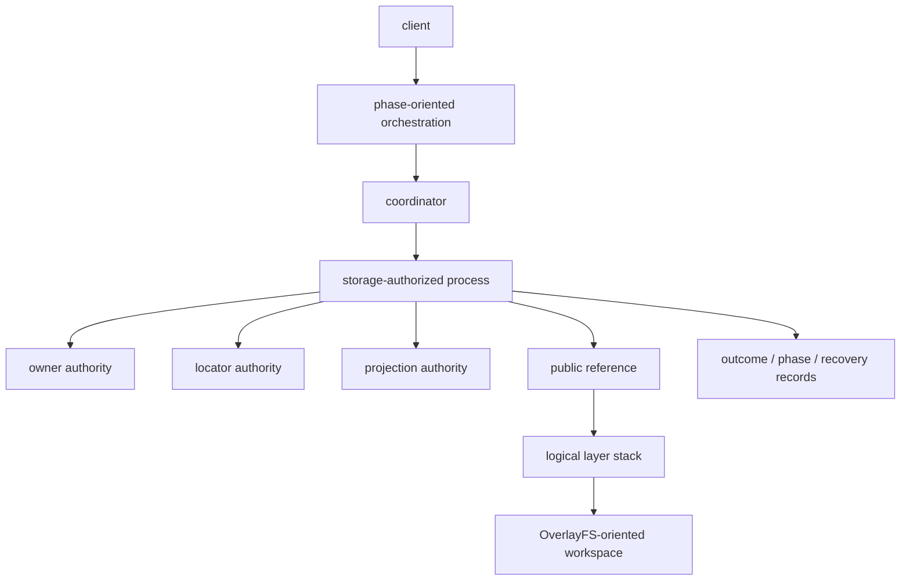

**Conclusion:** MPLA provided useful identity, OCC, crash and measurement
evidence, but overlapping durable authorities plus layer/squash and backend
coupling are rejected.

### Selected shape

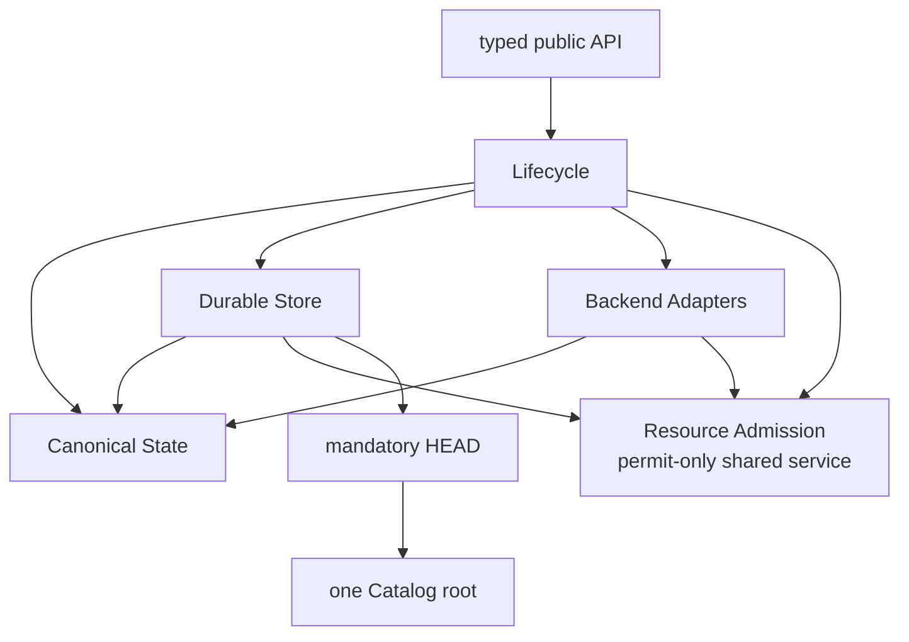

**Conclusion:** four domain authorities have disjoint truth. Workspace capture
is a workflow among them, not a component or ledger.

## 2. Complete-state sharing without a layer stack

Consider three publications of one file. `State A`, `State B` and `State C`
are each complete states; arrows below are canonical object references, not
base-layer links. These aliases avoid collision with the S1/S2 Store mechanisms.

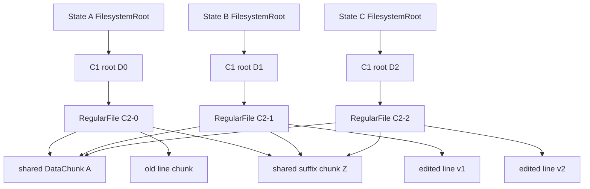

**Conclusion:** each `FilesystemRoot` and C2 root is independently complete;
sharing arises from equal immutable object IDs, not from a base-state or layer
edge.

Every C2 root spans the complete logical file. Removing the root for `State A`
cannot make `State B` or `State C` uninterpretable. Shared `A` and `Z` payload objects are
stored once by `ObjectId`; unretained `B0` becomes collectable. If checkpoints
name all three states, all three differing line chunks are intentionally live.

### S3 is physical only

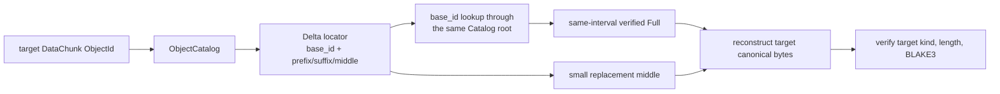

**Conclusion:** S3 changes only the selected physical representation of one
DATA object; the target ID still verifies to the same complete canonical
bytes, and its Full anchor is a bounded physical dependency.

The target remains a normal complete DATA object. S3 is eligible only for an
equal-length same-interval Full base, length `<=32 KiB`, depth one, framed
delta `<=floor(full/4)`, and savings `>=1 KiB`. It is not a logical line-edit
chain. Failed base revalidation stores Full or rebuilds; it cannot select a
dangling Delta.

## 3. Identity versus location

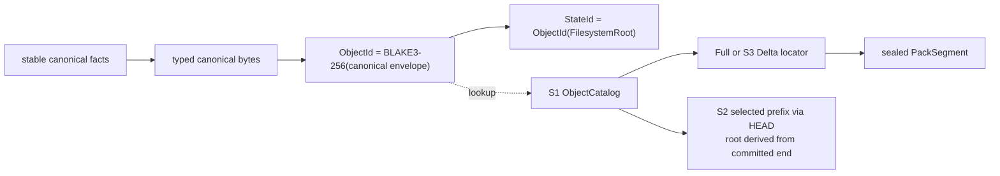

**Conclusion:** identity terminates at canonical bytes and typed object IDs;
the Catalog, locators and packs may be replaced without changing `StateId`.

`StateId` contains no segment, pack, arena, Store sequence, adapter, sandbox,
checkpoint or origin. Repack can change every locator without changing one
canonical ID. Lifecycle can change `HeadRevision` while publishing the same
`StateId`.

The identity grammar is deliberately small:

```text
ObjectEnvelope = [versioned_type_tag, payload]
ObjectId = BLAKE3-256(canonical(ObjectEnvelope))
StateId = ObjectId(FilesystemRoot)
```

There is no extra state or state-wide attribution wrapper. The fixed profile
rejects basenames over 255 bytes, encoded paths over 4,096 bytes, more than 512
typed children, complete envelopes over 65,536 bytes, C2 node payloads over
16,512 bytes and C2 root levels above 7.

## 4. Pack and Catalog layout

```text
PackSegment (<=64 MiB)
+----------------------+--------------------------------------------+
| PackHeader           | fixed magic and version                    |
+----------------------+--------------------------------------------+
| RecordHeader (34 B)  | ObjectId[32], stored_len_minus_one:u16     |
| stored payload       | exactly stored_len_minus_one + 1 bytes     |
+----------------------+--------------------------------------------+
| ...                  | one or more complete frames                |
+----------------------+--------------------------------------------+
| exact EOF            | no footer, trailer or padding              |
+----------------------+--------------------------------------------+
```

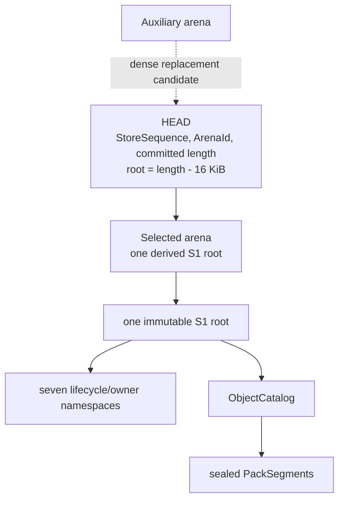

**Conclusion:** one HEAD selects one committed arena prefix, whose final
16-KiB page is the only S1 root for all lifecycle and physical lookup rows;
Auxiliary is replacement space, not a fallback version.

The two arenas are physical replacement space, not two public versions.
Auxiliary is never a fallback acknowledged selector. `SegmentId` is the sole
digest: BLAKE3-256 of the exact complete pack file. Codec, Delta `base_id` and
canonical length exist only in the Catalog locator. The u16 minus-one encoding
admits stored lengths 1..65,536 without a second length field. Recovery obtains
the committed length with `fstat`, hashes every file byte, checks `SegmentId`,
and requires at least one complete frame ending at exact EOF; there is no footer
to elect, trust or repair. Canonical identity remains `ObjectId`.

The 16 owner rows have static meaning:

```text
OwnerSlot[0]     = Empty | Build {owner_nonce}                 # maintenance only
OwnerSlot[1..15] = Empty | Build {owner_nonce} | AdapterClose  # foreground only
```

`Build` contains only `owner_nonce`; it has no other discriminator. A selected
slot-0 `Build` is the global maintenance fence. A caller that cannot select its
lane gets bounded `RetryLater` while owning no slot, file, queue item, buffer,
FD or volatile permit.

## 5. Sparse S1 update versus dense rebuild

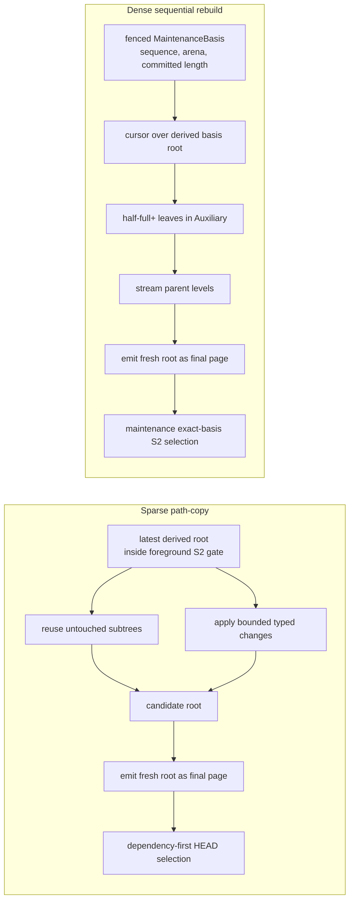

**Conclusion:** foreground sparse publication applies its bounded typed change
to the latest selected root and does not exact-CAS unrelated Catalog identity.
Dense maintenance alone builds from a fenced global basis and requires exact-
basis S2 selection.

S1 uses `P=16 KiB` pages, half-full non-root occupancy, height `<=8`, one
Selected plus one Auxiliary arena, and total Catalog physical bound
`<=4C_max`. `HEAD` is exactly
`{type_tag,StoreSequence,ArenaId,committed_arena_length,checksum}`. It requires
an aligned `committed_arena_length>=P` and derives, but never serializes,
`CatalogRoot=(ArenaId,committed_arena_length-P)`. Every selectable sparse or
dense build emits one fresh root as the final page: no selected byte or padding
follows it, and every child reference is P-aligned, in the same arena and
strictly below it. A candidate write cursor begins at the selected committed
end, never an `fstat` result, and `O_APPEND` is forbidden. Sparse updates avoid
whole-Catalog rewrite. Dense rebuild avoids path-copy amplification but may
select only after dependency sync and exact
`MaintenanceBasis={StoreSequence,ArenaId,committed_arena_length}` revalidation;
any mention of its Catalog root is derived shorthand, not another basis field.

## 6. Portable publication

```mermaid
sequenceDiagram
  participant L as Lifecycle
  participant A as Adapter
  participant C as Canonical State
  participant S as Durable Store
  participant H as HEAD

  Note over L,A: accepted create froze actor_id in durable Mutable/ACTIVE
  L->>S: select slot 1..15 Build {owner_nonce}; require slot 0 Empty
  L->>A: close writer gate; drain; acquire stability fence
  L->>C: exact stored actor_id for C3 attribution
  A->>C: pass 1 complete facts, source reads <= B_scan
  C->>S: disk-backed descriptors/runs in exact nonce-owned staging
  A->>C: pass 2 grouped rereads, cumulative source reads <= 2B_scan
  C->>S: classify U_reuse and U_missing exactly
  C->>S: compare C_reuse; read P_reuse; write framed P_new
  S->>S: seal/sync globally ObjectId-ordered candidate packs + Build-owned cursor
  L->>S: exact session + Build + StateId + cursor final request
  S->>S: latest-root origin check + structural lookup of every ObjectId
  alt origin matches and final stream is valid
    S->>S: install only candidate segments with selected_count > 0
    S->>H: chosen locators + PUBLISHED + revision+1 + receipt + Build clear
    S->>H: HEAD.tmp sync; rename; parent-directory sync
  else first REUSE or Full-base invalidation
    S-->>L: leave gate; retain Build and private-workspace fence
    L->>S: unlink+dirsync staged cursor/scratch/packs; recapture once
  else origin differs
    S->>H: no locator + CONFLICTED + receipt; retain Build for cleanup
    S->>H: HEAD.tmp sync; rename; parent-directory sync
  end
```

**Conclusion:** the two fenced source passes prepare one complete candidate;
the final exact-origin decision either selects all of it or selects none of
its locators.

The baseline label is `PortableFullScan`. A capability-qualified lossless
adapter journal may use `JournalQualifiedDelta`; the two measurements must
never be pooled. Journal overflow/gaps return to the full scan.

The accounting variables are deliberately not collapsed into “delta bytes”:
source payload reads are `<=2*B_scan`, canonical comparisons are `C_reuse`,
selected-Store reads are `P_reuse`, and new framed physical writes are
`P_new`. `C_reuse` and `P_reuse` are not bounded by `B_scan`, because metadata
and attribution can exist with zero source payload and an S3 reconstruction may
read both a Delta and its Full anchor.

There is no durable `PUBLISHING`, merge or retry against the new head. A
content-identical successful publication still advances `HeadRevision`, so two
sibling sessions from one origin cannot both succeed through ABA.

`Session/Terminal` has no result field: `PUBLISHED` determines `Published` and
`CONFLICTED` determines `PublishConflict`. The authenticated `Receipt`, not a
duplicate terminal field, preserves the exact bounded response for replay.

That replay horizon stays inside the existing `Receipt` namespace. It has 16
`ReceiptControl` lane rows containing only `next_sequence:u64` and exactly 64
`ReceiptSlot` rows per lane containing
`{request_digest[32], bounded_exact_result}`. Sequences are contiguous, replay
lookup scans the fixed 64-row horizon in `O(H)` with `H=64`, and effect,
replacement slot and next counter select atomically. A slot has no sequence,
generation or low-water field, and the schema adds no ninth namespace.

`create_workspace_session` snapshots the authenticated principal into immutable
`Session/Mutable.actor_id` in the accepted create commit. Publication and every
retry pass that exact stored `ActorId` to C3; ambient caller identity at publish
time is never attribution input.

For S3 preparation, a `ReadSlot` resolves and verifies the Full base in one
captured Catalog root; only staged output is under `Build` custody. Final
publication looks up every cursor `ObjectId` in the latest root. `REUSE` must
keep a structurally valid current row. A candidate-locator keeps the current row
if present and uses its staged locator only when absent; an existing Full is
never replaced by a staged Delta. A structurally invalid selected row fails
closed rather than masquerading as absence. This trusts the selected Catalog's
structural and locator invariants and performs no final-gate payload reread.
Every selected Delta re-resolves and atomically retains its current Full
`base_id`; it persists no duplicate base locator.

Candidate frames are globally `ObjectId`-ordered. Each segment therefore owns
one contiguous cursor interval and one O(1) `selected_count`; it is installed
only when that count is nonzero. A zero-selected segment from late dedup is
unlinked and directory-synced under the same `Build`. A selected mixed segment
may contain dead staged frames, which later exact repack handles outside the
final gate.

Missing/invalid `REUSE` or required-Full rows never trigger a local `REUSE`
upgrade. On the first invalidation, publication leaves the gate, retains the
exact `Build` and private-workspace fence, unlinks and directory-syncs its cursor,
all staged scratch and all staged packs, then performs one complete bounded
two-pass recapture. A second invalidation repeats exact cleanup and returns typed
`RetryLater`; there is no loop. No candidate pack is installed before the
complete revalidation succeeds.

## 7. Checkpoint, rollback and fork pointers

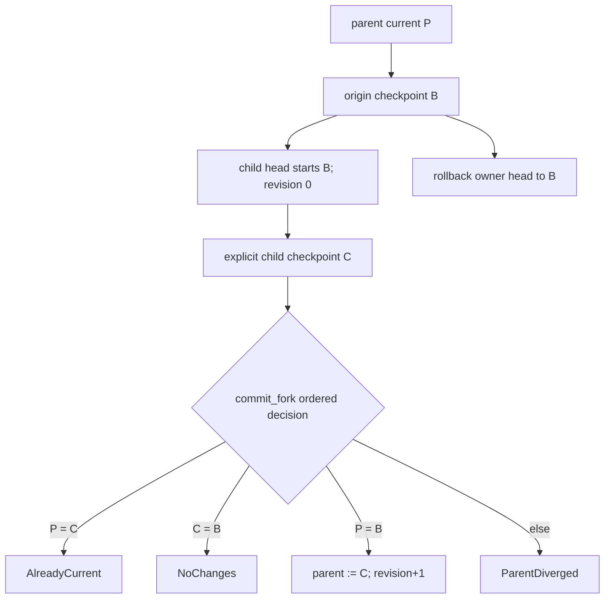

**Conclusion:** all lifecycle operations move named pointers among complete
states, and fork commit's ordered result table supplies no merge, ancestor
search or history layer.

Checkpoint creation copies no payload and initially adds one root record; its
state is already live as the current head. Future newly selected bytes remain
charged alongside checkpoint-reachable old bytes. Fork binding is immutable,
`ForkOrigin {parent_id, origin_checkpoint_id}` records only the immediate
parent/checkpoint, `CheckpointPin` is derived membership, commit does not
merge, and destroy does not cascade.

## 8. Semantic roots and exact physical closure

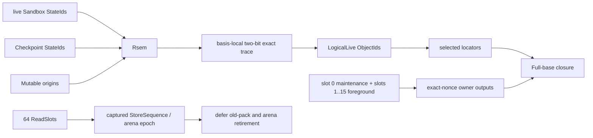

**Conclusion:** fixed semantic roots drive logical tracing; temporary owners
and readers protect physical custody, and S3 Full anchors enter only the
physical dependency closure.

The trace reads fixed root fields from one exact captured Catalog root. All
Terminal fields, receipt contents, allocation handles, provenance and
`CheckpointPin` are inert. V1 activates only an adapter profile that has proved
**every** conflict-retained allocation self-contained and readable until
explicit destruction; a profile lacking that universal guarantee is
unsupported. There is no runtime per-conflict proof branch or terminal content
edge.

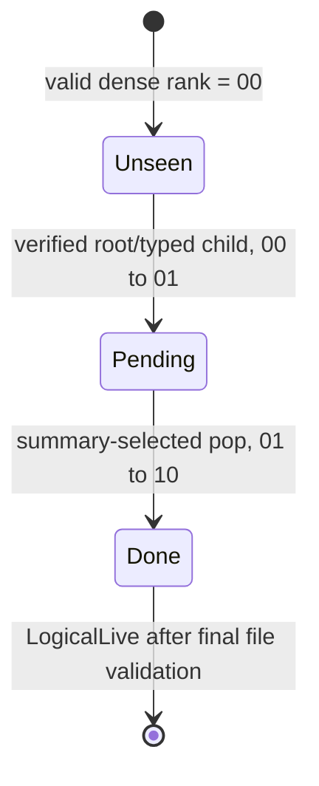

**Conclusion:** S1 checked subtree counts map the captured ObjectCatalog to
dense ranks. One checked non-sparse file stores two-bit states plus pending
summaries; unused state tail is `11`, summary/tail bits finish zero, and any
failure discards the entire file rather than resuming it. A live Delta's Full
anchor enters only physical closure, never the semantic trace.

The frozen allocation shape, with checked allocation rounding `A`, is:

```text
P_s=4096; d=32; P_t=4064
q0=ceil(N_object_max/(4*P_t))
q(j+1)=ceil(qj/(8*P_t)) while qj>1
Q=sum(qj); Q=0 when N_object_max=0
D_trace_max=A(P_s*(1+Q)); I_trace_max=1

q_run(r)=floor(1 MiB/r); m(r,n)=ceil(n/q_run(r))
G(r,n)=A(r*n+64*m(r,n))
N_pack_record_max=
  N_object_max+N_pack_max
D_closure_scratch_max=
  2*max(G(36,N_delta_max),G(72,N_pack_record_max))+A(4096)
I_closure_scratch=3
passes_edge=ceil(log_8(max(1,m(36,N_delta_max))))
passes_pack=ceil(log_8(max(1,m(72,N_pack_record_max))))
q_run(36)=29,127; q_run(72)=14,563
```

The closure bound means two non-sparse generation containers plus one control
file, reused sequentially for exactly two sorts. The first uses 36-byte
`DeltaEdgeV1 {base_id[32], target_rank:u32}` records; Catalog object counts and
dense ranks are admitted only below `2^32`. The second uses the tag-free
72-byte `PackCensusV1 {segment_id[32], offset_or_committed:u32,
marked_len:u32, object_id_or_zero[32]}`. The high two `marked_len` bits are the
closed enum `00=DEAD_CATALOG`, `01=LOGICAL`, `10=ANCHOR`, `11=INVENTORY`; its
low 30 bits hold framed length, or allocated length on inventory. Inventory
uses committed length in `offset_or_committed` and a zero ObjectId.

The exact census comparator numerically orders `(segment_id,
offset_or_committed, low30(marked_len), high2(marked_len),
object_id_or_zero)`; manual canonical encoding is not host-struct `memcmp`.
Every frame offset is below committed length, so the unique inventory record
sorts after every Catalog frame for its segment.
Every total, product, allocation rounding and capacity formula uses checked
widened u64/u128 arithmetic and narrows only after the u32 and low-30-bit bounds
are proved. The census includes every selected ObjectCatalog row, including
dead rows, plus a streamed installed PackSegment directory inventory. A pack
is current-selected exactly when a current locator names it, so there is no
PackCatalog or rowless selected pack. ReadSlots protect epochs instead of
adding per-object records. Replacement pack headers are rescanned sequentially
in `ObjectId` order, which directly supplies new offsets without another record
family or third sort.
Authoritative definitions and tail/checksum rules are in
[System requirements](../system_requirements.md#exact-bounded-trace).

Without refcounts, accounting is conservative: new selected physical/Catalog
bytes are charged; retiring a root gets zero immediate credit; exact trace plus
completed reclaim is the only credit point. This can temporarily overcharge,
but it cannot undercharge or collect live content.

### Why semantic retention cannot explode silently

The collector never guesses that an old named state is disposable. Its bounded
control loop is instead:

```text
explicitly remove an unbound semantic root through S2
  -> exact trace from the three fixed root classes
  -> classify unreachable canonical objects dead
  -> REWRITE_BATCH repacks/normalizes under the maintenance reserve
  -> drain old readers, delete and sync, then release accounting credit
```

Manual checkpoints never expire implicitly. A caller may put TTL, last-N or
budget policy around checkpoints that policy itself owns, using the same
`remove_checkpoint` operation. Finite root and storage-retention quotas reject
new retention before physical exhaustion, so even a stalled collector creates
backpressure instead of unbounded accepted growth.

| Repeated-edit shape | What grows | Elegant bound/reclaim behavior |
|---|---|---|
| Same line edited repeatedly, no checkpoint | The newest changed C2 chunk, nearby C2/C1 ancestors and current attribution; dead versions may accumulate between maintenance passes. | Old versions have no root. Exact trace marks their unique objects dead; a bounded rewrite batch reclaims their pack space. |
| Very small file whose every edit changes its sole chunk | Logical dedup may be zero for that chunk. | Live canonical cost follows the current state, not publication count; temporary dead bytes remain charged and trigger maintenance/backpressure. |
| Adversarial chunk-boundary phase shift | A one-byte edit may defeat expected C2 resynchronization and change `Theta(B)` candidate objects in the worst case. | The design claims expected sharing, not a false locality bound. Complete candidate byte/object admission either charges the finite output or rejects it; there is still no delta chain, and unrooted replacements follow the same trace/repack path. |
| A checkpoint for every edit | Every distinct retained chunk and ancestor may remain live. | This is requested information, not garbage. Hard root/retention quotas reject more; explicit checkpoint removal or an owner-controlled policy releases it. |
| Many concurrent candidates and conflicts | Private allocations and candidate packs coexist temporarily. | Fixed workspace claims and 15 exact-nonce foreground lanes bound candidate/close custody; slot 0 is maintenance-only. A rejected lane selection owns zero waiter resources; conflicts are self-contained private allocations under separate session/workspace quotas. |
| Long-lived stale ACTIVE session | Its immutable origin remains a semantic root while newer heads publish. | Finite session/root counts and conservative aggregate physical byte/inode caps block further retention. Only explicit destruction, or an owner-controlled session lease policy invoking the normal destroy API, releases the origin; the Store never silently edits the root set. |
| Abandoned CONFLICTED sessions | They retain no canonical origin, but their self-contained private allocations consume workspace disk. | Separate session-count and workspace byte/inode quotas apply backpressure; explicit destroy or an owner-controlled lease performs synchronous adapter disposal. Semantic GC neither mistakes this disk for canonical liveness nor hides it. |
| Large fork/checkpoint forest | Every sandbox head and named checkpoint is an intentional root; duplicate states deduplicate payload but still consume bounded Catalog rows. | Finite root/Catalog-record counts plus conservative aggregate physical byte/inode caps reject expansion. Cleanup is explicit and non-cascading, so a policy must remove eligible checkpoints and destroy intended sandboxes through their normal APIs. |
| Repeated metadata or actor changes with equal DATA | DATA may deduplicate while C1/metadata/C3 attribution objects remain distinct. | Exact tracing accounts for every typed object, not only chunks. Unrooted metadata/attribution is reclaimed; rooted variants remain charged against the same retention budget. |
| A-B-A toggle | The second A resolves to existing canonical IDs. | Content-addressing deduplicates it, while `HeadRevision` still distinguishes lifecycle ABA. |

Logical squash cannot reduce the exact closure of states the user still names.
Removing unwanted roots plus exact GC is both simpler and at least as
space-effective; physical repack is the only needed compaction operation.

## 9. Maintenance and reader-safe retirement

```mermaid
sequenceDiagram
  participant M as Maintenance owner
  participant C as Selected Catalog
  participant H as HEAD
  participant R as bounded readers
  participant FS as filesystem directories

  M->>C: select slot-0 Build {owner_nonce}
  Note over M,C: global fence rejects every non-maintenance S2 mutation
  M->>C: capture {StoreSequence,ArenaId,committed length}; derive root and scan
  M->>M: trace + two reusable sorts + choose <=64 victims
  M->>M: write <=1 owner output pack, <=64 MiB
  M->>M: dense-build and sync complete Auxiliary Catalog
  M->>C: epoch-protected exact-basis relation validation in Theta(N_object)
  C->>H: dependency-first S2 replacement + exact nonce clear
  H->>FS: parent-directory sync
  M->>R: wait for old bounded epoch to drain
  M->>FS: delete old pack/arena/anchor; sync every parent directory
  M->>M: release byte/inode debt credit
```

**Conclusion:** maintenance receives credit only after an exact-basis
replacement, reader drain, physical deletion and directory synchronization.
Its selected slot-0 `Build` row is the single global non-maintenance S2 fence for the
entire trace/rewrite/validation/selection interval.

Reads, materialization and already-admitted private workspace edits may
continue. Already-selected candidate computation may continue privately, but
no foreground lane can be selected or finalized; every such attempt returns
bounded `RetryLater` with zero waiter-owned resources. Since no Store mutation
can cross the fence, a basis mismatch is
not normal contention: it is corruption or invariant failure and causes
synchronized abort or fail-closed recovery, never optimistic rebase or retry.
The honest write-side pause is
`Theta(N_object+N_pack+X_live)`, spanning the complete trace, sorts, rewrite,
dense validation and selector—not only an `O(1)` final CAS.

One `REWRITE_BATCH` engine selects at most 64 victim SegmentIds in one
at-most-4-KiB vector and writes at most one 64-MiB output pack. Each
`VictimV1` is exactly 40 bytes—`segment_id[32]`, `allocated:u32`,
`retained_framed:u32`—so 64 records occupy 2,560 bytes before the checked
header. The selected rewrite policy appears once in invocation/vector control,
never in each victim record. Its four policy choices share one trace, rewrite
and commit algorithm:

| Policy | Exact progress condition |
|---|---|
| `DEAD_REPACK` | Up to 64 dead/partially dead sources, `X_live<=64 MiB-8 B`, and `2*X_alloc<=V_alloc`. |
| `EMERGENCY_REPACK` | Before retention failure when the normal ratio is impossible; actual `X_alloc<V_alloc`. |
| `CONSOLIDATE` | Up to 64 all-live sources, `X_alloc<=V_alloc`, and strictly fewer output packs. |
| `NORMALIZE` | At least one selected Delta becomes Full and selected Delta count strictly falls; claim no physical decrease unless a source pack is fully retired. |

Each selected step decreases its stated finite measure and a later batch starts
from a fresh fenced basis. Only absence of progress in all four policies proves
the irreducible live floor; no policy deletes a semantic root or borrows the
maintenance reserve.

## 10. Crash cuts, including session close

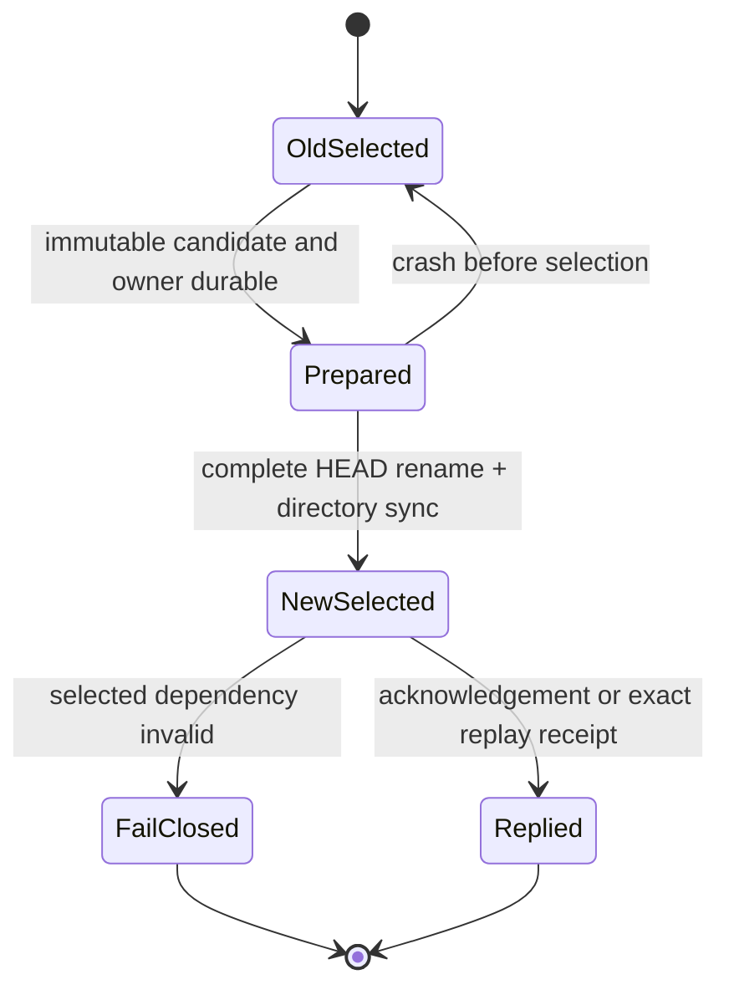

**Conclusion:** S2 exposes only the prior complete selection, the complete new
selection, or a closed failure; an acknowledged result is recovered by its
exact receipt rather than by choosing an older selector.

```mermaid
sequenceDiagram
  participant L as Lifecycle
  participant S as S2 / OwnerSlot
  participant A as Adapter

  L->>S: select OwnerSlot/AdapterClose intent conditioned on exact session row
  L->>S: verify expected_row_digest + owner_nonce; derive allocation from row
  L->>A: fence and drain
  L->>A: dispose private allocation; sync destructive transition
  L->>S: delete exact Mutable/Terminal row + exact receipt + clear intent
  Note over S,A: crash recovery sees selected intent and repeats disposal idempotently
```

**Conclusion:** a typed `AdapterClose` intent makes the irreversible adapter
disposal discoverable across every crash cut; the exact session row remains
selected until the final S2 commit.

The diagram shows explicit destruction. The other two lawful disposal
authorities are the already-selected Mutable/`OPENING` row during activation
abort and Terminal/`PUBLISHED` during synchronous publication cleanup. An
`ACTIVE` or `CONFLICTED` allocation requires `AdapterClose`; no unrooted
background cleanup task may infer permission from a filesystem handle.

The close intent uses one of foreground slots 1..15; slot 0 remains
maintenance-only. This is not a ninth namespace or seventh mechanism. No
pre-disposal crash can strand an
undiscoverable allocation. An unused intent may be cleared only before
irreversible disposal; after that boundary, recovery must complete it.

Neither `AdapterClose` nor `DisposalAuthority` carries an
`allocation_handle`. The exact selected Session row remains the sole source of
the allocation; `expected_row_digest` and `owner_nonce` reject stale intent or
slot reuse before Lifecycle passes the derived allocation to the adapter.

| Crash cut | Public/semantic result | Required residue handling |
|---|---|---|
| Candidate frame or pack incomplete | Old head | It remains only in nonce-owned staging; unlink staged cursor/scratch/packs and sync their directories before clearing `Build`. |
| First final-stream invalidation | Old head | No candidate pack was installed. Leave the gate, retain exact `Build` plus private-workspace fence, clean and directory-sync all staged artifacts, then perform the one allowed complete two-pass recapture. |
| Candidate destination installed, HEAD unselected | Old head | A live failure or recovery unlinks and directory-syncs every known destination and staged residue before clearing `Build`. |
| HEAD selected, response lost | Complete new state | Exact receipt returns original result. |
| Selected dependency corrupt | No state served | Fail closed; never elect Auxiliary or older sequence. |
| Activation failed with OPENING selected | Exact OPENING row still owns the allocation | Recovery repeats freeze/dispose/sync, then conditionally deletes the row and records the exact failure. |
| PUBLISHED selected, allocation cleanup incomplete | Complete new state plus Terminal/PUBLISHED | Recovery repeats freeze/dispose/sync before readiness/normal acknowledgement; the terminal handle is inert. |
| AdapterClose intent selected, disposal incomplete | Exact session row still present | Recovery fences and resumes idempotent disposal. |
| Allocation disposed, final row-delete absent | Exact session/root still selected | Recovery finishes delete+receipt+intent-clear S2 commit. |
| Old pack deleted, parent directory not synced | Debt not credited | Recovery completes directory sync before credit release. |

Startup does not clear `Build` rows as a prelude to cleanup. It keeps every
selected `Build` and all of its byte/inode charges through a complete orphan
census, unlinks and directory-syncs every nonce-owned staging artifact and
installed owner-derived pack not selected by HEAD, verifies its fixed staging
area empty and the pack directory free of that Build's unselected
residue, then clears the exact nonce and releases charges. The same
ordering applies synchronously to a live pre-HEAD failure.

## 11. Aggregate Resource Admission

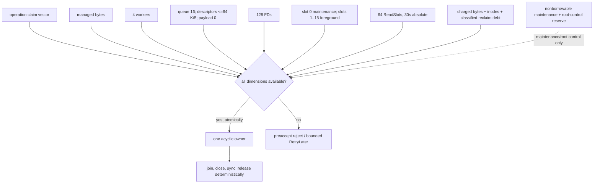

**Conclusion:** admission is one atomic aggregate claim, while maintenance and
root-control capacity are separately non-borrowable so accepted cleanup can
finish without competing with new writable work.

**Analytical bound:** storage-managed hard global 8 MiB; one sandbox claim
`<=4 MiB`; one heavy operation `<=2 MiB`; cgroup high-water 64 MiB and hard
`100,663,296 B` (96 MiB); swap and unbounded cache disabled. External runs are
1 MiB with merge fan-in 8. Reclaimable debt is 128/256 MiB soft/hard and 32/64
inodes soft/hard, covering only classified retired epochs and maintenance
orphan/output—not selected unknown garbage, pack slack or Catalog arenas.
**Target:** storage-managed live memory at or below 4 MiB.

The simultaneous maintenance reserve is:

```text
D_aux_max <= A(2*C_max)
D_maintenance >= D_aux_max + D_trace_max + D_closure_scratch_max
               + P_pack_alloc_max + D_HEAD + D_root_ctl
I_maintenance >= I_aux_max + 1 + 3 + 1 + I_HEAD + I_root_ctl
```

`P_pack_alloc_max=A(P_pack_committed_max)` and
`P_pack_committed_max=64 MiB` already include the eight-byte pack signature and
every frame; there is no footer or extra pack-header reserve term.

The inode counterpart includes Auxiliary Catalog files, trace `1`, two
generation files plus one control file for the sequential 36/72-byte closure
orderings, one
replacement output, HEAD/control, and root-control workflow files. The
dedicated `D_root_ctl/I_root_ctl` lets complete semantic-nonexpanding
checkpoint, session and sandbox control workflows finish under ordinary
capacity pressure; it covers coexisting `AdapterClose` intent/final output and
replay/no-effect receipts, not one guessed Catalog path. Creation, publication
and bulk GC cannot borrow it. Once used, normal writable readiness remains
closed until the workflow, old-page/control cleanup, parent-directory sync and
full reserve restoration complete.

## 12. Backend profiles

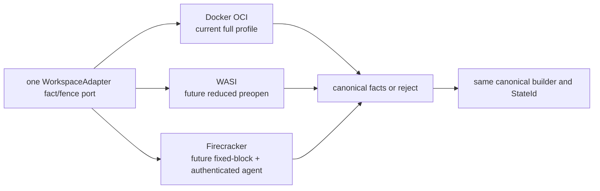

**Conclusion:** every backend profile must produce or consume the same
canonical facts and `StateId`; backend accelerators and quota claims remain
capability-qualified physical behavior.

Portable materialization reads one `FilesystemRoot`, traverses only C1 and C2,
and streams the DATA needed to realize the private filesystem. It validates the
typed attribution-ID fields but does not fetch or decode byte-attribution
objects and does not follow scalar `metadata_owner` values as edges. For `B`
non-hole bytes and `F` filesystem facts, the current Docker ordinary-directory
baseline performs `Theta(B+F)` read/write work and consumes `Theta(B+F)`
additional workspace allocation with fixed permits.

Global canonical validation still proves each `HardlinkGroup` member set.
Realization performs no hardlink external sort: a hidden control directory is
on the allocation's same filesystem, an anchor name is derived directly from
the verified group ObjectId, the first `O_EXCL` anchor is completed before any
occurrence, and descriptor-relative `linkat` realizes every member. Completion
verifies the global topology, then unlinks all anchors and directory-syncs the
control directory before activation. Adapter qualification must prove
same-filesystem inode identity, exclusive creation, containment, crash replay
and durable anchor cleanup; otherwise hardlinks are unsupported for that
profile.

| Profile | Correctness baseline | Optional accelerator that remains non-authoritative |
|---|---|---|
| Docker | Complete private ordinary-file allocation, descriptor-safe scan, full fact preservation | Docker snapshotter/OverlayFS materialization acceleration is currently **UNQUALIFIED** and earns no claim; it is never Store/workspace sharing or correctness |
| WASI | Capability-preopened subset; unsupported facts reject | Runtime-specific preopen optimizations |
| Firecracker | Fixed block device plus authenticated guest-agent or offline exact fact reader | VM snapshot/dirty tracking |

`EnforcedQuota` requires a proven unique scope enforcing both bytes and inodes;
otherwise the profile reports `PortableAccounting`. V1 installs a profile only
after it proves every conflict-retained allocation self-contained and readable
without origin canonical objects; this is a profile gate, not a per-conflict
runtime branch. Reflink and FUSE use is prohibited even as an optional fast
path. Snapshot or overlay acceleration cannot define identity, retention,
quota, publication or recovery behavior, and remains disabled for production
materialization until separately qualified.

## 13. Historical performance panel

Measurements below are preserved exactly and kept separate from proposed
targets.

| Item | Label | Exact value | Scope/correction |
|---|---|---:|---|
| P4 publication candidate | **Project measurement** | `58.136209 ms` | Historical MPLA candidate case; not selected-design metadata commit. |
| P4 input | **Project measurement** | `1,737 B` | Historical fixture source payload. |
| P4 immutable output | **Project measurement** | `44` objects, `12,188 B` | Historical fixture object/framing output; not a universal amplification ratio. |
| “1 MiB delta” fixture | **Project measurement** | sparse logical addition | Historical fixture correction: the added logical range did not write one MiB of zero payload; it is not evidence of a one-MiB physical copy. |
| Matched P4 stretch | **Target** | `<=5.8136209 ms` | Ten-times faster than the exact `58.136209 ms` historical case, only if workload and boundary match. |
| Older formal gate | **Target** | `<=0.364440 ms` | Retired historical 100x gate from its own comparison; not derived from the P4 median and not achieved. |
| Current campaign cgroup max | **Project measurement** | `102,543,360 B` | Historical run; FAIL against `100,663,296 B` by `1,880,064 B`. |
| P7 cgroup max | **Project measurement** | `101,289,984 B` | Historical run; FAIL against `100,663,296 B` by `626,688 B`. |

The selected implementation must report at least these separate intervals:
adapter fence, `PortableFullScan` or `JournalQualifiedDelta`, canonical build,
same-ID verification, new-byte write, dependency sync, S1 build, S2 HEAD commit,
adapter cleanup and response. Full materialization/capture cannot inherit a
constant-size metadata target. Managed live bytes, allocator RSS, page cache,
helper/runtime memory and cgroup totals must be reported separately.

## 14. Adversarial acceptance matrix

| Scenario | Required observation |
|---|---|
| Million-object state, cold cache | S1 height `<=8`; managed memory inside permit profile; no resident per-object map. |
| Repeated same-line edits without retained roots | No implicit publication history exists. Earlier unique objects become dead at the next exact trace; bounded `REWRITE_BATCH` reclaim prevents indefinite charged accumulation, and S3 remains depth one. |
| Every edit checkpointed | Retained unique bytes must stay charged. A hard root/retention quota rejects new roots before exhaustion; the caller must explicitly `remove_checkpoint`, or an external TTL/last-N/budget policy may remove only roots it owns. Manual checkpoints never silently expire. |
| A-B-A head sequence with sibling sessions | Canonical A deduplicates; stale sibling loses because `HeadRevision` changed. |
| Sparse far-offset write | Holes remain HOLE entries; no zero payload object proportional to gap. |
| Directory rename and duplicate content | C1 subtree sharing and C3 occurrence-rank attribution remain deterministic. |
| Power cut at every S2 barrier | Recovery returns old, complete new, or fail closed; never a hybrid/fallback root. |
| S3 base or REUSE invalidated before selection | The final stream performs structural current-root lookup for every ObjectId with no payload reread or local REUSE upgrade. First invalidation cleans and recaptures completely while retaining Build/fence; the second cleans and returns typed `RetryLater`. |
| Late dedup of staged representations | A current row wins, especially existing Full over staged Delta. Globally ObjectId-ordered segment intervals yield O(1) `selected_count`; zero-selected packs are deleted and synced, nonempty mixed packs install and later repack dead frames. |
| Dense rebuild/repack race | Exact slot-0 maintenance `Build` selected before basis capture fences every foreground selection and non-maintenance S2 mutation through full relation validation and selection; an impossible mismatch aborts/fails closed. |
| Large hardlink topology | Canonical member-set validation remains global; materialization uses same-filesystem ID-named O_EXCL anchors plus `linkat`, no hardlink external sort, and syncs anchor removal before activation. |
| Capacity exhaustion during root removal | Dedicated root-control slice covers the complete accepted workflow; writable readiness reopens only after durable cleanup and full reserve restoration. |
| Crash during session destruction | Selected AdapterClose intent drives synchronous idempotent completion; row/root persists until final commit. |
| Conflicted retained read after origin collection | Every installed V1 profile must keep every retained conflict allocation readable without origin objects; a profile that cannot prove this is unsupported before activation. |
| 33rd bounded admission under full queue | No expensive ownership; bounded preaccept overload/`RetryLater`, no hidden queue growth. |
| Docker/WASI/Firecracker round trip | Every claimed fact reproduces identical `StateId`; unsupported fact rejects before activation/publication. |

**Overall conclusion:** the selected design keeps MPLA’s useful empirical and
fault evidence but removes MPLA’s production vocabulary and control-plane
shape. No-squash is safe because each state is complete, sharing is by immutable
object identity, retention is explicit, physical deltas are bounded and
dependency-closed, and exact maintenance—not layer collapse—reclaims obsolete
representations.
