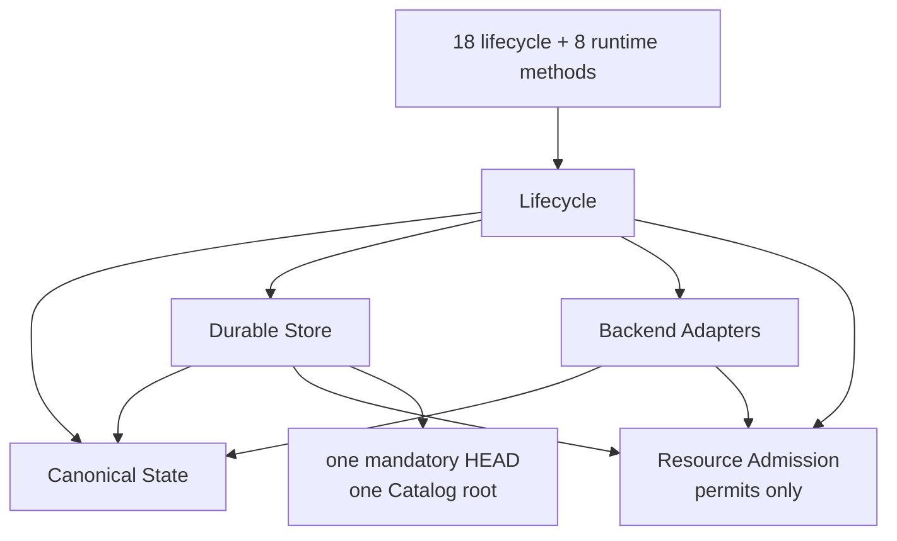
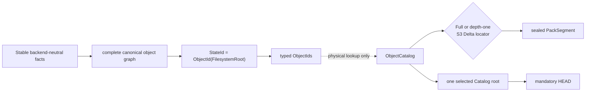
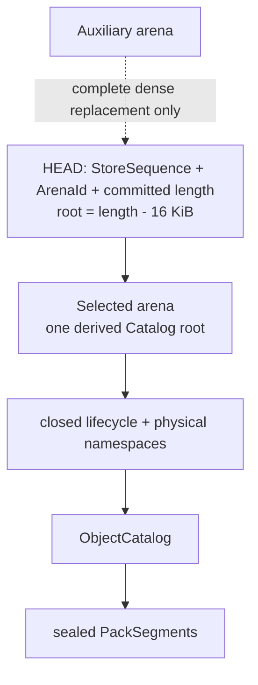
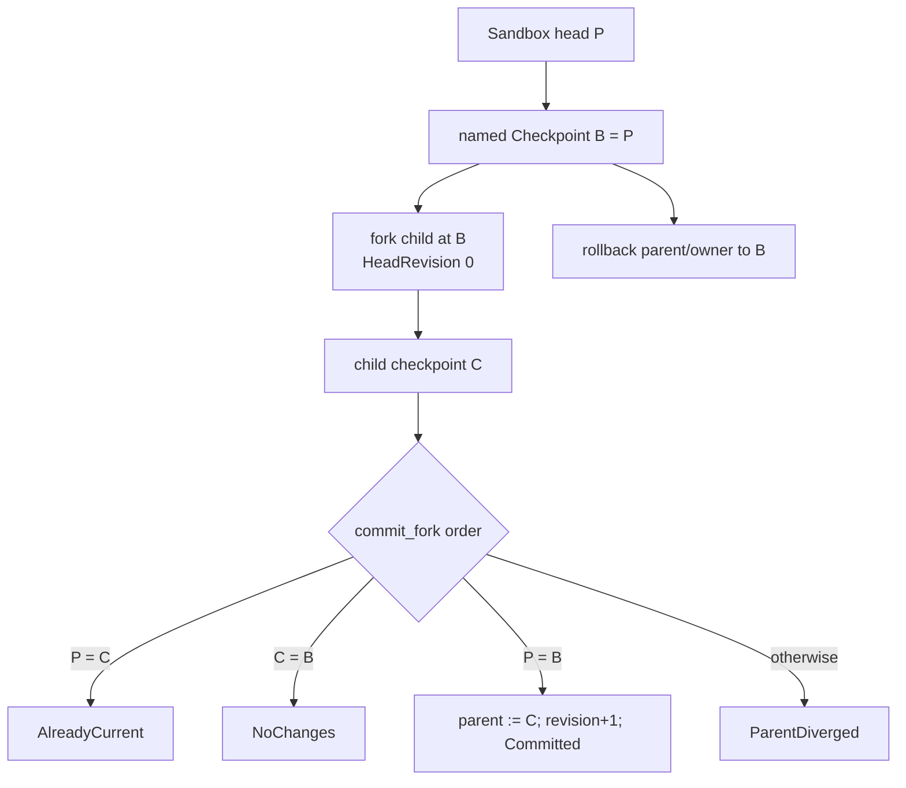
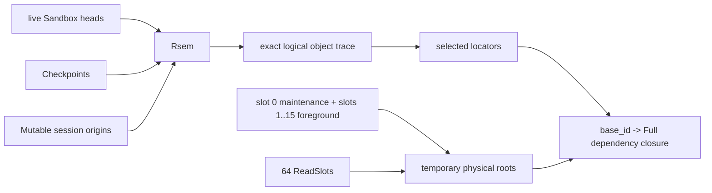

# Overall architecture

> Status: **Accepted**
> Decision: replace the historical MPLA proof of concept with the clean-slate
> **Portable Merkle State Store**.

The selected system exposes one complete immutable `StateId` per public head,
uses structural sharing between canonical objects, and stores all lifecycle and
physical lookup state in one selected Catalog root. It deliberately has no
layer chain, logical delta stack, squash, autosquash, remount, implicit rebase,
general merge or public history.

## Four domain components and one shared service

There are exactly four domain components:

1. [Canonical State](../components/canonical_state.md) — pure complete-state
   facts, object bytes, `StateId`, C1/C2 and exact C3 attribution.
2. [Durable Store](../components/durable_store.md) — immutable object custody,
   the S1 Catalog, S2 single-HEAD selection, S3 physical DATA deltas, readers,
   maintenance, exact tracing and recovery.
3. [Lifecycle](../components/lifecycle_engine.md) — heads/revisions, sessions,
   checkpoints, fork bindings and derived checkpoint membership, strict publication, semantic roots and
   bounded exact replay.
4. [Backend Adapters](../components/backend_adapters.md) — private execution,
   safe realization, fencing, stable facts, quota qualification and disposal.

Resource Admission is one shared **permit-only** service. It owns no data,
identity, lifecycle state or durable policy. [Workspace workflows](../components/workspace_engine.md)
is a composition view and contributes component count zero.



**Conclusion:** the dependency graph is acyclic: Lifecycle composes the three
other domains and requests permits; Store and Adapters depend only on
Canonical State and permit admission. No bidirectional domain edge creates a
second authority.

Dependencies do not grant authority in reverse. Store treats Lifecycle values
as closed opaque codecs and follows only the root fields in the fixed schema;
adapters cannot mutate Lifecycle or choose locators; Canonical State contains
no backend or location term.

## Selected identity and custody split



**Conclusion:** canonical identity is independent of physical custody. A
complete `StateId` resolves through the one selected Catalog, while Full versus
S3 Delta encoding and pack placement remain replaceable physical choices.

Every canonical object has exactly one restricted deterministic-CBOR envelope:

```text
ObjectEnvelope = [versioned_type_tag, payload]
ObjectId = BLAKE3-256(canonical(ObjectEnvelope))
StateId = ObjectId(FilesystemRoot)
```

There is no additional state or state-wide attribution wrapper. `StateId`
names one complete filesystem with integrated per-file attribution;
no parent state is needed to interpret it. The format rejects basenames over
255 bytes, encoded paths over 4,096 bytes, canonical objects with more than
512 typed children or envelopes over 65,536 bytes, C2 node payloads over
16,512 bytes, and C2 roots above level 7.

S3 is below `ObjectCatalog`, reconstructs the same canonical DATA bytes, and
cannot alter identity. `HeadRevision` prevents lifecycle ABA. `StoreSequence`
and `ArenaId` are physical selection terms only. Those are the only four exact
version terms.

## Architecture tournament

Correct identity/attribution, old-or-complete-new crash behavior, bounded
resources and absence of prohibited correctness dependencies are hard gates.
A timing advantage cannot compensate for a failed gate.

| Candidate | Attractive property | Disqualifying cost or missing proof | Verdict |
|---|---|---|---|
| Historical MPLA control plane | Useful crash, publication, canonicalization and benchmark evidence | Layer/squash semantics, OverlayFS coupling, overlapping owner/locator/projection/outcome/phase/recovery authorities | Evidence only |
| Simplified journal/layer store | Smaller migration | Keeps logical and physical history coupled; compaction and replay policy remain public correctness | Reject |
| Loose complete Merkle objects | Clean one-root semantics | One inode/sync per object and no bounded physical lookup/repack strategy | Reject |
| Packed objects with flat static locator table | Dense reads and rebuild | Sparse update rewrites `Theta(N)` lookup state | Reject |
| LSM/SST catalog | Ingest-friendly merges | Levels, precedence, tombstones, filters and compaction/recovery add a second maintenance theory | Reject |
| Extendible hash catalog | Expected point lookup | Weak ordered/prefix trace and separate split/shrink mechanism | Reject |
| General database/KV | Existing query/storage machinery | Arbitrary schema, WAL/MVCC/cache/background semantics violate the closed single-root contract | Prohibited |
| **Portable Merkle State Store** | Complete canonical DAG, sealed packs, role-specific CoW B+ Catalog, one mandatory HEAD, qualified adapters | Portable workspace realization and stable scan remain linear physical costs | **Select** |

The physical-index tournament and analytical bounds are detailed in
[Durable Store](../components/durable_store.md#physical-index-tournament).
The selected B+ structure is not claimed universally fastest; it is the
smallest option that simultaneously supports bounded cache-off lookup, ordered
prefix scans, sparse path-copy and dense sequential rebuild under S2.

## Exact durable shape

```text
store/
  HEAD                  mandatory selected descriptor
  catalog/
    arena-0             Selected or Auxiliary immutable CoW pages
    arena-1             Auxiliary or Selected immutable CoW pages
  packs/                sealed immutable PackSegments, each <=64 MiB
  staging/              exactly 16 OwnerSlot-owned areas
  quarantine/           invalid/interrupted artifacts
```

`HEAD` is exactly
`{type_tag, StoreSequence, ArenaId, committed_arena_length, checksum}`. It does
not serialize a root pointer. For `P=16 KiB`, a selectable descriptor requires
`committed_arena_length>=P` and `committed_arena_length mod P=0`; its only
`CatalogRoot` is the derived shorthand
`(ArenaId, committed_arena_length-P)`. There is no separate format file, store
identifier or dependency list; recovery derives dependencies by streaming the
selected Catalog. Exactly one arena is Selected; the other is mutually
exclusive Auxiliary replacement space. Auxiliary is never an acknowledged
fallback. The Catalog has one derived root
covering the eight closed namespaces: `Sandbox`, `Session/Mutable`,
`Session/Terminal`, `Checkpoint`, `CheckpointPin`, `Receipt`, `OwnerSlot`, and
`ObjectCatalog`.

Every selectable sparse or dense build writes children bottom-up and emits
exactly one fresh root as its final page. No selected bytes, padding, hole or
page may follow that root. Every child reference is `P`-aligned, names the same
arena and lies strictly below the derived root. A candidate write cursor begins
at the selected `committed_arena_length`, never at physical EOF from `fstat`,
and the arena is never opened with `O_APPEND`; an unselected crash tail is
therefore safely overwritten rather than mistaken for committed state.

The 16 `OwnerSlot` rows are static lanes rather than interchangeable tagged
owners:

```text
OwnerSlot[0]     = Empty | Build {owner_nonce}                 # maintenance only
OwnerSlot[1..15] = Empty | Build {owner_nonce} | AdapterClose  # foreground only
```

`Build` contains exactly `owner_nonce`; lane position supplies its meaning and
there is no other discriminator. A selected slot-0 `Build` is the global
maintenance fence: it prevents every foreground slot selection and
non-maintenance S2 mutation until its exact-nonce clear. Failure to select the
applicable lane is a bounded `RetryLater`; a waiter owns no slot, file, queue
item, buffer, FD or volatile permit.

The sealed-pack grammar is likewise footerless and fixed:

```text
PackSegment := PackHeader {fixed magic, version}
               (RecordHeader {ObjectId[32], stored_len_minus_one:u16}
                stored_payload[stored_len_minus_one + 1])+
               exact EOF
```

Each `RecordHeader` is exactly 34 bytes and each stored payload is therefore
1..65,536 bytes. Codec, Delta `base_id` and canonical length exist only in the
Catalog locator, not in pack framing. There is no footer, trailer or padding.
`SegmentId` is BLAKE3-256 over the exact complete file bytes. Recovery obtains
the committed length with `fstat`, hashes the full file, requires the name/hash
to equal `SegmentId`, and parses at least one complete frame to exact EOF.



**Conclusion:** one mandatory HEAD selects exactly one immutable arena prefix;
the last committed 16-KiB page is its only Catalog root. Auxiliary and sealed
packs are dependencies or preparation space, never alternate acknowledged
authorities.

A sparse commit path-copies affected S1 pages and finishes with a fresh root. A
dense rebuild writes a self-contained Auxiliary prefix and likewise finishes
with a fresh root, changing `ArenaId` only through S2 after every dependency is
durable. There is no WAL, database, second Catalog selector, fallback root,
durable refcount or authoritative live-set ledger.

## Six custom mechanisms

The project-specific mechanism count is exactly six:

| ID | Owner | Role |
|---|---|---|
| C1 | Canonical State | Canonical compressed Patricia/Merkle directory |
| C2 | Canonical State | Bounded `ContentTree-v1` content-defined Merkle sequence |
| C3 | Canonical State | Deterministic C2-run occurrence-rank attribution tiling |
| S1 | Durable Store | Role-specific immutable CoW B+ Catalog |
| S2 | Durable Store | Dependency-first single-HEAD commit and fail-closed recovery |
| S3 | Durable Store | Depth-one `AlignedSpliceDelta-v1` physical DATA encoding |

BLAKE3, deterministic restricted CBOR, pinned FastCDC payload cutting,
external sort/merge, checksums, ordinary file synchronization and kernel
containment primitives are adopted or composed techniques, not renamed custom
mechanisms. Lifecycle and workspace workflows add no mechanism families.

## Publication from complete state to complete state

```mermaid
sequenceDiagram
  participant L as Lifecycle
  participant A as Backend Adapter
  participant C as Canonical State
  participant S as Durable Store
  participant H as HEAD

  Note over L,A: accepted create froze actor_id in Session/Mutable
  L->>S: select a foreground slot 1..15 Build {owner_nonce}; require slot 0 Empty
  L->>A: fence one ACTIVE session and drain writers
  L->>C: pass exact stored actor_id to C3
  A->>C: stable pass 1, at most B_scan source payload bytes
  C->>S: emit disk-backed descriptors/runs into nonce-owned staging
  A->>C: stable pass 2, cumulative source payload reads at most 2*B_scan
  C->>S: classify U_reuse/U_missing; verify once; emit missing once
  S->>S: seal/sync globally ObjectId-ordered candidate packs and Build-owned cursor
  L->>S: exact session + Build + StateId + cursor final request
  S->>S: read latest root; check origin; lookup every ObjectId structurally
  alt exact origin and valid final stream
    S->>S: install only candidate segments with selected_count > 0
    S->>H: chosen locators + PUBLISHED + revision+1 + receipt + Build clear
    S->>H: sync HEAD.tmp; rename HEAD; sync parent directory
  else first REUSE or Full-base invalidation
    S-->>L: leave final gate; retain exact Build and private-workspace fence
    L->>S: unlink+dirsync cursor, scratch and staged packs; recapture once
  else origin mismatch
    S->>H: no locator + CONFLICTED + receipt; retain Build for cleanup
    S->>H: sync HEAD.tmp; rename HEAD; sync parent directory
  end
```

**Conclusion:** publication exposes either the complete exact-origin candidate
with all locators selected or a conflict with no candidate locator; no durable
intermediate publication state is observable.

The exact portable accounting is `source payload reads <=2*B_scan`, canonical
comparisons `=C_reuse`, selected-Store reads `=P_reuse`, and new physical
writes `=P_new`, including record/pack framing. Neither comparison term is
bounded by `B_scan`: metadata and attribution exist with zero source payload,
and an S3 reconstruction may read a Delta plus its Full anchor. A qualified
lossless adapter journal may accelerate discovery, but its overflow/gap path
is the full portable scan.

The session remains durably Mutable/`ACTIVE` during capture; there is no
durable `PUBLISHING`. Every `Published` decision increments `HeadRevision`,
even if candidate and origin `StateId` match. A conflict is read-only and never
rebases. Candidate cleanup and adapter disposal are synchronous, owner-bound
and crash recoverable.

`Session/Terminal` has no result field. Its `PUBLISHED` status determines
`Published`, its `CONFLICTED` status determines `PublishConflict`, and the
authenticated `Receipt` preserves the exact bounded response for replay.

Replay remains bounded inside that existing namespace: 16 `ReceiptControl`
lane rows each hold only `next_sequence:u64`, and each lane has exactly 64
`ReceiptSlot` rows containing `{request_digest[32], bounded_exact_result}`.
Sequence allocation is contiguous; request lookup scans the fixed 64-slot
horizon in `O(H)` with `H=64`, and an accepted operation atomically selects its
effect, replacement slot and next counter. Slots carry no sequence, generation
or low-water field, and these row shapes do not create a ninth namespace.

Adapter disposal is authorized by exactly three already-selected lifecycle
facts: Mutable/`OPENING` for activation abort, Terminal/`PUBLISHED` for
post-publication cleanup, or `OwnerSlot/AdapterClose` for explicit session
destruction. `ACTIVE` and `CONFLICTED` allocations are never disposed through
the first two branches. Each operation freezes, disposes and synchronizes
idempotently before its owning row/intent may be retired.

The accepted `create_workspace_session` commit freezes the authenticated
principal as immutable `Session/Mutable.actor_id`. Every publication attempt
and retry passes that exact stored `ActorId` to C3; ambient caller identity at
publish time never changes attribution.

For an S3 candidate, a `ReadSlot` resolves and verifies a Full `base_id` from
one captured Catalog root. Only Build-owned staged output is prepared. Inside
the serialized final gate, publication looks up every cursor `ObjectId` in the
latest root. A `REUSE` entry must keep a structurally valid current row. A
candidate-locator entry keeps the current row when present and selects its
staged locator only when the row is absent; in particular, an existing Full is
never replaced by a staged Delta. A structurally invalid selected row fails
closed rather than masquerading as absence. The selected Catalog's structural
and locator invariants are trusted in this gate, so it performs no payload
reread. Every selected Delta also re-resolves and atomically retains its Full
`base_id`; no observed base locator is copied into candidate state.

Candidate frames are globally `ObjectId`-ordered, so every segment occupies
one contiguous cursor interval and needs one O(1) `selected_count`. No pack is
installed before the complete final-stream revalidation. A segment is installed
iff that count is nonzero; a zero-selected late-dedup segment is unlinked and
its directory synced under the same `Build`. An installed mixed segment may
contain newly dead frames and is handled later by ordinary exact repack, never
by extra final-gate work.

If a `REUSE` row or required Full base is invalidated, publication does not
locally upgrade `REUSE` or rewrite the representation. It leaves the gate while
retaining the exact `Build` and private-workspace fence, unlinks and directory-
syncs the cursor, every staged scratch file and every staged pack, then performs
one complete bounded two-pass recapture. A second invalidation performs the
same exact cleanup and aborts with typed `RetryLater`; it never loops. Foreground
publication carries no global Catalog-basis CAS: on a valid stream it sparse-
path-copies the latest root conditioned on the exact session, `Build`, receipt
lane and sandbox origin. Exact global basis selection belongs only to fenced
dense maintenance.

## Portable materialization

Materialization traverses exactly one `FilesystemRoot`, C1 directory graph and
C2 content graph. It fetches DATA chunks needed for file bytes, but does not
fetch or decode `ByteAttributionLeaf` or `ByteAttributionInternal` objects and
does not follow `metadata_owner` as an object edge. The attribution-ID field is
validated for its required type and width but its target subtree is not
traversed. This keeps execution work proportional to filesystem realization,
not blame history.

The selected Docker path realizes a complete private ordinary-file directory.
For `B` non-hole bytes and `F` realized filesystem facts, its read/write work
and additional physical allocation are both `Theta(B+F)` with fixed permits.
Canonical State still globally validates every `HardlinkGroup` member set. The
adapter needs no hardlink external sort during realization: it creates a hidden
control directory on the allocation's same filesystem, derives one anchor name
directly from each verified `HardlinkGroup` ObjectId, creates and completes the
first anchor with `O_EXCL`, and uses descriptor-relative `linkat` for every
occurrence. It verifies the complete topology, unlinks every anchor and syncs
the control directory before activation. A profile must prove exclusive anchor
creation, same-filesystem inode identity, containment, crash cleanup and durable
anchor removal; otherwise it cannot advertise hardlink materialization.
That is the portable production baseline. Docker OverlayFS or snapshotter use
is currently **UNQUALIFIED** as a materialization accelerator and earns no
latency, space, quota or correctness claim; it may be enabled only after a
separate profile proves identical facts and lifecycle results with the portable
path still sufficient for correctness. Reflink and FUSE paths are prohibited.

## Pointer lifecycle



**Conclusion:** checkpoints, rollback and fork commit move explicit pointers
among complete states; the ordered fork decision neither merges trees nor
creates a history layer.

Checkpoint creation inserts one root/Catalog record and has immediate payload
delta zero because the current head already reaches that state. A later publish
charges every newly selected byte while the checkpoint-reachable old bytes
remain charged. Rollback and fork are pointer operations over complete states;
they create no layer or history. `ForkOrigin {parent_id,
origin_checkpoint_id}` is immutable immediate-parent provenance, while
`CheckpointPin` is derived membership and not a content edge.

Fork, rollback and sandbox destroy require exact `Session/Mutable` prefix
absence. Fork commit requires both parent and child quiescent and evaluates its
four results in the order shown. Destroy never cascades.

Session destruction first conditionally selects a typed
`OwnerSlot/AdapterClose` from the fixed foreground lanes 1..15, carrying
`session_id`, `expected_row_digest` and request identity under an exact
`owner_nonce`. Neither the intent nor `DisposalAuthority` carries an
`allocation_handle`: Lifecycle re-reads the exact selected Session row, checks
its digest and the intent nonce, and derives the allocation from that row. Only
then does Lifecycle fence, drain, dispose and sync it. Its final S2 commit
deletes the exact session row, stores the receipt and clears the intent
together. Recovery idempotently completes a selected intent, so the row
remains discoverable through every irreversible crash cut.

## Semantic and temporary retention



**Conclusion:** semantic roots determine logical liveness, while OwnerSlots
and ReadSlots protect temporary physical custody; a
live S3 Delta's Full anchor is physical closure, not a new semantic root.
Each Delta stores only `base_id`, which resolves through the reader's one
captured Catalog root. The 30-second reader deadline requests cancellation;
retirement waits for joined drain and closure of every old-epoch cursor/FD.

All Terminal fields, receipt IDs/results, allocation handles, provenance IDs
and `CheckpointPin` are inert and are not content roots. V1 admits an adapter
profile only if **every** conflict-retained allocation is self-contained and
readable until explicit destruction; a profile that cannot prove that property
is unsupported before activation. There is no per-conflict proof branch and no
conditional terminal-origin edge. Exact Store tracing reads roots from the
fixed closed namespace schema at one captured Catalog basis; callers cannot
supply a mixed-basis root list.

Accounting is conservative without refcounts: newly selected physical and
Catalog bytes remain charged, root retirement receives no speculative credit,
and only an exact-basis trace followed by completed reclaim releases the charge.
This makes explicit retained information costly but bounded and makes
unretained information eventually reclaimable without inventing squash.

Semantic GC means retiring an explicit root, not guessing which version the
user meant to keep. `remove_checkpoint` may delete an unbound named checkpoint;
sandbox/session destruction removes their roots only through their defined
lifecycle commits. A policy service may apply TTL/last-N/budget rules only to
roots it owns and then call those same explicit APIs. The Store never silently
expires a manual checkpoint. Hard root and retention quotas reject new retained
information before storage can grow without bound; once a root is removed,
the next exact trace makes its uniquely reachable objects eligible for reclaim.

S1 checked subtree counts provide basis-local dense `ObjectCatalog` ranks. One
preallocated two-bit trace file moves each verified rank through unseen,
pending and done/logically-live states under hierarchical pending summaries;
it is validated completely and never resumed after failure. Full anchors
reached from live S3 Delta locators are physical dependencies, not added
semantic roots. Exact formulas and file layouts are frozen in
[System requirements](../system_requirements.md#exact-bounded-trace).

## Why no squash is safe

| Adversarial history | Selected behavior |
|---|---|
| Repeated same-line edits, no checkpoint | Old unrooted objects become traceable garbage; equal C2 objects share when boundaries remain stable, and eligible S3 records reduce hot DATA cost. No worst-case locality claim is made. |
| Adversarial one-byte chunk-boundary shift | A publication may create `Theta(B)` changed candidate objects in the worst case. Complete byte/object admission charges or rejects that output; no history chain is created, and later unrooted objects use the same exact trace/repack path. |
| Repeated edits with a checkpoint for every state | Every explicitly named differing state remains charged; no algorithm can delete requested information. |
| A-B-A content toggle | Canonical IDs deduplicate A; `HeadRevision` still prevents lifecycle ABA. |
| Pure rename of a directory | Relative per-directory C1 reuses the renamed subtree; ancestor path nodes change. |
| Sparse far-offset byte | C2 represents coalesced holes without writing zero payload. |
| High-live partially dead packs | `EMERGENCY_REPACK` may select up to 64 sources and one `<=64 MiB` output only when actual `X_alloc<V_alloc`; no ratio claim is made. |
| Many full-live underfilled packs | `CONSOLIDATE` may combine up to 64 all-live sources into one `<=64 MiB` output only when allocation does not grow and pack count strictly falls. |
| Delta base approaches retirement | The selected Delta stores only `base_id`; final selection re-resolves and atomically retains its Full row, while `NORMALIZE` can replace the Delta with Full without changing identity. |
| Maintenance races publication | Maintenance first selects slot-0 `Build {owner_nonce}`; that row fences every foreground slot selection and non-maintenance S2 mutation through trace, rewrite, dense validation and selection. Private computation may continue, but selection/finalization returns bounded `RetryLater` without waiter-owned resources. |

No user-visible layer exists for squash to collapse. Structural sharing handles
unchanged information, exact roots express intentional retention, S3 handles a
bounded physical hot-edit case, and exact maintenance handles dead physical
representations.

One `REWRITE_BATCH` engine chooses exactly one of `DEAD_REPACK`,
`EMERGENCY_REPACK`, `CONSOLIDATE` or `NORMALIZE`, selects at most 64 victim
SegmentIds in one at-most-4-KiB vector and emits at most one 64-MiB output pack.
Each `VictimV1` is exactly 40 bytes—`segment_id[32]`, `allocated:u32`,
`retained_framed:u32`—so 64 records consume 2,560 bytes before the checked
vector header. The rewrite policy is stored once in the invocation/vector
control, never repeated in a victim record.

The dependency record is the 36-byte
`DeltaEdgeV1 {base_id[32], target_rank:u32}`. Catalog object counts, dense ranks and all
encoded u32 values are admitted only below `2^32`.

The other exact maintenance record is the tag-free 72-byte `PackCensusV1`:
`{segment_id[32], offset_or_committed:u32, marked_len:u32,
object_id_or_zero[32]}`. The high two bits of `marked_len` are one closed enum:
`00=DEAD_CATALOG`, `01=LOGICAL`, `10=ANCHOR`, `11=INVENTORY`; the low 30 bits
hold exact framed length, or allocated length for inventory. Inventory uses
committed length in `offset_or_committed` and a zero ObjectId. The exact numeric
comparator is `(segment_id, offset_or_committed, low30(marked_len),
high2(marked_len), object_id_or_zero)`, never host-struct `memcmp`. With 1-MiB
runs, `q_run(72)=14,563`. Every frame offset is below committed length, so the
inventory record follows every Catalog frame for that segment. All totals,
products, allocation rounding and capacity
proofs use checked widened u64/u128 arithmetic, with narrowing only after the
u32 and low-30-bit bounds are proved.

## Concurrency and crash boundaries

| Activity | Concurrency rule |
|---|---|
| Multiple sessions on one sandbox | Allowed; each has one immutable exact origin pair and private allocation. |
| Checkpoint/export with active sessions | Allowed; captures committed state only. |
| Publish with sibling sessions | Allowed; only publishing adapter is fenced; final origin CAS decides. |
| Fork/rollback/destroy | Same per-sandbox gate serializes registration and required Mutable-prefix absence. |
| Fork commit | Parent/child gates acquired in ascending ID order. |
| Store mutation | Preparation may run concurrently; one bounded final S2 selection order. |
| Maintenance | Selects exact slot-0 `Build {owner_nonce}` before capturing its basis. While selected, every foreground slot selection and non-maintenance S2 mutation returns bounded `RetryLater` with zero waiter-owned resources; reads, materialization and admitted private edits continue, and already-selected candidates may compute private bytes but cannot finalize. The fence spans the full `Theta(N_object+N_pack+X_live)` trace/rewrite/validation/selection window. |

S2 orders missing immutable records, sealed/synced packs, Catalog pages/arena,
all dependencies, complete synced `HEAD.tmp`, same-filesystem rename to `HEAD`,
then containing-directory sync before acknowledgement. Recovery validates the
mandatory HEAD, its exact arena and aligned committed length, derives
`root_offset=committed_arena_length-P`, and validates that final page plus every
same-arena child closure and selected dependency. It never elects an older
`StoreSequence`, consults bytes beyond the selected prefix or treats Auxiliary
as a fallback.

Old packs/arenas/anchors retire only after the replacement HEAD and its parent
directory are durable, bounded old readers drain, deletion completes and every
affected parent directory is synced. A live pre-HEAD failure unlinks and
directory-syncs every known installed candidate destination plus all staged
residue before its exact `Build` may clear.

Recovery retains every selected `Build` and its byte/inode charges while it
performs the complete orphan census. It unlinks and directory-syncs all
nonce-owned staging residue and every installed owner-derived pack not selected
by HEAD, verifies its staging area empty and the pack directory free of that
Build's unselected residue, and only then clears that exact `Build` and releases
its charges. Recovery never clears all owners first and searches for residue
afterward.

## Resource model

The exact deployment profile is owned by
[System requirements](../system_requirements.md#resource-profile). The salient
shape is constant in logical store size: storage-managed hard global 8 MiB,
target 4 MiB; one sandbox claim `<=4 MiB`; one heavy operation `<=2 MiB`; four
workers; queue 16; queued descriptors `<=64 KiB` and zero payload; 128 FDs; 16
OwnerSlots (slot 0 maintenance, slots 1..15 foreground); 64 nonrenewable
30-second ReadSlots; 1 MiB external runs and merge
fan-in 8.

The non-borrowable maintenance reserve is a simultaneous sum of one Auxiliary
Catalog, the one-inode checked trace, two generation containers plus one
control file reused across the 36-byte Delta-edge and 72-byte pack-census
orderings, one `<=64 MiB` framed output pack, maintenance HEAD/control, and a separately
protected `D_root_ctl/I_root_ctl`. The root-control slice covers
all coexisting output across a complete accepted remove/destroy workflow,
including `AdapterClose` intent and final commits plus replay/no-effect
receipts; bulk GC cannot borrow it. Once used, normal writable readiness stays
closed through synchronized cleanup and reserve restoration.

The 128/256 MiB and 32/64 inode soft/hard debt limits cover only classified
retired epochs and maintenance orphan/output, not selected unknown garbage,
pack slack or Catalog arenas. Before declaring an irreducible floor, one
serialized convergence pass must find no rounded progress from exact trace,
S3 normalization, ordinary repack, emergency high-live repack or all-live
consolidation. No semantic root is removed and no reserve is borrowed.

Service RSS is not equated with managed live bytes. The outer cgroup high-water
is 64 MiB and hard `100,663,296 B` (96 MiB), with swap and unbounded caches
disabled. Resource Admission is all-or-nothing, fixed-capacity and permit-only;
idle sessions own zero workers, buffers, FDs and permits.

## Replaceability

| Component replacement | Compatibility gate |
|---|---|
| Canonical State implementation | Same format version must reproduce all canonical bytes, typed IDs, C1/C2 vectors, C3 tiling and `StateId`; otherwise use a new format and explicit conversion. |
| Durable Store medium/implementation | Must pass S1/S2/S3 codec, capability, power-cut, exact-trace, maintenance and bounds suites without changing canonical objects. |
| Backend Adapter | Must round-trip every claimed fact to identical `StateId`, reject unclaimed facts and pass fence, containment, quota, retention and crash suites. |
| Resource Admission implementation | Must preserve exact capacities, all-or-nothing claims and deterministic release; it gains no semantic authority. |

The public API and portable archive contain no backend selector or physical
locator, so qualifying another adapter or durable medium does not add a second
domain identity.

## Removed PoC concepts

| Removed concept | Selected replacement |
|---|---|
| MPLA/layer stack and squash/autosquash | One complete `StateId`; immutable-object sharing |
| Whiteouts/opaque directories in core | OCI edge normalizes applied layers to complete facts |
| Multiple locator sidecars/selectors | One `ObjectCatalog` in one S1 root |
| Owner/projection/outcome/phase/recovery ledgers | Closed Catalog rows, fixed OwnerSlots and exact receipts |
| Durable `PUBLISHING`, session count/registry | Mutable/`ACTIVE` row plus transient fence; prefix absence proves quiescence |
| Shared WAL and dual acknowledged roots | Immutable dependencies plus one mandatory S2 HEAD |
| Reverse refs/refcounts/live-set ledger | Exact external trace from fixed typed root schema |
| General merge/rebase | Strict exact-origin decision |
| Fork/rollback history and ancestor list | Immutable immediate `ForkOrigin` only |
| Per-object loose files | Sealed bounded PackSegments |
| Correctness cache/full resident index | Verified disk cursors and bounded permit partitions |

Historical MPLA measurements and fault cases remain evidence, not target
module boundaries or production terminology. The pedagogical comparison is in
[MPLA demonstrations](mpla_demonstrations.md).
