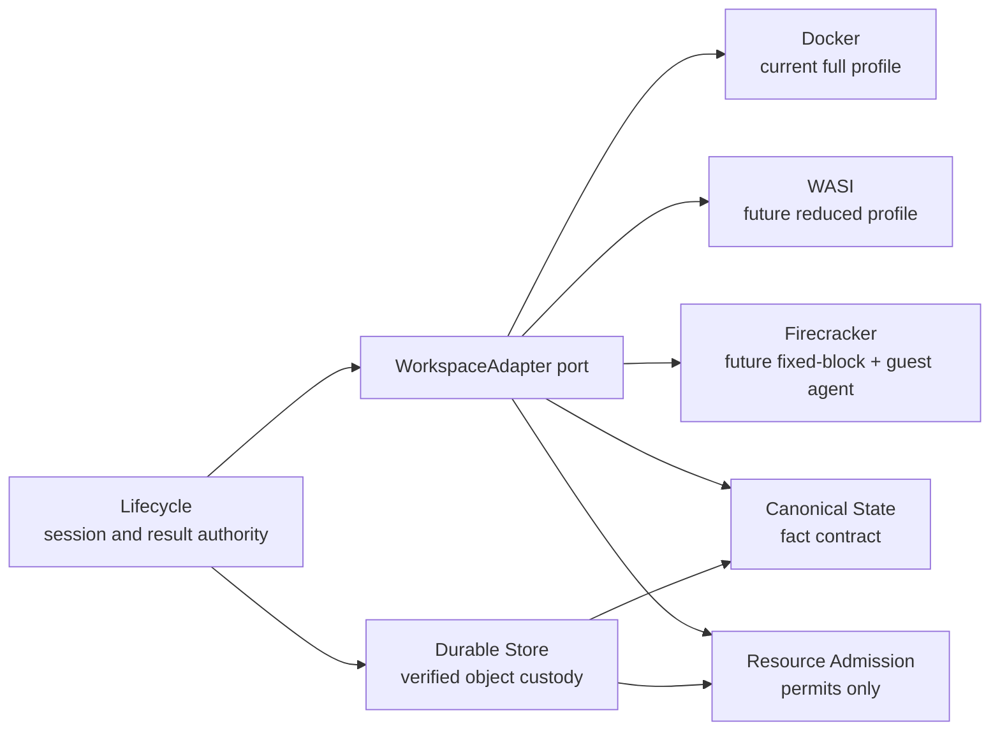

# Backend Adapters

> Status: **Accepted**
> Sole authority: private execution allocations, descriptor-safe realization,
> writer fencing, stable fact capture, adapter capability/quota qualification,
> and physical disposal.

Docker is the current full runtime/fact profile. WASI is a future reduced-fact
preopen profile. Firecracker is a future fixed-block profile with an
authenticated guest agent. All three implement one narrow port and either
preserve every fact they claim or reject before activation/publication.
Adapters never own `StateId`, public heads, session semantics, Catalog
locators, portable archive identity, or S2 commit.

## Boundary



**Conclusion:** component dependencies are one-way and acyclic. Lifecycle
composes Store reads with Adapter requests; the Adapter depends on the
Canonical fact contract and permit admission but has no reverse authority over
Store, Lifecycle or identity.

Backend names and handles stay below the port. No public method takes a
backend selector. Lifecycle chooses only an installed, qualified profile; a
workspace-session ID already identifies its allocation.

## Narrow adapter port

```text
WorkspaceAdapter
  capabilities() -> QualifiedFactProfile
  allocate_hidden(session_id, byte_claim, inode_claim) -> AllocationHandle
  activate(allocation, FilesystemRealizationStream)

  exec / command_stdin / command_lines
  file_read / file_write / file_edit

  freeze(allocation) -> StableHandle
  stability_token(stable) -> BoundedToken
  stream_facts(stable, pass, immutable_cursor) -> CanonicalFactStream
  retain_read_only(allocation)
  dispose_and_sync(allocation, DisposalAuthority)
```

Every handle is opaque, bounded and adapter-local. `activate` idempotently
realizes and verifies the complete private filesystem, synchronizes it, and
only then opens runtime admission. A replay after any crash either completes
those steps or verifies the already complete allocation; it never exposes a
partial realization. `freeze` idempotently closes new command/write admission,
drains admitted commands, writers and mappings, acquires the profile's
exclusive stability primitive and returns one `StableHandle`. `retain_read_only`
turns that frozen allocation into the universally qualified conflict-readable
state without reopening a writer path.

`dispose_and_sync` is idempotent: success means the private allocation is
absent and the destructive parent-directory or equivalent device transition is
durably synchronized. Lifecycle may invoke it only when one of three
already-selected authorities applies and the exact selected Session row
supplies the allocation:

1. `Session/Mutable/OPENING` under its accepted activation-abort owner;
2. `Session/Terminal/PUBLISHED` under the publication-cleanup owner; or
3. `OwnerSlot/AdapterClose` with the exact `session_id`,
   `expected_row_digest`, request identity and `owner_nonce` for explicit
   destruction.

No `ACTIVE` or `CONFLICTED` allocation is disposed without the third authority.
Recovery reconstructs the applicable owner, re-establishes the freeze and
repeats disposal idempotently. Neither `AdapterClose` nor
`DisposalAuthority` carries an `allocation_handle`; after checking
`expected_row_digest` and `owner_nonce`, Lifecycle derives the allocation
argument from the exact selected Session row. An allocation handle retained in
Terminal is inert cleanup metadata, not a canonical or content-reachability
edge. `Session/Terminal` has no result field: status determines `Published`
versus `PublishConflict`, while the authenticated Receipt preserves the exact
response. The adapter never clears an owner or deletes a session row;
Lifecycle performs the corresponding exact conditional commit.

The adapter may not mutate Lifecycle rows, choose a candidate locator, clear an
`OwnerSlot`, advance `HeadRevision`, reinterpret a canonical fact, or report a
best-effort scan as stable.

## Exact canonical fact contract

The selected profile must preserve the closed fact set owned by
[Canonical State](canonical_state.md#canonical-facts):

| Fact | Adapter obligation |
|---|---|
| Raw relative path bytes | Reject absolute paths, empty components, `.`, `..`, NUL, overflow and escape. No locale or Unicode normalization. |
| Entry type | Preserve directory, regular file and symbolic link exactly; reject socket, FIFO and device facts. |
| Metadata | Preserve mode, uid, gid, nanosecond mtime and the profile’s strictly ordered supported xattrs. |
| Regular-file content | Preserve logical length and exact DATA/hole extents; allocated zero DATA is not a hole. |
| Symlink | Preserve raw target bytes but never follow it during capture or realization. |
| Hardlinks | Preserve explicit topology; equal payload does not imply a link. |
| Attribution input | Emit stable filesystem facts only. Lifecycle passes the immutable `Session/Mutable.actor_id` accepted at session creation directly to C3; the adapter never supplies or substitutes ambient caller identity. |

Access time, change time, host inode number, mount ID, block allocation, Docker
layer/snapshotter identity, OCI digest and VM state are noncanonical. Host inode
values may identify a hardlink group during one fenced scan, but never cross a
capture or enter canonical bytes.

The one canonical identity contract remains outside the adapter:

```text
ObjectEnvelope = [versioned_type_tag, payload]
ObjectId = BLAKE3-256(canonical(ObjectEnvelope))
StateId = ObjectId(FilesystemRoot)
```

There is no state wrapper or state-wide attribution wrapper. The format rejects
basenames over 255 bytes, encoded paths over 4,096 bytes, canonical objects with
more than 512 typed children or envelopes over 65,536 bytes, C2 node payloads
over 16,512 bytes, and C2 roots above level 7. The adapter rejects a fact stream
that would exceed any cap; it cannot reinterpret, split or normalize the facts
to make them fit.

## Portable materialization without attribution traversal

Lifecycle composes verified Store reads with one adapter call. Canonical State
builds `FilesystemRealizationStream` from the exact `StateId`; the adapter does
not receive a second history, layer or attribution stream. Canonical State
retains its global validation of every `HardlinkGroup` member set; the adapter
does not weaken or replace that proof.

```text
BUILD_FILESYSTEM_REALIZATION(StateId):
    require StateId = ObjectId(verified FilesystemRoot envelope)
    traverse the C1 directory graph in strict raw-path order
    for each verified entry:
        emit its type and portable metadata
        validate metadata_owner as a scalar field; do not follow it as an edge
        if regular:
            validate the attribution ObjectId's type and width only
            do not fetch ByteAttributionLeaf or ByteAttributionInternal
            traverse C2 and stream each verified DATA or hole extent
        if symlink: emit its raw target without following it
        if hardlinked: emit the exact verified topology

WorkspaceAdapter.activate(allocation, stream):
    create/open a hidden control directory on allocation's same filesystem
    for every emitted fact in stream order:
        realize non-hardlink facts descriptor-relative
        for a hardlinked regular:
            anchor_name = exact name derived from HardlinkGroup ObjectId
            first O_EXCL creator completes the anchor before any link
            linkat the complete anchor descriptor-relative to this occurrence
    verify exact entry, length, extent and global hardlink topology completion
    unlink every anchor and directory-sync the control directory
    synchronize the allocation, then open runtime admission
```

Thus the portable path fetches only `FilesystemRoot`, C1, C2 and referenced
DATA objects. For `B` non-hole bytes and `F` filesystem facts, Store reading,
ordinary-file realization and additional workspace allocation are each
`Theta(B+F)` and independent of attribution-history size or state-history
depth. The pipeline uses fixed permit-owned buffers and cursors; it never
constructs a resident path, object or attribution map.

The ID-addressed hidden anchors are the bounded on-disk hardlink index, so
materialization performs no hardlink external sort and keeps no resident group
map. The control directory, anchors and link targets share one filesystem and
the allocation's byte/inode quota. No occurrence can be linked until its
exclusive anchor is complete. All anchor names disappear and their directory
sync completes before activation can expose the allocation.

The current Docker production baseline is a complete private ordinary-file
realization. Docker OverlayFS and snapshotter materialization acceleration is
explicitly **UNQUALIFIED**: it earns no latency, space, quota, conflict-
retention or correctness claim. Reflink and FUSE realization are prohibited.

## Descriptor-safe realization and traversal

All host traversal is descriptor/capability relative. On Linux, a qualified
implementation uses `openat2` resolution constraints or an equally tested
descriptor walk; string concatenation plus ambient current-directory lookup is
forbidden. Creating a symlink leaf never turns that symlink into a traversal
step.

```text
APPLY_AND_CAPTURE_RELATIVE(root_fd, canonical_paths):
    for path in strict raw-byte order:
        validate every component against canonical caps
        parent_fd = walk from root_fd using no-follow, beneath/in-root rules
        inspect or create only the final leaf relative to parent_fd
        reject mount escape, intermediate symlink, type race or identity swap

        if regular:
            operate through verified leaf FD
            preserve logical length, DATA/hole extents and hardlink claim
        if symlink:
            create/read raw target at parent_fd; never traverse it
        if directory:
            retain only a bounded traversal frame/cursor

    apply directory metadata child-before-parent
    verify exact entry count, containment and stability token
```

Linux `openat2(2)` documents `RESOLVE_BENEATH`/`RESOLVE_IN_ROOT` escape
rejection and `RESOLVE_NO_SYMLINKS`; it is a primitive, not a complete proof of
this workflow ([manual](https://man7.org/linux/man-pages/man2/openat2.2.html)).
Qualification also covers rename races, mount crossing, hardlink substitution,
crashes and every fallback path. In particular, a hardlink-capable profile must
prove same-filesystem control-directory placement, collision-free group-ID
anchor naming, `O_EXCL` winner behavior, `linkat` inode identity and containment,
partial-anchor crash recovery, exact topology validation and durable
unlink-plus-directory-sync cleanup before activation.

## Stable two-pass fact stream

The adapter fence has a linear contract: close new command/write admission,
drain every admitted command, writable descriptor and mapping, then acquire an
exclusive stability primitive. A double-stat loop, watcher or storage-driver
diff is not an equivalent fence.

```text
STREAM_STABLE_FACTS(allocation, requested_pass):
    require runtime gate closed and all admitted writers drained
    stable = acquire profile-specific exclusive fence
    before = stability_token(stable)

    enumerate every entry descriptor-relative in deterministic raw-byte order
    emit complete type, metadata and type-specific facts with bounded cursors
    stream regular DATA from verified FDs; report holes from qualified extent API
    reject unsupported facts, short reads, quota overflow and containment races

    after = stability_token(stable)
    require before == after
    return complete fact stream and unchanged bounded token
```

The same exclusive fence covers both portable source passes. Pass 2 may group
rereads by immutable source interval, but it cannot omit facts or exceed the
`<=2*B_scan` total source-payload-read baseline specified by
[Workspace workflows](workspace_engine.md#portable-two-pass-candidate-preparation).
A capability-qualified lossless journal can accelerate discovery only when it
proves exact interval coverage and overflow behavior; otherwise the adapter
uses the full scan.

## Conflict retention qualification

Conflict retention is an install-time V1 profile gate, never a per-conflict
branch. Before the profile may activate any workspace, its deterministic crash
and readability suite must prove that **every** conflict-retained allocation is
self-contained and remains readable until explicit destruction:

1. every supported `workspace_file_read` path resolves entirely inside the
   retained allocation;
2. no file, metadata, extent, hardlink or directory enumeration requires a
   canonical Store object or origin locator;
3. host reboot and authority restart preserve that readability until explicit
   disposal;
4. permitted runtime-internal overlay/snapshot/block sharing does not make
   origin-object collection invalidate the retained allocation;
5. the read-only fence and containment checks remain effective after recovery.

If any condition is unproved for any supported fact or crash cut, the whole
adapter version/profile is unsupported before activation. There is no runtime
qualification branch and no terminal content edge. After a strict-origin
mismatch, the allocation is terminal, fenced and read-only; its adapter-local
handle is cleanup metadata only. Every Terminal field remains inert for
semantic reachability.

The current Docker production baseline is the complete private ordinary-file
realization and must pass this universal suite for the actual storage
configuration. Its OverlayFS/snapshotter acceleration remains **UNQUALIFIED**
and cannot be used to establish the profile gate. A backend name, filesystem
name or apparent full-copy layout is never qualification evidence.

## Quota truth

Two claims are intentionally distinct:

| Claim | Exact meaning |
|---|---|
| `PortableAccounting` | Adapter reserves a declared envelope, measures use and rejects capture/admission outside it. It does not claim the kernel prevents every transient overrun. |
| `EnforcedQuota` | A capability-qualified unique allocation scope enforces both bytes and inodes, and its tested overflow/recovery behavior cannot charge another workspace or escape the limit. |

An arbitrary shared bind directory cannot claim `EnforcedQuota`. Linux’s quota
subsystem can limit used space and inode counts, but deployment must prove that
the chosen user/group/project scope is unique to one workspace
([kernel quota documentation](https://www.kernel.org/doc/html/latest/filesystems/quota.html)).
A fixed-size Firecracker block image bounds block bytes but does not by itself
prove a guest inode limit; both dimensions remain required for the stronger
claim.

Store retention quotas, adapter workspace quotas and aggregate cgroup memory
limits are separate ledgers. Cgroup v2 `memory.high` throttling and
`memory.max` enforcement are useful outer controls, not evidence of unique
workspace disk/inode enforcement
([kernel cgroup v2 documentation](https://docs.kernel.org/admin-guide/cgroup-v2.html)).

## Adapter capability matrix

| Capability | Docker OCI — current full profile | WASI — future reduced profile | Firecracker — future fixed-block profile |
|---|---|---|---|
| Private workspace | Complete private ordinary-file directory exposed only to one container session | One private preopened capability directory | One disposable fixed-size guest block image |
| Supported facts | Full canonical set: dirs, regulars, symlinks, hardlinks, sparse DATA/hole, exact portable metadata/xattrs | Only the deployment-qualified preopen subset; unsupported uid/gid/xattr/link/sparse semantics reject before activation | Full set only through a qualified filesystem plus authenticated guest agent; otherwise declared subset rejects |
| Execution | Container command with workspace bind and no added administrative capability | Component receives only its session preopens | MicroVM receives only its disposable session device |
| Fence | Close exec admission, stop/drain session processes, revoke writer paths/mappings, hold host allocation fence | Stop component instances and revoke/close mutable descriptors/preopens | Pause/stop guest writers, then complete authenticated guest-agent freeze/flush handshake |
| Capture | Descriptor-relative host scan of the private directory | Capability-relative preopen traversal | Authenticated guest-agent fact stream, or offline qualified filesystem reader after block-device fence |
| Quota claim | `PortableAccounting`; `EnforcedQuota` only with proven unique byte+inode scope | Same | Fixed block byte cap plus separately proven inode cap required for `EnforcedQuota` |
| Conflict readability | Mandatory install gate: every retained conflict remains self-contained and readable through reboot/restart until explicit destruction | **UNQUALIFIED** until the exact preopen profile universally proves the same property | **UNQUALIFIED** until guest/device retention universally proves the same property without origin Store objects |
| Status | Required production profile | Not production-complete | Not production-complete |

WASI exposes filesystem capability descriptors and preopened directories; its
future adapter therefore declares only facts the selected runtime can preserve
([WASI project](https://github.com/WebAssembly/WASI),
[filesystem API](https://wa.dev/wasi%3Afilesystem)). “Reduced” is an explicit
profile, not silent loss.

Firecracker snapshots serialize VM memory/device state while block-device files
are managed separately, so a VM snapshot cannot implement a canonical
checkpoint. The future adapter uses fixed-block storage plus an authenticated
guest protocol; snapshots may only accelerate lifecycle outside correctness
([Firecracker snapshot documentation](https://github.com/firecracker-microvm/firecracker/blob/main/docs/snapshotting/snapshot-support.md?plain=1)).

## Docker and OCI conversion edge

OCI is an import/export interchange at the Docker edge, not the Store format
and not a second public archive selector. Import verifies the OCI manifest and
ordered layer descriptors, applies layer changesets and whiteouts to a complete
temporary fact view, then feeds the one canonical portable archive/state
builder. OCI layer digests, whiteouts and config IDs do not enter `StateId`.
The OCI Image Specification requires layers to be applied in stack order and
defines whiteout deletion semantics
([manifest](https://github.com/opencontainers/image-spec/blob/main/manifest.md),
[layer changesets](https://specs.opencontainers.org/image-spec/layer/)).

Export first reads the one canonical portable archive/state. A Docker adapter
may convert that complete fact set to OCI artifacts, but this conversion is
outside the 18 lifecycle methods and cannot change canonical identity.
Docker’s writable layers, OverlayFS, `overlay2`, containerd snapshotters and
copy-up behavior may optimize execution, but correctness does not inspect or
trust their private layout. Docker itself documents those mechanisms as
storage/snapshotter choices
([storage drivers](https://docs.docker.com/engine/storage/drivers/),
[containerd image store](https://docs.docker.com/engine/storage/containerd/)).

## Runtime method trace

This table closes the eight-method runtime surface without introducing a
generic backend selector.

| # | Public method | Authority path and gate |
|---:|---|---|
| 1 | `exec_command(workspace_session_id, command)` | Lifecycle resolves Mutable/`ACTIVE`; adapter runtime gate admits a bounded command and returns an opaque command handle. |
| 2 | `write_command_stdin(command_session_id, input)` | Adapter validates command ownership/state and writes bounded input; publication fence rejects new input once close begins. |
| 3 | `read_command_lines(command_session_id, cursor?)` | Adapter reads a bounded charged output spool with an opaque monotonic cursor; no unbounded in-memory log. |
| 4 | `file_read(sandbox_id, path)` | Lifecycle captures one complete head under a ReadSlot; Canonical State resolves the path; Store verifies and streams DATA. No workspace is created. |
| 5 | `workspace_file_read(workspace_session_id, path)` | Adapter descriptor-relative read from ACTIVE or retained CONFLICTED allocation. Every installed V1 profile has already proved universal self-contained conflict readability; no origin Store object is consulted. |
| 6 | `workspace_file_write(workspace_session_id, path, content)` | Mutable/`ACTIVE` plus open writer gate; adapter streams to a safe leaf under quota and containment checks. |
| 7 | `workspace_file_edit(workspace_session_id, path, edits)` | Mutable/`ACTIVE` plus open writer gate; adapter validates bounded edits against one opened leaf and applies them atomically or fails. |
| 8 | `file_blame(sandbox_id, path)` | Lifecycle captures the head; Canonical State resolves and verifies attribution tiling; Store streams required immutable objects. |

CONFLICTED allocations accept only metadata inspection, bounded
`workspace_file_read`, and destruction. PUBLISHED terminal rows accept no
runtime operation. The public signatures and typed errors are owned by
[API methods](../api_methods.md).

## Qualification suite

An adapter version/profile is installable only after a deterministic corpus and
fault suite proves:

- canonical activate → freeze → capture round trips reproduce the exact same
  `StateId` for every claimed path, metadata, hardlink, sparse and attribution
  fixture;
- every unclaimed fact fails before activation or publication;
- descriptor escape, symlink swap, mount crossing and hardlink attacks fail;
- hardlink realization preserves the globally validated member sets through
  same-filesystem ID-named `O_EXCL` anchors and `linkat`, uses no hardlink
  external sort, and never activates before anchor unlink plus directory sync;
- fence races, command cancellation and writable mappings cannot mutate a
  captured pass;
- byte **and** inode quota overflows have the advertised behavior;
- crash at every activation, conflict-retention, publish-cleanup and destroy
  boundary recovers idempotently with no detached work;
- disposal succeeds under exact selected `OPENING`, `PUBLISHED` and
  `AdapterClose` authorities and rejects every stale
  `expected_row_digest`/`owner_nonce`, wrong row-derived allocation or
  mismatched authority without effect;
- every conflict-retained allocation remains self-contained and readable across
  reboot, authority restart and exact origin collection until explicit
  destruction;
- idle allocations retain zero service workers, permits, buffers and FDs.

Failure rejects that adapter version/profile. A feature checklist or backend
brand is not qualification evidence.

## Error contract

Adapters return bounded typed failures such as:

```text
AdapterCapabilityMismatch
UnsupportedFilesystemFact
PathEscapeDetected
WorkspaceNotStable
WorkspaceSessionBusy
QuotaEnforcementUnavailable
QuotaExceeded(bytes | inodes)
DisposalAuthorityMismatch
WorkspaceActivationFailed
WorkspaceCaptureFailed
WorkspaceDisposalFailed
```

No failure approximates facts, silently drops metadata, reopens a conflicted
writer gate, clears a Lifecycle root, or acknowledges destruction before its
physical sync.

## Resource behavior

Adapters consume the shared Resource Admission profile and retain no private
pool. Materialization and capture declare workers, queue descriptors, buffers,
FDs, source/run bytes and inode envelope before work; rejection is bounded and
pre-effect. A permit owns only the live reservation, and cancellation drains or
joins all work, closes descriptors and releases every permit synchronously.

The memory/concurrency contract is explicit:

- **Analytical bound:** all storage-managed live memory is globally at most
  `8 MiB`; one sandbox's concurrent managed claims are at most `4 MiB`, and one
  heavy operation is at most `2 MiB`.
- **Target:** normal storage-managed live memory is at most `4 MiB`.
- The mandatory outer storage cgroup uses `memory.high = 64 MiB`,
  `memory.max = 100,663,296 B` (exactly `96 MiB`), zero swap and zero persistent
  application cache. Thread stacks, allocator arenas, helper processes, page
  cache, dentries and inode slab must all fit that outer bound; they cannot be
  relabelled as free memory.
- The fixed global admission profile has four workers, queue depth 16 with no
  queued payload, 128 storage-owned FDs, 16 OwnerSlots (slot 0 maintenance-only;
  slots 1..15 foreground `Build`/`AdapterClose`) and 64 ReadSlots. A rejected
  OwnerSlot selection owns zero waiter resources. No adapter creates a
  per-session worker, thread, cache, FD reserve or buffer pool.
- Multiple sessions may coexist because their durable rows and private
  workspace bytes live on disk. An idle session owns zero service workers,
  buffers, FDs, ReadSlots or volatile permits. Active work proceeds only after
  the complete shared claim is available, so multiplying session count cannot
  multiply resident adapter state.
- One portable workspace consumes `Theta(B+F)` separately quota-enforced disk
  allocation, not service RAM. Stream windows, hash/codec scratch and bounded
  descriptor frames are the only managed-memory costs; no resident per-path,
  per-file, per-object, attribution or session map is permitted.

Helper processes and untrusted sandbox workloads use separately bounded
runtime cgroups; their memory is neither borrowed from nor hidden inside the
storage-managed 8 MiB permit ledger. The exact partitions and overload behavior
are owned by [System requirements](../system_requirements.md#resource-profile).

This design never uses reflinks or FUSE, including as optional fast paths.
The current Docker ordinary-file path is the selected production baseline.
OverlayFS and Docker snapshotter materialization acceleration is explicitly
**UNQUALIFIED**; filesystem or VM snapshots likewise earn no production claim.
Such mechanisms may exist only inside a separately qualified adapter/runtime
as execution accelerators. They cannot implement Store/workspace sharing,
define identity, supply retention or quota proof, or participate in
publication/recovery correctness. Every future qualified profile must keep a
complete portable path sufficient for correctness and prove that disabling its
accelerator leaves all canonical facts and lifecycle results unchanged.
