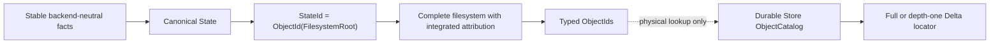

# Canonical State

> Status: **Accepted**
> Sole authority: backend-neutral facts, canonical object bytes and identity,
> complete `ContentTree` meaning, payload chunking and exact attribution.

Canonical State is a pure deterministic library. The same supported facts and
attribution produce the same complete object graph and `StateId`, independent
of discovery order, backend, physical packing or lifecycle history.

## Boundary

| Input | Output | Never owned here |
|---|---|---|
| Validated stable filesystem fact stream, exact origin state when attributing, publishing `ActorId` | Verified typed object stream, complete `FilesystemRoot`, `StateId`, decoded fact stream | Paths opened on a host, locators, packs, Catalog pages, sessions, heads, receipts, workspace handles |



**Conclusion:** canonical identity ends at typed object IDs; physical location
and S3 encoding begin below `ObjectCatalog` and cannot change `StateId`.

## Canonical facts

| Fact | Canonical meaning |
|---|---|
| Path | Relative sequence of raw non-empty name bytes; no empty component, `.`, `..`, NUL or absolute root |
| Entry | Directory, regular file or symbolic link; hardlink topology is explicit |
| Metadata | Mode, uid, gid, nanosecond mtime and a strictly ordered supported-xattr sequence |
| Regular file | Logical length plus one ordered `ContentTree-v1` sequence of coalesced holes and DATA chunks |
| Sparse state | `HOLE{len}` differs from allocated DATA containing zero bytes |
| Symlink | Raw target bytes; never followed during capture or materialization |
| Hardlink group | Sorted canonical paths sharing one regular-file object; equal payload alone is not a hardlink |
| Attribution | Exact coalesced owner tiling of every surviving file byte plus metadata owner |

Sockets, FIFOs, devices, unsupported xattrs, numeric overflow, overlong
names/paths, incomplete facts and adapter-unrepresentable metadata fail before
publication. Access time, change time, host inode, mount, block allocation,
OCI layer, VM snapshot, adapter name and capture time are noncanonical.

Format caps include basename bytes `<=255`, total encoded path bytes
`<=4096`, the C1/C2/byte-attribution limits below, and global
`R_child_max=512` typed outgoing canonical-object references and
`R_canonical_max=65,536 B` for the complete encoded envelope of every object
kind. Encode or decode above either cap fails `CanonicalLimitExceeded`; this
also bounds aggregate metadata/xattrs in one `EntryValue`. Every canonical
record is therefore far smaller than a 64-MiB PackSegment payload. Raising an
identity-affecting cap or changing a boundary profile requires a new format
version.

## State and object model

The restricted envelope is a fixed typed array encoded with the deterministic
rules of [RFC 8949 §4.2](https://www.rfc-editor.org/rfc/rfc8949#section-4.2)
through low-level `minicbor` primitives. One unsigned tag binds kind and format
version; they are not separately encoded because no consumer can accept one
without the other:

```text
ObjectEnvelope = [
  versioned_type_tag,  # fixed unsigned enum for exactly one {kind, version}
  payload              # kind-specific definite-length fixed-order array
]
ObjectId = BLAKE3-256(canonical(ObjectEnvelope))

StateId = ObjectId(FilesystemRoot)
```

There is no `StateRoot` or state-manifest wrapper and no separate state-wide
attribution root or parallel attribution path tree. The verified
`FilesystemRoot` is the state object, and each regular ownership unit carries
its own bounded byte-attribution root.

The profile permits only definite-length fixed-order arrays, byte strings and
shortest-form unsigned integers. It forbids maps, floats, CBOR tags,
indefinite lengths, duplicate/optional schema choices and derive-selected
field order. The outer array must contain exactly two fields. Its
definite-length payload and canonical end-of-input check make a separate byte
length redundant. The decoder verifies the one expected versioned type tag,
exact schema, canonical re-encoding and BLAKE3-256 before yielding a value. A
kind or format change allocates a new tag. BLAKE3 is the adopted official
streaming algorithm and vectors, not a project hash design
([specification](https://github.com/BLAKE3-team/BLAKE3-specs),
[implementation/vectors](https://github.com/BLAKE3-team/BLAKE3)).

The canonical object vocabulary is closed:

| Object kind | Essential contents |
|---|---|
| `FilesystemRoot` | Exactly the root C1 directory ID |
| `DirectoryNode` / `EntryValue` | C1 compressed prefix, ordered edges, type, metadata, per-path `metadata_owner` and typed child |
| `RegularFile` | One non-hardlinked file's typed C2 root and typed `ByteAttributionRoot` ID |
| `ContentLeaf` / `ContentInternal` | C2 ordered leaf or internal entries |
| `DataChunk` | Canonical DATA bytes |
| `HardlinkGroup` | Domain-separated digest of its complete sorted member-path set, one shared typed C2 root and one shared typed `ByteAttributionRoot` ID |
| `ByteAttributionLeaf` / `ByteAttributionInternal` | Bounded C2-profile Merkle sequence of positive coalesced `{len, ActorId}` spans; no path, metadata owner, content or history field |

`ByteAttributionRoot` is the typed ID of the top attribution leaf or internal
node, not another wrapper object. Its verified span sum is the attributed
logical length.

The closed codecs conform without adding another mechanism: `FilesystemRoot`
has one typed child; `RegularFile` and `HardlinkGroup` exactly two;
`EntryValue` at most one; `DirectoryNode` at most one per byte edge plus its
distinct terminal (`<=257`); C2 and byte-attribution internal nodes at most
512; and `DataChunk` plus `ByteAttributionLeaf` have no outgoing
canonical-object reference. Actor/owner IDs, membership digests, paths and
interval scalars are data, not graph edges.

`RegularFile` and `HardlinkGroup` are topology-exclusive containers. A
non-hardlinked regular entry references one `RegularFile`; that object names
exactly one C2 root and exactly one `ByteAttributionRoot`. A hardlink alias
instead references its one `HardlinkGroup`; the group names exactly one shared
C2 root and exactly one shared attribution root. It does not also reference or
embed a `RegularFile`. Neither container stores a duplicate logical length:
the length is the checked C2 span sum and must equal the checked attribution
span sum. Thus aliases share byte attribution once while each alias's
`EntryValue` retains its own `metadata_owner`.

There is no side membership index and no stored member-path list. During
canonical build, the complete strictly sorted member set is bound into the
group record as:

```text
member_set_digest = BLAKE3-256(
  "EPS-HARDLINK-v1/members\0" ||
  u64be(member_count) ||
  concat(u32be(len(canonical(path))) || canonical(path)))
```

The count is inside the digest input and is not stored again. Independent
groups with equal bytes remain distinct because their member sets differ;
equal standalone `RegularFile` objects may safely share an `ObjectId` because
their `EntryValue` kind still instructs materialization to create independent
files. Payload equality never implies a hardlink.

### Closed `FilesystemRoot` decode and integrated attribution

Decoding a state is one fail-closed filesystem traversal:

1. Verify the expected `FilesystemRoot` versioned type tag, exact two-field
   envelope and payload schema, canonical re-encoding and `StateId` digest.
2. Recursively verify every typed child, object digest, count, span and format
   cap. Every `EntryValue` must contain exactly one canonical `metadata_owner`;
   metadata-only entries have no byte-attribution reference.
3. For a `RegularFile`, verify its C2 sequence and bounded
   `ByteAttributionRoot` independently, require equal checked logical-span
   sums, and require the attribution leaves to form positive, ordered,
   gap-free, non-overlapping, globally maximally coalesced owner spans. The
   canonical empty file has the canonical empty C2 and attribution roots.
4. While traversing C1, emit one exact bounded scratch record
   `(HardlinkGroup ObjectId, canonical path)` for every hardlink alias, then
   externally sort by `(group_id, path)`. Each group run must contain at least
   two distinct strictly increasing paths. Resolve the typed group object once,
   recompute `member_set_digest` from the run's checked count and length-framed
   paths, and require exact equality. Verify its one C2 root and one attribution
   root once using the same equal-span and tiling rules; no alias carries or
   duplicates either root.
5. Reject a missing group object or group run, an extra group supplied to a
   canonical build but unreferenced by C1, a duplicate alias, a one-member
   group, a membership-digest/topology mismatch, unequal C2/attribution span
   sums, a noncanonical owner span, or any trailing/optional schema field.
   Multiple entries may reference the same `RegularFile` ObjectId: canonical
   deduplication does not turn those independently materialized paths into
   hardlinks.

Only that verified traversal may expose decoded facts. No object contains a
physical locator, parent StateId or history edge. For a hardlink group with
`H` aliases and `S` byte-owner spans, canonical attribution storage is
`Theta(H+S)`: `H` per-path entries plus one shared bounded `S`-span sequence.
A per-alias sequence would be forbidden `Theta(H*S)`. Removing the parallel
path tree also removes its construction, lookup, decode and equality-join
costs. Membership verification uses `O(sort(H))` job-scoped scratch with fixed
admitted fan-in buffers; every success, rejection and cancellation closes and
removes that invocation's scratch before releasing its permit, so concurrent
workspace sessions share no mutable verifier state.

Selection admits only a state that has passed this complete hardlink-membership
validation. Materialization therefore does not repeat the global alias sort or
membership-digest proof. It streams canonical paths once and uses one
descriptor-relative, same-filesystem hidden anchor named from the
`HardlinkGroup` ObjectId; `O_EXCL` creation identifies the first occurrence,
and every occurrence links from that complete anchor. The allocation owns and
destroys the hidden controls, so this adds neither retained schema nor a
materialization scratch index.

Every published `StateId` is complete:

```text
StateId -> FilesystemRoot -> complete filesystem with integrated attribution
```

No object requires a parent state, edit log or delta application to obtain its
meaning. Unchanged objects are shared by `ObjectId`.

## Global invariants

1. A supported value has one byte representation; alternate encodings fail.
2. All references are typed, exist, verify and satisfy local count/span bounds;
   no canonical object exceeds `R_child_max=512` outgoing typed references.
3. Directory identity is independent of discovery and insertion order.
4. Each regular file has one complete C2 sequence exactly spanning its logical
   length; adjacent holes are coalesced.
5. Hardlink topology is explicit and independent of payload equality.
6. Every `EntryValue` carries its metadata owner; each regular-file ownership
   unit names one bounded exact byte-attribution root whose spans are ordered,
   adjacent, gap-free and cover every surviving byte exactly once.
7. `StateId` contains no sandbox, lifecycle, backend or physical-location
   fact.
8. Construction is pure; visibility occurs only through the Store’s S2 commit.

## Adopted payload chunking

Payload chunking is a restricted wrapper, not a custom mechanism. Each maximal
non-hole extent resets pinned `fastcdc` crate 4.0.1 `v2020`, normalization
2, seed/tables 0/original, with min/target/max `8/16/32 KiB`. Cuts emit
canonical `DataChunk` objects and `DATA{len, ChunkId}` entries; holes emit
no zero payload. Scalar and accelerated implementations must match golden
boundaries byte-for-byte.

FastCDC’s adopted algorithm and normalization come from the
[FastCDC paper](https://www.usenix.org/conference/atc20/presentation/xia) and
the pinned [fastcdc-rs implementation](https://github.com/nlfiedler/fastcdc-rs).
C2 below applies the same primitive to descriptor frames under a different
profile; payload bytes and descriptor frames must never be conflated.

## C1 — canonical compressed Patricia/Merkle directory

| Field | Definition |
|---|---|
| Purpose | Give one deterministic identity and bounded path lookup for relative raw-name directory entries. |
| Optimization target | `ALG`: avoid rank-shift page rewrites while keeping lookup bounded by path bytes. |
| Inputs and outputs | Strictly sorted unique `(basename bytes, EntryValue ObjectId)` stream → one `DirectoryNode ObjectId`. |
| Preconditions | Names and values already validate; name `1..255 B`; sorted stream; complete resource permit. |
| Invariants | Longest-common-prefix compression and byte-ordered edges are unique; terminal is distinct from every byte; each child is typed and verified. |
| Commit point | None; root identity is pure. S2 later selects a state containing it. |
| Failure behavior | Duplicate/unsorted names, invalid compression, missing child or cap overflow fail closed before candidate publication; replay is byte-identical. |
| Complexity | Build `Theta(D)` for directory key bytes; lookup/update path `O(K)` verified nodes for encoded path bytes `K`; capped path-update bytes `O(KP)`. |
| Resources | One format-capped path/builder stack, one node page, bounded FDs when the sorted input is disk-backed; no repository-sized map. |
| Implementation | Minimal custom C1, borrowing Morrison’s Patricia compression ([original paper](https://dl.acm.org/doi/10.1145/321479.321481)); generic tries cannot define this canonical byte shape. |

```text
build_directory(sorted_entries):
  require strictly increasing unique raw basenames
  stack = bounded compressed-prefix stack
  for (name, value_id) in sorted_entries:
    key = length_delimited(name) || TERMINAL
    close prefixes no longer shared with prior key, emitting children bottom-up
    open the canonical longest-common-prefix path
    append the next ordered byte edge or TERMINAL value
  close all nodes bottom-up
  return verified root ObjectId
```

An early lexical insertion changes its Patricia path, not every later
rank-based page. C1 cannot be replaced by S1: C1 defines portable logical
identity over meaningful names, whereas S1 indexes opaque physical keys.

## C2 — ContentTree-v1 bounded content-defined Merkle sequence

| Field | Definition |
|---|---|
| Purpose | Canonically represent one regular file as one ordered sparse/DATA sequence whose metadata pages usually resynchronize after local edits. |
| Optimization target | `ALG`: expected local page rewriting without hiding the deterministic adversarial worst case. |
| Inputs and outputs | Ordered coalesced `HOLE{len}` / `DATA{len,ChunkId}` leaf entries → one complete typed C2 root with verified counts/spans. |
| Preconditions | Entries exactly tile the file length; DATA chunks verify; encoded entry `<=64 B`; C2 permit and fixed builder buffers are available. |
| Invariants | Cuts occur only between whole framed entries; child count/span sums verify; one sequence per file; empty and single-child roots have unique forms. |
| Commit point | None; emitted node IDs are pure. |
| Failure behavior | Invalid tiling, profile mismatch, count/payload/height overflow, corrupt child or noncanonical root returns `CanonicalLimitExceeded` or integrity failure before publication. |
| Complexity | Full build `Theta(n)` entry bytes; expected local edit changes `O(log n)` pages after resynchronization; deterministic adversarial worst case `Theta(n)`. |
| Resources | At most eight open `16,512 B` nodes = `132,096 B`; plus one 32 KiB payload chunk and one C2 scratch page = `181,376 B`. These named payload buffers fit one 256-KiB slab; production qualification must prove all remaining chunker, hash, codec, control, alignment, error and bookkeeping state inside the remaining 80,768 B with no post-admission allocation. |
| Implementation | Minimal custom C2 around adopted FastCDC boundaries. POS-Tree supplies the sequence/counter/boundary evidence; no library defines this canonical format. |

### Frozen C2 format profile

| Item | Proposed-format constant |
|---|---|
| Leaf entry | `DATA{len, ChunkId}` or coalesced `HOLE{len}` |
| Internal entry | `{child_id, leaf_entry_count, logical_span}` |
| Boundary frame | `u16be(entry_len) || canonical_entry` |
| Boundary primitive | `fastcdc` 4.0.1 `v2020`; normalization 2; seed/tables 0/original |
| Min / target / max boundary input | `4,096 / 8,192 / 16,384 B` |
| Level prefix | Leaf: `EPS-C2-v1/leaf\0`; internal: `EPS-C2-v1/internal\0 || u8(level)` |
| Encoded entry / entries per node | `<=64 B / <=512` |
| Canonical node payload | `<=16,512 B` |
| Root level | `<=7`, eight total levels |

The prefix is unstored but participates in boundary hash and size. Each node
reset feeds it before entry frames. If FastCDC selects a cut inside a frame,
the node extends through that whole frame; no byte is discarded, and the
chunker resets before the next frame. EOF emits the remainder.

```text
build_level(level, entry_stream):
  chunker.reset(prefix(level))
  node = empty bounded builder
  for entry in entry_stream:
    frame = u16be(length(canonical(entry))) || canonical(entry)
    require entry and count caps
    feed frame to chunker
    append the whole frame to node
    if selected cut lies in or before this completed frame:
      emit verified node and its {child_id, leaf_entry_count, logical_span}
      reset chunker with prefix(level); reset node
  emit nonempty EOF remainder

build_content_tree(leaf_entries):
  if no entries: return the one canonical empty level-0 node
  entries = leaf_entries
  for level in 0..7:
    nodes = build_level(level, entries)
    if exactly one node:
      return collapse_single_child_root_canonically(nodes[0])
    entries = internal descriptors for nodes
  fail CanonicalLimitExceeded
```

The maximum cut may be extended by one `<=64 B` entry plus its length frame,
which is why canonical node payload is `16,512 B` rather than `16,384 B`.
All internal sums are checked against the regular-file logical length.

Golden vectors are mandatory for feed-size independence, EOF,
cut-inside-frame, repeated entries, forced maximum/count, holes, level
changes, empty/single-child forms and scalar/accelerated parity. The profile
is a conservative **Proposed-format baseline**, not an empirical optimum.
Changing any value creates a new format version.

The expected-local claim is supported, not proven worst-case, by ForkBase’s
[POS-Tree §§3.2.2–3.2.6](https://www.vldb.org/pvldb/vol11/p1137-wang.pdf)
and [Content-Defined Merkle Trees](https://arxiv.org/abs/2104.02158). Admission
and qualification must still reserve and test the honest `Theta(n)`
boundary-grounding case.

### Bounded byte-attribution sequence

Byte attribution reuses the C2 span-sum builder and frozen node profile; it is
not a seventh custom mechanism. Its leaf entry is `{len:u64, ActorId}` with
`len>0`, and its internal descriptor is the C2 descriptor with checked entry
count and logical-span sum. The boundary framing, min/target/max input,
`<=64 B` encoded-entry cap, `<=512` entries per node, `<=16,512 B` canonical
node payload, single-child collapse and root-level cap are exactly C2's.
Domain-separated prefixes are `EPS-C3-v1/owners-leaf\0` and
`EPS-C3-v1/owners-internal\0 || u8(level)` so content and attribution nodes
cannot share a type or ID.

The canonical encoder rejects equal owners in adjacent input spans before and
across leaf boundaries; it then invokes the same `build_level` routine with
the attribution entry codec and prefixes. The canonical empty root is one
empty `ByteAttributionLeaf`. A decoder checks every node locally, every
internal count/span sum, the root-level bound and global cross-leaf
coalescing. Consequently no attribution object approaches the Store's 64-MiB
pack-segment limit, while every format-capped admitted sequence remains
streamable as bounded nodes.

## C3 — deterministic C2-run attribution tiling

C3 defines attribution at canonical C2-run granularity; it does not infer edit
intent or compute a byte diff. Occurrence-ranked identical whole DATA or HOLE
runs inherit the prior owners covering those bytes. Every unmatched or
modified candidate run is wholly owned by the publisher. “Exact” means the
result is the one complete, gap-free current-byte tiling required by this
rule—not that C3 recovers which individual source bytes a tool changed.

| Field | Definition |
|---|---|
| Purpose | Produce the canonical coalesced whole-C2-run byte attribution for one standalone file or hardlink group without retaining an edit history. |
| Optimization target | `ARCH`: keep deterministic current ownership inside complete immutable state and remove provenance logs. |
| Inputs and outputs | Optional verified origin representative C2/`ByteAttributionRoot`, candidate C2, publishing `ActorId` → one canonical `ByteAttributionRoot`. |
| Preconditions | Both C2 roots and the origin attribution root, when present, verify; disk-backed sort/merge, fragment and output caps are admitted. |
| Invariants | Identical whole candidate runs pair by deterministic occurrence rank; unmatched or modified runs are wholly publisher-owned; every current byte has exactly one owner; adjacent equal owners coalesce. Metadata ownership is independent and never enters C3. |
| Commit point | None; the C2 and attribution roots become visible through their containing `RegularFile` or `HardlinkGroup` only when its `FilesystemRoot` is selected by S2. |
| Failure behavior | A missing/corrupt selected origin root, invalid run/span, malformed checked scratch generation, cap/offset overflow or incomplete tiling fails closed; deterministic replay returns identical bytes. |
| Complexity | `O(sort(c_old+c_new)+sort(c_match)+sort(c_frag))` external I/O/time, where every generated/output count is checked `<=N_C3_record_max=2,097,152`, `c_match<=min(c_old,c_new)` and `c_frag<=c_match+s_old`; sequential joins/output are `Theta(c_old+c_new+c_match+c_frag+s_old+c_out)`. |
| Resources | Exact manually encoded 50-B occurrence, 16-B match and 48-B owner-fragment records in three sequential fan-in-8 sorts; three reused scratch inodes; fixed run/merge memory and bounded C2/attribution cursors; no resident file/history map. |
| Implementation | Minimal custom C3 over the already canonical C2 run stream; it introduces no byte-diff, edit-log or rolling-repair mechanism. |

```text
ContentKey = typed C2 root ObjectId

OccurrenceV1 = exactly 50 bytes, manually encoded with no padding:
  kind:u8, len:u64be, chunk_id[32], side:u8, start:u64be
  # DATA: kind=DATA, chunk_id=typed DataChunk ObjectId digest
  # HOLE: kind=HOLE, chunk_id=32 zero bytes

MatchV1 = exactly 16 bytes, manually encoded with no padding:
  origin_start:u64be, candidate_start:u64be

OwnerFragmentV1 = exactly 48 bytes, manually encoded with no padding:
  candidate_start:u64be, len:u64be, actor_id[32]

metadata_owner_for_entry(origin_entry_or_none, candidate_entry, actor):
  if origin entry exists at the same canonical path and
     its canonical metadata equals candidate metadata:
    return origin_entry.metadata_owner
  return actor

choose_origin_representative(
    origin_state, sorted_candidate_paths, candidate_content_key):
  fallback = NONE
  for path in sorted_candidate_paths:
    if origin path resolves to a regular-file ownership unit:
      verify its C2 root and ByteAttributionRoot; fail if invalid
      require their checked logical-span sums are equal
      unit = {ContentKey, C2 root, ByteAttributionRoot}
      if fallback is NONE:
        fallback = unit
      if unit.ContentKey == candidate_content_key:
        return unit
  return fallback

attribute_bytes(origin_or_none, candidate, actor):
  verify candidate.C2 and derive candidate_len and c_new from its checked sums
  if origin_or_none is NONE:
    return empty attribution root if candidate_len == 0
      else build one actor span of length candidate_len

  origin = origin_or_none
  if candidate.ContentKey == origin.ContentKey:
    return origin.ByteAttributionRoot

  verify origin C2 and attribution roots have equal checked span sums
  derive c_old and origin_owner_span_count from their checked sums
  reject a zero-length run, duplicate start or non-increasing run boundary
  require checked_add(c_old, c_new) <= N_C3_record_max
  emit origin and candidate runs into one OccurrenceV1 stream
  occurrences = external_sort(
      by (kind, len, chunk_id, side, start))

  for each record after the occurrence sort:
    require kind is DATA or HOLE, len > 0, and side is ORIGIN or CANDIDATE
    require HOLE has the all-zero chunk_id and DATA has a typed chunk digest
    reject a duplicate (kind, len, chunk_id, side, start)

  for each (kind, len, chunk_id) identity group:
    identify its origin and candidate subranges in the checked generation
    pair the two subranges with bounded pread cursors
    advance each occurrence cursor exactly once; never reuse an occurrence
    emit MatchV1(origin_start, candidate_start) for each rank pair
    ignore excess occurrences on either side

  matches = external_sort(
      emitted MatchV1 by origin_start)

  c_frag_bound = checked_add(c_match, origin_owner_span_count)
  require c_frag_bound <= N_C3_record_max before fragment allocation
  scan matches, origin C2 and origin attribution in origin-start order:
    require origin_start values strictly increase
    require each origin_start names the next selected exact C2 run boundary
    for each positive owner-span intersection with that origin run:
      candidate_fragment_start = checked_add(
          candidate_start, intersection.start - origin_start)
      emit OwnerFragmentV1(candidate_fragment_start,
                           intersection.len, intersection.actor_id)
      increment c_frag with checked arithmetic
      require c_frag <= N_C3_record_max
  require c_frag <= checked_add(c_match, origin_owner_span_count)

  fragments = external_sort(
      emitted OwnerFragmentV1 by candidate_start)

  c_unmatched = checked_sub(c_new, c_match)
  c_out_bound = checked_add(c_frag, c_unmatched)
  require c_out_bound <= N_C3_record_max before output allocation

  candidate_cursor = 0; fragment_cursor = 0
  for candidate run in verified C2 logical order:
    require run.start == candidate_cursor and run.len > 0
    run_end = checked_add(run.start, run.len)
    require next fragment is absent or starts >= run.start
    if next fragment starts at run.start:
      while fragment_cursor < run_end:
        require next fragment starts exactly at fragment_cursor
        require fragment.len > 0 and checked end <= run_end
        append {fragment.len, fragment.actor_id} to coalescing
          byte-attribution span builder
        fragment_cursor = checked end; consume fragment
      require fragment_cursor == run_end
    else:
      require next fragment is absent or starts >= run_end
      append {run.len, actor} to the same coalescing builder
      fragment_cursor = run_end
    candidate_cursor = run_end
  require candidate_cursor == candidate_len and fragments exhausted
  finish canonical bounded ByteAttributionRoot
  require its checked span sum equals candidate C2's checked span sum
  return ByteAttributionRoot
```

For a standalone candidate file, `sorted_candidate_paths` is its one path. For
a candidate hardlink group, it is the group's complete canonical sorted alias
list. The representative is the first lexicographic surviving origin ownership
unit whose `ContentKey` equals the candidate `ContentKey`; only when no such
unit exists is it the first lexicographic surviving origin unit of any content.
Paths absent or non-regular in the origin are skipped. C3 runs exactly once for
the candidate group and its resulting attribution root is referenced once by
`HardlinkGroup`. It never combines attribution from multiple origin groups. If
no candidate path survives from the origin, the complete candidate byte range
belongs to the publisher even when equal content exists elsewhere.

Metadata ownership is computed independently for every candidate
`EntryValue`. Content equality can therefore reuse a byte-attribution root
while a changed metadata fact becomes actor-owned. Conversely, topology can
change while an unchanged surviving path retains its prior metadata owner.

The topology vectors are closed:

- **link:** one surviving path supplies the representative, C3 emits one group
  attribution root, and the new alias receives its own path metadata owner;
- **unlink:** the first remaining path supplies the representative and the
  removed alias contributes no fact;
- **merge:** the first surviving path whose origin `ContentKey` equals the
  candidate wins; if none equals it, the first surviving path wins. Exactly
  one origin unit supplies attribution; other origin groups are not blended;
- **split:** each resulting standalone file or hardlink group independently
  chooses its representative and runs C3 once, so multiple results may reuse
  the same immutable origin attribution root by `ObjectId` without duplicating
  its nodes.

The merge-order vector fixes the content preference: candidate aliases
`a,b,c` have candidate `ContentKey=Y`; origin `a` resolves to content `X` and
origin `b` to content `Y`. The representative is `b`, despite `a` sorting
first. If neither surviving origin unit has `ContentKey=Y`, `a` is the
representative. Reordering discovery cannot change either result.

`OccurrenceV1`, `MatchV1` and `OwnerFragmentV1` are scratch wire records, not
native-language structs: implementations append and parse their fields
explicitly and reject short, trailing or mis-sized records. Every immutable
sort generation is sealed with exact record size, checked record count and
checksum in the reused control file and is verified before the next pass. The
50-byte occurrence carries the complete run identity directly, so C3 has no
matching hash, collision case or identity-indexed random C2 re-read. The two
starts are sufficient after rank pairing: the origin-order join re-derives
the run length once from the sequential authoritative origin C2 cursor, and
the candidate-order merge proves that its translated fragments exactly tile
one whole candidate C2 run.

The source C2 tiling and the final attribution tiling are both mandatory. A
zero-length file is valid only with canonical empty C2 and attribution roots
and empty occurrence, match and fragment streams; zero-length run or fragment
records are never valid. For a nonempty file, the first candidate run starts
at zero, every checked addition equals the next start, the final end equals the
C2 root's checked logical-span sum, every inherited fragment set tiles exactly
one whole candidate run, the fragment stream is exhausted, and output owner
spans are positive, gap-free, non-overlapping and globally maximally
coalesced.

A one-byte content edit changes its `DataChunk` identity and can therefore
reattribute that entire canonical DATA run to the publisher. If FastCDC
boundaries shift, adjacent runs that no longer match whole typed run identities
can also become publisher-owned. This is deliberate, deterministic C2-run
semantics and bounds the mechanism honestly; C3 makes no byte-precision or
edit-intent claim.

For a 1-MiB initial-run budget, allocation function `A`, and a 64-byte run
header per logical run:

```text
q(r) = floor(1 MiB / r)
m(r,n) = ceil(n / q(r))
G(r,n) = A(r*n + 64*m(r,n))

D_C3 = 2 * max(
    G(50, c_old+c_new),
    G(16, c_match),
    G(48, c_frag))
    + A(4096)
I_C3 = 3
q(50) = 20,971
q(16) = 65,536
q(48) = 21,845

N_C3_record_max = 2,097,152
c_old+c_new <= N_C3_record_max
c_match <= min(c_old, c_new) <= N_C3_record_max
c_frag <= checked_add(c_match, s_old) <= N_C3_record_max
c_out <= checked_add(c_frag, checked_sub(c_new, c_match))
      <= N_C3_record_max
```

The two generation containers and one checked control file are reused across
all three sorts, so the disk bound is a maximum, not a sum. The single frozen
`N_C3_record_max=2^21` cap is the smallest power of two that admits the
required million-run origin plus million-run candidate adversary. It bounds
every generation/output stream and replaces independently configured caps.
Before any generation allocation, checked `c_old+c_new` must fit the cap and
its complete reservation. `s_old` is the verified origin owner-span count.
Before fragment allocation, checked `c_match+s_old` must fit that same cap;
the actual fragment counter is checked again on every emission. The bound
follows because intersections between `c_match` disjoint matched runs and
`s_old` disjoint owner spans are at most their checked sum. The second sort is
mandatory because identity order does not permit a sequential origin-owner
join; the third is mandatory because origin order does not establish candidate
logical order. Omitting either requires cardinality-scaled RAM or can emit a
noncanonical attribution sequence. Before building output, checked
`c_frag+(c_new-c_match)` must also fit the same finite global
`N_C3_record_max` cap and its complete output reservation;
coalescing can only reduce that append count.

Moved or duplicated identical whole C2 runs are therefore stable: the first
candidate occurrence pairs with the first origin occurrence, the second with
the second, and so on. Unmatched runs belong wholly to the publisher.
Byte-attribution records contain only current spans; older attribution
survives only when an explicitly retained state still reaches it.

`ActorId` values are scalar facts, not graph references, and an attribution
root has no edge to its origin state. Ordinary reachability GC can therefore
collect every attribution node unreachable from the currently retained
`StateId`s; provenance does not semantically pin an older state. Repeated edits
to the same canonical run replace its current owner span rather than append an
owner history, so live attribution grows with current fragmentation and
explicitly retained distinct states—not with publication count. Structural
sharing keeps unchanged attribution nodes single-copy across those states. No
collector may delete an object still reachable from an explicitly retained
`StateId`, so a policy-bounded retained-root set is the necessary semantic
storage bound. Logical squash cannot improve that exact live closure: release
unneeded roots and collect them; physical repacking of dead pack bytes remains
a Store concern.

## Bounded canonical build

Canonical build is a composed external sort/merge workflow, not a seventh
custom mechanism:

1. validate and spool bounded fact records under permits;
2. externally sort raw paths and hardlink claims, fan-in `<=8`;
3. payload-chunk each non-hole extent with the adopted profile;
4. build each standalone regular file or hardlink group with one C2 root and
   one bounded `ByteAttributionRoot`, running C3 once per ownership unit;
5. close relative directories bottom-up with C1;
6. emit the integrated `FilesystemRoot` and `StateId`.

For `B` non-hole bytes and `F+A` filesystem/attribution facts, construction
is `Theta(B) + O(sort(F+A))` I/O/time, fixed admitted RAM, and charged
`O(F+A)` spool bytes. Host inode values may group hardlinks during one
capture but never enter output.

There is no durable logical delta index, version edge, layer depth or history
lookup. The Store may use
[S3 `AlignedSpliceDelta-v1`](durable_store.md#s3-alignedsplicedelta-v1) to
encode an exact `DataChunk` physically; decode must reproduce these canonical
bytes and IDs, so the complete logical graph is unchanged.

## Complexity and qualification

| Operation | Analytical bound | Application memory | Canonical output |
|---|---:|---:|---:|
| Path lookup | `O(path bytes)` verified C1 nodes | Bounded path stack + page | None |
| Full stable build | `Theta(B) + O(sort(F+A))` | Fixed permitted buffers | Complete state; unchanged IDs reused |
| Local regular-file edit | Payload scan plus C2 build; expected local metadata, worst `Theta(n)` | One 256 KiB worker plus charged runs | Missing chunks and changed nodes |
| File attribution | C1 lookup + bounded attribution-node reads | One cursor | None |

Acceptance requires:

- restricted-CBOR and official BLAKE3 golden vectors;
- randomized fact/insertion-order equality;
- C1 adversarial directory insertion and cap tests;
- both FastCDC profiles’ scalar/accelerated golden vectors;
- the complete C2 vector list, byte-attribution reuse profile and adversarial
  boundary grounding, including cross-leaf coalescing and maximum-size nodes;
- C3 duplicate/move, sparse-hole, actor-churn, one-byte whole-run
  reattribution, boundary-shift tiling and closed link/unlink/merge/split
  hardlink vectors, including the equal-content-first merge-order vector and
  high-alias qualification that demonstrates `Theta(H+S)` storage and rejects
  per-alias `Theta(H*S)` sequences;
- exact 50-B/16-B/48-B C3 scratch codecs, all three required sort orders,
  fragment-bound/cap enforcement and malformed checked-generation tests;
- corrupt kind/length/hash/reference and cap fuzzing;
- maximum encoded-object tests proving every accepted envelope is
  `<=R_canonical_max` and every outgoing-reference count is `<=R_child_max`;
- bounded-memory million-entry and large-file builds; and
- equal `StateId` after every claimed backend fact-profile round trip.

These are **targets/qualification requirements**, not achieved results. Exact
global limits and overload behavior are authoritative in
[System requirements](../system_requirements.md).
