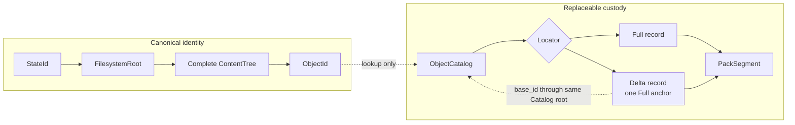
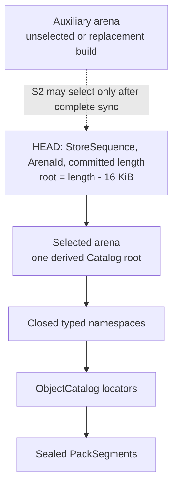
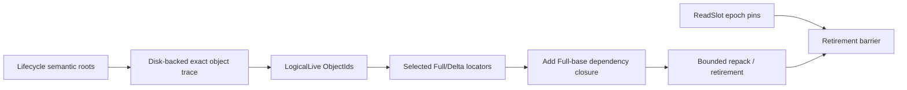

# Durable Store

> Status: **Accepted**
> Sole authority: immutable pack bytes and locators, the closed typed Catalog,
> its two arenas and mandatory `HEAD`, physical commit/recovery, readers,
> reservations, exact GC/repack and storage-medium qualification.

The Durable Store persists canonical objects and opaque Lifecycle values
without defining their meaning. One fixed-purpose immutable CoW B+ Catalog root
contains every selected locator and lifecycle fact. One mandatory `HEAD`
selects that root. There is no database, WAL, MVCC engine, generic key/value
service, cache, logical layer, squash or history log.

## Responsibility boundary

| Store owns | Store does not own |
|---|---|
| `PackSegment` framing, Full/Delta locators, object verification and same-ID validation | Canonical bytes, `ObjectId`, `StateId`, tree or attribution meaning |
| S1 Catalog pages/arenas, `HEAD`, `StoreSequence` and `ArenaId` | Which lifecycle transitions are legal |
| Dependency-first S2 selection and fail-closed recovery | Workspace scan/fence or backend runtime policy |
| 16 `OwnerSlot`s, 64 `ReadSlot`s, reservations and physical retirement | Public API or semantic retention policy |
| Exact logical trace execution, physical dependency closure and GC/repack | Automatic history expiry or root deletion |
| Store-medium synchronization qualification | Workspace quota capability |

Canonical State is replaceable through its typed verifier; Lifecycle is
replaceable through closed typed changes; pack/catalog storage is replaceable
without changing canonical identity. Combining these responsibilities would
make identity depend on location or physical recovery depend on lifecycle
policy.

## Identity versus physical custody



**Conclusion:** S3’s Delta is a depth-one physical encoding for an already
complete canonical DATA object. Its `base_id` resolves through the reader's
same captured Catalog root; it is never a state edge, tree layer,
materialization-history step or permanent physical base pointer.

## Narrow interface

The Lifecycle-facing Store port has only three calls. Read variants belong to
one immutable capability rather than pretending to be separate services:

| Operation | Contract |
|---|---|
| `open_read()` | Acquire one bounded `ReadSlot` and return a captured-root snapshot exposing closed typed `get`, ordered finite `scan`, and verified canonical `object_stream`. The latter resolves Full or one Delta+Full anchor. |
| `stage_objects(foreground_slot, stream)` | Validate same IDs, write missing records, seal/sync packs and return one bounded handle to the Build-owned sorted candidate-selection cursor. |
| `commit(expected, changes, receipt, foreground_slot?, candidate_cursor?)` | Recheck selected facts, stream any candidate cursor once, apply one closed typed delta and select one root through S2. |

Store itself owns two operations that are not client-callable: parameterless
`maintain()` selects slot `0`, captures roots/basis and chooses one frozen
physical policy; startup `recover()` validates custody and gates readiness.
Lifecycle cannot supply roots, a basis, victims, policy, or recovery timing.
Together these are three client calls plus two Store-owned operations—not five
public APIs.

`commit` is not a general transaction API. Its namespace/key/value
variants are compile-time closed; comparisons and lifecycle outcomes are
submitted by Lifecycle. Store owns only validation, atomic selection and
durability order.

## Durable layout

```text
store/
  HEAD                  mandatory, checksummed selected descriptor
  catalog/
    arena-0             immutable CoW pages
    arena-1             immutable CoW pages
  packs/                sealed immutable PackSegments
  staging/              exactly 16 OwnerSlot-owned areas
  quarantine/           invalid or interrupted artifacts
```

At any instant one arena is **Selected** and the other is mutually exclusive
**Auxiliary**. `HEAD` names one committed arena prefix; its final page is the
only root:

```text
HeadDescriptor {
  type_tag = PMSS_HEAD_V1,
  StoreSequence,
  ArenaId,
  committed_arena_length,
  checksum
}
```

With `P=16 KiB`, require `committed_arena_length>=P` and
`committed_arena_length mod P=0`, then derive
`CatalogRoot=(ArenaId, committed_arena_length-P)`. The initial empty Catalog is
one valid root page and has committed length `P`. A committed prefix contains
only complete S1 pages. Every selectable sparse or dense build emits children
bottom-up and exactly one fresh root as the final page; no selected trailer,
control record, padding, hole or later page follows it. Every child reference
is P-aligned, names that arena and lies below the derived root. Candidate pages
start at the selected committed length, never `fstat`/preallocation EOF;
`O_APPEND` is forbidden so crash tails can be overwritten. Every
StoreSequence-advancing S2 commit changes Catalog data and emits a fresh root.
A retained replay, preaccept rejection or selector revalidation does not
advance it.

The `type_tag` is the sole physical-format discriminator; there is no separate
format file, store identifier or dependency list to keep coherent. Recovery
derives dependencies by streaming the selected Catalog. The Auxiliary arena is
build/staging space, never a fallback selector. A sparse commit normally
appends immutable path-copy pages in the selected arena. A dense rebuild
constructs a self-contained root in Auxiliary and changes `ArenaId` only when
S2 selects it; after old readers drain, arena roles swap.



**Conclusion:** durable visibility has one selector and one root; two arenas
provide bounded physical replacement space, not two acknowledged histories.

### Closed namespaces

The Catalog’s key tags and value codecs are closed at compile time:

| Namespace | Physical key/value shape | Reachability role owned by Lifecycle |
|---|---|---|
| `Sandbox` | `sandbox_id -> {StateId, HeadRevision, ForkOrigin?}` | Live head is a semantic root. |
| `Session/Mutable` | `(sandbox,session) -> {OPENING\|ACTIVE, origin pair, actor_id[32], allocation, reservation}` | Row origin is a semantic root; frozen actor makes C3 replay-stable; row presence proves non-quiescence. |
| `Session/Terminal` | `(sandbox,session) -> {PUBLISHED\|CONFLICTED, allocation}` | Never a content root. Status fully determines the publish outcome; the bounded Receipt stores its exact replay result. V1 adapters must keep a conflicted private allocation self-contained and readable until explicit destruction; an adapter that cannot prove this profile is unsupported. |
| `Checkpoint` | `(owner,checkpoint) -> StateId` | Each named checkpoint is a semantic root. |
| `CheckpointPin` | `(checkpoint,child) -> unit` | Derived membership only; not another payload/count root. |
| `Receipt` | `ReceiptControl(lane)->next_sequence:u64` and `ReceiptSlot(lane,sequence mod 64)->{request_digest[32],bounded_exact_result}` | Exactly 16 controls and 1,024 modulo slots. IDs inside are inert and never reachability edges. |
| `OwnerSlot` | Exactly 16 fixed staging/recovery lanes. Key `0` is `Empty \| Build {owner_nonce}` and maintenance-only. Keys `1..15` are `Empty \| Build {owner_nonce} \| AdapterClose {session_id,expected_row_digest,request_identity}` and foreground-only. | The key selects the closed grammar, fixed directory and non-borrowable hard quota; `Build` has no purpose field. S2 selects the right empty lane before file creation, and the exact nonce prevents slot-reuse ABA. Wrong-lane values/artifacts fail closed. The live permit owns the reservation; recovery never resumes a Build and reconstructs actual allocation before synchronously aborting it. Per-file framing replaces a pack manifest. No observed locator is pinned. `AdapterClose` derives its allocation from the exact selected session row and is recovery custody, not a content edge. |
| `ObjectCatalog` | `ObjectId -> Full \| Delta locator` | Custody of logically reachable canonical objects. |

Opaque IDs encode lookup scope. There is no separate State namespace, mutable
session count, session registry root, pin count, history, refcount/live-set
ledger or durable delta-search index.

### PackSegment and locators

```text
SegmentHeaderV1 = b"PMSSPK1\0"                             # exactly 8 B
RecordHeaderV1  = ObjectId[32] || stored_len_minus_one:u16  # exactly 34 B
PackSegmentV1   = SegmentHeaderV1 || 1..n (RecordHeaderV1 || payload)

Full  = {segment_id, offset:u32, framed_len:u32}
Delta = {segment_id, offset:u32, framed_len:u32, base_id}
```

There is no footer. `P_pack_committed_max=64 MiB` includes the signature and
all frames, so output frames fit in `64 MiB-8 B`; the allocation-rounded cap is
`P_pack_alloc_max=A(64 MiB)<2^30`. Payload length is
`stored_len_minus_one+1`, exactly `1..65,536` bytes. `offset` starts the
34-byte record header and `framed_len=34+stored_len`. A writer streams,
checksums, seals and synchronizes the complete nonempty pack before a locator
may be selected. `SegmentId=BLAKE3(pack-domain || exact entire file bytes)` is
the sole physical checksum, never canonical identity.

`ObjectCatalog` is the only Full/Delta codec authority. `ObjectId` is the
canonical checksum and the canonical envelope owns the kind. A Full's
canonical length equals its stored length. A Delta locator alone supplies
`base_id`; its target length is derived from the verified equal-length Full
base and its payload's checked `u16` prefix/suffix fields. The record header
contains no codec, base, canonical length, duplicate kind or checksum. Exact
fstat length, whole-file hash, signature and exact-EOF parse reject short,
trailing-malformed, zero-frame, over-cap, overlapping or overflowing packs.
A syntactically valid unselected trailing frame is dead charged space.

Every retained physical field has one named consumer:

| Field | Sole required consumer |
|---|---|
| HEAD `type_tag` | Reject an unsupported physical grammar before decoding. |
| `StoreSequence` | Durable ordering, replay and ABA distinction. |
| `ArenaId`, committed length | Derive the final aligned page as the only root and exclude all crash-tail/capacity bytes. |
| HEAD checksum | Detect torn/corrupt selector bytes before following them. |
| Record `ObjectId` | Verify canonical identity and match the selected Catalog key. |
| Record stored-length-minus-one | Bound one nonempty frame and advance exact-EOF parsing. |
| Locator segment/offset/framed length | Perform bounded cache-off lookup and exact interval census. |
| Delta-locator `base_id` | Select the Full anchor and stream physical dependency closure without random pack reads. |

Deleting any row above removes a stated proof or forces an extra random/full-
pack read. Every former field without such a consumer has been deleted.

## Physical-index tournament

Let `N` be live records, `K` changed records, `P=16 KiB`, and `H<=8`.
Claims are analytical unless labelled otherwise.

| Candidate | Cache-off lookup/update | Ordered trace / dense build | Mechanism cost | Verdict |
|---|---|---|---|---|
| Fixed-purpose immutable CoW B+ | `Theta(H)` reads; sparse path-copy `O(KH)` worst | Ordered cursor and sequential bulk build | One page codec, sparse builder, bulk builder | **Select** |
| Patricia/radix locator map | Digest prefixes share little meaning | Ordered traversal possible but poor physical density | Recreates a page tree without C1’s logical benefit | Reject physically |
| Flat sorted/static table | Binary/cache-off page lookup | Excellent dense build | Sparse mutation rewrites `Theta(N)` | Borrow for runs/dense leaves only |
| SST/LSM | Multiple level probes without cached filters | Merge-friendly | Levels, precedence, tombstones, filters, compaction/recovery | Reject |
| Extendible hash | Good expected point lookup | Weak ordered/prefix traversal | Directory/bucket overflow and split/shrink | Reject |
| FST | Compact static lookup | Broad rebuild on sparse update | Digest keys offer poor prefix sharing | Reject |
| General database/KV | Implementation-dependent | Hidden | Arbitrary schema, WAL/MVCC/cache/background machinery | Prohibited |
| Two Catalog roots/selectors | Extra selection path | Duplicated atomicity | Lifecycle effects and locators can diverge | Reject |

The chosen Catalog borrows B-tree balance and ordered construction from the
original [B-tree design](https://doi.org/10.1007/BF00288683), but its closed
schema, immutable pages and crash selection are project-specific. It is a
purpose-built immutable index, not a database: no SQL/query language, arbitrary
keyspace, WAL, MVCC, transaction service, page cache, memtable, bloom filter,
tombstone, levels, hidden allocator or background checkpoint exists.

## S1 — fixed-purpose immutable CoW B+ Catalog

| Field | Definition |
|---|---|
| Purpose | Persist one closed typed ordered namespace with bounded cache-off reads, sparse path-copy and dense sequential rebuild. |
| Optimization target | `ALG`: combine predictable point/prefix access and batch updates with the fewest durable mechanisms. |
| Inputs and outputs | Selected root plus sorted closed typed changes, or a complete sorted stream → immutable replacement pages and one candidate root. |
| Preconditions | Complete Catalog/FD/disk permits; canonical key order; page `P=16 KiB`; supported root; final-commit gate for dense selection. |
| Invariants | One selected root; immutable checksummed pages; half-full non-root pages; `H<=8`; checked basis-local subtree record counts; no leaf-neighbor pointers; total arena bytes `<=4C_max`. |
| Commit point | None by itself; S2’s `HEAD` directory sync selects a candidate root. |
| Failure behavior | Duplicate conflicting keys, page corruption, height/arena/cap overflow or stale expected root aborts unselected work; recovery never repairs by guessing. |
| Complexity | Point read `Theta(H)`; sparse sorted path-copy `O(KH)` pages worst; dense build `Theta(N)` sequential I/O. |
| Resources | Bounded depth cursor/page builders, 2 MiB page/cursor partition, at most two arenas, fixed FDs; external sort uses 1 MiB runs and fan-in `<=8`. |
| Implementation | Minimal custom S1 borrowing B+ structure; no adopted index satisfies the database ban and exact S2 page/arena contract. |

```text
sparse_path_copy(base_root, sorted_changes):
  cursor = selected HEAD.committed_arena_length # never physical EOF
  group sorted changes by their verified base-root search paths
  descend only those paths; reuse every untouched subtree by page reference
  for each touched leaf in key order:
    validate closed key/value type and same-ID rules
    emit balanced replacement leaves, half-full unless root
  stream changed child references and checked subtree_record_count values
    through each parent level
  emit exactly one newly checksummed root as the final page
  require each leaf count equals its unique records and each parent count
    equals the checked sum of its child counts
  require height <= 8, resulting arena/accounting caps and
    derived_root_offset == cursor_after_root - P
  return candidate committed end
```

```text
dense_build_under_maintenance_fence(complete_sorted_records, basis):
  require OwnerSlot[0]=Build(owner_nonce) remains selected
  require basis was captured only after that row became the global S2 fence
  write half-full-or-better leaves sequentially in Auxiliary
  stream parent levels with checked subtree_record_count values until one
    root remains
  emit exactly that root as the final page; require height <= 8 and verify it
  sync Auxiliary and all dependencies
  while the captured immutable basis remains epoch-protected:
    stream and verify the complete basis/Auxiliary object relation
    classify every basis row exactly once as KEEP, DELETE or REPLACE
    require each keep is identical, each deletion has captured trace/census
      proof for its exact old locator, and each replacement names the exact old
      locator plus one verified sealed new locator
    reject every extra or unclassified Auxiliary row
  return owner-rooted checked {basis, committed_end, dependency_summary}

maintenance_commit does not acquire a later gate: the selected slot-0 Build
has fenced every non-maintenance S2 mutation since before `basis` was
captured. It verifies the exact
`{StoreSequence,ArenaId,committed_arena_length}` and the
checked dependency summary, then performs the bounded HEAD/root selector. An
exact-basis mismatch is therefore corruption or an invariant violation, not an
optimistic-retry case; synchronously abort owned output or fail closed. Never
blind-rebase, retrace around a concurrent commit, or catch up a WAL.
```

Sparse updates do not require a global rebuild. Dense build avoids sparse
write amplification. Its construction, synchronization and exact dense
validation all occur while the already-selected Maintenance Build fences the
write side. Only the final selector is repository-size-independent. Let
`C_max` be the configured full-occupancy byte
capacity of one complete admitted Catalog; it is never recomputed downward
from current live rows. Half-full non-root occupancy bounds one complete arena
by `2C_max`; Selected plus one Auxiliary therefore gives the analytical
physical bound `<=4C_max`. Admission
refuses a commit/rebuild that cannot preserve it.

Every immutable S1 internal-child entry includes a checked `u32
subtree_record_count`. A leaf count is its exact number of unique records; an
internal count is the checked sum of its children, and overflow or disagreement
fails closed. Sparse path-copy and dense build recompute the counts; every read
verifies leaf counts, checked parent sums, key ordering and uniqueness. For one
captured Catalog root, ordered sibling counts plus the
leaf slot give a basis-local global record rank. The contiguous
`ObjectCatalog` key range therefore maps bijectively to `[0,N_object)` by
subtracting the rank of its lower bound. Rank lookup must reverify the exact
key, namespace and kind. Counts are physical S1 metadata, not a version,
refcount or live-set ledger. Their encoded width is included when the internal
fanout, height-eight capacity, `C_max` and `4C_max` bounds are frozen and
qualified.
Admission requires `N_catalog_record_max<2^32` and therefore
`N_object_max<2^32`; stored ranks/counts are `u32`, while sums and byte
arithmetic widen and check before narrowing.

## Exact same-ID validation and candidate preparation

An existing `ObjectId` is reusable only after exact typed validation; digest
equality is not silently assumed to excuse missing/corrupt bytes. The portable
bounded-memory publication baseline uses two stable fenced source passes and
one disk-backed distinct-object classification:

1. pass 1 reads/describes/hashes at most `B_scan` non-hole source payload
   bytes and emits `U_candidate`;
2. classify every distinct descriptor exactly once into disjoint `U_reuse`
   and `U_missing` streams;
3. pass 2 groups source descriptors by interval and Store reads by
   Catalog/pack locality, rereads at most `B_scan` source bytes, reconstructs
   and exactly compares every reused canonical object once, and emits every
   missing object once.

Let `C_reuse` be the sum of canonical lengths in `U_reuse`, `P_reuse` the
physical selected-Store bytes actually read for those reconstructions
(including a Delta frame and its Full anchor when required), and `P_new` the
physical writes for missing objects including record and pack framing. Exact
accounting is:

```text
U_candidate = U_reuse disjoint-union U_missing
source payload reads  <= 2*B_scan
canonical comparisons = C_reuse
selected-Store reads   = P_reuse
new physical writes    = P_new
```

Neither comparison term is bounded by `B_scan`: metadata and attribution
objects exist when source payload is zero, and Delta reconstruction can read
an anchor. `Delta=C_candidate-C_reuse` is a canonical-byte difference, not a
physical-write count. A short read, changed stability token, same-ID
kind/length/content mismatch or corrupt locator aborts before public selection.

Candidate packs remain charged to one of exactly 15 foreground `OwnerSlot`
lanes until final S2 commit, supersession or abort. For S3, hold a `ReadSlot`,
resolve and verify a Full `base_id` through its captured Catalog root, compute
and verify the candidate, place only the candidate pack under owner custody,
then release the slot. Final publication re-resolves every classified reuse and
`base_id` in the current root and atomically retains a structurally valid
selected Full row with the target Delta. The Delta stores only `base_id`; no
observed locator is persisted or pinned.

If any reuse or Delta base vanished, preparation leaves the gate and, while
the private workspace remains fenced and the same Build nonce stays selected,
joins producers/readers, deletes plus directory-syncs the entire cursor,
candidate packs and scratch, then reruns both source passes and distinct-object
classification against the current Catalog. It never locally upgrades a
vanished REUSE or Delta to Full after its classification proof is invalid.
Exactly one recapture is permitted; a second invalidation performs ordered
abort/clear, returns typed transport `RetryLater`, and leaves the session
`ACTIVE`. No candidate pack is installed before revalidation.

Preparation writes candidate frames in global ObjectId order and merges the
distinct reuse/missing streams into exactly one Build-owned sorted disk cursor.
Each record is `(ObjectId, REUSE | candidate locator)`. A Delta candidate's
`base_id` is read from that locator, so there is no second dependency vector,
locator array or repository-sized handoff. The cursor is synchronized before
handoff, charged as `Theta(|U_candidate|)` disk, consumed once with fixed
admitted memory and removed before its exact Build nonce is cleared.

At final lookup, `REUSE` keeps its structurally valid current row. A candidate
keeps an already-selected structurally valid exact row when present, otherwise
selects the staged locator; it never replaces a current Full with a staged
Delta. Each segment occupies one contiguous cursor interval, so finalization
retains only one O(1) `selected_count`. It installs only a positive-count
segment, deletes and directory-syncs a zero-selected segment, and leaves
duplicates in a mixed installed segment as charged dead bytes for later
repack. Structural validity is the closed Catalog/invariant proof established
on admission, so the serialized gate performs no payload I/O.

Abort or supersession first fences and joins the producer, deletes every file
while its fixed directory is still owned, synchronizes that directory, clears
the row through S2, then releases charges. An empty selected directory is valid
after a crash. Successful selection renames and synchronizes only positive-
count dependencies into `packs/`, then selects every needed staged locator or
already-selected exact row and clears the slot in that same root. A live
failure before HEAD unlinks and directory-syncs every known newly installed
destination (or streams the complete census) before Build clear and return. A
pre-HEAD crash leaves self-verifying unselected installed orphans that recovery
removes before readiness. A losing publication selects no candidate locator,
so GC cannot race it.

The maintenance directory has its own non-borrowable quota; all 15 foreground
directories use the frozen foreground quota. Recovery streams all 16 without
retaining entries. Every create, finalize, abort and clear exact-matches the
selected `owner_nonce`; a stale owner cannot touch a reused directory. The live
permit remains charged until selected transfer or synchronized deletion and
exact slot clear; restart reconstructs actual allocation while readiness is
closed and aborts every Build rather than resuming it.

`OwnerSlot[0]=Build {owner_nonce}` is the one global S2 mutation fence; there
is no purpose field, dynamic lane search, priority queue, separate lock
namespace or catch-up log. Store selects slot `0` first, then captures
`MaintenanceBasis`. Until maintenance selects its Auxiliary root and clears
the exact nonce, or aborts, cleans and clears it, every new foreground grant and
non-maintenance S2 mutation returns bounded `RetryLater`. Reads,
materialization and admitted private edits continue. A foreground Build
already selected may finish staging, synchronize/close resources and wait, but
holds no managed buffers, FDs or workers while waiting. `AdapterClose` that
crossed irreversible disposal completes after the fence. Consequently no
Catalog, installed-pack or `StoreSequence` change can invalidate the captured
basis. The pause spans the full trace, sorts, rewrite, dense validation and
selector: bounded `Theta(N_object + N_pack + X_live)`, not merely an `O(1)`
selector or optimistic retry. Qualification must measure a frozen maximum at
`C_max` under 1/4/8/16/32/64 active sessions; failure blocks writable
production readiness.

## S2 — single-HEAD commit and recovery

| Field | Definition |
|---|---|
| Purpose | Atomically select every object dependency, lifecycle effect and exact receipt with one mandatory non-rollback `HEAD`. |
| Optimization target | `ARCH`: one durability/visibility authority and one fail-closed recovery rule. |
| Inputs and outputs | Foreground bounded expected lifecycle/key facts or exact dense `MaintenanceBasis{StoreSequence,ArenaId,committed_arena_length}`, sorted closed typed changes, exact receipt, optional Build-owned candidate cursor → selected `StoreSequence+1` and recorded result. The root is always derived as `committed_arena_length-P`. |
| Preconditions | Complete resource/reserve permit; all selected packs/pages can be synchronized; foreground expected comparisons and receipt lane are valid against the current root; only dense maintenance exact-CASes its captured `{StoreSequence,ArenaId,committed_arena_length}`. |
| Invariants | Dependencies precede selector; effect and receipt share one root; acknowledged sequence never silently rolls back; `HEAD` names exactly one valid root. |
| Commit point | Successful same-filesystem `HEAD.tmp -> HEAD` replacement plus containing-directory synchronization, immediately before acknowledgement. |
| Failure behavior | Before selection: old or complete unacknowledged new with charged orphans; after acknowledgement: exact new result. Missing/corrupt/ambiguous selected data fails readiness; no older election. |
| Complexity | Publication conflict is bounded row/receipt work and scans no candidate cursor. For an origin match, with `K=|U_candidate|<=N_object_max`, `K_delta<=K` and `H<=8`, the serialized gate is `Theta(KH + K_delta + selected-candidate-pack installation/synchronization)` including cursor consumption and scratch disposition. Dense relation build/validation is `Theta(N_object)` inside the global write-side maintenance fence; only the final dense selector is `O(1)` in repository size. Recovery validates bounded HEAD/arena metadata, then streams the selected Catalog and packs. |
| Resources | One serialized foreground owner or one exclusive dense-maintenance owner, bounded page/HEAD/cursor buffers and FDs, one OwnerSlot when objects are added, maintenance reserve; no WAL, locator vector or unbounded replay map. |
| Implementation | Minimal custom S2 borrowing OS rename/sync ordering and crash-testing practice; dual slots are rejected because fallback can erase acknowledged state. |

```text
prepare_candidate_cursor(owner_slot, classified_objects):
  require owner_slot in 1..15 and exact Build(owner_nonce) is selected
  require its fixed staging directory empty and producer owns that nonce
  for each distinct classified ObjectId in key order:
    if REUSE: exactly verify the current selected canonical object
    if MISSING: emit one verified Full or eligible depth-one Delta record
  write candidate frames in global ObjectId order; seal, exact-EOF verify and
    sync every staged candidate pack
  merge classified input into one sorted Build-owned disk cursor containing
    (ObjectId, REUSE | candidate locator); sync it
  consume and remove the classified input runs
  return one bounded seekable cursor handle; return no locator/base vector

foreground_publish_commit(session_key, expected_session, candidate_state,
                          receipt, owner_slot, candidate_cursor):
  acquire serialized foreground commit ownership
  current = verify mandatory HEAD and selected Catalog root
  control = ReceiptControl(lane)
  if sequence in [max(0,control.next_sequence-64),control.next_sequence):
    slot = ReceiptSlot(lane, sequence mod 64)
    require slot.request_digest == digest(request); return slot.exact_result
  if sequence < max(0,control.next_sequence-64): return ReplayExpired
  if sequence != control.next_sequence: return typed transport rejection
  require current Session row exactly equals expected_session
  resolve current Sandbox row from session_key
  if Sandbox.(StateId,HeadRevision) != expected_session.origin:
    select Terminal/CONFLICTED plus receipt, no candidate locator, unchanged
      Sandbox head and retained exact Build nonce; release commit ownership
    synchronously perform the ordered conflict cleanup before acknowledgement
    return PublishConflict
  require K = cursor record count <= N_object_max
  first sequential cursor pass in ObjectId order, before any pack install:
    for REUSE, keep only a structurally valid identical current row
    for a candidate locator, keep a structurally valid exact current row if
      present, else select the already-admitted staged locator
    never replace a current Full with a staged Delta
    for a Delta locator, derive base_id from it, re-resolve base_id in current
      and require a selected Full row
  if a reused object vanished or any required base is absent/Delta/corrupt:
    leave commit ownership; join every producer/reader; while workspace remains
      fenced and the exact Build remains selected, delete+dirsync the complete
      cursor, all candidate packs and scratch; rerun both capture passes and
      classification against current Catalog under the same permit/nonce
    permit one recapture; on a second invalidation ordered-abort/clear, return
      RetryLater and leave Session ACTIVE; never locally upgrade one object
  build candidate Catalog pages during that validated first pass, keeping any
    late-deduplicated current row
  rewind for a second bounded sequential cursor pass while current root remains
    fenced; for each contiguous candidate-segment interval:
      recompute one O(1) selected_count
      if zero: delete staged segment and sync its directory
      else derive destination from verified SegmentId; rename and sync it
        if destination exists, accept only identical full hash and exact length;
        otherwise fail closed; delete/sync an identical redundant staged copy
  join cursor readers; delete and directory-sync the cursor and every other
    non-pack scratch while the exact Build remains selected
  finish Catalog pages selecting every needed staged locator or current exact
    row, Sandbox(candidate_state,HeadRevision+1), Terminal/PUBLISHED,
    ReceiptSlot(lane,sequence mod 64)={request_digest,exact result},
    ReceiptControl(lane)=next_sequence+1, and exact Build clear atomically
  sync every selected PackSegment and Catalog dependency
  write complete checksummed HEAD.tmp; sync HEAD.tmp
  rename HEAD.tmp to HEAD on the same filesystem
  sync the containing directory                 # durability/linearization
  transfer storage charges, release the Build permit and acknowledge the exact
    recorded result

on any live failure before HEAD selection:
  unlink+dirsync every known newly installed destination, or stream the global
    pack census to find them, before clearing Build and returning

validate_prepared_auxiliary(prepared_auxiliary):
  # The captured basis is immutable and epoch-protected for this pass.
  stream and verify the complete basis/Auxiliary ObjectCatalog relation
  classify every basis ObjectCatalog row exactly once as KEEP, DELETE or REPLACE
  require each keep is identical, each deletion has captured trace/census
    proof for the exact old locator, and each replacement names the exact old
    Full/Delta locator plus one verified sealed new locator
  reject every extra or unclassified Auxiliary row
  require every non-ObjectCatalog namespace/key/value is byte-identical except
    the exact OwnerSlot[0]=Build(owner_nonce) row authorized for deletion;
    no maintenance receipt or other lifecycle mutation is permitted
  require every replacement dependency is sealed and synchronized
  require Auxiliary committed_end is aligned and its final page is the verified
    derived root; return a checked bounded relation/dependency summary

maintenance_commit(prepared_auxiliary, checked_summary):
  require exact OwnerSlot[0]=Build(owner_nonce) remains selected
  current = verify mandatory HEAD and selected Catalog root
  require exact MaintenanceBasis == prepared_auxiliary.basis
  require checked_summary binds the exact basis, Auxiliary committed end,
    derived final root and synchronized dependency summary
  write/sync/rename/sync HEAD containing only the next sequence, ArenaId and
    committed end; it selects the derived Auxiliary root and clears this exact
    owner_nonce atomically
  acknowledge the selected maintenance root
```

```text
recover():
  acquire exclusive store ownership; keep readiness closed
  read the one mandatory HEAD and verify framing/checksum
  require supported type, exact named ArenaId, aligned committed length >= P
  derive root_offset = committed_length - P; verify root type/checksum/height
    and complete same-arena child closure strictly inside committed prefix
  reconstruct selected session reservations and every selected Build's aggregate
    actual allocation; keep each Build selected and charged
  fence stale adapters and clear expired volatile ReadSlots
  reuse build_pack_census: one selected ObjectCatalog scan emits 72-byte
    locator rows; one installed-directory/pack stream emits inventory rows;
    external-sort once by SegmentId/offset and merge sequentially
  verify every selected page/frame/Full base, each installed whole SegmentId,
    signature, committed/allocation bound and exact-EOF grammar exactly once
  synchronously unlink+dirsync every installed pack with zero selected rows;
    an existing same-name pack is valid only when full hash and exact length
    verify identically; a conflicting collision fails closed
  if anything selected is missing, corrupt or ambiguous: fail closed
  for each selected Build row only after pack census/orphan cleanup:
    fence/join any surviving producer; stream-delete its fixed-dir files;
    sync the directory; exact-CAS-clear its owner_nonce; release its charge
  require every unselected fixed directory is empty, else fail closed
  never select an older StoreSequence or Auxiliary as fallback
  publish readiness only after ownership, census/orphan cleanup, synchronized
    deletion, dependency validation and full reserve restoration
```

Dependency order is grounded in same-filesystem
[POSIX `rename`](https://pubs.opengroup.org/onlinepubs/9799919799/functions/rename.html),
file synchronization such as Rust
[`File::sync_all`](https://doc.rust-lang.org/std/fs/struct.File.html#method.sync_all),
and explicit directory synchronization qualification. Crash cuts must be
tested with dependency-aware techniques exemplified by
[ALICE](https://www.usenix.org/system/files/conference/osdi14/osdi14-paper-pillai.pdf)
and [CrashMonkey](https://www.usenix.org/conference/osdi18/presentation/mohan);
the papers are evidence, not adopted recovery engines.

### Replay custody

S2 provides atomic selection, while Lifecycle defines receipt semantics. The
existing Receipt namespace contains `ReceiptControl(lane)->next_sequence:u64`
(exactly 16 rows, initialized to zero) and
`ReceiptSlot(lane,sequence mod 64)->{request_digest[32],bounded_exact_result}`
(exactly 1,024 rows). The complete canonical framed slot value is at most
512 B. No slot stores a sequence, generation, low-water mark or duplicate lane
field.

Only `sequence==next_sequence` is newly accepted. The retained window is
`[max(0,next_sequence-64),next_sequence)`; one modulo lookup plus exact digest
check returns the original result. An older request returns `ReplayExpired`
without execution, and a future gap is a typed transport rejection. S2 writes
effect, modulo slot and `next_sequence+1` in one root; receipt-only no-effect
outcomes do the same. IDs embedded in a receipt remain inert. The 1,024 durable
slots are cache-off—only one control/slot replay working set is resident. The
finite-window information model borrows authenticated anti-replay principles
from [RFC 4303](https://www.rfc-editor.org/rfc/rfc4303) and
[RFC 6479](https://www.rfc-editor.org/rfc/rfc6479).

## S3 AlignedSpliceDelta-v1

| Field | Definition |
|---|---|
| Purpose | Reduce physical bytes for eligible retained hot edits while preserving the exact complete canonical DATA object. |
| Optimization target | `DISK`: avoid one full chunk per retained same-interval small edit. |
| Inputs and outputs | Canonical target DATA chunk plus exact session-origin same-logical-interval Full anchor → Full locator or framed depth-one Delta locator. |
| Preconditions | Target/base canonical lengths equal and `<=32 KiB`; exact interval hint; under a ReadSlot `base_id` verifies Full, and only the candidate/output pack enters OwnerSlot custody. |
| Invariants | Depth exactly one; prefix/suffix do not overlap; no global similarity search; decode verifies target kind, length and BLAKE3; logical graph and `StateId` never change. |
| Commit point | Against the current root, S2 re-resolves a selected Full `base_id` and selects target locator plus retained dependency together. |
| Failure behavior | Missing/non-Full base, cycle, depth>1, malformed splice, reconstruction mismatch or hash failure fails closed; ineligible/uneconomic target is stored Full. |
| Complexity | Encode/decode `Theta(target_len)`; decode reads at most one Full base plus one Delta; candidate search `O(1)` from exact interval hint. |
| Resources | Exactly one 98,304-B admitted slab (32-KiB base, 32-KiB target, 16-KiB Delta I/O, 16-KiB controls); exactly three FDs for Catalog, input/base pack and candidate/replacement pack; charged candidate pack; no locator pin, index, window or cache. |
| Implementation | Minimal custom S3, borrowing only framing/delta/repack evidence from Git; Git chains, search windows and heuristics are rejected. |

```text
DeltaPayload {
  prefix_len:u16,
  suffix_len:u16,
  middle_bytes
}
target_id  = enclosing RecordHeaderV1.ObjectId
base_id    = selected Delta locator.base_id
target_len = verified Full base canonical length
target =
  base[0:prefix_len]
  || middle_bytes
  || base[target_len-suffix_len:target_len]
```

```text
encode_s3(origin_interval, target):
  hold ReadSlot
  anchor = resolve origin_interval to its verified Full anchor
           # if origin locator is Delta, reuse that Delta's Full anchor
  require equal canonical lengths <= 32 KiB
  compute longest non-overlapping common prefix and suffix
  frame candidate payload under RecordHeaderV1; candidate locator owns base_id
  Delta is eligible only if:
    framed_delta_len <= floor(full_framed_len / 4)
    and full_framed_len - framed_delta_len >= 1 KiB
  if eligible:
    write, seal, verify and durably owner-custody the candidate Delta pack
    release ReadSlot
    reserve exact PackAlloc(8-byte signature + Delta frames, allocation-rounded)
    return candidate Delta containing base_id only
  else:
    release ReadSlot
    reserve exact PackAlloc(8-byte signature + Full frames, allocation-rounded)
    return Full

select_s3(current_root, candidate):
  under the shared final gate, structurally resolve candidate.base_id
  if the selected row is Full:
    mark candidate valid for late-dedup/finalization; do not install it yet
  else:
    signal complete two-pass recapture; never locally convert this Delta to Full
    after the classification that admitted it has become stale

decode_s3(delta):
  base_locator = resolve delta.base_id through the same captured Catalog root
  require base_locator is Full and dependency depth is one
  verify base kind/length/id
  require prefix_len + suffix_len <= target_len
  reconstruct target from base and middle_bytes
  verify exact DATA kind, target_len and BLAKE3 target_id
  return canonical target bytes
```

The only candidate base is the exact same logical byte interval in the
session-origin file. If the origin target is itself Delta, its verified Full
anchor is reused. No similarity index, reverse map, scan window or cache
exists. [Git’s pack format](https://git-scm.com/docs/pack-format.html) and
[`git repack`](https://git-scm.com/docs/git-repack.html) support the physical
framing/repack decision; this design deliberately forbids Git-style chains and
search.

The encoder borrows the selected middle slice from the 32-KiB target region;
it never creates a third patch allocation. The final codec must prove that a
selected framed Delta fits the 16-KiB Delta window and all headers, offsets,
hash state and errors fit the 16-KiB control region. The one-quarter test is a
record-frame rule; capacity admission and normalization use exact `PackAlloc`
including the eight-byte signature, every frame and filesystem allocation
rounding.

### S3 group normalization

S3's equal-canonical-length rule makes the Full frames for one base and its
targets equal in length `F`; every selected Delta frame has `D <= F/4`.
Therefore only one group shape is frame-inefficient: a base that is not
logically live and has exactly one logically-live Delta target. That singleton
uses `F + D` rather than one Full target frame `F`. A dead base with at least
two live targets uses at most `F + kF/4 < kF`, and an independently live base
is already required. No byte-size field or general cost solver is needed.

The first physical-closure sort carries exactly the 36-byte
`DeltaEdgeV1 {base_id[32],target_rank:u32}`. Emission knows the rank from the
captured S1 basis. A grouped merge resolves each base once, exact-selects every
target rank, verifies that row is the unique Delta naming the base and rejects
duplicate ranks/targets. It selects dead-base
singletons for bounded Delta-to-Full replacement in deterministic key order,
up to one `64 MiB-8 B` output-frame budget; it retains the anchor for every
unselected singleton and every beneficial group. The same two-bit trace records the
decision, and the one `REWRITE_BATCH` engine performs the selected replacements.

This proves only that the selected **record-frame** representation after all
normalization is no larger than Full-only record frames. It deliberately does
not assign filesystem allocation rounding to a group: unrelated frames can
share a pack, while one group's frames can occupy different packs. Exact
`PackAlloc` remains a global pack charge, and repack/consolidation uses the
later pack census to control real allocation. A Full base is reclaimed only
after every selected Delta locator stops depending on it and old readers drain.

## Readers and retirement

Reader protection is volatile, fixed and non-renewable:

| Bound | Requirement |
|---|---|
| `ReadSlot` count | Exactly 64 |
| Absolute lifetime | At most 30 s from acquisition; renewal cannot extend it |
| Persistent reader state | None |
| Retirement epochs | One |

Each slot pins one selected immutable root/arena and required packs. Its
30-second deadline requests cancellation. The slot is cleared only after that
cancellation is joined/drained and every old-epoch cursor and pack FD is
closed; wall-clock expiry alone never authorizes retirement. Supported
environments must qualify bounded, cancellable I/O so this safe drain completes
within the deadline. Failure to drain blocks retirement and fails readiness
rather than risking use-after-retirement.

A higher workflow may continue under a newly admitted slot only from a logical
cursor `{StateId, canonical_traversal_key}`, never from a physical locator, and
only after proving that exact `StateId` remains a semantic root in the new
basis. Otherwise the public operation returns `SnapshotExpired` or restarts
from its public boundary. This is a new epoch pin, not renewal of the old one.
Restart fences stale adapters before readiness, so old volatile slots do not
survive recovery.
This narrowly borrows finite reader retirement from
[Linux RCU](https://www.kernel.org/doc/html/latest/RCU/), not a durable lease
system.

## Exact GC and repack

Lifecycle defines the semantic meaning of the root fields in
[Lifecycle](lifecycle_engine.md#semantic-roots-and-retirement). Store captures
`MaintenanceBasis{StoreSequence,ArenaId,committed_arena_length}` and derives
`CatalogRoot=(ArenaId,committed_arena_length-P)`. It scans these fields through
one ordered cursor over that exact derived root:

```text
Rsem = every live Sandbox StateId
     U every Checkpoint StateId
     U every Session/Mutable origin StateId
```

Store then performs two separate closures:

```text
LogicalLive  = trace complete canonical objects from semantic roots
Physical closure classifies every selected ObjectCatalog locator as:
  dead | logically live | required Full anchor
```

`ReadSlot`s pin their captured selected StoreSequence/arena epoch rather than
emitting per-object liveness records. A replacement may be prepared while an
old reader exists, but old packs/arena cannot be unlinked until every slot for
that epoch drains. Candidate/staging and current-maintenance outputs are
owner-rooted, fully charged and outside the selected victim population until
S2 selects them.

Receipts, all Terminal fields, allocation handles, provenance IDs and
`CheckpointPin` payloads are not followed. V1 admits only adapters whose
fenced conflicted allocation remains self-contained and readable, so no
conditional terminal-origin edge exists. Roots and `ObjectCatalog` locators therefore
come from one basis; callers cannot supply a root list or mix two selections.
Exact reachability uses bounded disk-backed traversal; there is no resident
set, durable refcount or live-set ledger.



**Conclusion:** logical reachability decides which canonical objects matter;
physical closure separately prevents a live Delta, candidate or reader from
losing its bytes.

The captured S1 counts give the exact size and dense rank of the contiguous
`ObjectCatalog` range. Deployment derives and admission enforces:

```text
N_object <= N_object_max
N_reach  <= N_reach_max <= N_object_max
N_delta  <= N_delta_max <= N_object_max
N_pack <= N_pack_max
N_pack_record = N_object + N_pack
N_pack_record_max =
  N_object_max + N_pack_max
N_roots  <= N_root_max
R_child_max = 512
E_reach_max <= N_root_max + R_child_max * N_reach_max
```

Admission requires `N_catalog_record_max<2^32`, hence
`N_object_max<2^32`; subtree counts and basis ranks are `u32`. Byte products,
edge totals and cross-pack sums use checked `u64`/`u128` intermediates.

Every canonical kind has at most 512 direct typed children; excess encode or
decode fails `CanonicalLimitExceeded`; checked trace counters enforce the
`N_reach_max` and `E_reach_max` bounds. Trace owns one
fully allocated, non-sparse, OwnerSlot-charged file with one header block and a
tree of state/summary blocks:

```text
P_s = 4096
d   = 32
P_t = P_s - d = 4064

q_0(n) = ceil(n / (4 * P_t))
q_{j+1}(n) = ceil(q_j(n) / (8 * P_t)) while q_j(n) > 1
Q(n) = sum_j q_j(n)

if n = 0: Q(n) = 0
D_trace(n) = A(P_s * (1 + Q(n)))
D_trace_max = D_trace(N_object_max)
I_trace_max = 1
```

Maintenance reserves `D_trace_max` before starting but allocates only
`D_trace(N_object)` for the captured Catalog. The first 4 KiB block contains a
4,064-byte canonical checked header/padding and a 32-byte BLAKE3-256 digest.
The header binds the trace format, exact `MaintenanceBasis`, `N_object`, every
level count/offset, total allocated length and current phase. Every remaining
4 KiB block contains 4,064 bytes of state or summary data and one 32-byte
digest over the domain plus the exact basis, `N_object`, phase, level/type,
block index, valid-tail length and payload. Thus two valid blocks cannot be
swapped, replayed from another basis or reinterpreted at another level. A
phase transition rewrites the header and every block digest before the new
meaning is consumed; the checked header geometry must exactly equal `Q(n)`.
Level zero stores one two-bit state per admitted rank; every higher level
stores one summary bit per child block/subtree. Initialization writes
`00` for every valid rank, `11` for every unused state-tail rank, and zero for
every summary bit and unused summary tail.
The only valid-rank states are:

| Bits | Meaning |
|---|---|
| `00` | unseen |
| `01` | pending during logical trace; selected logical Delta-to-Full replacement during physical closure |
| `10` | done and logically live |
| `11` | invalid for a valid rank during logical trace; retained anchor-only after the checked phase transition |

A summary bit is one if and only if its child block/subtree contains a valid
`01`. Seeding a fixed-schema root or discovering a verified typed canonical
child performs `00 -> 01`. Pop follows the summary tree to one pending rank,
performs `01 -> 10`, decodes and verifies that object from the captured
`ObjectCatalog` locator, and enqueues only its closed typed child fields. One
coordinator performs state changes and recomputes every affected ancestor.
Sharing and corrupt cycles cannot multiply work because a rank becomes pending
only once.

Successful logical completion requires every valid rank to be exactly `00` or `10`,
no valid rank to remain `01` or become `11`, the state tail to remain exactly
`11`, and every summary/tail bit to recompute exactly with all summary bits
zero. Only then does `10` define `LogicalLive`. A crash, checksum mismatch,
summary/state inconsistency, rank/key/kind error, overflow, short write or any
I/O error discards and synchronizes the entire OwnerSlot scratch file; trace
never resumes it.
Combined state/summary windows, the height-`<=8` Catalog path, streaming
decoder and bounded child batch fit one `<=2 MiB` heavy-operation claim; there
is no `mmap` or object-sized RAM structure. Dirty windows and explicit
synchronization/drop behavior are bounded.

The ordered `ObjectCatalog` sweep consults this completed logical state. A
logically live Delta locator emits one exact dependency edge:

```text
DeltaEdgeV1 = 36 bytes:
  base_id[32], target_rank:u32

PackCensusV1 = 72 bytes:
  segment_id[32], offset_or_committed:u32, marked_len:u32,
  object_id_or_zero[32]
```

Bits `31..30` of `marked_len` are the closed enum
`00 DEAD_CATALOG`, `01 LOGICAL_CATALOG`, `10 ANCHOR_CATALOG`,
`11 INVENTORY`; the low 30 bits are exact framed length or allocation-rounded
bytes. A Catalog alternative carries locator offset, selected ObjectId and its
state-derived kind. The unique inventory alternative carries committed EOF in
`offset_or_committed`, allocated bytes in the low 30 bits and a zero ObjectId;
it follows positive frame offsets in pack order. Committed and allocated pack
lengths are `<2^30`. Implementations mask before arithmetic, widen to checked
`u64`/`u128`, and reject interval/end overflow before narrowing. No tag byte,
padding, reserved lane, owner-custody alternative or locator codec is stored.
The ObjectId lets the merge verify the frame header without a random Catalog
read. Fields are manually encoded in canonical byte order.

The first external sort orders `DeltaEdgeV1` by `(base_id,target_rank)`.
For each group it resolves the base ID once and exact-selects every target by
basis rank, verifies the selected row is the logically-live Delta naming that
base, and rejects a duplicate rank/target or malformed group. No permanent
physical base locator is duplicated in a Delta. The grouped stream needs one
current base, checked target count and output-budget counter.

After logical success, the grouped edge merge performs one checked transition
to `PhysicalClosure`. In that phase `00=dead`, `10=logical keep`,
`11=anchor-only keep`, and `01=logical target selected for normalization`.
For a dead-base singleton in a requested `NORMALIZE` pass, deterministic
selection changes the target `10 -> 01` and leaves the base `00`; if the
bounded output budget cannot admit that Full frame—or this is a physical-
policy pass—the base changes `00 -> 11`. Every other dead base needed by a
beneficial group changes `00 -> 11`; a logically-live base stays `10`.
Summary bits remain checked zero and no longer interpret `01` as pending.
The header and every block digest are rewritten with the new phase before
physical states are consumed. This reuses the otherwise idle fourth state
without a bitmap, retained edge file, map or relocation stream.

```text
classify_delta_groups(mode, ordered_edges, trace):
  planned_full_frames = 0
  for each base_id group in ordered_edges:
    base_rank, base_locator = exact rank lookup(base_id)
    require base_locator is Full
    base_state = trace[base_rank]
    require base_state is 00 or 10

    seen_target_rank = none
    for each target_rank in the group:
      require target_rank != seen_target_rank; seen_target_rank = target_rank
      target_id, target_locator = exact select ObjectCatalog[target_rank]
      require trace[target_rank] == 10
      require target_locator is Delta naming base_id
      read/verify its bounded frame header
      require base and target canonical lengths equal and <=32 KiB
      count target; reject duplicates/overflow

    if base_state == 00 and target_count == 1 and mode == NORMALIZE
       and checked(planned_full_frames + target_full_frame) <= 64 MiB - 8 B:
      trace[target_rank] = 01
      planned_full_frames += target_full_frame
    else if base_state == 00:
      trace[base_rank] = 11

  rewrite every block digest and the header for PhysicalClosure
  sync; reopen; validate exact geometry, phase, states, zero summaries and digests
```

```text
build_pack_census(basis, trace):
  for EVERY selected ObjectCatalog row, including a logically dead row:
    read its exact trace state
    emit PackCensusV1 kind LOGICAL_CATALOG for state 01 or 10,
      ANCHOR_CATALOG for state 11, or DEAD_CATALOG for state 00;
      low30(marked_len)=exact framed length

  stream the complete installed sealed PackSegment directory:
    verify containment/type, SegmentId name, `<2^30` committed/allocation
      lengths, eight-byte signature, at least one frame and exact EOF
    emit kind INVENTORY, committed end, low30 allocation and zero ObjectId

  external-sort by
    (segment_id, offset_or_committed, low30(marked_len),
     high2(marked_len), object_id_or_zero)
  merge marked records by segment_id and frame; require the unique inventory
    record follows every frame because every valid frame offset < committed end
  sequentially check every selected ObjectId against its exact frame header
  reject missing inventory, unowned installed candidates, inconsistent
    duplicate locators, masked lengths, SegmentIds, overlaps/end overflow and
    committed/allocation bound violations
  count each unique frame once iff kind is LOGICAL_CATALOG or ANCHOR_CATALOG
  emit exact frame counts, live bytes and allocation-rounded bytes per pack,
    including zero-live and inventory-only packs
  retain only fixed-size victim candidates; reread chosen ordered groups
```

A pack is current-selected if and only if at least one current
`ObjectCatalog` locator names it, so a rowless current-selected pack is
impossible. `PACK_INVENTORY` is a physical directory census, not a ninth
Catalog namespace or a durable `PackCatalog`. Incomplete owner artifacts stay
outside the installed sealed-pack directory and remain charged/recoverable
through their OwnerSlot.

Dead rows are mandatory census input: omitting them can hide a wholly dead
pack. The installed-pack stream makes rowless physical custody visible without
inventing selected state. `N_pack_max` is derived from the hard installed-pack
directory inode/quota bound. OwnerSlot staging files are outside this directory
and victim set; their separate hard byte/inode quotas bound creation and
recovery scans. Admission fails before either quota is exceeded.
ReadSlots protect retired epochs and therefore require no per-object census
rows. An anchor is physically retained without becoming a semantically live
canonical object. A state-`01` target remains semantically logical while the
rewrite replaces its Delta locator with Full.

An inventory-only pack is never deleted while an old-epoch
ReadSlot/retirement epoch could name it. Once no such custody exists, a
verified inventory-only pack is an orphan/quarantine artifact
and may be synchronously unlinked and dirsynced.
After a new Catalog omits every dead row in a formerly selected pack, that pack
becomes inventory-only; it remains protected by the old epoch until all readers
drain.

The dense Auxiliary `ObjectCatalog` keep-set is exact:

```text
CatalogKeep = every row whose trace state is 01, 10, or 11
```

Every captured selected `ObjectCatalog` row is classified exactly once as
`KEEP`, `DELETE` or `REPLACE`. A `00` row is omitted; every `01` target must be
replaced by its verified Full record; `10` and `11` rows remain selected unless
the same batch relocates them. Owner-staged candidate objects do not enter `ObjectCatalog` merely
because an OwnerSlot holds them. A relocated live/anchor row is a replacement.
Dense validation permits a deletion only when the captured trace and
census prove the exact old locator dead, requires every kept row to be
identical, and requires every replacement to name both the exact captured old
locator and one verified sealed new locator. It rejects extra Auxiliary rows.
Every other namespace is byte-identical except deletion of the exact selected
Maintenance Build nonce; maintenance has no receipt or lifecycle side effect.

One `REWRITE_BATCH` engine performs both copy-preserving repack and selected
Delta-to-Full normalization; those are policies, not separate write/commit
algorithms. The invocation control header records exactly one policy. Census
selection retains at most 64 source packs in one manually encoded,
phase-reused 4-KiB vector:

```text
VictimV1 = 40 bytes:
  segment_id[32], allocated:u32, retained_framed:u32
B_victim = 64
64 * 40 + checked header <= 4096
```

Each field is `<2^30`; cross-victim totals use checked `u64`. The sorted vector
costs at most 2,560 payload bytes and permits a six-comparison
membership test; it replaces repeated one/two-pack full-store passes. The
batch admits no more than `64 MiB-8 B` of verified output frames. A physical-policy
batch rescans the captured `ObjectCatalog` in `ObjectId` order, consults trace
state `10` (logical) or `11` (anchor-only), and writes every retained row from
a selected source pack. A `NORMALIZE` batch instead reconstructs exactly the
state-`01` targets as Full. One invocation has one policy; mixing is forbidden,
so output admission and progress have one meaning and no hidden candidate list
exists.

After sealing yields the common `SegmentId`, the Auxiliary builder
sequentially rescans the replacement record headers, which remain in
`ObjectId` order, and merges `{ObjectId,new_offset,framed_len}` with the basis
`ObjectCatalog`. The basis supplies and verifies every exact old locator,
trace state and victim predicate. There is no relocation record, relocation
stream, relocation cap or third external sort. The additional work is one
sequential replacement-header scan within the existing
`Theta(N_object+X_live)` bound.

```text
trace_maintenance_step(requested_mode):
  select exact OwnerSlot[0]=Build(owner_nonce)
    # this row is the global non-maintenance S2 mutation fence
  capture MaintenanceBasis{StoreSequence,ArenaId,committed_arena_length}
    and derive CatalogRoot=(ArenaId,committed_arena_length-P)
  scan fixed semantic roots and trace exact LogicalLive
  emit and externally sort exact DeltaEdgeV1 records
  group them into physical-closure trace state:
    if requested_mode is NORMALIZE, select dead-base singleton targets in
      key order while their exact Full frames fit the <=64 MiB-8 B frame budget
    otherwise select no normalization target
    retain every other required base as anchor-only
  build the complete PackCensusV1 ordering

  if trace contains state 01:
    require requested_mode is NORMALIZE and choose NORMALIZE with zero victims
  else:
    choose one deterministic physical REWRITE_BATCH policy and <=64 victims
  rescan captured ObjectCatalog in ObjectId order:
    omit trace-dead rows
    for NORMALIZE, reconstruct/verify every state-01 Delta as Full
    otherwise copy/verify every retained row in a selected victim
    write at most 64 MiB-8 B of frames into one ObjectId-ordered PackSegment
  seal/sync replacement if nonempty; sequentially rescan its record headers
  merge derived new locators with selected ObjectCatalog, exact old locators,
    trace states and the fixed victim vector

  construct Auxiliary ObjectCatalog by exact KEEP/DELETE/REPLACE classification

  while the global Build fence is selected, before the final selector:
    write/verify/sync at most one owner-rooted output
    dense-build/verify/sync the complete Auxiliary Catalog
    while the captured basis is epoch-protected, stream the complete
      basis/Auxiliary relation in Theta(N_object):
      prove every deletion, identical keep and exact old-to-new replacement;
      reject any unclassified or extra row; bind the result to a bounded
      relation/dependency summary

  while the exact slot-0 Build row still fences S2:
    compare the exact basis and bounded relation/dependency summary
    on impossible mismatch/corruption abort with synchronized cleanup or fail
      closed; never optimistic-rebase or loop
    perform bounded HEAD selection of the root-last committed end and exact clear

  after new HEAD is durable, request cancellation at expired reader deadlines;
    wait until old-epoch ReadSlots are joined/drained and all old cursors/FDs
    close; unlink retired packs/arena, sync every affected parent directory,
    then release charges and reopen non-maintenance S2 admission
```

One batch has exactly one policy and writes at most one replacement pack. A
later batch traces a fresh basis. Up to 64 source packs therefore converge per
full trace/census instead of one or two. Let `V_alloc`
be the **actual allocation-rounded bytes of every source pack retired by this
commit**, `X_live` the verified output frame bytes, and `X_alloc` the actual
allocation-rounded sealed output (`0` when empty):

| Policy | Eligibility and exact progress |
|---|---|
| `DEAD_REPACK` | Choose up to 64 partially/fully dead sources with `X_live<=64 MiB-8 B`; require `2*X_alloc<=V_alloc`, so `X_alloc/(V_alloc-X_alloc)<=1`. |
| `EMERGENCY_REPACK` | Only before retention failure when the normal ratio is impossible; require actual `X_alloc<V_alloc`. |
| `CONSOLIDATE` | Choose up to 64 underfilled all-live sources; require `X_alloc<=V_alloc` and strictly fewer output packs than retired packs. |
| `NORMALIZE` | In a normalization-mode edge pass, deterministically replace at least one state-`01` Delta with Full and strictly reduce selected Delta count. Claim **no physical decrease**; keep old-pack and new-pack allocation charged until a later physical batch retires the old pack. Admission covers complete temporary growth. |

The engine chooses the first applicable frozen policy; ties are SegmentId
order. A physical policy retires a source only after every retained frame from
that pack is represented in the selected replacement. The emergency policy
runs only when the normal ratio is impossible but exact physical progress is
proven. `CONSOLIDATE` prevents tiny-pack/header/inode growth. `NORMALIZE`
changes only physical encoding, never canonical bytes or `StateId`; its
Delta-count progress is stated separately so frame-level arithmetic cannot
pretend a shared old pack disappeared. Finite pack/object/count bounds, a
64-source batch and one fenced epoch make convergence terminate in at most
`ceil(eligible_source_packs/64)` physical batches plus finitely many admitted
normalization batches. Store declares an irreducible live floor only after all
four policies prove no applicable progress. It never deletes a semantic root
or borrows maintenance space.

Reclaimable physical debt has per-store soft/hard watermarks of exactly
`128/256 MiB` and `32/64 inodes`. Admission enforces the hard bounds before
allocation. These counters cover only deterministically identified retired
epochs, OwnerSlot/maintenance orphan or output, and other controlled classified
residue; they do not estimate all unreachable bytes and root removal does not
create debt retroactively. They exclude still-selected potential garbage,
selected pack slack and Catalog arenas, which retain their separate `<=4C_max`
bound. Every selected pack and Catalog byte remains fully charged, and trace-
identified dead frames remain charged until physical reclaim completes.
Every unselected candidate and every OwnerSlot-owned byte and inode likewise
remains charged until durable transfer or synchronized deletion.

Semantic-root retirement, charged-allocation high water and the final path to
`ResourceLimitExceeded(storage_retention)` each trigger exact trace. Crossing a
known-debt soft watermark selects `OwnerSlot[0]=Build` before basis
capture. That row fences every other StoreSequence-changing final commit with
bounded `RetryLater` until one bounded batch commits or aborts. A later batch
is admitted only while measured progress exists. Packs or anchors retire only after replacement
`HEAD` is durable, expired readers are canceled and joined, all old-epoch
cursors/FDs close, deletion completes and every parent directory is
synchronized.

## Admission, reserve and analytical bounds

Exact global formulas and overload outcomes are authoritative in
[System requirements](../system_requirements.md#aggregate-storage-admission).
Store-specific frozen bounds are:

| Resource | Requirement / analytical bound |
|---|---:|
| Catalog page / height / arenas | `16 KiB / <=8 / 2` |
| Catalog physical bytes | `<=4C_max` |
| Pack committed bytes | `P_pack_committed_max=64 MiB`, including 8-byte signature and frames |
| Shared managed pool hard / normal target | `8 MiB / 4 MiB` |
| Per-sandbox simultaneous managed claim / one heavy claim | `<=4 MiB / <=2 MiB` |
| Execution workers / OwnerSlots / queued-heavy descriptors | `4 / (1 maintenance + 15 foreground) / 16`; worker count is not a promise to admit four maximum heavy claims |
| ReadSlots / deadline | `64 / 30 s absolute` |
| External run / merge fan-in | `1 MiB / 8` |
| Storage-owned FDs | `128` |
| Fenced maintenance epochs / victim vector | `1 / 64 SegmentIds (<=4 KiB)` |
| Classified reclaim debt soft/hard | `128/256 MiB`; `32/64` inodes |
| Shared PMSS-service cgroup | `memory.high=64 MiB`; exact `memory.max=96 MiB`; swap `0` |
| Persistent application cache | `0 B` |

The 96-MiB cgroup applies once to the shared PMSS service across every sandbox
and session; it is not multiplied by sandbox count. The 4-MiB per-sandbox
value is a claim ceiling, not a reservation, so no more than two maximum-size
sandbox claims can coexist in the 8-MiB managed pool. Admission grants an
operation only when every simultaneous dimension fits:

```text
sum(active managed claims by partition) + requested_managed <= 8 MiB
sum(active managed claims for sandbox s) + requested_s <= 4 MiB
active heavy claims <= free workers, FDs, slots, disk and inode permits

M_service_current = runtime/code base excluding every class below
                  + thread stacks
                  + allocator metadata/fragmentation excluding live buffers
                  + helper-process memory
                  + admitted managed live buffers
                  + file page cache/writeback
                  + dentry/inode slab
M_service_current <= 64 MiB under every qualified workload
M_service_current <  96 MiB at every instant
```

Four workers therefore do not imply four simultaneous 2-MiB heavy buffers;
the complete vector normally admits one or two and queues/rejects the rest
before payload, FD, slot or scratch allocation. Idle sessions retain none of
those resources. Thread count/stack size, allocator arenas, helpers and kernel
charges must be frozen and measured rather than treated as unmanaged slack.

The non-borrowable maintenance reserve covers one replacement Catalog, the
exact trace and physical-closure scratch that coexist, one at-most-64-MiB
replacement pack, maintenance `HEAD` output, and a separately protected
root-control workflow. Let `A(x)` be the Store's checked allocation-rounding
function and `R_run=1 MiB`. For fixed record width `r` and maximum records
`n`:

```text
q_run(r) = floor(R_run / r)
require q_run(r) >= 1
m(r,n) = ceil(n / q_run(r))

G(r,n) = A(r * n + 64 * m(r,n))

N_pack_record_max =
  N_object_max + N_pack_max
D_closure_scratch_max =
  2 * max(G(36, N_delta_max),
          G(72, N_pack_record_max)) + A(4096)
I_closure_scratch = 3

q_run(36) = 29,127
q_run(72) = 14,563
passes_edge = ceil(log_8(max(1, m(36, N_delta_max))))
passes_pack = ceil(log_8(max(1, m(72, N_pack_record_max))))
```

The Delta-edge and pack-census sorts sequentially reuse two fully
preallocated, non-sparse generation-container files and one checked 4-KiB
control file; each container is sized to the largest `G` bound. Logical runs
have a 64-byte header inside a container, so there is no per-run inode or
rounding. Eight merge cursors share FDs through bounded-offset reads. A later
sort starts only after its predecessor's final stream has been consumed; the
containers then exchange input/output roles. There is no relocation scratch
stream: the selected replacement PackSegment itself is rescanned in ObjectId
order. Thus peak scratch is the maximum above, not a sum. Initial run
construction is `<=1 MiB`; fan-in-8 merge windows and the fixed heap remain
below 1 MiB, with the complete heavy claim `<=2 MiB`. Checked arithmetic is
mandatory and intermediate record count never grows.

Let `D_HEAD` be the allocation-rounded maintenance `HEAD` temporary/control bound, and
`D_root_ctl/I_root_ctl` the independently protected byte/inode root-control
slice. The simultaneous byte bound is:

```text
D_aux_max <= A(2 * C_max)

D_maintenance >= D_aux_max
               + D_trace_max
               + D_closure_scratch_max
               + P_pack_alloc_max
               + D_HEAD
               + D_root_ctl

I_maintenance >= I_aux_max + 1 + 3 + 1 + I_HEAD + I_root_ctl
```

The inode reservation analogously includes the Auxiliary Catalog files,
trace file `1`, sort files `3`, replacement pack, maintenance HEAD temporary,
and every root-control workflow file. A phase maximum is forbidden across
Auxiliary, trace, closure-sort, replacement, HEAD and root-control classes
because they can coexist at a crash-safe cut. Only the two sequential closure
sorts use a maximum, because they reuse the same two generation containers and
one control file. Every
scratch/output file is fully allocated and charged to a durable `OwnerSlot`
before use.

`D_root_ctl/I_root_ctl` is non-borrowable even by bulk maintenance. It is the
sum of all coexisting byte/inode allocations for S1 path-copy pages, S2
control/HEAD output and framing across the largest complete accepted
semantic-nonexpanding workflow. The derivation covers `remove_checkpoint`
effect, replay and no-effect receipt-only completion; `destroy_sandbox`; and
`destroy_workspace_session` with its intermediate `AdapterClose` intent, final
exact row/root/intent changes and receipt at every cut. Root-control
workflows are serialized. The exact bound is derived after
closed key placement, value widths, S1 internal fanout and worst-case page
splits are frozen; qualification must instantiate it before writable use. The
slice is restored only after the entire workflow and selected old-page/control
cleanup and parent-directory synchronization are durably complete. Once any
part is used, normal writable readiness stays closed; recovery restores the
whole slice before reopening it. Root removal itself earns zero capacity
credit. Creation, publication and bulk GC cannot consume this slice or any
other part of the maintenance reserve.

| Operation | Time / I/O | Extra RAM | Peak extra physical bytes |
|---|---:|---:|---:|
| Typed lookup | `Theta(H)` page reads | One page + depth cursor | 0 |
| Object read `b` | `Theta(H+b)`; S3 at most base + Delta | Bounded page/stream/codec | 0 |
| Sparse commit `K` | `O(KH)` pages worst + new bytes | Bounded S1 builders | New packs + path-copy pages |
| Dense rebuild | `Theta(N)` ordered build and exact relation validation inside the write-side maintenance fence; `O(1)` repository-size-independent final selector | Fixed sort/build/cursor buffers | One Auxiliary arena, total Catalog `<=4C_max` |
| GC closure | `Theta(D_trace(N_object) + G(36,N_delta)(1+passes_edge) + G(72,N_pack_record)(1+passes_pack) + N_object + N_pack + X_live)` plus complete Catalog merges and one replacement-header rescan when output exists | Checked trace windows, one 2,560-B victim vector and bounded sort/stream scratch | Actual trace + two reusable generation files and one control file |
| One rewrite batch | GC closure + `Theta(N_object+N_pack+X_live)`; up to 64 source packs per full trace | Bounded sort/stream/S3 scratch including victim vector | Auxiliary + `X_alloc<=P_pack_alloc_max=A(64 MiB)`; physical-policy progress uses actual fully retired `V_alloc` |
| Critical recovery | Bounded HEAD/arena/owner validation; deeper verification streamed | Fixed buffers | 0 |

No term depends on layer depth because no layer exists. Idle sessions own no
Store worker, buffer or FD.

## Atomic commit and crash recovery

```mermaid
sequenceDiagram
  participant L as Lifecycle
  participant D as Durable Store
  participant P as Packs
  participant C as Catalog arena
  participant H as HEAD
  L->>D: expected facts + typed changes + exact receipt
  D->>P: write, seal, sync dependencies
  D->>C: write immutable pages; sync arena
  D->>H: write complete HEAD.tmp; sync
  D->>H: same-filesystem rename; sync directory
  Note over D,H: Only acknowledgement point
  D-->>L: recorded exact result
```

**Conclusion:** dependencies, semantic effect and receipt are durable before
the sole selector; a lost reply after acknowledgement replays the same result.

| Crash/corruption cut | Selected observation | Recovery |
|---|---|---|
| Partial fixed-dir staging/pack | Prior complete `HEAD` | Hold the exact Build selected and its reconstructed charge through the complete installed-pack census and orphan cleanup; only then stream-delete/dirsync its fixed directory, exact-clear the nonce and release charge. |
| Pack renamed into `packs/`, before Catalog selection | Prior complete `HEAD` | Stream exact-EOF frames against selected ObjectCatalog; synchronously unlink+dirsync a zero-selected-row orphan before readiness. Accept a same-name destination only after identical whole-file SegmentId and exact length verification. |
| Catalog write/torn Auxiliary | Prior complete `HEAD` | Ignore unselected bytes; never elect them. |
| Dependencies synced, before `HEAD` rename | Prior complete `HEAD` | Candidate remains unacknowledged and charged; recovery removes zero-selected-row installed output and clears its exact OwnerSlot nonce before readiness. |
| Rename may persist, before directory sync/ack | Old or complete new; no success acknowledged | Validate the one resulting `HEAD`; replay exact request. |
| Directory sync complete, response lost | Complete new | Receipt returns exact result. |
| Selected `OwnerSlot[0]=Build` exists | Prior or complete maintenance `HEAD` | It is the sole S2 mutation fence. Recovery holds it through census, then validates an atomically selected root-last prefix/cleared row or aborts old-root work by synchronized cleanup and exact nonce clear; no unrelated S2 commit can pass it. |
| Rewrite output before selection | Old locators | Replacement is orphaned/charged and recovered through the exact Maintenance Build nonce. |
| Maintenance exact-basis mismatch while its Build fence is selected | Corruption or invariant violation; no concurrent selected mutation is legal | Synchronously abort owner-rooted output and exact-clear the nonce when the old root is valid, otherwise fail closed; never retry around, rebase or retrace a concurrent winner. |
| GC selected, old reader active | New readers use new; old slot uses old | Retire after slot releases/expires. |
| Replacement selected, retirement interrupted | New complete locators | Resume deletion and synchronize each parent directory before releasing debt. |
| Selected `OwnerSlot/AdapterClose`, disposal/final delete incomplete | Exact Mutable or Terminal row and intent remain selected | Reconstruct the intent, keep the session fenced, and let Lifecycle plus the Adapter idempotently finish disposal before one exact row-delete/receipt/intent-clear S2 commit. |
| Mandatory `HEAD` missing/corrupt or selected dependency invalid | No readable state | Fail closed; never choose Auxiliary or an older sequence. |

## Storage-medium qualification

Before readiness, a deployment must prove:

| Capability | Required evidence |
|---|---|
| Exclusive Store ownership | A second writer cannot mutate either arena or `HEAD`. |
| File durability | Synced file content reopens with its checksum after supported crash/power-loss tests. |
| Atomic same-filesystem replacement | `HEAD.tmp -> HEAD` is atomic within the qualified filesystem. |
| Directory durability | Create/rename/unlink sequences include and pass directory synchronization. |
| Stable reopen | Selected committed lengths/IDs reopen without name or inode guesswork. |
| Capacity reporting | Byte/inode allocation and non-borrowable reserve are conservatively measurable. |

Failure returns `UnsupportedEnvironment` or keeps the Store unavailable. It
never infers safety merely from an OS/filesystem name. Workspace quota
qualification belongs to [Backend Adapters](backend_adapters.md#quota-truth).

## Acceptance targets

The following remain **targets/qualification requirements**, not achieved
claims:

- S1 height/occupancy/`4C_max` and cache-off point/prefix/sorted-batch tests;
- sparse and dense build equivalence with crash injection;
- S2 every-barrier cut, corruption and acknowledged-sequence tests;
- exact receipt/effect replay across restart and expiry;
- same-ID two-pass `<=2B_scan` source, `C_reuse`, `P_reuse`, and `P_new`
  accounting with empty-file metadata and Delta-anchor adversaries;
- S3 eligibility, decode, corruption, depth/cycle, final base re-resolution and normalized
  Full-baseline tests;
- exact trace with receipt/terminal non-root adversaries;
- all four mutually exclusive `REWRITE_BATCH` policies, 64-source selection,
  zero-live-pack census, anchor-phase validation, replacement-header rescan,
  actual fully-retired-pack progress arithmetic, and near-full simultaneous
  reserve behavior;
- frozen maximum write-side maintenance pause at `C_max`, including fairness,
  `RetryLater` rate and foreground latency at 1/4/8/16/32/64 active sessions;
- 64 reader starvation/expiry and 16 owner recovery tests; and
- cache-off operation within the 8 MiB managed pool, 128 FDs and exact 96 MiB
  cgroup limit.
