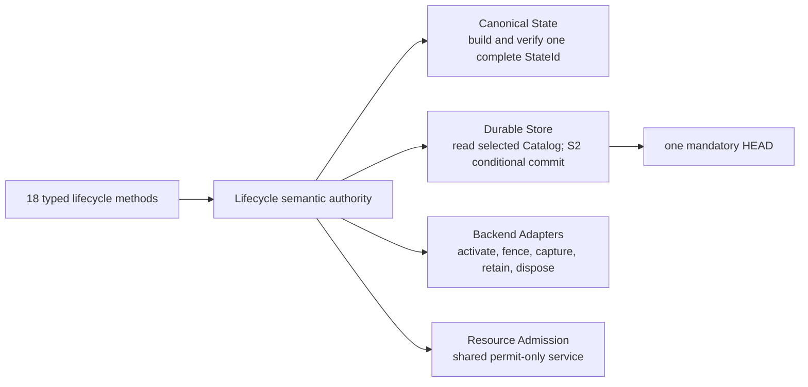

# Lifecycle

> Status: **Accepted**

Lifecycle is the sole semantic authority for sandbox heads and
`HeadRevision`, workspace-session state, checkpoints, immutable fork origin,
derived checkpoint pins, quiescence, exact replay, and semantic content roots.
It defines workflows by composing the six registered storage mechanisms; it
does **not** introduce an `LC-*` mechanism family. Canonical encoding belongs
to [Canonical State](canonical_state.md), physical custody and atomic commit
belong to [Durable Store](durable_store.md), private execution belongs to
[Backend Adapters](backend_adapters.md), and the end-to-end capture sequence is
shown in [Workspace workflows](workspace_engine.md).

## Boundary and narrow ports



**Conclusion:** Lifecycle is the sole semantic decision maker and composes
one-way ports to Canonical State, Durable Store, Backend Adapters and the
permit-only service; none of those dependencies can mutate lifecycle truth in
reverse.

The ports are intentionally narrow:

| Port | Lifecycle may ask for | Lifecycle may not infer |
|---|---|---|
| Canonical State | Verify a `StateId`; build one complete candidate from exact facts; stream a portable archive. | Paths, chunks, locators or adapter facts as alternate public identity. |
| Durable Store | Use `open_read`; select one foreground `OwnerSlot[1..15]=Build {owner_nonce}` under a live permit; call `stage_objects`; submit one closed current-root `commit`. | Maintenance/recovery policy, an older arena as fallback, an unselected locator as public state, a durable Build-reservation vector, or a general transaction model. |
| Backend Adapter | Materialize and verify a private workspace; fence/drain; emit stable facts; expose a conflicted workspace read-only; synchronously dispose it. | Backend snapshots, overlays, mounts, process state or allocation locators as canonical identity. |
| Resource Admission | Acquire and release fixed permits for admitted work. | A second policy authority or an unbounded queue. |

Every adapter allocation has one acyclic operation owner. Adapter calls are
idempotent by internal operation token, but those tokens are transport and
recovery metadata—not public domain parameters.

## Durable semantic values

Lifecycle values occupy the closed Catalog namespaces defined by the
[Durable Store](durable_store.md#closed-namespaces):

| Namespace | Lifecycle value and invariant |
|---|---|
| `Sandbox` | `{StateId, HeadRevision, ForkOrigin?}`. `HeadRevision` starts at `0`; `ForkOrigin={parent_id, checkpoint_id}` is immutable. |
| `Session/Mutable` | `(sandbox_id, session_id) -> {OPENING\|ACTIVE, origin=(StateId,HeadRevision), actor_id:ActorId[32], allocation, reservation}`. Immutable `actor_id` is the authenticated principal snapshotted by the accepted create request. The reservation belongs to the private workspace allocation, not Build staging; presence is the only durable non-quiescence marker. |
| `Session/Terminal` | `(sandbox_id, session_id) -> {PUBLISHED\|CONFLICTED, allocation}`. Status fully determines `Published` versus `PublishConflict`; the Receipt holds the exact replay result. It is never a content root, and there is no `CLOSED` value. V1 requires every supported adapter to keep a conflicted allocation self-contained and readable without origin objects until explicit destruction. |
| `Checkpoint` | `(owner_sandbox_id, checkpoint_id) -> StateId`. The named state is immutable. |
| `CheckpointPin` | `(origin_checkpoint_id, child_sandbox_id) -> unit`. It is derived membership, never a counter or content root. |
| `Receipt` | `ReceiptControl(lane)->next_sequence:u64` plus `ReceiptSlot(lane,sequence mod 64)->{request_digest[32],bounded_exact_result}`. Exactly 16 controls and 1,024 modulo slots; IDs inside are inert. |

There is no durable session count, session registry root, public history,
ancestor list, refcount, mutable state manifest, `PUBLISHING` state, deletion
tombstone, phase ledger or per-session close history. Prefix presence in
`Session/Mutable` replaces duplicate counts and registries.

### Version rules

`StateId = ObjectId(FilesystemRoot)` is complete content-and-attribution
identity; there is no `StateManifest` or `StateRoot` wrapper.
`HeadRevision` is the per-sandbox ABA token. Lifecycle never uses
`StoreSequence` or `ArenaId` as semantic versions.

- Every `Published` decision increments `HeadRevision`, including publication
  of a content-identical `StateId`.
- Every actual rollback increments it; `AlreadyCurrent` does not.
- Every `Committed` fork commit increments the parent revision.
- `NoChanges`, `ParentDiverged` and every other no-head-change result leave it
  unchanged.
- Revision arithmetic is checked. Exhaustion fails closed before an effect.

## Invariants

1. A live sandbox head names exactly one complete, verified `StateId`.
2. An S2 commit may expose a `StateId` only after every selected immutable
   dependency is durable.
3. A mutable session has one immutable exact origin pair
   `(StateId, HeadRevision)`.
4. Publication is strict-origin compare-and-swap, never rebase, merge, squash
   or retry against a later head.
5. A fork has one immutable immediate-parent/checkpoint binding. Fork commit
   changes neither the binding nor its derived pin.
6. The same per-sandbox gate serializes `Session/Mutable` insertion with every
   quiescence prefix check.
7. Checkpoints name committed state only; private session changes are absent.
8. Logical deletion never cascades. Physical collection follows explicit
   semantic and temporary roots.
9. Every post-acceptance semantic outcome has an exact retained receipt in the
   same S2 commit as its effect, or in a receipt-only S2 commit.
10. A read result is derived from one captured head or checkpoint under one
    bounded `ReadSlot`; no operation silently switches to another state.

## Quiescence and gates

`Session/Mutable` prefix absence is the only durable proof of quiescence. An
`OPENING` or `ACTIVE` row blocks. Publication keeps its row `ACTIVE` while a
transient operation owner fences the adapter, so it also blocks. Terminal rows
do not block.

| Operation | Prefixes required empty |
|---|---|
| `fork_sandbox` | Source sandbox |
| `rollback_sandbox` | Target sandbox |
| `destroy_sandbox` | Target sandbox |
| `commit_fork` | Child and immediate parent |

The gate implementation uses fixed shards or bounded handles and retains no
unbounded sandbox map. Multi-sandbox operations acquire gates in ascending
`sandbox_id` order and release them in reverse. Under the gate, Lifecycle
reads the selected root, verifies every required prefix empty, and includes
only those bounded row/prefix facts in its S2 condition; it does not CAS the
identity of an otherwise unrelated global root. A failure returns
`WorkspaceSessionsActive`; it never waits and never partly commits.

Checkpoint creation and committed-state export do not require quiescence.
They capture a complete committed `StateId`; later publication cannot change
the captured value.

## Semantic roots and retirement

The exact content-root set is:

```text
Rsem = every live Sandbox StateId
     U every Checkpoint StateId
     U every Session/Mutable origin StateId
```

Every `ActorId`, allocation/reservation handle, Terminal row, receipt,
provenance ID and `CheckpointPin` is inert for content reachability. V1
therefore admits an adapter profile only after the
profile proves that a retained conflicted allocation remains self-contained
and readable without canonical origin objects across its crash matrix. An
adapter that cannot prove that property is unsupported; Lifecycle does not add
a conditional origin edge to compensate. Temporary physical roots—16
`OwnerSlot`s, 64 `ReadSlot`s, and one maintenance epoch—are defined by the
Durable Store and do not change lifecycle meaning.

Semantic retirement is explicit and atomic:

- `remove_checkpoint` deletes the named root only if no derived child pin
  exists;
- `destroy_sandbox` deletes only that sandbox head and its child-origin pin;
  it neither deletes owned checkpoints nor cascades to children;
- `destroy_workspace_session` deletes its Mutable or Terminal row only after
  private allocation disposal has been durably synchronized.

Named checkpoints never expire silently. The destroy S2 commit immediately
releases the Terminal row and its bounded session/Catalog capacity; a Terminal
row never occupied semantic-root capacity. The separate fixed receipt-ring
charge remains only until normal window advance overwrites that receipt. No
tombstone keeps the session alive. The exact logical-to-physical
reachability closure and reclaim algorithm are in
[Durable Store](durable_store.md#exact-gc-and-repack).

An optional TTL/last-N controller is external policy: it may call only the
existing remove/destroy methods for checkpoint/session IDs it created and
owns, must skip `CheckpointInUse`, never remove a manual checkpoint, and keep
its registry externally and finitely bounded with safe behavior on registry
loss. It adds no Store namespace, API or implicit retention rule.

## Exact bounded receipts

Replay metadata is two closed subtypes of the existing Receipt namespace:
exactly 16 `ReceiptControl(lane)->next_sequence:u64` rows (initially zero) and
exactly 1,024
`ReceiptSlot(lane,sequence mod 64)->{request_digest[32],bounded_exact_result}`
rows. The complete canonical framed slot value is at most 512 bytes. A slot
stores no sequence, generation, low-water mark or duplicate lane field.

For every post-acceptance semantic outcome, including a no-effect result such
as `CheckpointInUse`, Lifecycle asks S2 to commit either:

```text
semantic effect + exact receipt
```

or:

```text
no semantic effect + exact receipt
```

A new request is accepted only when `sequence==next_sequence`; a future gap is
a typed transport rejection. The retained range is
`[max(0,next_sequence-64),next_sequence)`. A retry in it performs one modulo
slot lookup, verifies `request_digest`, and returns the exact result without
rereading semantic state. An older sequence returns `ReplayExpired` and never
executes. S2 atomically selects the effect (if any), slot value and
`next_sequence+1`. Authentication failure, malformed framing and admission
rejection before semantic acceptance may remain unstored. Result framing is
bounded so oversized detail becomes a typed bounded error before commit. The
durable ring is cache-off; only one control/slot replay working set may be
resident.

## Workflow transition table

These transitions are Lifecycle compositions, not additional custom storage
mechanisms.

| Method | Preconditions and one S2 effect |
|---|---|
| `create_sandbox` | Verify the canonical empty state or one portable archive, then insert `Sandbox{StateId,0}` plus receipt. |
| `create_checkpoint` | Capture the selected sandbox `StateId`, insert an immutable owned checkpoint plus receipt. Active sessions may coexist. |
| `remove_checkpoint` | Require no matching `CheckpointPin`; delete the checkpoint plus receipt, or commit receipt-only `CheckpointInUse`. |
| `rollback_sandbox` | Under target quiescence, require owned checkpoint. Equal state records receipt-only `AlreadyCurrent`; otherwise replace the head, increment revision and record `RolledBack`. |
| `fork_sandbox` | Under source quiescence, validate an explicit source-owned checkpoint or atomically create the omitted checkpoint; insert child at its state with revision `0`, immutable `ForkOrigin`, derived pin and receipt. |
| `destroy_sandbox` | Under target quiescence, delete the sandbox and its derived origin pin plus receipt. Owned checkpoints and children remain. |
| `destroy_workspace_session` | Conditionally claim `OwnerSlot/AdapterClose`; fence/drain; dispose and sync; then one S2 commit deletes the exact Mutable or Terminal row, stores `Destroyed` or `AlreadyClosed`, and clears the intent. |

Read/list calls use bounded pagination at the transport boundary and do not
create semantic effects. Full API signatures and typed results are owned by
[API methods](../api_methods.md).

## Workspace creation

Creation reserves permits and snapshots the accepted request's authenticated
principal as one immutable `ActorId`. It records
`Session/Mutable/OPENING`, that actor and the exact origin in one S2 commit,
then asks the selected adapter to materialize and verify the private
allocation. The completion commit changes only `OPENING` to `ACTIVE` and
records the terminal create result. Capture and every retry read the actor
from that exact selected row; they never consult an ambient publish caller.
If activation fails, Lifecycle first disposes and syncs the partial
allocation, then deletes the Mutable row and stores
`WorkspaceActivationFailed` in one S2 commit. There is no `CLOSED` row.

Because an `OPENING` row is already the quiescence marker and semantic origin
root, rollback, fork and sandbox destruction cannot race activation. Recovery
replays adapter activation or disposal idempotently from the bounded owner;
it never guesses that a workspace exists from filesystem debris.

## Strict-origin publication

The session remains durably Mutable/`ACTIVE` throughout transient fencing and
capture. The operation owner admits one publication, rejects concurrent
commands/writes, drains admitted adapter work, and builds a complete candidate
strictly from the immutable origin pair. Before creating any candidate file,
Store selects one empty foreground lane `OwnerSlot[1..15]` as
`Build {owner_nonce}`. The key selects its foreground grammar/quota; a 16th
simultaneous foreground owner receives bounded `RetryLater`. A live admission permit—not that
durable row—owns the complete byte/inode reservation. The exact nonce owns all
files in that slot's fixed staging directory until the successful decision
transfers their selected locators or synchronized abort clears the row.

Only the final decision is Lifecycle pseudocode; capture and S3 Full-base
revalidation are delegated to the linked authorities.

```text
PUBLISH_WORKSPACE_SESSION(session_id, accepted_request):
    operation_owner = acquire_scoped_transient_session_owner(session_id)
    prior = retained_receipt(accepted_request)
    if prior exists: return prior

    session_key, session = require exact Session/Mutable by session_id == ACTIVE
    adapter.fence_new_work_and_drain(session.allocation)
    candidate_permit = resource_admission.acquire_complete_candidate_claim()
    build = durable_store.select_foreground_build_lane(
        fresh_owner_nonce(), candidate_permit)  # one of lanes 1..15

    candidate = workspace_workflow.capture_complete_candidate(
        session_key = session_key,
        active_session = session,
        fenced_allocation = session.allocation,
        owner_slot = build.slot,
        owner_nonce = build.owner_nonce,
        live_permit = candidate_permit)

    # Against the current root, S2 first checks the exact session/build facts
    # and current sandbox origin. Only on an origin match does it stream the
    # owner-staged candidate-selection cursor, deriving each Delta base_id from
    # its locator. It does not exact-CAS unrelated global Catalog identity.
    decision = durable_store.conditional_commit(
        expected_session = (session_key, session),
        expected_build = (build.slot, build.owner_nonce),
        candidate_StateId = candidate.StateId,
        selection_cursor = candidate.selection_cursor,
        accepted_request = accepted_request):
        require Session/Mutable(session_key) == session
        require build.slot in 1..15 and exact Build(build.owner_nonce) selected
        current = require Sandbox(session_key.sandbox_id)

        if (current.StateId, current.HeadRevision) == session.origin:
            revalidate every REUSE and derived Delta base before installation;
              if any vanished, leave this gate and request complete recapture
            stream the candidate cursor in ObjectId order; keep a structurally
              valid current exact row when present, else a staged locator;
              never replace a current Full with a staged Delta
            install only staged segments with positive selected_count
            current.StateId = candidate.StateId
            current.HeadRevision = checked_increment(current.HeadRevision)
            delete Session/Mutable(session_key)
            insert Session/Terminal(session_key) = {
                PUBLISHED, allocation = session.allocation
            }
            # Terminal deliberately drops origin, actor_id and reservation.
            clear exact Build(build.owner_nonce)
              in this same selecting HEAD
            store exact Published receipt
            return Published

        else:
            select no candidate locator
            delete Session/Mutable(session_key)
            insert Session/Terminal(session_key) = {
                CONFLICTED, allocation = session.allocation
            }
            # Terminal deliberately drops origin, actor_id and reservation.
            retain exact Build(build.owner_nonce)
            store exact PublishConflict receipt
            return PublishConflict

    if decision == Published:
        # Locator selection and exact-nonce clear were one atomic HEAD. The
        # cursor was joined/deleted/synced before HEAD and the remaining
        # candidate charge has transferred to selected storage.
        release candidate_permit
        adapter.dispose_and_sync(session.allocation) before normal acknowledgement
        return Published

    # PublishConflict's semantic HEAD intentionally retained exact custody.
    # No replay or response passes the operation owner before this completes.
    durable_store.abort_build(build):
        fence_and_join_candidate_producer(build.owner_nonce)
        delete every fixed-directory file while exact Build remains selected
        sync the fixed staging directory
        S2 exact-CAS-clear Build(build.owner_nonce)
        release its live allocation charge and permit
    return PublishConflict
```

Let `K=|U_candidate|<=N_object_max`, `K_delta<=K`, and `H<=8` be the
deployment-frozen admitted candidate count, Delta count and S1 height. The
origin-mismatch decision is bounded row/receipt work and does not open the
selection cursor. An origin match is
`Theta(KH + K_delta + selected-candidate-pack install/sync work)`, including
cursor consumption, sparse S1 construction and staging-scratch deletion plus
directory synchronization. It is not an `O(1)` selector or a
repository-size-independent pause. Admission rejects the candidate before
selection if its checked post-commit Catalog relation would exceed
`N_object_max`, the frozen Catalog capacity, or its complete byte/inode and
scratch claims.

On `Published`, the adapter allocation is synchronously disposed and its
destructive transition synchronized after the selecting S2 commit and before
normal acknowledgement. The bounded terminal cleanup handle makes that step
idempotently recoverable if the process crashes; it is not a content edge and
does not mean the allocation remains live. The same successful HEAD selects
every needed staged locator or already-selected exact row and clears the Build
nonce atomically. A candidate segment is installed only when its O(1) final
count is positive; a zero-selected late-dedup segment is deleted and synced,
while dead duplicates inside a mixed segment remain charged for bounded repack.
On `PublishConflict`, the semantic HEAD selects no candidate locator, retains
the exact Build nonce, and leaves the self-contained private allocation fenced
and read-only until explicit destruction. Lifecycle then fences/joins the
candidate producer, deletes every staged file and synchronizes the fixed
directory while that exact nonce is still selected, clears the nonce in a
final exact S2 commit, and only then releases its charge and acknowledges.
Crash recovery holds Build custody through the complete installed-pack census
and orphan cleanup before fixed-directory deletion/clear, so receipt replay
cannot outrun cleanup. If any current-root REUSE or Delta base vanished, Store
publishes and installs nothing: while the workspace stays fenced and the same
Build is selected, it joins producers/readers, deletes and syncs the complete
cursor, candidate packs and scratch, then reruns the complete two-pass capture
against the current Catalog. It may recapture once; a second invalidation
ordered-aborts and returns transport `RetryLater` with the session still
`ACTIVE`. It never locally upgrades one stale classified object to Full or
installs a dangling Delta. A live pre-HEAD failure unlinks and syncs every known
newly installed destination before Build clear. There is no locator pin,
relocation stream or per-publisher immovability rule.

Failure before final decision leaves the durable session `ACTIVE`; the
operation owner fences and joins the producer, deletes and directory-syncs all
staged output while the exact Build nonce remains selected, then uses one S2
commit to exact-clear the nonce and store any required accepted failure
receipt. It releases the charge before it either safely resumes the session or
returns that bounded typed capture failure. A selected
`OwnerSlot[0]=Build {owner_nonce}` row is the full write-side S2 fence, so any
non-maintenance StoreSequence-changing final commit returns bounded transport
`RetryLater` for its entire trace/sort/copy/dense-build window; capture may
continue but cannot finalize. That outcome is outside the three domain
publication results and never permits blind rebase.

Outside a selected maintenance fence, an unrelated sandbox, OwnerSlot or
receipt commit may advance `StoreSequence`
between capture and this gate without causing a semantic conflict. The gate
merges the bounded typed change into the latest root when this sandbox's head,
session row and receipt lane still match. Strict-origin still forbids rebasing
the workspace onto a later head; only physical Catalog selection is refreshed.

`AlreadyPublished` applies to a later accepted semantic call that observes an
existing Terminal/`PUBLISHED` row. Replay of the original operation ID returns
its exact stored `Published` result.

## Session destruction

Destruction uses the existing bounded ownership machinery; there is no close
namespace, close ledger or seventh custom mechanism. It performs this order
exactly:

1. in one S2 commit, condition on the exact Mutable or Terminal row and claim
   one of the existing 16 slots as
   `OwnerSlot/AdapterClose {session_id, expected_row_digest,
   request_identity}`; derive the allocation handle only from that selected
   row;
2. take the close fence, stop new adapter work and drain every admitted writer,
   command and mapping;
3. synchronously and idempotently dispose the private allocation, including a
   retained conflicted allocation, then synchronize its destructive transition;
4. in one final S2 commit, recheck the exact row digest, delete that row, store
   the bounded exact result receipt and clear the close intent atomically.

Deleting a live Mutable or retained conflicted allocation returns `Destroyed`.
Deleting a published terminal whose private allocation was already disposed
returns `AlreadyClosed`. A retained replay returns the original result. After
the row is gone and its receipt has expired, there is deliberately no durable
session history; a new lookup returns `WorkspaceSessionNotFound`.

A selected close intent is a durable recovery instruction. Recovery fences the
allocation and idempotently completes disposal and the final conditional
delete; the exact session row stays selected until that final commit, but a
Terminal row is never a content root. An unused intent may be cleared only
before any irreversible disposal. A digest mismatch fails closed rather than
deleting a replacement row. This ordering prevents an undiscoverable private
allocation; the V1 self-contained-conflict qualification independently makes
origin collection safe.

The separately non-borrowable `D_root_ctl/I_root_ctl` reserve covers every
coexisting S1/S2/control allocation across this complete intent, disposal,
final delete/receipt/intent-clear workflow and all recovery cuts—not one sparse
Catalog path. Once used, root-control operations are serialized and normal
writable readiness stays closed until obsolete-page/control cleanup,
parent-directory synchronization and complete reserve restoration finish.

## Ordered fork commit

Let `B` be the state of the child’s immutable origin checkpoint, `C` the state
of the explicit child-owned checkpoint, and `P` the immediate parent’s current
state. Parent and child gates are held in ascending ID order, both Mutable
prefixes are empty, and the exact records are S2 conditions.

```text
COMMIT_FORK(child_id, child_checkpoint_id, accepted_request):
    child = require live fork(child_id)
    candidate = require checkpoint owned by child(child_checkpoint_id)
    parent = require live sandbox(child.ForkOrigin.parent_id)
    base = require checkpoint(child.ForkOrigin.checkpoint_id)

    P = parent.StateId
    C = candidate.StateId
    B = base.StateId

    if P == C: result = AlreadyCurrent
    else if C == B: result = NoChanges
    else if P == B:
        parent.StateId = C
        parent.HeadRevision = checked_increment(parent.HeadRevision)
        result = Committed
    else: result = ParentDiverged

    S2 commit changed parent, if any, and exact result receipt
    return result
```

The order is normative. In particular, `P == C` wins even when `C == B`.
Fork commit creates no checkpoint, merge, rebase, public history or ancestor
record and never changes the child binding or pin.

## Crash boundaries

| Crash point | Required recovery result |
|---|---|
| Before immutable candidate dependencies are durable | No semantic effect; recovery fences/joins the producer, deletes and directory-syncs partial output while the exact Build nonce remains selected, exact-clears it, then releases the charge. |
| After candidate durability, before the publication S2 decision | Old semantic state remains selected; candidate stays owned by the exact Build nonce through the same delete/sync/clear recovery order. |
| After `PublishConflict` HEAD selection, before candidate cleanup | Terminal/`CONFLICTED` and its exact receipt are selected with no candidate locator; the exact Build nonce remains selected until recovery deletes/syncs its files and exact-clears the row before readiness. |
| After `Published` HEAD selection, before allocation disposal | Candidate locators and Terminal/`PUBLISHED` are selected and the exact Build nonce is already cleared atomically; recovery idempotently disposes and synchronizes the private allocation before readiness. |
| After HEAD rename, before directory sync or acknowledgement | Recovery validates the mandatory HEAD and dependencies; it either recognizes the complete selected commit or fails closed, never elects the Auxiliary arena. |
| After a no-effect semantic decision, before reply | Exact receipt returns the same result. |
| During adapter disposal | Selected `OwnerSlot/AdapterClose` and the exact session row remain; recovery fences and resumes idempotent disposal before the final conditional row delete. |
| While a read/list/export is streaming | Its bounded nonrenewable ReadSlot protects one captured root. The deadline requests cancellation; release occurs only after the batch joins and closes every old-epoch cursor/FD. A higher workflow may resume only from a logical StateId/traversal key after reproving that StateId is rooted; otherwise it returns `SnapshotExpired` or restarts. |

Lifecycle never repairs corrupt canonical or physical state by guessing. A
missing mandatory dependency is `CorruptState`/`IntegrityFailure`, and public
mutation remains unavailable until operator repair restores an unambiguous
selected state.

## Resource and quota behavior

Lifecycle requests permits; it does not own a second scheduler. All parallel
sessions share one storage-managed hard 8-MiB permit pool with a 4-MiB normal
target; one sandbox's concurrent claims are at most 4 MiB and one heavy
operation at most 2 MiB. The enclosing cgroup is qualified with
`memory.high=64 MiB`, exact `memory.max=96 MiB`, and zero swap. Fixed worker,
queue and FD admission prevents parallel sessions from multiplying these
bounds; persistent application cache is zero, and an idle session retains zero
workers, FDs, buffers or permits. Every
job-scoped disk run, cursor and Build allocation is removed or transferred
before its permit is released on success, error, cancellation and recovery.
The creation-bound `actor_id` costs exactly 32 durable bytes only in a Mutable
row, is read with that already-required row, has no per-session resident cache,
and is dropped at either Terminal transition.
Root-count,
terminal-session, workspace byte/inode and Catalog-record quotas are finite.
Checkpoint creation reserves one root/Catalog record; because it names the
current head, its immediate payload delta is zero. A later publication admits
all newly selected bytes while checkpoint-reachable old bytes remain charged,
and credits no newly unreachable bytes until exact trace/reclaim proves them.
Finite root counts plus conservative aggregate charged physical byte/inode
caps bound this without clairvoyance or refcounts. A deployment may add a
conservative logical Full-state charge, but Lifecycle claims no exact per-root
unique-byte/inode quota and grants no per-root retirement credit.

For retention pressure, Store first selects
`OwnerSlot[0]=Build {owner_nonce}`, which becomes the global
non-maintenance S2 mutation fence before it captures `MaintenanceBasis`. One
exact pass traces the complete basis and one `REWRITE_BATCH` rewrites at most
64 source packs into at most one 64-MiB output; copy-preserving repack and
selected Delta-to-Full normalization are policies of that one engine. The
write-side pause is the full
`Theta(N_object + N_pack + external-sort work + X_live)` trace/sort/copy/dense
validation window. Only its final selector is `O(1)` in repository size.
Every new foreground grant and non-maintenance final S2 mutation receives
bounded transport `RetryLater` while the row is selected. Existing foreground
builders may finish staging, close/sync resources and then wait with zero
managed buffers, FDs or workers; admitted capture and materialization continue
without finalizing. Slot `0`'s reserve is non-borrowable.

Production readiness is blocked until a frozen maximum pause, fairness,
`RetryLater` rate, memory high-water and foreground tail latency all pass at
`C_max` with exactly 1/4/8/16/32/64 parallel active sessions. This includes
the admitted maximum `K` origin-match publication gate as well as the full
maintenance fence. If exact trace
and all four `REWRITE_BATCH` policies prove no allocation-rounded progress, the
result is `ResourceLimitExceeded(storage_retention)`. Lifecycle never removes
a semantic root or borrows the Durable Store’s non-borrowable maintenance
reserve.
`PortableAccounting` and `EnforcedQuota` claims are qualified only by Backend
Adapters.

## Public method ownership

This component implements the semantics of exactly the 18 lifecycle methods
listed in [API methods](../api_methods.md#lifecycle-methods). Runtime execution
and file access are mapped by Backend Adapters. Lifecycle introduces no generic
selector, layer API, workspace fork, rollout, freeze, history, merge or
ancestor-list operation.

## Primary references

- [RFC 2104: HMAC](https://www.rfc-editor.org/rfc/rfc2104) — authenticated
  replay-lane binding.
- [RFC 8949: Concise Binary Object Representation](https://www.rfc-editor.org/rfc/rfc8949)
  — deterministic bounded receipt framing profile.
- [Linux `rename(2)`](https://man7.org/linux/man-pages/man2/rename.2.html) and
  [`fsync(2)`](https://man7.org/linux/man-pages/man2/fsync.2.html) — the
  filesystem primitives composed by S2; the Durable Store, not Lifecycle,
  owns their crash protocol.
