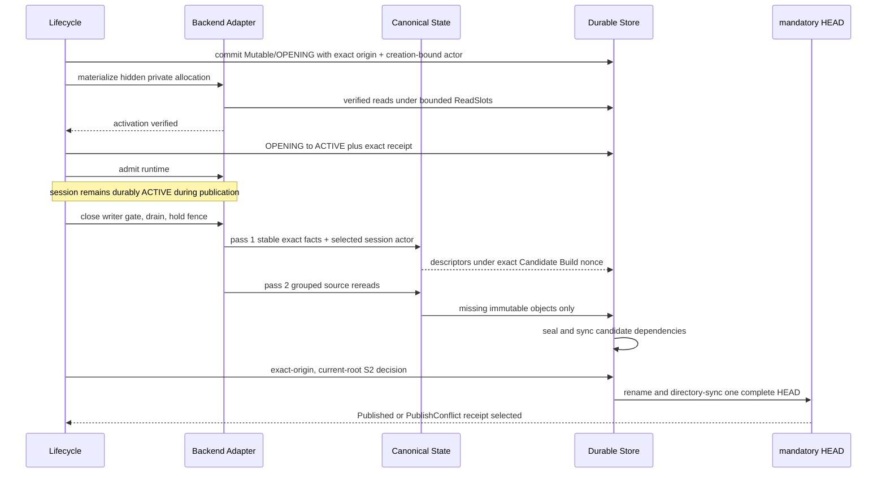
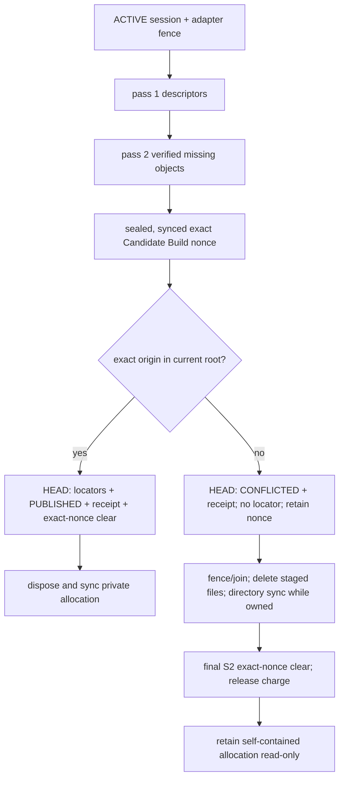

# Workspace workflows

> Status: **Accepted**

This document is a workflow view, **not a fifth domain component**. There is no
Workspace Engine authority, durable workspace catalog, or `WS-*` mechanism
family. A private workspace is an adapter-owned physical allocation coordinated
by [Lifecycle](lifecycle_engine.md), encoded by
[Canonical State](canonical_state.md), stored by
[Durable Store](durable_store.md), and bounded by the one shared permit-only
Resource Admission service.

## Ownership map

| Concern | Sole authority | Workflow responsibility |
|---|---|---|
| Session origin/status, quiescence and final publish result | Lifecycle | Carry the exact session and operation context; never alter it locally. |
| Canonical path/content/attribution identity | Canonical State | Feed stable facts to the canonical builders; never invent an adapter identity. |
| Locators, candidate ownership, S3 dependencies and HEAD selection | Durable Store | Under one live foreground permit hold an exact slot `1..15` `OwnerSlot/Build {owner_nonce}`; select nothing until the strict-origin S2 decision. |
| Private allocation, execution fence, fact capture and disposal | Backend Adapter | Use only capability-qualified operations for its profile. |
| Workers, queues, buffers, FDs, disk and inode admission | Resource Admission | Acquire a complete bounded claim before work and release it deterministically. |

The durable sources of truth are only `Session/Mutable`,
`Session/Terminal`, the exact fixed `OwnerSlot` row and the selected Catalog.
The slot key supplies its fixed quota and grammar, so the Build row contains
only `{owner_nonce}`. Slot `0` is the non-borrowable maintenance lane; slots
`1..15` are foreground-only `Empty | Build {owner_nonce} | AdapterClose` lanes.
The live permit owns the reservation, and recovery reconstructs actual staged
allocation before aborting it. There is no separate
projection manifest, phase ledger, recovery journal, mutable-session count,
candidate-locator map or detached cleanup task. An adapter allocation handle is
opaque, bounded recovery metadata, not public or canonical state.

## End-to-end flow



**Conclusion:** workspace publication is a composition of the four domain
authorities. Lifecycle owns the decision, the adapter owns the private
allocation and fence, Canonical State owns identity, and Durable Store exposes
the result only through one complete S2-selected HEAD.

The public head always changes from one complete `StateId` to another complete
`StateId`, where `StateId = ObjectId(FilesystemRoot)`. There is no
`StateManifest` or `StateRoot` wrapper. Structural sharing occurs between
immutable canonical objects. There is no visible base-plus-layer stack,
logical delta chain, squash, autosquash, remount or merged working view.

## Materialize one complete state

Materialization is a full logical realization of the origin into one private
writable namespace. It may reuse qualified adapter facilities physically, but
correctness has a streaming portable fallback. Reflink and FUSE use is
prohibited, including optional fast paths. A permitted adapter/runtime
snapshot, overlay, storage-driver or VM-snapshot accelerator is internal only
and never supplies identity, retention, quota, publication or recovery proof.

```text
MATERIALIZE(origin_StateId, allocation_handle, admitted_claim):
    require admitted_claim covers bounded buffers, worker, FDs, bytes, inodes
    require allocation is hidden and writer admission is closed
    require allocation owns a hidden control directory that is a sibling of
        the exposed root on the same filesystem and is unreachable by the user

    with bounded ReadSlots:
        root = fetch and verify FilesystemRoot against origin_StateId
        require origin_StateId == ObjectId(root)
        for each C1 entry in canonical path order:
            fetch only the container/C2/DataChunk objects needed to realize
                path, kind, hardlink topology, metadata, DATA and HOLE
            verify every fetched object against its expected versioned type
                tag and ObjectId
            ignore EntryValue.metadata_owner when applying filesystem facts
            if entry is a HardlinkGroup occurrence:
                anchor = hidden_control / encode(group_ObjectId)
                if descriptor-relative O_EXCL creation of anchor succeeds:
                    populate and verify the complete inode, then sync it
                else require the controlled anchor already exists
                linkat(anchor, exposed occurrence path)
            else:
                adapter.apply_fact_descriptor_relative(allocation, entry)
            for each RegularFile or HardlinkGroup container encountered:
                carry its typed ByteAttributionRoot ObjectId opaquely
                do not fetch or decode ByteAttributionLeaf/Internal objects

    adapter.apply child content before parent directory metadata
    unlink every hardlink anchor and sync the hidden control directory
    adapter.verify containment, supported fact profile, bytes and inodes
    adapter.sync_activation_transition(allocation)
    return bounded verified allocation handle
```

Canonical admission has already verified each hardlink group's sorted member
set and `member_set_digest`; the materializer does not sort or revalidate that
semantic invariant. The controlled `O_EXCL` anchor is the constant-memory
first-occurrence test. A single streaming materializer finishes and syncs an
anchor before a later occurrence can observe it. Opening session state owns the
control sibling; a crash destroys the entire incomplete allocation instead of
resuming from anchors or a materialization journal.

Materialization is deliberately a filesystem projection, not a second full
canonical-state validator. Complete attribution was verified before the
`StateId` became selectable, and the root/container hashes still bind its
typed attribution IDs. Only `file_blame`, archive verification and canonical
capture/validation dereference those IDs. Materialization neither turns owner
spans into adapter facts nor pays attribution-object read/decode cost.

Path traversal and fact realization rules belong to
[Backend Adapters](backend_adapters.md). Canonical ordering and identity belong
to [Canonical State](canonical_state.md). Store reads take 30-second absolute,
nonrenewable `ReadSlot`s. A deadline cancels the current batch; the slot
releases only after cancellation joins and all old-epoch cursors/FDs close. A
higher workflow may reacquire only from
`{StateId, canonical_traversal_key}` after proving that exact StateId remains a
semantic root in the new basis. Otherwise it returns `SnapshotExpired` or
restarts the public operation; no physical locator survives the boundary.

For payload size `B` and projected filesystem fact count `F_projection`
(including hardlink occurrences), portable materialization costs exactly
`Theta(B + F_projection)` source/store and filesystem work, fixed admitted
stream buffers, and a private ordinary-file allocation proportional to the
realized facts. It has no hardlink sort, alias scratch or per-group resident
map. Byte-attribution-node bytes and span count are absent from this workflow's
I/O term because their IDs are not dereferenced. A backend may report
`EnforcedQuota` only when it proves a unique allocation scope enforcing both
bytes and inodes; otherwise this workflow reports `PortableAccounting`.

## Stable adapter capture

Publication first acquires one transient operation owner, closes command and
write admission for that session, and drains all admitted commands, writable
handles and writable mappings. The adapter then holds an exclusive stability
fence while it emits a complete, deterministic fact stream. Sibling sessions
may continue independently.

Each fact includes the raw relative path bytes, parent relation, node kind,
portable metadata and exact type-specific data required by the selected adapter
profile. Regular files include logical length plus data/hole extents so sparse
holes remain distinct from allocated zero bytes. Hardlink occurrences are
scoped to the private allocation. Unsupported facts fail before candidate
selection; they are never silently normalized.

The adapter obtains a stability token before and after each pass. A mismatch,
writer escape, quota overflow, symlink-containment failure or incomplete fact
stream invalidates the candidate and leaves the durable session `ACTIVE`. The
workflow either safely resumes the writer gate or retains it fenced for a
bounded typed failure; it never publishes a partially stable scan.

## Portable two-pass candidate preparation

The baseline is deliberately independent of filesystem journals.

```text
PREPARE_CANDIDATE(session_key, active_session, fenced_allocation,
                  owner_slot, owner_nonce, live_permit):
    require exact durable Session/Mutable(session_key) == active_session == ACTIVE
    require active_session.actor_id is the immutable ActorId snapshotted from
        the authenticated create-workspace-session request
    require adapter fence proves stable private facts
    require owner_slot is a foreground lane 1..15 and selects exact
        Build(owner_nonce)
    require its fixed directory was empty before selection/file creation
    require live_permit—not the Build row—owns the frozen Candidate
        byte/inode reservation and complete bounded resource claim

    PASS 1:
        stream every stable fact and at most B_scan source payload bytes
        build canonical C1/C2/C3 objects with bounded buffers and charged runs
        emit a disk-backed sorted U_candidate stream of distinct typed object
            descriptors and one complete candidate
            StateId=ObjectId(FilesystemRoot) under the exact Build nonce
        pass active_session.actor_id to Canonical State for changed metadata
            ownership and every unmatched or changed C3 run

    PASS 2:
        classify each descriptor exactly once into disjoint disk-backed
            U_reuse or U_missing streams
        group source descriptors by immutable interval and Store reads by
            Catalog/pack locality
        reread at most B_scan source payload bytes
        for each object in U_reuse exactly once:
            reconstruct and compare its complete selected canonical bytes
            account every physical frame/anchor byte read in P_reuse
        for each object in U_missing exactly once:
            write Full, or qualified depth-one S3 DATA Delta
            account record, pack and allocation framing in P_new

    seal candidate PackSegments in the fixed staging directory
    merge U_reuse and U_missing into one owner-staged, sorted selection cursor:
        emit (ObjectId, REUSE) for each U_reuse descriptor
        emit (ObjectId, candidate locator) for each U_missing descriptor
        order candidate frames globally by ObjectId and make every segment one
            contiguous cursor interval
        consume and synchronously retire the input runs; retain no second list
    sync every candidate dependency while the same Build nonce is selected
    verify the adapter stability token still matches
    return {
        candidate StateId,
        exact session_key and expected active_session row,
        exact owner_slot and owner_nonce,
        bounded handle to one owner-staged sorted candidate-selection cursor
    }
```

The cursor streams every distinct candidate descriptor from Build-owned disk
as `(ObjectId, REUSE | candidate locator)`; it is never a resident vector or
durable Catalog field. A Delta locator already carries its `base_id`, so the
final gate derives and re-resolves that ID while consuming the same cursor
rather than returning a second dependency list. Candidate preparation needs
no copied Sandbox row: `session_key` identifies it and the exact selected
session row already carries the immutable origin pair and creation-bound
actor.

Let `D_select` be the cursor's exact encoded length; the live Build permit
charges its exact allocation-rounded bytes plus one inode. It has one bounded
record per distinct candidate ObjectId, so its space is
`Theta(|U_candidate|)` disk and fixed admitted cursor/merge memory; it never
becomes retained state. The final merge consumes and removes the classified
input runs, making this one cursor the only post-preparation descriptor list.

Let `C_candidate` be the sum of canonical lengths in `U_candidate`,
`C_reuse` the sum for `U_reuse`, `Delta=C_candidate-C_reuse`, `S_fact` the
encoded fact/metadata/attribution input, `P_reuse` the physical selected-Store
bytes actually read to reconstruct and compare reused objects, and `P_new` the
physical bytes written for missing objects including framing. Exact accounting
is:

```text
U_candidate = U_reuse disjoint-union U_missing
source payload reads  <= 2*B_scan
canonical comparisons = C_reuse
selected-Store reads   = P_reuse
new physical writes    = P_new
selection-cursor bytes = D_select

T_portable = Theta(B_scan + S_fact + P_reuse + P_new)
             + Theta(D_select) + C1/C2/C3 and external-sort work
```

Neither `C_reuse` nor `P_reuse` is bounded by `B_scan`: an all-empty-file tree
has zero payload bytes but nonzero directory/metadata/attribution objects, and
reconstructing one depth-one Delta may read both its Delta frame and Full
anchor. `Delta` is a canonical-byte difference, not a physical-write count.
Metadata records, external-sort runs and required syncs are charged separately.
Memory remains inside the global permit profile; descriptors spill into
charged 1-MiB runs and merge with fan-in 8.

An adapter with a capability-qualified, lossless change journal may use a
`JournalQualifiedDelta` fast path only when it proves coverage across the exact
origin interval, overflow behavior, rename/link semantics and recovery. Any
gap or overflow falls back to `PortableFullScan`. The journal is never part of
`StateId`, never a universal requirement, and never licenses a partial tree.

## Same-ID verification and single emission

The pass-1 descriptor stream is sorted by typed `ObjectId`. Duplicate
descriptors must have identical kind, canonical length and canonical bytes.
Pass 2 groups occurrences so a missing object is emitted once even when many
paths share it. If `ObjectCatalog` already contains the same ID, the workflow
reads and verifies the selected canonical content before reusing it; a hash
match alone does not excuse corrupt bytes.

Canonical State’s C2 builder bounds chunk size and descriptor fanout. C3 uses
deterministic whole-C2-run occurrence-rank attribution: each `EntryValue`
carries its metadata owner, and each `RegularFile` or `HardlinkGroup` carries
one bounded byte-attribution root. The candidate is complete even when all
objects already exist; a content-identical `Published` decision still advances
`HeadRevision`.

## S3 Full-base revalidation

S3 is an optional physical encoding for one DATA object; it never changes the
candidate `StateId`. Base selection obeys this exact sequence:

1. acquire a bounded `ReadSlot`, resolve `base_id` through its captured Catalog
   root, then select and verify that Full anchor for the same logical interval;
2. while the slot protects the read, compute and verify the bounded Delta and
   its encoding economics;
3. for an eligible Delta, write, seal and durably owner-custody only its
   candidate pack, then release the slot; otherwise release it and write Full;
4. at final publication, re-resolve `base_id` against the current selected
   root; only if it selects Full does S2 retain that row and install the target
   Delta, whose durable locator stores only `base_id`;
5. if a REUSE row vanished or any Delta base is no longer selected Full, leave
   the gate with the workspace still fenced and the exact Build still selected;
   join every producer and reader, delete and directory-sync the entire cursor,
   all candidate packs and all scratch, then rerun both complete capture passes
   against the latest Catalog under the same Build and admitted permit; never
   patch a candidate locally or perform payload I/O in the final gate;
6. allow one complete recapture; a second invalidation performs the ordered
   abort/clear sequence and returns transport `RetryLater` while the durable
   session remains `ACTIVE`;
7. on final abort, fence/join the producer, delete every staged file and sync
   the fixed directory while the exact Build nonce remains selected, then
   exact-CAS-clear the nonce and release its charge.

Read slots are temporary epoch roots; OwnerSlots own only candidate/output
packs. There is no base-locator pin or per-publisher immovability rule. A crash
cannot create the former "custody cleared, staged file still present" cut:
deletion and directory synchronization precede exact-nonce clear. A sealed
pack installed by rename but not selected by HEAD is a zero-selected-row
orphan; recovery's exact pack census synchronously removes and directory-syncs
it before readiness. No relocation record or relocation stream exists.
The S3 format, `<=32 KiB` interval bound, depth-one rule and exact savings test
are owned by [Durable Store](durable_store.md#s3-alignedsplicedelta-v1).

## Final strict-origin decision

Candidate preparation does not publish. Lifecycle’s final S2 request includes
only:

- the exact Mutable/`ACTIVE` session key and row, which carries the immutable
  origin pair;
- the exact selected foreground `Build {owner_nonce}` row;
- the candidate `StateId` and bounded handle to its Build-owned, sorted
  candidate-selection cursor;
- the exact bounded result receipt.

Foreground preparation deliberately carries no global Catalog-basis CAS.
Inside the serialized final gate, Store reads the latest selected root,
resolves the current Sandbox from the selected session key, and first compares
only its `(StateId,HeadRevision)` with the origin in that exact session row. On
mismatch it decides conflict without scanning candidate locators. On match it
makes two bounded sequential passes over the same sorted cursor. The first
revalidates every REUSE row and every Delta Full base before any candidate pack
is installed. The second performs late deduplication and installation: REUSE
keeps its valid current row; a candidate keeps a valid current exact row if one
now exists, otherwise it selects the staged row; and a current Full row is
never replaced merely by a staged Delta. Selected Catalog rows are already
payload-verified by Store admission, so this gate performs structural Catalog
checks and no payload I/O.

Candidate frames are globally ObjectId-ordered and each segment occupies one
contiguous cursor interval. The second pass therefore needs only a constant
selected-count for the current segment: install and sync it iff the count is
positive; otherwise delete it and sync staging. A partly selected pack's
duplicate frames become explicitly charged dead bytes. The gate must select
every needed staged locator or an already-selected exact current row. It joins
cursor readers and deletes/synchronizes the cursor and all non-pack scratch
while the Build remains selected before the successful HEAD clears it. If a
needed REUSE row vanished or a Delta base is no longer Full, the complete
recapture protocol above applies; there is no local upgrade. An unrelated
sandbox, OwnerSlot or receipt commit can advance `StoreSequence` without
invalidating publication. Cursor charge transfers or releases only after
synchronized deletion or successful Catalog selection plus exact Build clear.
If a failure occurs after a candidate pack rename but before HEAD selection,
the owner unlinks and syncs every known new destination, or runs the exact
installed-pack census, before clearing Build custody. Exact global
`MaintenanceBasis` CAS belongs only to dense maintenance.

Let `K=|U_candidate|<=N_object_max`, `K_delta<=K`, and `H<=8`. Admission
freezes and checks those bounds before selection. A conflict is bounded
row/receipt work and never scans `K`; an origin match costs
`Theta(2K + KH + K_delta + selected-candidate-pack install/sync work)` for two
sequential cursor passes, sparse S1 construction, Delta-base revalidation,
installed-pack durability and synchronized scratch removal. This foreground
pause is finite
but not `O(1)` in candidate size. Its frozen maximum and tail latency must pass
the same 1/4/8/16/32/64-session production qualification as maintenance.

An origin match selects each needed staged locator or already-current exact
row, clears the exact Build nonce in that same HEAD, changes the sandbox to the
candidate `StateId`, increments `HeadRevision` even for identical content, and
moves the session to
Terminal/`PUBLISHED`, and stores `Published`. An origin mismatch selects
**no** candidate locator, leaves the head unchanged, moves the session to
Terminal/`CONFLICTED`, stores `PublishConflict`, and deliberately retains the
exact Build nonce for ordered physical cleanup. There is no path-wise merge or
retry on the newer head.

A conflicting allocation remains fenced and read-only. Every V1 adapter must
prove that allocation remains self-contained and readable without canonical
origin objects across its crash matrix; a profile that cannot prove this is
unsupported. Terminal rows therefore never carry or imply an origin edge and
are never semantic roots.

## Cleanup and destroy ordering

Every candidate and allocation has one synchronous owner. No cleanup is
detached.

| Outcome | Required disposition |
|---|---|
| Pre-decision capture failure / generic Build abort | Fence/join the producer; while exact foreground `Build(owner_nonce)` remains selected, delete every fixed-directory file and sync that directory; only then exact-CAS-clear the nonce (in the same S2 as any required accepted failure receipt) and release its live charge/permit. Keep the session `ACTIVE` and resume only if safe. |
| `Published` | After consuming the cursor, join its readers and delete/sync it plus every other non-pack scratch while the exact Build remains selected; install and sync candidate packs. The selecting HEAD then transfers all candidate locators and clears the exact Build nonce atomically. Release the Build permit after charge transfer, then idempotently dispose and sync the private allocation before normal acknowledgement. Terminal keeps only its bounded allocation handle for recovery and later row retirement; its status determines the outcome and the Receipt retains the exact response. |
| `PublishConflict` | The semantic HEAD selects no candidate locator, records Terminal/`CONFLICTED` plus the exact receipt, and **retains** the exact Build nonce. Still under the operation owner, fence/join the producer, delete every fixed-directory file and sync the directory, then use a final S2 exact-nonce clear and release its charge before acknowledgement. Retain the private allocation fenced, self-contained and read-only. |
| Current-root dependency changed | Keep the same exact Build nonce selected and the workspace fenced; leave the gate, join every producer/reader, delete and directory-sync the complete cursor, candidate packs and scratch, then rerun both capture passes against the latest Catalog under the same permit. One recapture is allowed; a second invalidation performs ordered abort/clear, keeps the session `ACTIVE`, and returns transport `RetryLater`. |
| `destroy_workspace_session` | First conditionally select one existing foreground lane `1..15` `OwnerSlot/AdapterClose` intent with the exact row digest and request identity; derive the allocation only from the selected row, fence/drain, dispose and sync; then one S2 commit deletes the exact Mutable or Terminal row, stores the result and clears the intent. |

There is no durable `CLOSED` row or deletion tombstone. The close intent is a
typed use of one of the same 16 `OwnerSlot`s, not another namespace or custom
mechanism. A crash after intent selection leaves both that instruction and the
semantic row intact; recovery fences, repeats idempotent disposal, and
completes the exact delete. The exact row survives until the final commit, but
a Terminal row is not a content root. An unused intent may be cleared only
before irreversible disposal. A PUBLISHED row returns `AlreadyClosed` after
its already-disposed allocation is verified absent; Mutable/ACTIVE and
retained CONFLICTED rows return `Destroyed`.

An accepted remove or destroy enters the serialized root-control workflow.
Its separately non-borrowable `D_root_ctl/I_root_ctl` capacity covers the
largest complete semantic-nonexpanding workflow across every S1/S2 cut: a
checkpoint removal with effect, replay, or no-effect receipt-only completion;
sandbox destruction; and session destruction with the selected
`AdapterClose` intermediate plus final row-delete, receipt, and intent-clear
commit. Once that slice is used, normal writable readiness remains closed until
the workflow, obsolete-page/control cleanup, all required directory syncs, and
full reserve restoration finish. Recovery restores that reserve before
reopening writes.

## Capture and HEAD crash cuts



**Conclusion:** candidate bytes remain owner-rooted until one current-root,
strict-origin S2 decision. Success transfers locators and clears the nonce
atomically; conflict retains the nonce across its semantic decision and clears
it only after synchronized deletion. Recovery follows those selected rows and
ordered synchronous disposition rather than an older arena or detached cleanup
path.

Before HEAD selection, old public state remains authoritative. After selection,
recovery validates the mandatory HEAD, its arena/root and every dependency;
it never elects an older sequence or treats Auxiliary as an acknowledged
fallback. Stale OwnerSlots are recovered from the selected Catalog. Missing or
ambiguous dependencies fail closed.

## Bounded-resource behavior

This workflow consumes the global profile rather than defining another one:
storage-managed hard global 8 MiB, target 4 MiB; one sandbox's simultaneous
claims at most 4 MiB; one heavy operation at most 2 MiB; four workers; queue
16; total queued descriptors at most 64 KiB with zero queued payload; 128 FDs;
16 OwnerSlots split into one non-borrowable maintenance lane and 15 foreground
lanes; 64 ReadSlots. The cgroup profile is
`memory.high=64 MiB`, exact `memory.max=96 MiB`, and zero swap. Parallel
sessions share these global permits rather than multiplying buffers, maps,
workers or FDs; idle sessions retain none. Persistent application cache is
zero—only the enumerated admitted page, stream, codec, sort and control buffers
may occupy storage-managed memory. All buffers, run files, handles,
FDs, slots, workers and permits have one acyclic owner and are released on
success, error, cancellation and recovery. For Build failure, release occurs
only after producer join, staged-file deletion, directory synchronization and
exact-nonce clear.

Disk and inode checks charge every selected locator, every unselected
candidate, and every `OwnerSlot` byte and inode; root retirement grants zero
credit before exact reclaim. They also enforce classified reclaimable-debt
limits before allocation. The non-borrowable maintenance reserve is the
simultaneous sum of Auxiliary Catalog space, exact trace space, two generation
containers plus control reused across both external-sort orderings, one framed
replacement pack, HEAD/control, and the separate root-control slice. User
capture cannot borrow it.

At soft debt or capacity pressure, Store selects exact slot `0`
`Build {owner_nonce}`. That static maintenance lane is the global write-side
fence for every non-maintenance S2 mutation before basis capture, not merely a short
final-commit lock. One `REWRITE_BATCH` may rewrite at most 64 source packs into
at most one 64-MiB output. Its final selector is `O(1)` in repository size, but
the write pause spans the full `Theta(N + sort(N) + copied live bytes)` exact
trace, two external sorts, rewrite, dense build and validation. Capture and
materialization may continue. Foreground Builders that already exist may
finish staging, syncing and closing inputs, then must wait with zero buffers,
FDs and workers; no new foreground grant or final commit is admitted. Every
`StoreSequence`-changing final S2
commit—including publication and root control—returns transport `RetryLater`
while the fence is selected. Normal writable readiness reopens only after
selected maintenance output, reader drain, retirement cleanup, every directory
sync, and complete reserve restoration.

Production qualification must freeze and pass a maximum pause, fairness,
`RetryLater` rate, memory high-water and foreground tail-latency limit at
`C_max` with exactly 1/4/8/16/32/64 parallel active sessions. Failure blocks
writable production readiness; the `O(1)` selector alone is not evidence that
the maintenance path is fast under load.

## Runtime relationship

Only an ACTIVE allocation with an open adapter writer gate accepts
`exec_command`, stdin, file write or file edit. Committed reads use canonical
state; a CONFLICTED retained allocation permits bounded file reads only. The
exact eight-method mapping is in
[Backend Adapters](backend_adapters.md#runtime-method-trace), and public result
types are in [API methods](../api_methods.md#runtime-methods-8).

## Deliberate exclusions

There is no Workspace Engine component, universal changed-subtree index,
watcher-correctness dependency, projection manifest, publish phase ledger,
logical layer chain, remount, squash, background cleanup daemon, general merge,
or implicit rebase. Adapter accelerators remain qualified physical choices and
cannot alter canonical identity, exact publication, crash ordering or the
portable fallback.
