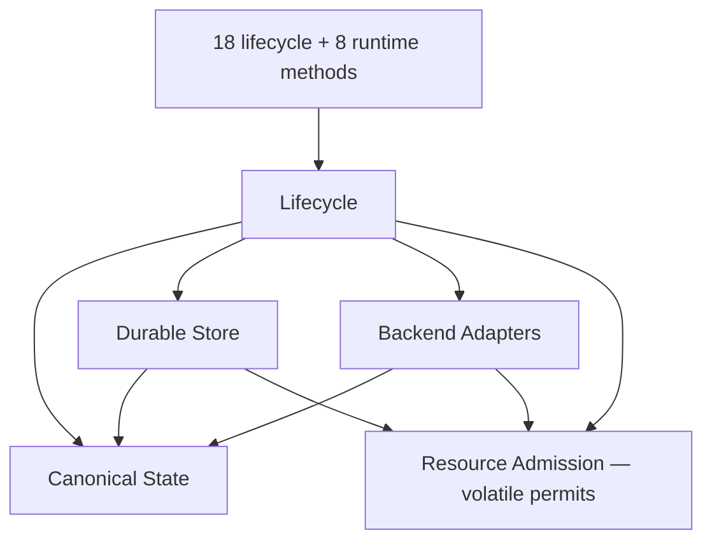

# Portable Merkle State Store

> Status: **HISTORICAL DESIGN RECORD — NOT ACCEPTED FOR CURRENT V2**
>
> “Accepted” in the documents below means accepted inside this clean-slate
> design exercise. Its PMSS owners, Merkle/CDC/chunk truth, Catalog, algorithms,
> API counts, resource service, and physical arenas are not the Phase 01
> winner. Current work uses the LayerStack-0
> [selected architecture](../../../ephemeral-sandbox-v2/architecture_design.md)
> and the [archive compatibility map](../../README.md).
>
> Original internal status: **Accepted**
> Scope: clean-slate storage design; migration 2.0 code and MPLA results are
> evidence, not the production architecture.

A sandbox points to one complete immutable state; publish builds or reuses
content-addressed objects and conditionally moves that pointer, while exact
reachability GC reclaims objects no retained pointer can reach. Structural
sharing supplies logical copy-on-write. There are no logical layers, layer
chains, squash, autosquash or squash-remount.

The design is the **Portable Merkle State Store**. “CAS” describes its
content-addressed objects; it is not a component. “MPLA” names only the
historical Stage 4.6 proof of concept.

## Exact architecture

| Kind | Exact selection |
|---|---|
| Domain components | **4**: Canonical State, Durable Store, Lifecycle, Backend Adapters |
| Shared services | **1**: Resource Admission, volatile permit-only |
| Workspace Engine components | **0**; its retained document explains composed workflows |
| Project-owned custom mechanisms | **6**: C1, C2, C3, S1, S2, S3 |
| Selected catalog roots | **1**, in one closed typed Catalog |
| Mandatory selectors | **1**: `HEAD` |
| Physical catalog arenas | **2**: Selected and one mutually exclusive Auxiliary |
| Logical layer stacks / squash operations | **0 / 0** |
| Databases / WAL / MVCC / generic KV / persistent cache | **0 / 0 / 0 / 0 / 0** |

**Conclusion:** four domain owners form an acyclic dependency graph; Resource
Admission owns no data, and no Workspace Engine component is needed.

Reducing the four owners further would mix at least two invariants: canonical
identity, physical durability/location, public state-transition policy, or
backend isolation. Resource Admission cannot be copied into those components
because independent partial permit acquisition can deadlock or over-admit.

## Read in this order

| Document | Sole authority |
|---|---|
| [System requirements](system_requirements.md) | Hard gates, prohibitions, resource and retention formulas, overload and acceptance |
| [API methods](api_methods.md) | Exact 18 lifecycle and 8 runtime signatures and outcomes |
| [Overall architecture](architecture/overall_architecture.md) | Architecture/index tournaments, boundaries and dependency direction |
| [Architecture demonstrations](architecture/mpla_demonstrations.md) | Non-normative visual and comparative evidence |
| [Canonical State](components/canonical_state.md) | Canonical facts/envelope, `StateId`, complete trees, C1, C2, C3 and attribution |
| [Durable Store](components/durable_store.md) | Packs, Catalog, `HEAD`, S1, S2, S3, recovery, readers and GC/repack |
| [Workspace workflows](components/workspace_engine.md) | Explanatory materialize, capture, publish, retain and dispose flows |
| [Lifecycle](components/lifecycle_engine.md) | Heads/revisions, sessions, checkpoints, forks, roots and exact receipts |
| [Backend Adapters](components/backend_adapters.md) | Private workspace realization, fencing, fact translation and capability profiles |

Definitions live only in the named authority. Other documents use links and
short consequences rather than restating formats or transition rules.

## Custom mechanism registry

Only project-owned non-trivial algorithms and crash protocols appear here.
Adopted primitives, wrappers, composed workflows, lifecycle decisions,
qualification suites and the fixed-vector permit service are not counted.

| ID | Mechanism | Owner | Primary target | Why it cannot be deleted |
|---|---|---|---|---|
| C1 | Canonical compressed Patricia/Merkle directory | Canonical State | `ALG` | Removing it makes directory identity order-dependent or gives early insertions rank-shift amplification. |
| C2 | `ContentTree-v1` bounded content-defined Merkle sequence | Canonical State | `ALG` | A regular file still needs one canonical ordered sparse/data sequence with locally resynchronizing metadata boundaries. |
| C3 | Deterministic whole-run attribution tiling | Canonical State | `ARCH` | Exact range attribution needs one deterministic ambiguity rule without retaining edit history. |
| S1 | Fixed-purpose immutable CoW B+ Catalog | Durable Store | `ALG` | Durable closed-schema point reads, ordered scans, sparse updates and dense builds need one bounded physical index. |
| S2 | Single-`HEAD` dependency-first commit and fail-closed recovery | Durable Store | `ARCH` | Acknowledged lifecycle effects, locators and receipts need one non-rollback selector. |
| S3 | `AlignedSpliceDelta-v1` physical DATA-chunk codec | Durable Store | `DISK` | Eligible retained hot edits otherwise pay one full chunk per retained version. |

## Adopted, composed and rejected mechanisms

| Classification | Final disposition |
|---|---|
| Adopt/wrap | Restricted deterministic [RFC 8949](https://www.rfc-editor.org/rfc/rfc8949) CBOR through low-level `minicbor`; BLAKE3-256; two frozen FastCDC profiles; OS synchronization and path-confinement primitives |
| Borrow | Patricia and B-tree structure; POS-Tree/CDMT boundary evidence; finite RCU-style readers; authenticated anti-replay information model; Git framing/repack evidence |
| Compose, not custom | Bounded external sort/merge, segment installation, materialization, fence/capture, archive stream, exact trace/repack and capability qualification |
| Replaced | Fixed-fanout sequence by C2; dual selector by S2; full-only eligible hot chunks by S3; renewable leases by 64 fixed ReadSlots |
| Merged into Lifecycle/Adapter/Store | Workspace orchestration, strict publication, checkpoint/fork/rollback/destroy policies, storage-medium qualification |
| Removed | SeqCDC, Workspace component/IDs, lifecycle custom IDs, mutable counts/registries/pin counts, durable `PUBLISHING`, projection/phase/recovery ledgers, delta search indexes |
| Prohibited | Logical layers/squash; database engines, WAL, MVCC, general KV or persistent application cache; any reflink or FUSE use; overlay/snapshot correctness dependencies |

The Catalog is a purpose-built immutable index with a compile-time closed
namespace. It is not a database: there is no query language, arbitrary
keyspace, transaction service, WAL, MVCC, page cache, memtable, tombstone,
level or hidden background compaction.

## Version vocabulary

| Term | Meaning |
|---|---|
| `StateId` | Content identity, exactly `ObjectId(FilesystemRoot)`; changes only with canonical complete-state bytes and is not monotonic |
| `HeadRevision` | Per-sandbox ABA token; advances on every `Published`, every actual rollback and every `Committed` fork commit |
| `StoreSequence` | Global selected Catalog commit sequence; advances for every typed catalog, receipt or maintenance commit |
| `ArenaId` | Physical arena identity; changes only when physical arena selection changes |

Do not use overloaded “generation.” Public vocabulary is state, `StateId`,
workspace session, publish, checkpoint, fork, rollback and materialize.

## Claim discipline and hard gates

Numbers are labelled **analytical bound**, **project measurement**, **external
measurement**, **target**, **estimate** or **hypothesis**. Historical MPLA
measurements do not establish this design’s performance, and a cache-on result
cannot support the cache-off baseline.

Correctness, exact attribution, durability, portability, finite replay,
resource admission and fail-closed recovery are gates. Architecture,
algorithmic work, time, disk and memory are separately reported optimization
targets; no weighted score can excuse a failed gate.

## Decision provenance

The final decisions are Phase 4 Attempts 1–3. Attempt 3's exact root
discovery, checked-rank trace, physical-dependency closure, edge-sort bounds,
conservative accounting, convergence order and reserve construction are the
authoritative final corrections and may not be reopened by the writer:

| Phase | Record | Task/session provenance |
|---|---|---|
| 1 | [Architecture review](refine/phase_1_architecture_review.md) | Recorded in the phase handoff |
| 2 | [Primary-source research](refine/phase_2_primary_source_research.md) | Recorded in the phase handoff |
| 3 | [Resource and scale review](refine/phase_3_resource_scale_review.md) | Recorded in the phase handoff |
| 4 | [Review synthesis and Writer Handoff](refine/phase_4_review_handoff.md) | Lead `/root`, session `019fc04c-cc15-7bd0-9f32-15e944d54659`; primary semantic/GC audit `/root/semantic_gc_algorithm_audit`, session `019fc0c5-d6eb-78e0-a26b-56160fb65b1d`; external-trace proof `/root/semantic_gc_algorithm_audit/external_trace_proof`, session `019fc0d5-d5fc-7da1-95e2-6416a4a5c3de` |
| 5 | [Writer finalization](refine/phase_5_writer_finalization.md) | Writer `/root/phase5_writer`, session `019fc0b8-5c39-7a81-962f-ac4f1c318c74` |
| 6 | [Acceptance audit](refine/phase_6_acceptance_audit.md) | Independent auditor `/root/phase6_acceptance_auditor`, session `019fc10f-e3cc-7183-8933-84c2f30fadbe` |

### Complete execution provenance

| Phase and function | Task path | Session ID or runtime record |
|---|---|---|
| Foundational coordination | `/root` | `019fbe4c-0a9c-75a2-b767-07cd3f8f653f` |
| Foundational contract and invariant review | `/root/contract_invariant_review` | `019fbfba-f9d1-7303-9b99-de33bb149a60` |
| Foundational algorithm and resource research | `/root/algorithm_resource_review` | `019fbfba-ce89-7c22-bf1c-04444acc0b3f` |
| Foundational physical-index research | `/root/index_primary_research` | `019fbfca-2ede-7882-8438-c46b32ce1864` |
| Foundational portability and simplicity review | `/root/portability_simplicity_review` | Runtime exposed no numeric session ID |
| Phase 1 owner | `/root` | `019fbff4-d312-7e43-bde1-11a3a66fd36f` |
| Phase 1 simplified-current candidate | `/root/simplified_current` | `019fbff6-7ef2-7863-90fd-211e7e86660a` |
| Phase 1 clean-slate-minimum candidate | `/root/clean_slate_minimum` | `019fbff6-9e69-75b0-9600-360f0bd99dfa` |
| Phase 1 algorithm redesign | `/root/algorithm_redesign` | `019fbff6-be63-7fe0-9421-31faca547d3d` |
| Phase 1 portability and failure review | `/root/portability_failure` | `019fc008-2100-7cc3-b454-adadf1973b22` |
| Phase 2 owner | `/root` | `019fbff4-d312-7e43-bde1-11a3a66fd36f` |
| Phase 2 canonical catalog research | `/root/research_catalog_canonical` | `019fc01a-797a-7012-a9a0-953196e0fe59` |
| Phase 2 durability and replay research | `/root/research_durability_replay` | `019fc01a-b70f-7a23-928d-339cb3c928d6` |
| Phase 2 algorithm research reuse | `/root/algorithm_redesign` | `019fbff6-be63-7fe0-9421-31faca547d3d` |
| Phase 3 owner | `/root` | `019fc04c-cc15-7bd0-9f32-15e944d54659` |
| Phase 3 GC and crash review | `/root/phase3_gc_crash` | `019fc051-8e44-7fb1-a4c7-43ed71f9a3b9` |
| Phase 3 POC optimization review | `/root/phase3_poc_optimization` | `019fc051-ce6b-71a1-8983-5bad4f76307e` |
| Phase 3 resource-formula preliminary review | `/root/phase3_resource_formulas` | `019fc051-1c65-7252-95c3-0f2ebd712900` (interrupted; conclusions were independently filtered) |
| Phase 4 lead | `/root` | `019fc04c-cc15-7bd0-9f32-15e944d54659` |
| Phase 4 CAS/Merkle simplifier | `/root/cas_merkle_simplifier` | `019fc07a-7779-7590-a082-c716a2d5ed33` |
| Phase 4 reduction and writer map | `/root/phase4_reduction_writer_map` | `019fc086-a99d-70b3-bb24-00dc380248a5` |
| Phase 4 lifecycle trace | `/root/phase4_lifecycle_trace` | `019fc086-7e65-7b12-a5af-d29cca287425` |
| Phase 4 storage red-team review | `/root/phase4_storage_redteam` | `019fc086-def9-7fa3-b623-119bd48e481a` |
| Phase 4 retention and GC audit | `/root/retention_gc_audit` | `019fc0b8-9942-7f83-b100-ab28540089e2` |
| Phase 4 semantic GC algorithm audit | `/root/semantic_gc_algorithm_audit` | `019fc0c5-d6eb-78e0-a26b-56160fb65b1d` |
| Phase 4 external-trace proof | `/root/semantic_gc_algorithm_audit/external_trace_proof` | `019fc0d5-d5fc-7da1-95e2-6416a4a5c3de` |
| Phase 5 writer | `/root/phase5_writer` | `019fc0b8-5c39-7a81-962f-ac4f1c318c74` |
| Phase 6 independent auditor | `/root/phase6_acceptance_auditor` | `019fc10f-e3cc-7183-8933-84c2f30fadbe` |

All ten documents are **Accepted** by the
[Phase 6 acceptance audit](refine/phase_6_acceptance_audit.md). The sealed
Stage 4.6 process exceeded the exact 96 MiB requirement,
so implementation qualification remains future work rather than an achieved
claim.
