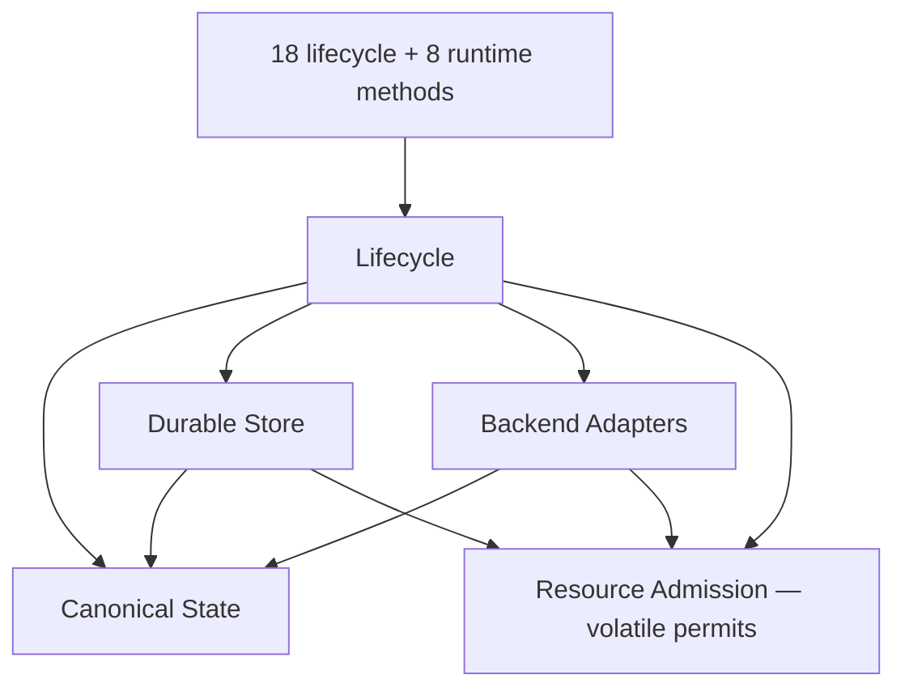

# Phase 4 — Review synthesis and writer handoff

> Owner: lead reviewer  
> Prerequisite: Phases 1, 2 and 3 PASS  
> Design-document writes: forbidden; this phase's Handoff record is writable  
> Output: one authoritative Writer Handoff

## Objective

Resolve all review and research findings into one minimum architecture. Hand
the approved decisions directly to a separate writer without asking the user
for permission.

## Required resolutions

Choose one answer for each:

- final domain-component and shared-service count;
- ownership of every durable fact;
- physical-index winner;
- sparse and dense update algorithms;
- canonical object envelope and StateId;
- canonical directory structure;
- fixed-size versus frozen FastCDC chunking;
- attribution behavior for moved or duplicated content;
- segment layout and recovery metadata;
- descriptor commit and acknowledged-generation recovery;
- object same-ID validation;
- API idempotency horizon and expiry behavior;
- portable accounting versus enforced quota;
- aggregate runtime and storage admission;
- Docker, WASI and Firecracker fact profiles;
- lifecycle and workspace publication ownership;
- final GC and maintenance-reserve protocol.

Do not give the writer unresolved alternatives. If evidence cannot select an
optimization, choose the simpler correct baseline and record a future
qualification target.

## Required simplification tables

### Component verdict

| Component | Keep, merge or remove | One owner responsibility | Replacement port | Removal failure |
|---|---|---|---|---|

### Mechanism verdict

| Current ID or name | Final name | Classification | Disposition | Reason |
|---|---|---|---|---|

### Dependency verdict

| Dependency or design source | Adopt, borrow or reject | Narrow role | Database risk | Reason |
|---|---|---|---|---|

No dependency with database behavior may be adopted.

## API and requirement traceability

Before handoff, verify:

- all 18 lifecycle methods and 8 runtime methods remain present;
- no generic ref, target or backend selector was added;
- checkpoint and fork contracts remain exact;
- commit_fork keeps its ordered four-result decision;
- multiple concurrent sessions remain supported;
- publication remains strict-origin and ABA-safe;
- prohibited mechanisms remain absent;
- impossible hard quota claims were not hidden.

Any required contract correction must include:

- contradiction;
- affected requirement or method;
- smallest correction;
- proof that user-visible semantics are preserved.

## Writer Handoff format

Hand the writer one packet containing:

1. executive storage decision;
2. final architecture and dependency graph;
3. final component and shared-service counts;
4. component ownership and replaceability matrix;
5. final custom algorithm and protocol registry;
6. complete mechanism disposition map;
7. physical-index tournament result;
8. primary-source research matrix and direct links;
9. resource formulas and overload behavior;
10. resolved crash, replay, quota and backend decisions;
11. exact edits required in each of the ten documents;
12. requirements and API traceability matrix;
13. claims that must remain targets or estimates;
14. reviewer and subagent task paths and session IDs.

For each document edit, state:

- authoritative definitions it owns;
- duplicate definitions to remove elsewhere;
- diagrams and tables to keep, replace or delete;
- algorithm pseudocode required;
- citations required;
- cross-links that must remain valid.

## Handoff action

After the packet passes this phase:

1. launch or hand off to a separate writer;
2. give the writer [Phase 5](phase_5_writer_finalization.md);
3. include the complete Writer Handoff;
4. tell the writer that decisions are final;
5. do not ask the user for intermediate approval.

## Pass gate

Phase 4 passes only when:

- one architecture is selected;
- every hard blocker is resolved;
- component and custom-mechanism counts are exact;
- every durable fact has one owner;
- the database ban is proven;
- the writer has no design decisions left to make;
- every required edit maps to one of the ten design documents;
- all task paths and session IDs are recorded.

## Handoff record

> Mutable, append-only execution record. Complete this after gate evaluation.
> On a rerun, append Attempt 2 or later; do not overwrite an earlier attempt.

### Attempt 1

| Field | Value |
|---|---|
| Status | PASS |
| Gate | PASS — all design choices are closed; the writer has no architecture decision left |
| Owner task path | `/root` |
| Owner session ID | `019fc04c-cc15-7bd0-9f32-15e944d54659` |
| Started | `2026-08-02T03:32:34Z` |
| Completed | `2026-08-02T04:17:34Z` |
| Next phase | Phase 5 — Writer finalization |
| Next phase may start | YES |

### Subagents

| Synthesis scope | Task path | Session ID | Contribution |
|---|---|---|---|
| CAS/Merkle vocabulary, versioning and minimum architecture | `/root/cas_merkle_simplifier` | `019fc07a-7779-7590-a082-c716a2d5ed33` | Reduced the public model to complete immutable states and separated logical identity from physical location. |
| Whole-design reduction, ownership audit and ten-file writer map | `/root/phase4_reduction_writer_map` | `019fc086-a99d-70b3-bb24-00dc380248a5` | Proved the four-component boundary, catalog tournament and one-authority-per-fact map; supplied the initial writer map. |
| Lifecycle, API, replay and concurrency trace | `/root/phase4_lifecycle_trace` | `019fc086-7e65-7b12-a5af-d29cca287425` | Verified all 26 public methods, found the no-op-publication ABA defect, and reduced lifecycle namespaces and receipt semantics. |
| Adversarial no-squash, GC, metadata-amplification and hot-edit review | `/root/phase4_storage_redteam` | `019fc086-def9-7fa3-b623-119bd48e481a` | Found fixed-fanout suffix amplification, selected `ContentTree-v1`, specified depth-one `AlignedSpliceDelta-v1`, and closed retained-version GC economics. |

### Final synthesis

**Writer Handoff.** The selected production architecture is the **Portable
Merkle State Store**. A sandbox head selects one complete immutable `StateId`.
Publishing constructs one complete state with structural sharing and
conditionally changes that head. Materialization traverses that one complete
state. Checkpoint, fork and rollback manipulate immutable state pointers. There
is no logical layer chain and therefore no logical squash or squash-remount.

The design has four domain components, one permit-only shared service, six
project-owned mechanisms, one selected closed typed catalog root, one mandatory
`HEAD`, and two physical catalog arenas. It adopts narrow primitive libraries
but no database, WAL, MVCC engine, generic KV store, application cache, delta
search index or history engine.

The review deliberately changed two pre-format-freeze choices after adversarial
analysis:

1. A fixed-fanout file sequence would shift ranks after an insertion near the
   front and can rewrite `Theta(n/f)` metadata pages per retained edit. It is
   replaced by the frozen bounded content-defined Merkle sequence in C2.
2. Full-only physical chunk records make every explicitly retained one-byte
   revision pay one full chunk. S3 permits one tightly bounded depth-one
   splice record against the exact preceding logical interval. It changes only
   physical custody, never `StateId`, state semantics, materialization depth or
   the public vocabulary.

All ten authoritative documents must remain **Proposed for review**. The sealed
Stage 4.6 measurements exceed the new 96 MiB limit, so this packet selects an
architecture but does not claim an accepted implementation.

### Evidence accepted

- Phase 1, Phase 2 and Phase 3 PASS packets and their recorded task/session
  provenance.
- The sealed Stage 4.6 P4 median of `58.136209 ms`, P4 input of `1,737 B`, and
  P4 object result of 44 objects / `12,188 B`; the reported “1 MiB delta” was a
  sparse logical addition with no zero-payload write.
- Campaign cgroup maximum `102,543,360 B`, which exceeds exact 96 MiB by
  `1,880,064 B`; P7 `101,289,984 B`, which exceeds it by `626,688 B`.
- The four read-only Phase 4 reviews listed above.
- Direct primary sources in the research matrix below. External designs are
  evidence, not copied persistence engines.

### Decisions and results

- Writer Handoff: complete in this Attempt 1 record.
- Selected architecture: Portable Merkle State Store; complete immutable
  `StateId`s with structural sharing.
- Domain components: exactly 4. Shared service: exactly 1 permit-only Resource
  Admission module. Workspace Engine components: 0; its document becomes
  explanatory workspace workflows.
- Custom algorithms/protocols: exactly 6: C1, C2, C3, S1, S2 and S3 below.
- Physical index: one fixed-purpose immutable CoW B+ `Catalog`, one selected
  root, one mandatory fail-closed `HEAD`, exactly two arenas.
- Logical layers, `LayerStack`, stored delta chains, squash, autosquash and
  squash-remount: 0.
- Databases, WALs, MVCC engines, generic KV stores and persistent application
  caches: 0.

### Blockers and returned work

- No Phase 4 architecture blocker remains. Phase 5 must not reopen the choices
  in this packet.
- Implementation qualification remains future work: exact 96 MiB cgroup,
  cache-off performance, crash injection, quota proofs, C2 golden vectors and
  S3 codec/GC tests are targets, not achievements.

### Files changed

- `refine/phase_4_review_handoff.md` only, as required by Phase 4.

### Output for Phase 5

- Writer task path and session ID: to be recorded by Phase 5 after a separate
  writer is launched.
- Exact per-file edit instructions: section 11 of the Writer Handoff below.
- Definitions to remove or centralize: sections 3–6 and 11 below.
- Required diagrams, tables and citations: sections 7, 8 and 11 below.
- Complete Writer Handoff reference: this Attempt 1 record.

## Writer Handoff

### 1. Executive storage decision

Use this sentence as the first explanation of the design:

> A sandbox points to one complete immutable state; publish builds or reuses
> content-addressed objects and conditionally moves that pointer, while exact
> reachability GC reclaims objects no retained pointer can reach.

`CAS` is an adjective (“content-addressed objects”), not a component. “MPLA” is
the historical Stage 4.6 proof-of-concept only. The production name is
**Portable Merkle State Store**.

Every published value is complete:

```text
StateId -> StateManifest -> complete ContentTree
```

Unchanged chunks and tree nodes are shared by identity. No published state
depends on applying a parent delta. Consequently:

- remove `LayerStack`, logical layers and any layer-depth complexity term;
- remove squash, autosquash and squash-triggered remount;
- retain backend materialization/activation of a private writable workspace;
- call exact unreachable-object collection and pack consolidation **GC/repack**,
  never squash; repack changes locators but no `StateId`;
- a physical S3 delta locator is an encoding of one already complete canonical
  chunk object, not a logical layer, version edge or delta index.

### 2. Final architecture and dependency graph



There is no `Durable Store -> Lifecycle` policy dependency. Lifecycle submits
closed typed catalog changes; Store persists their opaque values and owns the
atomic selection protocol. Capture, hashing, canonical build, pack writing and
materialization may run concurrently under permits. Only the short final
catalog/`HEAD` selection is globally serialized.

The logical/physical boundary is mandatory:

```text
logical identity                         physical custody
StateId -> ContentTree -> ObjectId  |  ObjectCatalog -> Locator -> PackSegment
                                    |                         -> Full
                                    |                         -> Delta(base Full)
```

### 3. Exact counts and vocabulary

| Item | Exact count / choice |
|---|---|
| Domain components | **4** — Canonical State, Durable Store, Lifecycle, Backend Adapters |
| Shared services | **1** — Resource Admission, volatile permit-only |
| Workspace Engine components | **0** — retain its file only as workflow documentation |
| Custom algorithms/protocols | **6** — C1, C2, C3, S1, S2, S3 |
| Selected catalog roots | **1** |
| Mandatory selectors | **1** `HEAD` |
| Physical catalog arenas | **2** — Selected and one mutually exclusive Auxiliary |
| Logical layer stacks / squash operations | **0 / 0** |
| Durable logical delta indexes / history logs / refcount ledgers | **0 / 0 / 0** |
| Databases / WAL / MVCC / generic KV / persistent cache | **0 / 0 / 0 / 0 / 0** |

Use only these version terms:

| Term | Meaning | Advance rule |
|---|---|---|
| `StateId` | Content identity: `ObjectId(StateManifest)` | Changes only when canonical complete-state bytes differ; not monotonic. |
| `HeadRevision` | Per-sandbox ABA token paired with `StateId` | Increment on every `Published` decision, including content-identical publish; every actual rollback; every `Committed` fork commit. Initial value 0. |
| `StoreSequence` | Global selected catalog commit sequence | Advances for every typed catalog/receipt/maintenance commit. |
| `ArenaId` | Physical catalog arena identity | Changes only with physical arena selection; never a sandbox version. |

Public vocabulary: `State`, `StateId`, workspace session, publish, checkpoint,
fork, rollback and materialize. Internal vocabulary: `ContentTree`, `Catalog`,
`ObjectCatalog`, `PackSegment`, `HEAD`, the four version terms, `OwnerSlot`,
`ReadSlot` and `Permit`. Delete overloaded “generation,” “snapshot lease,”
“candidate lease,” projection/phase/recovery ledgers and generic `ref`, `target`
or backend selectors.

### 4. Component ownership and replaceability

| Component/service | Verdict | Sole responsibility | Narrow boundary | Failure if reduced further |
|---|---|---|---|---|
| Canonical State | Keep | Backend-neutral canonical facts, object envelope, identity, complete `ContentTree`, payload chunking, file sequence and attribution | typed fact/object build, decode and verify streams | Identity would depend on a backend or physical layout. |
| Durable Store | Keep | Pack bytes, full/delta locators, catalog pages/arenas, `HEAD`, store recovery, physical dependency closure, retirement, GC/repack and store-medium qualification | object read/install, selected-root read, typed catalog commit, trace/rebuild | Durability/location would leak into lifecycle policy. |
| Lifecycle | Keep; absorb workspace orchestration | Sandbox heads/revisions, sessions, checkpoints, fork origin/pins, strict publication, rollback/fork/destroy, semantic roots and exact bounded replay | public API plus narrow calls to the other components | Public state transitions and strict-origin semantics would be duplicated. |
| Backend Adapters | Keep | Private workspace realization, fencing, exact fact capture, runtime isolation, retention/disposal and capability qualification | materialize, activate, fence/capture, retain read-only, dispose | Docker/WASI/VM details would contaminate canonical truth. |
| Workspace Engine | Remove as component | No unique durable fact or invariant | document becomes explanatory workflows | Removal loses no authority. |
| Resource Admission | Keep as shared service | Atomic all-or-none volatile resource-vector permits | `admit(vector) -> Permit`; RAII release | Independent semaphores can partially acquire/deadlock; merging into Lifecycle creates reverse dependencies for Store maintenance. |

One owner per durable fact:

| Fact | Semantic owner | Physical custody |
|---|---|---|
| Canonical object bytes, kinds, `ObjectId`, `StateManifest`, `StateId`, ContentTree and attribution meaning | Canonical State | Durable Store packs/catalog |
| Locator kind and target/base dependency, segment framing, catalog pages/arenas, `HEAD`, sequences and store reservations | Durable Store | Durable Store |
| Sandbox head, `HeadRevision`, session origin/status, checkpoints, child `ForkOrigin`, derived `CheckpointPin`, receipts and requested workspace quota | Lifecycle | Opaque typed Catalog values |
| Workspace files, handles, fence, runtime and actual adapter allocation | Backend Adapter | Adapter-controlled disposable allocation |
| Volatile permits | Resource Admission | No durable bytes |

### 5. Final custom mechanism registry

Exactly six project-owned mechanisms remain. All other behavior is adopted,
wrapped, composed policy or qualification evidence.

| ID | Mechanism | Owner | Purpose and invariant | Bound / failure |
|---|---|---|---|---|
| C1 | Canonical compressed Patricia/Merkle directory | Canonical State | Deterministic relative-name directory identity and subtree sharing; canonical compression and ordering are part of identity. | `O(path bytes)` build/lookup path terms under hard name/path/fanout caps; invalid/cap overflow fails before publication. |
| C2 | `ContentTree-v1` bounded content-defined Merkle sequence | Canonical State | One ordered tree for a regular file's coalesced `HOLE{len}` and `DATA{len,ChunkId}` entries; internal entries carry child ID, leaf-entry count and logical span; all sums verify. | Expected local resynchronization and `O(log n)` changed pages; honest deterministic adversarial worst case `Theta(n)`. Hard page/entry/height caps bound RAM, not amplification. |
| C3 | Deterministic occurrence-rank attribution tiling | Canonical State | Assign duplicate/moved matching runs by deterministic occurrence rank and emit coalesced current attribution, never an edit log. | Disk-backed bounded construction; ambiguity resolves deterministically or fails closed. |
| S1 | Fixed-purpose immutable CoW B+ Catalog | Durable Store | One closed typed root; sorted sparse path-copy and dense ordered bulk build; half-full non-root pages. | `P=16 KiB`, `H<=8`, two arenas, catalog physical bytes `<=4C`; cap returns typed limit. |
| S2 | Single-`HEAD` dependency-first commit and fail-closed recovery | Durable Store | All selected dependencies precede the sole selector; effect, terminal status and exact receipt share one root; acknowledged state never silently rolls back. | Fail closed on missing/corrupt/ambiguous selected data; no older-sequence election. |
| S3 | `AlignedSpliceDelta-v1` physical chunk codec | Durable Store | Optional depth-one physical encoding of a complete canonical DATA CHUNK against the exact same logical interval's verified Full anchor. `StateId` and logical traversal are unchanged. | Equal canonical lengths, target/base `<=32 KiB`; select only if framed delta `<=floor(full/4)` and saves `>=1 KiB`; reconstruct and verify exact kind/length/BLAKE3. Cycles/depth>1 fail closed. |

#### Frozen C2 format profile

- A regular file has one sequence, not separate extent and chunk trees.
- Leaf entries are canonical `DATA{len, ChunkId}` or coalesced `HOLE{len}`.
- Internal entries are `{child_id, leaf_entry_count, logical_span}`; every node
  verifies summed counts and spans.
- At every level the boundary input is
  `u16be(entry_len) || canonical_entry` frames.
- Boundary primitive: pinned `fastcdc` crate 4.0.1 `v2020`, normalization 2,
  seed/tables 0/original, min/target/max input bytes `4,096 / 8,192 / 16,384`.
- Each node reset feeds a fixed unstored prefix which participates in boundary
  hash/size: `EPS-C2-v1/leaf\0` at level 0, or
  `EPS-C2-v1/internal\0 || u8(level)` above it.
- Cuts occur only at whole-entry boundaries. A cut inside a frame extends
  through that frame; no bytes are discarded; reset before the next frame.
  EOF emits the remainder.
- Empty file has exactly one canonical empty level-0 node. Stop when a level
  has one node; collapse a single-child internal root deterministically.
- Hard limits: encoded entry `<=64 B`, entries/node `<=512`, canonical node
  payload `<=16,512 B`, root level `<=7` (eight total levels). Overflow is
  `CanonicalLimitExceeded`.
- Builder maximum is eight open `16,512 B` nodes = `132,096 B`; with one
  32 KiB payload chunk and one C2 scratch page, `181,376 B`, fitting one
  existing 256 KiB worker buffer.
- Golden vectors must cover feed sizes, EOF/cut-inside-frame, repeated entries,
  forced max/count, holes, level changes and scalar/accelerated parity.
- These numbers are a conservative Proposed-format baseline, not an empirical
  optimum. Any later change creates a new format version.

Payload FastCDC remains a separate adopted wrapper, frozen at min/target/max
`8/16/32 KiB`, normalization 2, seed/tables 0/original, reset per maximal
non-hole extent. C2 chunks *descriptor frames* into metadata nodes; payload
FastCDC chunks source bytes into DATA CHUNK objects. Do not conflate them.

#### Frozen S3 codec and GC profile

`AlignedSpliceDelta-v1` is eligible only for canonical DATA CHUNK objects,
never manifest, tree, attribution or catalog objects. Target and base canonical
encoded lengths must be equal and at most 32 KiB. The only candidate base is
the exact same logical byte interval in the session-origin file; no global
similarity search, reverse index, window or cache exists. If the origin target
is already a delta, reuse its verified `Full` anchor. The base locator must be
`Full`; dependency depth is exactly one.

The framed record is:

```text
{target_id, target_len, base_id, prefix_len, suffix_len, middle_bytes}
target = base[0:prefix_len] || middle_bytes || base[target_len-suffix_len:]
```

Prefix and suffix cannot overlap. Decode reads at most one Full base plus one
delta, reconstructs the canonical target and verifies type, length and BLAKE3
`target_id` before returning bytes. The builder uses under approximately 80 KiB
for base, target and patch. Candidate ownership pins the Full base until final
commit or abort.

GC treats logical reachability and physical dependency closure separately. For
each external delta group `(base_id, target_id, delta_bytes, full_len)`, keep
the anchor plus live deltas only while their exact total physical bytes are
strictly smaller than encoding all logically live targets Full (count an anchor
already logically live once). Otherwise, bounded repack inflates live targets
to Full, atomically replaces locators, then reclaims the now-unneeded anchor.
The `StateId` cannot change. Normalized live physical bytes therefore never
exceed the Full-only baseline. Before normalization, one admitted singleton is
at most `1.25x` Full and is charged separately. Do not introduce Git-style
delta chains, search windows or heuristics.

### 6. Complete mechanism disposition

| Current ID/name | Final classification | Disposition |
|---|---|---|
| CS-1 Canonical Filesystem Encoding | Restricted RFC 8949 envelope/profile | Adopt/wrap; remove custom ID; low-level `minicbor` only, no derive/schema choice. |
| CS-2 Canonical Merkle Radix Directory | C1 Patricia/Merkle directory | Keep as custom C1. |
| CS-3 Streamed SeqCDC File Encoding | Adopted payload FastCDC plus custom C2 sequence | Split and replace; delete SeqCDC. |
| CS-4 Canonical Attribution Tiling | C3 occurrence-rank attribution tiling | Keep as custom C3. |
| CS-5 Bounded External Canonical Build | External sort/merge workflow | Compose; not custom. |
| DS-1 Sealed Segment Installation | PackSegment workflow | Compose; not custom. |
| DS-2 CoW B+ Physical Catalog | S1 closed typed Catalog | Keep/replace as custom S1. |
| DS-3 Dual-Slot Root Commit/Recovery | S2 single-HEAD protocol | Replace; A/B election could silently roll back acknowledged state. |
| DS-4 Snapshot Lease | 64 volatile fixed `ReadSlot`s | Replace with borrowed RCU-style retirement; no durable/renewable per-reader state. |
| DS-5 Streaming Trace-Repack GC | Exact external mark/merge plus bounded policy | Compose; not custom. |
| DS-6 Bounded Receipt Replay | Fixed authenticated replay windows | Borrow RFC information model; S2 owns atomic effect/receipt selection. |
| New physical hot-edit optimization | S3 AlignedSpliceDelta-v1 | Add custom S3, depth one and DATA-only. |
| WS-1 Reserved Full Projection | Materialization workflow | Merge into Lifecycle orchestration and Adapter realization. |
| WS-2 Quiesced Stable Capture | Fence/capture workflow | Merge into Lifecycle and Adapter. |
| WS-3 Payload-Stationary Strict Publish | Strict publication workflow | Merge into Lifecycle; physical install remains Store. |
| WS-4 Bounded Stream Pipeline | Standard bounded stream/backpressure | Delete named algorithm. |
| LC-1 Linearizable Session Gate | Per-sandbox gate/transition policy | Keep semantics; remove custom ID. |
| LC-2 Committed-Root Pinning | Checkpoint transition | Keep semantics; remove custom ID. |
| LC-3 Checkpoint-Bound Fork | Fork transition | Keep semantics; remove custom ID. |
| LC-4 Quiescent Root Rollback | Rollback transition | Keep semantics; remove custom ID. |
| LC-5 Checkpoint-Conditional Fork Commit | Ordered `P/C/B` policy | Keep exact decision table; remove custom ID. |
| LC-6 Reference-Retaining Destroy | Destroy policy | Keep semantics; remove custom ID. |
| BA-1 Storage Capability Qualification | Store-medium qualification | Move to Durable Store; test/procedure. |
| BA-2 Descriptor-Relative Projection | `openat2`-based traversal workflow | Borrow OS primitive; not custom. |
| BA-3 Exact Capture Contract | Adapter fact-stream contract | Keep contract; not custom. |
| BA-4 Portable Archive Stream | Canonical stream plus Docker OCI conversion | Compose; no format selector. |
| BA-5 Adapter Identity Equivalence Gate | Qualification suite | Keep as evidence, not runtime algorithm. |
| RG-1 Atomic Multi-Resource Admission | Fixed-vector permit policy | Keep service policy; not custom. |

### 7. Physical-index tournament and database-ban proof

| Candidate | Verdict | Reason |
|---|---|---|
| Fixed-purpose immutable CoW B+ | **Select** | Bounded cache-off point/prefix reads, sorted batch lookup, sparse path-copy, dense sequential build and page density. |
| Patricia/radix physical locator map | Reject physically | Digest keys have little useful prefix sharing; retain Patricia only for canonical directories. |
| Flat sorted/static table | Borrow for runs/dense leaves | Sparse update rewrites `Theta(N)`. |
| SST/LSM | Reject | Levels, tombstones, precedence, filters, compaction, recovery and cache machinery. |
| Extendible hash | Reject | Weak ordered traversal/prefix listing and overflow complexity. |
| FST | Reject | Digest keys provide poor sharing and sparse updates rebuild broadly. |
| General database/KV | Reject | Violates closed schema, memory and architecture constraints. |
| Two catalog roots | Reject | Duplicates selection/atomicity; lifecycle effects and locators must share one root. |

S1 has a compile-time closed namespace schema and project-owned 16 KiB page
format. It has no SQL/query language, arbitrary keyspace, WAL, MVCC,
transactions-as-a-service, page cache, memtable, bloom filter, tombstones,
levels, hidden allocator or background checkpoint. Pack repack is exact object
GC, not database compaction. Use “typed catalog commit,” not a generic
transaction abstraction.

Closed namespaces are exactly:

| Namespace | Shape / retention role |
|---|---|
| `Sandbox` | `sandbox_id -> {StateId, HeadRevision, ForkOrigin?}`; live head is a semantic root. |
| `Session/Mutable` | `(sandbox,session) -> {OPENING|ACTIVE, origin pair, allocation, reservation}`; the row itself is the quiescence marker and its origin is a semantic root. |
| `Session/Terminal` | `(sandbox,session) -> {PUBLISHED|CONFLICTED,result,allocation}`; never a state root. |
| `Checkpoint` | `(owner,checkpoint) -> StateId`; each named checkpoint is a semantic root. |
| `CheckpointPin` | `(checkpoint,child) -> unit`; derived exact membership index, never an extra payload root or count. |
| `Receipt` | `(lane,ring-slot) -> {sequence, bounded exact result}`; IDs in a receipt are inert, never reachability edges. |
| `OwnerSlot` | 16 fixed physical staging/recovery owners. |
| `ObjectCatalog` | `ObjectId -> Full locator | Delta locator`; no separate State namespace. |

Opaque session/checkpoint IDs encode their lookup scope. There is no
`active_session_count`, session registry root, mutable pin count, state-history
namespace, refcount/live-set ledger or logical delta index.

### 8. Primary-source research and dependency matrix

| Source/dependency | Decision and narrow role | Database risk |
|---|---|---|
| [RFC 8949](https://www.rfc-editor.org/rfc/rfc8949) + `minicbor` 2.3.0 | Borrow deterministic CBOR rules; wrap only primitive encoding/decoding; forbid maps, floats, tags, indefinite lengths and derive-selected schema. | None |
| [BLAKE3 specification/repository](https://github.com/BLAKE3-team/BLAKE3) + `blake3` 1.8.5 | Adopt streaming BLAKE3-256 inside project type/version/length framing and official vectors. | None |
| [FastCDC paper](https://www.usenix.org/conference/atc16/technical-sessions/presentation/xia) + [`fastcdc-rs`](https://github.com/nlfiedler/fastcdc-rs) 4.0.1 | Wrap pinned `v2020` for payload and C2 frame boundaries under two frozen profiles/vectors. | None |
| [ForkBase POS-Tree, sections 3.2.2–3.2.6](https://www.vldb.org/pvldb/vol11/p1137-wang.pdf) | Primary evidence for content-defined sequence pages, counters, pattern boundaries, forced max and expected logarithmic behavior. | None |
| [Content-Defined Merkle Trees](https://arxiv.org/abs/2104.02158) | Supporting evidence for locally resynchronizing Merkle sequence structure; not a worst-case proof. | None |
| Patricia paper | Borrow compressed canonical directory design for C1. | None |
| B-tree paper | Borrow balance, ordered traversal and bulk build for S1. | None |
| [Git pack format](https://git-scm.com/docs/pack-format.html) and [git-repack](https://git-scm.com/docs/git-repack.html) | Borrow framing/delta/repack evidence only; explicitly reject chains, search windows and general pack heuristics. | None |
| OCI Image Specification | Borrow digest/descriptor and Docker conversion evidence; canonical archive remains single and backend-neutral. | None |
| POSIX/Linux `rename`, `fsync`, Rust `sync_all`; ALICE and CrashMonkey | Ground S2 dependency order, directory sync and crash testing. | None |
| Linux RCU | Borrow finite volatile reader-retirement idea only. | None |
| [RFC 4303](https://www.rfc-editor.org/rfc/rfc4303) and [RFC 6479](https://www.rfc-editor.org/rfc/rfc6479) | Borrow fixed authenticated anti-replay window information model. | None |
| `openat2`, project quota APIs and cgroup v2 | Borrow path confinement and qualified byte/inode/memory enforcement semantics. | None |
| Docker/OCI | Current adapter profile; private ordinary-file workspace and OCI edge conversion only. | None |
| WASI filesystem and Firecracker block/vsock/snapshot APIs | Future capability-qualified profiles; snapshot is never canonical correctness. | None |
| `redb`, `fjall`, SQLite, RocksDB, generic KV, SST/LSM | Rejected comparison evidence only. | Prohibited database behavior |
| FUSE, reflink, filesystem snapshot and overlay/storage-driver semantics | Reject as portable correctness dependencies; future measured adapter optimizations only. | No database, but non-portable correctness risk |

### 9. Resource, retention and overload formulas

All numbers below are requirements/analytical bounds until Phase 6 evidence
accepts them.

| Resource | Frozen requirement |
|---|---:|
| Storage-managed live memory | 8 MiB global hard, target 4 MiB |
| One sandbox's concurrent managed claims | 4 MiB maximum |
| One heavy operation | 2 MiB maximum |
| Cgroup writable-admission high-water | 64 MiB |
| Cgroup hard maximum | `100,663,296 B` (exact 96 MiB) |
| Swap / persistent application cache | 0 / 0 bytes |
| Workers / OwnerSlots / queued-heavy descriptors | 4 / 16 / 16 |
| Waiting descriptor payload | zero; all descriptors together `<=64 KiB` |
| Storage-owned FDs | 128 |
| ReadSlots | 64, 30 s absolute and non-renewable |
| Catalog pages/fill/height/arenas | 16 KiB / half-full non-root / `<=8` / 2 |
| Catalog physical bytes | `<=4C` |
| Pack payload maximum | 64 MiB |
| External run / merge fan-in | 1 MiB / 8 |
| Relocation epochs | 1 |

Managed pool: 2 MiB catalog pages/cursors + 1 MiB four worker buffers +
1 MiB coordinators/readers/replay/permits/queue + 3 MiB
chunk/hash/codec/sort/merge scratch + 1 MiB accounting/recovery headroom =
8 MiB. C2 plus a 32 KiB chunk fits one 256 KiB worker. S3's approximately
80 KiB scratch fits the existing scratch class; it cannot create a new pool.

No allocation and no public head change may proceed unless exact/worst-case
admission proves:

```text
reachable semantic bytes
+ catalog <= 4C
+ bounded dead/retired/repack debt
+ owner/staging/orphan bytes
+ adapter workspaces and inode reservations
+ non-borrowable maintenance reserve
<= physical capacity
```

The maintenance reserve covers one replacement catalog `C`, exact mark run,
one at-most-64-MiB relocation output, `HEAD`, framing/inodes, and exact S3
dependency-edge scratch. User work never borrows it.

#### Semantic retention and exact GC

There is no automatic publication history. Payload retention roots are exactly:

```text
Rsem = every live Sandbox head
     U every Checkpoint StateId
     U every Session/Mutable origin StateId

Rtemporary = 16 OwnerSlots
           U 64 bounded ReadSlots
           U the one maintenance/rebuild epoch

LogicalLive = ReachContentTree(Rsem)
PhysicalLive = locators(LogicalLive)
             U Full-base dependency closure of live Delta locators
             U dependencies reachable from Rtemporary
```

`Receipt`, `Session/Terminal`, provenance IDs and `CheckpointPin` are **not**
payload roots. A conflicted terminal session keeps its private charged adapter
workspace but not an origin ContentTree root. Read/owner/maintenance roots are
finite and deterministically released.

Semantic root retirement is explicit and atomic: remove a checkpoint, destroy
a sandbox, or destroy/close a mutable session; destroying a child releases its
derived checkpoint pin but does not silently delete the named checkpoint.
Named checkpoints cannot be silently expired because that changes API
semantics. An optional external controller may explicitly call list/remove for
policy-labelled ephemeral checkpoints; it is not part of storage correctness.

Every sandbox has finite root-count, terminal-session, workspace byte/inode and
catalog-record quotas. A checkpoint is payload-copy-free at creation but may
prevent future collection; subsequent operations admit actual/worst-case
unique bytes. At the irreducible live floor, return
`ResourceLimitExceeded(storage_retention)` or the existing bounded
`RetryLater` outcome. Never delete a root, borrow the reserve or mislabel the
condition as GC lag.

Receipts use exactly 16 authenticated lanes, a 64-sequence sliding window per
lane and a maximum 512-byte canonical framed receipt: at most 1,024 retained
results and 512 KiB receipt payload before catalog framing. A post-acceptance
semantic result is retained in its ring slot with the effect; advancing the
window retires the overwritten receipt. A request older than the retained
window returns `ReplayExpired` and never executes. Preaccept malformed,
authentication and admission rejection may remain unstored.

Exact GC uses a disk-backed trace and sort/merge, never a resident per-object
set or durable refcount. Dead-byte repack selects at most two 64 MiB victims,
`V<=128 MiB`, live ratio `<=1/2`, output `X<=64 MiB`, so
`copied/reclaimed = X/(V-X) <=1`. Add a distinct inode/segment consolidation
branch: choose the two smallest underfilled packs only when all live frames fit
one `<=64 MiB` replacement, copy exactly once, atomically relocate, then retire
the old pair after readers. Do not apply the dead-byte-ratio claim to this
full-live branch.

Memory cleanup is deterministic ownership, not hope that allocator RSS falls:
no detached tasks, unjoined workers or strong cycles; every buffer, FD, permit,
worker, read slot and owner has one acyclic RAII owner; cancellation joins or
drains; idle sessions own zero service resources. Stress tests must plateau in
managed live bytes, tasks, FDs and permit counters with multiple sandboxes and
sessions.

### 10. Resolved crash, publication, replay, quota and backend decisions

#### Publication and validation

1. Session remains durably `ACTIVE`; publishing is a transient fence/operation
   owner, not a durable `PUBLISHING` state.
2. Fence one workspace and produce stable exact facts. Build candidate strictly
   from immutable `(origin StateId, origin HeadRevision)`.
3. Portable bounded-memory baseline performs two fenced source passes: pass 1
   hashes/describes `B`; pass 2 grouped-rereads at most `B` to validate existing
   same-ID bytes and emits each missing object once. Source reads `<=2B`, stored
   comparison reads `<=B`, new writes `=Delta`. Do not retain the false
   `B+Delta` source-read claim.
4. Candidate segment is sealed/synced outside public state under one OwnerSlot.
5. The final typed catalog commit rechecks the full origin pair. Match selects
   locators, advances sandbox `HeadRevision` even for the same `StateId`, moves
   session Mutable -> Terminal/PUBLISHED, and stores `Published`. Mismatch
   selects no candidate locators, leaves head unchanged, moves session to
   Terminal/CONFLICTED, and stores `PublishConflict`.
6. A losing candidate remains owner-charged staging/orphan state until exact
   cleanup; GC can never race it because the OwnerSlot is a temporary root.

Every accepted semantic outcome—including no-effect errors such as
`CheckpointInUse`—gets an exact receipt. A mutation and receipt share one
selected root; a no-effect outcome uses a receipt-only S2 commit. Repeating a
retained operation ID returns its original result, not a newly observed result.

#### S2 commit/recovery

Commit order is missing object records -> seal/sync selected PackSegments ->
write catalog pages/arena -> sync every dependency -> write and sync complete
`HEAD.tmp` -> same-filesystem rename to `HEAD` -> sync containing directory ->
acknowledge. Dense catalog rebuild holds an exclusive **final-commit**
maintenance gate; capture may continue, while final commits receive bounded
`RetryLater`. There is no WAL/catch-up path.

Recovery reads the one mandatory `HEAD`, validates framing/checksum, referenced
arena length/root and all selected dependencies, reconstructs reservations and
up to 16 OwnerSlots, fences stale adapters/readers, and fails closed on any
ambiguity. It never elects an older StoreSequence or treats the auxiliary arena
as a fallback acknowledged selector.

#### Lifecycle decisions

- `Session/Mutable` alone proves quiescence by prefix absence; atomic move to
  `Session/Terminal` ends blocking. No duplicate count/registry exists.
- Checkpoint sees only committed `StateId` and may run with active sessions.
- Fork source is quiescent. Omitted checkpoint plus child creation and pin are
  one typed commit. Child starts with `HeadRevision=0` and is detached.
- Rollback is quiescent; AlreadyCurrent does not advance revision; an actual
  rollback does. No history record is created.
- `commit_fork` requires child-owned checkpoint and parent+child quiescence.
  Evaluate exactly in order: `P=C -> AlreadyCurrent`; `C=B -> NoChanges`;
  `P=B -> parent=C, HeadRevision+1, Committed`; otherwise ParentDiverged.
- Child `ForkOrigin` is primary; `CheckpointPin` is derived membership, not a
  pin count. Fork commit changes neither binding nor checkpoint.

#### Quota truth and backends

`PortableAccounting` means reservations and measured usage only.
`EnforcedQuota` may be claimed only when a capability-qualified unique scope
enforces both bytes and inodes with tested overflow behavior. Arbitrary shared
bind directories do not qualify. Aggregate cgroup checks and per-workspace
quotas are separate ledgers.

Docker is the current full fact/runtime profile. OCI import/export conversion
is an adapter edge around the single canonical portable archive. WASI is a
future reduced-fact/preopen profile. Firecracker is a future fixed-block plus
authenticated guest-agent profile. Reflinks, snapshots, overlays, FUSE or VM
snapshots may optimize a qualified adapter but never define correctness or
canonical identity.

### 11. Exact edit map for the ten authoritative documents

All files stay `Status: Proposed for review`. Do not add an eleventh normative
document. For each file below, delete duplicate definitions and link to the
named authority.

#### `index.md`

- Own selected-design summary, reading order, exact counts and phase
  provenance. Lead with complete states and no squash.
- Show four components plus one permit service; describe
  `components/workspace_engine.md` as “Workspace workflows,” not component 5.
- Publish the six-entry custom registry and mechanism/dependency
  classifications. Replace every four-mechanism or old-ID count.
- Remove LayerStack, dual root/selector, SeqCDC-as-project-algorithm,
  delta-layer and 128 MiB wording.
- Keep one navigation/authority table and links to all nine other documents and
  Phase 1–4 handoffs. No pseudocode.

#### `system_requirements.md`

- Sole authority for hard gates, caps, prohibitions, formulas and typed overload
  behavior. Incorporate all section 9 constants, formulas and semantic roots.
- Add exact 16x64x512-byte replay bound; C2 page/height/builder bounds; S3
  eligibility, normalized Full-baseline and 1.25x transient admission; exact
  maintenance reserve; underfilled-pack branch; 2B source-read correction.
- Add separate logical/physical retention closure, explicit root retirement,
  non-root receipts/terminal rows and root/count/byte/inode quotas.
- Remove mutable-session/pin counters, two-root/A-B recovery, reader leases,
  layers/squash, durable delta index, cache, generic database and impossible
  quota claims.
- Keep compact resource, overload, crash and acceptance tables. Link component
  details rather than duplicate formats. Cite cgroup v2/quota primary sources.

#### `api_methods.md`

- Sole authority for the exact 18 lifecycle and 8 runtime signatures/results;
  do not add generic selectors or methods.
- Define `StateId` by link to Canonical State and expose no catalog/locator
  term. Clarify publish creates/selects a complete state, not a layer.
- Replace durable `PUBLISHING` in quiescence prose with effective transient
  publish fencing while the durable session remains mutable/ACTIVE.
- State `HeadRevision` no-op-publish rule, exact retained replay and
  `ReplayExpired` transport behavior without adding signature parameters.
- Preserve checkpoint/fork ownership and ordered `P/C/B` decision exactly.
- Add/retain typed storage-retention overload mapping; no pseudocode beyond the
  four-row fork table. Link Lifecycle and requirements.

#### `architecture/overall_architecture.md`

- Own the dependency graph, architectural tournament and high-level workflows.
- Show the four-component diagram, identity/location split, single publish to
  one HEAD, physical tournament, complete-state materialization, and pointer
  checkpoint/fork/rollback.
- Show `Full | depth-one Delta` only below ObjectCatalog, never between states.
- Remove Workspace Engine node, layer/squash/remount production design, two
  roots/selectors, generic generation, database concepts and universal timing
  claims.
- Include one no-squash adversarial table and one semantic-retention diagram;
  link exact formats/resources to owners. Cite RFC/BLAKE3/FastCDC/POS-Tree,
  B-tree, Git and crash sources.

#### `architecture/mpla_demonstrations.md`

- Pedagogical, non-normative visual evidence only. Mark MPLA/layers as rejected
  history.
- Keep one sequence `S0 -> S1 -> S2` showing complete state at each publish,
  shared nodes/chunks, C2 local resync and physical S3 hot-line delta.
- Show identity vs location, capture-to-HEAD, materialize-one-tree, pointer
  checkpoint/fork/rollback, strict concurrent publish, crash cuts, semantic
  roots/GC, 8 MiB pool and backend profiles.
- Include adversarial cases: retained one-line edits, front insertion worst
  case, every-version checkpoint, long sessions/forks, losing candidates,
  tiny/full-live packs, sparse holes, reader starvation and near-full reserve.
- Performance panel must separate `P4-compat-sparse`, `PortableFullScan` and
  `JournalQualifiedDelta`; show 58.136209 ms evidence, `<=5.8136209 ms` sparse
  10x stretch and old `<=0.364440 ms` 100x threshold with explicit scope.

#### `components/canonical_state.md`

- Sole authority for canonical facts/envelope, object framing/hash, StateId,
  complete ContentTree, C1, C2, C3, payload FastCDC and attribution.
- Replace fixed-fanout/SequencePage and old SeqCDC with the exact C2 and payload
  FastCDC profiles in section 5. Include expected-local versus adversarial
  `Theta(n)` truth, cap behavior and golden-vector list.
- Define C1/C2/C3 with the custom template. Pseudocode only for Patricia build,
  C2 streaming level builder/cut rule and occurrence-rank attribution.
- State no durable logical delta index and no physical locators. Mention S3
  only via link: Store may encode an exact DATA object differently without
  changing these bytes/IDs.
- Cite RFC 8949, BLAKE3, Patricia, FastCDC, POS-Tree/CDMT and attribution
  sources. Link Durable Store, workflows, Adapter and requirements.

#### `components/durable_store.md`

- Sole authority for PackSegment, Full/Delta locator, S1/S2/S3, closed
  namespaces' physical custody, two arenas, HEAD, recovery, readers,
  reservations, exact GC/repack and store-medium qualification.
- Replace lifecycle+locator roots with one closed typed Catalog and replace
  dual selector with mandatory HEAD. Delete durable leases/cache/general
  transactions/layer-squash terms.
- Provide concise pseudocode for sorted sparse path-copy, dense build with
  exclusive final-commit gate, S2 commit/recovery, exact external trace/repack,
  S3 encode/decode/group normalization. Include same-ID exact validation and
  two-pass source I/O terms.
- Include `4C`, maintenance reserve, dead-victim and full-live pairwise pack
  consolidation proofs; explain physical dependency closure.
- Cite B-tree, Git pack/repack, OCI, POSIX/Rust sync/rename,
  ALICE/CrashMonkey, RCU and replay RFCs. Link Canonical/Lifecycle/requirements.

#### `components/lifecycle_engine.md`

- Sole semantic authority for heads/revisions, sessions, checkpoints,
  ForkOrigin/CheckpointPin, roots, strict publish, fork/rollback/destroy and
  bounded exact receipts.
- Replace broad MetadataTransactions/Workspace Engine/Store abstractions with
  narrow Canonical, Store, Adapter and Admission ports. Store holds opaque
  values but owns no lifecycle policy.
- Use the exact eight closed namespaces, Session Mutable/Terminal split and
  prefix quiescence. Remove active count, registry, pin count, durable
  PUBLISHING, projection/phase/recovery ledgers and duplicated StateId.
- Correct no-op publish revision and every post-accept semantic receipt.
  Explicitly make receipts/terminal sessions non-roots.
- Pseudocode only strict-origin final commit and ordered two-sandbox
  `commit_fork`; use tables for other transitions. Link API, Store, Canonical,
  workflows, Adapter and requirements; cite replay RFCs.

#### `components/workspace_engine.md`

- Retitle `# Workspace workflows` and open by saying it is explanatory, not a
  component or durable authority. Lifecycle orchestrates; Adapter realizes;
  Canonical builds/verifies; Store persists.
- Keep only materialize, activate, fence/capture, prepare/publish, retain
  conflicted read-only workspace and dispose swimlanes.
- Portable full scan is universal correctness baseline; journal-qualified
  capture is optional, fail-closed and falls back on gap/overflow/restart or
  unsupported mutation.
- Capture carries the exact session-origin interval as an S3 base hint; there
  is no global similarity search. Show two source passes and OwnerSlot cleanup.
- Delete WorkspaceAttempt, ProjectionManifest, candidate leases, phase ledger,
  custom WS IDs, Resource Governor duplication and reclamation authority.
- At most two composed-workflow pseudocode blocks. Link all four owners and
  requirements; do not claim universal sub-scan latency.

#### `components/backend_adapters.md`

- Sole authority for private workspace realization, safe descriptor-relative
  traversal, fence/exact fact capture, runtime isolation, disposal and
  capability qualification across Docker-now/WASI-future/Firecracker-future.
- Move HEAD/store-medium durability to Durable Store. Remove DurableFilePort,
  duplicated identity/archive format and custom BA IDs.
- Include narrow adapter interface; exact fact-profile, runtime/quota
  capability and failure-mapping tables; cover all eight runtime methods.
- Docker OCI conversion surrounds one canonical archive. Separate
  PortableAccounting from qualified EnforcedQuota. Snapshot/reflink/overlay are
  optional optimizations only.
- Pseudocode only descriptor-relative safe traversal and short fact-stream
  contract. Cite Docker, OCI, openat2, quota, cgroup v2, WASI and Firecracker;
  link Canonical, Store, Lifecycle, workflows and requirements.

### 12. Requirements and API traceability

| Contract | Result / required writer proof |
|---|---|
| 18 lifecycle methods | Preserved exactly. |
| 8 runtime methods | Preserved exactly; Adapter/workflow ports must trace them. |
| Generic `ref`, `target`, backend selector | None added. |
| Concurrent sessions | Preserved; idle session consumes no resident Store worker/buffer/FD. |
| Strict-origin publish and ABA | Compare exact `(StateId,HeadRevision)`; every Published result increments revision, including no-op content. |
| Checkpoint | Complete committed StateId only; session data excluded; may run with sessions. |
| Fork | Source quiescent; explicit source-owned checkpoint or atomic omitted checkpoint; detached child. |
| Rollback | Target quiescent, target-owned checkpoint, pointer change only; no history. |
| Fork commit | Mandatory child checkpoint; both quiescent; exact `P=C`, `C=B`, `P=B`, otherwise order. |
| Destroy | Quiescent, logical, non-cascading; children/checkpoints/provenance survive as specified. |
| Replay | Effect+exact receipt or receipt-only commit; 16 lanes x 64 window x 512 B; expired never executes. |
| Semantic retention | Only heads, checkpoints and mutable origins root payload; explicit retirement and hard quota, no silent root deletion. |
| No squash/layers | Complete-tree traversal has no history-depth term; physical GC/repack only. |
| Strict memory/storage | Exact admission formula, 8 MiB managed, 96 MiB cgroup, no cache, non-borrowable reserve and deterministic cleanup. |
| Backend portability | Portable baseline; capability-qualified optimizations and quota claims only. |

Corrections preserve user-visible semantics:

| Contradiction | Smallest correction | Why contract is preserved/improved |
|---|---|---|
| Content-identical publish did not advance old token | Increment `HeadRevision` on every Published decision. | Prevents a sibling from the same origin also succeeding; API result is unchanged. |
| State-dependent no-effect results bypassed receipts | Receipt-only S2 commit after acceptance. | Same request always gets its original result. |
| Fixed-fanout file metadata amplified front edits | Freeze C2 content-defined sequence before format acceptance. | File bytes/StateId semantics stay canonical; expected locality improves without hiding worst case. |
| Full-only retained hot edits rewrote a chunk per version | Add depth-one physical S3 encoding. | Logical object and materialization tree remain complete; exact decode verification preserves identity. |
| Counters duplicated session/pin truth | Mutable prefix and derived exact pin membership. | Same quiescence/CheckpointInUse behavior without drift. |
| Forever replay conflicts with finite storage | Fixed window; `ReplayExpired` never executes. | Exact retries are defined within a truthful horizon. |
| Arbitrary bind quota called hard | Separate PortableAccounting/EnforcedQuota. | Avoids an untrue safety promise. |
| Existing measurements exceed 96 MiB | Keep Proposed and require new qualification. | Does not weaken the requirement or misstate evidence. |

### 13. Performance and qualification claim discipline

The ordinary-directory correctness lower bound is
`Omega(B_nonhole + F)` for publication/materialization because every source
byte/fact must be stably observed or emitted. Same-ID equality adds the second
streaming pass described above. Only a capability-qualified journal can replace
the portable scan with dirty-byte/fact closure; any incomplete proof falls back.

Keep three benchmark families separate:

| Family | Claim status |
|---|---|
| `P4-compat-sparse` | Stage 4.6 P4 median `58.136209 ms` is historical project evidence. `<=5.8136209 ms` is the 10x stretch target for a comparable sparse fixture only. Old formal 100x threshold is `<=0.364440 ms`. |
| `PortableFullScan` | Must report bytes/facts and respect the ordinary-directory lower bound; no universal 5.8 ms target. |
| `JournalQualifiedDelta` | Optimization target only after completeness/epoch/fallback qualification; no correctness dependency. |

Remain explicitly Proposed/target/estimate until measured: 8 MiB managed and
4 MiB target; exact 96 MiB cgroup with swap/cache zero; C1–C3 vectors and
throughput; S1 occupancy/height/cache-off lookup; S2 crash cuts and corruption;
S3 selection/decode/GC economics; dense 1/5/9 GiB performance; exact quota
enforcement; journal fast path; WASI/Firecracker; and the sparse 10x target.
Do not retain old engineer-week estimates as facts.

### 14. No-squash and semantic-retention adversarial matrix

| Case | Without a correct bound | Selected handling |
|---|---|---|
| Same-length edit of one hot line, many retained versions | One full chunk per version | S3 stores one Full anchor plus small depth-one deltas when exact economics win; GC normalizes to no worse than Full-only. |
| Insert/delete near file front | Fixed ranks rewrite suffix pages; CDC can be boundary-ground | Payload FastCDC + C2 expected local resync; still reserve/declare deterministic `Theta(n)` worst case and hard caps. |
| Every publish checkpointed | Live data grows with retained information | This is semantic `Omega(unique retained information)`; explicit checkpoint budget/removal, never silent GC. |
| Many long-lived sessions/forks | Old origins remain live | Zero resident resource per idle session; disk/root/workspace quotas and typed admission denial. |
| Concurrent losing publications | Orphan/candidate race | Early+final origin check, OwnerSlot root, no locator selection on conflict, deterministic cleanup. |
| Tiny or underfilled packs | Inode/header explosion even when fully live | Pairwise full-live consolidation into one <=64 MiB pack; physical repack only. |
| Attribution-only actor churn | Provenance log grows forever | Store coalesced current attribution, not edit history; only explicitly retained states keep older attribution. |
| Create/delete tiny files or xattr churn | Object/catalog amplification | Hard path/fact/xattr/object/byte/inode caps, packs and exact GC. |
| Long/stuck readers | Dead packs cannot retire | 64 slots, 30 s non-renewable deadline, resume by immutable cursor; fence one retirement epoch. |
| Near-full disk | GC cannot allocate output | Non-borrowable reserve; reject new retention at the live floor. |
| A-B-A content toggle | Append history grows | Identical canonical objects/StateId deduplicate; `HeadRevision` still prevents ABA. |
| High-live partially dead packs | Repack copies too much | Dead-byte victim ratio and copied/reclaimed bound; live floor remains charged. |
| Directory rename | Flat absolute-key tree rewrites subtree | Relative per-directory C1 reuses renamed subtree identity. |
| Sparse far-offset byte | Zeros consume payload or flat extents grow | Explicit coalesced HOLE entries and balanced C2; no zero payload object. |
| Workspace changes during scan | Mixed candidate | Fence, two stable passes, fail `WorkspaceCaptureFailed/WorkspaceUnstable`. |
| Retry storm | Unbounded receipts or duplicate effects | Fixed ring window and exact S2 coupling; expired never executes. |
| Dense catalog rebuild races commits | WAL/catch-up pressure | Exclusive final-commit maintenance gate; captures continue; bounded RetryLater. |
| Delta-base collection | Live delta points to dead base | Exact physical dependency closure; base pinned through commit; inflate live target to Full before base reclamation. |
| Receipt/terminal ID accidentally treated as link | Old State graph never dies | Typed reachability follows only the exact root namespaces, never inert IDs. |

This matrix is the direct answer to “will small edits make storage explode if
squash is gone?”: unretained revisions collect; identical objects deduplicate;
explicitly retained unique information necessarily costs space; C2 bounds page
size/RAM and improves expected edit locality; S3 removes most physical
full-chunk cost for eligible retained hot edits; exact quotas and a maintenance
reserve prevent uncontrolled growth. Squash is neither required nor allowed.

### Reviewer provenance

| Role | Task path | Session ID |
|---|---|---|
| Lead synthesis | `/root` | `019fc04c-cc15-7bd0-9f32-15e944d54659` |
| Vocabulary/architecture reduction | `/root/cas_merkle_simplifier` | `019fc07a-7779-7590-a082-c716a2d5ed33` |
| Reduction/writer map | `/root/phase4_reduction_writer_map` | `019fc086-a99d-70b3-bb24-00dc380248a5` |
| Lifecycle/API trace | `/root/phase4_lifecycle_trace` | `019fc086-7e65-7b12-a5af-d29cca287425` |
| Storage red-team | `/root/phase4_storage_redteam` | `019fc086-def9-7fa3-b623-119bd48e481a` |

Phase 5 must apply this packet verbatim in substance, may compress prose, and
must not substitute another mechanism, count, constant, root set or lifecycle
rule.

### Attempt 2

| Field | Value |
|---|---|
| Status | PASS |
| Gate | PASS — the independent semantic-retention audit's one P0 and three P1 omissions are resolved below; these corrections are authoritative over the corresponding Attempt 1 wording |
| Owner task path | `/root` |
| Owner session ID | `019fc04c-cc15-7bd0-9f32-15e944d54659` |
| Started | `2026-08-02T04:27:04Z` |
| Completed | `2026-08-02T04:37:37Z` |
| Next phase | Phase 5 — Writer finalization |
| Next phase may start | YES |

#### Independent retention-audit provenance

| Scope | Task path | Session ID | Verdict before correction |
|---|---|---|---|
| Semantic roots, metadata retirement, physical debt, S3 base closure and concurrent maintenance safety | `/root/retention_gc_audit` | `019fc0b8-9942-7f83-b100-ab28540089e2` | FAIL — one P0 and three P1 omissions; the root set and overall retention model otherwise passed |

Attempt 2 changes no public API, root set, component, mechanism, canonical
identity or no-squash decision. It freezes four missing safety rules. Phase 5
must treat them as part of the Writer Handoff.

#### P0 — maintenance is an exact-basis conditional commit

Every GC trace, dead-byte or full-live pack repack, S3 group normalization and
dense catalog rebuild captures exactly
`MaintenanceBasis{StoreSequence, ArenaId, CatalogRoot}` before tracing or
copying. Every candidate output remains charged and protected by an
`OwnerSlot` until its disposition is durable.

The final maintenance commit acquires the one final-commit gate and succeeds
only if all of the following still hold:

1. mandatory `HEAD` still selects the captured `StoreSequence`, `ArenaId` and
   catalog root;
2. every locator that the operation relocates, replaces or retires is exactly
   the captured locator;
3. every Full base dependency that the operation relies on is still exactly
   the captured Full locator; and
4. the replacement catalog root and all replacement packs already satisfy S2
   dependency-first durability.

Any mismatch is a conditional-commit conflict. The operation discards and
later reclaims its owner-rooted output, or retraces from the new exact basis;
it never blindly rebases a stale trace onto the new catalog. When reclaimable
debt crosses its soft watermark and repeated conflicts prevent progress, the
store takes the exclusive final-commit gate for one bounded maintenance pass:
new capture work may continue, but public final commits receive bounded
`RetryLater` until that pass conditionally commits or fails closed.

Old packs, old arenas and uneconomic S3 anchors become retireable only after
the replacement `HEAD` is durably renamed and its parent directory is synced.
They are deleted only after all bounded readers of the old epoch drain; the
deletions and every affected parent directory are then synced before the debt
and inode reservations are released. A crash at any earlier cut recovers the
old selected basis or the complete replacement, never a hybrid.

#### P1 — reclaim debt and S3 edge scratch have exact bounds

Deployment-fixed per-store reclaimable-debt limits are:

| Quantity | Soft watermark | Hard bound |
|---|---:|---:|
| Reclaimable physical bytes | `128 MiB` | `256 MiB` |
| Reclaimable pack/arena inodes | `32` | `64` |

Reclaimable debt includes dead frames and packs, the single retired epoch,
maintenance orphans and uneconomic delta groups awaiting normalization. Pack
framing or slack that cannot be reclaimed because its pack is more than 50%
live is charged as irreducible live physical storage, not hidden in the debt
budget. Every public, owner and maintenance admission reserves worst-case byte
and inode debt before allocation. Reaching a soft watermark triggers a
foreground/exclusive bounded maintenance pass; an operation that could cross
the hard bound is denied before allocation with the typed retention-resource
outcome or bounded `RetryLater` appropriate to the caller.

Let `A(x)` be the store's checked filesystem allocation-rounding function,
`R_run = 1 MiB`, `r_delta_edge = 80 B`, and
`N_delta_max <= N_reach_max` be the deployment's admitted maximum count of
reachable Delta locators. Exact dependency-edge external-sort reserve is:

```text
n_edge_run = ceil(80 * N_delta_max / R_run)
D_edge_max = A(80 * N_delta_max)
           + A(64 * n_edge_run)
           + A(8 * R_run)
           + A(4096)
```

`D_edge_max` is part of the non-borrowable maintenance reserve. It covers the
80-byte edge stream, 64-byte run descriptors, eight-way merge buffers and one
4 KiB control page after allocation rounding; user work cannot consume it.

#### P1 — destruction removes terminal metadata exactly

`destroy_workspace_session` first synchronously disposes the session's private
adapter workspace and syncs the adapter's destructive transition. Its one S2
commit then deletes either the `Session/Mutable` row or the
`Session/Terminal` row and stores the bounded exact receipt for the result.
There is no durable `CLOSED` row, deletion tombstone or per-session history.
Receipt-window expiry therefore makes terminal metadata quota recoverable.

A conflicted terminal workspace may stop rooting its origin `StateId` only
when that adapter profile's qualification proves the retained private
workspace self-contained and readable without any canonical origin object. If
not, its exact origin/dependency remains a charged semantic root until
`destroy_workspace_session` completes. This qualification condition
supersedes Attempt 1's unconditional statement that a conflicted terminal
session is never an origin root.

#### P1 — S3 Full-base selection is pinned through commit

S3 base selection obeys this one ordered transition:

1. acquire a bounded `ReadSlot`, then select and verify the same-logical-
   interval Full anchor;
2. while the slot still protects that locator, durably add
   `{base_id, expected_full_locator}` to the candidate's `OwnerSlot`;
3. release the `ReadSlot`;
4. at final publication, revalidate that exact Full locator and install the
   target Delta locator plus its physical base dependency in the same
   exact-basis conditional catalog commit; and
5. on abort or recovery, delete and sync the candidate output first, then
   clear and durably sync the owner pin.

GC and repack treat both the bounded read slot and the durable owner pin as
temporary physical roots. They therefore cannot relocate or reclaim the Full
anchor between selection and publication. A failed revalidation selects no
Delta locator and retries with a Full target or rebuilds from the new basis;
it never publishes a dangling dependency.

#### Corrected retention conclusion

The semantic collector remains intentionally small:
`Rsem = Sandbox heads U Checkpoints U required Session origins`. Unretained
publications collect; receipts, terminal rows, provenance and derived pins do
not retain payloads. Explicitly named checkpoints and other explicit roots
retain their reachable unique information until the matching public removal
operation succeeds, so storage never invents a silent retention policy.

The finite root, byte, inode, workspace, owner, reader, reclaim-debt and
non-borrowable-reserve bounds prevent unbounded accidental growth. Repeated
same-line edits therefore have three honest outcomes: unretained versions are
collected; identical objects deduplicate; and explicitly retained differing
versions consume their unavoidable information, with depth-one S3 reducing
eligible physical cost and bounded normalization ensuring it is never worse
than the Full-only representation after maintenance. No squash or layer chain
is needed.

### Attempt 3

| Field | Value |
|---|---|
| Status | PASS |
| Gate | PASS — the independent algorithm audit closes the exact-trace, root-retirement-at-full-capacity, no-refcount accounting, external-sort and convergence proofs below; Phase 5 must propagate these corrections before its own gate can pass |
| Owner task path | `/root` |
| Owner session ID | `019fc04c-cc15-7bd0-9f32-15e944d54659` |
| Started | `2026-08-02T04:43:00Z` |
| Completed | `2026-08-02T05:36:00Z` |
| Next phase | Phase 5 — Writer finalization |
| Next phase may start | YES, subject to exact propagation of this Attempt |

Attempt 3 is authoritative over every inconsistent sentence or formula in
Attempts 1 and 2. In particular, it supersedes the old mark-record trace, the
one-generation dependency-sort bound, the classification of unknown dead
bytes as known debt, any provisional fixed root-retirement constant, any
implicit automatic checkpoint policy, and every allowance for optional
reflink or FUSE use. It changes no public API, canonical identity, component
count, semantic root choice, or no-squash decision.

#### Independent algorithm-audit provenance

| Scope | Task path | Session ID | Verdict before correction |
|---|---|---|---|
| Semantic-root GC, bounded retention policy, full-store root retirement, exact no-refcount accounting, emergency convergence and concurrency | `/root/semantic_gc_algorithm_audit` | `019fc0c5-d6eb-78e0-a26b-56160fb65b1d` | FAIL until the corrections in this Attempt are propagated; PASS with no architecture blocker after propagation |
| Independent external-trace and external-sort proof | `/root/semantic_gc_algorithm_audit/external_trace_proof` | `019fc0d5-d5fc-7da1-95e2-6416a4a5c3de` | FAIL for the earlier documents; its FIFO alternative was further reduced to the accepted two-bit pending-state trace below |

#### The Store discovers one exact closed semantic-root set

The collector never accepts a caller-supplied root list and never decides
retention policy. It first captures
`MaintenanceBasis {StoreSequence, ArenaId, CatalogRoot}` and scans the following
closed namespaces and fields from that exact immutable `CatalogRoot`:

```text
Rsem =
    every Sandbox.StateId
  U every Checkpoint.StateId
  U every Session/Mutable.origin.StateId
  U every present Session/Terminal.required_origin.StateId
```

The conditional terminal field is present unless the adapter profile has
qualified the conflicted private workspace as self-contained and independent
of canonical origin objects. `PUBLISHED` terminals have no payload-retaining
field. Receipts, request identities, provenance, allocation handles,
`CheckpointPin`, `OwnerSlot` identifiers and arbitrary StateId-looking bytes
are inert. Only closed, kind-checked canonical child fields create logical
edges. Roots, order statistics, object locators and physical dependency
closure therefore all come from the same captured Catalog basis.

Publication creates no automatic history root. A successful ordinary publish
moves one Sandbox head; the replaced head becomes collectable unless a named
checkpoint, mutable origin or required terminal origin still reaches it.
Checkpoint creation, session creation and fork create explicit charged roots;
their public removal/destruction operations retire those roots. The Store
never silently removes one because of age, pressure or a “last N” guess.

An optional controller may implement TTL or last-N behavior only by invoking
the existing remove/destroy methods on checkpoint/session identifiers it
created and owns. It must skip `CheckpointInUse`, never remove a manual
checkpoint, keep its registry externally and finitely bounded, and fail safe
on registry loss. This is policy above the Store, not a new namespace,
component, API or durable history mechanism.

#### S1 supplies basis-local dense ObjectCatalog ranks

Every S1 internal child entry contains a checked `u64 subtree_record_count`.
This is immutable checksummed S1 physical metadata, not canonical object
identity and not a seventh custom mechanism. Sparse path-copy and dense build
recompute it; every read verifies leaf counts, checked parent sums, ordering,
uniqueness and overflow. The enlarged entry width requires the implementation
to recompute and freeze the minimum internal fanout, the `H <= 8` capacity
proof, Catalog arena cap `C`, and the two-arena `<= 4C` allocation proof before
format acceptance.

Order-statistic lookup supplies a bijective global rank in the captured root.
Because the `ObjectCatalog` namespace is one contiguous key interval,
`lower_bound(ObjectCatalog)` establishes its base and rank/select derives a
dense local rank in `[0,N_object)`. A rank is valid only in that captured
immutable root and is never written into a StateId or canonical object.

Deployment derives and admission enforces finite checked bounds:

```text
N_object <= N_object_max
N_reach  <= N_reach_max <= N_object_max
N_delta  <= N_delta_max <= N_reach_max
N_roots  <= N_root_max
R_child_max = 512
E_reach_max <= N_root_max + R_child_max * N_reach_max
```

Every canonical kind has at most 512 direct typed child references. An encode
or decode that exceeds the bound fails `CanonicalLimitExceeded`; missing
objects, wrong kinds, corrupt pages or objects, rank/count overflow and
unsupported kinds abort the whole maintenance attempt without changing
`HEAD`.

#### Exact trace is one two-bit pending-state file

The accepted traversal uses neither an in-memory set nor an append-only FIFO.
For every valid dense ObjectCatalog rank its two-bit state is:

| Bits | Meaning |
|---|---|
| `00` | unseen |
| `01` | pending |
| `10` | completely processed and logically live |
| `11` | invalid; used only for the unused tail |

Valid ranks initialize to `00`; unused state tail positions initialize to
`11`. Seeding a verified semantic root, or discovering a verified typed child,
performs `00 -> 01` and sets the hierarchical pending summaries. The single
trace coordinator selects a pending rank through those summaries and performs
`01 -> 10`, then verifies/decodes that object exactly once and admits only its
closed typed children from `00`. Setting done before decode is safe because any
decode or I/O failure discards the entire trace; no failed trace can commit.
Sharing, duplicate roots and even corrupt cycles therefore process each valid
rank at most once.

At successful completion, valid ranks are only `00` or `10`, unused state tail
positions are exactly `11`, every summary bit and unused summary tail bit is
zero, and each `10` classifies one `LogicalLive` object. During traversal every
summary bit is exactly “this child block/subtree contains at least one `01`.”
One coordinator serializes all state and summary read-modify-write operations.

Let:

```text
P_s = 4096
d   = 32
P_t = P_s - d = 4064

q0      = ceil(N_object_max / (4 * P_t))
q(j+1)  = ceil(qj / (8 * P_t)) while qj > 1
Q       = sum(qj)
D_trace_max = A(P_s * (1 + Q))
I_trace_max = 1
```

For `N_object_max = 0`, `Q = 0` and the file contains only its header block.
The first 4 KiB block contains a 4064-byte canonical checked header/padding and
a domain-separated BLAKE3-256 digest. Each remaining 4 KiB block contains 4064
bytes of state or summary data and its own 32-byte domain-separated digest.
Each summary has one pending bit per child block; the `q` chain ends in one top
block. The actual valid count is the exact `N_object` in the captured basis,
while allocation uses the deployment maximum above.

The complete one-inode trace file is OwnerSlot-owned, allocation-rounded,
preallocated, fully allocated and non-sparse before tracing. No compression or
sparse-file credit is counted. Before use and before final classification it
is streamed and checked for header/block digests, hierarchy, valid/tail states
and summary invariants. A crash, short write, checksum/state/summary mismatch
or I/O error discards and synchronizes the whole scratch object; it is never
resumed. Only a fresh zeroed trace may be used by another attempt.

No `mmap`, repository-sized cache, hash table, refcount table or live ledger is
allowed. Fixed trace windows, at most `H` Catalog pages, one streaming object
decoder and one bounded child batch together fit one `<= 2 MiB` heavy-operation
claim inside the `8 MiB` global managed ceiling. Bounded dirty windows and
explicit synchronization/drop behavior are required. Filesystem page cache
and metadata remain charged by cgroup v2; qualification must prove
`memory.high = 64 MiB`, exact `memory.max = 100663296` bytes, `memory.swap.max =
0`, and cache-off behavior. One serialized maintenance epoch means concurrent
sandboxes and sessions do not multiply trace RAM, scratch files or file
descriptors.

#### Logical reachability and S3 physical closure stay separate

A live Delta locator does not make its Full anchor a semantic object root.
After logical tracing, every logically-live Delta emits exactly one checked
physical dependency record. An external sort groups the records so
normalization can retain or inflate live targets and can reclaim an anchor only
after every live target is independent of it. Reader slots and durable
OwnerSlot base pins remain temporary physical roots. The final normalized S3
group allocation is no greater than the allocation-rounded Full-only
representation of its live logical targets.

Use two preallocated non-sparse generation-container files plus one 4 KiB
control file, never one inode per logical run. For fixed record width `r`,
record maximum `n`, `R_run = 1 MiB` and merge fan-in eight:

```text
q_run(r) = floor(R_run / r)              # require q_run >= 1
m(r,n)   = ceil(n / q_run(r))
G(r,n)   = A(r * n + 64 * m(r,n))
D_sort(r,n) = 2 * G(r,n) + A(4096)
I_sort      = 3

D_edge_max = D_sort(80, N_delta_max)
passes     = ceil(log_8(max(1, m(80,N_delta_max))))
```

Checked arithmetic is mandatory. Intermediate record count never increases,
so either generation fits `G`; the input and output generations may coexist.
Eight logical `pread` cursors share one container FD. Initial run construction
uses at most 1 MiB RAM. A merge uses at most eight 64 KiB input windows, one
64 KiB output window and a fixed eight-key heap, in aggregate below 1 MiB.
Attempt 2's `ceil(r*n/R_run)`, one-generation allocation and `A(8*R_run)` are
deleted: the former can undercount runs and the latter incorrectly mixes disk
reservation with RAM buffers.

#### All selected bytes remain charged until exact durable reclamation

No refcount means no speculative per-root unique-byte credit. Every selected,
unselected-candidate and OwnerSlot-owned allocated byte and inode is charged.
Removing a root earns zero immediate capacity credit; only a completed exact
trace followed by a durable selection, old-reader drain, deletion and parent-
directory synchronization can release physical charge.

The `128/256 MiB` byte and `32/64` inode soft/hard reclaim-debt bounds cover
only deterministically identified retired pack epochs, maintenance orphans and
maintenance output. They exclude still-selected potential garbage, selected
pack slack, and Catalog arenas (which retain their separate `<=4C` bound).
Attempt 2's inclusion of unknown “dead frames” is deleted: deadness cannot be
known before the exact basis trace, and one semantic-root removal can make an
arbitrarily large selected region unreachable without allocating a byte.

Exact collection is triggered by charged-allocation high water, semantic-root
retirement and immediately before a final
`ResourceLimitExceeded(storage_retention)` conclusion. At the soft byte or
inode watermark, the Store may hold the exclusive final-commit gate for one
bounded pass; while held, every StoreSequence-changing final S2 commit—not
only publication—receives bounded `RetryLater`. Capture work may continue.
Trace, locators and root scan remain on one fresh exact basis, and final
selection retains all Attempt 2 conditional-commit and dependency-first S2
checks.

#### Reclamation converges without squash

The ordinary dead-victim policy remains deliberately efficient: select at
most two packs totaling `V <= 128 MiB`, each at most 50% verified live, write
at most one `<= 64 MiB` replacement, and preserve the copied/reclaimed `<= 1`
bound. It is not the final space-safety proof.

Before denying storage at the live floor, an exclusive convergence pass also
does the following, one bounded step at a time:

1. normalize every applicable S3 group against the exact Full-only bound;
2. run the ordinary dead-victim policy where it applies;
3. if no ordinary victim exists, repack one partially dead pack whose verified
   live replacement is at most 64 MiB and whose final allocation-rounded byte
   or inode total is strictly smaller; the emergency branch makes no
   copied/reclaimed-ratio claim;
4. consolidate a pair of fully live underfilled packs only when one at-most-64
   MiB replacement strictly reduces allocated bytes or inode count; and
5. durably retire the old files and restore the complete reserve before the
   next step.

Every selected step strictly decreases allocation-rounded bytes or inode
count, pack/object/count bounds are finite, and work is serialized, so the pass
terminates. Only when exact trace, S3 normalization, ordinary repack,
high-live emergency repack and fully-live consolidation expose no further
rounded progress may the Store report the configured normalized live floor.
It never deletes a semantic root, borrows a reserve, or calls version squashing
to manufacture progress.

#### Root-removal control has its own non-borrowable reserve

Normal writes and GC must never consume the ability to retire a semantic root
when the store is otherwise full. Define a deployment-frozen
`D_root_ctl/I_root_ctl` only after closed key placement, exact entry widths,
minimum fanout and allocation rounding are frozen. It is the **sum of all
coexisting allocation-rounded S1/S2 output and control files** across the
largest complete accepted semantic-nonexpanding root-control workflow, not a
guess based on one Catalog path. The derivation must cover at least:

- `remove_checkpoint` effect, replay and no-effect/receipt-only outcomes;
- `destroy_sandbox` effect, replay and no-effect/receipt-only outcomes; and
- `destroy_workspace_session`, including its conditional
  `OwnerSlot/AdapterClose` intent commit, the still-present root-bearing row,
  adapter disposal/sync, final exact row deletion, receipt storage, intent
  clear, and every crash-recovery cut.

The fixed reserve is independently non-borrowable even by ordinary GC.
Root-control operations are serialized. Once any portion is used, normal
writable readiness remains closed until the whole workflow, obsolete-page and
control-file cleanup, and parent-directory synchronization have completed and
the reserve is restored; recovery restores it before reopening writable
admission. Attempt 2's provisional `K_retire`/fixed-path style constant, or any
assumption that one sparse commit suffices, is not accepted.

Before irreversible adapter disposal, S2 conditionally claims one existing
fixed `OwnerSlot` as
`AdapterClose {session_id, expected_row_digest, allocation_handle,
request_identity}`. Recovery fences the session and idempotently completes
disposal. The Mutable/Terminal row and any `required_origin` remain selected
until the final S2 commit deletes that exact row, stores the exact receipt and
clears the intent. An unused intent may be cleared only before irreversible
disposal begins; afterwards recovery must complete the operation. This adds no
namespace, component or custom mechanism.

The conservative non-borrowable maintenance condition is:

```text
D_maintenance >=
    A(C)
  + D_trace_max
  + D_edge_max
  + A(64 MiB + h_pack)
  + D_HEAD
  + D_root_ctl

I_maintenance >= the exact simultaneous inode counterparts
```

`A(C)` is one Auxiliary Catalog arena, the trace contributes one inode, the
edge sort three, and output repack one; `D_HEAD`, `D_root_ctl` and their inode
counterparts are derived from their frozen layouts and workflows. All scratch
is preallocated and OwnerSlot-owned before work begins. Operations may share a
reserve only when the documented serialization and deletion order proves the
allocations cannot coexist. No maintenance or user allocation can borrow
`D_root_ctl`.

#### Final no-squash and portability decision

Squash, autosquash, squash-then-remount, logical layer chains and LayerStack
remain deleted. A StateId names one complete immutable ContentTree; publish
constructs a new complete state and atomically moves one head; checkpoint names
a StateId; fork initializes another head from one; rollback moves a head
pointer; materialization traverses one complete tree with no history-depth
term. C2 structural sharing and depth-one S3 are respectively logical object
reuse and a physical locator codec, not layers or version deltas. GC/repack may
change locators but never StateId.

The portable contract strictly prohibits reflink and FUSE use, including
optional fast paths. OverlayFS, a backend snapshot API or VM snapshot may exist
only inside a qualified runtime adapter as an ephemeral execution accelerator;
canonical identity, correctness, retention, materialization, accounting and
quota enforcement cannot depend on it. This supersedes Attempt 1's optional
reflink/FUSE wording.

#### Attempt 3 retention conclusion

Repeated edits do not create an implicit publication history. If no explicit
root reaches an old state, exact tracing classifies its unique objects dead and
durable repack reclaims them. Identical content deduplicates by ObjectId.
Explicitly retained differing states necessarily consume their real unique
information; no lossless collector can reclaim those bytes while preserving
rollback. Finite root counts, conservative aggregate physical charging,
explicit root-retirement APIs, S3's depth-one bounded economics, exact trace,
strictly decreasing emergency convergence and the non-borrowable root-control
reserve turn that unavoidable fact into a hard bound rather than a storage
explosion. None of those properties requires squash or LayerStack.
