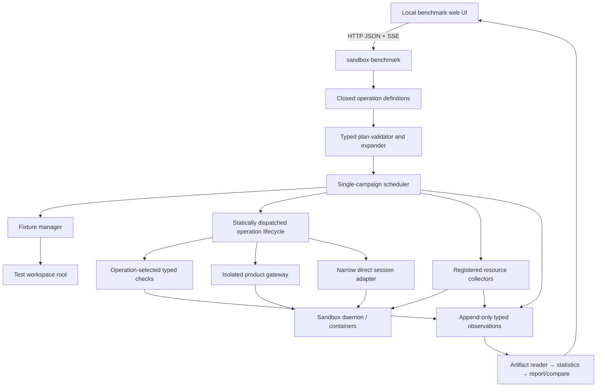

# EphemeralOS Benchmark Laboratory — Backend Design

| Field | Value |
|---|---|
| Status | Revised implementation design |
| Date | 2026-07-12 |
| Coordinated contract | [benchmark-system-spec.md](benchmark-system-spec.md) |
| UI contract | [benchmark-ui-design.md](benchmark-ui-design.md) |

## 1. Purpose and trust boundary

The backend is a trusted, local benchmark orchestrator. It validates experiment
plans, prepares deterministic fixtures, runs product operations, samples host
and sandbox resources, verifies correctness, stores immutable observations,
computes summaries, and serves the local UI.

It is a separate process from the general sandbox console because it can:

- create and remove benchmark-owned host files;
- start an isolated gateway and Docker sandboxes;
- invoke a narrow test-only workspace-session lifecycle adapter;
- execute bounded benchmark commands;
- read process, cgroup, and filesystem resource counters.

The service binds only to loopback and is not a general proxy to internal
runtime operations. Browsers receive typed benchmark endpoints, never arbitrary
daemon credentials or an unrestricted RPC tunnel.

## 2. Implementation shape

Add one Rust crate and one web application below the existing benchmark root:

```text
ephemeral-sandbox/
  benchmark/
    README.md
    defaults/
      standard-local.yml
    presets/
      quick-smoke.yml
      publication.yml
      concurrency-scaling.yml
      payload-scaling.yml
      workspace-size-count.yml
      file-metadata-blame.yml
      squash-only.yml
      squash-remount.yml
      remount-width.yml
      active-session.yml
      release-comparison.yml
    web/
      package.json
      src/
        api/
        components/
        pages/
        plots/
        routes.tsx
  crates/
    sandbox-benchmark/
      Cargo.toml
      src/
        main.rs
        api.rs
        app.rs
        config.rs
        model.rs
        definitions.rs
        plan.rs
        scheduler.rs
        events.rs
        artifacts.rs
        fixtures.rs
        resources.rs
        checks.rs
        statistics.rs
        report.rs
        compare.rs
        cleanup.rs
        gateway.rs
        daemon_session.rs
        executors/
          mod.rs
          command.rs
          files.rs
          workspace.rs
          layerstack.rs
```

The binary name is `sandbox-benchmark`. It uses workspace versions of Tokio,
Hyper, Serde, tracing, and existing sandbox operation client crates. The web app
uses the console’s established React/Mantine stack. V1 does not add a database,
message broker, distributed worker, general plugin system, or second web server
framework.

The crate is a modular monolith with an intentional compile-time ceiling.
Families and operations are closed Rust enums, operation behavior is selected by
an exhaustive match, and adding a first-party operation recompiles the runner.
Small compile-time definition tables remove repeated metadata; they are not a
runtime plugin registry. V1 has no dynamic loading, `Any` downcasts, dependency
injection container, service locator, workflow DSL, generic graph engine, or
repository abstraction over its one filesystem artifact store.

Development runs the web dev server against the Rust API. A release build
serves fingerprinted web assets from the Rust process so the browser and API
share an origin.

## 3. Runtime architecture



The dependency direction is:

```text
HTTP DTOs
  → ExperimentPlan + operation definitions
  → validator / expander / scheduler
  → operation lifecycle modules
  → product clients and host adapters

collectors + checks + event projection
  → immutable observations
  → artifact reader → statistics → report → comparison
```

Operation modules do not depend on HTTP, UI, artifact layout, statistics, or
report types. Reports can be regenerated without product clients, Docker, or a
running gateway. Presets depend only on the public plan schema.

One runner allows one active campaign. Families within **Run All Locally** run
sequentially in the fixed Command → Files → Workspace → LayerStack order.
Requests within one cell use the concurrency required by the family. This
separates experimental concurrency from orchestration concurrency and prevents
accidental cross-family resource interference.

## 4. Process lifecycle and startup

The command is:

```text
sandbox-benchmark serve \
  --repo <ephemeral-sandbox-checkout> \
  [--test-workspace-root <path>] \
  [--bind 127.0.0.1:0] \
  [--open]
```

Startup performs these checks before reporting `ready`:

1. Discover and canonicalize the repository and workspace roots.
2. Verify Docker, required binaries, image availability, and writable storage.
3. Read source commit, dirty state/diff hash, host, kernel, Docker, filesystem,
   clock source, and free disk.
4. Reconcile manifests left in a non-terminal state by an earlier process.
5. Load and schema-check presets.
6. Bind loopback, generate an in-memory origin nonce, and print the local URL.

The runner may serve reports without Docker readiness. It marks execution
unavailable while preserving artifact browsing and comparison.

## 5. Configuration and path resolution

Configuration precedence is:

1. command-line flag;
2. `EPHEMERAL_SANDBOX_TEST_WORKSPACE`;
3. machine-local setting;
4. `ephemeral-sandbox-test-workspace` beside the discovered checkout.

Machine-local settings live below the platform configuration directory, for
example `~/Library/Application Support/EphemeralOS/benchmark/settings.json` on
macOS. They are not stored in either repository.

The resolved structure is:

```text
<root>/benchmark/
  .eos-benchmark-root
  fixtures/<profile-id>/<fixture-hash>/
  runs/<run-id>/<cell-id>/<trial-id>/workspace/
  results/<run-id>/
  runtime/<runner-instance-id>/
```

`runtime` holds benchmark-owned isolated gateway config, pid, socket, registry,
and transient credentials with owner-only permissions. It is removed on clean
shutdown and never copied into results.

### 5.1 Safe deletion invariant

Deletion requires all of the following:

1. For run work, the canonical target is a strict descendant of canonical
   `<root>/benchmark/runs`. For runtime work, it is the exact active
   `<root>/benchmark/runtime/<runner-instance-id>` directory or one of that
   directory's strict descendants. It is never the `runtime` parent.
2. Every path component remains on the expected device unless explicitly
   allowed by the fixture manifest.
3. The target contains `.eos-benchmark-owned` with matching ownership identity:
   run and trial ids for trial work, or runner instance id for runtime work.
4. The target is not a symlink and traversal does not follow symlinks.
5. The cleanup ledger identifies the resource as owned by the active run or
   active runner instance, according to its directory class.

The runner never recursively deletes the configured root, `benchmark`,
`fixtures`, `results`, or the `runtime` parent. Fixture eviction is a separate
explicit operation and uses fixture hashes and reference checks.

## 6. Core data model

Canonical JSON uses `snake_case`, rejects unknown fields, represents bytes and
nanoseconds as unsigned integers, and uses RFC 3339 UTC for wall timestamps.
IDs are sortable UUIDv7/ULID-style opaque strings.

### 6.1 Plans

```rust
struct ExperimentPlan {
    schema_version: u32,
    name: String,
    configuration_base: ConfigurationBase,
    seed: u64,
    environment: EnvironmentPlan,
    protocol: ProtocolPlan,
    operations: Vec<OperationPlan>,
    comparison: Option<ComparisonPlan>,
}

struct EnvironmentPlan {
    image: ImageReference,
    client_cohort: ClientCohort,
}

enum ClientCohort {
    DirectClient,
    CliE2e,
    // RemoteProduct is a later cohort, not distributed scheduling.
}

struct Factor<T> {
    role: FactorRole,       // varied | controlled
    values: Vec<T>,
    control: Option<T>,
}

#[serde(tag = "operation", content = "configuration")]
enum OperationPlan {
    ExecCommand(ExecCommandPlan),
    FileRead(FileReadPlan),
    FileWrite(FileWritePlan),
    FileEdit(FileEditPlan),
    FileBlame(FileBlamePlan),
    CreateWorkspace(CreateWorkspacePlan),
    SquashLayerstack(SquashLayerstackPlan),
}

enum ExpandedOperationCell {
    ExecCommand(ExecCommandCell),
    FileRead(FileReadCell),
    FileWrite(FileWriteCell),
    FileEdit(FileEditCell),
    FileBlame(FileBlameCell),
    CreateWorkspace(CreateWorkspaceCell),
    SquashLayerstack(SquashLayerstackCell),
}

struct ConfigurationBase {
    id: String,
    version: u32,
    scope: ConfigurationScope, // all | command | files | workspace | layerstack
}

enum ConfigurationScope {
    All,
    Command,
    Files,
    Workspace,
    LayerStack,
}

struct ComparisonPlan {
    protocol_id: String,
    protocol_version: u32,
    treatment_fields: BTreeSet<TreatmentField>,
}

struct PresetRef {
    id: String,
    version: u32,
}

struct PresetFile {
    schema_version: u32,
    id: String,
    version: u32,
    plan: ExperimentPlan, // complete scoped plan; never an overlay
}

struct DefinitionsResponse {
    schema_version: u32,
    catalog: DefinitionCatalog,       // compile-time metadata projection
    defaults: Vec<ExperimentPlan>,    // source Default plus deterministic scoped slices
    presets: Vec<PresetFile>,         // strict data validated against catalog
}

struct PlanValidationRequest {
    plan: ExperimentPlan,
    starting_preset: Option<PresetRef>, // authoring provenance only
}

struct RunCreateRequest {
    plan: ExperimentPlan,
    plan_hash: String,
    starting_preset: Option<PresetRef>, // authoring provenance only
}

struct ExpandedPlan {
    schema_version: u32,
    plan_hash: String,      // sha256 of exact validated non-secret work
    canonical_plan: ExperimentPlan,
    effective_environment: EffectiveEnvironment, // resolved machine-local facts
    cells: Vec<ExpandedCell>,
    execution_blocks: Vec<ExecutionBlock>,
    estimates: PlanEstimates,
    validation: Vec<ValidationFinding>,
}
```

The portable plan contains experimental factors, protocol, and a non-secret
environment/cohort choice. It does not contain an absolute workspace root,
gateway isolation switch, remote credential, daemon credential, cleanup mode,
retention policy, or logging policy. Machine-local settings resolve paths and,
when a remote cohort is added, endpoint/TLS/credential references. The manifest
stores a redacted endpoint identity and effective environment, never secret
material. Gateway isolation, safety caps, allowlists, and cleanup policy are
fixed runner policy.

`OperationPlan` and `ExpandedOperationCell` are the validation and execution
authority. A normalized `(factor_id, typed_value)` projection may be derived for
generic tables, CSV, and cell hashing; it must not be accepted back as executor
input or used instead of typed matching. Adding a factor changes its operation's
plan/cell, definition projection, validation/expansion, controls, and tests, not
unrelated operations.

Each typed operation plan contains `enabled: bool`. Disabled configurations stay
in user intent so UI deselection does not discard edits, but the expander emits
cells only for enabled operations. Family membership comes only from
`OperationDefinition`; an enabled family is derived from its enabled operations.
The wire plan does not repeat a family key that could disagree with the
definition, and validation rejects duplicate operation entries. Fixture cache
reuse is deterministic runner behavior, not portable plan configuration.

The backend, not the UI, expands factors. Cell IDs are stable hashes of family,
operation id and semantic revision, factor-schema revision, fixture hash inputs,
client cohort, and canonical typed factor values. Expansion
sorts maps canonically, preserves explicit series order, validates the control,
and applies seeded randomized-block order only after stable IDs exist.

The validation `plan_hash` covers the canonical portable plan, non-secret
effective environment (including the resolved workspace-root identity),
definition revisions, cells, execution blocks, and fixed lifecycle policy. A
machine-local setting or definition change between validation and start therefore
causes the server's re-expansion to reject the stale hash.

`Factor<T>` represents submitted inputs only. `FactorRole` has exactly
`varied` and `controlled`: a controlled factor has one value and no control; a
varied factor has at least two values and exactly one control contained in its
values. Fixed/series/range are UI authoring conveniences normalized to explicit
values before submission. Derived values belong to expanded cells or results,
never editable input factors.

Expansion classifies each cell as fast or destructive after its operation
boundary and isolation factors are resolved, then writes exact warmup,
measured-trial, timeout, and cleanup policy values into `ExpandedCell`. This is
required when one File Operations plan includes both session-scoped and publish
mutation. A family-level display or estimate must aggregate these resolved cell
protocols instead of assuming one trial count.

`PlanEstimates` exposes `cell_count`, `trial_batch_count`, and
`issued_operation_request_count` separately, plus duration range, peak disk,
free-space requirement, restart blocks, and warnings. Command/File request
counts multiply each trial batch by concurrent requests; Workspace multiplies
by workspace count; LayerStack contributes exactly one squash request per trial
regardless of `N`. Harness setup, verification, and teardown calls are not
reported as issued product operation requests.

`POST /plans/validate` returns an expanded plan even when it has warnings. Any
error makes `runnable=false`. `POST /runs` accepts only the canonical plan plus
the last returned `plan_hash`; the server expands again and rejects a mismatch.

`GET /definitions` returns a versioned envelope with three separately owned
fields: `catalog`, the projection of the closed compile-time definitions below;
`defaults`, complete scoped `ExperimentPlan` data keyed by
`(id, version, scope)`; and `presets`, validated `PresetFile` data. Only
`catalog` is a compile-time definition projection. Defaults and presets are
strict versioned data checked against the catalog at startup; invalid data makes
execution unready. The all-family Default comes from
`benchmark/defaults/standard-local.yml`; one pure typed slicing function filters
it by definition-owned family membership and revalidates each complete family
plan. There is no separately maintained family-default table. None of the three
fields is a runtime registry or the executor dispatch mechanism, and plan data
cannot name handlers. The UI must not maintain a second scientific
metadata/defaults table. Validation returns
`is_customized` from canonical-plan comparison with the declared
`(id, version, scope)` configuration base. The
machine-local workspace root is resolved only into `ExpandedPlan` and
`RunManifest`; it never enters portable-plan equality. Scope is
`all` for the central plan and `command`, `files`, `workspace`, or `layerstack`
for its family slices. Loading a preset replaces the draft with its complete
scoped plan; validation requires that plan's `configuration_base` to match the
page's Default exactly. Resetting all differences therefore returns exactly to
the page's Default configuration state. `starting_preset` is optional,
validated authoring provenance stored in the run manifest. It is excluded from
canonical equality, `plan_hash`, expansion, statistics, and comparability.

### 6.2 Closed identities and definitions

```rust
enum FamilyId {
    Command,
    Files,
    WorkspaceLifecycle,
    LayerStack,
}

enum OperationId {
    ExecCommand,
    FileRead,
    FileWrite,
    FileEdit,
    FileBlame,
    CreateWorkspace,
    SquashLayerstack,
}

enum ProductAccess {
    PublicGateway(ProductOperation),
    DaemonHttp(DaemonHttpAction),
    InternalWorkspace(WorkspaceAction),
}

struct OperationDefinition {
    id: OperationId,
    family: FamilyId,
    semantic_revision: u32,
    factor_schema_revision: u32,
    count_semantics: CountSemantics,
    execution_shape: ExecutionShape,
    isolation: IsolationPolicy,
    product_access: ProductAccess,
    supported_cohorts: &'static [ClientCohort],
    security_class: SecurityClass,
    factors: &'static [FactorDefinition],
    checks: &'static [CheckId],
    phases: &'static [PhaseId],
}

fn definition(id: OperationId) -> &'static OperationDefinition {
    match id {
        OperationId::ExecCommand => &command::DEFINITION,
        OperationId::FileRead => &files::READ_DEFINITION,
        OperationId::FileWrite => &files::WRITE_DEFINITION,
        OperationId::FileEdit => &files::EDIT_DEFINITION,
        OperationId::FileBlame => &files::BLAME_DEFINITION,
        OperationId::CreateWorkspace => &workspace::CREATE_DEFINITION,
        OperationId::SquashLayerstack => &layerstack::SQUASH_DEFINITION,
    }
}

fn operation_comparison_identity(
    cell: &ExpandedOperationCell,
) -> OperationComparisonIdentity {
    match cell {
        ExpandedOperationCell::ExecCommand(cell) => command::comparison_identity(cell),
        ExpandedOperationCell::FileRead(cell) => files::read_comparison_identity(cell),
        ExpandedOperationCell::FileWrite(cell) => files::write_comparison_identity(cell),
        ExpandedOperationCell::FileEdit(cell) => files::edit_comparison_identity(cell),
        ExpandedOperationCell::FileBlame(cell) => files::blame_comparison_identity(cell),
        ExpandedOperationCell::CreateWorkspace(cell) => workspace::comparison_identity(cell),
        ExpandedOperationCell::SquashLayerstack(cell) => layerstack::comparison_identity(cell),
    }
}
```

`ProductOperation` references the existing typed product catalog; benchmark
code does not repeat product operation strings. `DaemonHttpAction` and
`WorkspaceAction` are closed enums containing only reviewed actions. Every
definition must provide product access, isolation, count/execution semantics,
security class, and semantic/factor revisions. Definition, plan variant,
executor dispatch, and allowed access are checked for a one-to-one exhaustive
mapping in tests. No runtime string can register behavior or bypass the
allowlist. A semantics change increments `semantic_revision`; changing the
meaning or canonical representation of a factor increments
`factor_schema_revision`.

Comparison projection is an ordinary exhaustive function over the typed
expanded-cell variants, shown above. Adding an operation therefore cannot omit
its typed comparison identity without producing a non-exhaustive match; tests
also prove that every declared factor is either projected or explicitly marked
non-scientific. It is not a runtime callback stored in a string registry.

The new-operation path is deliberately visible: add one `OperationId`, tagged
plan/cell/evidence variants, one lifecycle module, one exhaustive definition and
dispatch arm, operation-specific controls if needed, and contract/security
tests. Shared scheduling, measurement, artifact writing, statistics, and generic
reports do not change. The definition cannot compile as complete without its
security allowlist and comparison revisions. A new family additionally adds one
`FamilyId`, explicit topology logic, and an explicit family UI; it still reuses
the common pipeline. “Zero files outside a plugin” is not a v1 goal.

Presets are strict, versioned `PresetFile` envelopes containing one complete
scoped public `ExperimentPlan`, not partial overlays. The embedded plan's
`configuration_base` must exactly match the Default for its scope. Discovery
parses, validates, and expands it through the same path as UI plans. A preset
cannot select Rust functions, operation access, credentials, cleanup behavior,
safety caps, or arbitrary code. Adding High Contention File Writes from
existing capabilities is one preset file plus a validation golden, with no
executor, route, or report change.

`RunManifest` owns effective execution facts rather than user intent: lifecycle
state and timestamps, expanded-plan hash, product/source identities, redacted
environment, resolved client cohort/access, definition snapshots and revisions,
fixture hashes, measurement/check/phase revisions, stabilization policy, and
artifact schema versions. It never becomes a second plan or a raw-observation
container.

### 6.3 Run states

```text
planned → queued → preparing → running → verifying → tearing_down → completed
                                  └───────────────→ failed
             any non-terminal state ─────────────→ cancelling → cancelled
```

The persisted terminal values are `completed`, `failed`, and `cancelled`.
Substates live on family/cell/trial records. A run can complete with correctness
failures; its execution state is completed and its separate correctness verdict
is failed. This avoids calling a scientifically complete failure observation a
runner crash.

### 6.4 Observations

Raw evidence uses typed row records. Adding an optional metric, check, or phase
does not add nullable operation fields to every trial:

```rust
struct TrialSample {
    schema_version: u32,
    run_id: RunId,
    family: FamilyId,
    operation: OperationId,
    operation_semantic_revision: u32,
    factor_schema_revision: u32,
    cell_id: CellId,
    trial_id: TrialId,
    sequence: u32,
    warmup: bool,
    timing: TimingObservation,
    execution: ExecutionOutcome,
    cleanup: CleanupOutcome,
    artifacts: Vec<ArtifactRef>,
}

enum ObservationRecord {
    Trial(TrialSample),
    Request(RequestObservation),
    Resource(ResourceReading),
    Check(CheckResult),
    Phase(PhaseObservation),
    Operation(OperationEvidence),
}

#[serde(tag = "operation", content = "evidence")]
enum OperationEvidence {
    ExecCommand(ExecCommandEvidence),
    FileRead(FileReadEvidence),
    FileWrite(FileWriteEvidence),
    FileEdit(FileEditEvidence),
    FileBlame(FileBlameEvidence),
    CreateWorkspace(CreateWorkspaceEvidence),
    SquashLayerstack(SquashLayerstackEvidence),
}

struct PhaseObservation {
    id: PhaseId,
    semantic_revision: u32,
    trial_id: TrialId,
    request_id: Option<RequestId>,
    source: PhaseSource,
    start_offset_ns: u64,
    duration_ns: u64,
    status: PhaseStatus,
}
```

Every request and trial is addressable. `RequestObservation` carries request
latency, response status, bounded response metadata, and request id;
`TrialSample` carries the batch and lifecycle result. Setup, operation, verify,
and teardown intervals use monotonic offsets from the trial origin. The report
generator does not infer phase boundaries from wall timestamps.

`OperationEvidence` is typed and namespaced; it contains only evidence that
cannot be represented by common requests, metrics, checks, or phases. The
canonical factor projection lives in the expanded cell snapshot, not a string
map repeated in every sample. Stable metric/check/phase IDs may be namespaced
strings in serialized evidence, but they never dispatch privileged behavior.
Unmatched product spans remain bounded diagnostic artifacts. Only registered
`PhaseObservation` definitions participate in scientific reports.

## 7. HTTP and event API

All endpoints are below `/api/v1`. Errors use a stable envelope:

```json
{
  "error": {
    "code": "plan_hash_mismatch",
    "message": "The plan changed after validation.",
    "details": {},
    "request_id": "..."
  }
}
```

| Method | Endpoint | Behavior |
|---|---|---|
| `GET` | `/health` | Process, execution readiness, version, active run |
| `GET` | `/settings` | Resolved local settings and path health |
| `PUT` | `/settings` | Validate and persist the workspace-root setting |
| `GET` | `/definitions` | Versioned Default configuration/family slices, operations, factors, optional presets, schemas, constraints, and UI help |
| `POST` | `/plans/validate` | Canonicalize, expand, estimate, and hash a plan |
| `POST` | `/runs` | Start a validated plan; returns `202` and run id |
| `GET` | `/runs` | Cursor-paginated run summaries and filters |
| `GET` | `/runs/:run_id` | Manifest, progress, and latest sequence |
| `GET` | `/runs/:run_id/events` | SSE with `Last-Event-ID` recovery |
| `POST` | `/runs/:run_id/cancel` | Idempotent cancellation request |
| `GET` | `/runs/:run_id/report` | Final or explicitly provisional report model |
| `GET` | `/runs/:run_id/artifacts` | Allowlisted artifact index |
| `GET` | `/runs/:run_id/artifacts/:artifact_id` | Bounded artifact content/download |
| `POST` | `/compare` | Compatibility result and paired cell summaries |

State-changing requests require JSON content type, the same exact origin, and
an `X-EOS-Benchmark-Nonce` issued in the bootstrap HTML. There is no permissive
CORS mode. `Host` and `Origin` are checked against the bound loopback authority.

### 7.1 Run submission

```json
{
  "plan_hash": "sha256:...",
  "plan": {},
  "client_request_id": "01..."
}
```

`client_request_id` makes an accidental retry idempotent. A second distinct run
submission while one is active returns `409 runner_busy` with the active run id.

### 7.2 SSE event model

Each event has an increasing sequence persisted before broadcast:

```text
id: 1842
event: trial_phase
data: {"run_id":"...","cell_id":"...","trial_id":"...","phase":"operation","warmup":false}
```

Event kinds include `run_state`, `family_state`, `cell_state`, `trial_state`,
`trial_phase`, `request_state`, `resource_window`, `correctness`, `warning`,
`log`, and `report_ready`. A reconnect provides `Last-Event-ID`; the server
replays later events from `events.ndjson` before attaching to live broadcast.
Slow browser clients may lose coalescible `resource_window` events but never
state, correctness, warning, or terminal events. Raw resource samples remain in
artifacts.

Events are a persisted UI/reconnect projection, not scientific evidence. Reports
read `observations.ndjson`, expanded plan, and manifest only; an event carrying a
correctness or resource summary never becomes a second authority.

## 8. Scheduler and execution protocol

### 8.1 Campaign sequence

For each execution block, cell, and trial:

```text
prepare fixture/topology and exact invocations
  → capture resource baseline
  → release operation barrier
  → capture operation responses and registered phases
  → capture post-operation and settled resources
  → verify correctness
  → teardown owned state
  → validate cleanup baseline
  → append immutable observations and advance manifest
```

Family order is the fixed Command → Files → Workspace → LayerStack sequence.
Cell order is seeded within restart-compatible blocks. Trials for one cell are
sequential so destructive state isolation is auditable. Requests inside a trial
are released concurrently through a Tokio barrier.

Every trial has the canonical phases `setup`, `operation`, `verify`, and
`teardown`. Its independent trial kind is `warmup` or `measured`; both kinds run
all four phases. Warmups remain recorded and are excluded from summaries. Event
and report consumers must not model warmup as a phase or infer phase boundaries
from run state.

### 8.2 Static operation lifecycle

The scheduler owns orchestration and evidence. Each operation owns only its
typed topology, invocation, product call, and verification inputs:

```rust
trait OperationLifecycle {
    type Cell;
    type Prepared;
    type Invocation;
    type Output;

    async fn prepare(
        ctx: &TrialContext,
        cell: &Self::Cell,
    ) -> Result<Self::Prepared>;

    fn invocations(
        prepared: &Self::Prepared,
        cell: &Self::Cell,
    ) -> Vec<Self::Invocation>;

    async fn invoke_one(
        ctx: &InvocationContext,
        invocation: Self::Invocation,
    ) -> InvocationResult<Self::Output>;

    async fn verify(
        ctx: &VerificationContext,
        prepared: &Self::Prepared,
        outputs: &[InvocationResult<Self::Output>],
    ) -> Vec<CheckResult>;

    async fn teardown(
        ctx: &TeardownContext,
        prepared: Self::Prepared,
    ) -> TeardownResult;
}
```

An exhaustive `match ExpandedOperationCell` calls one generic scheduler driver;
the trait is statically dispatched. V1 does not erase cells behind trait objects
or downcast them. Ordinary helper functions remain preferable where operations
share concrete logic.

Before releasing the barrier, the common driver verifies that the prepared
invocation count and execution shape match the exact values persisted in the
`ExpandedCell`. A mismatch is a harness-integrity failure: it is recorded,
teardown runs for the prepared state, and the campaign aborts without inventing
operation timings.

Most request operations prepare C invocations. LayerStack prepares N live
sessions but returns exactly one squash invocation. A destructive lifecycle
operation such as `destroy_workspace` prepares C sessions before the barrier,
returns C destroy invocations for the measured operation, verifies registry and
resource absence, and tears down only residue. It does not reuse or copy the
scheduler and does not misclassify the destroy request as teardown.

The runner records each canonical phase and invokes teardown after success,
product failure, timeout, verification failure, or cancellation whenever a
`Prepared` value exists. The common cleanup validator, not operation code,
checks the owned resource ledger and required baseline.

### 8.3 Barrier semantics

For request concurrency `C`, the scheduler creates `C` prepared tasks, waits
until every task has acquired required client/session state, records the batch
origin, and releases one barrier. Each request records its own monotonic start
immediately after release and completion after the final response is decoded.
The batch makespan ends at the final terminal request.

A preparation failure means the measured batch never started; record a harness
failure and do not manufacture zero latency. Failure handling is fixed in v1:

- product, transport, timeout, and correctness failures remain raw observations
  and later trials may continue when the environment is demonstrably safe;
- fixture, containment, ownership, environment, or infrastructure-integrity
  failure aborts the campaign;
- teardown or cleanup-baseline failure invalidates the trial and aborts the
  campaign before another trial can inherit unsafe state.

Ordinary plans cannot replace this policy.

### 8.4 Timeouts, settling, and retries

Product operations are never automatically retried inside a measured sample.
A transport failure is an observed failure. Setup image pulls and report reads
may retry with bounded backoff, but their attempts are recorded outside primary
operation latency. Trial timeout triggers owned-task cancellation and teardown.

Resource settling uses a closed, versioned stabilization policy selected by the
operation definition. Its quiet-window rule, threshold, poll interval, and
timeout are written to `ExpandedCell` and `RunManifest`; ordinary plans cannot
replace the rule. Failure to settle is an explicit unavailable/infrastructure
outcome, never an inferred zero or a silently shortened window.

## 9. Product operation adapters

### 9.1 Public operation client

`exec_command`, file operations, and `squash_layerstacks` use the existing
`sandbox-operation-client` directly against the isolated gateway. This is the
default `direct_client` cohort and avoids counting CLI process startup.

An optional `cli_e2e` adapter may execute the product CLI for end-to-end user
latency. `ClientCohort` is an environment/cohort choice, not an experimental
factor or an executor graph. Its value is part of the cell identity and
comparability key; the backend never aggregates it with direct-client samples.

A future `remote_product` cohort may replace the transport/environment adapter
while retaining the local scheduler. Its endpoint and TLS/credential references
are machine-local; artifacts contain only redacted endpoint identity and
credential-source kind. Adding it does not introduce remote workers or
distributed scheduling.

### 9.2 Command executor

The executor prepares explicit sessions when requested, expands only validated
command cases, releases requests through the barrier, and checks exit
status/output. The actual product contract is `exec_command { cmd: String }` and
the runtime evaluates that string with its configured shell (`bash -c` or
`sh -c`). The benchmark therefore does not claim argv or no-shell semantics.

V1 command cases are compile-time allowlisted templates with typed bounded
parameters. Template expansion performs the required shell quoting and yields
one final bounded `cmd`; arbitrary command text, arbitrary argv, shell fragments,
environment injection, and executable hooks are not plan options. The expanded
cell and manifest retain template id/revision and the exact command hash so a
template semantics change cannot compare as the same cohort. Automatic-session
mode creates a fresh sandbox state per trial and includes the documented
automatic create/publish/destroy boundary.

Stored stdout/stderr is capped; the observation contains byte count, truncation
flag, and full streaming hash. Cases define timeout, expected exit, and output
limit. Adding free-form commands requires a separate product/security decision;
it is not enabled through a preset or UI advanced option.

### 9.3 File executors

Targets are selected deterministically from the fixture manifest. Independent
mode assigns a unique path per concurrent request. Same-target contention is an
explicit factor.

- Read checks the exact requested line/byte window and content hash.
- Write checks final bytes/hash and session or publication attribution.
- Edit checks match/replacement count, final hash, and attribution.
- Blame checks that returned ranges tile the file and match expected
  EphemeralOS ownership generated by the fixture/audit plan.

Explicit-session mutation uses fresh sessions per trial. Sessionless mutation
uses a fresh sandbox/layerstack per trial because it publishes state.

The product `file_list` request supports an optional `limit`, rejects zero, and
clamps it to `FileRuntimeConfig.max_list_entries`; it remains a one-directory,
daemon-HTTP-only operation. When the benchmark operation is added, its
definition must use `ProductAccess::DaemonHttp(DaemonHttpAction::FileList)` and
the typed daemon HTTP adapter. Directory breadth and depth describe
fixture/target topology; the operation remains a one-directory listing unless
the product contract changes.
Its optional `limit` is an experimental request value, while
`FileRuntimeConfig.max_list_entries` is fixed safety policy: zero is rejected,
the runtime clamps the request to the cap, and the expanded cell/manifest record
the requested limit, effective limit, cap, and cap revision. Validation rejects
a grid whose distinct requested values collapse to the same effective limit.
Correctness records returned count, deterministic entry evidence, and
truncation. The fixed cap is never an ordinary plan override.

### 9.4 Workspace-session adapter

The UI operation `create_workspace` maps to internal
`create_workspace_session`. The adapter is deliberately narrow:

```rust
trait WorkspaceSessionLifecycle {
    async fn create_no_op(
        &self,
        sandbox_id: SandboxId,
        network: AllowedNetworkProfile,
        correlation: Correlation,
    ) -> Result<CreatedSession>;

    async fn destroy(
        &self,
        sandbox_id: SandboxId,
        session_id: WorkspaceSessionId,
        correlation: Correlation,
    ) -> Result<()>;
}
```

It discovers the daemon endpoint and per-sandbox auth through the existing
inspection/label mechanism, sends only allowlisted create/destroy JSON-line
messages, validates the response schema, and never returns the credential to the
browser or artifacts. No arbitrary internal operation name or payload passes
through the HTTP API.

The action is matched against the closed `WorkspaceAction` allowlist before
credential lookup, daemon discovery, or socket access. Possession of the daemon
token is not treated as a sufficient operation allowlist.

For count `C`, create tasks share one prepared sandbox and fixture and release
at one barrier. A trial completes after all responses are ready. Verification
checks usability and requested network profile. Teardown destroys every session
and confirms registry/resource counts return to baseline.

### 9.5 LayerStack executor

Every trial builds a fresh deterministic topology:

1. Create a sandbox with `B` squashable blocks and configured layers/payload.
2. Create `N` live sessions with deterministic eligibility/state derived from
   the requested migration ratio and configured activity. The requested ratio
   does not set observed migration results.
3. Capture S0 storage and memory.
4. Issue exactly one public `squash_layerstacks` request.
5. Match the parent squash span, storage phases, sweep span, and per-session
   remount spans by run/cell/trial correlation.
6. Observe actual `M`, `I`, dispositions, S1 peak, S2 post-commit, and S3 settled.
7. Verify content, manifest reduction, usability, and absence of residue.
8. Destroy the fresh topology.

Concurrent squash requests are forbidden because the product is singleflight
per root. `N` is the varied count of live sessions exposed to the remount sweep;
it is not the count successfully remounted. Observed `M`, `I`, and dispositions
are results. `N=0` is the squash-only control.

Sweep width `W` is an effective gateway configuration. Cells with equal `W`
share an execution block. A change in `W` causes the runner to stop its isolated
gateway, render a new config, start with a unique gateway instance id, validate
readiness, and continue. It never rewrites or restarts the user’s normal gateway.

### 9.6 Future Sandbox Lifecycle family

Adding Sandbox Lifecycle is an explicit new `FamilyId`, typed create/destroy
plans/cells/evidence, two lifecycle modules, manager-client access definitions,
and a family UI. It is not a zero-file plugin exercise. The common scheduler,
collectors, checks, artifacts, statistics, and report model remain unchanged.

For a create cell with concurrency C, the lifecycle prepares the shared
environment and returns C independent `create_sandbox(count=1)` invocations to
the common barrier. It must not issue one `create_sandbox(count=C)` call and
describe the product's internal sequential loop as concurrent requests. Destroy
prepares C owned sandboxes before the barrier, measures C destroy invocations,
verifies registry/container/resource absence, and tears down residue.

## 10. Isolated gateway management

Each campaign launches or adopts only benchmark-owned infrastructure with:

- unique loopback bind/Unix socket;
- unique pid and runtime directory;
- unique gateway instance id;
- isolated registry/state paths;
- generated short-lived auth stored owner-only;
- rendered effective config including `runtime.layerstack.remount_sweep_width`;
- stdout/stderr captured as bounded diagnostic artifacts with secrets redacted.

The manager records gateway and daemon binary hashes and effective configuration
hash in the environment manifest. It probes readiness before setup timers start.
A gateway crash fails the active trial as infrastructure failure and prevents
new trials until bounded recovery or campaign failure.

## 11. Fixture generation

Fixtures are content-addressed and immutable. Named profiles are versioned data
that expand into a typed `WorkspaceFixtureSpec`; they are not executable code.
The single ordinary fixture builder handles the supported shapes. A fixture
generator trait is deferred until a real second generator is required.

The fixture hash includes the complete expanded spec, generator version, seed,
file-size distribution, requested logical bytes, file and directory counts,
maximum depth, blame ownership plan, and any operation-specific template.

Generation writes into a temporary sibling, materializes real bytes, fsyncs the
manifest/required content, validates actual totals and tree hash, and atomically
renames to the hash directory. A complete fixture has a read-only marker and:

```json
{
  "schema_version": 1,
  "generator_version": "...",
  "seed": 20260712,
  "requested": {"files": 1000, "logical_bytes": 16777216, "max_depth": 4},
  "actual": {
    "files": 1000,
    "directories": 86,
    "logical_bytes": 16777216,
    "allocated_bytes": 16809984,
    "max_depth": 4,
    "tree_hash": "sha256:..."
  }
}
```

The generator does not use sparse files. It uses deterministic buffered
patterns rather than cryptographic randomness so generation is reproducible and
CPU cost is bounded. Setup timing includes copying/importing an immutable
fixture into trial state, not first-time cache generation unless a fixture-build
study is explicitly added later.

A profile such as Metadata Heavy (250,000 tiny files and deep directories) is a
data-only addition when `WorkspaceFixtureSpec` already expresses its shape. If
the current builder cannot express that directory-density shape, add one closed
`FixtureShape` variant and increment the generator version; do not add an
executor or plugin. Preflight estimates inode count, directory count, logical
and allocated bytes, generation time range, and required free space. The final
manifest records materialized values, cache hit/miss, and filesystem identity so
the estimate never substitutes for observed fixture cost. Cache reuse requires
an exact fixture hash and a valid immutable manifest/tree hash.

## 12. Measurement subsystem

### 12.1 Clocks

Rust `Instant`/platform monotonic time measures intervals. Raw duration is
integer nanoseconds relative to a trial origin. UTC wall timestamps identify
events and environment capture only. Manifest records monotonic clock source and
resolution where available.

### 12.2 Resource sampling

A sampler starts before baseline, reads every configured interval (default
100 ms), and stops after settle or timeout. The live event stream downsamples to
500 ms; raw `ResourceReading` records retain every source sample.

```rust
struct MetricDefinition {
    id: MetricId,
    semantic_revision: u32,
    unit: Unit,
    scope: MetricScope,
    kind: MetricKind, // gauge | monotonic_counter
    availability: AvailabilityPolicy,
    aggregation: AggregationRule,
    direction: MetricDirection, // lower | higher | descriptive_only
}

enum Availability<T> {
    Available(T),
    Unavailable { reason: UnavailableReason },
}

struct ResourceReading {
    schema_version: u32,
    run_id: RunId,
    trial_id: TrialId,
    offset_ns: u64,
    metric_id: MetricId,
    metric_revision: u32,
    scope: MetricScope,
    value: Availability<Quantity>,
    source: MeasurementSource,
}

trait MetricCollector {
    fn definitions(&self) -> &'static [MetricDefinition];
    async fn read(&mut self, at: MonotonicInstant) -> Vec<ResourceReading>;
}
```

The small collector trait is justified by cgroup, process, filesystem, and fake
test implementations. A compile-time metric table supplies unit, scope,
availability, aggregation, direction, and semantic revision to the artifact
reader and report builder. Operation executors neither name nor invoke concrete
collectors. A new metric changes its collector, definition, report registration,
and tests only.

Scopes remain distinct:

| Scope | Counters |
|---|---|
| Sandbox cgroup | `memory.current`, `memory.peak`, cumulative CPU time, block read/write bytes and operations when available |
| Daemon process | RSS, cumulative CPU time, and process identity/start time |
| Runner process | RSS, reported as harness overhead |
| Workspace | logical bytes, allocated bytes, file count |
| LayerStack | allocated bytes for stack, staging, remount, upperdirs |
| Host volume | free bytes and filesystem identity |

Process samplers verify PID start time so PID reuse cannot corrupt a series.
Filesystem walking is potentially intrusive: full directory sizes are taken at
phase boundaries; optional peak disk walking uses a declared sampling interval
and is labeled sampled. Native filesystem/cgroup counters are preferred where
available.

Product resource DTOs preserve missing CPU and block-I/O counters as `Option`;
the benchmark translates absence into `Unavailable(reason)`. Providers must not
collapse missing or unsupported counters to zero. Monotonic counters record raw
values and derived deltas with reset/wrap detection. `memory_peak` falls back to
the maximum raw sample and sets `sampled=true`. Logical and allocated disk remain
separate metric IDs/scopes and are never combined into a generic disk value.

### 12.3 Registered phases, server spans, and correlation

Client requests include benchmark correlation fields supported by the operation
contract or use trace context. The runner queries/matches spans after the
operation using run, cell, trial, request, sandbox, and session identities.
Missing or ambiguous span matches are method warnings, not synthesized values.

Scientific phases are registered compile-time definitions with stable
namespaced id, semantic revision, unit, endpoint meaning, allowed operation, and
correlation requirements. Generic tracing spans are diagnostic input, not an
implicit phase schema. A matched registered phase becomes a `PhaseObservation`;
an unmatched span stays a bounded diagnostic artifact. Adding a phase changes
its product instrumentation when needed, definition, report registration, and
tests, not the common sample shape.

For example, `exec_command.queue_delay/v1` must be measured server-side from
arrival at the session gate/admission queue to permission to launch and
correlated using the existing request/trace identity. The client must not infer
it from total latency. It is available only for `exec_command`; absence is
explicitly unavailable and does not add a nullable command field to unrelated
samples.

The LayerStack implementation must expose or preserve these spans:

```text
layerstack.squash
  layerstack.squash.plan
  layerstack.squash.flatten
  layerstack.squash.commit
  layerstack.squash.remount_sweep
    workspace_session.remount (one per attempted session)
```

The parent span retains manifest version, block count, swept count, and sweep
width. Remount spans retain session id and disposition. Commit remains the
correctness boundary; sweep is separately timed and may contain best-effort
session outcomes.

## 13. Correctness and failure taxonomy

Failures have two independent dimensions:

| Dimension | Values |
|---|---|
| Execution | Product response, timeout, transport, infrastructure, harness |
| Correctness | Passed, failed, not run, unavailable |

Each verifier returns stable check ids, expected/actual summaries, safe artifact
references, and duration. Sensitive or unbounded contents are hashed and capped.

Checks use a small compile-time metadata table and ordinary typed functions,
not a universal erased verifier context:

```rust
struct CheckDefinition {
    id: CheckId,
    semantic_revision: u32,
    evidence_limit: usize,
}

struct CheckResult {
    id: CheckId,
    semantic_revision: u32,
    trial_id: TrialId,
    verdict: CheckVerdict,
    expected: BoundedSummary,
    actual: BoundedSummary,
    evidence: Vec<ArtifactRef>,
    omitted_evidence_count: u64,
    duration_ns: u64,
}

type CommandCheck =
    fn(&CommandVerificationContext) -> CheckResult;
```

An operation or an allowlisted command case selects checks from those declared
by its definition. The scheduler folds all required `CheckResult` values into
one correctness verdict. A post-command filesystem-integrity check is therefore
one typed function/definition plus case selection and tests; executor scheduling,
the verdict fold, artifacts, and generic failure report remain unchanged. Check
ids are stable across display-label changes; semantics changes increment their
revision. Presets cannot name an unregistered check or supply executable check
logic.

Successful distributions include only measured samples with product success,
all required checks passed, and the cleanup baseline restored. Warmups are
excluded. A cleanup failure is never converted into an ordinary correctness
pass: it invalidates the trial and aborts the unsafe campaign while preserving
all evidence. Every summary also reports total attempted,
warmup, successful, product-failed, correctness-failed, and infrastructure-
failed counts, including a separate cleanup-invalid count. Nothing is silently
discarded.

LayerStack correctness additionally requires disposition accounting to sum to
`N`, observed `M` to match `Migrated` count, manifests/content to be equivalent,
expected reduction to occur, live sessions to remain usable as their
disposition permits, and staging/remount resources to be absent after settle.

## 14. Artifact-derived statistics and reports

`statistics.rs` contains pure estimators over the artifact reader's canonical
observation model. `report.rs` owns derived tables, chart series, correlations,
and the versioned report DTO. `compare.rs` consumes compatible summaries and
manifest identities. None depends on executors, product clients, Docker, HTTP,
or UI types. Derived `summary.json` and `report.json` may be deleted and rebuilt;
the UI only formats the report DTO and never computes a competing statistic.

For each compatibility group and metric compute count, failure counts, minimum,
maximum, mean, sample standard deviation, median, MAD, p25, p75, p95, and CV when
defined. Quantile interpolation is fixed by schema version and documented in the
Methods report.

Rules:

- Median CI: deterministic percentile bootstrap, 10,000 resamples, 95% interval.
- Bootstrap seed: stable hash of run seed, cell id, metric id, and schema version.
- Fewer than five successes: omit CI with reason `insufficient_n`.
- P95 below 20 successes: retain but set `exploratory=true`.
- P99: not computed or displayed in v1.
- Outliers: Tukey 1.5 × IQR flag, retained in all calculations.
- Histogram: Freedman–Diaconis width; Sturges fallback when IQR or width is zero.
- Comparisons: absolute difference, percent difference only for ratio-scale
  metrics with a positive reference, and bootstrap CI for the median difference;
  no default p-value or automatic performance verdict.

The bootstrap draws independently from reference and candidate unless a future
schema explicitly establishes paired trials. Floating calculations use `f64`;
raw integer measurements are never overwritten. Golden-vector tests pin every
formula and edge case.

A CPU-versus-latency plot over already collected, timestamp-correlated readings
is a report derivation only. The report defines alignment/windowing, successful
sample eligibility, missing CPU handling, coefficient, support count, exclusions,
and plot points. It requires no executor or raw-schema change when compatible
CPU readings already exist.

## 15. Artifact store and durability

The filesystem is the one artifact-store implementation and is accessed
directly by `artifacts.rs`; v1 does not hide it behind repositories or storage
traits. The evidence portion of a run is append-only:

```text
results/<run-id>/
  intent-plan.json
  expanded-plan.json
  run-manifest.json
  events.ndjson
  observations.ndjson
  summary.json
  report.json
  cells/<cell-id>/trials/<trial-id>/
    bounded-evidence/
```

`intent-plan.json` preserves submitted user intent. `expanded-plan.json`
preserves exact validated cells, order, seeds, invocation counts, effective
limits, and lifecycle policies. `run-manifest.json` records producer version,
source/product identity, redacted effective environment, client cohort and
product access, operation/factor revisions, definition snapshot, fixture hashes,
metric/check/phase revisions, stabilization policy, and lifecycle state. The
report uses this snapshot rather than silently substituting current definitions.

Every JSON/NDJSON envelope names its schema and version. Observation records
contain a global sequence and typed record variant. The writer appends complete
lines, flushes at trial boundaries, and periodically syncs according to a
documented durability policy. Snapshot JSON is written to a sibling temporary
file, flushed, and atomically renamed. `run-manifest.json` advances only after
referenced records are durable enough for reconciliation.

`observations.ndjson` is the evidence authority. `summary.json`, `report.json`,
exports, indices, and live projections are derived; they never compete with
embedded `ResourceSummary` or correctness copies. Large bounded evidence is
content-addressed and referenced by observations. Derived files may be deleted
and regenerated.

The artifact reader has explicit decoders for every released v1 raw schema. A
decoder validates typed records and converts them to an in-memory canonical
observation model; it never rewrites old raw files. When a new major schema is
released, its release gate includes the previous supported major reader and
golden regeneration fixtures. Unknown fields in plans for a declared version
are rejected. An unknown future observation record may be retained byte-for-byte
for copying, but reports mark it unsupported and never guess its meaning. There
is no universal `Map<String, Value>` migration path.

On restart, the runner scans manifests. A non-terminal run without a live owned
process becomes failed with reason `runner_interrupted`, attempts cleanup from
the ledger, preserves all evidence, and can rebuild summaries from complete raw
records. Truncated final NDJSON lines are quarantined and reported.

Artifact API lookup uses generated artifact ids, never a browser-provided path.
MIME type and maximum inline/download size are allowlisted. Full command output,
tokens, raw environment, Docker auth, and daemon credentials are forbidden.

## 16. Cancellation and cleanup

The scheduler owns a cancellation token and a resource ledger. On cancellation:

1. Atomically change the run to `cancelling` and stop scheduling future trials.
2. Signal owned client tasks and bounded command processes.
3. Wait a short operation-specific grace period.
4. Terminate only PIDs/containers/sessions whose identity and ownership match
   the ledger.
5. Run idempotent teardown in reverse ownership order.
6. Persist teardown failures, final resource state, and `cancelled` manifest.

Cancellation never deletes raw evidence. A second cancel request returns the
current state. Shutdown follows the same procedure for the active campaign.

## 17. Comparison compatibility

The backend records two identities. **Treatment identity** contains source
commit/dirty diff and daemon/gateway binary hashes. **Compatibility invariant
identity** is a typed `ComparisonKey` containing:

- operation id, `semantic_revision`, and `factor_schema_revision`;
- canonical typed factor projection and operation-specific template/profile
  revisions;
- client cohort and effective product access path;
- operation count semantics, isolation, and stabilization policy;
- fixture and generator hashes;
- sandbox image digest and effective runtime configuration;
- architecture, kernel major/minor, Docker major, filesystem identity/type;
- protocol identity, clock source, and resource interval.

Changing operation meaning, phase endpoints, factor meaning, command template
semantics, or a fixed product cap requires the corresponding revision/key change.
Display labels do not. `direct_client`, `cli_e2e`, and a future
`remote_product` are distinct cohorts and are never aggregated by default.

Metric compatibility is evaluated separately per requested view using metric id
and semantic revision, scope, unit, availability/source semantics, sampling
policy, and statistics/report derivation revision. Adding CPU collection does
not make two otherwise identical latency cohorts incompatible, but a CPU
comparison or correlation requires compatible CPU evidence.

The versioned `ComparisonPlan` declares allowlisted treatment fields before
execution; it is not a post-run list of mismatches to ignore. The default
protocol declares no changed treatment. Release Comparison may declare source
and product binary identity while keeping every compatibility invariant equal.
Two absent declarations normalize to the versioned default same-treatment
protocol with an empty allowlist. Otherwise, reference and candidate runs must
both contain identical normalized declarations—the same `protocol_id`,
`protocol_version`, and `treatment_fields`—or compatibility fails before
deltas. The backend never unions allowlists or adopts the broader declaration
after execution.

`POST /compare` returns treatment differences, check-by-check invariant results,
why each mismatch matters, and matched cell ids before any deltas. It computes
aggregate differences only when all required invariants pass. Absolute change
is `candidate - reference`; percent change uses
`(candidate - reference) / reference × 100` only for a ratio-scale metric with
a positive reference. Metric metadata returns `lower_is_preferred`,
`higher_is_preferred`, or `descriptive_only`; a numeric sign alone never means
better or worse.

V1 returns no automatic performance regression verdict because no versioned
practical threshold and multi-cell decision policy exist. Correctness changes
remain explicit correctness evidence. With `descriptive_override=true`, the
backend returns raw side-by-side summaries and mandatory
`descriptive_only=true`, suppresses aggregate claims, and still returns no
regression verdict.

Dirty source is always visible. Its diff hash must match unless source identity
is an explicitly declared treatment field.

## 18. Security controls

- Bind IPv4/IPv6 loopback only; fail closed on a non-loopback bind in v1.
- Exact Host/Origin validation; no wildcard CORS.
- Per-process nonce for state-changing browser requests.
- Reject unknown JSON fields, oversized bodies, invalid content types, and
  excessive factor/cell/trial counts before allocation.
- Canonicalize all host paths and enforce root/marker/ledger deletion rules.
- Do not follow symlinks during cleanup or artifact serving.
- Keep runtime credentials in memory or owner-only runtime files and redact logs.
- For `exec_command`, send only compile-time allowlisted, bounded product-compatible
  shell command cases; never accept arbitrary command/argv/shell text from plans.
- Require every operation definition to name a closed `ProductAccess`, isolation
  policy, and security class; reject missing or unregistered mappings at startup.
- Check internal/daemon action allowlists before credential discovery or network
  access; a valid daemon credential does not broaden the action set.
- Keep product runtime caps such as `max_list_entries` fixed; record requested and
  effective values but never expose the cap as ordinary plan configuration.
- Cap stdout/stderr, response summaries, event messages, artifact reads, and SSE
  client queues.
- Do not expose the direct daemon adapter, arbitrary file reads, arbitrary
  operation names, or unrestricted process execution through HTTP.
- Record security-relevant validation and cleanup events without secrets.

This is a local trusted tool, but loopback alone is not an authorization model;
origin/nonce, operation allowlists, and path containment remain required.

## 19. Observability of the benchmark itself

Runner logs use structured tracing with run/cell/trial/request fields. The
health endpoint reports runner version, source schema versions, active run,
queue state, artifact-writer health, Docker/gateway readiness, and last fatal
diagnostic.

Harness overhead is made visible through runner RSS, setup/verify/teardown
timers, resource-sampling duration, and event writer backlog. It is never added
to sandbox memory or operation latency. If sampler lag exceeds one interval,
the sample records lag and the report warns about degraded resource resolution.

## 20. Test strategy

### 20.1 Unit tests

- Plan parsing, unknown fields, expansion, stable cell ids, controls, caps.
- Exhaustive bijection among `OperationId`, tagged plan/cell/evidence variants,
  definitions, lifecycle dispatch, and closed product access.
- Workspace discovery, canonicalization, marker rules, and symlink attacks.
- Fixture determinism, exact actual totals, tree and blame manifests.
- Metric availability, counter reset/delta behavior, scopes, and units.
- Check composition, stable revisions, bounded evidence, and cleanup eligibility.
- Statistics golden vectors, bootstrap determinism, histogram edge cases.
- Artifact append/recovery, atomic snapshots, truncated-line handling, and every
  supported old-schema decoder/report-regeneration golden.
- Registered phase correlation and typed operation-evidence round trips.
- Compatibility fingerprints and mismatch explanations.
- Cancellation ledger identity checks and idempotence.

### 20.2 Integration tests without live Docker

Use fake operation, session, resource, and clock adapters to test barrier
release, state transitions, timeout/no-retry behavior, event replay/backpressure,
correctness exclusion, restart reconciliation, report regeneration, and API
status/error contracts.

The fake lifecycle uses the same generic scheduler driver as production. Tests
prove C invocations share one barrier, LayerStack-shaped preparation produces
one measured invocation, destroy-shaped preparation measures C destroys before
verification/teardown, an expanded/prepared invocation-count mismatch aborts
before the barrier while still tearing down, and every reachable failure path
attempts teardown. A
fake collector proves a metric can round-trip without executor edits. A fake
phase proves operation-specific phase evidence does not alter unrelated sample
serialization.

### 20.3 Live Docker smoke tests

Run Quick Smoke one family at a time against the actual isolated gateway:

- one command cell at concurrency 1 and 5;
- one read and one explicit-session mutation cell;
- workspace creation at count 1 and 5 with registry-baseline teardown;
- LayerStack `N=0` and `N=1`, verifying storage/remount spans and S0–S3;
- cancel one active trial and verify retained evidence and cleanup.

The command smoke uses a registered shell-command case and asserts the exact
product `cmd` contract. When `file_list` becomes a benchmark operation, its smoke
asserts daemon-HTTP-only routing, zero-limit rejection, requested/effective
limit plus fixed-cap revision recording, deterministic results, and that
gateway/internal RPC spies remain unused.

The existing E2E suite remains the exhaustive correctness suite. Benchmark
tests prove measurement plumbing and representative product boundaries.

### 20.4 Contract and security tests

Generate TypeScript API types from the versioned JSON schema or keep checked-in
types validated by contract fixtures. Test invalid Origin/Host/nonce, path
escape, symlink swap, artifact id guessing, oversized plans, unbounded output,
credential redaction, and attempts to invoke a non-allowlisted internal action.

The unregistered-internal-action test asserts rejection before credential lookup
or socket access. Product-contract tests pin command shell semantics, preserve
missing CPU/I/O as unavailable rather than zero, and verify `file_list` runtime
clamping cannot be changed by a plan.

### 20.5 Extension acceptance tests

- Load a new preset and a same-generator fixture-profile file from test data;
  validation/expansion succeeds without registering executable behavior.
- Add a test-only typed operation through the exhaustive test dispatcher; shared
  scheduling, resources, checks, artifacts, statistics, and generic report work
  without operation-specific report code.
- Add a test metric definition/collector; no production executor module changes
  or imports the collector, and unavailable remains distinct from zero.
- Round-trip an `exec_command`-only queue-delay phase; unrelated sample goldens
  remain byte-for-byte unchanged.
- Regenerate summaries and reports from the oldest supported artifact fixture;
  raw bytes remain unchanged and derived values match goldens.
- Attempt an unregistered daemon action; credential and transport spy counts
  remain zero.
- Leave owned state after an otherwise successful invocation; the trial is
  ineligible, the campaign aborts, evidence remains, and paths outside the owned
  root are unchanged.
- Change only an operation semantic revision; comparison returns a machine-
  readable semantics mismatch. Change only a display label; it remains
  compatible.
- Build a CPU-versus-latency report with available, failed, and unavailable
  inputs; backend report, JSON export, and UI fixture consume identical derived
  points, support count, and exclusions.

## 21. Implementation sequence

### Phase 1 — Vertical slice

1. Add crate, settings/root discovery, plan schema/validation, run manifest,
   closed identities/definitions, artifact reader, events, and single-campaign
   API.
2. Implement the static lifecycle driver, Small fixture, and one registered
   direct-client shell-command case at concurrency 1/5/20.
3. Capture latency, runner/daemon/sandbox memory, disk boundaries, correctness,
   typed raw observations, deterministic summary, and regenerated report.
4. Serve the Overview, Command, live run, and report pages.

Exit: one command plan runs from UI to reproducible report and survives reload.

### Phase 2 — File Operations

Add read/write/edit/blame lifecycle modules, fresh-state policies, payload/metadata
fixtures, distribution/report surfaces, and family run selection.

Exit: all file operation modes enforce attribution and independent/contention
semantics with raw-to-report traceability.

### Phase 3 — Workspace Lifecycle

Add the narrow create/destroy adapter, concurrent create barrier, Small/Medium/
Large materialized fixtures, registry-baseline verification, and matrix report.

Exit: size × count plans run without exposing a general internal RPC.

### Phase 4 — LayerStack

Add the LayerStack lifecycle, isolated gateway config blocks, deterministic
layer/session topology, squash phase spans, remount disposition capture, S0–S3
sampling, `N=0/1/5/20`, and `W` restart blocks.

Exit: squash storage cost and remount cost are independently visible and their
correctness/disposition counts reconcile.

### Phase 5 — Compare and hardening

Add typed compatibility keys/comparison, all presets, old-artifact regeneration,
cancellation recovery, CSV/export, accessibility and responsive proof, security
suite, performance caps, and Release Comparison protocol.

Exit: every release criterion in the coordinated specification passes.

## 22. Definition of done

Backend implementation is complete when:

1. The UI can discover definitions, validate exactly the plan it displays, and
   start it using a matching hash.
2. All seven operations and four families have an exhaustive typed
   plan/cell/evidence/definition/lifecycle mapping with mandatory access,
   isolation, semantic revision, and count semantics.
3. Direct-client and optional CLI cohorts cannot be accidentally aggregated.
4. Every displayed statistic traces to versioned immutable raw observations.
5. Time, memory, logical disk, allocated disk, LayerStack phases, and correctness
   have explicit scope, units, availability, and sample boundaries.
6. LayerStack records one squash request, `N`, observed `M`, `I`, `W`, `B`, and
   every remount disposition for each trial.
7. Restart, cancellation, timeout, partial failure, and browser reconnect retain
   evidence and never clean resources outside the ownership ledger.
8. The workspace-root override works across machines without committing an
   absolute user path.
9. A cleanup-baseline failure invalidates its trial and aborts the campaign;
   no operation or preset can weaken cleanup or access policy.
10. The oldest supported artifact fixture regenerates the expected current
    report without rewriting raw evidence.
11. New metrics and checks reuse shared observations/verdict/report plumbing;
    operation-specific phases do not alter unrelated sample schemas.
12. The trusted internal adapter remains narrow and inaccessible as arbitrary
   browser RPC.
13. Unit, integration, live Docker, contract, recovery, and security tests pass.
14. Definitions, canonicalization, estimates, and reset semantics make Default
    versus Customized configuration a server-authored equality decision rather
    than duplicated browser state.
15. Plan estimates and progress keep test combinations, trial batches, and
    issued operation requests as separate typed counts.
