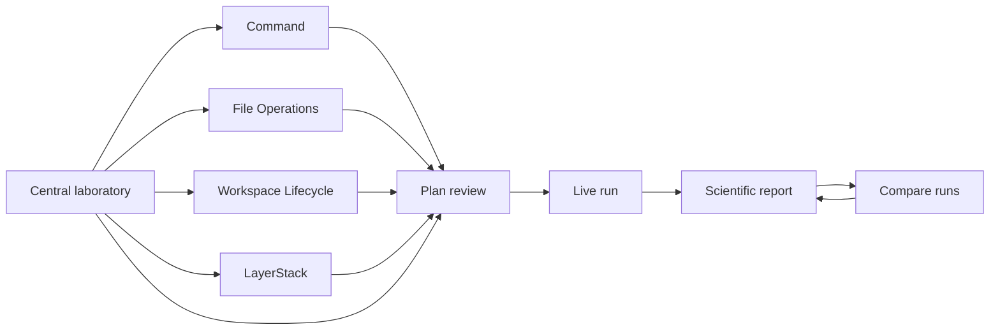
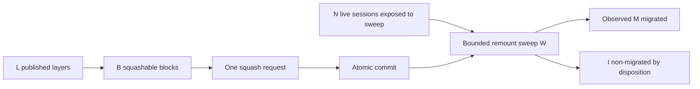

# EphemeralOS Benchmark Laboratory — UI Design

| Field | Value |
|---|---|
| Status | Revised implementation design |
| Date | 2026-07-12 |
| Coordinated contract | [benchmark-system-spec.md](benchmark-system-spec.md) |
| Backend contract | [benchmark-backend-design.md](benchmark-backend-design.md) |
| Adversarial review | [ui-adversarial-review-prompt.md](ui-adversarial-review-prompt.md) |

## 0. Evidence basis and implementation gap

This revision is a normative design selection, not a claim that the benchmark
screens were visually inspected. At review time `ephemeral-sandbox/benchmark/`
contained no runnable benchmark web application or implemented routes, so no
default/configured/error/running/report/comparison state could be exercised at
375, 768, 1,024, or 1,440 px. The coordinated system/backend/UI documents were
read in full, and shared shell, routing, component, test, and dependency patterns
were inspected under `ephemeral-sandbox/web/console/`. All wireframes and state
captures in this document are therefore implementation requirements; section 15
defines how the missing runtime evidence must be produced.

## 1. Design objective

The interface is a scientific instrument for planning, executing, inspecting,
and comparing local benchmarks. It should feel closer to an experiment console
and a research report than to an analytics landing page.

The visual hierarchy is evidence first and decisions second:

1. Verify the runner, free space, and Test workspace root.
2. Understand the complete Default configuration, cost, and safety boundary.
3. Customize only the values needed to answer a different question.
4. Review the exact expanded experiment.
5. Observe execution without treating provisional data as final.
6. Inspect and export correctness, distributions, resources, methods, and raw
   evidence.

“Simple” means fewer required decisions, not hidden scientific behavior. Every
family begins with a visible, versioned, backend-validated Default
configuration that can be reviewed unchanged. The UI never begins with a blank
form or asks a new user to understand role, series, control, and test-combination
expansion before explaining what the default study will do.

The design deliberately avoids a promotional hero, decorative video, glass
effects, oversized KPI cards, and animation that does not encode state. Space is
reserved for experimental context, charts, tables, and warnings.

### 1.1 User-job interaction budgets

These are implementation acceptance targets, not observed measurements. Counts
start on the named route with a ready runner; an activation is one button,
checkbox, selector, or comparable keyboard action. Review and Start are counted
separately, while reading or scrolling is not.

| User job | Decisions before review | Activation budget | Route/context switches | Concepts required before action |
|---|---:|---:|---:|---|
| Run a quick trustworthy benchmark from Central | 0 | 2: Review, Start | 0 | 4: readiness, root, scope, cost/cleanup |
| Measure Command/File concurrency | 0 with the `1/5/20` default; 1 to isolate a file operation | 2 unchanged; at most 6 when isolating one file operation | 0 | 3: operation boundary, concurrent requests, test combinations |
| Create workspaces across profiles and counts | 1 only if opting into Large | 2 default; 4 with Large | 0 | 3: profile, concurrent creations, fixture cost |
| Separate LayerStack squash from remount cost | 0 with default `N=0/1/5/20` | 2 | 0 | 4: one squash, live sessions `N`, `N=0` control, remount policy |
| Decide whether to wait, investigate, or cancel | 0 | At most 1 decision action | 0 | 4: run versus connection state, trial kind/phase, ETA/failures, pressure |
| Decide whether a result is correct, noisy, or constrained | 1 metric/cell selection at most | At most 2 | 0 | 4: correctness, `n`/interval, distribution, resource scope |
| Compare two runs without a false claim | 2: reference and candidate | 3: select both, Compare | 0 | 3: treatment, compatibility, matched cells |
| Reproduce or share the exact experiment | 1 export choice | At most 2 | 0 | 3: canonical plan/hash, environment/fixture identity, raw artifacts |

If implementation exceeds a budget, the extra step must prevent a concrete
safety or scientific error; exposing backend organization is not sufficient
justification.

## 2. Information architecture

There are eight route shapes. A route shape is a page template; each run or
report instance uses the same template.

| Route | Purpose | Primary action |
|---|---|---|
| `/benchmark` | Readiness → Default configuration → optional customization → recent runs. | Review default run / Customize |
| `/benchmark/command` | Boundary → default command study → inline customization. | Review default command run / Customize |
| `/benchmark/files` | Boundary → default operation set → master-detail customization. | Review default file run / Customize |
| `/benchmark/workspace` | Boundary → default profile × count matrix → customization. | Review default matrix / Customize |
| `/benchmark/layerstack` | Boundary → topology → default squash/remount study → customization. | Review default study / Customize |
| `/benchmark/runs/:runId` | Follow one active or historical run. | Cancel / open report |
| `/benchmark/reports/:runId` | Verdict → research summary → complete evidence. | Compare / export |
| `/benchmark/compare` | Select runs → compatibility → matched evidence. | Compare compatible cells |

Settings, plan review, YAML, artifact details, and help are drawers or dialogs.
They do not create additional top-level pages.



### 2.1 Page hierarchy and first viewport

| Route shape | Hierarchy | Desktop above fold | Mobile first ordered content |
|---|---|---|---|
| Central laboratory | Readiness → Default configuration → family scope → recent runs | Environment corrective status, root/free space, exact default scope/estimate, Review/Customize | Runner/root/free-space summary, default scope/cost, Review/Customize; family links follow |
| Command | Boundary → default study → customization → estimate | Count meaning, explicit/automatic boundary, default values/protocol, Review/Customize | Boundary and default summary/actions before collapsed controls |
| File Operations | Boundary → included operations → active editor → estimate | Default operation set and master/detail editor; publish warning beside destination | Boundary/default summary, then one accordion per operation with inclusion and status |
| Workspace Lifecycle | Boundary → profile × count matrix → profile detail → estimate | Independent profile/count axes, selected matrix, requested cost/free-space cue | Default summary, matrix as labeled stacked rows, Large/free-space warning before editor |
| LayerStack | Causal diagram → four input/outcome groups → restart blocks → estimate | One-request/`N` meaning, `N=0` control, topology, default study, Review/Customize | Meaning and `N=0` control, topology, group accordions, estimate; no acronym-only form |
| Live run | Run/connection status → decision-critical progress → resources → log | Overall/current work, trial kind/phase, ETA range, failures/pressure, last event | Same evidence in that order; plots and collapsed log follow |
| Scientific report | Verdict/question → primary evidence → five destinations | Correctness, factors, median/unit/`n`/failures/CI, noise, resources, limitations, comparability | Verdict and research summary first; five destinations become scrollable controls only within their container |
| Compare | Select → treatment → compatibility → matched scope → deltas | Reference/candidate, treatment declaration, passed/failed checks and consequences | Stacked selectors then persistent compatibility; deltas remain below all checks |

## 3. Application shell

### 3.1 Persistent regions

The desktop shell has four regions:

- A 56 px top bar with product title, runner connection state, source commit,
  theme control, and settings.
- A 224 px left navigation containing Overview, four families, Runs, and
  Compare. Do not include a Reports link until a report-index route exists.
- A context strip below the top bar with host, architecture, Docker version,
  image digest, filesystem, dirty-tree status, and test workspace root health.
- A content canvas with a maximum readable width of 1,600 px. Data tables and
  timelines may use the full available width.

On screens below 1,024 px the navigation becomes a Mantine `Drawer` opened by a
`Burger`; Mantine owns its focus trap, Escape behavior, and focus restoration.
At 375 and 768 px the environment strip becomes a compact two-row summary of
runner state, workspace-root health, and free space with a visible **Details**
action. The application header itself never scrolls horizontally, and no
experimental value is dropped from the details view.

### 3.2 Page header

Configuration pages begin with this compact header; live, report, and compare
pages use task-specific status and actions rather than inheriting irrelevant
configuration controls:

```text
Breadcrumb / Family name                                      Runner ● Ready
Page title                               [Load another preset] [Review run]
One-sentence measured boundary and count semantics
```

The subtitle must state what `count` means on the current page. LayerStack must
say: “Exactly one squash request is issued per trial. Live sessions (`N`) is
the number of prepared sessions exposed to the remount sweep; `N=0` is the
squash-only control.”

## 4. Visual language

### 4.1 Color tokens

The default theme is a light paper-like laboratory surface. A dark theme may be
added later using the same semantic tokens; it is not required for v1.

| Token | Value | Use |
|---|---|---|
| Canvas | `#F6F7F9` | Application background |
| Surface | `#FFFFFF` | Panels, dialogs, charts |
| Text primary | `#101828` | Headings and values |
| Text secondary | `#475467` | Labels and methods notes |
| Border | `#D0D5DD` | Separators and chart frames |
| Instrument navy | `#17324D` | Navigation and stable series |
| Experimental blue | `#2563EB` | Selected factor and varied series |
| Success green | `#16845B` | Correct and complete |
| Warning amber | `#B7791F` | Exploratory or incompatible |
| Warning text | `#8A5A12` | Normal-size warning text on white |
| Failure red | `#C2413B` | Incorrect, failed, destructive warning |
| Neutral gray | `#667085` | Warmups, unavailable data |

Status is never represented by color alone. Pair color with an icon, label,
pattern, or line style. Chart palettes must remain distinguishable under common
color-vision deficiencies. Controls use WCAG AA contrast. Warning amber is an
accent for borders/icons; normal warning text uses the darker warning-text token
because `#B7791F` does not reach 4.5:1 on white.

### 4.2 Typography and numbers

- UI and prose: Fira Sans, falling back to `system-ui, sans-serif`.
- Values, units, identifiers, factor expressions, and code: Fira Code, falling
  back to `ui-monospace, monospace`.
- Body size: 14 px desktop; normal form and prose text is at least 16 px at
  375 px.
- Page title: 24 px/32 px; section title: 16 px/24 px.
- Numeric tables use tabular numerals, right alignment, and a separate unit
  column when values could otherwise be ambiguous.
- Raw byte and nanosecond values appear in tooltips/details, not as the only
  human-readable display.

### 4.3 Density and geometry

Use a 4 px base spacing grid. Panels use 12–16 px padding, 6 px radius, a 1 px
border, and no decorative shadow. Table rows default to 36 px. Interactive
targets remain at least 44 × 44 px even in dense layouts. Sticky controls use a
solid surface and border so underlying data never bleeds through.

`Paper` or `Card` represents a real semantic boundary such as readiness,
configuration summary, or a chart frame. Section hierarchy should prefer
spacing, typography, separators, and table structure; an identical floating-card
grid for every region is forbidden. Monospace is limited to identifiers, paths,
hashes, factor expressions, and values—not explanatory paragraphs.

Motion is limited to 120–180 ms disclosure and status transitions. Provisional
measured values do not interpolate between observations. `prefers-reduced-motion`
disables nonessential transitions and animated progress.

### 4.4 Mantine theme mapping

Add or reuse semantic theme values rather than page-local colors:

- `fontFamily: "Fira Sans, system-ui, sans-serif"` and
  `fontFamilyMonospace: "Fira Code, ui-monospace, monospace"`;
- 4 px-based spacing, `defaultRadius: 6`, 1 px semantic borders, and a shared
  2 px focus-ring style with sufficient offset;
- named color scales/variables for canvas, surface, text, border, instrument,
  experiment, success, warning accent/text, failure, and neutral;
- tabular-numeral utility/class for every measured value and estimate;
- `Button` variants for instrument-primary, neutral-secondary, and dangerous;
  labeled status `Badge` variants; bordered `Paper` section variant; and
  scientific `Table` styles with stable label/value/unit columns.

Status mappings, chart series colors/line styles, spacing, radii, and table
numeric alignment live in the theme or shared product variants. Inline one-off
colors and spacing are not part of the implementation contract.

## 5. Layout decision and default-first experiment builder

The central and family configuration pages use one selected layout hypothesis.
The alternatives below are structurally different, not visual variations of the
same card grid. Count examples derive from `standard-local` file factors—the
File Read slice in Alternative A and the complete File family in Alternative C.
Time, disk, and free-space values remain backend-supplied rather than UI
constants.

### 5.1 Alternative A — Default summary with inline customization

This candidate starts with the complete Default configuration, then expands the
same page only when the user chooses **Customize**.

```text
Desktop — default
┌ Measured boundary and count meaning ──────────────────────────────────────┐
│ Timer starts … · “Concurrent requests” means …                            │
└───────────────────────────────────────────────────────────────────────────┘
┌ Default configuration ─────────────────────────────────── Version 1 ──────┐
│ Research question                                                         │
│ Operations · values that change · values held constant · protocol         │
│ 9 combinations · 288 trial batches · 2,496 issued requests                │
│ 18–26 min · 4.2 GiB peak disk · validation current                        │
│ [Review default run] [Customize] [Load another preset]                    │
└───────────────────────────────────────────────────────────────────────────┘

Desktop — customization expanded
┌ Customized configuration ───────────────────┬ Validated estimate ─────────┐
│ Changes across test combinations             │ 18 combinations             │
│ Concurrent requests [1] [5] [20] [+ Custom] │ 576 trial batches           │
│ Returned bytes [4 KiB] [64 KiB] [256 KiB]    │ 4,992 issued requests        │
│ Source [Published snapshot] [Live session]    │ 22–31 min · 5.1 GiB         │
│ Added Live session · Default: Snapshot [Reset]│                              │
│ Values held constant                         │ 1 warning · Current          │
│ Advanced protocol ▸              [Reset all] │ [Review 18 combinations]    │
└──────────────────────────────────────────────┴─────────────────────────────┘
```

```text
Narrow — default and expanded states
[Measured boundary and count meaning]

Default configuration                         Version 1
Operation               Read files
Concurrent requests     1, 5, 20
Returned bytes          4, 64, 256 KiB
Protocol                2 warmups · 30 measured
Estimate                18–26 min · 4.2 GiB
[Review default run]
[Customize]

Customized configuration                    [Reset all]
[Changes across test combinations]
[Changed-from-default detail]
[Values held constant]
[Advanced settings ▾]

Sticky: 18 combinations · 1 warning · Current
[Review customized run]
```

### 5.2 Alternative B — Guided question-first configuration

This candidate asks for a study question, operation, scale, and protocol in a
sequence, then reveals the expanded plan.

```text
Desktop
┌ Steps ───────────────┬ Current question ──────────────────────────────────┐
│ 1 Question       ●   │ What do you want to learn?                         │
│ 2 Operation      ○   │ ( ) Concurrency scaling                            │
│ 3 Scale          ○   │ ( ) Payload scaling                                │
│ 4 Review         ○   │ ( ) Exact custom study                             │
│                      │                                      [Continue]    │
└──────────────────────┴────────────────────────────────────────────────────┘

Narrow
Step 1 of 4 · Question
What do you want to learn?
( ) Concurrency scaling
( ) Payload scaling
( ) Exact custom study
[Continue]
```

### 5.3 Alternative C — Compact always-open experiment workspace

This candidate exposes a dense factor editor immediately, prepopulated with
default values, with plan evidence beside it.

```text
Desktop
┌ Operations ─────────┬ Factors and protocol ─────────────┬ Plan evidence ──┐
│ ☑ Read              │ Concurrency  Varied  1,5,20  ★1  │ 36 combinations │
│ ☑ Write             │ Per-op size  Varied  3 values    │ 1,152 batches   │
│ ☑ Edit              │ Source/mode  Fixed per operation │ 9,984 requests  │
│ ☑ Blame             │ Warmups 2 · measured 30          │ 18–26 min       │
└─────────────────────┴───────────────────────────────────┴─────────────────┘

Narrow
[Operations ▾]
[Factors ▾]
[Protocol ▾]
[Plan evidence ▾]
Sticky: 36 combinations · Review
```

### 5.4 Weighted decision

Scores use 1 (poor) through 5 (strong).

| Criterion | Weight | A: Default + inline | B: Guided questions | C: Always-open workspace |
|---|---:|---:|---:|---:|
| First-run comprehension | 20% | 5 | 5 | 2 |
| Common-task speed | 15% | 5 | 3 | 5 |
| Scientific transparency | 20% | 4 | 3 | 5 |
| Error prevention and safety | 15% | 5 | 5 | 3 |
| Dense-data scalability | 10% | 4 | 2 | 5 |
| Responsive behavior | 10% | 5 | 5 | 2 |
| Mantine implementation fit | 10% | 5 | 4 | 4 |
| **Weighted score** | **100%** | **4.70** | **3.90** | **3.70** |

Evidence for every score:

- **A — 5/5 comprehension:** the measured boundary and exact runnable default
  precede controls. **5/5 speed:** an unchanged run needs Review then Start;
  customization stays in context. **4/5 transparency:** all resolved values are
  visible, but canonical roles are one disclosure deeper. **5/5 safety:** cost,
  path, validation, warnings, and reset precede submission. **4/5 density:** the
  inline editor scales well, though very large designs still need grouped
  disclosures. **5/5 responsive:** summary and controls stack without changing
  task order. **5/5 Mantine fit:** `Paper`, `Collapse`, `Grid`, `Accordion`, and
  sticky layout primitives cover the interactions.
- **B — 5/5 comprehension:** one plain-language decision appears at a time.
  **3/5 speed:** repeat users cross several steps even for a small edit. **3/5
  transparency:** expansion and controlled values appear late. **5/5 safety:**
  invalid branches can be prevented before review. **2/5 density:** cross-factor
  editing and comparison require backtracking. **5/5 responsive:** the linear
  sequence fits narrow screens. **4/5 Mantine fit:** standard controls fit, but
  route/state orchestration is more complex than the selected task needs.
- **C — 2/5 comprehension:** backend vocabulary and a dense factor table arrive
  before the study explanation. **5/5 speed:** experts can edit any factor
  immediately. **5/5 transparency:** all plan mechanics are continuously
  visible. **3/5 safety:** estimates help, but the number of simultaneous
  controls makes unintended expansion easier. **5/5 density:** it best supports
  large expert designs. **2/5 responsive:** three simultaneous regions collapse
  into long, context-poor accordions. **4/5 Mantine fit:** the controls fit, but
  the dense workspace requires more local layout behavior.

**Decision: Alternative A.** It provides a trustworthy two-action default run
and preserves exact editing in the same scientific context. It is not a wizard,
does not open configuration work in a modal/drawer, and does not use a preset
gallery as the primary page. One strength from Alternative C is retained: once
customization opens, experts can edit exact factors directly without stepping
through questions.

### 5.5 Definitions and Default configuration contract

`GET /definitions` has a versioned envelope with three distinct fields:
`catalog`, the backend projection of compile-time scientific definitions;
`defaults`, complete scoped Default plans; and `presets`, complete validated
preset plans. The catalog provides stable family and operation ids; semantic
and factor-schema revisions; count semantics; supported client cohorts; factor
ids, labels, units, bounds, and roles; isolation and product-access
descriptions; and registered metric, phase, and correctness-check metadata.
Defaults and presets are strict versioned data, not behavior definitions. The
catalog is the source for semantic labels and constraints, not a schema-driven
page builder, runtime dispatch registry, or source of report statistics. The UI
owns an explicit, exhaustive mapping from the closed operation ids to family
pages and typed operation-specific controls. An operation with no supported UI
mapping is a client/server version error and cannot fall back to a generic form
that might expose an unsafe or meaningless combination.

The versioned `standard-local` plan is a separate backend-authored Default that
references those definitions. Family slices use an `(id, version, scope)` key:
`all` for the central page and `command`, `files`, `workspace`, or `layerstack`
for a family page. Validation/expansion returns the canonical plan,
`ExpandedPlan` summary, estimates, and `plan_hash`. The browser does not
duplicate scientific defaults or validation rules as constants. The first
render exposes:

- the plain-language research question and measured boundary;
- enabled operations;
- **Changes across test combinations** and **Values held constant**;
- effective warmup/measured-trial groups;
- test combinations, trial batches, issued product requests, duration range,
  disk/free-space check, gateway restarts, cleanup, and warnings;
- **Review default run**, **Customize**, and secondary **Load another preset**.

Entering Customize clones the default into a draft but does not itself change
the plan. `is_customized` is derived from backend-canonical equality, excluding
only machine-local workspace-root resolution. The first canonical difference
changes the heading to **Customized configuration**. Each changed control shows
its default value and Reset action; **Reset all to default** restores the exact
server-authored plan. Resetting the final difference returns to Default state.
Loading a preset replaces the draft with its complete scoped plan. Validation
requires the embedded `configuration_base` to match the page's scoped Default;
the preset is not a new reset/equality base. Optional starting-preset
provenance is kept outside the canonical plan and does not affect
`is_customized` or `plan_hash`. Switching preset or importing YAML while
differences exist requires discard confirmation.

Preset discovery is data-driven. A versioned preset that uses existing
operations and factors—such as **High Contention File Writes**—appears in
**Load another preset**, validates through the same plan endpoint, and opens in
the existing typed controls without a new route, component, or browser registry.
The UI never treats a preset as executable behavior or accepts component names,
product operations, safety overrides, or arbitrary scripts from preset data.

The current `/definitions` response is used only for creating and validating
new plans. A historical report renders labels, units, factor meanings, count
semantics, and revisions from the immutable definition snapshot in that run's
manifest. It must not reinterpret old evidence using the runner's current
definitions.

### 5.6 Inline customization and estimate states

`ExperimentBuilder` expands in a Mantine `Collapse`. At 1,024 px and wider it
uses an 8/4 `Grid`: controls on the left and a sticky `PlanEstimateBar` on the
right. At 375 and 768 px it uses one column and a sticky bottom estimate/action
bar; equivalent bottom padding prevents the bar from covering the last control.

The estimate has explicit **Updating**, **Current**, **Warning**, and **Invalid**
states. It is accepted only from the latest backend validation request and shows
validation age/hash. Review is disabled while the estimate is updating, stale,
or invalid. The sticky region always shows combinations, issued requests,
duration, disk, warnings, and freshness; trial batches remain one detail away
when narrow space cannot show all values.

### 5.7 Factor controls and progressive disclosure

Primary labels use friendly language. Exact role, control, symbol, and canonical
value stay in supporting detail and Methods.

| Need | Mantine direction |
|---|---|
| Bounded common values | `Chip.Group`, `Radio.Group`, or `SegmentedControl` |
| Multiple values plus typed custom values | `MultiSelect` or validated `TagsInput` |
| Numeric value | `NumberInput` with persistent label, unit, description, and error |
| Advanced groups | `Accordion` |
| Optional conditional detail | `Collapse` |

Canonical factor roles are `varied` and `controlled`. Fixed/series/range are
UI-only entry conveniences normalized to explicit typed values; derived values
are read-only outcomes, never factor fields. `Range` previews its explicit
series. `4 MiB` also displays resolved `4,194,304 B`. Duplicates, invalid ranges,
unsupported combinations, and explosive expansion produce adjacent errors or
explicit warnings. Do not build a custom select/combobox for bounded factors.

### 5.8 Protocol, environment, safety, YAML, and plan review

The collapsed protocol summary lists effective warmups and measured trials by
cell class. A mixed file plan may show “read, blame, and session mutation: 2 +
30” and “publish mutation: 1 + 10”; it must not claim one family-wide value.
Advanced protocol exposes only warmups, measured trials, seed, order, request
timeout, raw resource sampling interval, and an explicit family-wide protocol
override. Failure behavior, containment, cleanup requirements, and safety caps
are not protocol choices.

Environment and scientific cohort are a separate group. It shows the sandbox
image and a supported **Client cohort** such as `direct_client` or `cli_e2e`;
these are scientifically distinct and never presented as interchangeable
transport preferences. A future remote-product cohort may show a redacted
endpoint identity and machine-local credential binding, but credentials never
enter browser state, portable YAML, copied citations, or artifacts. The Test
workspace root is a machine-local runner binding rather than an experimental
factor.

Fixed safety policy is visible but read-only: the benchmark gateway is isolated,
internal operations use an exact allowlist, workspace containment and ownership
markers are required, and operation/fixture/output caps cannot be raised by the
plan. There is no `gateway_mode` control. Artifact retention and diagnostic
logging are runner-administration settings outside the experiment plan and
`plan_hash`; changing them cannot create plan fields or executor behavior.

**Inspect configuration YAML** opens `YamlPlanDrawer` at 640 px and full-screen
below 768 px. Canonical YAML semantically round-trips role, explicit values, and
control; UI-only range entry is not reconstructed. The drawer supports copy,
import, reset, schema errors, and a default-versus-draft diff. Unknown fields are
rejected. Portable YAML contains experimental factors, protocol, and portable
environment/cohort choices only. It omits the resolved Test workspace root,
credentials, gateway mode, retention, logging, internal access paths, and safety
caps; the review shows their locally resolved effective values separately.

No run bypasses `PlanReviewModal`. It uses semantic sections and a sticky footer
to show exact operations/cells, test combinations, trial batches, issued product
requests, effective protocols, duration range, peak disk/free-space requirement,
gateway restarts/family order, workspace root and derived directory classes,
cleanup policy, correctness gates, client cohort, definition/semantic revisions,
warnings, and current `plan_hash`. A separate **Runner administration** note may
show effective artifact retention and diagnostic logging, explicitly labeled
“not part of this experiment plan.”

Unchanged copy is **Review default run**; customized copy is **Review 18 test
combinations**; confirmation is **Start local run**. Disk risk, a Large fixture,
publish mutation, or LayerStack destruction places a visible warning immediately
above confirmation. The runner’s containment/marker rules, not a typed phrase,
provide the safety boundary.

## 6. Central Benchmark Laboratory page

The central page is an experiment launcher and recent-evidence index, not a
marketing overview.

```text
┌─ Runner and workspace readiness ──────────────────────────────────────────┐
│ Ready · Test root …/ephemeral-sandbox-test-workspace · 412 GiB free       │
│ APFS · source a1b2c3d (dirty) · isolated gateway       [Inspect] [Settings]│
└───────────────────────────────────────────────────────────────────────────┘
┌─ Default configuration ─────────────────────────────────── Version 1 ─────┐
│ Command · Files · Workspace · LayerStack · sequential family execution   │
│ Exact scope · combinations · trial batches · issued requests · time · disk│
│ [Review default run] [Customize] [Use Quick Smoke instead]                │
└───────────────────────────────────────────────────────────────────────────┘
┌─ Customize family scope and exact values — collapsed by default ─────────┐
└───────────────────────────────────────────────────────────────────────────┘
┌─ Open one family ─────────────────────────────────────────────────────────┐
│ Command · File Operations · Workspace Lifecycle · LayerStack              │
└───────────────────────────────────────────────────────────────────────────┘
┌─ Recent runs ─────────────────────────────────────────────────────────────┐
│ Run       Question     Commit  State       Correct  Duration  Started     │
│ ...                                                                       │
└───────────────────────────────────────────────────────────────────────────┘
```

The first desktop viewport and the first mobile screenful answer what can run,
runner/root health, safest useful first run, duration/disk range, and whether one
family or all enabled families will run. Quick Smoke is explicitly labeled the
lowest-cost setup check; it does not silently replace the Default configuration.
The Test root value itself remains visible, middle-elided only when necessary;
its accessible name and the focusable Details view expose the complete path, so
location evidence never depends on hover.

Family navigation is a compact list, not four identical KPI cards. A recent
result may appear only with operation, factor cell, metric/unit, successful `n`,
failure count, and timestamp; a bare “Latest 4.8 ms” is forbidden.

**Run All Locally** executes Command → Files → Workspace → LayerStack in
sequence after plan review. Family links open the same default-first layout for
a local family run. The central page shows one active-run banner globally
because the runner accepts one campaign at a time. Environment failures use an
inline `Alert` with the exact cause and corrective action, not a generic red
readiness badge.

## 7. Family pages

### 7.1 Command

The page order is measured boundary, Default command configuration, Review or
Customize, exact command/session controls, advanced protocol, then estimate.
The operation boundary selector is prominent:

- **Explicit session**: measures the command request against a prepared session.
- **Automatic session**: includes create, publish, and destroy lifecycle and is
  a different cohort.

Command cases use compile-time allowlisted templates (`true`, bounded output,
CPU, fixture read). The product operation accepts a shell command string, so the
review shows the exact rendered `cmd`, effective configured shell behavior, typed bounded
template parameters, expected output contract, and timeout. Template parameters
cannot inject shell syntax, and stored stdout/stderr remains capped by fixed
safety policy. V1 has no arbitrary command text field, custom argv editor, or
“advanced” escape hatch; adding a command case requires a typed definition,
security review, correctness expectation, and tests.

The design preview shows concurrency on the horizontal axis and small multiples
for workspace profile or command case. Primary outcomes are request latency,
batch makespan, throughput, memory delta, and disk delta.

### 7.2 File Operations

Four operations need both inclusion in the family run and focused editing. Tabs
would express only the latter and a separate family-set popover would hide the
former, so the page uses an included-operation master/detail layout.

```text
Desktop
┌ Operations included ─────────┬ Active operation editor ───────────────────┐
│ ☑ Read          Configured   │ Read definition and measured boundary      │
│ ☑ Write         Session      │ Returned bytes · snapshot/session          │
│ ☑ Edit          Session      │ Independent files / same-file contention   │
│ ☑ Blame         Configured   │ Protocol and changed/default values        │
└──────────────────────────────┴─────────────────────────────────────────────┘
```

The inclusion checkbox controls what runs; selecting the row controls what is
edited. Active and included states have distinct labels and focus treatment.
In the desktop master list, a Mantine `Checkbox` and the 44 px editor-selection
button are sibling controls, never nested interactive elements. Switching rows
retains every draft. At 375 and 768 px the same data model uses a Mantine
`Accordion`; each `Accordion.Item` starts with a `Group` containing a sibling
inclusion `Checkbox` and `Accordion.Control`, followed by a concise
configuration/warning summary. The checkbox is never placed inside the
accordion button.

The active operation editor shows only factors valid for that operation:

- Read: returned bytes/lines, snapshot/session, independent/same file.
- Write: content bytes, session/publish, independent/same path.
- Edit: file bytes, replacements, match density, session/publish.
- Blame: line count, ownership segments, auditability event count.

The operation definition is pinned above its controls. User-facing labels are
**Published snapshot** / **Live session** and **Independent files** / **Same
file contention**, with exact canonical values in supporting text. The
publish/replace warning is beside the destination control that enables it and
states that a fresh sandbox/LayerStack is required per trial. Effective warmup
and measured-trial defaults plus added setup cost update per operation/cell.

### 7.3 Workspace Lifecycle

This page presents a two-dimensional experimental design:

- Workspace profile controls fixture scale: file count, actual bytes, and tree
  depth.
- Workspace count controls concurrent session creation: `1`, `5`, or `20`.

The Default configuration summary and primary customization surface is a matrix
with profile on rows and concurrent session creations `1`, `5`, and `20` on
columns. Each selected cell displays trial batches, estimated materialized
bytes, and duration. Before fixture validation every amount is labeled
**Requested** or **Estimated**; only a materialized fixture manifest may label
actual file count, logical bytes, allocated bytes, and depth **Actual**. Large
is unchecked by default and pairs an explicit cost cue with current free-space
status, target path, cleanup, and a read-only runner-retention note outside the
plan. The profile editor is a local collapsed `Accordion`, not the initial page.

The operation definition says that `create_workspace` is the benchmark label
for the internal `create_workspace_session` test adapter. It is not represented
as a newly available public operation.

Named profiles supported by the existing fixture generator are data. Adding a
**Metadata Heavy** profile makes one more labeled matrix row/profile option with
its backend-authored requested file count, depth, estimated materialization
cost, generator revision, and warnings; it does not add a route or executor UI.
After materialization, the same row/report replaces estimates only with
manifest-backed actual file/directory counts, logical and allocated bytes,
depth, fixture hash, and cache status.

### 7.4 LayerStack

LayerStack uses a topology-oriented builder because its factors have a causal
structure.



The page has exactly four causal groups:

1. **Storage topology** — `B`, layers per block, and payload.
2. **Live-session load** — `N`, requested migration ratio, and activity.
3. **Remount policy** — remount parallelism `W`.
4. **Outcomes to measure** — read-only total/storage/remount phases, observed
   `M`, calculated `I`, dispositions, and reclaimed bytes.

Only `N`, requested migration ratio, `W`, `B`, layer count, payload, and
activity are inputs. `M`, `I`, dispositions, reclaimed bytes, and phase times
never render as fields. `N=0` is visibly starred as the squash-only control and
the copy says that `N` counts prepared sessions exposed to the sweep, not
successful remounts.

Changing `W` may require isolated gateway restarts. The plan review groups cells
by `W` and displays restart blocks. The primary outcomes preview lists total,
plan, flatten, commit, sweep, per-session remount, reclaimed bytes, and
disposition counts. It also states that only the isolated benchmark gateway is
restarted; the user's ordinary gateway is not touched.

### 7.5 Adding operations and families

The shared family shell owns inclusion, changed/controlled summaries, protocol,
environment/cohort, estimates, review, and reset behavior. Each operation owns a
small typed control component selected by an exhaustive `OperationId` switch;
the UI does not turn factor metadata into an arbitrary executor form.
One exhaustive `FamilyId` route map owns navigation and page selection; labels
and semantic descriptions come from definitions rather than being copied into
navigation, presets, reports, and comparison logic.

For example, adding `file_list` to File Operations adds one master-list row and
`FileListControls` for directory breadth, directory depth, and result limit.
Breadth and depth are fixture/topology inputs and the result limit is shown only
if the product definition supports it beneath its fixed safety cap. The existing
file family shell, concurrency control, protocol, estimate, YAML, plan review,
live run, generic results, and report destinations remain unchanged. The
definition supplies canonical ids, labels, units, constraints, semantic
revision, count meaning, HTTP-only product path, and comparison identity; the
explicit control component supplies the meaningful layout and explanatory copy.

Adding `destroy_workspace` to Workspace Lifecycle adds an explicit operation
selector and `DestroyWorkspaceControls`, not another page or scheduler UI. Its
boundary text says that C sessions are prepared during setup, released for
concurrent destruction during the measured operation, checked for registry and
resource removal during correctness verification, and cleaned residually during
teardown. The existing profile/count matrix may be reused where those inputs
have the same meaning, while timing labels must not call the measured destroy
work “teardown.”

A new family is intentionally less automatic. Adding Sandbox Lifecycle requires
a new `FamilyId`, navigation item, route, page, research boundary, topology, and
operation-specific controls for `create_sandbox` and `destroy_sandbox`. It still
reuses the application shell, Default/configuration contract, protocol and
environment groups, estimate/review flow, live-run page, evidence tables,
backend-authored reports, comparison panel, and accessibility behavior. “Zero
UI files changed” is not a goal when a family introduces a different product
meaning or topology.

## 8. Live run page

The live page distinguishes operational monitoring from finalized inference.
Every result is labeled **Provisional** until the run reaches a terminal state
and summaries are finalized.

```text
Run 01J... · Concurrency Scaling · RUNNING                         [Cancel]
Commit a1b2c3d (dirty) · Plan 68cd... · Connection: Live
Elapsed 06:42 · ETA 14:20–17:10 · 1 warning · resource pressure normal

Families  Command ✓  Files ●  Workspace ○  LayerStack ○
Progress  █████████████░░░░░░  46 / 102 combinations · 1,442 / 3,060 trial batches
Requests  6,210 / 12,480 issued product requests

┌─ Progress matrix ───────────────┬─ Current work ──────────────────────────┐
│ rows=factor A, columns=factor B │ Measured trial 18/30                    │
│ ✓ ✓ ✓ ● ○                      │ Setup → Operation                       │
│                                │ → Correctness verification → Teardown   │
│                                │ file_read · c=20 · 64 KiB               │
│                                │ Last: response verified 3 s ago         │
└────────────────────────────────┴─────────────────────────────────────────┘
┌─ Resource telemetry ──────────────────────────────────────────────────────┐
│ synchronized memory / disk / throughput plots; fixed phase markers        │
└───────────────────────────────────────────────────────────────────────────┘
┌─ Event log — collapsed unless warning/failure ────────────────────────────┐
│ time       level  family   cell      event                                 │
└───────────────────────────────────────────────────────────────────────────┘
```

Above telemetry, the page must answer whether to wait, investigate, or cancel:
overall progress; current family/cell/trial; Warmup or Measured trial kind;
setup/operation/correctness-verification/teardown phase; elapsed time; honest
ETA range; failures; resource pressure; connection state; and last meaningful
event. Provisional values never animate as though they were final inference.

The cell matrix states are queued, setting up, operating, verifying, tearing
down, complete, failed, cancelled, and skipped. Trial kind is independently
labeled Warmup or Measured; warmup is not a phase. A Gantt detail view shows
request spans inside a batch and, for LayerStack, separate storage and remount
phases. Registered operation-specific phases use stable namespaced ids and the
run's definition snapshot. For example, command queue delay appears only for
`exec_command`, correlated to its request, without an empty “queue delay” row on
unrelated operations. The event log is secondary until a warning/failure, then
opens with the relevant event in context. TanStack Virtual is used only for a
long log; it is filterable and downloadable without making every row a tab
stop.

Connection state uses distinct **Live**, **Reconnecting**, **Replaying missed
events**, and **Stale** labels. None changes the persisted run to Failed. A
reconnect sends `Last-Event-ID`, displays replay progress, then returns to Live.
Mantine `Progress`, labeled `Badge`, `Alert`, and `Accordion` provide the common
interaction and status behavior.

Cancel opens a confirmation that explains: completed evidence is retained,
future trials are not started, active owned work stops at an operation-safe
boundary or timeout, and teardown is still attempted. It does not expose PID or
container implementation details. Duplicate cancel/start controls disable while
the mutation is pending.

## 9. Scientific report page

The report API is the sole owner of statistical and comparison results. It
returns versioned summary rows, intervals, exclusions, distribution points,
resource series, correlations, compatibility decisions, and plotting/table
projections derived from immutable observations. The browser may select,
filter, sort, and format these server-authored values, but it never recomputes a
median, percentile, confidence interval, correlation, exclusion, comparison key,
or compatibility verdict. Chart and table views consume the same report-model
fields so they cannot disagree.

The report has five destinations in this order:

1. Summary
2. Results & distributions
3. Resources
4. Correctness
5. Methods & data

These are direct-linkable destinations, not hiding places for evidence that is
needed to interpret the first result. The persistent header and first desktop
viewport—and the initial ordered mobile content—show correctness verdict,
research question, values changed and held constant, primary median/unit,
successful `n`, failures, confidence interval or omission reason,
noise/distribution shape, resource consequence, limitations, and comparability.
Mantine `Tabs` may switch the five destinations after that persistent evidence;
the active tab is encoded in the URL and the narrow `Tabs.List` scrolls only
inside its own labeled container.

### 9.1 Report header

The header contains the run name/id, terminal state, correctness verdict,
source commit and dirty badge, plan hash, environment compatibility fingerprint,
operation semantic/factor-schema revisions, definition-snapshot version,
start/end times, and actions for Compare, Copy citation, Export JSON, and Export
CSV. A report with any failed correctness gate has a persistent red verdict.
Historical labels, units, factor meanings, count semantics, and method copy come
from the run's immutable definition snapshot, never the current `/definitions`
response. If that snapshot/schema cannot be read, the UI shows an explicit
unsupported-artifact state instead of guessing with current metadata.

### 9.2 Summary

Summary begins with the research question and friendly **Changes across test
combinations** / **Values held constant** groups; canonical varied/controlled
roles remain in supporting detail. It then shows a compact result table, never
standalone “performance score” cards:

| Operation / cell | n / failed | Median [95% CI] | p95 | Batch | Memory Δ | Disk Δ |
|---|---:|---:|---:|---:|---:|---:|

Beside or below the primary row, concise evidence states distribution/noise,
resource consequence, limitations, and comparability. Below that, a factor-trend plot shows raw points, median, and median 95%
confidence band. If a control exists, a control-value comparison table reports
absolute and percentage differences with the bootstrap interval for median
difference. It is not an automatic regression verdict;
language is descriptive in v1.

### 9.3 Results & distributions

Results contains a sortable grouped table and small-multiple factor plots.
Two-dimensional studies use annotated heatmaps with a number in every cell.
LayerStack additionally includes:

- a phase decomposition bar for plan, flatten, commit, and sweep;
- per-session remount latency distributions;
- requested `N` versus observed `M` and `I` disposition diagram;
- S0/S1/S2/S3 disk allocation flow and reclaimed bytes.

#### Distribution views (“distograms”)

Within this destination the subsection label is **Distributions**; “distogram”
may remain a short internal component name. Here `n` means successful measured
observations for the selected metric in the selected cell; warmups and failed
observations do not select the display form. The scientific display is:

- `n < 30`: horizontal box plot plus all raw observations with deterministic
  beeswarm jitter, median, and confidence interval.
- `n ≥ 30`: aligned histogram and ECDF with the same selected metric and unit.
- Median confidence interval is absent with an explicit reason below five
  successful samples; p95 is labeled exploratory below 20 successful samples;
  p99 is absent in v1.

```text
Latency distribution · file_read · c=20 · 64 KiB · n=30 · unit=ms
┌─ Histogram ────────────────────────────┬─ ECDF ────────────────────────────┐
│ count                                  │ cumulative probability            │
│     ████     median 5.4                │                    ┌──────── 1.0  │
│  ██ █████ ██  CI [5.1, 5.8]            │            ┌───────┘              │
│ ───────────────────────── latency      │ ──────────── latency              │
└────────────────────────────────────────┴───────────────────────────────────┘
Freedman–Diaconis bins · 2 Tukey flags retained · p95 exploratory: no
```

A metric selector changes latency, makespan, memory delta, or disk delta.
Series selection is explicit; the default never overlays more than five cells.
Every plot offers **View data table**, keyboard inspection, and copy/download.
The tooltip shows trial id, exact value, factors, warmup/failure state, and raw
integer unit. Outliers are flagged, not removed.

### 9.4 Resources

Resources contains synchronized time-series panels for sandbox memory, daemon
RSS, runner RSS, workspace/layerstack allocation, and host free space. A shared
cursor displays the exact sample time. Shaded regions identify setup, operation,
correctness verification, and teardown; only the operation region feeds the
primary delta.

Memory scopes remain separate. Disk views switch between logical and allocated
bytes and state when a value is sampled. LayerStack uses an additional S0–S3
waterfall. Registered CPU-time and block-I/O metrics reuse the same metric-
definition, time-series, table, unit, scope, availability, and export contract;
operation pages and executors do not acquire metric-specific fields.
“Unavailable” is rendered as text and a hatched gap with its reason, never zero.

When compatible CPU observations already exist, Resources may add a
**CPU versus latency** correlation view. Its points, coefficient, interval or
omission reason, successful support count, excluded failures, metric revisions,
and missing-data reasons are authored by the backend report builder. The UI
does not join samples or calculate a coefficient. Adding this view changes no
plan, executor, raw-observation schema, or operation-specific component.

### 9.5 Correctness and Methods & data

Correctness lists stable namespaced check ids/revisions by operation, passed and
failed counts, failure details, response hashes, bounded retained evidence, and
evidence-truncation metadata. A newly registered check, such as post-command
filesystem integrity, uses the same rows, verdict presentation, and artifact
links without executor-specific report UI. Timing plots default to successful
samples, with a visible failure count and a toggle to locate failed trials.

Methods & data is one destination with direct anchors for both sections.
Methods is a publication-ready record of operation boundary, plan, count
semantics, fixture generator/version/hash, randomization, clocks, sample
interval, statistical formulas, exclusions, environment, and limitations.
It also identifies the definition snapshot and operation, factor, metric,
phase, check, artifact-reader, and report-derivation revisions used to interpret
the evidence.

Data exposes artifact files, schemas, sizes, hashes, CSV/JSON exports, and safe
links to individual trial evidence. It does not expose daemon tokens, complete
environment variables, or arbitrary host paths.

Every uPlot view has an accessible name, keyboard inspection, and complete
Mantine/TanStack table alternative. The visible chart frame states metric
definition, unit, successful `n`, failures, control/reference, interval method,
raw-point availability, and any truncated axis. Legends sit adjacent to data;
tooltips are supplementary and never hold required evidence.

## 10. Compare page

The hierarchy is reference/candidate selection, declared treatment difference,
compatibility checks with consequences, matched-cell scope, and only then
deltas/distributions. `CompatibilityPanel` renders the backend comparison
decision and its checks: operation id and semantic revision, factor-schema
revision and canonical typed factors, client cohort and product-access identity,
fixture identity, sandbox image/runtime invariants,
host/kernel/Docker/filesystem, measurement revisions, and sampling protocol. A
Release Comparison may declare source/product-binary identity as treatment;
that intended difference is shown separately rather than failed as an
environment mismatch.
Reference and candidate must have the same versioned comparison protocol and
the same treatment-field allowlist. A mismatch is an incompatible check with
an explanation; the UI never unions the declarations or offers to broaden one
after execution. Two runs with no declaration use the versioned default
same-treatment protocol; an absent-versus-explicit pair does not silently
inherit the explicit declaration.

```text
Reference  01J... a1b2c3d       Candidate 01K... d4e5f6a
Treatment: source/product binary intentionally differs
Compatibility: 8 passed · 1 mismatch
! Filesystem differs: APFS vs ext4 — matched aggregate comparison unavailable
[Show side by side anyway: descriptive only]
```

Compatible comparisons show matched-cell scope, then paired rows with
reference/candidate median, absolute change, percent change, confidence interval
of median difference, correctness change, and raw distributions. Absolute
change is `candidate - reference`. Percent change is
`(candidate - reference) / reference × 100` only for ratio-scale metrics with a
positive reference; otherwise it is unavailable with a reason. Rows say
**candidate latency higher**, **throughput lower**, or neutral descriptive text;
sign and red/green never independently mean better/worse. V1 has no automatic
p-value or performance regression verdict. These values and eligibility rules
arrive in one versioned backend comparison model; the browser does not derive
them from the two report payloads.

An incompatible comparison is blocked by default. The explicit override shows
side-by-side evidence, keeps every mismatch reason persistent, labels the entire
view and every result **Descriptive only**, and suppresses aggregate claims and
regression verdicts. The override is not a modal because selection,
compatibility, and evidence need persistent side-by-side context.

## 11. Settings drawer

The ordinary settings drawer has one editable filesystem field:

```text
Test workspace root
[/Users/<user>/.../Ephemeral-AI-Lab/ephemeral-sandbox-test-workspace] [Browse]
Resolved benchmark path: <root>/benchmark
Status: Writable · 412 GiB free · APFS · path containment valid
[Test path] [Restore discovered default]                          [Save]
```

The runner discovery precedence is shown in a help popover. Recent paths remain
machine-local. The UI never asks the user to choose fixtures, runs, or results
subdirectories. A read-only **Safety status** group shows the bind address,
isolated benchmark gateway, exact privileged-operation allowlist revision, and
path/ownership policy; none is editable or serializable into a plan. A separate
read-only **Runner administration** group shows effective artifact retention
and diagnostic logging. V1 changes those through machine-local runner
configuration, not browser controls. They remain outside portable YAML and
`plan_hash` and cannot alter operation behavior, cleanup policy, evidence
eligibility, or safety caps. Inline states are
**Checking**, **Writable**, **Warning**, and **Invalid**. Warning/invalid states
include the specific cause and direct corrective action. Derived fixture/run/
result/runtime paths are read-only detail, never separate fields. Use Mantine
`Drawer`, `TextInput`, `Alert`, and `Button`; do not implement local focus
management.

### 11.1 Friendliness and copy contract

Primary copy explains the user decision; exact internal terms remain in
supporting detail, canonical YAML, and Methods.

| Avoid as primary copy | Use | Preserve nearby |
|---|---|---|
| `create_workspace_session` | Create workspace | “Internal adapter: `create_workspace_session`” |
| `N` | Live sessions | “Symbol `N`; sessions exposed to remount sweep” |
| `W` | Remount parallelism | “Effective `remount_sweep_width` (`W`)” |
| `B` | Squashable blocks | “Symbol `B`” |
| `M` | Migrated sessions observed | “Observed `M`, never a requested value” |
| Cartesian product / cells | Test combinations | Exact expansion formula and canonical cell ids |
| destructive operation | Publishes or replaces test state | Fresh-state isolation and cleanup policy |
| snapshot/session | Published snapshot / Live session | Canonical factor values |
| independent/contention | Independent files / Same-file contention | Deterministic target policy |
| Preset | Load another preset | Preset id/version and complete scoped plan |
| Submit plan | Review 18 test combinations | Current validated `plan_hash` |
| Something went wrong | Workspace root is not writable | Failing path/check plus **Choose another folder** |
| Cancel process? | Cancel this run? | Evidence retained, future trials stopped, teardown attempted |
| No data | No completed measured samples yet | Warmup/failure/current-trial counts and next action |
| Comparison failed | These runs cannot support an aggregate comparison | Failed invariant, why it matters, descriptive-only option |

Buttons use specific verbs: **Review default run**, **Customize**, **Reset to
default**, **Start local run**, **Cancel run**, **Open report**, **View data
table**, and **Show side by side anyway — descriptive only**. Required evidence
never exists only in hover text.

## 12. Component inventory

Use the existing React, Mantine, React Router, TanStack Query/Table/Virtual,
uPlot, and Lucide stack. No second chart framework or application state library
is needed for v1.

The inspected shared console versions are React `^19.2.7`, Mantine `9.4.1`,
React Router `^7.18.1`, TanStack Query `^5.101.2`, TanStack Table `^8.21.3`,
TanStack Virtual `^3.14.5`, uPlot `^1.6.32`, and Lucide React `^1.23.0`.
Implementation must use these installed APIs rather than examples from a
different Mantine release.

| Component | Responsibility |
|---|---|
| `BenchmarkAppShell` | Mantine `AppShell`, navigation, environment strip, active-run banner, and one scroll owner |
| `EnvironmentStrip` | Runner/root/free-space summary with environment detail drawer |
| `DefaultConfigurationSummary` | Exact versioned starting question, values, protocol, estimate, and actions |
| `ExperimentBuilder` | Draft orchestration and inline customization; never renders arbitrary factor metadata as a form |
| `FamilyConfigurationShell` | Shared inclusion, varied/controlled summary, protocol, environment/cohort, estimate, reset, and review regions |
| `OperationControlSwitch` | Exhaustive `OperationId` → typed local control component mapping; fails closed on an unsupported id |
| `FactorControl` | Small typed primitive for a factor shape proven by two real operation components; never owns validation or dispatch |
| `ProtocolControls` | Warmups, measured trials, seed, order, timeout, and sampling interval only |
| `EnvironmentCohortControls` | Image and supported client cohort, visually separate from factors and protocol |
| `SafetyPolicySummary` | Read-only effective gateway isolation, allowlists, containment, cleanup, and caps |
| `PlanEstimateBar` | Backend-derived combinations, batches, requests, time, disk, warnings, and freshness |
| `PlanReviewModal` | Exact expanded plan and start confirmation |
| `YamlPlanDrawer` | Semantic round-trip canonical plan editing and default/draft diff |
| `WorkspaceRootField` | Discovery, validation, free-space status |
| `RunProgressMatrix` | Cell state heatmap with keyboard navigation |
| `TrialGantt` | Request and LayerStack phase timeline |
| `DistributionPlot` | Box+points or histogram+ECDF policy |
| `FactorTrendPlot` | Raw points, median, confidence band |
| `ResourceTimeline` | Synchronized scoped time series |
| `LayerStackPhasePlot` | Storage/remount decomposition and S0–S3 |
| `CorrelationPlot` | Accessible renderer for backend-authored points, coefficient, support, exclusions, and omission reason |
| `ScientificTable` | Sortable, unit-safe, accessible chart alternative |
| `CompatibilityPanel` | Compare gates and descriptive override |
| `ArtifactBrowser` | Allowlisted run evidence and exports |

Keep the file operation master/detail, workspace matrix/profile editor,
LayerStack topology/disposition diagram, and trial phase waterfall local until a
second real use proves a shared abstraction. Mantine `Table` with
`Table.ScrollContainer` handles small plan, summary, and correctness tables.
TanStack Table/Virtual is justified for large sortable raw-data/artifact tables,
large comparisons, and event logs (normally at 200+ rows), not every table.

Charts use uPlot only for scientific distributions, trends, phase plots, and
synchronized resource timelines. Histograms, box glyphs, confidence bands, and
heatmap cells are small custom renderers over that plotting layer. Statistical
computation comes from the backend; the browser only selects and formats
server-authored results. A report route binds its artifact definition snapshot
to the versioned backend report model; it never substitutes current
`/definitions`, derives a correlation, or re-evaluates compatibility. Do not add
Tailwind, shadcn/ui, Material UI, Ant Design, a second chart/form library, or a
new state-management framework.

## 13. State, errors, and recovery

Every remote surface has explicit loading, empty, stale, disconnected, and
error states. A skeleton may represent structure for the first load, but values
are never replaced with fake data. Validation errors stay adjacent to the
factor that caused them and also appear in the summary.

Configuration state is deterministic:

```text
loading_default
  → validating_default
  → default_ready
  → customizing_unchanged
  → customized_validating
  → customized_ready | customized_warning | customized_invalid
  → review
  → submitting
```

Reset may return any customized state to `default_ready`. Entering customization
does not mark the plan changed. Out-of-order validation responses cannot mark an
older estimate Current. Start disables duplicate submission while preserving
the final layout. Switching preset or importing YAML distinguishes an unchanged
draft from canonical differences that require discard confirmation.

Runner disconnection does not imply run failure. The UI retries status and SSE,
preserves the last event id, and separately renders connected, reconnecting,
replaying, and stale states. A server restart reads the manifest and reconciles
non-terminal runs before rendering them.

Partial or failed runs still open as reports with missing cells clearly marked.
Artifact corruption, schema mismatch, and absent resource counters appear as
method limitations, not blank panels.

## 14. Accessibility and responsive behavior

| Width | Navigation | Builder | Charts and tables | Sticky actions and overflow |
|---:|---|---|---|---|
| 375 px | `Burger` + full-height focus-trapped `Drawer`; compact two-row environment summary | One column; default summary first; inline customization; file operations/factor groups use accordions | One plot per row; chart/table switch; tables scroll only inside labeled `Table.ScrollContainer` | Bottom estimate bar respects safe area; matching content padding; no page-level horizontal overflow |
| 768 px | `Burger` + `Drawer`; environment Details action | One column or paired short fields; no side drawer for configuration | One plot per row; deliberate inner plot/table scroll only | Full-width horizontal estimate bar; never covers final error/action |
| 1,024 px | 224 px navbar; one canvas scroll owner | 8/4 editor and estimate rail; file master/detail | One or two plots only when labels remain readable; large tables contained | Estimate rail sticks below header/environment strip and within content bounds |
| 1,440 px | 224 px navbar; content capped near 1,280 px except evidence tables/timelines | 8/4 layout without empty stretch | Two synchronized plots when comparison benefits; full-width evidence allowed | Sticky regions remain within capped column; no overlay on footer/evidence |

Cross-cutting release blockers:

- Keyboard order follows visual order; every control, menu, drawer, modal,
  table action, and chart inspection path is usable without a pointer.
- Focus is visible with a 2 px minimum indicator. Mantine traps and restores
  focus for drawers/modals; Escape closes drawers, menus, and dialogs
  predictably.
- Fields have persistent labels, descriptions, and associated errors. Icon-only
  actions have accessible names and focus-triggered tooltips.
- All targets are at least 44 × 44 px; normal text reaches 4.5:1; status never
  depends on color alone; narrow layouts preserve every value and unit.
- `prefers-reduced-motion` removes nonessential transitions. Loading reserves
  final layout space and pending mutations prevent duplicate submission.
- Live announcements are throttled to meaningful phase, failure, connection,
  and terminal transitions rather than every resource sample.
- Plots have accessible names, keyboard inspection, and complete table
  alternatives. Heatmap cells expose row factor, column factor, state/value,
  and unit. Large virtualized logs do not create one tab stop per row.

## 15. UI testing and acceptance

Tests use typed API fixtures with fixed IDs, timestamps, seeds, estimates, and
observations. Animation is disabled. Tests must reach states through supported
API/user transitions, not DOM mutation.

Minimum named fixtures:

- `overview-default-ready`, `overview-runner-unavailable`,
  `overview-root-unwritable`;
- `command-default`, `command-customize-unchanged`, `command-customized`,
  `command-validation-updating`, `command-validation-error`,
  `command-reset-to-default`, `command-allowlisted-shell-case`;
- `files-publish-warning`, `workspace-large-insufficient-space`,
  `layerstack-n0-control`, `layerstack-remount-restarts`;
- `run-running-setup`, `run-running-operation`, `run-reconnecting`,
  `run-cancelling`, `run-correctness-failed`;
- `report-complete-n29`, `report-complete-n30`,
  `report-partial-unavailable-resource`, `report-cpu-latency-correlation`,
  `report-old-definition-snapshot`;
- `compare-compatible`, `compare-incompatible`, and
  `compare-descriptive-override`.

The release gate includes:

1. Route-level tests for all eight route shapes and screenshot capture of every
   relevant fixture at 375, 768, 1,024, and 1,440 px.
2. Default → Customize unchanged → edit → backend validation → field Reset →
   Reset all transitions, proving exact canonical return to Default state.
3. Semantic YAML round-trip, dirty preset/import confirmation, stale/out-of-order
   validation rejection, and matching-hash run submission tests.
4. Count tests that separately assert test combinations, trial batches, and
   issued requests for every family, including one LayerStack squash per trial
   and the `N=0` control.
5. Keyboard-only Review/Start/Cancel, focus trap/restore, Escape, visual-order
   tab sequence, 44 px targets, useful screen-reader announcements, and
   automated accessibility checks.
6. Page-overflow and sticky-overlap assertions, including bottom safe-area and
   deliberate table/chart containers; no desktop layout simply scales down.
7. Manual and automated chart/table equivalence, plus distribution policy at
   `n=0`, `4`, `5`, `19`, `20`, `29`, and `30` and unit formatting at
   ns/µs/ms/s and B/KiB/MiB/GiB boundaries.
8. SSE disconnect → reconnect → replay → current tests proving connection state
   never changes persisted run state.
9. Compatibility-before-delta tests and proof that descriptive override retains
   mismatch reasons and cannot show an aggregate/regression verdict.
10. Visual proof that correctness failures, unavailable counters, exploratory
    p95, truncated axes, dirty commits, destructive behavior, and
    descriptive-only comparisons cannot be mistaken for clean publication
    results.
11. `console.error`, uncaught `pageerror`, failed-required-request, duplicate
    submission, and React-key warning sentinels are clean in every primary flow.
12. Scripted primary flows meet the section 1.1 decision, activation, and
   context-switch budgets, or document the concrete safety/scientific error
   prevented by an added step.

### 15.1 Architecture extension acceptance

These contract tests prevent the UI from becoming either a second scientific
engine or a generic benchmark form:

| Test | Automated action | Observable assertion |
|---|---|---|
| Preset/profile additions are data-only | Add a High Contention File Writes preset and a same-generator Metadata Heavy profile fixture | Both appear through discovery and existing typed controls with backend validation/estimates; no new route, component mapping, executor UI, or report component is required |
| Configuration classes remain separate | Edit/import/export factors, advanced protocol, and client cohort; change the workspace root; inspect read-only runner administration | YAML contains factors, protocol, image/cohort only; workspace-root changes stay machine-local; no credential, `gateway_mode`, retention, logging, allowlist, cleanup override, or safety cap can be emitted or imported |
| Command cases remain allowlisted | Exercise every command case and attempt direct text, shell metacharacter, and argv injection through UI/API fixtures | Only registered case ids and bounded typed parameters exist; review shows the exact backend-rendered shell `cmd`; no arbitrary command or argv control appears |
| Operation mapping is exhaustive | Regenerate the typed API with a synthetic new `OperationId` and run TypeScript type-checking | The `OperationControlSwitch satisfies Record<OperationId, ...>` check fails until an explicit control component is added; an unknown runtime id renders a blocking version error and no generic factor form |
| `file_list` reuses the File shell | Enable the synthetic registered `file_list` definition/plan fixture | The existing inclusion, concurrency, protocol, environment, estimate, YAML, review, live, and report components render unchanged; only `FileListControls` is new; HTTP-only access and the fixed result cap are visible |
| New family is explicit | Enable a synthetic Sandbox Lifecycle definition with create/destroy operations | Route/nav type checks fail until its explicit page is registered; once registered, it reuses shell/review/live/report components while rendering its own boundary, topology, and typed controls |
| Definitions do not control layout | Vary labels, bounds, defaults, revisions, and ordering in a definitions fixture | Semantic text/constraints update, but component hierarchy and privileged controls do not; no definition field can select a React component, route, RPC method, or arbitrary input type |
| Reports are backend-authored | Supply raw-looking fixture values that disagree with the versioned report DTO | Summary, chart, table, interval, exclusions, and comparison show the DTO values exactly; bundle/static checks find no statistics or compatibility implementation in the web package |
| Correlation is report-only | Add a server-authored CPU-versus-latency view with available, unavailable, and omitted cases | Plot/table points, coefficient, support, exclusions, and omission reason match the DTO; no plan/executor control appears and the browser performs no sample join or coefficient calculation |
| Metrics, phases, and checks are sparse typed records | Add CPU/I/O metrics, command queue delay, and one command integrity check to a report fixture | Generic resource/check views render registered metadata and availability; queue delay appears only on command rows; unrelated operation payloads acquire no empty fields or controls |
| Historical definitions are immutable | Serve an old report snapshot while current `/definitions` deliberately changes its label, unit, and semantic revision | The report and exports display the stored old definition; an unreadable snapshot yields an explicit unsupported-artifact state rather than current metadata |
| Client cohorts are scientific boundaries | Switch between `direct_client`, `cli_e2e`, and a future redacted remote cohort | Cohort changes plan validation and comparison identity; secrets never reach browser fixtures or exports; the UI never labels the paths interchangeable |

## 16. Smallest coherent implementation sequence

### 16.1 Release blockers

First align the API and schemas: versioned Default configuration, compile-time
definitions and immutable definition snapshots, typed operation plans, factor
roles/controls, separate protocol/environment/cohort and fixed-safety classes,
per-cell protocol resolution, three work counts, canonical trial kind/phases,
LayerStack input/result boundary, cleanup categories, allowlisted shell-command
cases, and treatment-versus-invariant comparison. Likely files:

- `crates/sandbox-benchmark/src/model.rs`, `plan.rs`, `api.rs`, `compare.rs`,
  `cleanup.rs`, and contract fixtures;
- `benchmark/defaults/standard-local.yml`,
  `benchmark/presets/quick-smoke.yml`, and
  `benchmark/presets/release-comparison.yml`;
- `benchmark/web/src/api/` generated/checked types and query hooks.

Exit: one server-authored Default command plan validates, resets exactly,
estimates all three counts, previews the exact allowed shell command, and starts
only with its matching hash. Its portable YAML cannot contain runner
administration, credentials, gateway mode, or safety overrides.

### 16.2 Structural layout and family configuration

Build `BenchmarkAppShell`, `EnvironmentStrip`,
`DefaultConfigurationSummary`, inline `ExperimentBuilder`, `PlanEstimateBar`,
`PlanReviewModal`, and `WorkspaceRootField`; then implement Overview and Command
as the vertical slice. Add `FamilyConfigurationShell`, the exhaustive
`OperationControlSwitch`, and typed local Command, File, Workspace, and
LayerStack controls. Then add File master/detail, Workspace matrix, and
LayerStack causal groups locally. Likely files:

- `benchmark/web/src/theme.ts`, `routes.tsx`, `components/`, and `pages/`;
- component CSS modules for sticky containment and responsive layout;
- route fixtures/tests for Default, customized, invalid, and warning states.

Do not extract `FactorControl` until Command plus one other operation prove the
same control contract. Do not replace explicit family layout with a definitions-
driven generic form.

### 16.3 Live, report, and comparison evidence

Add `RunProgressMatrix`, connection recovery states, virtualized event log,
five-destination report, `ScientificTable`, `DistributionPlot`,
`ResourceTimeline`, LayerStack phase evidence, and compatibility-first Compare.
Likely files are `benchmark/web/src/pages/{run,report,compare}/`, `plots/`, and
the Rust report/statistics/event/compare serializers. The backend report model
owns every statistic, exclusion, correlation, plotting projection, comparison
key, and compatibility decision; the UI binds it to the run's stored definition
snapshot. Introduce uPlot only here; TanStack Table/Virtual only where the data
thresholds in section 12 justify it.

### 16.4 Polish and proof

Finish copy, focus/announcement behavior, reduced motion, empty/loading/error
states, deterministic screenshots, chart-table equivalence, unit boundaries,
overflow/sticky assertions, and console sentinels. This phase may tune theme
tokens and local CSS but does not introduce a second design system, chart stack,
form library, or unrelated console refactor.
