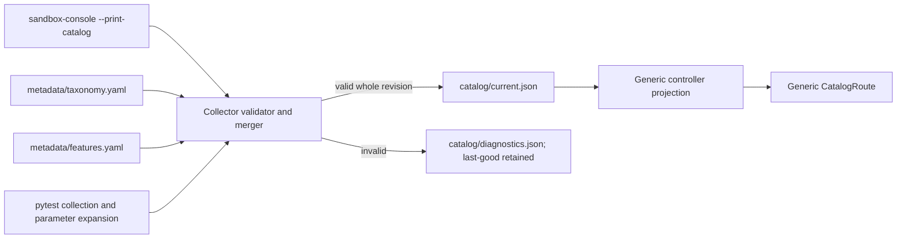
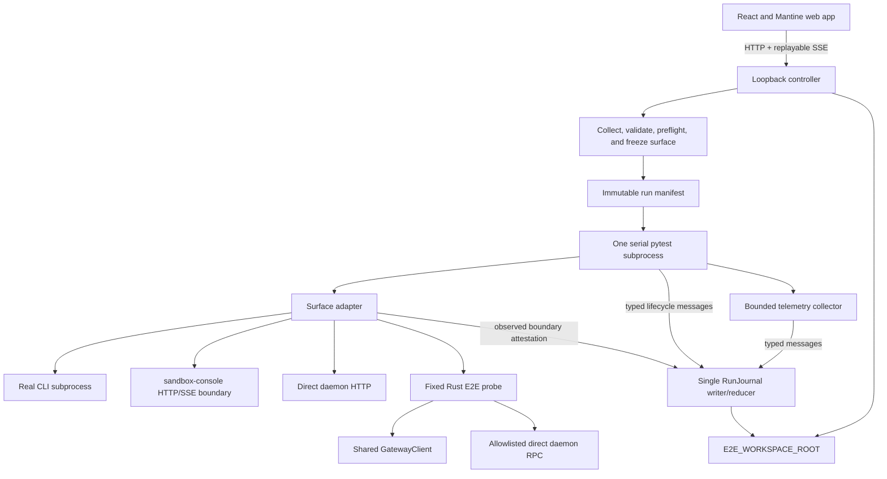
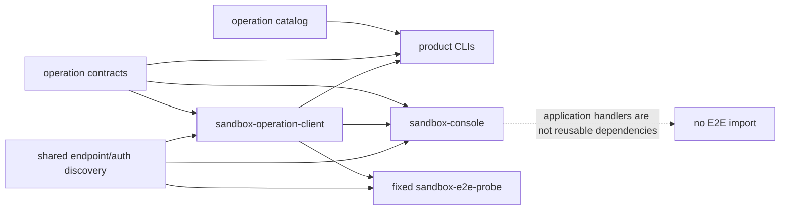

# EphemeralOS Live E2E Control Room — Technical and UI Design

| Field | Value |
|---|---|
| Status | Proposed v1 implementation design |
| Date | 2026-07-12 |
| System specification | [e2e-test-system-spec.md](e2e-test-system-spec.md) |
| Web UI design | [e2e-test-ui-design.md](e2e-test-ui-design.md) |
| Delivery plan | [e2e-test-implementation-plan.md](e2e-test-implementation-plan.md) |
| Test repository (`TEST_REPOSITORY_ROOT`) | `/Users/yifanxu/Ephemeral-AI-Lab/ephemeral-sandbox-test` |
| E2E source (`E2E_SOURCE_ROOT`) | `<TEST_REPOSITORY_ROOT>/e2e` |
| Benchmark source/config (`BENCHMARK_SOURCE_ROOT`) | `<TEST_REPOSITORY_ROOT>/benchmark` |
| Product checkout (`PRODUCT_ROOT`) | `/Users/yifanxu/Ephemeral-AI-Lab/ephemeral-sandbox` |
| Product operation catalog | `ephemeral-sandbox/crates/sandbox-operations` |
| Mutable workspace store (`WORKSPACE_STORE_ROOT`) | `/Users/yifanxu/Ephemeral-AI-Lab/ephemeral-sandbox-test-workspace` |
| Durable E2E workspace (`E2E_WORKSPACE_ROOT`) | `<WORKSPACE_STORE_ROOT>/e2e` |
| Durable benchmark workspace (`BENCHMARK_WORKSPACE_ROOT`) | `<WORKSPACE_STORE_ROOT>/benchmark` |
| Legacy prototype migration origin | `ephemeral-sandbox/e2e/ui-prototype` (visual fixture only) |

The words **MUST**, **SHOULD**, and **MAY** are normative. This document defines
concrete component, data, lifecycle, API, and interaction contracts. Behavior
that matters to a verdict or user decision is not deferred to implementation
judgment.

The standalone web UI design owns detailed responsive page composition,
wireframes, content hierarchy, and UI interaction acceptance. This document
continues to own the technical contracts consumed by those pages. The system
specification remains authoritative if a contract conflicts.

## 1. Design outcome

The Control Room is one catalog-driven application for finding, previewing,
executing, observing, and reviewing E2E cases. A first-time user can finish the
normal workflow without knowing a pytest path, node ID, marker, or command-line
argument:

1. Search or filter the catalog.
2. Read what each expanded case and named validation proves.
3. Select cases from any mixture of domains, families, groups, or features.
4. Review the exact ordered cases, policies, resource claims, and preflight.
5. Admit one immutable run.
6. Follow structured test, validation, cleanup, log, and telemetry state.
7. Jump to the first failure and its evidence interval.
8. Reconnect or revisit the same projection after completion.

The smallest architecture that satisfies that workflow is:

```text
versioned Rust ProductCatalogProjection
        + source-controlled E2ETaxonomyRegistry and FeatureRegistry
        + pytest-expanded annotated cases
        ↓ validate and merge atomically
CombinedE2ECatalog
        ↓ generic loopback API
one CatalogRoute + RunRoute + small supporting routes
```

The system deliberately does **not** contain per-domain pages, domain/family
switch statements, a UI plugin registry, a workflow engine, a second test
executor, or a validation-type hierarchy.

### 1.1 Design invariants

1. Pytest is the only product-test executor.
2. V1 has one controller-owned serial execution lane and one controller-wide
   active run across every UI and API client.
3. Stable semantic IDs, not paths or collection order, own history.
4. Catalog publication is whole-revision and atomic; partial collection is
   never browseable or executable.
5. The manifest and append-only events are authoritative. Projections are
   deterministic and rebuildable.
6. A test result is not terminal until mandatory teardown and evidence
   finalization have reached a terminal state.
7. Raw logs never substitute for declared validation state.
8. Supporting telemetry is available to every domain without changing primary
   ownership.
9. Unknown and missing evidence are never represented as zero.
10. Status is always conveyed by text and icon; color is supplementary.
11. Current and unknown catalog IDs render through generic components and
    neutral display fallbacks.
12. Production mode has no silent fixture-data fallback.
13. `TEST_REPOSITORY_ROOT` is the Git root. Its `e2e/` and `benchmark/` source
    trees are never controller-owned or purgeable. Mutable data is confined to
    independently marker-owned `e2e` and `benchmark` leaves under a separate
    `WORKSPACE_STORE_ROOT`. Only `TEST_REPOSITORY_ROOT`, `PRODUCT_ROOT`, and
    `WORKSPACE_STORE_ROOT` are configurable; all source/workspace roots are
    exact derived paths.
14. Every product case has one immutable execution surface. A Harness case may
    omit it only by declaring `product_boundary_claim=not_applicable`; any
    declared surface has a derived driver that the browser cannot substitute.
15. Application boundaries are tested across their real process/HTTP surfaces.
    Only protocol/discovery/auth primitives below those boundaries are shared.

## 2. Product-catalog and E2E-catalog boundary

### 2.1 The deliberately closed Rust boundary

The Rust product operation contract currently defines the closed enum
`Manager | Runtime | Observability` in
`crates/sandbox-operations/contract/src/domain.rs`. Its catalog arrays live in
the corresponding modules under `crates/sandbox-operations/catalog/src`.
Adding a fourth **product operation domain** is intentionally not metadata-only:
it requires changes to that enum, serialization/deserialization exhaustiveness,
the catalog module and feature wiring, route aggregation, console/MCP
consumers, and Rust tests.

The Control Room MUST state this limitation rather than pretending the Rust
contract is open. Once the product projection contains the new domain, however,
the E2E collector, API, and UI MUST render it without a frontend route, card,
icon, color, or switch-statement change.

An **E2E top-level domain** is a different concept. The seeded product-owned
domains are Runtime, Manager, and Observability; Compound is the seeded
E2E-only cross-domain ownership root. A future E2E-only ownership root may be
declared by E2E metadata. Harness is **not** a fifth domain: harness records use
`catalog_kind=harness`, appear in Runner Health, and are excluded from product
feature coverage. The combined catalog and UI treat `domain_id`, `family_id`,
and `group_id` as strings, never frontend enums, so adding a genuine E2E-only
domain is metadata-only.

### 2.2 ProductCatalogProjection

The console merger owns the versioned `ProductCatalogProjection` envelope;
`crates/sandbox-operations/contract/src/document.rs::catalog_to_value` owns each
inner catalog record. The existing `sandbox-console` aggregation is the bridge;
it MUST gain an offline `sandbox-console --print-catalog` mode that invokes the
same `catalogs()` projection and exits before configuration, server, gateway, or
Docker startup. The print command and product-catalog API emit canonically
identical semantic bytes. The Python collector invokes that built binary and
MUST NOT re-encode Rust family arrays or maintain a second family list.

`ProductCatalogProjection` has `schema_version`, deterministic
`catalog_revision`, and `catalogs`. Generation time is informational and
excluded from its revision. Inner `operation_execution_space` is authoritative;
an existing outer key is only a compatibility alias and disagreement is an
error. Domain-local family keys such as `file` are qualified during the merge as
globally stable IDs such as `runtime.file`.

### 2.3 E2E-owned registries

Only two E2E registry files exist:

| File | Owner | Content |
|---|---|---|
| `e2e/metadata/taxonomy.yaml` | E2E maintainers | E2E-only domains/families, product-family augmentation, groups, owners, Compound complexities/scenarios, direct taxonomy features, and optional display/order metadata. |
| `e2e/metadata/features.yaml` | Product/E2E feature owners | Feature ID, label, description, kind, required owner, optional domain, operation reference where applicable, lifecycle, and replacement. |

Decorators reference IDs from these registries; they do not redefine labels,
descriptions, ordering, or ownership records. README files may explain a suite
but are never metadata authorities.

Every E2E-visible group and Compound scenario has one or more direct feature
references in `taxonomy.yaml`. Product-family augmentation records may add
E2E ownership, grouping, display, and direct features to a Rust-owned family,
but cannot redefine its product identity or description. The collector rejects
an untagged group/scenario locally, so inherited test tags cannot conceal a
taxonomy coverage hole.

An operation feature requires
`operation_ref={domain_id,family_id,operation_id}` and is validated against the
product projection; its product identity/label/description are derived rather
than duplicated. Only explicit `metadata_status=legacy,runnable=false` records
may retain a deprecated reference in warn mode. Ready/strict records fail with
the replacement ID.

The seeded Compound complexities are `simple`, `medium`, and `complex`, but
they are registry records with `complexity_id`, label, description, and order.
Adding another complexity or scenario is therefore metadata plus tests, not a
UI redesign. Source folders may mirror an ID for contributor readability, but
history never derives identity from that path.

### 2.4 CombinedE2ECatalog pipeline



The merge order is structural, not an override mechanism:

1. Product projection defines product domains, product families, operations,
   and their product descriptions.
2. Taxonomy defines E2E-only nodes and the group/scenario layer beneath a known
   product family.
3. Feature registry defines every valid feature reference.
4. Collected test metadata attaches expanded cases to a registered group or
   scenario.

No layer may silently redefine an ID owned by an earlier layer. Conflicts are
collection errors with both source locations.

The published `CombinedE2ECatalog` envelope is concrete, not a generic object:

```json
{
  "schema_version": "1.0",
  "catalog_revision": "sha256:...",
  "generated_at": "2026-07-12T12:00:00+08:00",
  "metadata_mode": "strict",
  "source_revisions": {
    "product_catalog": "sha256:...",
    "e2e_source": "sha256:...",
    "taxonomy": "sha256:...",
    "features": "sha256:..."
  },
  "source_provenance": {
    "git_commit": "...", "git_dirty": true
  },
  "domains": [], "families": [], "groups": [],
  "complexities": [], "scenarios": [], "owners": [],
  "features": [], "cases": [],
  "health": {
    "collected_cases": 0, "ready_cases": 0,
    "legacy_cases": 0, "warning_count": 0
  }
}
```

Every array has a generated typed schema and referential-integrity validation.
Invalid cases exist only in diagnostics, never as browseable catalog rows.
`source_revisions.e2e_source` is the content hash of the canonical
`ExecutionInputManifest@1`, never a Git revision. Git data is informational
provenance. Because the source revision participates in canonical semantic
bytes, an uncommitted executable-source edit changes `catalog_revision` even
when its collected metadata is otherwise unchanged.

### 2.5 Version compatibility and extensions

- `schema_version` is `major.minor`. A consumer MUST reject an unsupported
  major version with a visible diagnostic.
- Within a supported major, additive optional fields and namespaced
  `extensions` are forward-compatible and ignored by consumers that do not use
  them.
- Removing or changing the meaning/type of a required field requires a major
  version.
- Every response includes `schema_version` and `catalog_revision` when
  applicable. Platform/provider support belongs in typed health and preview
  records; v1 has no open-ended capabilities bag that makes normative behavior
  optional.
- Unknown event types are not silently ignored by the state reducer. They make
  the projection visibly invalid until a compatible reducer is used.
- Unknown display `icon_key` or `accent_token` values use the neutral fallback;
  they do not invalidate otherwise sound catalog data.

### 2.6 Deterministic identity and ordering

Every expanded case has two stored semantic identifiers:

- `test_id`: globally stable identity for the logical test contract.
- `case_id`: stable identity for one expanded parameter case; non-parametrized
  tests use `default`.

Both match `[a-z0-9][a-z0-9._-]*`, contain no `/`, and are never derived from
path, line, collection position, or node ID. The pair is authoritative; a lossy
concatenation is forbidden.

Schemas, request bodies, URLs, manifests, and history use separate `test_id` and
`case_id` fields/segments. A frontend may derive an unambiguous `case_uid` only
as an in-memory React key; it is never an API identity or persisted authority.
Storage uses a safe hash key recorded beside both source IDs, so punctuation and
future ID formats cannot escape directories.

Moving or renaming a Python file changes `nodeid` and source location but not
`test_id`, `case_id`, feature history, or retry lineage. Parameter order does
not affect `case_id`.

Catalog nodes use optional integer `display.order`. The one ordering rule is:

```text
(order is absent, order, stable ID)
```

The backend supplies that order; the frontend never contains domain/family
ordering arrays.

### 2.7 Atomic refresh and CatalogHealth

The controller performs a full collection at startup, on
`POST /api/v1/catalog/refresh`, and when its two-second input fingerprint changes.
The fingerprint covers `e2e/**/*.py`, both registries, collector/schema code,
the resolved print-catalog binary, and the locked local Rust dependency closure
for `sandbox-console`: workspace/package manifests, `Cargo.lock`, `build.rs`, and
source files discovered by locked Cargo metadata. A native watcher may
accelerate the poll; it is not the correctness mechanism. Notifications debounce
for 500 ms, coalesce while idle, and schedule exactly one follow-up if a change
arrives during refresh. V1 always runs the same full atomic collection, not an
incremental merge algorithm.

The same refresh builds `ExecutionInputManifest@1`: a canonical sorted list of
every repository-local regular file the child may import, execute, configure,
or read for semantics. A versioned repository policy names E2E tests,
`conftest`/helpers, metadata/schemas, reporter/plugins, pytest configuration, and
declared local support-package roots. Each entry has source-relative path, mode,
size, and SHA-256 content digest. Symlinks, special files, escaping/duplicate
paths, and an imported local file outside the policy fail collection. The
manifest/content digest is `e2e_source_revision`; Git commit/dirty state is
display provenance only.

If Rust inputs differ from the recorded build stamp, refresh runs the fixed
command `cargo build --manifest-path <PRODUCT_ROOT>/Cargo.toml --locked -p
sandbox-console --bin sandbox-console` with `cwd=PRODUCT_ROOT` and
`CARGO_TARGET_DIR=<E2E_WORKSPACE_ROOT>/tooling/sandbox-console/<input-digest>/target`.
The source
root, product root, manifest, package, binary, and command are startup policy and
are not browser-configurable. Only after a successful build are the input
fingerprint and binary digest stamped and the offline export invoked. Cargo
metadata/build failure becomes a bounded local catalog diagnostic, retains the
stale last-good revision, and blocks admission.

Input change immediately marks health stale and blocks admission. Refresh writes
a candidate beneath `<E2E_WORKSPACE_ROOT>/tmp/catalog`, validates every record,
computes its
revision, then atomically replaces `catalog/current.json`. Failure leaves the
last-good catalog untouched and atomically writes structured diagnostics.
`CatalogHealth` contains:

- `refresh_state: checking | ready | failed`
- attempted, current, and last-good revisions
- start/completion timestamps
- metadata mode and ready/legacy/invalid counts
- structured diagnostics
- `stale: boolean` and reason
- `run_admission_allowed: boolean`

While refresh is failed, historical runs and the visibly stale last-good
catalog remain browseable, but new run admission is blocked. If no last-good
catalog exists, the Catalog route shows a blocking error rather than an empty
test suite.

`catalog_revision` incorporates `e2e_source_revision`, so a dirty test/helper
edit stales every preview and a successful refresh publishes a new revision
even if IDs and labels do not change.

Successful publication emits one catalog-revision notification. TanStack Query
invalidates the combined Catalog query and refetches once; it does not issue a
request per row, feature, or taxonomy level. A valid newly saved annotated
pytest case therefore appears automatically without a restart or frontend code
change. An invalid candidate keeps the last-good catalog and surfaces its
diagnostic. The browse/run round-trip budget is one combined catalog query, one
preview request, one admission request, one live SSE connection, and evidence
requests only when the user opens evidence.

Partially migrated records may appear in `warn` mode with
`metadata_status=legacy`, explicit missing fields, and `runnable=false`. A
partially migrated family shows ready and legacy counts separately. An empty
known family renders as “0 tests”; it does not disappear. References to unknown
domains, families, groups, scenarios, features, or owners invalidate the whole
candidate.

## 3. Source layout and annotation model

### 3.1 Registry-driven source convention

All E2E-owned implementation source is versioned in the test Git repository,
not in the product checkout or external mutable workspace store:

```text
<TEST_REPOSITORY_ROOT>/                 # ephemeral-sandbox-test Git root
├── .git/
├── pyproject.toml                      # Python/controller toolchain, if used
├── package.json                        # repository-level web scripts, if used
├── e2e/                                # E2E_SOURCE_ROOT
│   ├── core/                           # declarations, adapters, reporter
│   ├── control/                        # loopback controller and projections
│   ├── metadata/                       # taxonomy.yaml and features.yaml
│   ├── schemas/                        # versioned generated/portable schemas
│   ├── web/                            # React/Mantine application
│   ├── unit/                           # non-live framework tests
│   └── runtime/ manager/ observability/ compound/ harness/
└── benchmark/                          # BENCHMARK_SOURCE_ROOT

<WORKSPACE_STORE_ROOT>/                 # external non-versioned parent
├── e2e/                                # E2E_WORKSPACE_ROOT; marker-owned
│   └── TEST-REPORT.md                  # append-only live-test report
└── benchmark/                          # BENCHMARK_WORKSPACE_ROOT; marker-owned
```

`TEST_REPOSITORY_ROOT` is the Git repository itself. `PRODUCT_ROOT` and
`WORKSPACE_STORE_ROOT` are the other configurable roots. The source/workspace
leaves are exact derivations:
`E2E_SOURCE_ROOT=<TEST_REPOSITORY_ROOT>/e2e`,
`BENCHMARK_SOURCE_ROOT=<TEST_REPOSITORY_ROOT>/benchmark`,
`E2E_WORKSPACE_ROOT=<WORKSPACE_STORE_ROOT>/e2e`, and
`BENCHMARK_WORKSPACE_ROOT=<WORKSPACE_STORE_ROOT>/benchmark`.
They have no environment, CI, CWD, home, or browser override. The controller
treats the repository and product roots as immutable inputs and writes only
beneath `E2E_WORKSPACE_ROOT`. Benchmark-owned implementation and configuration
live under `BENCHMARK_SOURCE_ROOT`; its mutable data belongs only beneath
`BENCHMARK_WORKSPACE_ROOT`. Product protocol/contracts, shared transport and endpoint
discovery, and the fixed E2E probe remain in `PRODUCT_ROOT`; moving them into the
test repository would reverse the intended dependency.
`TEST-REPORT.md` is updated only by the human/delivery workflow required by the
E2E test rules; collection, the controller, and live execution never append to
source. The execution-input policy includes only tracked E2E inputs. Root
validation is canonical-path, symlink-aware, and
device/inode-aware. It permits only the two exact reserved mutable descendants
shown above and rejects aliases, cross-leaf overlap, Git-metadata overlap,
product overlap, and any other containment before a marker or directory is
created.

Legacy locations such as `ephemeral-sandbox-test/workspace`,
`ephemeral-sandbox-test/state/{e2e,benchmark}`,
unstructured legacy `ephemeral-sandbox-test-workspace` contents,
`ephemeral-sandbox-test-state`,
`ephemeral-sandbox-test/.state`, and `<PRODUCT_ROOT>/e2e` are migration origins
only. Runtime discovery, collection, execution, and purge never use them after
migration.

The following grammars keep source readable without fixing IDs in code:

```text
e2e/<domain-segment>/<family-segment>/<group-segment>/test_*.py
e2e/compound/<complexity-segment>/<scenario-segment>/test_*.py
e2e/harness/test_*.py
```

The taxonomy maps segments to stable IDs. The collector may lint path and
declared ownership after migration, but a mismatch is not a contract failure and
a path is never the ID source. Product
tests do not sit directly beneath a domain/family root. Framework unit tests
live under `e2e/unit`; shared code under `e2e/core` does not collect tests;
generated state never lives below a product suite.

Collection-only mode MUST be side-effect free. It sets an explicit collector
context before importing test modules and disables report writers, `atexit`
writers, timing exports, gateway startup, and any source-adjacent directory
creation. Its only permitted output is the candidate path supplied by the
controller. A byte-for-byte worktree check is an acceptance gate.

### 3.2 Thin typed declaration API

The decorator carries test-specific facts and references registry IDs. One
globally stable `group_id` supplies domain/family ownership through the
taxonomy, avoiding three repeated string fields:

```python
@e2e_test(
    test_id="runtime.file.read_write_edit.offset_limit",
    execution_surface="cli",
    group_id="runtime.file.read_write_edit",
    owner_id="team.runtime",
    title="Windowed sessionless read",
    description="Returns only the requested line window and exact metadata.",
    direct_feature_ids=(
        "runtime.file.read",
        "behavior.windowing",
        "contract.structured_response",
        "quality.clean_teardown",
    ),
    validations=(
        validation(
            validation_id="window_content_matches",
            description="Only the requested lines are returned.",
            phase="verify",
            required=True,
            feature_ids=("runtime.file.read", "behavior.windowing"),
        ),
        validation(
            validation_id="pagination_metadata_matches",
            description="Offset, limit, and totals are exact.",
            phase="verify",
            required=True,
            feature_ids=(
                "runtime.file.read",
                "contract.structured_response",
            ),
        ),
        validation(
            validation_id="sandbox_destroyed",
            description="The sandbox and sessions are destroyed.",
            phase="teardown",
            required=True,
            feature_ids=("quality.clean_teardown",),
        ),
    ),
    workspace=workspace_policy(
        mode="fresh-owned-clone",
        source_policy="template-or-eligible-retained",
        result_policy="eligible-if-safe",
    ),
    telemetry=telemetry_policy("standard-v1"),
    resource_claims=resource_claims(
        sandboxes=(1, 1), sessions=(0, 1), exclusive_locks=()
    ),
)
@pytest.mark.parametrize(
    "offset,limit",
    [
        pytest.param(
            3,
            3,
            id="offset_3_limit_3",
            marks=e2e_case(case_id="offset_3_limit_3"),
        )
    ],
)
def test_windowed_read(offset, limit, ...):
    ...
```

`WorkspacePolicy@1` uses `mode=none | fresh-owned-clone |
owned-invalid-path-staging`. `fresh-owned-clone` additionally requires
`source_policy=template-only | template-or-eligible-retained` and
`result_policy=never | eligible-if-safe`. `none` forbids a bind; invalid-path
staging is controller-owned and forces `result_policy=never`. Collection rejects
all other combinations. Preview resolves the source policy to one exact source
revision, while `result_policy` governs only the newly finalized attempt. This
prevents the old `reuse_allowed` ambiguity from conflating input selection with
future output eligibility.

For `catalog_kind=product`, exactly one leaf reference is legal: operation-
family tests set `group_id` and omit `scenario_id`; Compound tests set
`scenario_id` and omit `group_id`. Both or neither is a local collection error.
A Harness declaration explicitly sets `catalog_kind="harness"`, omits both
leaf references and all product feature references, and declares named
diagnostic validations without product-feature mappings.

Python typing uses `Literal` values for lifecycle phases and policy modes plus
small frozen dataclasses for IDs, policies, case records, and validation
declarations. Registries provide semantic validation; free-form labels are not
duplicated in test files.

### 3.3 Required expanded-case contract

After parameter expansion, the live catalog is a discriminated union keyed by
required `catalog_kind: product | harness`. Every arm contains:

- separate `test_id` and `case_id`
- title and non-empty description
- current source path, line, and diagnostic pytest `nodeid`
- one or more applicable declared validations
- validation description, phase, and required flag
- optional author-supplied bounded `parameter_summary` plus execution labels;
  arbitrary pytest parameter objects are never introspected or serialized
- `owner_id`
- workspace, telemetry, and resource-claim policies
- `metadata_status: ready | legacy | invalid` and `runnable: boolean`

A product arm additionally contains `domain_id`, `family_id`, and `group_id`,
or registered Compound scenario ownership; one or more direct feature IDs and
effective features with provenance; complete validation-to-feature mappings;
exactly one `execution_surface: cli | console_rpc | console_http_proxy |
gateway_rpc | daemon_http | direct_daemon_rpc`; and its derived
`surface_driver`, descriptor revision, timeout/cancellation policy, privilege,
preflights, and boundary-attestation kind. Compound records replace `group_id`
with `scenario_id` and `complexity_id`, list ordered components and roles, and
declare shared-context/cross-domain validations.

A Harness arm is a runner/readiness diagnostic, not a topology leaf. It omits
domain, family, group, scenario, complexity, product features, and validation-
to-product-feature mappings; any product feature reference is a collection
error. Its `execution_surface` is optional. With a declared surface it obeys
the same driver, preflight, attestation, and pass contract as a product case.
Without one it omits all surface-derived fields and events and freezes
`product_boundary_claim=not_applicable`, displayed as “Harness diagnostic — no
product boundary claimed.” Both Harness forms use the ordinary generic
selection, preview, admission, execution, result, retry, and history path and
remain excluded from product coverage.

A Compound scenario registry record requires stable ID/title/description/owner,
complexity, at least two distinct subject domains, ordered components with role
`subject | fixture | evidence`, a shared sandbox/workspace boundary, explicit
teardown contract, one or more direct features, and one or more cross-domain
validation templates. Fixture/evidence components do not inflate subject
ownership. The seeded medium scenario is
`manager.create -> runtime.exec/write/read -> observability.scoped-snapshot ->
manager.destroy`; it proves lifecycle, runtime visibility, correlated evidence,
and clean teardown in one context without introducing special UI or reducer
behavior.

`e2e_case.parameter_summary` accepts only deterministic JSON objects/arrays of
finite scalar strings, numbers, booleans, and null. It is limited to 16
entries/elements, four nesting levels, 64 Unicode code points per key, 256 per
string, and 4 KiB canonical UTF-8 per expanded case. The collector applies the
same sensitive-key/secret scrubber used for evidence before catalog persistence,
publishes explicit redaction markers/counts, and rejects non-JSON, non-finite,
over-depth, or over-limit summaries locally. It never calls `repr`/`str` on raw
pytest parameter values. Absence falls back to `case_id` and the declared case
label.

`execution_surface` is author-assigned before collection and is immutable after
the expanded case is published. Product-operation cases default to `cli` only in
the authoring/migration helper; the published case always contains the explicit
value. `gateway_client` is not a surface: it is an implementation driver beneath
`gateway_rpc`. The browser can select a registered case but cannot change its
surface, driver, operation, endpoint, or credential.

### 3.4 Direct, inherited, and case metadata

Merge rules are field-specific and deterministic:

- Taxonomy features are inherited and retain their source node as provenance.
- Every expanded product case MUST still have at least one test/case-level
  direct feature; inheritance cannot satisfy this rule.
- Base declarations define the allowed universe. `e2e_case.direct_feature_ids`
  may explicitly replace the complete direct-feature set; absence inherits it.
- `e2e_case.validation_ids` may select a complete subset of validation templates
  declared by the decorator. It cannot add or redefine validation metadata.
- The `e2e_case.case_id` equals the explicit pytest parameter `id`; each
  `pytest.param` carries exactly one case marker.
- Harness cases do not inherit product features, cannot declare product feature
  references, and mark every diagnostic validation `coverage_eligible=false`.
- Case title suffix and description appendix are additions, not replacements.
- Case policies may only use explicitly declared typed overrides. The final
  expanded policy is stored, so no runtime inheritance remains.
- Every direct/effective tag records `provenance=taxonomy|test|case` and the
  contributing ID.
- For product cases, every final direct case feature is mapped by at least one
  applicable named validation, and every applicable validation maps to at least
  one effective feature. Optional validations do not weaken this traceability
  rule. Harness validation mappings to product features are forbidden rather
  than exempted from counting.

This supports case-varying features and validations without identity derived
from parameter position. If cases need substantially different ownership or
purpose, they are separate `test_id` contracts rather than an opaque parameter
matrix.

### 3.5 Feature lifecycle and coverage truth

Feature entries have `active | deprecated` lifecycle. Unknown features fail
collection. A deprecated feature record requires either
`replacement_feature_id` or a non-empty `no_replacement_reason`. A deprecated
reference fails every ready/strict record and reports its registered replacement
or explanation. Warn mode may retain it only on an explicitly
`metadata_status=legacy,runnable=false` record. Historical run snapshots
continue rendering the old frozen label and lifecycle.

Coverage projections distinguish:

- direct test/case association
- inherited family/group/scenario association
- named validation mapped to the feature
- required versus optional validation
- ready, legacy, and absent coverage

A feature view presents two non-interchangeable projections. **Declaration
coverage** counts distinct validation declarations mapped to the feature and
lists their expanded cases, required/optional state, and direct/inherited
provenance. **Latest execution proof** shows the most recent terminal outcome
for each expanded case/validation under a named run and revision. A declaration
is not a pass; one validation expanded over ten cases is one declaration and ten
case outcomes. No headline uses raw test count as coverage. Every count labels
its unit explicitly: declarations, case outcomes, cases, tests, validations, or
features.

### 3.6 Named validation API and raw assertions

All validations share one lifecycle; v1 has no behavior-bearing validation-type
registry. A contributor adds a new named validation or evidence shape through
the declaration/recorder and generic bounded JSON/artifact rendering, with no
reducer or card change. A behavior requiring different lifecycle or verdict
rules is a deliberate schema-major/reducer change, not a metadata “type” string.

Runtime code references a declaration by ID:

```python
with validation_recorder.check("window_content_matches") as check:
    check.expected("lines 3 through 5")
    response = file_read(...)
    check.actual(response["content"])
    assert response["content"] == expected
```

Entering records `validation.started`. Normal exit records `passed`.
`AssertionError` records `failed` and is re-raised. Any other exception records
`error` and is re-raised. Explicit skip/unsupported decisions use a typed API
and reason; cancellation is tied to the controlling cancellation event. An
undeclared validation ID is a recorder/contract error and prevents a pass.

Raw Python assertions remain valid. A raw assertion failure fails the test with
`failure_kind=assertion`, but the reporter MUST NOT invent a named validation.
Later required declarations that never start become causal `not_run`; therefore
a test cannot pass because a required validation silently disappeared.

### 3.7 Collection diagnostics

The collector aggregates errors rather than stopping at the first one. Each
diagnostic contains:

- stable error code and severity
- source file, line, and column when available
- test ID and expanded case ID when known
- metadata field and invalid value
- conflicting source location for duplicates
- registry replacement or nearest valid IDs when available

Every expanded-case invariant in §3.4 is validated after expansion and before
atomic publication. This includes duplicate `test_id/case_id`, missing required
metadata, unknown or invalid deprecated feature references, invalid owner or
group/scenario XOR, missing direct tags, a direct feature mapped by no declared
validation, any validation mapped to no effective feature (required or
optional), unstable/mismatched pytest and case IDs, and an undeclared runtime
validation reference. Independent errors are aggregated in one attempt.

## 4. Runtime architecture



Dependency direction is one-way:

- E2E tests, controller, schemas, and UI live under `E2E_SOURCE_ROOT`; product
  tests import external `e2e/core` and local support, never controller or UI.
- The collector reads the offline product projection and test metadata but
  starts no runtime dependency.
- The controller validates requests, supervises pytest, and reduces events; it
  does not evaluate product assertions.
- CLI, console, and the product-side E2E probe may depend on shared product
  contracts, catalog, gateway transport, authentication, and endpoint-discovery
  crates. Shared crates never depend on E2E or console application handlers.
- External E2E Rust code, if added later, consumes published/version-pinned
  product crates; it MUST NOT use a cross-repository path dependency. The v1
  probe stays in the product Cargo workspace so it compiles against the exact
  product revision under test.
- E2E never imports or invokes `sandbox-console` handlers as a library. Console
  cases cross its HTTP/SSE boundary; catalog export is an offline metadata
  projection and never selects the runtime transport.
- The pytest reporter and telemetry adapters emit typed messages to the
  controller-owned `RunJournal` through an inherited local pipe.
- `RunJournal` is the only per-run sequence allocator and file writer. It
  persists before projection update and SSE broadcast.
- The web bundle has no filesystem, environment, Docker, or subprocess
  authority.

The product-side crate dependency is deliberately smaller than an application
framework:



The six product execution surfaces and their fixed v1 drivers are:

| Surface | Boundary actually crossed | V1 driver | Access | Default timeout |
|---|---|---|---|---|
| `cli` | real user-facing CLI process | `cli_subprocess` | public; default product-operation surface | 180 s |
| `console_rpc` | console `/api/rpc` HTTP/SSE | `console_http` | public console surface | console-configured, manifest-frozen |
| `console_http_proxy` | console daemon-HTTP proxy | `console_http` | public console surface | console-configured, manifest-frozen |
| `gateway_rpc` | gateway wire protocol | `rust_probe` normally; `python_conformance` only for named compatibility cases | internal | 180 s |
| `daemon_http` | daemon HTTP endpoint directly | `python_http` | public daemon surface | 10 s |
| `direct_daemon_rpc` | allowlisted daemon RPC | `rust_probe` | privileged internal | 180 s |

The surface descriptor supplies these exact v1 UI claims:

| Surface | UI proof label | Truthful claim |
|---|---|---|
| `cli` | **Real CLI → gateway** | Proves CLI parsing, defaults, exit status, stdout/stderr, error handling, and dispatch through the gateway. |
| `console_rpc` | **Console `/api/rpc` → gateway** | Proves the console HTTP/SSE boundary and gateway proxy. |
| `console_http_proxy` | **Console HTTP proxy → daemon HTTP** | Proves console endpoint resolution and daemon-HTTP proxy behavior. |
| `gateway_rpc` | **Direct gateway RPC · internal** | Proves gateway protocol/client behavior; CLI and console were bypassed. |
| `daemon_http` | **Direct daemon HTTP · console bypassed** | Proves the daemon HTTP endpoint, not the console proxy. |
| `direct_daemon_rpc` | **Privileged daemon RPC · allowlisted** | Proves one allowlisted internal lifecycle RPC, not a public CLI or console surface. |

Every product case and surface-declaring Harness case uses one row above. A
no-surface Harness case invokes the ordinary pytest runner directly, emits no
surface event, has no surface-specific preflight or adapter, and cannot claim a
product boundary.

For a surface-declaring case, an adapter records `surface.started` before
dispatch and exactly one `surface.finished` afterward. Its terminal status identifies verified,
mismatched, unavailable, or errored proof, and its attestation identifies
the expected and observed surface, driver, boundary, invocation/correlation ID,
timestamps, evidence references, and status. A case cannot pass without a
verified exact match. There is no fallback from one surface to another and no
automatic replay after a request may have been dispatched. Cancellation stops
local waiting and follows the frozen surface policy; an unknown remote outcome
is reported as infrastructure error, not success and not an implicit retry.

The controller uses the Python standard library where practical. `e2e/web` is a
dedicated npm/Vite single-page application using the repository's established
React 19, TypeScript 6, Mantine 9, React Router 7, TanStack Query 5, TanStack
Table 8, TanStack Virtual 3, uPlot 1.6, Lucide, Vitest, Testing Library,
Playwright, and axe stack. Native `EventSource` carries replayable SSE and a
pure reducer folds ordered run events. Node is a build/test dependency only;
the loopback controller serves the static production bundle, `/api/v1`, and SSE
same-origin. A shared package is deferred until a second production consumer
exists. V1 adds no SSR framework, second CSS/component system, global state
library, WebSocket layer, heavyweight data grid, or code editor.

## 5. Durable storage and workspaces

### 5.1 Store layout

```text
<E2E_WORKSPACE_ROOT>/                   # ephemeral-sandbox-test-workspace/e2e
├── root.json
├── TEST-REPORT.md
├── testbed/
│   ├── template.json
│   └── root/
├── attempts/
│   └── <run-id>/<test-key>/<case-key>/attempt-<n>/
│       ├── workspace.json
│       └── root/
├── quarantine/
│   └── <workspace-id>/
│       ├── workspace.json
│       └── root/
├── tmp/
│   ├── catalog/
│   ├── history/
│   ├── runs/
│   ├── testbed/
│   └── attempts/
├── runs/
│   ├── run-summaries.json
│   └── <run-id>/
│       ├── manifest.json
│       ├── execution-input-manifest.json
│       ├── execution-source/
│       ├── run.json
│       ├── events.jsonl
│       ├── retention.json
│       ├── retention-events.jsonl
│       ├── controller.json
│       ├── recovery-sessions.json
│       ├── tests/
│       │   └── <test-key>/<case-key>/attempt-<n>/result.json
│       ├── telemetry/
│       │   └── <test-key>/<case-key>/attempt-<n>/
│       │       ├── <channel>.jsonl
│       │       └── summary.json
│       └── artifacts/
├── catalog/
│   ├── current.json
│   ├── health.json
│   ├── diagnostics.json
│   └── events.jsonl
└── tooling/
    ├── sandbox-console/<input-digest>/
    │   ├── build-stamp.json
    │   └── target/
    └── sandbox-e2e-probe/<input-digest>/
        ├── build-stamp.json
        └── target/
```

The exactly seven direct workspace directories are `testbed/`, `attempts/`,
`quarantine/`, `tmp/`, `runs/`, `catalog/`, and `tooling/`.
`runs/run-summaries.json` is the global-history projection beside the per-run
directories. There is no intermediate mutable-layout directory. Every
temporary candidate or clone is created beneath
`<E2E_WORKSPACE_ROOT>/tmp` and atomically published on the same filesystem.
No controller path may fall back to `/tmp`, the current working directory, the
user's home directory, or a browser-supplied absolute path.

`manifest.json` freezes the complete expanded case records, topology and
display data, direct/effective feature provenance, validation mappings,
policies and limits, catalog revision, selection expression/provenance,
execution-input manifest/source digest, expected and observed runner/product-
binary/probe/offline-binary/image identities, the complete admission
`ControllerBundleIdentity@1`, attempts, and lineage. A second
per-run catalog file is unnecessary. `execution-input-manifest.json` is the
small durable provenance record; `execution-source/` contains the exact
run-owned bytes and may be removed only by terminal evidence purge.
`catalog/events.jsonl` is the append-only refresh journal.
While a run is live, `controller.json` is the restart-critical process-start
identity, controller/runner instance ID, heartbeat, and scoped resource
registry. It never contains the loopback bearer nonce or a reversible
derivative; that nonce exists only in controller/page memory.
`recovery-sessions.json` is the atomic survivor projection of the ordered,
event-authoritative recovery-session registry. It retains complete controller
identities, compatibility decisions, prefix/action dispositions, and derived
session state after execution evidence is purged; it is not an event authority.
`retention.json` is an atomic current overlay derived solely from
`retention-events.jsonl`; it cannot change the immutable completion verdict. It
retains the current purge transaction's complete controller bundle identity and
bounded prior transaction summaries, so every surviving retention
`producer_revision` resolves through the full journal after execution evidence
is removed.
`runs/run-summaries.json` is the only global run-lookup projection. It is a
schema-versioned, atomically replaced, rebuildable cache; it is not a mutable
results database and has no authority over verdicts, recovery, retention,
artifact access, or per-run display. Its only inputs are each run's authoritative
`manifest.json`, atomic `run.json`, and current `retention.json` overlay. The
controller may delete and reconstruct it without losing history.
`tooling/sandbox-console` and `tooling/sandbox-e2e-probe` are controller-owned,
rebuildable, input-digest-keyed caches for locked product-side builds. Each
`build-stamp.json`
records the canonical product source revision, dirty-input digest, complete
locked Rust input fingerprint, toolchain/Cargo-lock identity, exact manifest and
package/bin command, binary digest, and completion time. Builds run from
`PRODUCT_ROOT` with explicit `--manifest-path`, `--locked`, and an owned
`CARGO_TARGET_DIR` under the corresponding cache. A cached executable is usable
only when its stamp and actual digest match the preview. The combined v1 cap is
5 GiB; only these owned caches may be automatically removed and rebuilt. They
are never run evidence and their cleanup cannot alter history.
Paths in run records are relative to the run root; workspace records use
containment-safe paths relative to `E2E_WORKSPACE_ROOT`. Only the explicitly
displayed derived workspace root and resolved bind root are absolute.
Artifact APIs use opaque IDs mapped through
the named run's ownership records, never browser host paths or a global artifact
index.
`<test-key>` and `<case-key>` are containment-safe hash keys recorded beside the
separate semantic `test_id` and `case_id` in the manifest; they are never
presented as identity and never computed by concatenating IDs.

### 5.2 Workspace safety and lifecycle

Only `TEST_REPOSITORY_ROOT`, `PRODUCT_ROOT`, and `WORKSPACE_STORE_ROOT` are configurable.
`E2E_SOURCE_ROOT`, `BENCHMARK_SOURCE_ROOT`, `E2E_WORKSPACE_ROOT`, and
`BENCHMARK_WORKSPACE_ROOT` are the exact derived paths declared in §3.1; no
environment, CI, browser, CWD, `TMPDIR`, or home-cache setting can override
them. Historical root settings are accepted only by an explicit migration
command as origins; they never configure collection, execution,
initialization, or purge. The external `WORKSPACE_STORE_ROOT` is pairwise
disjoint from both repositories, has no ownership marker, and is never
initialized, purged, or treated as one store. Each mutable leaf has its own immutable
`root.json` with schema version, kind, workspace UUID, and creation time. E2E
code accepts only the E2E-kind marker; benchmark code accepts only the
benchmark-kind marker. `testbed/template.json` contains schema version, template
ID/revision, creation/verification time, source lineage, canonical digest, size,
and validation status; a testbed is Ready only after all ownership/path/manifest/
digest checks.

Before creating a mutable leaf or marker, startup compares canonical paths and
available device/inode identities. It requires the exact reserved derived path,
rejects symlink aliases, equality or overlap between the E2E and benchmark
leaves, and overlap with `.git`, `E2E_SOURCE_ROOT`, `BENCHMARK_SOURCE_ROOT`, or
`PRODUCT_ROOT`. The three configured roots must be pairwise disjoint; only each
derived leaf's containment beneath its declared parent is accepted. Startup
revalidates after race-safe creation. All
mutation targets remain beneath the correctly marked leaf under
descriptor-relative no-follow/open-beneath operations. A canonical tree manifest
is sorted by relative byte path; its
SHA-256 covers path, object type, mode, size, and file-content SHA-256. Only
regular files and directories are reusable. Symlinks, cross-tree hardlinks,
sockets, devices, FIFOs, and security-relevant extended attributes reject
reuse. Sparse files are hashed as logical content. This contract applies to
testbed preparation, clone, verify, quarantine, and purge so a symlink swap
cannot escape the owned leaf.

All staging uses operation-specific directories beneath
`<E2E_WORKSPACE_ROOT>/tmp`; successful publication is an atomic rename into
`testbed/`, `attempts/`, `quarantine/`, `runs/`, or `catalog/`.
Prepared testbeds and historical roots are immutable. Every managed bind root is
a fresh clone at
`<E2E_WORKSPACE_ROOT>/attempts/<run-id>/<test-key>/<case-key>/attempt-<n>/root`.
Clone allocation begins after `test.started`, is the test's explicit `setup`
phase, and completes before sandbox creation.
`phase.started/finished` reports clone source, file/byte progress, duration, and
failure. Invalid/nonexistent-path tests construct their contract under owned
`tmp/attempts` staging and publish only beneath `attempts/`; they never construct
or bind an arbitrary host path and are never reusable.

Workspace state is `active | finalized | quarantined | purged`; reuse state is
`not_evaluated | eligible | ineligible`. Reuse requires explicit test policy,
passed result, successful mandatory cleanup, finalized digest, safety scan, and
no blocked object. Reuse always copies into a new staged attempt and atomically
publishes the copy beneath `attempts/`. Quarantine atomically moves an owned
attempt bundle to `<E2E_WORKSPACE_ROOT>/quarantine/<workspace-id>` and preserves
its lineage. Workspace purge removes only a registered inactive attempt or
quarantine `root/` payload and retains `workspace.json` as a tombstone.
`workspace.json` preserves immutable
`retention_state_at_completion` and a separate current purge overlay, so history
can say "retained at completion; purged at <time>" without rewriting the
completion record.

`workspace.json` contains schema version, run/test/case/attempt IDs, state,
validated relative root and exact resolved bind path, template/source/image
lineage, created/finalized times, test/cleanup result, canonical tree manifest
digest/size, reuse policy/eligibility/blockers, safety scan,
`retention_state_at_completion`, and current purge tombstone. Historical
workspace paths are explicitly non-owned, non-purgeable, and non-reusable;
strict and UI-controlled runs reject them outside the migration command.

An orphaned active workspace is quarantined on recovery. A failed, cancelled,
errored, or cleanup-incomplete workspace remains evidence; it is never
automatically deleted or advertised as reusable. Degraded supporting telemetry
does not by itself change reuse eligibility. When a workspace policy declares a
telemetry signal necessary for its safety scan, partial/unsupported telemetry
makes that scan fail explicitly and the workspace ineligible.

Purge of either repository or `WORKSPACE_STORE_ROOT` is forbidden.
An owning subsystem may perform a maintenance purge only after validating its
exact marker-owned `E2E_WORKSPACE_ROOT` or `BENCHMARK_WORKSPACE_ROOT` leaf; ordinary E2E
run and workspace purge is narrower and deletes only registered descendant
payloads. No purge operation deletes the leaf's `root.json`, crosses into its
sibling leaf, or recursively targets an ancestor.

### 5.3 Disk admission, bounds, and purge

Preview computes `required_bytes` from each case's manifest-frozen evidence cap,
workspace estimate, and the exact execution-source snapshot size. Admission
records `available_bytes`, `required_bytes`,
`safety_margin_bytes=max(1 GiB, 10% of required_bytes)`, and a separately
preallocated `emergency_finalization_reserve_bytes=64 MiB`, and requires space
under `available_bytes >= required_bytes + safety_margin_bytes +
emergency_finalization_reserve_bytes`. Evidence is retained until a containment-checked,
explicit terminal-run purge; v1 never auto-evicts history.

If free space reaches the emergency reserve during a run, no further test is
admitted. The active case receives bounded cleanup/finalization, queued cases
become `not_run(reason=storage_exhausted)`, and the run ends `error`. The reserve
is used only for terminal state and evidence. Purge is forbidden for active or
recovering runs and preserves run/workspace tombstones.

Run purge has one fixed `retained_evidence` scope. Its complete removable set is
containment-checked raw `events.jsonl`, log/telemetry/artifact payloads,
workspace `root/` directories, `execution-source/` bytes, and the terminal run's restart-only
`controller.json`. It writes `retention.purge_started`, journals each planned
object, deletes only that set while journaling object/byte outcomes, and commits
`retention.purge_completed`; partial failure writes `retention.purge_failed`
and is safely retryable. The complete survivor set is `manifest.json`,
`execution-input-manifest.json`, terminal `run.json`, per-case `result.json`,
every `workspace.json` lineage tombstone,
`retention.json`, `retention-events.jsonl`, and `recovery-sessions.json` when
recovery was registered. Evidence reads return typed
`410 evidence_purged`; history continues to show frozen verdicts, validation
states, resource-consumption summaries, completion retention state, and purge
actor/time/bytes. After completed purge every member of the removable set—and no
survivor—must be absent exactly when the retention overlay proves it; any other
absence is corruption.

### 5.4 Run-history projection

The controller owns this exact projection envelope:

```text
RunHistoryProjection {
  schema_version
  generation
  generated_at
  source_run_count
  runs: RunSummary[]
}

RunSummary {
  run_id
  created_at, started_at?, completed_at?
  terminal_status, result
  parent_run_id?
  catalog_revision, source_revision
  domain_ids[], feature_ids[]
  case_status_counts
  first_failure_ref?
  evidence_health
  retention_state_at_completion?
  current_retention_state, purge_summary?
  source_manifest_digest
  source_run_projection_digest
  source_retention_overlay_digest
}
```

Arrays and rows use the specification's deterministic ordering. Optional values
are explicit `null`, never guessed. `RunSummary` contains only the fields needed
for the typed history query and row display; opening a run still reads its own
`RunProjection`. A summary is derived from a consistent read of that run's
manifest, run projection, and retention overlay. If those source digests
change during the read, the candidate is discarded and retried. The controller
validates the complete candidate, writes and syncs it beneath
`<E2E_WORKSPACE_ROOT>/tmp/history`, then atomically replaces
`runs/run-summaries.json` under the exclusive workspace-writer lock. Only a
committed terminal `run.json` is indexable; active and recovering runs remain
available through their direct run resource. A terminal or recovery projection
commit, or a retention-overlay commit, invalidates the affected row and
schedules one coalesced rebuild.
`source_run_count`, `indexed_run_count`, and `discovered_run_count` count only
terminal runs and are equal in `ready` state.

`HistoryProjectionHealth` is returned by controller health and every successful
history-list response:

```text
state: ready | rebuilding | stale | error
serving_last_good: boolean
generation?: integer
generated_at?: timestamp
last_success_at?: timestamp
indexed_run_count: integer
discovered_run_count: integer
reason?: { code, message, retryable }
```

Startup performs run recovery first, then validates projection schema, source
counts, and recorded source digests. A missing, corrupt, stale, or old
projection triggers rebuild and is never treated as an empty store. A compatible
last-good file may remain queryable with `serving_last_good=true` and a visible
rebuilding/stale warning. Without one, list requests receive typed retryable
`503 history_rebuilding`; an incompatible authoritative input receives typed
`history_incompatible`. A failed rebuild preserves a compatible last-good file
as stale, otherwise health becomes `error`. Known-run reads do not depend on the
global projection. The projection is never an input to run recovery, verdict
folding, retention decisions, or artifact authorization.

## 6. Controller API and admission workflow

Every response uses a versioned envelope with either `data` or an error object
containing at least `code`, `message`, `retryable`, `request_id`, and every
relevant run/preview/test/case/validation ID. Field-level errors also carry a
field path and bounded detail. Mutation responses return the resulting
resource, not `{ok: true}`.
Every request validates the configured Host/authority; mutations additionally
require exact same Origin and a per-process nonce. The browser can submit only
catalog-owned IDs and enumerated policies.

### 6.1 API surface

| Method | Path | Purpose |
|---|---|---|
| GET | `/api/v1/health` | Controller, runner, Docker, gateway, CLIs, lane, store, history projection, template, and telemetry capabilities. |
| GET | `/api/v1/catalog/health` | `CatalogHealth`, including last-good and current diagnostics. |
| POST | `/api/v1/catalog/refresh` | Start a full side-effect-free collection and atomic publication. |
| GET | `/api/v1/catalog` | Generic catalog query with search, filters, facets, ordering, and pagination. |
| GET | `/api/v1/catalog/cases/:testId/:caseId` | One expanded case contract. |
| GET | `/api/v1/features/:featureId` | Feature metadata, mapped cases, and mapped validations. |
| POST | `/api/v1/run-previews` | Resolve exact cases and start policy/preflight evaluation. |
| GET | `/api/v1/run-previews/:previewId` | Read `checking`, `ready`, `blocked`, or `stale` preview state. |
| POST | `/api/v1/runs` | Admit one ready preview with an idempotency key. |
| GET | `/api/v1/runs` | Filtered historical run summaries. |
| GET | `/api/v1/runs/:runId` | Materialized `RunProjection`, live or historical. |
| GET | `/api/v1/runs/:runId/events` | Replay and live SSE continuation using `Last-Event-ID`. |
| POST | `/api/v1/runs/:runId/cancel` | Request bounded graceful cancellation. |
| POST | `/api/v1/runs/:runId/purge` | Purge terminal run evidence with containment checks and retain a tombstone. |
| GET | `/api/v1/runs/:runId/tests/:testId/cases/:caseId` | Frozen attempt/result projection for one expanded case. |
| GET | `/api/v1/runs/:runId/tests/:testId/cases/:caseId/telemetry` | Cursor-paged channel summaries/samples for a bounded time range. |
| GET | `/api/v1/runs/:runId/artifacts/:artifactId` | Read one artifact only after named-run ownership, containment, and retention checks. |
| GET | `/api/v1/workspaces` | Store, template, lineage, state, and eligibility projections. |
| POST | `/api/v1/workspaces/initialize` | Initialize only the canonical marker-owned `E2E_WORKSPACE_ROOT`; never initialize either repository or `WORKSPACE_STORE_ROOT`. |
| POST | `/api/v1/templates/testbed/prepare` | Stage beneath `<E2E_WORKSPACE_ROOT>/tmp/testbed`, verify, and atomically publish direct child `testbed/`. |
| POST | `/api/v1/workspaces/:workspaceId/verify` | Recompute digest and reuse safety. |
| POST | `/api/v1/workspaces/:workspaceId/purge` | Purge only a registered inactive attempt/quarantine `root/` payload; repository, source, shared parent, workspace leaf, and unregistered paths are rejected. |

Retry does not need a special execution endpoint. The client creates a new
`RunPreview` with `parent_run_id` and one of
`retry_mode=failed | not_run | failed_and_not_run`; normal preview and admission
then create a child run.

### 6.2 Catalog query semantics

The controller owns one versioned `CatalogQuery`; the HTTP parser and browser
URL normalizer consume the same schema. `GET /api/v1/catalog` accepts normalized
`q`, `catalog_revision`, `cursor`, `page_size`, sort, and repeatable facets:

```text
catalog_kind | runnable | domain_id | family_id | group_id | complexity_id |
scenario_id | feature_id | owner_id | validation_id | metadata_status |
execution_surface | execution_label
```

`catalog_kind` is exactly `product | harness`; Compound uses `product`, and
`runnable` accepts canonical `true | false`. Catalog defaults to product; Runner
Health pins `catalog_kind=harness`, and its runnable action additionally pins
`runnable=true`. Both use this same server query, cursor, SelectionExpression,
preview, and run API; neither client-side filtering nor a Harness-only execution
endpoint is allowed.

Facets combine as AND across fields and OR within repeated values of one field.
Result belongs to run-history filtering, not catalog metadata. The same canonical
parameter names appear in shareable browser URLs.

Search is case-insensitive Unicode text matching over:

- domain/family/group/complexity/scenario/owner ID, label, and description
- test ID, case ID, title, description, and source path
- feature ID, label, and description
- validation ID and description

Whitespace-separated terms use AND semantics; each term may match any indexed
field. Exact ID matches sort before label/title then description matches. The
response states the normalized query, catalog revision, deterministic cursor,
total, and generic facets so the frontend does not recompute a different result
set. Cursor pagination defaults to 50 and is capped at 200 records. Run history
uses cursor pagination, maximum 200, deterministic `(created_at descending,
run_id ascending)` ordering, and the typed fields `result`, `parent_run_id`,
`catalog_revision`, `source_revision`, repeatable `domain_id`, repeatable
`feature_id`, repeatable `execution_surface`, `evidence_health`, and
`current_retention_state`. Different fields
combine with AND; repeated domain or feature values combine with OR within that
field. The same normalized fields are reflected in the shareable Runs URL and
echoed in the response. Event/telemetry sample pages are capped at 1,000.

Normal `GET /api/v1/runs` queries read the validated
`runs/run-summaries.json`; they never scan per-run directories per request. The response
includes `HistoryProjectionHealth`. When a compatible last-good projection is
served during rebuild or after rebuild failure, filtering and pagination apply
to that frozen generation and the response is visibly marked rebuilding/stale.
With no compatible generation the endpoint returns `history_rebuilding` or
`history_incompatible`, never `200` with an invented empty result.

Artifact lookup is scoped by both identifiers. The controller first resolves the
named run, verifies that `run.json.artifacts_by_id` binds
`artifactId` to a validated relative storage reference, opens it beneath that
run with descriptor-relative containment, and checks the current retention
overlay. A cross-run ID, unknown ID, missing ownership record, or
traversal-shaped identifier returns the same typed `404 artifact_not_found`; the service
does not search another run. A matching artifact removed by a committed purge
returns typed `410 evidence_purged`. If a mapped, unpurged artifact has an
invalid/escaping reference, missing payload, or size/digest mismatch, the route
returns typed `500 artifact_corrupt`, publishes degraded store/evidence health,
and returns no bytes; it does not call corruption unknown or purged.

### 6.3 Selection model

Every result row has a native checkbox. The controller, not the browser, owns a
versioned `SelectionExpression`:

```text
catalog_revision + ordered clauses(case | node | query | feature) +
explicit exclusions(test_id, case_id)
```

Group/family/domain/scenario/complexity selection adds a revision-bound node or
query clause, not an opaque pytest path or a browser-expanded page. The UI shows
the server-computed affected count and supports:

- one case
- all filtered cases in a group, family, or domain
- all cases mapped to a feature
- any mixture accumulated across filters

The browser stores the expression in `sessionStorage`, so navigation or refresh
does not lose it. It never expands or truncates the authoritative selection.
Filters changing does not erase explicit clauses. On revision change, the UI
removes nothing silently and requires re-resolution in preview. URL query
parameters own filters; session storage owns the transient expression. A local
`case_uid` MAY exist only as an in-memory React key derived from the structured
pair; it never appears in an API, manifest, URL identity, or durable record.

“Select all results” means all cases in the revision-bound query, not the
currently loaded page, and states the finite expanded count before applying. A
selection tray remains visible and offers Review run, Clear, and a list of
selected cases. It never calls pytest directly.

### 6.4 RunPreview contract

`POST /api/v1/run-previews` accepts the server-owned selection expression,
enumerated workspace/telemetry/fail-fast policy choices, and optional
`parent_run_id` plus retry mode. It returns a `preview_id`; asynchronous checks make the
preview move through:

| State | Meaning | Start enabled |
|---|---|---|
| `checking` | Selection expansion or preflight is active. | No |
| `ready` | Exact selection and every admission check are current. | Yes |
| `blocked` | A named policy/preflight check failed. | No |
| `stale` | An immutable digest input changed, or the preview/preflight observation expired. | No; create a new preview |

A ready preview contains:

- preview ID/token, creation/expiry, catalog revision, and full dependency digest
- requested clauses/exclusions and exact ordered `(test_id, case_id)` values
- complete frozen catalog records, including topology, display data,
  descriptions, direct/effective feature provenance, validation mappings,
  schema versions, policies, and resource claims
- each product case's required `execution_surface`, and each Harness case's
  optional surface; when present, its derived `surface_driver`, descriptor
  revision, access class, privilege flag, boundary ID, timeout/cancellation
  policy, and attestation kind; when absent, explicit
  `product_boundary_claim=not_applicable`
- `e2e_source_revision`/execution-input-manifest digest,
  `ControllerBundleIdentity@1`, `RunnerBundleIdentity@1`, each required
  `ProductBinaryIdentity@1`, and each immutable `ImageIdentity@1` with expected
  and observed content identity
- explicit counts by case and declared validation
- per-case runnable/metadata status
- resolved workspace source, template revision, clone policy, and exceptional
  invalid-path cases
- resolved `standard-v1` or named telemetry policy and any required channels
- `fail_fast_mode: off | run`, default `off`
- `lane=serial`, exclusive locks, and current active-run conflict
- expected sandbox/session/container ranges and disk-space estimate where
  declared
- only the surface-specific preflight checks required by selected cases, each
  with stable ID, `state=checking | ready | warning |
  blocked`, `condition=pending | satisfied | degraded | unsupported |
  unavailable | error`, required/optional policy, typed reason code,
  plain-language message, observed time, evidence reference, and recovery
  action; condition reports the observation and state reports its admission
  effect
- warnings, blockers, source/image/runner/binary revisions, and retry/parent
  lineage

`ControllerBundleIdentity@1` is computed before the controller opens the store
for mutation. It is one digest over the immutable packaged controller bundle,
including executable/runtime identity, locked dependencies, schemas, reducer,
and recovery code. `controller_revision` participates in the preview digest
and frozen manifest. V1 recovery requires exact equality between the current
and admitted digests; cross-version compatibility matrices and role-by-role
identity machinery are deferred.
`RunnerBundleIdentity@1` contains the Python executable digest,
interpreter/pytest versions, canonical reporter/plugin/config file manifest and
digests, and resolved lock/environment identity; version strings alone are not
identity. `ProductBinaryIdentity@1` contains logical role, executable content
digest, and build/input revision. `ImageIdentity@1` contains logical role,
optional display tag, engine image ID, and immutable content digest. Preview
blocks when expected and observed identity differ or cannot be verified.

An expression that expands to zero cases is `blocked`, never `ready`, with a
typed `empty_selection` check and a link back to the originating filters. For a
retry preview, a parent case that no longer resolves, is no longer runnable, or
has materially changed contract is listed individually with old/current
identity and reason; it blocks readiness until the user explicitly removes or
replaces it. The controller never silently shrinks a retry.

Preview expiry is ten minutes. Preflight readiness older than 60 seconds makes
admission stale. The immutable digest covers the selection expression, policies,
catalog/template/durable preflight inputs, and source/image/controller/runner
revisions.
Volatile lane ownership is a live preflight/admission overlay, not a digest
input. A busy lane makes the preview check `blocked(active_run_conflict)`; when
the lane becomes free, the controller automatically reevaluates it to `ready`
only if the immutable digest and every age bound still pass. Admission rechecks
every digest input, store safety, and controller-wide lane ownership atomically;
it never trusts the browser's previous display.

If any client already owns the active controller lane, preview may still show
the exact cases but admission returns typed `409 active_run_conflict` with the
active `run_id`, its state, and a safe link. It creates no run directory and
does not consume the preview token or reserve the idempotency key, so the same
admission can be retried after the lane is free and all immutable digest inputs
and preflight ages are revalidated.

Changing any policy creates a new preview. The review surface shows changed
fields rather than mutating a supposedly ready snapshot.

### 6.5 RunManifest and idempotent admission

`POST /api/v1/runs` accepts only `preview_id`, its one-use admission token, and
an `Idempotency-Key`. The first unique `(Idempotency-Key, request_digest)`
reserves the token. Before commit, the controller copies all canonical
`ExecutionInputManifest@1` entries without hardlinks into
`<E2E_WORKSPACE_ROOT>/tmp/runs/<candidate-id>/execution-source/`, validates
object types and the complete digest, makes the snapshot non-writable, writes
`execution-input-manifest.json` and `manifest.json`, and rechecks controller/
runner/product-binary/image identities. The exact snapshot bytes are included
in admission disk cost. Atomically renaming the complete candidate to
`<E2E_WORKSPACE_ROOT>/runs/<run-id>` is the commit point; a staging/verification
failure creates no run and consumes neither token nor idempotency reservation.
The same key/digest returns the recorded run;
the same key with different content returns `409 idempotency_mismatch`. A crash
after manifest commit but before `run.admitted` is recovered by appending that
event; a reserved but uncommitted token is safely retriable and never creates a
duplicate run.

`RunManifest` is immutable and contains the complete ready-preview snapshot,
ULID/UUID run ID, ordered cases, final policies, execution-input/source and
catalog/product-source revisions, admission controller identity,
expected/observed runner, product-binary, probe/offline-binary, and immutable
image identities, a run-relative execution-source root, each product or
surface-declaring Harness case's surface/driver/descriptor/deadline/privilege/
attestation contract, each no-surface Harness case's frozen
`product_boundary_claim=not_applicable`, attempt IDs/numbers, parent run and
retry mode, workspace lineage, and idempotency digest. The browser never submits
or overrides a surface, driver, operation, endpoint, credential, node ID, shell
text, environment map, host path, or pytest argument.

At child bootstrap the controller and runner revalidate the snapshot and frozen
external identities. The child uses `execution-source/` as its only repository-
local import/configuration root with sanitized `PYTHONPATH`; all container
creation uses immutable image ID/digest, not tag lookup. The live source
workspace is never an execution root. Results attest actual identities, and the
controller revalidates the snapshot after child exit. Pre-start drift is a typed
`run_start_error`; post-start drift is runner/contract `error`. In either case
cleanup remains mandatory, unreachable declarations/cases become causal
`not_run`, and the workspace is quarantined. Editing live source during a run
cannot affect its code bytes.

V1 allocates exactly one fresh `attempt_id` with `attempt_number=1` to every
selected case at manifest commit, even if that case later becomes `not_run`.
The scheduler may start that manifest case at most once and reporter events may
use only its allocated attempt. Retry always creates a child run and a new
attempt ID, again numbered 1, linked through `parent_run_id` and stable case
identity. `attempt-<n>` in the storage layout reserves a future schema shape;
only `attempt-1` is legal in v1 and there is no hidden in-run retry.

## 7. Run, test, validation, and cleanup lifecycle

### 7.1 State sets

Preview is independently `checking | ready | blocked | stale`. Generated schemas
and reducer code enforce these execution transitions:

| Entity | Initial | Allowed transitions | Terminal |
|---|---|---|---|
| Run | `queued` | `queued -> {running, cancelling, error}`; `running -> {cancelling, passed, failed, error, cancelled}`; `cancelling -> {cancelled, failed, error}` | `passed`, `failed`, `error`, `cancelled` |
| Test | `queued` | `queued -> {running, not_run}`; `running -> {passed, failed, skipped, cancelled, error}` | `passed`, `failed`, `skipped`, `cancelled`, `error`, `not_run` |
| Validation or phase | `declared` | `declared -> {running, skipped, not_run}`; `running -> {passed, failed, cancelled, error}` | `passed`, `failed`, `skipped`, `cancelled`, `error`, `not_run` |
| Cleanup | `declared` | `declared -> {running, not_run}`; `running -> {passed, error}` | `passed`, `error`, `not_run` |

`queued` cases and `declared` validations are projected from the immutable
manifest, so a queue event per child is unnecessary. Terminal states are
immutable and started work can never become `not_run`. Mandatory cleanup in
`error` or `not_run` prevents pass and quarantines the workspace.

`skipped`, `cancelled`, `error`, and `not_run` are not aliases. Skip is an
explicit pytest or frozen-applicability decision; cancellation means authorized
interruption after start; error means the lifecycle cannot support a trustworthy
normal verdict; not-run means selected/declared work never started. Every
not-run terminal carries `caused_by_seq` and exactly one generated reason:

```text
fail_fast | user_cancel | controller_restart | prior_phase_terminal |
test_skipped | not_applicable | unsupported_by_policy | run_start_error |
contract_error | storage_exhausted
```

An unknown state or reason under a supported schema major makes the projection
incompatible; the reducer never guesses.

Every manifest-declared phase or cleanup action that cannot start receives an
explicit `phase.not_run` or `cleanup.not_run` event rather than disappearing
from the projection. Mandatory cleanup `not_run` blocks pass and quarantines the
workspace even when an earlier causal event already explains why it could not
start.

Every case, phase, validation, cleanup action, and telemetry channel projection
contains wall-clock `started_at` and `completed_at`, monotonic start/finish with
origin IDs, derived `duration_ms`, timing quality, causal reason, and evidence
references. Running elapsed time uses one monotonic origin. Wall time supports
human/cross-origin correlation; cross-origin interrupted estimates are labeled
and never presented as monotonic precision.

### 7.2 Phases and terminalization

The phases are `setup`, `execute`, `verify`, and `teardown`. A test terminal
result is emitted only after:

1. pytest setup/call/teardown reports are known,
2. all applicable declarations are terminal,
3. mandatory cleanup is terminal, and
4. supporting telemetry has finalized or reached its bounded finalization
   deadline.

When setup/call stops early, never-started setup/execute/verify validations
emit `validation.not_run` with a reason and causal sequence. Teardown declarations stay
`declared` until teardown is attempted; the reducer MUST NOT prematurely turn
them into `not_run` merely because the call phase failed.

### 7.3 Failure record

`RunProjection.failures[]` and each result use one structured record:

```json
{
  "failure_id": "fail-...",
  "failure_kind": "assertion",
  "reason_code": "value_mismatch",
  "phase": "verify",
  "run_id": "run-...",
  "test_id": "runtime.file.read_write_edit.offset_limit",
  "case_id": "offset_3_limit_3",
  "attempt_id": "attempt-...",
  "validation_id": "window_content_matches",
  "message": "returned window differs",
  "detail": "bounded diagnostic detail",
  "source": {"path": "e2e/runtime/.../test_file.py", "line": 42},
  "caused_by_seq": 104,
  "observed_at": "2026-07-12T12:03:14.102+08:00",
  "completed_at": "2026-07-12T12:03:14.104+08:00",
  "evidence_refs": ["artifact-..."],
  "primary": true
}
```

`failure_kind` is exactly `assertion | setup | fixture | infrastructure |
timeout | teardown | cancellation | recorder | contract |
telemetry_collector | controller_restart`. `reason_code` refines a kind without
growing top-level state. New kinds require a schema compatibility decision; an
unknown kind under a supported major is not silently folded. UI rendering is
generic and never depends on a card per kind.

`first_failure_id` is the lowest causal event sequence. `primary_failure_id` is
the earliest failure in the verdict class that determines the terminal result,
using `error > failed > cancelled`. They may differ: an assertion can remain
first while a later teardown failure becomes primary and makes the test error.
Both and all intervening failures remain visible.

A supporting-only telemetry collector failure makes the affected channel
`availability=error` and degrades evidence health without creating a test error.
`telemetry_collector` affects the verdict only when the lifecycle itself is
invalid or a required `validation_bound` dependency cannot be evaluated.

### 7.4 Deterministic result folding

| Condition | Validation result | Test result |
|---|---|---|
| Named assertion fails | `failed` | `failed` unless a later error outranks it |
| Exception other than assertion in a validation | `error` | `error` |
| Raw assertion outside a named validation | No fabricated validation | `failed` with `failure_kind=assertion` |
| Setup/fixture/runner failure | Started declaration `error`; untouched ones later `not_run` | `error` |
| Infrastructure timeout | `error` where active | `error`, `failure_kind=timeout` |
| Explicit product latency assertion fails | `failed` | `failed`, with assertion evidence |
| Explicit pytest skip | Applicable explicit decision `skipped`; never-started declarations `not_run` | `skipped` |
| Known unsupported required telemetry dependency with frozen `unsupported_policy=skip` | Bound validation `skipped(reason=unsupported_by_policy)`; other applicable declarations causal `not_run` | `skipped`, never passed |
| Advertised telemetry dependency becomes unavailable/error/invalid after admission | Bound validation `error` | `error`, `reason_code=telemetry_dependency_unavailable` |
| User interrupts started work | Active declaration `cancelled` | `cancelled` if no higher-severity failure |
| Fail-fast/cancel before case start | All declarations `not_run` | `not_run` with causal reason |
| Teardown or mandatory cleanup fails | Teardown validation `error` | `error`, preserving earlier failures |
| Required declaration never starts with no earlier causal outcome | `error`, `failure_kind=contract`, `reason_code=required_validation_missing` | `error` |
| Undeclared/duplicate/invalid recorder transition | Active declaration `error` as applicable | `error`, `failure_kind=recorder` |

A test passes only when pytest execution and mandatory cleanup succeed and
every required applicable validation is `passed`. For an optional validation,
an explicit `skipped` or policy-allowed `not_run` does not prevent pass, but an
optional validation that starts and then `fails` or `errors` still prevents
pass. Optional does not mean “ignore a failed check.”

Run terminal priority is `error > failed > cancelled > passed`. A run with only
passed and explicit skipped cases is `passed` with a visible skip count. A
fail-fast run is `failed`; it is not cancelled. All counts retain separate
passed, failed, error, skipped, cancelled, not-run, running, and queued units.

### 7.5 Fail-fast contract

Fail-fast is **off by default** and **run-scoped only** in v1. Domain, family,
and group scopes are deliberately excluded.

When enabled, the first persisted failure/error signal that makes the current
test unable to pass:

1. persists `run.fail_fast_triggered` with the cause sequence, case, attempt,
   validation, failure kind, and message;
2. atomically closes scheduler admission before another test starts;
3. latches the causal sequence and, after current teardown finalization,
   materializes unreachable non-teardown validations and every still-queued case as
   `not_run(reason=fail_fast, caused_by_run/test/validation/seq)`;
4. leaves the current test under pytest control so its teardown and cleanup are
   mandatory;
5. leaves telemetry active through cleanup and bounded finalization;
6. terminalizes the run only after current cleanup finishes.

V1’s serial lane means no second product test is already running. If execution
becomes parallel in a future major design, already-running cases must finish
their mandatory cleanup while no new case is admitted; they must not be killed
merely to satisfy fail-fast.

For five selected tests where test 2 fails in validation 3, the truthful result
is one passed, one failed/error as folded, and three `not_run`. The UI text is:

> Stopped by fail-fast after Test 2 › Validation 3 failed. Cleanup completed.
> Tests 3–5 were not run.

If cleanup is still active, the final sentence is “Cleanup in progress” and the
test/run remain nonterminal.

### 7.6 Cancellation contract

Cancel changes the run to `cancelling`, persists `run.cancel_requested` with
actor/time, closes scheduler admission, and marks queued cases causal
`not_run(reason=user_cancel)`. Preview and manifest freeze a versioned
`CancellationPolicy`:

```text
interrupt_grace_ms=10000 | termination_grace_ms=5000 |
cleanup_deadline_ms=30000 |
signal_strategy_id=posix-process-group-v1 | windows-job-object-v1
```

The controller derives the strategy from host health and freezes it in preview
and manifest; the browser cannot choose it. `posix-process-group-v1` is
`SIGINT -> SIGTERM -> SIGKILL` against the proven runner process group.
`windows-job-object-v1` is `CTRL_BREAK -> job terminate -> forced job
terminate`. No supported strategy is a blocking preflight. The controller first
sends the strategy's graceful interrupt. It persists
`run.cancel_escalated` before any terminate/kill escalation and persists
`cleanup.deadline_exceeded` if cleanup exhausts its deadline. Started work is
`cancelled`, never `not_run`, unless teardown/cleanup error takes precedence.
After deadline exhaustion remaining started work becomes `error` with
`reason_code=cleanup_deadline_exceeded` and the workspace is quarantined. A
cancellation after a recorded failure never erases that failure.

Cancel is idempotent. It is unavailable for historical/terminal runs and never
mutates an earlier result document.

### 7.7 Retry and resume

Retry always creates a child run after a new exact preview. The modes are:

- `failed`: cases with terminal `failed` or `error`
- `not_run`: every parent case whose terminal state is `not_run`, regardless of
  `NotRunReason`, in original selection order
- `failed_and_not_run`: the union in original selection order

Skipped, passed, and cancelled cases are not included implicitly; cancelled
cases require explicit normal catalog selection. The preview lists every
new case, current catalog differences, current policies, and the parent result.
The child manifest records `parent_run_id`, source case/result references, and
`retry_mode`. It allocates a new attempt ID with `attempt_number=1`, exactly as
every v1 run does; lineage increments by child-run relationship, never by an
in-run attempt number. A retry never overwrites or “resumes” an old event stream.

## 8. Event, projection, replay, and recovery design

### 8.1 EventEnvelope

Every persisted run execution event has:

```json
{
  "schema_version": "1.0",
  "stream_id": "run:run-...",
  "seq": 105,
  "at": "2026-07-12T12:03:14.102+08:00",
  "monotonic_ns": 8124500000,
  "monotonic_origin_id": "runner-process-id:boot-uuid",
  "producer": "pytest-reporter",
  "producer_instance_id": "runner-process-id",
  "producer_revision": "sha256:runner-bundle-revision",
  "type": "validation.finished",
  "run_id": "run-...",
  "test_id": "runtime.file.read_write_edit.offset_limit",
  "case_id": "offset_3_limit_3",
  "attempt_id": "attempt-...",
  "attempt_number": 1,
  "execution_surface": "cli",
  "surface_driver": "cli_subprocess",
  "phase": "verify",
  "validation_id": "window_content_matches",
  "caused_by_seq": 104,
  "payload": {
    "status": "passed",
    "evidence_ids": ["evidence-..."]
  }
}
```

Only fields applicable to the event are present. Events scoped to a product
transport or surface-declaring Harness case carry the manifest-frozen
`execution_surface` and `surface_driver`; a different or missing value is a
contract error. A no-surface Harness event omits those fields and carries the
manifest-owned `product_boundary_claim=not_applicable`. Correlation fields live in the
envelope, not repeated differently in each payload. Payload JSON schemas are
versioned and tested for every event type. Run events require `run_id`; catalog
events instead require `catalog_refresh_attempt_id`. Recovery-produced events
also require the registered `recovery_id`, while plan steps and external-action
records require their deterministic `recovery_step_id`; ordinary admission
events omit those fields. Post-completion retention
events use the same envelope in the separate
`stream_id=retention:<run-id>`/`retention-events.jsonl`; their sequences do not
continue the removed execution stream. Every event requires
`producer_revision`: controller events use the active controller revision;
reporter and in-child collector events use the manifest-frozen runner revision;
controller-hosted collectors use the controller revision. The authenticated
producer handshake binds `producer_instance_id` to that allowed revision;
missing, changed, or unmanifested values are invalid candidates. Wall time is human
correlation. Monotonic durations may be subtracted only when both events share
`monotonic_origin_id`; cross-origin interrupted duration uses persisted wall
bounds and `timing_quality=interrupted_estimate`.

### 8.2 Event registry

| Family | Required events and purpose |
|---|---|
| Catalog | `catalog.refresh_started`, `catalog.refresh_succeeded`, `catalog.refresh_failed` in the catalog health journal. |
| Run | `run.admitted`, `run.started`, `run.fail_fast_triggered`, `run.cancel_requested`, `run.cancel_escalated`, `run.interrupted`, `run.finished`. |
| Recovery | `recovery.session_registered`, `recovery.action_started`, `recovery.action_finished`; write-ahead/idempotent recovery control records in the execution stream. |
| Test | `test.started`, `test.finished`, `test.not_run`. |
| Surface | `surface.started`, `surface.evidence`, `surface.finished`; required for product and surface-declaring Harness cases, forbidden for no-surface Harness cases, and proves the actual adapter and boundary used. |
| Phase | `phase.started`, `phase.finished`, `phase.not_run`. |
| Validation | `validation.started`, `validation.finished`, `validation.not_run`. Terminal/not-run payload carries explicit state/reason/cause. |
| Cleanup | `cleanup.started`, `cleanup.finished`, `cleanup.not_run`, `cleanup.deadline_exceeded`; includes every attempted resource and outstanding-resource summary. |
| Telemetry | `telemetry.started`, `telemetry.batch`, `telemetry.availability_changed`, `telemetry.correlation_changed`, `telemetry.finalization_started`, `telemetry.stopped`, `telemetry.summary`. |
| Logs | `log.chunk`, `log.truncated`. |
| Artifacts | `artifact.created` has opaque artifact ID, media type, persisted size/digest, scrub/scan status, and validated relative storage ref. `artifact.rejected` has a non-retrievable candidate ID, producer, declared metadata when known, scrub/scan outcome, typed reason, optional safely computed observed size/digest, and neither payload, artifact ID, nor storage ref. |
| Retention | `retention.purge_started`, `retention.object_purged`, `retention.purge_failed`, `retention.purge_completed`; immutable-completion overlay only. |

Start payloads name entity and policy revision. Terminal payloads contain
explicit status, reason code where applicable, failure IDs, and evidence IDs.
For every surface-declaring case, `surface.started` is persisted before dispatch. `surface.finished` carries a
`SurfaceAttestation` with `expected_surface`, `observed_surface`, `surface_driver`,
`boundary_id`, invocation/correlation ID, start/completion time, evidence refs,
and `status=verified | mismatch | unavailable | error`. Any status except
`verified` forces `error(failure_kind=contract)`; an expected label is never
treated as observed proof.
No-surface Harness cases have no `SurfaceAttestation`; their explicit
`product_boundary_claim=not_applicable` is neither product proof nor an error.
Every test/phase/validation/cleanup not-run event requires `NotRunReason` and
`caused_by_seq`; fail-fast names the exact cause; cancellation carries
policy/deadline/signal stage; telemetry carries
channel, evidence role, correlation generation, coverage/count/drop data;
`telemetry.finalization_started` additionally carries the declared channel end,
expected producer acknowledgements, and absolute monotonic/wall deadline; logs
carry byte/record offsets and omission counts.
Retention payloads require fixed scope, containment-checked relative object,
byte count, outcome, actor/cause, and the immutable completion projection digest.
`retention.purge_started` additionally freezes a transaction ID and the complete
producer `ControllerBundleIdentity@1`; later transaction events reference both
the transaction and matching `producer_revision`. `retention.json` keeps the
current transaction's complete identity plus bounded prior summaries, and the
surviving retention journal remains the full provenance history. Retention
never changes execution verdict or failure ordering.

`recovery.session_registered` is appended and fsynced before that session may
signal a process, invoke cleanup, or append a lifecycle terminal. It contains a
fresh `recovery_id`, prior-session reference, complete current/admission bundle
references, exact compatibility/fixture evidence, and folded-prefix digest/last
sequence. Every recovery-produced event carries `recovery_id`; deterministic
plan and external-action events also carry `recovery_step_id`. External actions
are bracketed by write-ahead `recovery.action_started` and one reconciled
`recovery.action_finished` with exact target identity, idempotency policy,
attempt/disposition, and evidence. Session status is reducer-derived as
`superseded | active | manual_intervention | complete`; no independent closing
event or mutable session store can disagree with the journal.

The run reducer folds only accepted `artifact.created` events into
`RunProjection.artifacts_by_id`. Each run-local entry records the artifact ID,
producer and test/case/attempt/validation correlation, media type, actual size/
digest, scrub/scan outcome, and validated run-relative storage reference.
Terminal `run.json` retains this map after payload purge so the retention overlay
can distinguish a known purged artifact from an unknown or cross-run ID.
Rejected candidates never receive an entry.

The controller validates a reporter candidate's schema, correlation, and
transition against the current projection **before** assigning a sequence. A
rejected candidate never becomes authoritative. The controller instead appends
a valid `run.interrupted(failure_kind=contract|recorder)` with the last-valid
sequence and bounded diagnostic reference, then performs normal cleanup and
terminalization. A valid candidate receives a gap-free `seq`, is appended and
flushed as one JSON line, updates the reducer and atomic projections, and only
then broadcasts SSE. An incomplete final JSONL line is quarantined during
recovery; valid preceding events remain usable. An unknown event under a
supported major makes the projection incompatible; there is no optional-event
escape hatch.

### 8.3 RunProjection

The materialized projection contains:

- run/manifest identity and terminal state
- `applied_through_seq`
- start, completion, duration, source/catalog/policy summary
- exact ordered tests and their phase/validation projections
- for each product or surface-declaring Harness case, immutable execution
  surface and `SurfaceAttestation`, including proof state
  `pending | verified | mismatch | unavailable | error`; for each no-surface
  Harness case, `product_boundary_claim=not_applicable` and no attestation
- counts for every distinct test and validation state
- `failures[]`, `first_failure_id`, `primary_failure_id`, cleanup state, and fail-fast/cancel cause
- evidence health and channel summaries
- workspace lineage and reuse decision
- stream information and persisted
  `recovery_state: none | recovering | complete | manual_intervention`
- ordered `recovery_sessions[]`, each with recovery ID/sequence, complete
  current and admission bundle references, compatibility decision/fixture
  digest, observed prefix digest/sequence, derived status `superseded | active |
  manual_intervention | complete`, action dispositions/times, and successor
  reference where applicable
- terminal survivor provenance for the complete admission and every recovery
  controller bundle identity used to produce the projection

The reducer is a pure function over manifest plus ordered events. A surfaced
case passes only if its expected and observed surfaces match and attestation is
`verified`; a no-surface Harness case instead passes only with its frozen
not-applicable claim and no surface events.
It rejects
invalid transitions, duplicate terminal transitions, undeclared validations,
sequence gaps, and correlation mismatches by returning a typed rejection without
mutating state. The journal supervisor then follows the pre-sequence invalid-
candidate contract and appends a valid interruption/diagnostic; the reducer
itself never writes, allocates sequence, or guesses intent.

The direct run API adds a current-controller overlay
`recovery_compatibility: exact_match | mismatch` with the complete admission
and current controller bundle digests, equality result, and typed reason/action.
This overlay is not persisted or reduced. A mismatched controller does not
rewrite the last-valid projection, and the UI
labels its old `running` state historical rather than claiming current work.

A structurally valid, correlation-matching `telemetry.batch` received for a
channel already closed by its persisted `telemetry.summary` is classified at
intake as late telemetry before journal candidate validation. It receives no
sequence, does not interrupt or rewrite the run, and contributes only scrubbed
channel/producer/time and cumulative message/byte counts to a bounded,
non-authoritative controller diagnostic; its sample payload is discarded.
Malformed, mis-correlated, unknown-channel, and other illegal-transition
messages remain invalid authoritative candidates and trigger the interruption
contract above.

### 8.4 SSE snapshot and replay

1. `GET /api/v1/runs/:runId` returns a projection with `applied_through_seq=N`.
2. The first native `EventSource` connects to
   `/api/v1/runs/:runId/events?after=N`; on automatic reconnect a valid
   `Last-Event-ID` header takes precedence and `after` is fallback.
3. The server replays persisted events `N+1...` before live continuation.
4. SSE `id` equals the decimal run sequence and SSE `event` equals the event
   type. A duplicate `seq <= applied_through_seq` is
   ignored. A gap causes the client to stop applying events and refetch the
   projection; it never skips forward.
5. While raw execution evidence is retained, every valid sequence remains
   replayable. After an explicit terminal-run purge removes `events.jsonl`, the
   frozen terminal projection plus retention overlay remains readable, event
   replay returns typed `410 evidence_purged`, and no UI claims that raw
   sequences are still available.

Every five seconds the server sends `event: stream.heartbeat` with JSON data
`{at, applied_through_seq}` and no SSE `id`. This browser-visible transport
event is not an `EventEnvelope`, is not persisted or reduced, and does not
increment sequence. The native `EventSource` client registers a named
`stream.heartbeat` listener; either a persisted event or heartbeat resets its
freshness timer. The UI shows `connecting`, `live`, `reconnecting`, `stale`, or
`offline`; no delivery for 15 seconds is stale. Reconnect uses bounded
exponential backoff capped at 60 seconds. The last verified projection remains
visible with its age and is never labeled live while disconnected.

### 8.5 Controller restart and orphan recovery

V1 does not claim to resume an in-process pytest interpreter after controller
death. Each live run records runner PID, process-start identity,
controller/runner instance IDs, heartbeat, and the scoped resource registry in
`controller.json`. It never persists the loopback bearer nonce.

At startup the controller acquires the exclusive controller/store-writer lock
and then the single-run recovery lock before reading journals or appending
recovery state. It holds both through every recovered run, retention-overlay
reconciliation, and final history-projection commit. Before any process signal
or mutation it requires the current `ControllerBundleIdentity@1` digest to
exactly equal the admitted digest. A different bundle is incompatible in v1
and keeps
both locks, signals no PID, appends no event, runs no cleanup, mutates no
projection, admits no run, and exposes only the typed compatibility overlay and
recovery action.

For each exact-bundle nonterminal run, recovery is itself prefix-resumable. The
controller folds the valid journal, appends and fsyncs
`recovery.session_registered` with a fresh ID, full bundle/exact-digest
evidence, prior session, and observed prefix, then derives deterministic
`recovery_step_id` values. Only missing valid steps may be appended:

1. validate runner PID, process-start identity, runner instance ID, and exact
   run ownership;
2. bracket each bounded process-signal step with a fsynced write-ahead
   `recovery.action_started` and one reconciled `recovery.action_finished`. A
   later controller never reissues a started signal step: it rechecks the exact
   process identity and records exited/reconciled state, or retains both locks
   as `manual_intervention` when the signal outcome remains live/ambiguous;
3. append `run.interrupted` exactly once per run with the producing recovery ID,
   full admission/recovery identities, compatibility evidence, and disposition
   `terminated | already_exited | ownership_unproven |
   signal_outcome_unknown`. Later sessions reuse it as the causal event;
4. finish the active validation/phase `error`, and append one causal not-run
   event for each remaining unreachable manifest declaration;
5. execute each isolated cleanup using a deterministic step ID and write-ahead
   action record. After a crash, first test the exact resource postcondition;
   record reconciled success if satisfied, otherwise resume only a declared
   idempotent action against the same resource identity/logical key. An
   ambiguous or non-idempotent action blocks for manual intervention. Ordinary
   cleanup lifecycle terminals remain unique, and the workspace is quarantined;
6. preserve terminal telemetry and finalize only nonterminal channels through
   the normal bounded availability contract;
7. append the active test's single error terminal only after cleanup/telemetry,
   one `test.not_run(reason=controller_restart)` for every queued case, and one
   `run.finished(status=error)`; and
8. rebuild projections solely from manifest plus journal. Terminal `run.json`,
   results, and `recovery-sessions.json` preserve the complete admission and
   ordered recovery identities, compatibility decisions, prefix/action
   dispositions, and resolvable producer revisions after purge.

If controller B crashes after any persisted recovery-event boundary, controller
C registers a successor session, folds B's prefix, and appends only missing
steps. It never repeats the interruption, a logical cleanup/lifecycle terminal,
or a started signal action. A truncated uncommitted line is quarantined by the
normal journal rule. If process/action reconciliation cannot prove a safe next
step, both locks remain held, admission remains blocked, and health/UI name the
exact manual action. The exclusive writer lock prevents an unproven old writer
from becoming authoritative; the old persisted `running` value is historical,
not current work.

Only after all per-run recovery and retention-overlay reconciliation completes
does startup validate or rebuild `runs/run-summaries.json`. History rebuild
reads the resulting authoritative per-run artifacts; it neither drives recovery
nor repairs them. While it runs, a compatible last-good history generation is
served with explicit rebuilding/stale health, or the list is explicitly
unavailable if no compatible generation exists.

## 9. Cross-domain observability evidence

### 9.1 Ownership and evidence roles

Telemetry does not determine taxonomy. Every evidence reference has a role:

```text
supporting | validation_bound
```

| Situation | Primary owner | Evidence/assertion role |
|---|---|---|
| Runtime behavior with diagnostic operation logs, CPU, memory, and cgroup data | Runtime | Supporting observability evidence |
| Manager lifecycle with diagnostic snapshot evidence | Manager | Supporting observability evidence |
| Runtime case explicitly validating its documented memory limit | Runtime | Named Runtime validation backed by telemetry |
| Correctness of snapshot/trace/cgroup collection itself | Observability | Explicit Observability-domain assertion |
| One shared-context assertion joining Runtime and Manager behavior | Compound | Cross-domain Compound validation |

Supporting evidence never reclassifies a test and never affects its verdict.
`validation_bound` evidence requires `validation_id` plus a typed dependency
containing channel, minimum availability/coverage, threshold, and
`unsupported_policy=block | skip`. The dependency is frozen in the test
contract and maps to features like any other validation. A valid value violating
a threshold is `failed`; a collector failure that prevents required evaluation
is `error`, never an invented failed product assertion.

If a validation-bound telemetry capability is known unsupported at preview,
the exact frozen policy applies. `block` makes preview blocked. `skip` admits
with a named warning and makes the validation
`skipped(reason=unsupported_by_policy)` before product execution. For a
required validation this skips the case, makes other declarations causal
`not_run` where applicable, and still runs mandatory cleanup. For an optional
validation, only that validation is skipped; the case executes and may pass if
pytest, cleanup, and all required applicable validations pass. If health
advertised support but the channel later becomes unavailable, error, or
invalid, either policy and either requiredness yields validation/test
`error(telemetry_dependency_unavailable)` because this is an operational
failure after applicability was established. If supporting evidence alone is
degraded, the product verdict remains unchanged and `EvidenceHealth` records
the degradation.

### 9.2 Correlation model

Every operation log, sample, summary, and artifact MUST carry:

- run ID, test ID, case ID, and attempt ID/number
- channel/provider, source ID, producer instance, and monotonic origin/time
- phase and validation ID when active
- sandbox, session, command-session, container, and workspace IDs when known
- explicit `null` for an applicable resource identity not yet verified; fields
  that are not applicable are omitted by schema

The reporter installs run/test/attempt context before pytest setup. Existing CLI
wrappers read this context and emit structured operation records. Fixtures
register sandbox/session/command-session/container IDs immediately after
creation and before dependent operations. Each context/resource change
increments a correlation generation and persists
`telemetry.correlation_changed` before evidence may claim the new association.
Batches name that generation. Evidence with no verified resource ID says
`null`, never a guessed association.

### 9.3 `standard-v1` policy

The concrete default policy is:

| Evidence | Default collection |
|---|---|
| Structured operation logs, correlation IDs, test/phase/validation timing, and channel availability | Always |
| CPU, memory, cgroup, relevant process/container, and disk-I/O samples | 1 Hz where supported |
| Disk capacity | Snapshot at test start, test end, and capacity-related failure |
| Cgroup identity, v1/v2 controller availability, limits, and usage | Snapshot when a sandbox/container is registered and at finalization; usage also follows the numeric sampling interval where supported |
| Performance summaries | Required count/min/max/p50/p95 for every supported numeric channel; typed unsupported/not-applicable otherwise |
| High-rate diagnostics | Only the typed `diagnostic-burst-v1` policy; never implied by `standard-v1` |

Resource-specific sampling starts when that resource is registered. Host/test
sampling starts at `test.started`. All sampling continues through mandatory
cleanup. At each declared channel end the controller persists
`telemetry.finalization_started` with the end bound, expected producer
acknowledgements, and monotonic/wall deadline; moves collection state to
`finalizing`; and requests stop. Producers persist a final boundary sample and
`telemetry.stopped` acknowledgement. When every expected acknowledgement is
present and persisted queues are drained, the controller emits
`telemetry.summary` immediately—there is no minimum sleep. Otherwise it closes
at the manifest-frozen maximum deadline with truthful missing-ack/drop counts
and `partial | unavailable | error` as the ordinary availability rules require.
The summary closes intake; later messages follow the bounded late-telemetry
contract. `standard-v1`
freezes `sample_interval_ms=1000`, `sample_jitter_ms=250`,
`maximum_gap_ms=2500`, `minimum_coverage_ratio=0.90`, and
`finalization_grace_ms=5000`.

`diagnostic-burst-v1` is a complete v1 preset that augments, never replaces,
`standard-v1`. From `test.started`, it adds separately summarized 100 ms CPU,
memory, cgroup-usage, relevant process/container, and disk-I/O channels where
supported, plus the ordinary correlated operation trace. Resources join after
registration. The burst interval is test start through cleanup or 120 seconds,
whichever comes first; standard 1 Hz channels continue afterward. The manifest
freezes interval 100 ms, jitter 25 ms, maximum gap 250 ms, minimum coverage
0.90, maximum duration 120000 ms, at most eight burst channels, the ordinary
5000 ms finalization grace, caps, and policy revision. A time-limited channel
uses `reason_code=burst_window_complete` and is judged only over that interval.

The typed decorator/case contract selects the policy; a browser cannot invent
it. Controller health supplies the provider support matrix. Preview shows each
supported/unsupported channel and bounded disk estimate. Unsupported supporting
channels warn. Each unsupported required `validation_bound` dependency follows
its frozen policy: `block` blocks preview, while `skip` warns and freezes the
case's platform-not-applicable skip.
The generic numeric chart/table renders burst channels without special routes.
On the versioned reference suite, median wall-time and CPU overhead must each be
below 10% versus `standard-v1`; failure blocks the Control Room v1 release rather
than silently dropping this required policy or changing its interval or cap.

Data streams while the test is running through persisted `telemetry.batch` and
`log.chunk` events. The UI labels live coverage provisional until a channel
summary is terminal.

### 9.4 Bounded collection and overhead

- Each test has at most 32 telemetry channels. Each sample is at most 16 KiB;
  each batch is at most 256 records or 1 MiB, whichever comes first.
- Each channel/test persists at most 10,000 samples. The summary states the
  requested, recorded, dropped, and omitted counts.
- The in-memory producer queue holds at most 1,000 records. Overflow drops the
  oldest unpersisted record, increments `dropped_count`, and emits an
  availability change; it never blocks product execution indefinitely.
- Raw logs are capped at 5 MiB per test. Retention preserves the first and last
  halves with byte/record counts and a synthetic omission marker. The writer
  emits `log.truncated` exactly once and keeps updating the bounded tail.
- Event JSON payloads are at most 64 KiB. Oversized structured evidence becomes
  an artifact only after scrub and validation. An artifact is at most 25 MiB,
  artifacts total at most 100 MiB/test, and retained evidence at most 2 GiB/run.
- Each SSE client buffers at most 1,000 events or 1 MiB; a slow client is
  disconnected and resumes from persisted sequence.
- Free-space preflight uses the selected cases and policy. Running out of space
  during execution is an evidence/controller error, not silent dropping.
- `standard-v1` targets less than 2% median wall-time and CPU overhead on a
  versioned reference suite. If the budget is missed, the policy implementation
  must be tuned and remeasured; it cannot silently lower sampling or omit a
  channel while still claiming the same policy revision.

Numeric caps, intervals, and finalization timeout are frozen into the run
manifest so historical interpretation does not change when defaults evolve.

The evidence reducer owns a versioned `ResourceConsumptionSummary` at test and
run scope. It includes wall duration, CPU time, peak memory, cgroup limits/peak
usage, disk read/write bytes, disk-capacity start/end/delta, process/container/
sandbox counts and lifetimes, workspace bytes, and retained log/sample/artifact
bytes. Every value carries unit, coverage, availability, and aggregation method.
Test peaks use max, monotonic counters use last-minus-first, capacity uses
end-minus-start, and run roll-up sums only additive values and takes max for
peaks. Unsupported input remains a typed gap.

### 9.5 Availability and EvidenceHealth

Telemetry channel availability is exactly:

`available | partial | unsupported | unavailable | error | invalid`

| Availability | Meaning |
|---|---|
| `available` | Required source existed and the finalized coverage contract was met. |
| `partial` | Some valid evidence exists but has a gap, drop, truncation, late finalization, or cap. |
| `unsupported` | The declared platform/provider cannot supply this channel. |
| `unavailable` | No evidence exists because the expected resource/source never became available or access was unavailable. |
| `error` | The collector/provider failed while attempting collection. |
| `invalid` | Data is internally inconsistent, has impossible units/order, or fails validation; raw bounded input is retained. |

During execution a channel has `collection_state=scheduled | collecting |
finalizing | finalized`; availability may be provisional or absent until
finalization. The
UI says “Waiting for first sample” rather than plotting zero.

`EvidenceHealth` is `complete | degraded | unavailable | invalid` and is folded
from manifest-required supporting channels separately from the test verdict:
`complete` means every required supporting channel is available and no evidence
truncated; `invalid` means any such channel is invalid; `unavailable` means none
yields usable evidence; all other incomplete combinations are `degraded`. Every
channel summary includes provider, platform, cgroup version (`v1 | v2 | none |
unknown`), units, intended/actual interval, start/end, last sample, expected and
actual counts, gaps, drops, truncation, limits, and reason.

For inclusive monotonic sampling bounds,
`expected_count=max(1, floor(duration_ms/sample_interval_ms)+1)`. Each expected
tick accepts at most the nearest sample within `sample_jitter_ms`; exact
duplicates of `(channel_id, source_id, monotonic_origin_id, monotonic_ns)` count
once. Valid delayed/out-of-order records arriving before finalization are sorted.
Impossible order/units/origin bounds make the channel invalid. `available`
requires the minimum coverage ratio, no gap over `maximum_gap_ms`, no drop/cap/
collector error, and valid order/units. Some valid evidence below that contract
is `partial`.

`telemetry.summary` permanently closes channel intake. Later messages are
rejected and quarantined as bounded recorder diagnostics and never rewrite the
summary, evidence health, or verdict.

### 9.6 Degraded telemetry truth table

For a Runtime test whose assertions pass while cgroup-memory samples stop
halfway and logs truncate:

- test result: `passed`, if telemetry was supporting only
- evidence health: `degraded`
- cgroup-memory: `partial`, with last sample and missing interval
- logs: `partial`/truncated, with cap and retained head/tail counts
- UI headline: **Passed · evidence degraded**
- chart: ends at the last valid sample and shades/labels the missing interval;
  it never continues at zero
- evidence: bounded samples, summary, first/last logs, truncation event, and
  redaction summary remain retained

If a declared required validation asserts minimum cgroup coverage, its failure
is folded using that validation’s contract. A product threshold violation is
`failed`; collector malfunction is `error`; known unsupported capability is
handled at preview according to the declared unsupported policy.

### 9.7 Redaction, retention, and restart

Redaction occurs before disk, event persistence, SSE, summaries, or artifacts.
Every ingress is scrubbed independently: CLI/probe subprocess stdout and stderr,
Python transport exceptions, console HTTP/SSE chunks, telemetry/log records,
structured event payloads, and artifact metadata/content. Shared Rust redaction
does not exempt Python subprocess capture or controller sinks. Gateway tokens
come only from the shared explicit/environment/default-file policy, token files
must be regular owner-readable files with mode no broader than `0600`, and no
command, event, failure, build stamp, attestation, or stored URL may contain the
token or a secret-bearing query string.
For registered secret values, the streaming scrubber covers exact UTF-8,
JSON-escaped, URL-percent-encoded, POSIX-shell-quoted, standard base64, and
URL-safe-base64 variants and retains `maximum_variant_bytes-1` overlap across
chunks. Sensitive-key patterns replace values with typed markers. Raw
environment dumps and nested archives are rejected. Binary artifacts are
accepted only from allowlisted producers and must pass a secret scan; rejection
persists `artifact.rejected`. Summaries report counts/rule IDs and scan status,
never secret values. Canary tests cover stdout, stderr, JSON/nesting, exception
text, encoding variants, and chunk boundaries.

Telemetry batches are persisted before broadcast and therefore survive browser
or controller restart. Recovery preserves every already-terminal summary and
finalizes each nonterminal channel from the last persisted batch through the
ordinary deterministic availability lattice (`available | partial |
unsupported | unavailable | error | invalid`), adding a controller-restart
reason when interruption affected coverage. Evidence retention follows the
owning run; v1 has explicit purge and no automatic eviction.

### 9.8 Evidence navigation

Each validation detail exposes “Open evidence for this interval.” The stable
link carries identity and a displayed context margin, never an originless
monotonic range:
`/e2e/runs/:runId?test_id=...&case_id=...&attempt_id=...&validation_id=...&evidence_context_ms=2000`.
`validation_id` is omitted only for case-level evidence. The run projection's
evidence-query resolver owns the lifecycle of this link. At request time it
uses the frozen validation/case bounds and correlation generations to produce
one or more `resolved_intervals[]`, each with `monotonic_origin_id`, `from_ns`,
`to_ns`, and the applicable correlated resource IDs. Evidence from a different
origin is resolved in that origin from correlation/event wall bounds and is
marked with its timing quality; monotonic values from different origins are
never compared or subtracted. The browser filters using these server-resolved
intervals and shows structured operation logs, telemetry summaries/samples,
artifacts, and raw bounded logs in that order. Raw logs are collapsed by
default.

The URL uses structured query serialization, never a concatenated case key.
After purge, the same stable identity link renders typed `evidence_purged`
availability and retained summaries instead of an empty chart, zero, or 404.

## 10. Production UI design

### 10.1 Information architecture

Global navigation has only:

- **Catalog** — all domains, families, groups, features, cases, and selection
- **Runs** — live and historical runs
- **Workspaces** — store/template/retained roots
- a persistent **Runner health** control, opening a drawer

Compound is a catalog domain/filter, not a bespoke page. Runtime, Manager,
Observability, future domains, families, and groups use the same route and
components.

| Route | Contract |
|---|---|
| `/e2e` and `/e2e/catalog` | One `CatalogRoute`; URL-backed search/facets and generic hierarchy/results. |
| `/e2e/tests/:testId/cases/:caseId` | `TestDetailRoute`; frozen/current expanded contract and real history. |
| `/e2e/features/:featureId` | `CatalogRoute` with feature filter plus feature/validation summary. |
| `/e2e/runs` | `RunsRoute`; filterable history. |
| `/e2e/runs/:runId` | `RunRoute`; same `RunProjection` for live and complete runs. |
| `/e2e/workspaces` | `WorkspacesRoute`; readiness, lineage, eligibility, and safe actions. |

There are no `/runtime`, `/manager`, `/observability`, or per-family page
implementations. Links may set catalog filters while retaining the one route.

### 10.2 CatalogRoute

The desktop composition contains a compact filter region, result region, and
selection tray. The result region supports a flat case table and a grouped
outline using semantic headings and native `<details>/<summary>` disclosures.
It does not implement a custom ARIA tree.

Each generic node/result shows only available data:

- ID, label, and description
- parent breadcrumb derived from catalog records
- direct/effective feature badges with provenance for product records; no
  feature placeholder for Harness records
- expanded case and validation counts with explicit units
- metadata/runnable status and an optional latest real result identified by run,
  time, and revision
- execution-surface proof label from the server descriptor; internal and
  privileged surfaces remain visibly marked; a no-surface Harness row instead
  says “Harness diagnostic — no product boundary claimed”
- neutral icon/accent fallback if display metadata is absent/unknown
- native selection checkbox with a controller-supplied, current-revision
  estimate labeled provisional until preview

Every aggregate checkbox derives `checked | unchecked | indeterminate` from
the complete server expression, including clauses, explicit exclusions, and
off-page cases—not from mounted rows. Its accessible name states the scope and
affected count. Activating an indeterminate aggregate selects the complete
scope; a separately labeled Clear/Remove action removes that scope so one click
never has an ambiguous subtract-versus-complete meaning.

Search is the first focusable field after the page heading. Active filters are
removable chips and represented in the URL. A feature can be found by ID,
label, or description; its view lists every mapped expanded case and validation.
Selecting all filtered feature cases immediately adds a feature/query clause to
the selection tray. Review run resolves and reveals the exact expanded list.

### 10.3 TestDetailRoute

Before execution, the product detail order is:

1. title, `test_id`, `case_id`, ownership breadcrumb, owner, source
2. **Execution surface / What this proves**, using the exact server-supplied
   proof label and privilege marker
3. plain-language description and parameters
4. direct feature tags, inherited/effective tags, and provenance
5. declared validations with phase, required/optional state, description, and
   feature mappings
6. workspace, telemetry, resource claims, and execution labels
7. real historical results and workspace lineage

Declared validations say **Declared**, never Passed, before a run. The detail
route can add/remove the expanded case from selection but cannot launch without
the preview step.

A Harness detail uses the same component and identity/policy/history sections,
but omits product ownership breadcrumbs and feature coverage. It labels named
validations as diagnostic and `coverage_eligible=false`. It shows either the
declared surface proof contract or the exact no-product-boundary statement; it
never renders missing Product fields as “unknown.”

### 10.4 Review-run surface

Review run is a large drawer at 1024/1440 and a full-screen dialog at
375/390/768.
It follows preview state:

- `checking`: reserved layout, named check currently running, disabled Start
- `ready`: exact ordered table plus enabled Start
- `blocked`: blocker adjacent to affected policy/check with recovery action
- `stale`: explains what changed and offers Refresh preview

It shows full case IDs, title, owner, execution-surface proof label or explicit
no-product-boundary Harness statement, privilege when applicable, validation
count, per-case policy
deviations, selected workspace source, telemetry channels, fail-fast state,
serial/exclusive lane, resource ranges, preflight timestamp, and expected
cleanup. Collapsed summaries never hide blockers. Start uses a loading label and
remains disabled until admission returns one run or a structured error.

### 10.5 RunRoute overview and first failure

The run header always contains:

- run ID, source/catalog revision, selection and retry lineage
- one execution surface or, for a mixed run, the exact surface set/counts plus
  a distinct no-product-boundary Harness count
- frozen workspace and telemetry policy IDs/revisions, including whether
  diagnostic burst was requested and admitted
- status text/icon, start/completion/elapsed time
- separate counts for queued, running, passed, failed, skipped, cancelled,
  error, and not-run tests
- fail-fast policy/trigger and cleanup state
- stream state, last applied sequence, and last-event age

When a blocking failure exists, a pinned first-failure banner appears before
logs:

> First failure · Test title › Validation title · Assertion failure · 12:03:14

It includes Jump to failure, Open evidence interval, and Copy stable reference.
If later teardown changes the terminal result to error, the banner retains the
first assertion, adds “Run ended with teardown error,” and exposes a separate
Jump to primary error action. First and primary failure are never collapsed or
silently relabeled. Users never need to search raw logs to locate either cause.

### 10.6 Run case list and detail

The left/list region is a semantic list with disclosure buttons, not a custom
tree widget. It groups by catalog ownership but renders unknown/new nodes
generically. Every row includes status text/icon, start/end/duration when known,
and not-run/cancellation reason.

The selected case/validation detail contains:

- what the case or validation was declared to prove
- expected execution surface, observed boundary attestation, driver, privilege,
  and evidence references; mismatch/unavailable/error says a surfaced result is
  invalid; a no-surface Harness case instead shows its frozen not-applicable
  product-boundary claim and no attestation placeholder
- phase/state plus start, elapsed, completion, and duration
- expected/actual/error and all structured failures
- feature mappings
- chronological event timeline filtered by case/validation, with wall and
  relative time
- critical evidence interval, telemetry availability, artifacts, and bounded
  operation logs
- cleanup, workspace, digest, safety, and reuse verdict

The timeline distinguishes assertion, setup, fixture, infrastructure, timeout,
teardown, cancellation, recorder, contract, telemetry-collector, fail-fast,
and controller-restart events.
Running elapsed time updates visually without manufacturing persisted events.

### 10.7 Live and historical parity

`RunRoute` accepts one `RunProjection` regardless of terminal state. Live mode
adds SSE and a valid Cancel action; historical mode has no stream mutation and
offers child-run preview actions. Refreshing a live run fetches its projection
and continues from `applied_through_seq`. Completed history never consults the
mutable catalog for labels, features, validations, or result folding.

Retry buttons are explicit:

- Review failed cases
- Review not-run cases
- Review failed + not-run cases

Unavailable modes explain why—for example, no not-run cases. No button says
“Resume” while silently creating a different selection.

Terminal history also offers **Purge retained evidence** only when retention
state is eligible. Its confirmation names the run, fixed scope, current bytes,
and survivor history; active/recovering runs show a textual refusal. Progress
comes from the retention projection. After completion the same route remains
navigable, labels the purge actor/time/bytes, keeps verdict/validation/resource
summaries, and turns evidence links into a typed “Purged” explanation rather
than a generic 404 or empty panel.

### 10.8 Telemetry and logs in the UI

Evidence health is adjacent to the product verdict, not hidden on a separate
Observability page. A channel table displays availability text/icon, provider,
coverage, last sample, drops/caps, and reason. V1 includes one generic numeric
time-series chart with an accessible table alternative for CPU, memory, cgroup,
disk, and process/container samples; it uses schema units rather than
channel-specific code. Missing intervals are visibly gapped; unsupported and
zero are distinct. Bespoke profiler/flame-graph or domain dashboards are not
required.

Structured operation logs appear grouped by operation/correlation and timeline.
Raw output is a secondary, collapsed monospace region with search, copy, cap,
truncation, and redaction notices. Large data never expands the page width.

### 10.9 Runs, Workspaces, and Runner health

Runs history filters by result, catalog revision, source revision, domain,
feature, parent run, evidence health, and current retention state. Rows use
frozen summary data, show retention/purge state independently from verdict, and
deep link to the selected case/failure when present. A persistent, timestamped
history-projection banner states `Rebuilding`, `Stale`, or `Unavailable` and the
last successful generation/time. A compatible last-good generation keeps its
rows and controls usable but labels them as potentially missing newer run or
retention changes. With no compatible generation, the route shows a local
history-unavailable state and a Retry action while controller rebuild remains
automatic; it MUST NOT render “No runs.”

Workspaces shows store/template readiness before retained roots. It never says
safe, ready, reusable, or gives a digest until verified. Actions are contextual:
Initialize, Prepare/Repair template, Verify, Review run from copy, and confirmed
owned Purge. Review from copy goes through a normal RunPreview.

Runner health separates controller/event stream, product projection/catalog,
Docker/gateway/CLIs, workspace/template, lane/locks, disk capacity, and telemetry
capabilities. Checks are `ready | checking | degraded | unavailable | error`
with checked time and recovery action. Unknown never appears as passing.
Its runnable diagnostics are the ordinary Catalog query pinned to
`catalog_kind=harness&runnable=true`; selecting one opens the same preview,
run, retry, and history routes, never a Harness-only command or result model.

### 10.10 Truthful async and error states

| State | Required presentation |
|---|---|
| Initial loading | Reserve layout; identify resource; skeleton/spinner after 300 ms; dependent actions disabled. |
| Background refresh | Keep verified data, show refresh status without clearing selection. |
| Last-good/stale catalog | Persistent timestamped banner; browsing/history allowed; new-run admission disabled. |
| Rebuilding/stale history projection | Preserve a compatible last-good generation with timestamp and warning; otherwise show typed history unavailable, never an empty-run fiction. |
| Catalog invalid | Local diagnostics with file/line and correction; no empty-suite fiction. |
| Query empty | “No cases match these filters” plus Clear filters. |
| Known node empty | “0 cases registered” and disabled selection, distinct from loading/error. |
| Stream stale/offline | Preserve last projection with age, connection reason, and Retry. |
| Mutation error | Message beside the initiating control, structured reason, and safe recovery. |
| Schema/event incompatibility | Show required/received versions and producer; disable admission or event folding instead of rendering a partial projection. |
| Host/origin/nonce/safety rejection | Show the structured code beside the action. `nonce_expired` offers a full reload and never auto-retries the mutation. |
| Demo | Persistent “Demo data — no runner connected”; no live/safe claims or enabled execution. |

Errors use `role=alert`; high-frequency run progress uses a throttled polite live
region summarizing material changes rather than announcing every event.

## 11. Visual, responsive, and accessibility contracts

### 11.1 Visual system

The UI is a restrained data-dense operational dashboard. It uses existing
design-system tokens rather than domain-specific hard-coded palettes. Required
semantic tokens are canvas, surface, text, muted text, border, selected,
success, warning, danger, info, focus, and neutral-accent.

Optional catalog `accent_token` and `icon_key` are allowlisted presentation
hints. Missing/unknown values map to neutral-accent and one generic Lucide icon.
No domain receives a mandatory bespoke color or image. Fira Sans/system sans is
suitable for UI text; Fira Code/system monospace is used only for IDs, paths,
events, and evidence. Body text is never compressed below readable size to fit
more data.

Hover changes color/border without layout-shifting scale. Motion lasts
150–300 ms, is not required to understand state, and is removed under
`prefers-reduced-motion`.

### 11.2 Required width behavior

| Width | Catalog behavior | Run behavior |
|---:|---|---|
| 1440 | 280 px filter rail, fluid result region, 320 px selection tray; tray collapsible. | 38–42% case list and fluid detail; first-failure banner spans detail; all stream/evidence status visible. |
| 1024 | Filters open from labeled drawer; result plus 300 px selection tray, or tray drawer when content would fall below 520 px. | Split list/detail; compact textual stream status remains visible; evidence table may internally scroll. |
| 768 | Single main column; sticky 44 px selection summary opens a bottom/full drawer; filters are a drawer. | Case list precedes selected detail with a sticky Back to cases action; operational status stays visible. |
| 390 | Single column; full-screen filters/preview/selection; metadata wraps and primary action bar remains reachable. | Summary, first failure, cases, then detail; only labeled logs/code regions scroll horizontally. |
| 375 | Same complete flow as 390, independently tested for minimum-width clipping. | Same as 390; no clipped counts, controls, metadata, or connection state. |

At every required width:

- no page-level horizontal scroll
- status, connection freshness, first failure, cleanup, and evidence health are
  never hidden to make the layout fit
- long IDs wrap with copy support; logs/tables use labeled internal scrolling
- interactive targets are at least 44 by 44 CSS pixels
- body text is at least 16 px at 375/390
- active-filter and selected-case counts remain visible
- asynchronous regions reserve space to prevent disruptive layout jump

The reference canvas is 1440 x 900 CSS pixels, but all five widths are release
requirements. At 200% browser zoom every workflow reflows without lost,
overlapping, or unreachable content and without page-level horizontal scroll.

### 11.3 Keyboard and screen-reader behavior

- A skip link targets main content.
- Native links, buttons, checkboxes, headings, tables, `<details>`, dialogs, and
  form labels are preferred.
- Tab order matches visual order; no positive `tabindex` and no keyboard trap.
- Every icon-only control has an accessible name.
- Focus-visible rings meet 3:1 non-text contrast and are never removed.
- Escape closes a non-blocking drawer/dialog and returns focus to its invoker;
  destructive confirmation requires an explicit button.
- Selection checkboxes expose case title/ID and affected count.
- Status always combines icon and visible text; charts have tabular summaries.
- Contrast meets WCAG 2.2 AA; normal text is at least 4.5:1.
- At 200% browser zoom every required-width workflow still reflows without
  losing critical state or requiring page-level horizontal scroll.
- Loading buttons expose progress and prevent duplicate submission.
- Run updates announce aggregated state changes and first failure, not every
  sample/log line.

### 11.4 Scale and virtualization

Catalog, history, exact preview, event, and telemetry views use cursor paging
and virtualization. No browser surface mounts more than 200 result rows at
once. The complete revision-bound selection and manifest remain server-side;
preview is browseable page by page without truncation, and select-all operates
on the complete query rather than the loaded window. Telemetry/event pages cap
at 1,000 records while first-failure/event deep links seek directly to their
cursor. A 10,000-case catalog and 100,000-event run are normative fixtures, not
optional stress tests.

## 12. Frontend state and generic components

### 12.1 State ownership

- TanStack Query owns controller-resource cache and refresh.
- Router query parameters own shareable catalog/history filters.
- A revision-qualified session store owns transient case selection.
- The SSE reducer applies only contiguous ordered events to the active
  `RunProjection`.
- Local state owns disclosure, selected detail, and drawer/dialog visibility.
- Aggregate counts, filtered children, display fallbacks, and eligibility are
  derived, never copied into divergent component state.

### 12.2 Minimal component set

| Component | Responsibility |
|---|---|
| `AppShell` | Three primary links, skip link, runner health, catalog/demo/stale banner. |
| `CatalogRoute` | Generic query, hierarchy/list presentation, URL facets, and selection. |
| `CatalogNode` | Domain/family/group/scenario/complexity fallback rendering from one node shape. |
| `CaseRow` | Expanded contract summary and native selection. |
| `ExecutionSurfaceProof` | Server-described boundary label, access/privilege marker, and observed attestation state; never inferred from a title or log. |
| `FeatureBadge` | Direct/inherited provenance and feature link. |
| `ValidationContractList` | Declared/live/final state and feature mappings. |
| `SelectionTray` | Persistent selection clauses/exclusions, provisional scope, and Review run action. |
| `RunPreviewDialog` | Preview state, exact scope, policies, checks, and admission. |
| `RunRoute` | Shared live/history projection, first failure, case list, detail, timeline. |
| `EvidencePanel` | Generic operation, telemetry, artifact, and bounded-log evidence. |
| `StreamStatus` | Connecting/live/reconnecting/stale/offline plus freshness. |
| `RunsRoute` | Historical filters and frozen summaries. |
| `WorkspacesRoute` | Store/template/lineage/eligibility and safe actions. |
| `RunnerHealthDrawer` | Named readiness checks and recovery. |

There is no `RuntimePage`, `ManagerCard`, `ObservabilityColor`, family component
registry, or domain route map.

## 13. Extension contract and required file changes

| Extension | Required changes | Forbidden changes |
|---|---|---|
| Add a case to an existing group | Test source/decorator and explicit case metadata only. | Frontend route/card/icon/color/order/switch. |
| Add a group to an existing family | One `taxonomy.yaml` group record plus tests. | Frontend or API projection code. |
| Add a family to an existing product domain | Legitimate Rust operation catalog/module/tests, taxonomy groups, E2E tests. Offline bridge picks it up automatically. | Frontend redesign or Python family list. |
| Add an E2E-only family/domain | `taxonomy.yaml` plus tests. | Rust changes unless it claims product operations; frontend changes. |
| Add a feature | `features.yaml` record plus test/validation references. | Feature page/component implementation. |
| Add an optional validation | Test declaration/runtime check only. | Reducer/UI state changes. |
| Add any named validation using the existing lifecycle | Test declaration and recorder call; bounded generic evidence as needed. | Validation-type registry, reducer branch, or bespoke card. |
| Add genuinely different lifecycle/verdict semantics | Deliberate schema-major proposal plus reporter, reducer, API, UI fallback, migration, and compatibility tests. | Disguising behavior as an unvalidated metadata `type` string. |
| Add evidence to a validation | Bounded JSON or artifact reference using existing lifecycle. | New validation “type” card/plugin. |
| Add Compound scenario | `taxonomy.yaml` scenario plus tests. | Compound page/route or complexity switch. |
| Add Compound complexity | `taxonomy.yaml` complexity plus scenarios/tests. | CSS lane, icon, or route change. |
| Add a fifth E2E top-level domain | `taxonomy.yaml` plus tests. | Frontend changes. |
| Add a new Rust product-operation domain | Rust contract enum/serialization/catalog/routes/consumers/tests, then taxonomy/tests. | E2E frontend change after projection exists. |

A pull request implementing any metadata-only extension with a domain-specific
frontend diff fails the genericity acceptance test unless the diff fixes a
generic component for all nodes.

For the mandatory new-family scenario, the only expected current source changes
are `crates/sandbox-operations/catalog/src/<domain>/<family>.rs`, the parent
`crates/sandbox-operations/catalog/src/<domain>.rs`, applicable export/route
aggregation and Rust tests in that crate, `e2e/metadata/taxonomy.yaml`, optional
`e2e/metadata/features.yaml` only for genuinely new claims, and four
`e2e/<domain>/<family>/<group>/test_*.py` sources. Required changes to frontend
components/routes/styles/icons/order arrays, API handlers/shapes, Python family
allowlists, or hand-maintained taxonomy documentation fail genericity. An
automated patch-scope fixture enforces this budget.

## 14. Security and failure boundaries

- Controller binds only to loopback.
- Every read and mutation validates the exact configured Host/authority
  allowlist; foreign preflights are rejected and the controller emits no
  cross-origin CORS permission.
- Mutations additionally validate exact same Origin and a per-process nonce.
  The nonce is delivered only in the loopback app bootstrap document, rotates
  on controller start, is held in page memory—not URL, cookie, or persistent
  storage—and stale tabs get typed `409 nonce_expired` with `retryable=false`.
  The rejected request performs no mutation or automatic retry; bootstrap uses
  `Cache-Control: no-store`, the same Host validation, and a safe reload action.
- Stable catalog IDs and enumerated policies are the only execution inputs.
- Artifact/workspace access validates opaque mapping and resolved containment.
  Artifacts are served as attachment with `nosniff`, `no-store`, and sandbox
  CSP, or from an unprivileged separate origin. Active HTML, SVG, and script
  media are never rendered inline on the API origin.
- Test IDs, case IDs, artifact names, and stored relative paths reject traversal
  and separator injection before any filesystem lookup.
- The tracked `e2e/` and `benchmark/` source trees are never controller-mutated.
  Published testbed and historical workspace roots are immutable; mutation is
  limited to candidates beneath `<E2E_WORKSPACE_ROOT>/tmp` and explicitly
  registered lifecycle transitions beneath the marker-owned E2E leaf.
- Secrets and raw environments are scrubbed or rejected before persistence.
- Logs, samples, structured values, and artifacts have manifest-frozen bounds.
- One active run and serial lane remove v1 scheduling ambiguity.
- Active-run conflict and stale-preview rejection are non-mutating.
- Contract/catalog/event incompatibility fails visibly; it never becomes an
  empty or partially trusted projection.
- Cleanup exceptions are captured as structured failures while later cleanup
  continues; no bare `except: pass` may hide resource state.
- Malicious web origins and DNS-rebinding-style Host headers are in scope. A
  malicious process already executing as the same OS user with direct store
  access is explicitly outside the v1 web threat model.

## 15. Verification design

### 15.1 Offline contract suites

- Rust projection snapshot/version tests using the same `catalogs()` output
- side-effect-free collection and byte-identical tracked-source/worktree test;
  ignored output may appear only beneath the canonical workspace leaf
- deterministic combined-catalog order/revision tests
- atomic last-good publication and aggregate local diagnostics tests
- unknown/deprecated feature, duplicate ID, parameter reorder, source move,
  unmapped validation, unknown family/domain, empty/partial family tests
- schema major/minor and unknown display fallback tests
- preview expiry/staleness, exact expansion, idempotent admission, conflict,
  and arbitrary-input refusal tests
- table-driven reducer tests for every state/failure/folding transition
- fail-fast, cancellation, cleanup, retry lineage, malformed event, truncated
  JSONL, gap, duplicate, replay, and restart-recovery tests
- telemetry fake-adapter tests for delayed, partial, unsupported, unavailable,
  error, invalid, capped, dropped, redacted, and restart cases
- workspace ownership/containment/clone/digest/quarantine/purge refusal tests
- canonical test-repository/product/store ownership, exact external workspace-leaf
  placement, unrelated-CWD collection, no tracked-source writes, no arbitrary
  workspace-root override, and alias/overlap rejection tests; the three
  configured roots are pairwise disjoint
- operation-specific staging tests proving catalog, history, run, testbed, and
  attempt candidates stay beneath `<E2E_WORKSPACE_ROOT>/tmp`, plus purge tests
  refusing either repository, source trees, `WORKSPACE_STORE_ROOT`, marker-
  owned leaf in ordinary run/workspace purge, sibling leaf, and unregistered
  paths
- one adapter-attestation test for every execution surface, including real CLI
  argv/exit/stdout/stderr capture, real console HTTP/SSE crossing, direct daemon
  HTTP with console down, and direct-RPC allowlist rejection
- Rust-generated request/response/JSON-line fixtures consumed by Python, plus a
  schema/fixture digest check that fails CI and strict collection on drift;
  catalog generation alone is not a wire-compatibility test
- secret canaries across CLI/probe subprocess output, Python exceptions, console
  streams, events, artifacts, stored results, and all encoded/chunked variants

### 15.2 UI and browser suites

- unit tests for query parsing, selection persistence/reconciliation, display
  fallback, count units, first-failure derivation, and SSE gap handling
- fixture-driven Playwright workflow from feature search through exact preview
  and live progress
- fail-fast five-case scenario with three causal not-run cases and mandatory
  teardown
- telemetry-degradation scenario showing “Passed · evidence degraded” and a
  gapped—not zero—chart/table
- annotation failure showing last-good/stale catalog and blocked admission
- refresh/reconnect using `Last-Event-ID` with no duplicate application
- direct historical deep links using only frozen data
- DOM tests proving every enabled control performs an action
- demo build proof that persistent demo labeling exists and execution is
  disabled
- Playwright screenshots and complete interaction workflows at exactly 375,
  390, 768, 1024, and 1440 CSS pixels
- the same five workflow suites at 200% browser zoom, with zero applicable WCAG
  2.2 AA violations; any tool false positive requires a documented reviewed
  exception and manual proof
- automated axe checks plus manual keyboard-only catalog, preview, run,
  evidence, retry, and workspace flows
- a 10,000-expanded-case/100,000-event fixture proving cursor paging,
  virtualization, select-all-across-pages, first-failure navigation, bounded
  memory, and interactive performance

Responsive acceptance at all five required widths, at normal and 200% zoom,
means no page-level overflow, clipping, hidden critical state, inaccessible
name, keyboard trap, or WCAG 2.2 AA target-size/spacing violation. Every pointer
target is at least 44 by 44 CSS pixels at every required width.

### 15.3 Focused live and final proof

After offline contracts are green, focused Docker-backed pilots cover Runtime,
Manager, Observability, telemetry support, and one Compound shared-context
scenario. Each focused pilot proves cleanup and retained evidence. A single
strict full-suite run and one non-mocked production-browser run are the final
proof; passing full suites are not repeatedly rerun during migration.

## 16. Design acceptance criteria

The design is implemented only when every criterion in the system
specification's acceptance suite and all design-specific criteria below are
automated where practical. A phase cannot narrow these outcomes.

1. **Given** a new product family with two taxonomy groups and four annotated
   tests, **when** collection succeeds, **then** it appears, filters, previews,
   and runs with no frontend diff.
2. **Given** a fifth E2E domain or new Compound complexity with no known display
   token, **when** the catalog loads, **then** generic neutral UI renders it and
   allows the normal workflow.
3. **Given** a mixed feature/filter selection, **when** Review run becomes
   ready, **then** its ordered expanded cases and policies exactly match the
   admitted manifest; revision changes make it stale.
4. **Given** five serial cases and run fail-fast, **when** case 2 fails its third
   validation, **then** case 2 finishes cleanup, cases 3–5 are causal `not_run`,
   telemetry finalizes, and the run ends failed with correct retry choices.
5. **Given** assertion, setup, fixture, infrastructure, timeout, cancellation,
   skip, teardown, recorder, contract, telemetry-collector, and
   controller-restart failures, **when** events fold, **then** each has the
   specified distinct state/kind and deterministic first and primary failures.
6. **Given** browser disconnect/reconnect and controller restart, **when** the
   run is revisited, **then** sequence replay is gap-free/deduplicated, no run
   remains falsely running, resources are cleaned or reported, and evidence
   history is retained.
7. **Given** supporting memory sampling stops and logs truncate while Runtime
   assertions pass, **when** the result renders, **then** it says
   “Passed · evidence degraded,” distinguishes partial from zero, and retains
   bounded/redacted evidence.
8. **Given** a duplicate case identity, unknown feature, and unmapped required
   validation in one parameter set, **when** refresh runs, **then** all local
   diagnostics appear, last-good stays atomic, and admission is blocked.
9. **Given** collection-only execution, **when** it completes or fails, **then**
   it starts no runtime dependency, leaves tracked source bytes unchanged, and
   writes any mutable output only beneath `E2E_WORKSPACE_ROOT`.
10. **Given** a cleanup destroy failure, **when** teardown completes, **then**
    later cleanup still runs, the result cannot pass, and the workspace is
    quarantined/ineligible.
11. **Given** a tag ID, label, or description, **when** a user searches or opens
    a shareable feature URL, **then** every corresponding case and mapped
    validation appears with direct/effective provenance and truthful coverage.
12. **Given** the 375, 390, 768, 1024, and 1440 CSS-pixel viewports at normal
    and 200% zoom with keyboard-only input, **when** a user searches, selects,
    previews, follows a failure,
    reviews telemetry, and retries, **then** no critical state disappears, no
    page-level clipping/overflow occurs, and every action remains operable and
    understandable without color with zero applicable WCAG 2.2 AA violations.
13. **Given** coalesced Python/registry changes and a Rust dependency-only
    change, **when** automatic discovery settles, **then** the exact debounce/
    follow-up count occurs, the locked owned-cache console build is reflected in
    the catalog revision, source is unchanged, and a failed build leaves the
    last-good catalog stale and admission blocked.
14. **Given** aggregate selection over several cursor pages with explicit
    exclusions, **when** rows mount/unmount and the user toggles an indeterminate
    parent, **then** count and checkbox state come from the full server
    expression and preview contains exactly the intended cases.
15. **Given** an invalid reporter transition followed by controller restart,
    **when** the journal and recovery reducers run, **then** the invalid
    candidate receives no sequence and the prescribed interruption, declaration,
    cleanup, telemetry, test, queued-case, and run terminal order is exact.
16. **Given** `diagnostic-burst-v1` with one unsupported channel and a case over
    120 seconds, **when** evidence finalizes, **then** the 100 ms burst stops at
    its window, standard collection continues through cleanup, availability and
    summaries are truthful, caps hold, the generic chart/table renders, and
    reference-suite overhead remains under 10%.
17. **Given** a stale page nonce after restart plus hostile Host/Origin and
    active HTML/SVG artifact requests, **when** reads and mutations execute,
    **then** all are rejected safely, no mutation is automatically retried, and
    reload obtains only a new memory-held nonce.
18. **Given** admission-space failure, mid-run reserve exhaustion, a terminal
    run purge, and an active-run purge attempt, **when** each executes, **then**
    no history is auto-evicted, finalization remains possible, the exact survivor
    set and typed 410 behavior reconcile, and active evidence is never deleted.
19. **Given** forbidden workspace objects and a symlink-swap race, **when**
    prepare, clone, verify, reuse, and purge run, **then** no operation escapes
    the descriptor-owned root and every rejection is local and structured.
20. **Given** 10,000 cases, cross-page selection, and 100,000 run events,
    **when** the browser searches, previews, reconnects, and deep-links to a
    failure, **then** authoritative state is untruncated and no surface mounts
    more than 200 rows.
21. **Given** an empty selection, unresolved retry cases, and another client's
    active run, **when** preview/admission is attempted, **then** each produces
    its typed local blocker, silently removes nothing, creates no duplicate run,
    and preserves a safely retryable preview where specified.
22. **Given** multiple authoritative run directories and a missing, corrupt,
    stale, or incompatible `runs/run-summaries.json`, **when** startup or a
    run/retention commit validates history, **then** the projection is rebuilt
    atomically only from per-run manifests, run projections, and retention
    overlays; compatible last-good data is visibly rebuilding/stale; absence of
    last-good data produces typed unavailability rather than “No runs”; and the new
    generation exactly preserves query, ordering, verdict, and purge truth while
    direct reads of known runs remain available.
23. **Given** an unpurged artifact from run A and requests naming run A, run B,
    an unknown/traversal-shaped ID, a corrupted stored relative reference, and a
    committed purge,
    **when** the run-scoped artifact route handles them, **then** only the valid
    run-A pair is served, cross-run/unknown/traversal-ID attempts receive the
    same typed 404 without a global search, the purged valid pair receives typed
    410, and mapped unpurged corruption receives typed 500 plus degraded health
    without bytes or root escape.
24. **Given** a product-operation case, **when** it runs on its catalog-frozen
    `cli` surface, **then** the real CLI binary is executed and the stored result
    retains argv digest, binary/product revision, exit code, stdout, stderr,
    timing, correlation, verified `Real CLI → gateway` execution, and the separately
    observed downstream-boundary attestation.
25. **Given** a `console_rpc` case and a gateway disconnect after partial logs,
    **when** the case runs, **then** traffic crosses the console `/api/rpc`
    HTTP/SSE boundary, partial logs remain ordered, a terminal transport error is
    recorded, and neither SSE reconnect nor runner recovery reissues the
    operation.
26. **Given** sandbox-console is absent or down, **when** `cli`, `gateway_rpc`, or
    `daemon_http` cases are collected, previewed, and run, **then** only selected
    console surfaces are unavailable and unrelated cases do not acquire a
    console runtime dependency.
27. **Given** a direct daemon HTTP case, **when** it executes, **then** the Python
    HTTP adapter connects to the resolved daemon endpoint without the console
    proxy and captures status, bounded headers/body, timeout, connection error,
    correlation, and a verified direct-boundary attestation.
28. **Given** an arbitrary direct-daemon RPC name and one fixed allowlisted
    lifecycle subcommand, **when** each is requested, **then** the former is
    rejected before network dispatch and the latter can execute only through the
    product-side fixed Rust probe with a privileged attestation.
29. **Given** a Rust wire-schema or JSON-line framing change, **when** product and
    external E2E CI run, **then** generated fixture/schema digests disagree until
    the intentional Python conformance client is updated; strict collection and
    UI health show a compatibility blocker rather than a false product verdict.
30. **Given** a secret canary in subprocess stdout/stderr, a transport exception,
    an SSE chunk, an event payload, and an artifact, **when** evidence is
    finalized, **then** no raw or encoded canary occurs in SSE, logs, failures,
    results, manifests, attestations, artifacts, or history.
31. **Given** configurable canonical `TEST_REPOSITORY_ROOT`, `PRODUCT_ROOT`, and
    `WORKSPACE_STORE_ROOT`, their four exact derived source/workspace roots, plus symlink aliases and
    alternative ancestor/descendant variants, **when** startup validates them,
    **then** it accepts only repository `e2e/` and `benchmark/` source leaves and
    store `e2e/` and `benchmark/` workspace leaves in their reserved relationship, rejects every
    override, alias, source/product overlap, and leaf overlap, and creates no
    marker or tracked-source write on rejection.
32. **Given** a result whose observed surface is missing or differs from its
    frozen expected surface, **when** reduction completes, **then** it is
    `error(contract)`, the UI says surface proof unavailable/mismatched, and it
    cannot be reported as passed.
33. **Given** catalog, history, run, testbed, and attempt staging plus requests
    to purge either repository root, either source tree, `WORKSPACE_STORE_ROOT`,
    parent, a sibling workspace leaf, an unregistered path, and a registered inactive
    attempt/quarantine payload, **when** the controller resolves every path,
    **then** all candidates remain beneath `<E2E_WORKSPACE_ROOT>/tmp`, no path
    falls back to `/tmp`, CWD, home, or browser input, every forbidden purge is
    rejected before mutation, and only the correctly marker-owned registered
    payload can be purged while its tombstone remains.
34. **Given** a strict runnable Harness case with no product boundary, **when**
    it is collected, previewed, executed, retried, and reopened from history,
    **then** it uses the ordinary catalog/run/event/result path, declares
    `product_boundary_claim=not_applicable`, emits no surface event, shows no
    product feature coverage, and needs no Harness-specific executor or route.
35. **Given** a controller crashes after each persisted recovery-event boundary
    and the exact same bundle restarts, **when** it registers and fsyncs a new
    recovery session before mutation and folds the prior prefix, **then** it
    appends only missing deterministic steps; interruption, logical cleanup,
    lifecycle terminal, and run terminal records are not duplicated; uncertain
    external actions reconcile or block safely; and ordered full B/C provenance
    survives purge.
36. **Given** a controller-owned lazy module changes after bundle identity is
    computed, **when** a later path imports or reloads it, **then** the immutable
    import guard blocks the code path and admission, emits no event under the
    stale revision, and requires a rebuilt/restarted controller bundle.
37. **Given** telemetry producers acknowledge immediately or stall, **when**
    the declared channel end is reached, **then** finalization starts
    immediately, completes as soon as all acknowledgements drain, waits no
    artificial fixed delay, and reaches its persisted deadline within the
    bounded five-second maximum with truthful partial/unavailable coverage.
38. **Given** disposable source repositories and an external workspace store
    with sentinel data in both workspace leaves, **when** startup, collection,
    watch, hashing, lint, packaging, and approved cleanup commands run, **then**
    no source command ingests or deletes workspace payloads and no workspace
    operation can target the store parent or either repository.
39. **Given** a valid new annotated pytest case is saved, **when** the debounced
    full collection succeeds, **then** one catalog-revision notification causes
    one combined-query refetch and the case appears without a controller restart
    or frontend registration.

## 17. Deliberate v1 exclusions

The complete normative exclusion list is
[system specification §2.2](e2e-test-system-spec.md#22-excluded-from-v1), IDs
`V1-X1` through `V1-X11`. This design adds no exclusion and may not reinterpret
one. Any design change that appears to defer additional v1 behavior must first
change the normative list and its positive counter-contracts. The eleven linked
IDs are exhaustive; no thematic paraphrase may create another exclusion, and no
behavior needed to know what a test proved, failed to prove, consumed, or left
behind is deferred.
