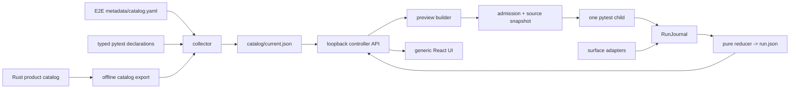
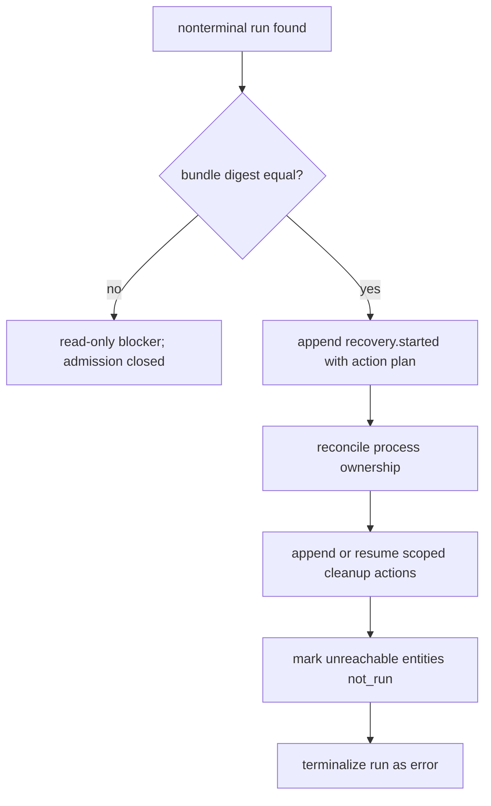

# EphemeralOS E2E Control Room — Technical Design

| Field | Value |
| --- | --- |
| Status | Rewritten; implementation not started |
| System behavior | [e2e-test-system-spec.md](e2e-test-system-spec.md) |
| Detailed UI | [e2e-test-ui-design.md](e2e-test-ui-design.md) |
| Implementation order | [e2e-test-implementation-plan.md](e2e-test-implementation-plan.md) |

This document explains how to implement the system specification with the
fewest durable concepts. It deliberately avoids designing internal frameworks
that have only one consumer.

## 1. Current implementation map

| Concern | Current repository evidence | Classification |
| --- | --- | --- |
| Product semantics | `crates/sandbox-operations/{contract,catalog}` | reuse as authority |
| Shared gateway client | `crates/sandbox-operations/client` | reuse; do not reimplement wire behavior in the Control Room |
| Console catalog | `crates/sandbox-console/src/catalog.rs`, served at `/api/catalog` | reuse projection logic; add offline output |
| Console RPC/proxy | console router, RPC, and proxy modules | reuse public boundary; do not import handlers into tests |
| Live E2E suite | `<PRODUCT_ROOT>/e2e` | preserve behavior; migrate only after stable IDs |
| CLI adapter | `e2e/core/cli.py` | reuse intent, replace ambient paths and add bounded evidence |
| Gateway/direct daemon helpers | `e2e/core/{cli,direct_daemon}.py` | keep only named conformance/privileged uses; prefer fixed Rust probe later |
| Daemon HTTP helper | `e2e/core/daemon_http.py` | reuse intent; remove retry from non-idempotent dispatch paths |
| Collection | ordinary pytest session with live autouse fixture | replace for catalog collection |
| Cleanup | pytest fixtures plus cleanup registry; some exceptions swallowed | repair before Control Room execution |
| UI | static HTML/CSS prototype | reference only |
| Control Room backend/API | absent | new implementation |
| External test repository | absent | new repository after identity freeze |
| Benchmark workspace | Rust backend with configurable parent and nested `benchmark/` | migrate separately to fixed derived leaf |

“Reuse” means preserve a working product boundary or behavior. It does not mean
copying current ambient-root, retry, or error-swallowing behavior.

## 2. Target components



The Python implementation has these concrete modules:

| Module | One responsibility |
| --- | --- |
| `harness/declarations.py` | typed test/case/validation metadata |
| `harness/catalog.py` | collect, merge, validate, publish, query |
| `harness/surfaces.py` | fixed surface-to-driver adapters and proof |
| `harness/events.py` | event schemas, journal, pure reducer |
| `harness/runner.py` | pytest child protocol, lifecycle, cancellation |
| `harness/store.py` | roots, source snapshot, workspace, retention safety |
| `harness/server.py` | loopback API, admission, one-run arbitration, SSE |

Split a module only when it exceeds a clear responsibility or needs an isolated
security boundary. Do not pre-create `core`, `common`, `utils`, `control`, or
`schemas` packages.

## 3. Authority and dependency direction

The merge is ordered by ownership, not override precedence:

1. Rust export contributes product domains, families, operations, and routes.
2. `metadata/catalog.yaml` contributes Harness topology, Compound scenario and
   complexity definitions, owners, E2E-wide execution-label definitions, and
   optional display hints.
3. pytest declarations contribute case-specific facts and references.
4. the collector derives expanded, sorted, searchable records.

If two layers provide the same owned field, collection fails locally. There is
no “last writer wins.”

Product crates never depend on the external test repository. The test repository
may invoke product binaries and public HTTP/SSE endpoints. It may consume
versioned Rust-generated fixtures, but it does not import console handlers or
take cross-repository Cargo path dependencies.

The controller accepts only `TEST_REPOSITORY_ROOT`, `PRODUCT_ROOT`, and
`WORKSPACE_STORE_ROOT`. It derives `e2e/` and `benchmark/` source/store children
exactly as system specification §4 defines. `harness/store.py` canonicalizes and
validates disjointness before opening its writer lock; no module accepts a CWD,
home, `TMPDIR`, environment, or request-level alias for a derived child.

## 4. Data contracts

Contracts use JSON-compatible records and `schema_version=1`. Compatible
additive fields require tolerant readers. Removing a field or changing lifecycle
meaning requires a new major version and a visible incompatible state.

### 4.1 Catalog record

```json
{
  "schema_version": 1,
  "catalog_revision": "sha256:...",
  "source_revision": "sha256:...",
  "generated_from": {
    "product_revision": "...",
    "product_catalog_digest": "sha256:...",
    "e2e_input_digest": "sha256:..."
  },
  "nodes": [],
  "features": [],
  "owners": [],
  "cases": []
}
```

Each case is a discriminated union.

Shared fields:

```text
kind, test_id, case_id, title, purpose, owner_id, source,
pytest_nodeid, metadata_status, runnable, validations,
workspace_policy, evidence_policy, timeout_ms, resource_claims,
execution_label_ids
```

Product-only fields:

```text
topology_leaf, direct_feature_ids, effective_features,
validation_feature_map, execution_surface,
compound?{complexity_id,subject_domain_ids,components[],shared_workspace,
teardown_contract}
```

Harness-only fields:

```text
diagnostic_area, coverage_eligible=false,
execution_surface? OR product_boundary_claim=not_applicable
```

`compound` is descriptive and validation input only. Its ordered components use
stable IDs and roles `subject | fixture | evidence`; they do not become runner
steps. The pytest case remains the one executor and owns orchestration.

### 4.2 Catalog health

```json
{
  "schema_version": 1,
  "state": "ready | refreshing | stale | unavailable",
  "current_revision": "sha256:... | null",
  "observed_input_digest": "sha256:...",
  "attempted_at": "...",
  "published_at": "... | null",
  "diagnostics": [
    {"code": "unknown_feature", "source": "...", "field": "...", "message": "..."}
  ]
}
```

On refresh failure with a last-good catalog, state is `stale`. Without one it is
`unavailable`. Admission requires `ready` and matching input digest.

### 4.3 Selection

```json
{
  "schema_version": 1,
  "catalog_revision": "sha256:...",
  "include": [
    {"case": {"test_id": "...", "case_id": "..."}},
    {"query": {"feature_id": ["..."], "owner_id": ["..."]}}
  ],
  "exclude": [{"test_id": "...", "case_id": "..."}]
}
```

The server normalizes queries, expands complete scope, removes duplicates,
applies exclusions, and sorts by catalog order. A UI aggregate selection becomes
a query; it is not a new clause type.

### 4.4 Preview

```text
preview_id, state, created_at, expires_at, catalog_revision,
source_revision, ordered_cases, case_count, policies,
workspace_template, disk_estimate, controller_bundle_digest,
runner_bundle_digest, product_builds, preflight[], blockers[], warnings[],
admission_token
```

`ordered_cases` contains the frozen case records, not just IDs. It is capped by
the 1,000-case admission limit. `admission_token` exists only when ready.

Each preflight item has:

```text
id, state=checking|ready|warning|blocked,
reason_code, message, observed_at, evidence_summary
```

Facts and policy do not need parallel state fields. The typed reason describes
the observation; `state` states its admission effect.

### 4.5 Manifest

The immutable manifest contains:

```text
schema_version, run_id, preview_id, created_at, parent_run_id?,
catalog_revision, source_revision, cases, policies, preflight_snapshot,
controller_bundle_digest, runner_bundle_digest, product_builds,
source_files[{path,mode,size,sha256}], source_snapshot_digest,
workspace_template, attempt_ids, limits, idempotency_digest
```

Frozen case data includes labels and descriptions needed for historical display.
No current catalog join is required.

### 4.6 Event

```json
{
  "schema_version": 1,
  "run_id": "run-...",
  "seq": 42,
  "at": "2026-07-12T00:00:00Z",
  "monotonic_ns": 123,
  "producer": "controller | runner | adapter",
  "producer_revision": "sha256:...",
  "type": "case.state",
  "test_id": "runtime.file.read",
  "case_id": "default",
  "attempt_id": "attempt-...",
  "entity_id": "runtime.file.read",
  "caused_by_seq": null,
  "payload": {"from": "queued", "to": "running"}
}
```

### 4.7 Run projection

`RunProjection` includes:

- frozen run identity, selection, labels, policies, and lineage;
- current run, case, phase, validation, cleanup, and surface states;
- counts by named state;
- first and primary failures plus all failure records;
- wall/monotonic timing and timing quality;
- evidence health, summaries, caps, truncation, and opaque evidence map;
- workspace state and cleanup outcome;
- stream `applied_through_seq` and last event time;
- recovery history and current recovery blocker;
- `recovery_bundle_match=exact_match|mismatch` for nonterminal recovery state;
- retention state and purge tombstones reduced from ordinary run events.

The reducer never reads the filesystem, clock, network, process table, current
catalog, or current controller identity. It folds only the manifest and
contiguous run events, including post-terminal `retention.state` events.

## 5. Catalog implementation

### 5.1 Offline Rust projection

Add one offline product command that renders the same semantic JSON value used
by `sandbox-console/src/catalog.rs` and exits before server configuration,
networking, gateway, or Docker startup. The smallest placement is an option on
an existing product binary if that does not load runtime state; otherwise use a
tiny product-owned catalog-export binary. Do not add an E2E copy of product
declarations.

Semantic equality between offline output and console `/api/catalog` is a product
contract test.

### 5.2 Side-effect-free pytest collection

The collector invokes pytest collection through a dedicated plugin/entry point
that disables live autouse fixtures and session-summary writers. It captures
expanded items after parametrization. It rejects undeclared or invalid items in
strict mode and MAY expose them as diagnostics only in migration mode.

Publication algorithm:

1. compute semantic input digest;
2. run offline Rust projection;
3. collect pytest declarations;
4. parse the single E2E metadata file;
5. accumulate all local errors;
6. validate references and union arms;
7. sort by `(order absent, order, stable ID)`;
8. canonicalize JSON and hash it;
9. write under `tmp` and fsync;
10. atomically replace `catalog/current.json` and then health.

A failed attempt changes only health. There is no catalog event journal.

### 5.3 Query

`GET /catalog` owns one query grammar:

```text
q, kind, runnable, domain_id, family_id, group_id, scenario_id,
feature_id, owner_id, validation_id, execution_surface,
execution_label_id, compound_complexity_id, subject_domain_id,
test_id, case_id, cursor, limit
```

Different fields are AND; repeats within a field are OR. Search covers IDs,
labels, descriptions, purpose, source, feature, validation, and owner text.
Exact IDs rank first. Result status is not a catalog facet.

The response contains revision, normalized query, page, total, and generic facet
counts. An exact `test_id+case_id` query is the detail resource. Feature views
are `feature_id` queries. This avoids case and feature endpoints.

## 6. Admission and store transaction

The controller owns one file lock for the E2E store and one active-run lease.
The lease is operational state, not a historical authority. On startup it is
reconciled against nonterminal run projections before admission.

Admission is a staged directory transaction:

```text
tmp/run-<nonce>/
  manifest.json
  events.jsonl
  run.json
  source/
  evidence/
```

The source snapshot copies only manifest-declared regular files, without
hardlinks, symlinks, devices, sockets, or FIFOs. It validates mode, size, digest,
and complete tree digest, then removes write permission. Atomic rename to
`runs/<run-id>` is the commit point.

The child receives the run-owned snapshot as its only test-repository import and
configuration root. Product binaries resolve only from frozen product build
records. A live-checkout byte cannot influence the admitted child.

## 7. Runner and reporter

The controller launches one pytest process group/job object for the ordered
cases. The child and controller communicate through a local inherited pipe or
Unix socket that is not exposed to the browser.

The reporter emits candidate events, never sequence numbers. The controller:

1. verifies producer handshake and revision;
2. validates correlation and transition;
3. assigns the next sequence;
4. appends one JSON line and syncs according to the durability policy;
5. folds and atomically replaces `run.json`;
6. broadcasts the persisted event.

The process exit code is evidence, not the whole verdict. The reducer applies
the system pass rule after cleanup and required validations.

### 7.1 Minimal event transition model

`*.state` events share a typed payload:

```text
from, to, reason?, started_at?, completed_at?, duration_ms?,
not_run_reason?, failure_id?
```

Allowed entity transitions are generated from one table and tested in Python
and TypeScript fixtures. State vocabularies remain entity-specific even though
the envelope shape is shared.

`failure.recorded` precedes any state transition that references its ID.
`surface.recorded` is terminal for one case and contains expected/observed proof.
`evidence.recorded` describes availability and opaque retrieval metadata.
`log.recorded` contains a bounded scrubbed chunk or a truncation summary.
`artifact.recorded` exists only after scan, storage, digest, and run ownership
are complete.

## 8. Boundary adapters

### 8.1 CLI

Invoke the exact frozen product executable once with a sanitized environment and
bounded deadline. Record redacted argv, binary digest, product revision, exit or
signal, stdout/stderr caps, structured JSON response when present, request
correlation, and wall/monotonic timing.

### 8.2 Console RPC and proxy

Send actual HTTP to the running console. For `/api/rpc`, persist partial SSE/log
data before terminal transport failure. A response-stream reconnect may use a
product cursor if the product contract supports it; the adapter never reissues
an operation after dispatch might have happened.

The proxy surface calls the actual console proxy route. It cannot be satisfied
by direct daemon HTTP.

### 8.3 Gateway RPC and direct daemon RPC

Current Python helpers prove these paths exist but duplicate product framing,
endpoint, and credential behavior. V1 MAY use them only for named compatibility
fixtures while a fixed Rust probe is added. The probe exposes versioned,
compile-time subcommands, not arbitrary method or URL passthrough.

Direct daemon RPC remains both compile-time and runtime allowlisted and visibly
privileged. Non-allowlisted requests fail before socket creation.

### 8.4 Daemon HTTP

Use the standard-library HTTP client against the endpoint returned by product
inspection. Record method, redacted URL, status, bounded response headers/body,
timeout/connection error, timing, and correlation. Retry connection readiness
only before dispatch of an idempotent request; never retry an operation with an
unknown outcome.

## 9. Failure, cleanup, and recovery algorithms

### 9.1 Cleanup aggregation

Each acquired resource registers one cleanup action with stable ID, requiredness,
ownership identity, and deadline. Cleanup executes in reverse acquisition order
and attempts every action even after failure. Each action emits state and, on
failure, a structured failure record. Required failure prevents pass and marks
the workspace quarantined.

No `except: pass` is allowed in a mandatory cleanup path. Supporting evidence
harvest may fail independently but must still produce degraded evidence.

### 9.2 Fail-fast

After a persisted failure makes the current case unable to pass, the scheduler
closes. It does not interrupt teardown or cleanup. When the case reaches a safe
terminal state, the controller appends causal not-run transitions for every
remaining case and declaration, then terminalizes the run.

### 9.3 Cancellation

Cancellation state and escalation events are persisted before signals. V1
freezes one platform strategy and bounded timings in the manifest. The controller
never sends a signal to a reused PID: process start identity must match.

### 9.4 Recovery

Exact-bundle recovery uses the same run journal:



For each stable action ID:

- no started event: append started, perform, append finished;
- started and finished: do nothing;
- started without finished: inspect the persisted state/owned resource, record
  already-complete if provable, otherwise retry only if the action is idempotent;
- uncertain non-idempotent effect: do not repeat; record manual intervention.

This gives crash-resumable recovery without a second session authority.

## 10. Evidence implementation

Evidence is deliberately modest in v1:

- `logs`: scrubbed chunks with head/tail retention and omitted byte/line counts;
- `structured`: JSON documents attached to validations or surface proof;
- `artifact`: scanned opaque files retrieved by run-scoped ID;
- `resource_summary`: optional low-rate start/end/peak values when supported.

Each evidence item carries:

```text
evidence_id, role, validation_id?, kind, availability,
reason?, media_type?, size?, sha256?, created_at,
correlation, truncation?, storage_ref?
```

The reducer derives aggregate evidence health. No evidence item may invent
samples, extend a missing interval, or infer product success.

Default caps are centralized in the manifest and tested, not repeated across
modules. Initial values:

| Item | V1 cap |
| --- | ---: |
| Event JSON | 64 KiB |
| Logs per case | 5 MiB |
| Artifact | 25 MiB |
| Artifacts per case | 100 MiB |
| Evidence per run | 2 GiB |
| Pending events per SSE client | 1,000 or 1 MiB |

Change a cap only through one manifest policy revision and fixture update.

## 11. Storage and history

The normative tree is in system specification §13. Important design choices:

- no catalog journal: health plus last-good is sufficient;
- no `execution-input-manifest.json`: the immutable file list lives in the run
  manifest;
- no per-case results: `run.json` contains them;
- no `controller.json`: process lease data is operational and may be reconstructed
  or kept in a non-authoritative runtime lock file;
- no `recovery-sessions.json`: recovery facts are run events;
- no retention journal or projection: append `retention.state` to the retained
  `events.jsonl` and fold it into `run.json`;
- no global history projection until measured.

`<E2E_WORKSPACE_ROOT>/TEST-REPORT.md` is an append-only delivery proof ledger,
not controller input and not a historical run projection.

### 11.1 History scan

`GET /runs` lists direct children of `runs/`, opens only a bounded `run.json`
header from each, validates schema, sorts by `(created_at desc, run_id desc)`,
then applies cursor pagination. Corrupt entries are reported in health and
excluded with a visible partial-history warning; the endpoint never converts a
scan failure into “No runs.”

Benchmark retained-run counts and p95 latency in offline fixtures. Add a
disposable index only if p95 exceeds 500 ms at the supported count. The index
must be derived solely from `run.json` and removable without loss.

### 11.2 Workspace safety

All create, traverse, clone, quarantine, and purge operations use canonical,
descriptor-relative, no-follow paths where supported. Every mutable leaf has an
ownership record containing store UUID, semantic identity, creation time, and
lineage. Purge accepts semantic IDs that resolve through records; it never takes
a filesystem path.

V1 clone source is only the verified template. Reuse eligibility and retained
attempt source selection are deleted until a real performance need appears.

## 12. API design

### 12.1 Response envelope

Success:

```json
{"schema_version": 1, "data": {}}
```

Error:

```json
{
  "schema_version": 1,
  "error": {
    "code": "preview_stale",
    "message": "The catalog changed. Review the selection again.",
    "retryable": false,
    "request_id": "...",
    "field": "catalog_revision"
  }
}
```

### 12.2 Endpoint ownership

All paths in this table are relative to `/api/v1`.

| Endpoint | Data owner | Notes |
| --- | --- | --- |
| `GET /health` | controller/store/catalog health | includes roots, lane, disk, product boundary capabilities |
| `GET /catalog` | combined current catalog | browse, exact detail, and feature views use one query |
| `GET /events` | controller notifications and optional run journal | one SSE stream; `run_id` and `after` are optional query parameters |
| `POST /previews` | preview builder | one synchronous resolution with exact bounded scope |
| `POST /runs` | admission transaction | preview/token/idempotency only |
| `GET /runs` | run-directory scan | historical headers only |
| `GET /runs/:run_id` | `run.json` | complete live/history projection |
| `POST /runs/:run_id/cancel` | controller | active run only |
| `POST /runs/:run_id/purge` | retention writer | terminal run only |
| `GET /runs/:run_id/evidence/:evidence_id` | run evidence map | on-demand bytes or structured JSON |
| `GET /workspaces` | workspace records | template, active attempts, quarantine, capacity |
| `POST /workspaces/:workspace_id/purge` | workspace owner | inactive eligible attempt/quarantine leaf only |

There are no UI-specific endpoints. A new family, feature, validation, or domain
does not add an endpoint.

### 12.3 SSE

The browser uses one `/events` EventSource. On a run page it passes
`run_id=<id>&after=N`; elsewhere it omits `run_id` and receives controller
notifications only. Native EventSource reconnect sends `Last-Event-ID`; for a
run stream the server uses the larger valid cursor. Journal events have `id:
seq` and default `message` type to keep the client path small. Named,
unnumbered `catalog.revision` and `stream.heartbeat` events are transport
notifications and never reducer input. `catalog.revision` causes one catalog
refetch. There is no polling and no second SSE connection.

The server drops a slow client after its buffer cap and the browser reconnects
from the last applied sequence. It never sacrifices journal durability for a
client.

## 13. UI architecture contract

The production web stack is:

- React, TypeScript, Mantine, React Router;
- TanStack Query only for server-resource cache/invalidation;
- native EventSource;
- native paginated tables and CSS Grid/Flexbox;
- Vitest, Testing Library, user-event, MSW, and axe for fixtures.

Do not add TanStack Table, TanStack Virtual, uPlot, a chart framework, a state
machine library, or a second client store in v1. Server paging caps mounted rows.
Evidence starts with summaries and accessible tables; a measured need may add a
small chart later without changing the data contract.

The UI consumes generated TypeScript types from the same canonical fixture set
as Python. It owns presentation and interaction only; it does not derive
verdicts, select drivers, rewrite proof labels, or repair missing state.

## 14. Offline proof strategy

No live Docker proof is needed to establish these contracts. Before live work,
offline tests cover:

1. annotation inheritance, stable identity, and hostile parameter summaries;
2. product/E2E catalog merge, diagnostics aggregation, canonical ordering, and
   last-good publication;
3. query normalization, cursor stability, and selection expansion;
4. preview digest, input rejection, idempotent admission transaction, and source
   snapshot containment using disposable files;
5. every event transition, invalid candidate, pure reducer prefix, duplicate,
   gap, corruption, fail-fast, cancellation, cleanup, and recovery prefix;
6. surface adapter fixtures using local fake processes/HTTP servers without
   Docker;
7. redaction canaries in plain and encoded forms;
8. history scan latency and corruption handling;
9. API Host/Origin/nonce/traversal/artifact authorization;
10. UI fixture gallery, keyboard workflows, all status messages, viewports,
    zoom, and accessibility.

Only after these pass should the implementation plan schedule one focused live
proof per distinct boundary and one final suite.

## 15. Technical acceptance checklist

- [ ] Every current and target component is labeled implemented, reused,
  modified, removed, or planned.
- [ ] One owner exists for each product, E2E metadata, catalog, manifest, event,
  projection, and retention fact.
- [ ] Collection has no live fixture or source write.
- [ ] New taxonomy/feature/test data causes no API or frontend edit.
- [ ] Preview and admission meet the round-trip budget.
- [ ] Browser input cannot reach commands, paths, surfaces, drivers, endpoints,
  credentials, or pytest arguments.
- [ ] One manifest plus one event journal reconstructs run state.
- [ ] Cleanup failures are aggregated and block pass.
- [ ] Exact-bundle recovery resumes its event-backed action plan without a
  second authority.
- [ ] History needs no global index at the measured v1 scale.
- [ ] Evidence health is independent from product verdict and never invents
  zero or success.
- [ ] Static prototype data is never labeled as a live connection.
