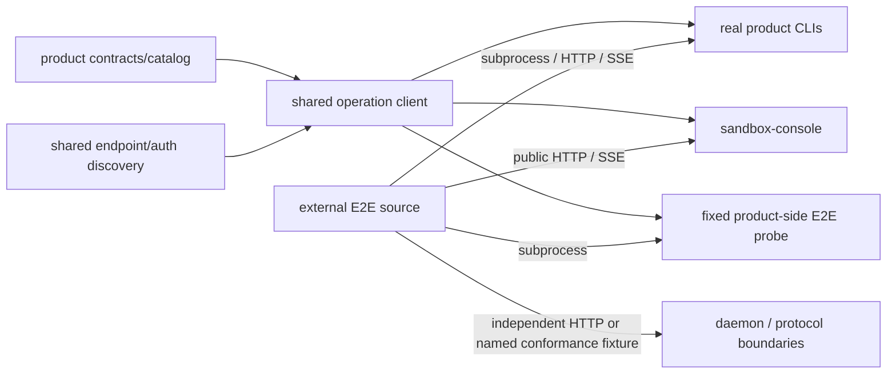

# EphemeralOS Live E2E Control Room — Implementation Plan

| Field                                                       | Value                                                                                     |
| ----------------------------------------------------------- | ----------------------------------------------------------------------------------------- |
| Status                                                      | Proposed; implementation not started                                                      |
| Date                                                        | 2026-07-12                                                                                |
| System specification                                        | [e2e-test-system-spec.md](e2e-test-system-spec.md)                                        |
| Technical and UI design                                     | [e2e-test-design.md](e2e-test-design.md)                                                  |
| Detailed web UI design                                      | [e2e-test-ui-design.md](e2e-test-ui-design.md)                                            |
| Test repository and Git root (`TEST_REPOSITORY_ROOT`)       | `/Users/yifanxu/Ephemeral-AI-Lab/ephemeral-sandbox-test`                                  |
| E2E source root (`E2E_SOURCE_ROOT`)                         | `<TEST_REPOSITORY_ROOT>/e2e`                                                              |
| Non-product benchmark source root (`BENCHMARK_SOURCE_ROOT`) | `<TEST_REPOSITORY_ROOT>/benchmark`                                                        |
| Product checkout (`PRODUCT_ROOT`)                           | `/Users/yifanxu/Ephemeral-AI-Lab/ephemeral-sandbox`                                       |
| Product operation catalog                                   | `/Users/yifanxu/Ephemeral-AI-Lab/ephemeral-sandbox/crates/sandbox-operations/catalog/src` |
| Mutable workspace store (`WORKSPACE_STORE_ROOT`)            | `/Users/yifanxu/Ephemeral-AI-Lab/ephemeral-sandbox-test-workspace`                        |
| E2E workspace root (`E2E_WORKSPACE_ROOT`)                   | `<WORKSPACE_STORE_ROOT>/e2e`                                                              |
| Benchmark workspace root (`BENCHMARK_WORKSPACE_ROOT`)       | `<WORKSPACE_STORE_ROOT>/benchmark`                                                        |
| Product benchmark implementation                            | `<PRODUCT_ROOT>/benchmark/backend`                                                        |
| Append-only live-test report                                | `<E2E_WORKSPACE_ROOT>/TEST-REPORT.md`                                                     |

The words **MUST**, **SHOULD**, and **MAY** are normative. This plan assigns
owners, order, implementation work, and release evidence. It does not weaken a
contract in the system specification or design.

## 1. Delivery objective

Deliver a local, catalog-first E2E Control Room in which a first-time user can
find a feature, understand its tests, select any exact mixture of expanded
cases, review policy and preflight, run without pytest knowledge, follow named
validations and evidence live, recover after disconnect or controller restart,
and inspect the same truth after completion or explicit evidence purge.

The implementation is accepted only when it is:

- **simple to operate:** one Catalog workflow, one Review run gate, one Run
  projection for live and history, and explicit recovery actions;
- **metadata-driven:** registered additions flow through collection into generic
  APIs and components without frontend taxonomy edits;
- **truthful under failure:** state, timing, first and primary failure,
  fail-fast/cancellation causality, cleanup, evidence availability, and resource
  consumption are structured rather than inferred from raw logs;
- **bounded and durable:** writes are single-owner, caps are manifest-frozen,
  disk admission preserves finalization, and history is never silently evicted;
- **portable:** no user-specific path is a fallback and collection/build work
  occurs only in controlled temporary or owned store locations.
- **boundary-verifiable:** every product and surface-declaring Harness case
  freezes one execution surface and cannot pass until the runner attests the
  actual boundary; a no-surface Harness case explicitly claims none.
- **ownership-separated:** `TEST_REPOSITORY_ROOT` is the one E2E/benchmark Git
  repository. Its fixed `e2e/` and `benchmark/` children are versioned source.
  A separate `WORKSPACE_STORE_ROOT` contains independently marker-owned `e2e`
  and `benchmark` mutable roots. The repository root, product root, store root,
  both source roots, both workspace roots themselves, Git metadata, and
  ownership markers are never purge targets. Product benchmark/backend code
  remains under `<PRODUCT_ROOT>/benchmark/backend` unless a separately reviewed
  product extraction establishes a new repository contract.

The smallest architecture is:

`Test repository + offline ProductCatalogProjection → pytest collection → Product|Harness catalog union → conditional boundary adapter → typed events → generic /api/v1 projections → generic React UI`

Pytest remains the sole executor. The controller supervises it; it does not
become a workflow engine.

The controller accepts only canonical absolute `TEST_REPOSITORY_ROOT`,
`PRODUCT_ROOT`, and `WORKSPACE_STORE_ROOT` at startup. They are immutable for
the controller lifetime and never browser-configurable. It derives, without overrides,
`E2E_SOURCE_ROOT=<TEST_REPOSITORY_ROOT>/e2e`,
`BENCHMARK_SOURCE_ROOT=<TEST_REPOSITORY_ROOT>/benchmark`,
`E2E_WORKSPACE_ROOT=<WORKSPACE_STORE_ROOT>/e2e`, and
`BENCHMARK_WORKSPACE_ROOT=<WORKSPACE_STORE_ROOT>/benchmark`. The E2E
controller verifies the exact canonical child locations, non-aliasing/
non-containment of the three configured roots, repository Git identity,
and its own E2E-kind workspace marker. It derives
the benchmark path only to protect the sibling boundary; it does not create,
initialize, require, or mutate the benchmark leaf. Benchmark startup separately
derives and validates the benchmark-kind leaf without requiring the E2E
controller or E2E marker. No CWD, `TMPDIR`, home directory, pytest temporary
root, or caller-supplied alias may redirect source, staging, workspaces, or
purge. Product protocol, transport, auth/discovery primitives, and the fixed
Rust probe stay product-side; E2E source consumes them through binaries and
public boundaries, not cross-repository Cargo path dependencies or console
handler imports.

## 2. V1 scope audit

### 2.1 Required in v1

All of the following are release work, not placeholders for later:

- side-effect-free collection and truthful mandatory cleanup;
- the versioned offline product-catalog projection;
- typed taxonomy, owner, feature, annotation, case, validation, workspace, and
  telemetry contracts;
- external repository/product/workspace ownership, source fingerprinting, paired
  product/E2E revision recording, stable IDs frozen before source movement, and
  collision-safe legacy-workspace migration;
- the six-value execution-surface contract, fixed driver mapping, surface-aware
  preflight, immutable manifest selection, observed attestation, and truthful UI
  proof labels;
- real CLI subprocess, real console HTTP/SSE, direct daemon HTTP, shared-client
  gateway probe, and allowlisted privileged daemon-RPC adapters with bounded
  timeout/cancellation and no post-dispatch replay;
- shared Rust gateway framing/types/auth/error behavior and daemon endpoint
  discovery, plus Rust-generated Python conformance fixtures and digest checks;
- automatic portable input detection, including Rust dependency changes, with
  debounced whole-catalog refresh and atomic last-good publication;
- generic search, URL facets, feature views, mixed selection, aggregate
  selection, exact preview, preflight, and idempotent admission;
- one controller-wide active run, a serial lane, run-scoped opt-in fail-fast,
  bounded cancellation, child-run retry, replay, and deterministic restart
  recovery;
- `standard-v1` evidence, required numeric summaries, and bounded
  `diagnostic-burst-v1` evidence;
- complete run/test/phase/validation/cleanup timing, structured failure records,
  correlation, first/primary failure, and `ResourceConsumptionSummary`;
- safe prepared workspaces, fresh attempt clones, lineage, quarantine, explicit
  reuse eligibility, disk admission, finalization reserve, and explicit
  workspace/run purge with tombstones;
- generic catalog, feature, run, history, evidence, workspace, and health UI;
- complete pointer and keyboard workflows at 375, 390, 768, 1024, and 1440 CSS
  pixels, at normal and 200% zoom;
- cursor pagination, virtualization, 10,000-case and 100,000-event fixtures,
  security, redaction, compatibility, and historical-integrity gates;
- full strict metadata migration plus focused live pilots and one final live
  suite/browser proof.

None of source/workspace ownership, surface attribution, endpoint/auth discovery,
structured transport errors, cancellation/deadline semantics, log streaming,
correlation, secret scrubbing, or protocol compatibility may be moved to a
post-v1 consolidation task.

### 2.2 Excluded only after v1 completeness audit

The complete normative exclusion list is
[system specification §2.2](e2e-test-system-spec.md#22-excluded-from-v1), IDs
`V1-X1` through `V1-X11`. This plan adds no exclusion. The audit below confirms
that each deferral removes optional scale or framework complexity while keeping
the complete single-controller user journey and evidence contract in v1.

| Exclusion | Why it remains outside v1 | Complete v1 capability that MUST ship |
|---|---|---|
| `V1-X1` alternate test semantics | A DSL or automatic assertion instrumentation would create a second semantics layer. | Pytest remains authoritative; every product case has declared named validations, and required validations cannot silently fail or never run. |
| `V1-X2` distributed scale | Parallel/distributed coordination is not required to complete one trustworthy local run. | One controller-wide active run, one durable writer, one serial lane, complete progress, cancellation, cleanup, recovery, history, and scale-tested catalog/event rendering. |
| `V1-X3` scoped fail-fast | Domain/family/group scopes add ambiguous concurrency semantics to a serial v1 lane. | Opt-in run-scoped fail-fast with exact causal not-run records, mandatory teardown/finalization, and failed/not-run child retry selections. |
| `V1-X4` general infrastructure frameworks | A database, queue, plugin runtime, or workflow engine would not improve v1 truth. | Append-only per-run execution journals, separate retention journals, atomic projections, and one rebuildable non-authoritative history lookup projection. |
| `V1-X5` incremental catalog merging | Partial merge creates mixed-revision and local-error ambiguity. | Automatic input detection, debounce/coalescing, whole-catalog recollection, local diagnostics, atomic publication, and last-good retention. |
| `V1-X6` arbitrary browser execution input | Commands, paths, env, and pytest arguments from the browser are an unsafe second API. | Mixed catalog selection, exact expanded preview, enumerated policies, fixed surface drivers, and server-owned immutable manifests cover the complete operator workflow. |
| `V1-X7` in-place workspace reuse | Mutating retained history destroys lineage and reproducibility. | Template or eligible-retained sources are always cloned into a fresh owned attempt with lineage, eligibility checks, quarantine, and explicit purge. |
| `V1-X8` automatic evidence eviction | Silent eviction would make history and disk admission untruthful. | Manifest caps, disk estimate/reservation/finalization reserve, explicit purge, retained tombstones, and rebuildable tooling-cache cleanup. |
| `V1-X9` in-process continuation | A dead/interrupted Python process cannot be resumed truthfully. | Exact-bundle deterministic terminal recovery with persisted actions, followed by a child-run retry; cross-version recovery is deferred. |
| `V1-X10` bespoke presentation | Domain-specific pages and profiler dashboards encode today’s taxonomy. | Generic catalog/run/history/evidence/workspace/health components, generic charts/tables, neutral fallbacks, responsive and keyboard-complete operation. |
| `V1-X11` behavior-changing validation plugins | New verdict/lifecycle semantics require a schema-major decision, not a hidden extension hook. | Arbitrary named required/optional validations using the one lifecycle, generic bounded evidence, and metadata-only addition of validation declarations. |

These are the only deferrals. Catalog freshness, dirty-source identity and
run-owned source snapshots, complete controller identity and crash-recoverable
recovery, runnable no-surface Harness diagnostics, immediate-or-deadline
telemetry finalization, diagnostic evidence, numeric performance/resource
summaries, purge/history provenance, responsive operation, strict metadata
migration, explicit purge, tooling-cache cleanup, and every other positive
requirement remain release-blocking v1 work. Moving anything else out of v1
requires a new normative scope ID and reconciliation of every affected schema,
phase gate, adversarial scenario, and acceptance criterion.

## 3. Authority, change control, and delivery gates

| Artifact | Authority |
|---|---|
| System specification | User-visible behavior, lifecycle semantics, schema meaning, limits, and acceptance outcomes |
| Technical/UI design | Component boundaries, concrete records, API/storage projections, reducer behavior, and interaction contracts |
| This plan | Work order, target ownership, phase gates, and evidence required to claim implementation |

Before implementation, generated schema fixtures MUST give Rust, Python,
controller, and TypeScript consumers the same meaning for:

- `ProductCatalogProjection`, `E2ETaxonomyRegistry`,
  `CombinedE2ECatalog`, `CatalogHealth`, and `CatalogQuery`;
- `SelectionExpression`, `RunPreview`, `RunManifest`,
  `EventEnvelope`, and `RunProjection`;
- `ExecutionInputManifest@1`, `ControllerBundleIdentity@1`,
  `RunnerBundleIdentity@1`, exact-bundle recovery decision, and recovery-session
  survivor records;
- `SourceWorkspaceRef`, `ProductBuildRef`, `ExecutionSurface`,
  `ExecutionSurfaceDescriptor`, `SurfaceAttestation`, and the fixed driver map;
- states, `NotRunReason`, `FailureKind`, cancellation/fail-fast/retry policies;
- telemetry/evidence roles, availability, `EvidenceHealth`, policy revisions,
  and consumption summaries;
- workspace, retention, purge, and API error projections.

Versions are `major.minor`. Additive compatible fields increment minor.
Removing/changing required meaning, a state transition, or verdict semantics
increments major. Unsupported major versions fail visibly. A change after a
freeze gate reopens that gate and all dependent phases.

### 3.1 Master tracker

| Phase | Outcome                                                             | Hard dependency    | Status      |
| ----: | ------------------------------------------------------------------- | ------------------ | ----------- |
|     0 | Read-only inventory, external-root safety design, and truthful cleanup | Approved documents | Not started |
|     1 | Frozen catalog, source, execution-surface, protocol, annotation, and identity schemas | Phase 0 | Not started |
|     2 | Deterministic automatic collection and atomic catalog publication   | Phase 1            | Not started |
|     3 | Frozen run, surface-attestation, event, reducer, failure, and evidence schemas | Phases 1–2 | Not started |
|     4 | Safe durable store, workspace, disk, and retention implementation   | Phase 3            | Not started |
|     5 | Surface adapters, preview/API/controller, execution, replay, and recovery | Phases 2–4 | Not started |
|     6 | Cross-domain telemetry and bounded evidence plane                   | Phases 3–5         | Not started |
|     7 | Generic production UI with boundary-proof labels, accessibility, and scale | Phases 1–6 | Not started |
|     8 | Identity-preserving external source/workspace migration, taxonomy, surface review, and strict conversion | Phases 1–3 | Not started |
|     9 | Focused live proofs across all six execution surfaces               | Phases 4–8         | Not started |
|    10 | Cross-workspace compatibility/security hardening and final proof    | Phases 0–9         | Not started |

UI fixture work MAY begin earlier, but no production UI state or execution claim
is accepted before the owning backend schema/reducer gate.

### 3.2 Evidence rules

- Every criterion has an automated test where practical and links its source
  revision, schema revision, catalog revision, and relevant run/artifact.
- Offline collection/schema/reducer/controller/adapter/browser tests precede
  Docker-backed proof.
- Before a live Docker-backed command, append purpose, exact command, stable IDs,
  expected resources, and cleanup plan to `TEST-REPORT.md`. Append Good, Defect,
  Fix, timings, artifacts, and cleanup afterward.
- Iterate one focused family or scenario at a time. Do not rerun a passing live
  suite until the final scheduled proof.
- No phase is accepted on prose, a screenshot, a raw log, or a passing test count
  when a structured contract can be asserted.
- Existing unrelated worktree changes are preserved.

## 4. Planned ownership and source locations

| Concern | Planned owner |
|---|---|
| Product domain/family/operation truth | `<PRODUCT_ROOT>/crates/sandbox-operations/catalog/src/**` and contracts |
| Shared gateway transport/framing/auth/errors | `<PRODUCT_ROOT>/crates/sandbox-operations/client/src/**` (`sandbox-operation-client`) |
| Shared daemon endpoint discovery | small product-side module/crate selected in Phase 1; consumed by console, CLIs where applicable, and probe |
| Fixed Rust E2E probe | `<PRODUCT_ROOT>/crates/sandbox-e2e-probe/**`; fixed subcommands only |
| Offline product projection | `<PRODUCT_ROOT>/crates/sandbox-console/src/catalog.rs` plus its offline CLI entry point |
| E2E topology/display records | `<E2E_SOURCE_ROOT>/metadata/taxonomy.yaml` |
| Owner and feature lifecycle | `<E2E_SOURCE_ROOT>/metadata/features.yaml` plus owner records in taxonomy |
| Typed test/case/surface/validation declarations | `<E2E_SOURCE_ROOT>/core/metadata.py` |
| Surface adapters and attestations | `<E2E_SOURCE_ROOT>/core/surfaces/**` |
| Collection/merge/diagnostics/publication | `<E2E_SOURCE_ROOT>/core/catalog.py` and pytest plugin hooks |
| Generated schemas/version/protocol fixtures | `<E2E_SOURCE_ROOT>/schemas/**` |
| Event candidates, journal, reducer, projection | `<E2E_SOURCE_ROOT>/core/reporting.py` |
| Telemetry, redaction, summaries | `<E2E_SOURCE_ROOT>/core/telemetry.py` |
| Workspace/store/retention safety | `<E2E_SOURCE_ROOT>/core/workspace_store.py` |
| Loopback API/controller/scheduler | `<E2E_SOURCE_ROOT>/control/**` |
| Production React/Mantine UI | `<E2E_SOURCE_ROOT>/web/**` |
| Product tests | `<E2E_SOURCE_ROOT>/<domain>/<family>/<group>/test_*.py` by convention only |
| Live runner health tests | `<E2E_SOURCE_ROOT>/harness/test_*.py` |
| Offline framework tests | `<E2E_SOURCE_ROOT>/unit/**` |
| Non-product benchmark source/configuration | `<BENCHMARK_SOURCE_ROOT>/**`; no product Cargo package is copied here |
| Product benchmark implementation | `<PRODUCT_ROOT>/benchmark/backend/**`; it remains product-owned in v1 |
| Mutable E2E workspace and retained evidence | `<E2E_WORKSPACE_ROOT>`, external, independently marker-owned, and never a suite family or source root |
| Mutable benchmark workspace | `<BENCHMARK_WORKSPACE_ROOT>/{fixtures,runs,results,runtime,tmp}`, external, independently marker-owned, and never an E2E input or purge target |

Only taxonomy and feature metadata registries are introduced. There is no Python
copy of Rust families, frontend taxonomy registry, domain route registry,
validation-type registry, or mutable global results database.

The repository/source/workspace placement and durable layout are fixed before
controller work. This is the sole authoritative v1 filesystem tree:

```text
<TEST_REPOSITORY_ROOT>/                 # one Git repository and configured root
├── .git/
├── pyproject.toml
├── package.json                        # only when web scripts need it
├── package-lock.json                   # required whenever package.json exists
├── .github/workflows/                  # paired product/E2E CI
├── e2e/                                # E2E_SOURCE_ROOT
│   ├── core/                           # declarations, adapters, reporting
│   │   └── surfaces/                   # six fixed boundary adapters
│   ├── control/                        # loopback controller/API/reducers
│   ├── metadata/
│   │   ├── taxonomy.yaml
│   │   └── features.yaml
│   ├── schemas/                        # versioned schemas/fixtures
│   ├── web/                            # React/Mantine Control Room
│   ├── unit/                           # offline framework/conformance tests
│   ├── runtime/
│   ├── manager/
│   ├── observability/
│   ├── compound/
│   ├── harness/
│   └── ui-prototype/                   # visual fixture only
└── benchmark/                          # BENCHMARK_SOURCE_ROOT: safe non-product source/config

<WORKSPACE_STORE_ROOT>/                 # external parent; never an owned/purge root
├── e2e/                                # E2E_WORKSPACE_ROOT; independently marker-owned
│   ├── root.json                       # immutable kind=e2e ownership marker
│   ├── TEST-REPORT.md                  # append-only live-test report
│   ├── testbed/
│   │   ├── template.json
│   │   └── root/
│   ├── attempts/
│   │   └── <run-id>/<test-key>/<case-key>/attempt-<n>/
│   │       ├── workspace.json
│   │       └── root/
│   ├── quarantine/
│   │   └── <workspace-id>/
│   │       ├── workspace.json
│   │       └── root/
│   ├── tmp/                            # all E2E staging/candidate writes
│   ├── runs/
│   │   ├── run-summaries.json
│   │   └── <run-id>/
│   │       ├── manifest.json
│   │       ├── execution-input-manifest.json
│   │       ├── execution-source/
│   │       ├── run.json
│   │       ├── events.jsonl
│   │       ├── controller.json
│   │       ├── retention.json
│   │       ├── retention-events.jsonl
│   │       ├── tests/<test-key>/<case-key>/attempt-<n>/result.json
│   │       ├── telemetry/<test-key>/<case-key>/attempt-<n>/
│   │       └── artifacts/
│   ├── catalog/
│   │   ├── current.json
│   │   ├── health.json
│   │   ├── diagnostics.json
│   │   └── events.jsonl
│   └── tooling/
│       ├── sandbox-console/<input-digest>/{build-stamp.json,target/}
│       └── sandbox-e2e-probe/<input-digest>/{build-stamp.json,target/}
└── benchmark/                          # BENCHMARK_WORKSPACE_ROOT; no nested benchmark/
    ├── root.json                       # immutable kind=benchmark ownership marker
    ├── fixtures/                       # cached benchmark fixture material
    ├── runs/                           # run/trial workspaces and journals
    ├── results/                        # retained benchmark result artifacts
    ├── runtime/                        # runner-instance mutable runtime data
    └── tmp/                            # migration and atomic-publication staging
```

In this tree, repository `e2e/` and `benchmark/` are tracked **source** roots;
store `e2e/` and `benchmark/` are external mutable **workspace** roots. The
store parent is never marker-owned or purgeable. Historical paths are only
explicitly inventoried migration origins.

No `target/`, run database, catalog cache, captured log, retained workspace,
virtual environment, generated UI output, or ownership marker is permitted in
`ExecutionInputManifest@1`. Each owner validates its own workspace leaf through
its independent marker before every payload mutation. Initial marker creation is
the sole bootstrap exception: validate the nearest existing ancestor and exact
reserved path, race-safely create or open an empty compatible leaf, revalidate
identity/non-aliasing, atomically create `root.json`, and only then create role
directories or write migration/runtime payloads. The repository root,
`E2E_SOURCE_ROOT`, `BENCHMARK_SOURCE_ROOT`, `PRODUCT_ROOT`, both workspace roots
themselves, `.git`, and ownership markers are never purge targets. Local ignored
developer environments MAY exist only when the execution-input policy excludes
them and undeclared-import checks prove they cannot affect collection or
execution. Release evidence lives only under `E2E_WORKSPACE_ROOT`.

The product benchmark backend remains `<PRODUCT_ROOT>/benchmark/backend` in v1
and inherits the product workspace, dependencies, lockfiles, and lints.
`BENCHMARK_SOURCE_ROOT` owns only safe non-product benchmark source/configuration;
it does not copy the product Cargo package. Moving the backend elsewhere requires
a separately approved product extraction with its own source and compatibility
contract; benchmark mutable data remains isolated beneath
`BENCHMARK_WORKSPACE_ROOT`.

The current benchmark backend path model is a required Phase 0 migration, not a
second layout. It currently treats its configured workspace as a parent and
appends `benchmark/`; v1 instead accepts the validated `WORKSPACE_STORE_ROOT`
and internally derives the exact `BENCHMARK_WORKSPACE_ROOT` leaf, MUST NOT create
`benchmark/benchmark`, and replaces its legacy flexible root/marker
contract with the fixed `root.json`-owned leaf shown above.

Beyond its mandatory `root.json` ownership marker, `E2E_WORKSPACE_ROOT` has
exactly seven direct role directories: `testbed/`, `attempts/`, `quarantine/`,
`tmp/`, `runs/`, `catalog/`, and `tooling/`. It has no fallback derived from
`/tmp`, `TMPDIR`, process CWD, `$HOME`, pytest temporary roots, the browser, or
any caller-supplied path. All staging, including source snapshots, template
preparation, attempt publication, catalog candidates, and migration candidates,
occurs under `<E2E_WORKSPACE_ROOT>/tmp` before an atomic contained publish.

Beyond its mandatory `root.json` ownership marker, `BENCHMARK_WORKSPACE_ROOT`
has exactly five direct role directories: `fixtures/`, `runs/`, `results/`,
`runtime/`, and `tmp/`. Benchmark startup accepts `WORKSPACE_STORE_ROOT`,
validates it as the external store parent, and derives this exact leaf internally;
neither the E2E controller nor a separate workspace setting selects it. The
backend does not infer it from CWD, persist an alternative, accept a browser
override, or append another `benchmark/` segment.
Benchmark cleanup can mutate only marker-owned descendants of these roles and
cannot target `WORKSPACE_STORE_ROOT`, the leaf root, its marker, E2E data, or
either source tree.

Storage keys are safe hashes mapped to separate semantic `test_id` and
`case_id` fields; no concatenated ID is authority.
`runs/run-summaries.json` is the one permitted global run lookup projection:
schema-versioned, atomically replaced, rebuildable, and non-authoritative. It is
derived only from each run's authoritative manifest/run projection and current
retention overlay, and is never a verdict store, recovery source, retention
authority, or artifact index.

The dependency direction is fixed:



No product crate depends on the external test repository. No E2E module imports
console application handlers. Catalog projection through `--print-catalog` is
metadata-only and does not select or require a running console for execution.

### 4.1 Concrete v1 change matrix

| Change | Existing files affected | New files/modules | Migration risk | Required in v1 |
|---|---|---|---|---|
| Move all E2E-owned source into the dedicated Git repository | `<PRODUCT_ROOT>/e2e/**`, especially `e2e/core/root.py`, `config.py`, `cli.py`, `gateway.py`, `daemon_http.py`, and `direct_daemon.py` | `<TEST_REPOSITORY_ROOT>/{pyproject.toml,package.json,.github/**}`, `<E2E_SOURCE_ROOT>/**`, source-manifest policy | High: imports, CWD assumptions, binary lookup, pytest node references, and history links | Yes |
| Migrate legacy mutable data into marker-owned workspace leaves | product benchmark configuration and legacy E2E/benchmark store configuration | `<E2E_WORKSPACE_ROOT>/root.json`, `<BENCHMARK_WORKSPACE_ROOT>/root.json`, collision-safe migration ledger/tooling | High: legacy roots can contain marker-owned data that must not be overwritten or mistaken for source | Yes: inventory/collision checks precede marker initialization; verified migration precedes source overlay and Git initialization |
| Make the benchmark backend consume the exact fixed benchmark leaf | `<PRODUCT_ROOT>/benchmark/backend/src/{config.rs,main.rs,api.rs,cleanup.rs}` and `tests/{unit/config.rs,unit/cleanup.rs,api.rs}` | Fixed `root.json` marker schema/fixtures and exact-role path tests; no broad path abstraction | High: the current parent-root model would create `workspaces/benchmark/benchmark`, while runtime root mutation could escape the repository contract | Yes |
| Freeze configured roots, derived children, and paired revisions | migrated `e2e/core/root.py`, `config.py`, `cli.py`, collector and controller startup | `SourceWorkspaceRef`, `ProductBuildRef`, root-derivation/alias tests, external and product CI workflows | High: an accidental override or alias can delete source or run the wrong product build | Yes |
| Keep gateway wire/auth/request behavior product-owned | `<PRODUCT_ROOT>/crates/sandbox-operations/client/src/{client.rs,config.rs,request.rs,lib.rs}` and tests; operation contract request/response/error files | generated protocol fixture/digest test support; secure token-file loading only if product policy requires a file source | Medium: shared-client behavior changes every CLI, console, and probe consumer | Yes |
| Extract only reusable daemon endpoint interpretation/discovery | `<PRODUCT_ROOT>/crates/sandbox-console/src/{endpoint.rs,state.rs,health.rs,daemon_api.rs,proxy.rs}` | `<PRODUCT_ROOT>/crates/sandbox-operations/client/src/endpoint.rs` and tests, or an equivalently small product crate if dependency review proves client ownership invalid | Medium: preserve console TTL cache, HTTP conversion, and proxy policy in console | Yes |
| Add the fixed Rust probe | `<PRODUCT_ROOT>/Cargo.toml` and lockfile | `<PRODUCT_ROOT>/crates/sandbox-e2e-probe/{Cargo.toml,src/main.rs}` plus unit/contract tests | Medium: privileged command surface must remain compile-time closed and versioned | Yes |
| Replace general live Python wire clients with typed surface adapters | migrated `e2e/core/{gateway.py,direct_daemon.py,daemon_http.py,cli.py}` and product tests that call them | `<E2E_SOURCE_ROOT>/core/surfaces/**`, probe subprocess adapter, named offline conformance fixtures | Medium: every migrated Product case and surface-declaring Harness case needs an explicit reviewed surface | Yes |
| Carry surface identity through every projection | collector, preview/controller, reporter/reducer, catalog/result schemas | `ExecutionSurfaceDescriptor`, `SurfaceAttestation`, surface lint and reducer fixtures | Medium: missing attestation must invalidate previously passing-looking results | Yes |
| Show exact boundary proof in the Control Room | existing visual prototype is reference only | `<E2E_SOURCE_ROOT>/web/**`, including one generic `SurfaceProof` component | Low/medium: avoid browser overrides or surface-specific pages | Yes |
| Pair product and E2E compatibility CI | existing product CI configuration, if any | `<PRODUCT_ROOT>/.github/workflows/e2e-compat.yml` and `<TEST_REPOSITORY_ROOT>/.github/workflows/e2e.yml` (names MAY follow repository convention) | High: independent repositories otherwise admit incompatible commits | Yes |
| Keep catalog projection separate from runtime execution | `<PRODUCT_ROOT>/crates/sandbox-console/src/{catalog.rs,main.rs}` and tests | offline export fixtures only; no runtime console dependency | Low | Yes |

## 5. Phase 0 — Read-only inventory, root safety, and cleanup truth

### Outcome

The existing source and mutable payloads are inventoried without moving or
deleting them; the three-root contract is proven; source collection is
read-only; and every mandatory cleanup failure is structured and non-passing.
No source migration occurs until Phase 1 freezes stable `(test_id, case_id)`
identity and Phase 8 executes the identity-preserving move.

### Deliverables

- Treat existing `ephemeral-sandbox-test-workspace` and
  `ephemeral-sandbox-test-state` as legacy migration origins. Before creating
  a workspace marker or overlaying source at `E2E_SOURCE_ROOT`, inventory
  every marker-owned E2E and benchmark payload, record canonical paths and
  complete content manifests/digests, and map each object to
  `E2E_WORKSPACE_ROOT` or `BENCHMARK_WORKSPACE_ROOT`. These two named legacy
  paths are migration inputs only. Produce a collision-safe migration plan and
  ledger, but perform no move, marker creation, Git initialization, or deletion
  in this phase.
- Specify explicit startup values for `TEST_REPOSITORY_ROOT`, `PRODUCT_ROOT`,
  and `WORKSPACE_STORE_ROOT`. Derive the four child roots at their fixed paths with no
  environment, browser, CLI, or caller override. Canonical, symlink-aware,
  mount-aware, and device/inode-aware validation rejects equality, aliasing, or
  containment among the three configured roots; verifies repository Git
  identity, exact child locations, and sibling separation; and rejects a
  symlinked, relocated, or wrong-kind derived child. The
  browser cannot configure any root.
- Refactor `<PRODUCT_ROOT>/benchmark/backend/src/config.rs`, `main.rs`, `api.rs`,
  and `cleanup.rs` so benchmark startup accepts `--test-repository-root` with
  `<TEST_REPOSITORY_ROOT>` plus `--workspace-store-root` with
  `<WORKSPACE_STORE_ROOT>`. It derives `BENCHMARK_WORKSPACE_ROOT` internally, makes
  `BenchmarkPaths.root` equal that
  exact leaf, and gives it only the `fixtures/`, `runs/`, `results/`, `runtime/`,
  and `tmp/` direct role directories. Remove the extra
  `BenchmarkPaths.benchmark` level, the legacy `--test-workspace-root` option,
  the sibling default, environment/persisted alternatives, and the runtime API
  that changes this root. Replace `.eos-benchmark-root` with the immutable
  `root.json` benchmark-kind marker through the collision-safe migration path;
  do not create both markers as competing authorities. The backend MUST reject
  any path that is not the exact canonical derivation, and cleanup
  protects the leaf, marker, and all five direct role roots while allowing only
  marker-authorized descendants. `tmp/` is cleared only after active-migration
  and recovery checks.
- Replace product-root inference in migrated `e2e/core/root.py`, `config.py`,
  `cli.py`, and source-path assertions with explicit repository/source/product/
  workspace responsibilities. Collection from an unrelated CWD works; product
  binaries and manifests resolve only through `PRODUCT_ROOT`; workspaces resolve
  only through `E2E_WORKSPACE_ROOT` or `BENCHMARK_WORKSPACE_ROOT` by fixed role.
- Define paired-checkout CI: every E2E job receives one explicit compatible
  product revision, records content-derived E2E input and dirty product
  fingerprints, builds with `--manifest-path <PRODUCT_ROOT>/Cargo.toml --locked`,
  and writes E2E build output only below `<E2E_WORKSPACE_ROOT>/tooling`.
- `TEST-REPORT.md` is a human/delivery-managed append-only file at
  `<E2E_WORKSPACE_ROOT>/TEST-REPORT.md`. Collection, controller startup, and
  live execution never append to it or any source path.
- Provide collection-only mode that starts no gateway, Docker resource,
  background process, live preflight fixture, report writer, or `atexit` writer.
  All collector/session-exit output goes to its fixed role under
  `E2E_WORKSPACE_ROOT`, with candidates staged under `<E2E_WORKSPACE_ROOT>/tmp`;
  there is no `/tmp`, `TMPDIR`, CWD, `$HOME`, pytest-temp, source-relative, or
  caller-supplied fallback.
- No cleanup or purge API accepts an arbitrary path. `TEST_REPOSITORY_ROOT`,
  `PRODUCT_ROOT`, `WORKSPACE_STORE_ROOT`, `E2E_SOURCE_ROOT`, `BENCHMARK_SOURCE_ROOT`, both workspace
  roots themselves, `.git`, and ownership markers are permanently forbidden
  deletion targets.
- Prove with disposable sentinels that repository collection/watch/hash/lint/
  package commands never traverse the external workspace store and workspace
  operations cannot target either repository or the unowned store parent.
- Aggregate cleanup so every run-owned action is attempted after earlier
  failure. Remove swallowed sandbox/session/container destruction and
  evidence-harvest exceptions; required cleanup has no `except: pass`.
- Produce a dated reconciliation ledger for functions, expanded cases,
  docstrings, raw assertions, Product/Compound/Harness/Unit ownership, and
  source writes. Counts are migration inputs, never UI constants.

### Gate

- **P0-01:** A byte snapshot before/after collection is identical and no live
  process, Docker resource, source artifact, or workspace write outside the
  fixed derived roles appears.
- **P0-02:** With first and third cleanup actions failing, all actions run, both
  failures survive, and the test cannot pass.
- **P0-03:** A product assertion followed by teardown failure preserves the
  assertion as first failure and teardown as the higher-priority primary error.
- **P0-04:** Every collected item is classified exactly once and additions/
  removals are separated from the dated baseline.
- **P0-05:** The three configured roots are pairwise disjoint, source and
  workspace leaves resolve only beneath their declared parents, no migration
  write has occurred, and the proposed E2E/benchmark marker contracts reject
  both repositories and the workspace-store parent.
- **P0-06:** Equality, symlink/mount/device-inode aliasing, and ancestor/
  descendant combinations among all three configured roots are
  rejected before mutation; exact derivation, deployment-path, Git-root,
  sibling-separation, and workspace-marker checks reject any
  overridden, symlinked, relocated, or wrong-kind derived child.
- **P0-07:** From an unrelated CWD, collection resolves E2E source and paired
  product checkout explicitly, emits the same semantic catalog, and leaves both
  source trees byte-identical.
- **P0-08:** A product revision mismatch or dirty-input change blocks admission
  with expected/observed identities; no stale source-tree `target/debug` binary
  is accepted.
- **P0-09:** Different and byte-identical legacy collisions prove migration
  never overwrites or merges data, publishes only verified marker-compatible
  content, and never accepts either legacy path as a runtime root. Inventory and
  collision checks complete before marker initialization; no payload write
  occurs until the correct destination marker is valid; verified migration
  completes before source overlay or test-repository Git initialization.
- **P0-10:** From an unrelated CWD and different `TMPDIR`, testbed preparation,
  attempt clone, adversarial staging, recovery quarantine, and catalog/source
  snapshot publication remain under the fixed `E2E_WORKSPACE_ROOT` roles; no
  environment, browser, pytest, or caller value redirects them.
- **P0-11:** In disposable repositories plus an external workspace store,
  collection/watch/hash/lint/package commands neither ingest nor delete sentinel
  payloads, and workspace operations reject both repositories and the store parent.
- **P0-12:** Starting the benchmark backend with `WORKSPACE_STORE_ROOT` records
  `BenchmarkPaths.root == BENCHMARK_WORKSPACE_ROOT`, creates only the five fixed
  role directories, and never creates `benchmark/benchmark`. A
  legacy `--test-workspace-root` option, environment value, persisted setting,
  browser/API request, wrong-kind marker, symlink alias, or non-derived path
  cannot redirect it. The benchmark backend starts without the E2E controller or
  E2E marker; the E2E controller starts with the benchmark leaf absent and does
  not create it. Benchmark cleanup rejects `TEST_REPOSITORY_ROOT`,
  `PRODUCT_ROOT`, both source roots, the unowned `WORKSPACE_STORE_ROOT`, either
  workspace leaf, either marker, every direct role root, and any E2E descendant
  as a target.

## 6. Phase 1 — Catalog, annotation, feature, and identity freeze

### Outcome

Freeze the one authority chain and ergonomic contributor contract before writing
collector/controller/UI code or moving source.

### Deliverables

#### 6.1 Product boundary and taxonomy

- Reuse the semantic product catalog projection already owned by Rust. Add one
  `sandbox-console --print-catalog` mode that exits before configuration,
  networking, gateway, or Docker startup; its semantic bytes match the console
  catalog API for the same build.
- Product domains/families/operations remain Rust-owned. E2E-only domains and
  families, product-family augmentation, groups, Compound complexities and
  scenarios, owners, order, and optional display hints are taxonomy-owned.
- IDs are registered strings with no UI allowlist. `compound` is E2E-owned.
  Seeded `simple`, `medium`, and `complex` values are not enums.
- Every group and scenario has canonical owner and at least one direct feature.
  A family MAY add direct augmentation features. Exactly one of `group_id` or
  `scenario_id` attaches each product case.
- Source path is a convention/lint only. It never owns taxonomy or identity.

#### 6.2 Feature and owner registry

Every feature has stable ID, label, description, owner, kind, lifecycle, and
order/display hints. An operation feature has a valid `operation_ref` and derives
product domain/family identity from the product projection. Unknown tags fail.
A deprecated feature requires either `replacement_feature_id` or
`no_replacement_reason`. Ready/strict cases cannot reference it; warn mode may
retain an unchanged deprecated reference only as
`metadata_status=legacy,runnable=false` with a diagnostic.

#### 6.3 Annotation API

Implement thin typed `e2e_test(...)`, `validation(...)`, and `e2e_case(...)`
helpers rather than a second test DSL. Freeze the live catalog as a required
`catalog_kind=product | harness` discriminated union. Every expanded arm shares:

- globally stable `test_id` and explicit `case_id` matching the pytest parameter
  ID; non-parametrized cases use `default`;
- title, meaningful description, canonical owner, source location, current
  `nodeid`, and `metadata_status=ready | legacy | invalid` plus `runnable`;
- at least one declared named validation with stable ID, description, lifecycle
  phase, required/optional state, and generic bounded evidence declarations;
- workspace policy, telemetry policy, resource claims, and execution labels
  where applicable;
- optional author-owned bounded `parameter_summary`; the collector never
  introspects arbitrary parameter objects.

Before Phase 8 moves any file, emit and review a complete baseline mapping from
every current expanded pytest node to its final stable `(test_id, case_id)`.
Duplicate, missing, or position-derived identities block migration. This
identity ledger is the join key for history and migration reconciliation.

The `product` arm additionally requires exactly one topology leaf (`group_id`
or Compound `scenario_id`), derived topology, at least one direct active product
feature with inherited/effective provenance, complete validation-to-feature
mapping, and exactly one explicit `execution_surface`. Product-operation
authoring/migration may default to `cli`, but the published arm never omits it.

The `harness` arm is a runner/readiness diagnostic. It omits product domain,
family, group, scenario, complexity, feature references, and product-feature
mappings; each diagnostic validation carries `coverage_eligible=false`.
`execution_surface` is optional. A surface-declaring Harness case obeys the
same driver/preflight/attestation/pass contract as Product. A no-surface Harness
case omits all surface fields/events and freezes
`product_boundary_claim=not_applicable` (“Harness diagnostic — no product
boundary claimed”). It remains runnable through ordinary catalog, preview,
execution, retry, result, and history flows and never counts as product
coverage.

One `e2e_case` belongs on every `pytest.param`. A case's direct features replace
the base direct set; its declared validations select a subset of the base
validation universe and may not invent an inline validation. Each Product case
still maps every direct feature to at least one validation and every validation
to at least one effective feature. Harness cases reject these mappings. Raw
assertions remain pytest assertions; the reporter never fabricates a named
validation.

`parameter_summary` accepts only deterministic JSON objects/arrays containing
strings, finite numbers, booleans, and null. Limit each container to 16 entries/
elements, keys to 64 Unicode code points, strings to 256 code points, nesting to
four levels, and canonical UTF-8 JSON to 4 KiB per expanded case. Apply the
evidence sensitive-key/secret scrubber before publication with an explicit
redaction marker/count. Non-finite, non-JSON, over-depth, or over-limit data is a
local collection error. The collector MUST NOT call `repr`, `str`, pickle, or a
serializer on an arbitrary pytest parameter; an absent summary displays only
stable `case_id` and optional declared case label.

Freeze `WorkspacePolicy@1` as `mode=none | fresh-owned-clone |
owned-invalid-path-staging`. A fresh clone separately declares
`source_policy=template-only | template-or-eligible-retained` and
`result_policy=never | eligible-if-safe`; invalid-path staging is owned and can
never become reusable. Reject all invalid combinations during collection and
freeze the exact resolved source revision in preview and manifest. Do not retain
the ambiguous `reuse_allowed` boolean.

#### 6.4 Execution surface and reuse boundary

Freeze this smallest v1 enum:

```text
cli | console_rpc | console_http_proxy | gateway_rpc |
daemon_http | direct_daemon_rpc
```

Freeze the driver map as controller policy, not author/browser input:

| Surface | Driver | Required boundary | Auth/discovery | V1 execution policy |
|---|---|---|---|---|
| `cli` | `cli_subprocess` | real CLI process | CLI's own shared product behavior | public, default, 180 s, capture argv/binary digest/exit/stdout/stderr |
| `console_rpc` | `console_http` | console `/api/rpc` HTTP/SSE | console policy | public console, manifest-frozen deadline, preserve partial SSE, never reissue after dispatch |
| `console_http_proxy` | `console_http` | console daemon-HTTP proxy | console policy | public console, capture proxy status/headers/body/errors |
| `gateway_rpc` | `rust_probe` | gateway wire protocol | shared client auth/discovery | internal, 180 s; `python_conformance` only on named compatibility cases |
| `daemon_http` | `python_http` | daemon HTTP directly | shared resolver output passed as data | public daemon, 10 s, no console dependency |
| `direct_daemon_rpc` | `rust_probe` | fixed daemon-RPC subcommand | shared resolver/credential policy | privileged, 180 s, compile-time plus runtime allowlist |

`gateway_client` is deliberately not an execution surface. A named public or
internal boundary is what the result proves; the driver is how the adapter
reaches it. Browser requests may select registered cases and enumerated run
policies but never replace surface, driver, operation, URL, endpoint, credential,
or direct-RPC allowlist.

Before adapters are written, audit and either reuse or extract these exact
product-side primitives:

- request/response protocol types and JSON-line framing in operation contracts
  and `sandbox-operation-client`;
- gateway address resolution and token loading (explicit → environment → secure
  default file), correlation, structured error conversion, and redaction-safe
  display;
- daemon endpoint resolution and Docker-label interpretation as one small shared
  module consumed by console and the fixed probe.

Do not move console routes, HTTP/SSE handlers, proxy policy, application state,
or UI-facing error mapping into a library. Do not keep a general Python live raw
gateway or daemon-RPC client. Python retains direct daemon HTTP, controller/UI,
subprocess orchestration, evidence normalization, and explicitly named offline
protocol-conformance fixtures. The product-side `sandbox-e2e-probe` exposes only
fixed versioned subcommands for gateway operations and allowlisted lifecycle
daemon RPC; it is not an arbitrary method/URL passthrough.

#### 6.5 Combined schema and ordering

Generate typed schemas for `domains`, `families`, `groups`, `complexities`,
`scenarios`, `owners`, `features`, and expanded `cases`, including the complete
Product/Harness union and `product_boundary_claim` arm. Each record validates
referential integrity and version compatibility. Ordering is always
`(order absent, order, stable ID)`; frontend arrays never supply canonical order.
The pair `(test_id, case_id)` is durable identity across moves and reorder.
`case_uid` is allowed only as an in-memory React key.
Also generate `SourceWorkspaceRef`, `ProductBuildRef`, `ExecutionSurface`,
`ExecutionSurfaceDescriptor`, and `SurfaceAttestation`. The catalog freezes the
author-assigned surface and descriptor revision. Preview/manifest add driver,
boundary, privilege, timeout/cancellation, and preflight IDs. Only the adapter/
journal assigns observed attestation.

### Gate

- **P1-01:** Same-build print/API product projections have identical semantic
  bytes and print mode starts no runtime service.
- **P1-02:** A fifth E2E domain, E2E-only family, empty group, fourth Compound
  complexity, unknown display hint, and product-family augmentation validate
  without consumer code changes.
- **P1-03:** A source move and parameter reorder preserve every structured
  identity and mapping.
- **P1-04:** Golden case-inheritance fixtures prove replacement/subset algebra
  and pytest/case-ID equality.
- **P1-05:** Duplicate identity, unknown tag, invalid deprecated reference,
  invalid owner/leaf, missing direct tag, direct tag with no validation,
  validation with no feature, and undeclared validation each produce local
  source/line/column diagnostics.
- **P1-06:** Declaration coverage and latest execution proof are separate; a
  declaration is never displayed or counted as a pass.
- **P1-07:** Supported-minor unknown fields survive safely; unsupported major
  versions fail visibly.
- **P1-08:** A new named validation using the existing lifecycle needs only test/
  recorder/evidence changes. A lifecycle/verdict change fails unless proposed as
  schema-major.
- **P1-09:** Every Product and surface-declaring Harness case has one valid
  surface; a no-surface Harness case has the explicit not-applicable arm and no
  surface fields/events. Unknown Product surfaces, author-supplied drivers, and
  browser/runtime overrides fail before dispatch.
- **P1-10:** Dependency checks prove shared product crates do not depend on E2E
  or console handlers, external E2E has no console-module or cross-repo Cargo
  path dependency, and the fixed probe exposes no arbitrary operation.
- **P1-11:** Rust protocol fixtures and compatibility digests are generated from
  the product revision and consumed by the named Python conformance suite.
- **P1-12:** Hostile parameter fixtures prove no arbitrary `repr`/`str` or
  serializer executes; every size/depth/type/redaction bound is local and
  deterministic, and reordering parameters preserves stable IDs.
- **P1-13:** Runnable surface and no-surface Harness fixtures validate the union,
  appear only in Runner Health/product-neutral search, execute through the
  generic flow, and contribute zero product feature coverage.

### Extension change budget

| Extension | Expected changes | Genericity gate |
|---|---|---|
| Test in existing group | test declaration/case data | no registry/API/UI change |
| New group | one taxonomy record plus tests | no family allowlist or UI change |
| New product family | legitimate Rust catalog/module/tests, taxonomy groups, E2E tests | no Python list or UI route/style/card |
| New E2E-only family/domain | taxonomy plus tests | no Rust or UI change |
| New feature | feature record plus test/validation references | no feature component/search edit |
| New named/optional validation | declaration and recorder call; generic evidence as needed | no reducer branch/card/type registry |
| New evidence shape | bounded generic JSON/artifact producer | no lifecycle or bespoke page |
| New Compound scenario/complexity | taxonomy plus tests | no enum/route/lane/style |
| Fifth top-level E2E domain | taxonomy plus tests | no frontend change |
| New Rust product domain | Rust enum/catalog/exhaustive product consumers plus E2E metadata/tests | no E2E frontend change after projection |

## 7. Phase 2 — Automatic deterministic catalog publication

### Outcome

Publish one complete deterministic catalog, detect every relevant local input
change automatically, retain last-good on failure, and block admission while
the checkout is stale or invalid.

### Deliverables

#### 7.1 Portable input fingerprint and fixed product build

- Poll the complete input fingerprint every 2 seconds; debounce for 500 ms.
  Coalesce changes during refresh into exactly one follow-up whole refresh.
- Fingerprint E2E Python sources, metadata registries, pytest/plugin/config files,
  schema inputs, relevant lock/toolchain files, and the full local Rust
  dependency closure of `sandbox-console` discovered through locked Cargo
  metadata.
- On a changed Rust input fingerprint run exactly
  `cargo build --manifest-path <PRODUCT_ROOT>/Cargo.toml --locked -p
  sandbox-console --bin sandbox-console`, with `cwd=PRODUCT_ROOT` and
  `CARGO_TARGET_DIR=<E2E_WORKSPACE_ROOT>/tooling/sandbox-console/<input-digest>/target`.
  Build the probe equivalently under
  `tooling/sandbox-e2e-probe/<input-digest>/target` when selected. No source-tree
  build output or ambient-CWD lookup is allowed.
- Each `build-stamp.json` records canonical product source revision,
  dirty-input/full dependency fingerprint, Cargo.lock/toolchain/command revision,
  resolved manifest/package/bin, and actual binary digest. The combined
  rebuildable cache cap is 5 GiB; safe cache rebuild is the only automatic
  deletion in v1.
- Emit `ExecutionInputManifest@1`: the canonical sorted set of every regular
  repository-local file the collector or runner may import, execute, configure,
  or read for test semantics, with source-relative path, mode, size, SHA-256,
  and policy revision. Reject symlinks, special files, escape, duplicate
  canonical paths, and undeclared local imports. Compute `e2e_source_revision`
  from canonical manifest bytes and contents; Git commit/branch/dirty state is
  display provenance only. A dirty edit changes identity, while relocating
  identical bytes does not.
- Record `SourceWorkspaceRef`, the execution-input manifest/revision, and a
  `ProductBuildRef` for every executable/probe. Absolute host paths appear only
  in controller configuration/health, not semantic catalog bytes. Changing any
  semantic input makes catalog/preview stale.
- Build/metadata failure preserves last-good, marks health stale, publishes local
  diagnostics, and blocks new admission.

#### 7.2 Collection and publication

- Run collection after parametrization without executing tests or session-finish
  artifact hooks.
- Merge product projection → taxonomy → feature registry → expanded annotated
  cases. No later layer silently overrides an earlier owner.
- Aggregate every independent metadata/schema/reference error in one attempt.
  Invalid cases exist only in diagnostics, never browseable rows.
- Write a candidate under `<E2E_WORKSPACE_ROOT>/tmp`, fully
  validate/sort/hash it, and atomically replace `catalog/current.json` only on
  success.
- Maintain `health.json`, `diagnostics.json`, and append-only
  `catalog/events.jsonl` with refresh attempt identity and last-good/current
  revisions.
- Publish one catalog-revision notification after atomic success. The UI
  invalidates and refetches its one combined Catalog query; there is no
  per-test registration, route/card change, controller restart, or per-row join.
- `catalog_revision` hashes canonical semantic bytes, including source/build
  inputs that affect meaning but excluding generation time.

#### 7.3 Generic query

Implement one `CatalogQuery` shared by HTTP and URL normalization. Search covers
domain/family/group/complexity/scenario/owner IDs, labels, descriptions; test/
case ID, title, description, source; feature ID/label/description; and validation
ID/description. Facets are:

`catalog_kind | runnable | domain_id | family_id | group_id | complexity_id |
scenario_id | feature_id | owner_id | validation_id | metadata_status |
execution_surface | execution_label`

Fields combine with AND; repeats within a field use OR. Exact ID matches rank
first. Product topology/feature facets match only the Product arm; Harness rows
remain addressable through shared fields and `catalog_kind=harness`. A no-surface
Harness row simply does not match `execution_surface`, and unknown enum values
are typed query errors. Result status belongs only to run history. Responses
return normalized query, revision, total, generic facets, and deterministic
cursors; default page size is 50 and maximum 200.

### Gate

- **P2-01:** Two unchanged collections produce identical semantic bytes/revision.
- **P2-02:** Invalid candidate B with duplicate case, unknown feature, and
  unmapped validation reports all errors, leaves A current, and blocks admission.
- **P2-03:** Several changes in one debounce window plus one during refresh
  produce exactly two attempts and only the final valid whole revision.
- **P2-04:** A Rust dependency-only source edit triggers the fixed locked build,
  new binary/input digests, and new projection; failed build leaves last-good.
- **P2-05:** Collection leaves source byte-identical and starts no runtime
  dependency.
- **P2-06:** Query golden tests prove every field, facet, Unicode/whitespace rule,
  deterministic cursor, unknown/empty/partially migrated node, and no result
  facet.
- **P2-07:** A new family/taxonomy/feature/case appears through collection with
  no catalog handler or frontend edit; an already open Catalog page shows it
  after one revision notification and one query refetch.
- **P2-08:** Collection works from an unrelated CWD with console server absent,
  writes only temporary/workspace output, and preserves identical semantic revision
  after relocating identical E2E/product source content.
- **P2-09:** A source/product input or binary digest change invalidates the
  matching build stamp and ready preview; a stale executable cannot be selected.
- **P2-10:** A clean commit and byte-identical dirty checkout produce the same
  `e2e_source_revision`; one uncommitted semantic byte edit produces a new
  execution-input revision and blocks every old ready preview.
- **P2-11:** File-order, parameter-order, and label-only provenance changes do
  not perturb canonical ordering/identity unless their canonical semantic field
  changes; hostile parameter-summary fixtures fail locally without executing
  user formatting code.
- **P2-12:** `catalog_kind`/`runnable` queries find Harness diagnostics, Product
  feature queries exclude them, and a no-surface Harness row behaves as an
  ordinary row with no invented surface facet.
- **P2-13:** Network assertions enforce one combined browse query, one preview
  request, one admission request, one live SSE connection, and on-demand
  evidence retrieval with no N+1 taxonomy/feature/validation calls.

## 8. Phase 3 — Run, event, reducer, timing, and evidence contract freeze

### Outcome

Generate and table-test every lifecycle contract before controller and UI code
can invent divergent meanings.

### Deliverables

#### 8.1 Selection, preview, and manifest schemas

- Server-owned `SelectionExpression`:
  catalog revision, ordered `case | node | query | feature` clauses, and explicit
  structured `(test_id, case_id)` exclusions.
- `RunPreview` states `checking | ready | blocked | stale`, ten-minute expiry,
  preflight maximum age 60 seconds, complete immutable dependency digest, exact
  ordered cases, full frozen case records, policies, claims, checks,
  warnings/blockers, and retry lineage. Volatile active-lane ownership is a live
  preflight/admission overlay, not a digest input; it is automatically
  reevaluated after the lane changes without silently accepting stale durable
  inputs.
- Every Product or surface-declaring Harness preview case freezes expected
  `execution_surface`, descriptor revision, derived driver/boundary,
  access/privilege class, timeout and cancellation policy, surface-specific
  preflight IDs, and required attestation kind. A no-surface Harness case instead
  freezes `product_boundary_claim=not_applicable` and has no surface preflight.
  Every arm freezes `ExecutionInputManifest@1`, `e2e_source_revision`, exact
  runner/controller identities, and applicable product build/binary/image
  digests.
- Every preflight check has stable ID, `state=checking | ready | warning |
  blocked`, `condition=pending | satisfied | degraded | unsupported |
  unavailable | error`, required/optional policy, typed reason code, message,
  observed time, evidence reference, and recovery action. Condition is factual;
  state is the policy-derived admission effect.
- `RunManifest` is immutable and freezes selection, cases, topology/display,
  features/provenance, validations, policies/caps, revisions, workspace lineage,
  attempts, cancellation policy, conditional per-case surface/no-boundary arm,
  execution-input manifest/snapshot identity, paired product identity,
  `ControllerBundleIdentity@1`, `RunnerBundleIdentity@1`, and idempotency digest.

`ControllerBundleIdentity@1` is computed before opening the store for mutation.
It is one digest over the immutable packaged controller bundle, including
executable/runtime identity, locked dependencies, schemas, reducer, and
recovery code. V1 recovery requires exact equality between current and admitted
bundle digests. Cross-version compatibility matrices and role-by-role identity
registries are deferred until required by real upgrade experience.

#### 8.2 State, failures, and timing

Generate the exact run/test/validation-or-phase/cleanup transition tables.
Distinct terminal states remain distinct. `NotRunReason` is:

`fail_fast | user_cancel | controller_restart | prior_phase_terminal |
test_skipped | not_applicable | unsupported_by_policy | run_start_error |
contract_error | storage_exhausted`

`FailureKind` is:

`assertion | setup | fixture | infrastructure | timeout | teardown |
cancellation | recorder | contract | telemetry_collector |
controller_restart`

The surface arm uses `SurfaceProofState=pending | verified | mismatch |
unavailable | error`. A Product or surface-declaring Harness case cannot pass
unless exactly one terminal `SurfaceAttestation` matches the manifest-frozen
surface, driver, and boundary; missing, duplicate, mismatched, or recorder-error
proof yields `error(failure_kind=contract|recorder)` as applicable. A no-surface
Harness case has the separate `product_boundary_claim=not_applicable` arm, never
an unavailable pseudo-proof.

Every entity carries wall and monotonic start/completion/duration, monotonic
origin, and timing quality. `first_failure_id` is earliest causal sequence;
`primary_failure_id` is earliest failure in the verdict-determining class under
`error > failed > cancelled`. Required validation missing without earlier cause
is contract error. A pass requires successful pytest lifecycle, mandatory
cleanup, and every required applicable validation passed.
Manifest commit allocates exactly one fresh `attempt_id` with
`attempt_number=1` to every selected case. The scheduler starts a case at most
once per run; reporter correlation cannot introduce another attempt. A retry is
a child run with a new attempt ID, again number 1. Keep `attempt-<n>` only as a
forward-compatible path shape and reject every v1 value other than 1.
Every declared phase or cleanup action that cannot start receives explicit
`phase.not_run` or `cleanup.not_run` with reason and causal sequence; mandatory
cleanup not-run blocks pass and quarantines the workspace.

#### 8.3 Event and projection schema

Freeze the canonical envelope:

`{schema_version, stream_id, seq, at, monotonic_ns, monotonic_origin_id,
producer, producer_instance_id, producer_revision, type,
catalog_refresh_attempt_id?, run_id?,
test_id?, case_id?, attempt_id?, attempt_number?, phase?, validation_id?,
execution_surface?, surface_driver?, product_boundary_claim?, caused_by_seq?,
payload}`

Catalog refresh events require `catalog_refresh_attempt_id` and omit `run_id`;
run events require `run_id` and omit `catalog_refresh_attempt_id`. The controller
handshake binds each authenticated producer instance to the manifest-allowed
revision. Controller events use the active complete controller identity;
reporter/child events use the frozen runner revision. A recovery event records
the recovery controller revision rather than impersonating admission.

The registry includes catalog refresh; run admission/start/fail-fast/cancel/
escalation/interruption/finish; exactly `recovery.session_registered |
recovery.action_started | recovery.action_finished`; test start/finish/not-run; phase
start/finish/not-run; validation start/finish/not-run; cleanup
start/finish/not-run/deadline; telemetry start/batch/availability/correlation/
`telemetry.finalization_started`/stopped/summary; log chunk/truncated; exactly
`surface.started | surface.evidence | surface.finished`;
`artifact.created` with opaque ID/persisted digest/ref and
`artifact.rejected` with non-retrievable candidate ID/reason and no stored
payload/ref; and retention purge events.

The journal validates candidate schema, correlation, and transition before
allocating `seq`. Invalid candidates receive no sequence or persistence; a valid
interruption/diagnostic is appended after the last valid sequence, then normal
cleanup/terminalization proceeds. Persist/flush precedes reducer update and SSE.
The one narrow pre-journal exception is a structurally valid,
correlation-matching telemetry batch for a channel already closed by a
persisted summary: discard its payload and increment only bounded, scrubbed,
non-authoritative late-message/byte diagnostics. It receives no sequence and
does not interrupt or rewrite the run. Malformed, mis-correlated,
unknown-channel, and every other illegal transition remain interruption-causing
invalid candidates.

`RunProjection` is a pure fold of manifest plus contiguous run events and
contains all state counts, timing, failures, cleanup, evidence, workspace,
stream, recovery state, full admission/recovery controller identities,
compatibility decision evidence, `recovery_sessions[]`, and each case's
conditional expected/observed surface or no-boundary arm. Fold
accepted `artifact.created` events into the
run-local `artifacts_by_id` map with producer/correlation, media type, actual
size/digest, scrub/scan result, and validated relative storage reference; never
insert `artifact.rejected`. Terminal `run.json` retains the ownership map after
payload purge. Unknown event/failure/state under a supported major makes the
projection incompatible. Retention uses a separate stream and overlay; it never
changes verdict.

#### 8.4 Replay, recovery, evidence, and bounds schemas

- SSE IDs are run sequence; native `EventSource` uses `?after=N` initially and
  `Last-Event-ID` on reconnect; gaps refetch, duplicates are ignored.
- Heartbeat is the named browser-visible SSE transport event
  `stream.heartbeat` with `{at, applied_through_seq}`, no `id`, and no journal
  sequence every 5 seconds. It is not an `EventEnvelope` or reducer input. A
  named native-`EventSource` listener and persisted-event handler both reset
  freshness; stale begins at 15 seconds and reconnect backoff caps at 60
  seconds.
- Evidence roles are exactly `supporting | validation_bound`.
  Validation-bound evidence requires validation ID plus channel, minimum
  availability/coverage, threshold, and
  `unsupported_policy=block | skip`. Known unsupported `block` blocks preview;
  known unsupported `skip` freezes an explicit validation skip. A required
  validation skip makes the case skipped before product execution; an optional
  validation skip lets the case execute and pass only if every required
  applicable validation, pytest, and cleanup pass. A post-admission operational
  loss is validation/test error under either policy and either requiredness.
- Correlation always carries run/test/case/attempt and available
  sandbox/session/command-session/container/workspace IDs; generation changes
  are events.
- Telemetry availability is `available | partial | unsupported | unavailable |
  error | invalid`; evidence health is `complete | degraded | unavailable |
  invalid`; telemetry lifecycle is exactly `scheduled | collecting | finalizing
  | finalized`.
- Freeze recovery-session records before implementation: every startup recovery
  creates a durable `recovery_session_id` with recovery controller identity,
  compatibility evidence, start/end, last observed/appended sequence,
  process-disposition attempt, completed action IDs, pending action IDs, and
  derived `status=superseded | active | manual_intervention | complete`. There
  is no session-finished event. The session is registered and fsynced before the first
  process signal, event append, cleanup, or projection mutation. Recovery uses
  stable action IDs and persisted-event preconditions so a later session resumes
  only missing actions; `run.interrupted` is appended at most once for the
  original interruption cause. Terminal `run.json`/affected `result.json`
  retain ordered `recovery_sessions[]` after raw events/controller state purge.
- Every log/sample/event/artifact/run/SSE limit and
  `ResourceConsumptionSummary` field is generated and manifest-freezable.

### Gate

- **P3-01:** Table tests cover every allowed/forbidden transition and exact
  result/failure-kind combination.
- **P3-02:** Raw assertion failure creates no fictitious validation; a required
  validation that never ran cannot pass.
- **P3-03:** Assertion then teardown failure keeps separate first/primary causes.
- **P3-04:** Invalid candidate receives no sequence; cleanup and terminal event
  ordering remains valid.
- **P3-05:** Replay of every persisted prefix is idempotent and semantically
  identical.
- **P3-06:** Gap, duplicate, out-of-order, unknown version/type, truncated JSONL,
  and retention-overlay fixtures fail visibly without guessed state.
- **P3-07:** Supporting collector failure can degrade a passing product test;
  the same failure for a required validation-bound dependency yields validation/
  test error.
- **P3-08:** Generated Python and TypeScript fixtures agree on every enum,
  conditional field, unit, default, and version rule.
- **P3-09:** Every unreachable declared phase and cleanup action emits its own
  causal not-run event; mandatory cleanup not-run prevents pass and quarantine
  is visible.
- **P3-10:** A valid post-summary telemetry batch receives no sequence,
  interruption, or payload retention and increments only bounded diagnostics;
  malformed or mis-correlated lookalikes still interrupt.
- **P3-11:** Missing, duplicate, wrong-driver, or wrong-boundary attestation
  cannot fold to pass; expected/observed data survives event replay, projection,
  per-case result, purge survivors, and history summary.
- **P3-12:** Generated fixtures cover Product, surface Harness, and no-surface
  Harness event/projection arms; no-surface emits no surface event and folds to
  the explicit not-applicable claim.
- **P3-13:** Every event without the producer-bound revision, with an unbound
  revision, or with stale surface fields is rejected before sequence allocation;
  recovery events preserve their actual controller producer.
- **P3-14:** Crash-at-every-recovery-action-prefix fixtures prove a recovery
  session is durable before mutation, `run.interrupted` occurs at most once,
  later sessions resume only missing actions, and final survivor projections
  retain every session and exact producer identity.

## 9. Phase 4 — Durable workspace, disk, and retention

### Outcome

Implement an owned store that cannot mutate source/history or escape through a
filesystem race, and that remains truthful before and after purge.

### Deliverables

- Derive `E2E_WORKSPACE_ROOT` exactly as
  `<WORKSPACE_STORE_ROOT>/e2e`; it is not separately configured and
  has no alias or fallback based on `/tmp`, CWD, `$HOME`, source, environment,
  browser, CLI, or caller path. Unstructured legacy workspace/state values are
  migration inputs only.
- Validate immutable `root.json` with schema, `kind=e2e`, store UUID, and
  creation time. Before marker creation and again after race-safe creation,
  reject equality or aliasing with `/`, the home directory, any configured
  root, either source root, `BENCHMARK_WORKSPACE_ROOT`, Git metadata, or either
  workspace parent; require the exact fixed non-symlink child beneath
  `WORKSPACE_STORE_ROOT`, using canonical path and available device/inode identity.
- Prepare `testbed` through `<E2E_WORKSPACE_ROOT>/tmp`, canonical
  verification, and atomic publish.
  `template.json` records lineage, canonical digest, size, verification time,
  status, and revision.
- Canonical tree manifest sorts relative byte paths and hashes path, type, mode,
  size, and logical file content. Only regular files/directories are reusable.
  Reject symlinks, cross-tree hardlinks, sockets, devices, FIFOs, and
  security-relevant xattrs. Hash sparse logical content.
- All prepare/clone/verify/reuse/purge traversal is descriptor-relative,
  no-follow/open-beneath, and race-tested.
- Every managed attempt makes a fresh staged clone after `test.started` as the
  explicit setup phase, reports file/byte progress, verifies lineage, and passes
  only that resolved path to the product.
- Implement workspace states `active | finalized | quarantined | purged` and
  reuse `not_evaluated | eligible | ineligible`. Reuse is always a fresh clone
  and requires passed result, mandatory cleanup, digest, safety scan, and policy.
- Preserve immutable completion retention separately from current purge overlay.
  Active/orphaned workspaces quarantine; failed/cancelled/error/cleanup-incomplete
  roots are never automatically deleted or reusable.
- Preview/admission enforces:
  `available_bytes >= required_bytes + max(1 GiB, 10% of required_bytes) +
  64 MiB emergency_finalization_reserve`.
- At reserve threshold, stop scheduling, finish active cleanup/evidence, mark
  queued cases `not_run(reason=storage_exhausted)`, and end run error.
- Implement one fixed terminal-run purge scope selected by semantic `run_id`,
  never by a caller-supplied filesystem path. Journal start/object/failure/
  completion in `retention-events.jsonl`. The complete survivor set is
  `manifest.json`, `execution-input-manifest.json`, terminal `run.json`,
  per-case `result.json`, every `workspace.json` lineage tombstone,
  `retention.json`, and the retention journal. The complete removable set is
  `execution-source/`, raw `events.jsonl`, logs, telemetry, artifacts,
  identified attempt/quarantine `root/` payloads, and terminal restart-only
  `controller.json`. Deletion is allowlisted to fixed leaf roles below
  `E2E_WORKSPACE_ROOT`, descriptor-relative, containment-checked, and per-object
  journaled. `TEST_REPOSITORY_ROOT`, `PRODUCT_ROOT`, both source roots, both
  workspace roots themselves, their parents, Git metadata, and ownership
  markers can never be selected or removed.
  `retention.purge_started` freezes a transaction ID and the complete producer
  `ControllerBundleIdentity@1`; every later transaction event references that
  ID and matching `producer_revision`. `retention.json` retains the current
  complete producer identity and bounded prior transaction summaries; the
  surviving retention journal is the full provenance history. Evidence APIs
  return typed `410 evidence_purged`.
  Active/recovering purge is refused.

### Gate

- **P4-01:** Symlink, hardlink, FIFO, device, xattr, sparse-file, traversal, and
  concurrent symlink-swap fixtures prove canonical hashing and no escape.
- **P4-02:** Template/historical roots are never mounted/mutated; every attempt
  has a new verified path and lineage.
- **P4-03:** Destroy failure continues later cleanup, blocks pass/reuse, and
  quarantines the attempt.
- **P4-04:** Insufficient admission space creates no run; reserve exhaustion
  finalizes the active test and truthful queued not-run states without eviction.
- **P4-05:** Completed purge byte/object totals reconcile with the exact survivor
  set; typed 410 and history summaries/tombstones remain. Partial purge retries
  safely; active/recovering purge deletes nothing.
- **P4-06:** Restart recovery distinguishes expected purged absence from
  corruption only through the retention overlay.
- **P4-07:** Workspace initialization, verification, and purge cannot write to
  either source root or remove either configured root, either workspace root
  itself, a parent, `.git`, or ownership marker through direct, symlink,
  hardlink, mount-alias, or ancestor paths; arbitrary path inputs are rejected
  before mutation.
- **P4-08:** After full evidence purge, every retained retention event's
  `producer_revision` resolves to the exact complete frozen controller identity;
  transaction totals, survivors, removals, and prior summaries reconcile.

## 10. Phase 5 — API, preview, controller, execution, replay, and recovery

### Outcome

Implement the safe single-lane control plane from catalog selection through
terminal history.

### Deliverables

#### 10.1 Versioned API and security

Implement exactly the design's `/api/v1` surface: health; catalog health/refresh/
query/case; feature view; preview create/read; run admit/list/read/events/cancel/
purge; structured case result/telemetry; run-scoped opaque artifact; workspace
list/initialize/verify/purge; and testbed prepare.

Responses have `schema_version` and either data or error with `code`, `message`,
`retryable`, `request_id`, relevant IDs, and field path where applicable.
History pages cap at 200 in deterministic order; telemetry/event pages cap at
1,000. Run history implements typed `result`, `parent_run_id`,
  `catalog_revision`, `source_revision`, repeatable `domain_id`, repeatable
  `feature_id`, repeatable `execution_surface`, `evidence_health`, and
  `current_retention_state`; different fields
are AND and repeated domain/feature values are OR, with the normalized query
shared by the URL and response. No per-domain endpoint exists.

Implement `HistoryProjectionStore` as a small file projection, not a database.
Its envelope and rows match design §5.4. The controller derives rows only from
`runs/<run-id>/{manifest.json,run.json,retention.json}`, validates a complete
candidate, writes and syncs a sibling temporary file, and atomically replaces
`runs/run-summaries.json` under the store-writer lock. Only committed terminal
run projections are indexable; active/recovering runs use direct run resources.
A terminal/recovery projection commit or retention-overlay commit schedules a
coalesced rebuild. Startup performs per-run recovery first, then validates
projection schema/source digests and rebuilds missing, corrupt, stale, or old
projections. `GET /api/v1/runs` queries only a validated generation; it returns a
compatible last-good generation with `HistoryProjectionHealth` marked
rebuilding/stale, or typed `history_rebuilding`/`history_incompatible` when none
can be served—never an invented empty list. `/api/v1/health` exposes state,
serving-last-good flag, generation/times, indexed/discovered counts, and typed
reason. Direct known-run reads remain independent of this projection.

Bind loopback. Validate configured Host on every read and mutation and emit no
cross-origin CORS permission. Mutations additionally require exact Origin and a
memory-only bootstrap nonce that rotates each controller start. Bootstrap is
`no-store`. Stale tab receives non-mutating `409 nonce_expired,
retryable=false` and must reload; mutation is never auto-retried. Reject
traversal/separator injection. Serve artifacts as attachment with `nosniff`,
`no-store`, sandbox CSP; never inline active HTML/SVG/script on API origin.
Expose artifacts only at
`GET /api/v1/runs/:runId/artifacts/:artifactId`. Resolve the ID solely from the
named run's `run.json.artifacts_by_id`, validate the relative reference beneath
that run using descriptor-relative containment, and check its retention overlay.
Cross-run, unknown, missing-record, and traversal-shaped identifier requests
share typed `404 artifact_not_found`; a matching purged artifact is typed
`410 evidence_purged`. A mapped, unpurged invalid/escaping reference, missing
payload, or size/digest mismatch is typed `500 artifact_corrupt`, degrades
store/evidence health, and returns no bytes. Do not build or consult a global
artifact index.

#### 10.2 Selection, preview, and admission

- Resolve complete selection server-side across cursor pages. Aggregate checkbox
  counts/state derive from clauses and exclusions, not mounted rows.
- Empty expansion is typed `blocked/empty_selection`.
- Retry preview lists unresolved, changed, or non-runnable parent cases and
  blocks until explicit user removal/replacement; it never silently shrinks.
- Preview resolves full cases, policies, workspace/template, telemetry support,
  fail-fast, lane/exclusivity, resources, disk, source/product/binary identity,
  complete admission `ControllerBundleIdentity@1`/runner identity, and only the
  named checks required by selected surfaces. No-surface Harness cases require
  no surface check. Console unavailability blocks console cases, not CLI,
  direct-daemon, or no-surface Harness cases.
- `fail_fast_mode` defaults `off`; `run` is the only other value.
- Admission accepts only preview ID, one-use token, and idempotency key. It
  rechecks all immutable digest inputs, preflight ages, and controller-wide lane
  ownership atomically. Lane ownership is a volatile check, not a digest input.
- Before commit, copy every `ExecutionInputManifest@1` regular-file entry without
  hardlinks into `<E2E_WORKSPACE_ROOT>/tmp/runs/<candidate>/execution-source/`,
  validate type/mode/size/digest and the complete canonical manifest, make the
  snapshot non-writable, and write `execution-input-manifest.json` plus
  `manifest.json`. Exact snapshot bytes are part of disk admission. Atomically
  renaming the complete candidate to `runs/<run-id>` is commit; staging failure
  creates no run and consumes neither token nor reservation. Same key/digest
  returns one run; mismatched reuse is 409. An active run from any client yields
  non-mutating `409 active_run_conflict` with active run ID and consumes neither
  preview token nor idempotency reservation; the same preview remains retryable
  only after all immutable identities and ages revalidate.
- Before the child starts, revalidate controller, runner, snapshot, product
  binaries/probe/images. Launch the child with run-owned `execution-source/` as
  its only repository-local import/config root and a sanitized `PYTHONPATH`; the
  live source checkout is never an execution root. The runner validates the
  source manifest at bootstrap and the controller repeats identity validation
  before terminal commit.

#### 10.3 Boundary adapters and attestation

- `cli_subprocess` resolves the manifest-frozen real product binary and executes
  it once. Capture argv with secrets removed, binary digest/product revision,
  stdin policy, stdout, stderr, exit code/signal, wall/monotonic timing,
  correlation ID, truncation/redaction, and structured response where supported.
  An equivalent `/api/rpc` call is not a CLI test.
- `console_http` sends actual HTTP to the running console. `console_rpc` crosses
  `/api/rpc` and consumes its real SSE/log/error contract;
  `console_http_proxy` crosses the actual daemon-HTTP proxy. Calling
  `GatewayClient` or console handlers directly cannot satisfy either surface.
  Preserve partial streamed logs and terminal transport error. SSE reconnect may
  resume the response stream only when the console contract supports a cursor;
  it never duplicates logs and never reissues an operation.
- `python_http` resolves the daemon endpoint through shared resolver output and
  sends HTTP directly, bypassing the console. Capture method and redacted URL,
  status, bounded headers/body, timeout, connection/TLS error, timing, and
  correlation. A proxied request is a different surface.
- `rust_probe` is built from the exact product revision and invokes shared
  `GatewayClient` for `gateway_rpc` or a fixed allowlisted daemon-RPC subcommand.
  It returns versioned JSON events/results. Direct daemon RPC rejects arbitrary
  names both in Python admission and in the probe before socket creation and is
  visibly privileged.
- For each Product or surface-declaring Harness case, the adapter persists
  `surface.started` before possible dispatch, `surface.evidence` as it arrives,
  and exactly one `surface.finished` with verified/mismatch/unavailable/error
  attestation.
  There is no cross-surface fallback. Once dispatch may have happened, timeout,
  cancellation, disconnect, or controller restart does not automatically retry
  the operation; unknown remote outcome is a structured infrastructure error.
- Gateway credentials follow one shared product policy. Token files must be
  regular owner-readable files with mode no broader than `0600`. Secret registry
  values are registered with the Python/controller scrubber before process or
  transport startup.
- A no-surface Harness case uses ordinary pytest lifecycle/reporting and emits
  no surface events, no surface-specific preflight, and no placeholder
  attestation. Its result freezes `product_boundary_claim=not_applicable`.

#### 10.4 Execution lifecycle

- One controller-wide active run, one serial scheduler, one pytest child.
  Browser input can select only catalog IDs and enumerated policies.
- Reporter emits typed run/test/phase/validation/cleanup messages over an
  inherited local channel. `RunJournal` is the only run sequence allocator/
  writer and persists before broadcast.
- Fail-fast closes admission on the first persisted failure/error that makes the
  current test unable to pass; current pytest teardown, mandatory cleanup, and
  telemetry finalization continue. Queued tests become causal
  `not_run(reason=fail_fast)`. Run ends failed unless error outranks it.
- Cancellation policy freezes `interrupt_grace_ms=10000`,
  `termination_grace_ms=5000`, `cleanup_deadline_ms=30000`, and controller-derived
  `signal_strategy_id=posix-process-group-v1 | windows-job-object-v1`. Health,
  preview, manifest, and adapter tests must agree on the exact strategy. Persist
  request and escalation before signals; queued tests become
  `not_run(reason=user_cancel)`; started work is cancelled unless cleanup/error
  outranks it.
- Retry always creates a child preview/run. `failed` includes failed and error;
  `not_run` includes every parent case with terminal status `not_run`, regardless
  of reason; `failed_and_not_run` is their ordered union in the parent's order.
  Passed, skipped, and cancelled are not implicit.
- Terminalization waits for pytest reports, every declaration, mandatory cleanup,
  and bounded telemetry finalization.

#### 10.5 Replay and restart

- Projection snapshot plus native EventSource replay uses the exact SSE contract.
- Persist runner PID/process-start identity, controller/runner instance IDs,
  heartbeat, and scoped resource registry in `controller.json`; never persist the
  loopback bearer nonce.
- Compute the current packaged `ControllerBundleIdentity@1` digest before
  opening the store. Recovery acquires the exclusive store-writer and single-run
  recovery locks and requires the current digest to exactly equal the admitted
  digest. A mismatched controller signals no PID, appends no run event, performs no
  cleanup/projection mutation, admits no run, and exposes a typed current-
  controller overlay with both complete identities and recovery action.
- For an exact-bundle run, append and fsync
  `recovery.session_registered(status=active)` with unique session ID,
  recovery-controller identity, exact-digest evidence, initial sequence,
  stable action plan, and pending actions before any process signal or other
  mutation. Each side effect is bracketed by
  `recovery.action_started`/`recovery.action_finished` with a stable action ID
  and idempotency/precondition outcome. Derive `recovery_sessions[].status`
  exactly as `superseded | active | manual_intervention | complete`; there is no
  `recovery.session_finished` event.
- Recovery action order is fixed and resumable: validate exact runner/process
  ownership; quiesce/terminate only the proven process under the frozen strategy
  (or avoid signalling and record manual intervention); append the one
  `run.interrupted(failure_kind=controller_restart)` for the original
  interruption if absent; finish active validation/phase error and emit every
  unreachable declaration as causal not-run; run scoped cleanup; preserve
  terminal telemetry summaries and finalize only nonterminal channels through
  the ordinary protocol; finish active test error; mark queued cases not-run due
  controller restart; finish run error. A crash during recovery leaves a durable
  session/action prefix; the next exact-bundle session marks the prior active
  session `superseded` and executes only actions whose event/state preconditions
  remain unsatisfied. It never duplicates interruption, cleanup, terminal, or
  external side effects.
- Never perform broad Docker cleanup or pretend to continue the old interpreter.
  A user may create a child retry after recovery.
- Validate/rebuild the history projection only after all authoritative per-run
  recovery and retention-overlay reconciliation. It is an output of recovery,
  never an input to it.
- Raw events replay while retained. After explicit purge, frozen projections and
  retention overlay remain; raw event replay is typed unavailable. Terminal
  `run.json` and affected `result.json` retain all ordered
  `recovery_sessions[]`, complete admission/recovery controller identities, and
  exact-digest evidence after raw events/controller state are purged.

### Gate

- **P5-01:** Mixed cross-page selection previews and admits exactly the same
  ordered full records and policies.
- **P5-02:** Stale digest/token, empty selection, unresolved retry, arbitrary
  execution input, insufficient disk, and cross-client active conflict are typed
  non-mutating failures.
- **P5-03:** Concurrent identical idempotent admission creates one run.
- **P5-04:** Five-case fail-fast yields one passed, one failed/error, three
  causal not-run, mandatory cleanup/finalization, and exact child preview modes.
- **P5-05:** Graceful cancellation and interrupt/terminate/deadline escalation
  produce exact distinct states/events; no run remains indefinitely cancelling.
- **P5-06:** SSE disconnect/reconnect applies N+1 once, detects gaps, preserves
  last verified state, and reports freshness.
- **P5-07:** Restart fault injection produces the exact ordered recovery stream,
  scoped cleanup, quarantine, retained evidence, and terminal error.
- **P5-08:** Host/Origin/nonce/DNS-rebinding/traversal and active-artifact
  fixtures cannot read, mutate, escape, or execute with API-origin authority.
- **P5-09:** Deleting, corrupting, aging, or schema-invalidating
  `runs/run-summaries.json` rebuilds an exact atomic generation only from
  authoritative per-run artifacts/current retention overlays; health and the UI
  distinguish rebuilding, stale last-good, incompatible, and unavailable from
  empty history, and direct known-run reads remain available.
- **P5-10:** A run-scoped artifact matrix serves only the matching unpurged
  run/ID pair; cross-run, unknown, missing-record, and traversal-shaped
  identifier requests are indistinguishable typed 404 without global search or escape, and
  a matching purged pair is typed 410 while mapped unpurged corruption is typed
  500 with degraded health and no bytes.
- **P5-11:** A CLI case proves one real CLI process invocation and retains
  binary/product identity, exit/stdout/stderr/timing plus verified surface proof.
- **P5-12:** A console RPC fault fixture crosses `/api/rpc`, retains partial logs,
  reports a mid-stream gateway disconnect, and never duplicates or reissues the
  operation; a direct `GatewayClient` call cannot satisfy the gate.
- **P5-13:** Direct daemon HTTP succeeds with sandbox-console absent/down and
  proves the proxy was bypassed; console health blocks only console surfaces.
- **P5-14:** Non-allowlisted direct daemon RPC is rejected before network
  dispatch, while the fixed allowlisted lifecycle operation is marked privileged
  and executed only by the exact product-side probe.
- **P5-15:** For all six surfaces, missing or mismatched runtime attestation makes
  the case `error(contract)` and each result records the surface actually used.
- **P5-16:** Editing, replacing, or deleting a live-checkout source file after
  admission cannot affect the child; the child imports only the byte-verified
  run snapshot. Snapshot corruption or controller/runner/product identity drift
  before child start blocks dispatch with a typed error.
- **P5-17:** Runnable no-surface Harness executes, retries, and reloads from
  history through the ordinary APIs with no surface event/preflight/placeholder
  proof and no product coverage.
- **P5-18:** Recovery succeeds only when the current packaged-bundle digest
  exactly equals the admitted digest. A mismatched controller mutates nothing and
  exposes a truthful overlay with last-valid persisted state.
- **P5-19:** Crash injection before and after every recovery action proves the
  session registration is first durable mutation, event names are exactly
  `recovery.session_registered | recovery.action_started |
  recovery.action_finished`, `run.interrupted` occurs at most once, later
  sessions resume only missing actions, and survivor `recovery_sessions[]`
  statuses are exactly `superseded | active | manual_intervention | complete`.

## 11. Phase 6 — Cross-domain telemetry evidence plane

### Outcome

Make every Product case and any Harness diagnostic that declares telemetry able
to expose bounded correlated evidence without changing primary ownership,
creating product coverage for Harness, or lying about missing data.

### Deliverables

#### 11.1 Policy implementation

`standard-v1` always collects structured operation logs, lifecycle timing,
correlation, and channel availability. Where supported it samples CPU, memory,
cgroup, relevant process/container, and disk I/O at 1 Hz; snapshots disk
capacity at start/end/relevant failure; and captures cgroup identity, v1/v2
controller availability, limits, and usage. Freeze:

- interval 1000 ms, jitter 250 ms, maximum gap 2500 ms;
- minimum coverage 0.90; finalization grace 5000 ms.

`diagnostic-burst-v1` augments standard with separately summarized 100 ms CPU,
memory, cgroup-usage, process/container, and disk-I/O channels plus correlated
operation trace. Freeze:

- interval 100 ms, jitter 25 ms, maximum gap 250 ms;
- coverage 0.90, maximum duration 120000 ms, at most eight burst channels;
- standard channels continue through cleanup; burst resources join at
  registration and close at test-through-cleanup or the 120-second boundary.

Policy comes only from typed test/case metadata. Health publishes provider
support. Preview shows support and disk estimate; unsupported supporting channel
warns. Each validation-bound dependency freezes
`unsupported_policy=block | skip`: known unsupported `block` blocks preview;
known unsupported `skip` warns and explicitly skips the validation. A required
validation skip makes the case skipped before product execution; an optional
validation skip leaves the case executable. If advertised support fails after
admission, either policy and either requiredness produces
`telemetry_dependency_unavailable` validation/test error.

#### 11.2 Sampling, correlation, truth, and verdict

- Install run/test/case/attempt context before setup. Register sandbox/session/
  command-session/container/workspace IDs as they appear and emit a correlation
  generation change before evidence claims it.
- Start host/test collection at `test.started`; resource collection at
  registration; continue through teardown/cleanup and a final sample; persist
  each batch before streaming.
- Drive each channel through exactly `scheduled | collecting | finalizing |
  finalized`. At its manifest-declared end, persist
  `telemetry.finalization_started` with end bound, expected producer
  acknowledgements, and absolute monotonic/wall deadline; request stop and enter
  `finalizing`. Producers persist their final boundary sample/batches and then
  acknowledge with `telemetry.stopped`. Emit `telemetry.summary` immediately
  once all expected acknowledgements are durable and intake queues are drained—
  there is no minimum five-second sleep. If not complete by the frozen 5000 ms
  deadline, close then with truthful partial/unavailable/error reason and exact
  missing-ack/drop counts. Only `telemetry.summary` closes intake and enters
  `finalized`.
- Expected samples use
  `max(1, floor(duration_ms / sample_interval_ms) + 1)` with nearest sample per
  tick inside jitter. Deduplicate exact channel/source/origin/time keys; sort
  valid delayed data before finalization; route structurally valid,
  correlation-matching post-summary batches through the bounded pre-journal
  late-telemetry diagnostic contract and discard their payloads.
- Never synthesize zero. Finalize available/partial/unsupported/unavailable/
  error/invalid and deterministic evidence health with reason, provider,
  platform, units, cgroup version/controller support, intended/actual interval,
  counts, gaps, drops, caps, and last sample.
- Supporting evidence does not alter verdict. Valid threshold violation in a
  named validation is failed. Collector inability for a required
  validation-bound input is error.

#### 11.3 Bounds, summaries, redaction, and restart

Freeze the normative standard caps: 32 channels/test; 16 KiB/sample; 256 records
or 1 MiB/batch; 10,000 samples/channel/test; 1,000 queued collector records;
5 MiB raw logs/test retaining head/tail and omission counts; 64 KiB/event JSON;
25 MiB/artifact, 100 MiB artifacts/test, 2 GiB evidence/run; and 1,000 events or
1 MiB pending/SSE client. Cap hits emit typed partial/truncation without losing
summaries.

The evidence reducer writes test/run `ResourceConsumptionSummary` with unit,
coverage, availability, and aggregation for wall duration, CPU time, peak
memory, cgroup limits/peak, disk read/write, disk capacity start/end/delta,
process/container/sandbox counts/lifetimes, workspace bytes, and retained
evidence bytes. Numeric supported channels always provide count/min/max/p50/p95;
unsupported/not-applicable stays typed.

Redact before persistence/SSE. Match exact UTF-8, JSON-escaped,
URL-percent-encoded, POSIX-shell-quoted, standard/URL-safe base64 forms with
cross-chunk overlap. Reject raw environment dumps, nested archives, and
unscanned/non-allowlisted binary artifacts; emit `artifact.rejected`. Persist
telemetry before broadcast so restart preserves terminal summaries and applies
ordinary availability finalization to nonterminal channels with an explicit
restart reason where coverage was interrupted.
Apply the same scrubber at every Python/controller ingress and again at storage/
event sinks: CLI and probe stdout/stderr, subprocess exceptions, HTTP errors and
SSE chunks, structured transport failures, attestations, logs, summaries, and
artifacts. Shared Rust scrubbing is defense in depth, not a substitute for these
sinks. Build stamps and redacted URLs never include credentials.

### Gate

- **P6-01:** Runtime pass with halfway memory loss and log truncation remains
  passed with degraded evidence, typed gaps, retained bounded head/tail, and no
  false zero.
- **P6-02:** Delayed, duplicate, out-of-order, jitter/gap/grace-boundary,
  unsupported, unavailable, error, invalid, capped, and post-summary fixtures
  fold exactly.
- **P6-03:** Supporting collector crash versus required validation-bound crash
  produces pass/degraded versus validation/test error.
- **P6-04:** Every required consumption field/summary is present or a typed gap
  and run roll-up uses the declared aggregation.
- **P6-05:** Encoded/chunk-split secrets, binary artifacts, and archives never
  leak to files/events/API/UI; rejection/scan counts remain visible.
- **P6-06:** `standard-v1` median wall/CPU overhead is each under 2% versus
  disabled on the versioned reference suite.
- **P6-07:** `diagnostic-burst-v1` runs its exact 100 ms/120-second contract,
  retains standard collection through cleanup, handles unsupported channels,
  respects caps, and stays under 10% median wall/CPU overhead versus standard.
- **P6-08:** Controller restart reconstructs persisted batches and finalizes
  nonterminal channels truthfully without rewriting terminal summaries.
- **P6-09:** One canary injected into subprocess stdout/stderr, Python exception,
  HTTP/SSE chunk, event payload, attestation, and artifact is absent in raw and
  encoded forms from live SSE, every durable file, API response, and UI fixture.
- **P6-10:** A fast provider that acknowledges and drains immediately emits the
  summary without waiting for the grace deadline; a stalled provider remains
  visibly `finalizing` and closes exactly at the frozen deadline with missing-
  acknowledgement evidence.
- **P6-11:** Crash/replay at every finalization event prefix yields one summary,
  rejects post-summary payload through the bounded late-message diagnostic, and
  never converts a missing sample to zero.

## 12. Phase 7 — Generic production UI

### Outcome

Implement one understandable catalog-to-run workflow and one live/history
projection that remains generic, responsive, accessible, and bounded.

### Deliverables

#### 12.1 Routes and generic components

Only these production concepts exist: Catalog, Runs, Workspaces, and Runner
health. Use generic `CatalogRoute`, `TestDetailRoute`, feature-filtered catalog,
`RunPreviewDialog`, `RunRoute`, `EvidencePanel`, `RunsRoute`,
`WorkspacesRoute`, `ExecutionSurfaceProof`, and health drawer. No
Runtime/Manager/Observability/Compound
page, domain switch, fixed navigation card, color, icon, order array, or
family-specific state.

Runner Health is not a bespoke execution engine. Its diagnostics action opens
the generic Catalog with `catalog_kind=harness&runnable=true`; selecting a
diagnostic uses the same detail, exact preview, Start, live projection, child
retry, and history components. Harness rows never expose product feature
coverage, and a no-surface row shows the explicit no-boundary claim rather than
an empty Product field.

Unknown/missing display hints use a neutral icon/accent. Unknown schema/event
major is a visible incompatibility, not partial rendering.

#### 12.2 Discovery, coverage, selection, and preview

- Search by all query-owned topology, title, description, ID, source, feature,
  validation, and owner fields. URL owns filters and is shareable/back-forward
  safe.
- Feature view separates declaration coverage from latest execution proof and
  lists every mapped expanded case/validation with direct/inherited provenance.
- Selection tray stores the revision-qualified server expression. It supports
  one case, node scope, feature, filtered query, mixtures, and exclusions.
  Checked/indeterminate counts include off-page rows. Review resolves exact
  ordered cases page-by-page before Start.
- Detail explains purpose, bounded parameter summary, validations, applicable
  Product mappings, workspace, telemetry, claims, lineage, and either the
  immutable execution surface/what it proves or the Harness no-boundary claim,
  plus real history. Declared checks never look
  passed before execution.
- Preview states checking/ready/blocked/stale reserve layout, expose every named
  surface proof label/privilege/check when applicable and the explicit Harness
  no-boundary label otherwise, show controller/runner/source snapshot identities
  and blockers, and require one explicit Start. No pytest path or
  argument appears in the workflow.

#### 12.3 Live/history failure comprehension

- Text plus icon distinguishes queued, running, passed, failed, skipped,
  cancelled, error, and not-run. Every not-run row shows reason and cause.
- Header shows frozen selection/source/catalog/workspace/telemetry policies,
  exact surface/no-boundary counts, controller/runner identities, status,
  timings, all counts, fail-fast/cancel/cleanup, stream sequence/age.
- Pin first failure before logs and separately link primary error when different.
  Detail/timeline distinguishes every failure kind and shows start/elapsed/end
  for test, phase, validation, cleanup, and evidence.
- Validation evidence deep links use separate `test_id`, `case_id`,
  `attempt_id`, optional `validation_id`, and displayed
  `evidence_context_ms`—never client-supplied originless time bounds. The server
  resolves frozen identity/correlation generations to per-origin monotonic
  intervals plus timing quality. Generic structured logs precede bounded raw
  logs.
- Show evidence health beside product verdict. Generic numeric chart has a table
  alternative; missing intervals gap and label, never extend at zero.
- Live/history use one `RunProjection`. Refresh/reconnect preserves and
  deduplicates state. History uses frozen labels/contracts and offers failed,
  not-run, or union child previews.
- Every catalog row, Test detail, preview row, live case, terminal result, and
  history detail displays the server descriptor's exact proof label. Internal
  and privileged surfaces remain visibly marked. `verified` may state the proof;
  `pending | mismatch | unavailable | error` displays its exact non-achieved
  state and never presents expected surface as proof. A no-surface Harness row
  says “Harness diagnostic — no product boundary claimed” and never “surface
  unavailable.”
- A persisted nonterminal projection under a mismatched current controller
  renders “Recovery blocked — controller bundle changed” with complete admission/
  current bundle digests, equality evidence, last-valid sequence/time, and
  recovery action. It is never labeled live/running. Exact-bundle
  recovery shows ordered `recovery_sessions[]`, active/pending action, and actual
  producer revision without duplicating execution rows.
- Telemetry channels display `scheduled`, `collecting`, `finalizing`, and
  `finalized`; finalizing shows expected/missing acknowledgements and deadline.
  Fast completion disappears immediately rather than waiting out a cosmetic
  grace timer.
- Runs history consumes `HistoryProjectionHealth`: a compatible last-good
  generation remains usable behind a timestamped rebuilding/stale banner; no
  compatible generation renders typed unavailability and a recovery action,
  never “No runs.”
- Terminal history offers fixed-scope purge with refusal/progress/survivor
  explanation. Stable links after purge show typed unavailable plus retained
  verdict/validation/consumption/tombstone, not 404.

#### 12.4 Async, responsive, accessibility, and scale

Define loading, background refresh, filtered empty, known-node empty, stale
last-good, invalid catalog, blocked preview, stream stale/offline,
schema-incompatible, Host/Origin/nonce/safety rejection, mutation error, purge,
and demo states. Disabled actions explain why. `nonce_expired` offers reload and
never retries a mutation.

At 375, 390, 768, 1024, and 1440 CSS pixels, and each at 200% zoom:

- no page-level horizontal overflow or clipped/hidden operational state;
- filters, selection, exact preview, start/cancel, first failure, stream
  freshness, cleanup, evidence, retry, and history remain reachable;
- 375/390 are single-column; filters/selection/preview are full-screen surfaces;
- pointer targets are at least 44 by 44 CSS pixels; mobile body text is at least
  16 px; focus is visible; status is never color-only;
- keyboard order, dialog focus/return, accessible names, headings/tables/
  disclosures, reduced motion, chart alternative, and announcements are valid;
- zero applicable WCAG 2.2 AA violations are required unless a reviewed tooling
  false positive has documented manual proof.

Use cursor paging and virtualization. No surface mounts more than 200 rows.
Event/telemetry pages cap at 1,000. Exact selection and preview stay complete
server-side. A 10,000-case catalog and 100,000-event run are normative fixtures.

### Gate

- **P7-01:** First-time feature search → three mixed cases → policy/preflight
  review → one Start is understandable without pytest knowledge.
- **P7-02:** Fifth domain, new family/group/feature/complexity/scenario and
  unknown evidence/display fixture render with no frontend source diff.
- **P7-03:** Five-case fail-fast renders 1 passed, 1 failed/error, 3 causal
  not-run, cleanup/finalization, first/primary cause, and exact retry actions
  live and historically.
- **P7-04:** Disconnect/reconnect/restart never clears, duplicates, or falsely
  labels last verified state live.
- **P7-05:** Passed/degraded telemetry shows truthful gaps/truncation, generic
  charts/tables, and retained consumption.
- **P7-06:** All async/error/demo/purge/nonce fixtures show local reason and safe
  recovery; every enabled control acts.
- **P7-07:** All five widths at normal/200% zoom pass pointer and keyboard
  workflows, 44 px targets, reflow, no page overflow, and accessibility gate.
- **P7-08:** 10,000-case/100,000-event fixture proves bounded mounting/memory,
  cross-page selection, cursor seek to first failure, and responsive operation.
- **P7-09:** Ready, rebuilding with last-good, stale after failure,
  incompatible, and unavailable history-projection fixtures remain distinct at
  every required width and never misrepresent projection failure as empty
  history.
- **P7-10:** Fixtures for all six surface labels, a mixed-surface run, privileged
  daemon RPC, console-down capability isolation, and missing/mismatched
  attestation render truthfully on Catalog, detail, preview, live run, result,
  history, and health views.
- **P7-11:** Runner Health launches surface and no-surface Harness fixtures
  through the generic route/components at all required widths; no feature-
  coverage or unavailable-surface placeholder appears.
- **P7-12:** Incompatible-controller, multi-session recovery, immediate
  telemetry finalization, stalled finalization, and post-purge retention-
  producer fixtures preserve last-valid truth and show an actionable typed
  state without raw-log interpretation.

## 13. Phase 8 — Source taxonomy and strict metadata migration

### Outcome

After the Phase 1 identity ledger is frozen, create/adopt the external test Git
repository, initialize the external mutable workspace leaves, move source and
legacy mutable payloads to their distinct destinations, and normalize the suite
family-by-family without weakening assertions or making paths authoritative.

### Placement migration prerequisite

1. Revalidate the Phase 0 inventory and require a complete Phase 1
   `(test_id, case_id)` ledger before the first source write.
2. Initialize/adopt `TEST_REPOSITORY_ROOT`; move tracked E2E source only to
   `<TEST_REPOSITORY_ROOT>/e2e` and safe benchmark source/config only to
   `<TEST_REPOSITORY_ROOT>/benchmark`.
3. Race-safely initialize marker-owned `<WORKSPACE_STORE_ROOT>/e2e` and
   `<WORKSPACE_STORE_ROOT>/benchmark`; stage migration beneath each leaf's
   `tmp/`, verify complete digests, then publish atomically.
4. Never overlay source on mutable data, merge an ambiguous destination, or
   delete a legacy origin before the migration ledger proves identity, bytes,
   marker kind, and destination ownership.

### Migration order

1. Separate framework Unit, live Harness, and reusable Core.
2. Observability snapshot cases.
3. Manager management/lifecycle/export/squash/remount/configuration.
4. Runtime command groups.
5. Runtime file groups.
6. Remaining configuration/cross-surface tests by primary-owner rule.
7. Only intentional shared-context contracts become Compound scenarios.

### Per-family procedure

1. Record expanded node IDs, future stable IDs, assertions, evidence, fixtures,
   cleanup, selectors, and output side effects.
2. Add stable identities before moving source.
3. Classify each live case explicitly as `catalog_kind=product | harness`. Add
   shared owner, description, per-parameter `e2e_case`, workspace/telemetry
   policy, and named validations. Product additionally gets one group/scenario
   leaf, direct features, and mappings; Harness omits all product topology/
   feature fields and marks diagnostic validations non-coverage.
4. For Product and surface-declaring Harness, assign and review exactly one
   execution surface. Default ordinary Product operations to `cli`; use console
   surfaces only for console-boundary tests, direct daemon HTTP only for daemon
   HTTP, `gateway_rpc` only for internal/conformance scope, and
   `direct_daemon_rpc` only for allowlisted privileged lifecycle needs. A true
   no-surface Harness case explicitly freezes `product_boundary_claim=
   not_applicable`; do not invent a Product boundary for runner self-diagnostics.
5. For Product, map every validation to effective features and every direct
   feature to at least one validation. For Harness, reject product mappings.
   Normalize existing evidence needed to explain every named validation before
   rewriting its assertion.
6. Move reusable helpers out of `test_*.py`; path taxonomy agreement is a lint,
   never identity/release authority.
7. Move source if useful inside `<E2E_SOURCE_ROOT>`, update external pytest-node
   selectors, and prove
   structured identity/count unchanged.
8. Publish a valid catalog revision before the next family.
9. Prove offline group/schema/reducer behavior; live execution waits for Phase 9.

Warn mode may show explicit legacy non-runnable records and gaps. Strict release
requires every product case ready/runnable with complete metadata. Invalid
metadata never becomes a browseable partial record.

### Gate

- **P8-01:** Every product case has stable identity, purpose, owner, direct
  feature, named validation, feature mapping, parameter identity, and policies.
- **P8-02:** Direct/effective provenance is preserved; inheritance never hides a
  missing direct tag.
- **P8-03:** Moves/reorders preserve IDs/history while node IDs/selectors are
  deliberately reconciled.
- **P8-04:** Core collects no tests; Harness/Unit are excluded from product
  coverage, runnable Harness remains in the live catalog, and no generated
  output/workspace remains under a family.
- **P8-05:** Existing structured evidence required to explain validations is
  normalized; strict release has no validation explainable only by raw logs.
- **P8-06:** Feature coverage reports declarations/gaps and execution outcomes,
  never raw test count as coverage.
- **P8-07:** Warn mode reaches zero product gaps and strict collection succeeds
  with dated baseline plus reviewed additions/removals reconciled exactly once.
- **P8-08:** No ready Product or surface-declaring Harness case lacks an explicit
  reviewed surface; no-surface Harness uses only the not-applicable arm. Raw
  Python gateway or daemon RPC exists only in a named conformance case and fails
  lint/strict collection elsewhere.
- **P8-09:** Every Harness case has stable identity, purpose, owner, diagnostic
  validations, policies, explicit surface/no-surface arm, and zero product
  topology/features/mappings; strict migration has no pseudo-coverage.

## 14. Phase 9 — Focused live proofs

### Outcome

Prove the finished contracts with the smallest representative Docker-backed
journeys before the single final suite.

### Pilot order

1. `cli`: Runtime File parameterized read/write/edit through the real product CLI
   with complete subprocess evidence.
2. `console_rpc`: one `/api/rpc` streaming operation and a gateway-disconnect
   fault after partial logs, proving no replay or duplicate logs.
3. `console_http_proxy`: one daemon HTTP request through the real console proxy.
4. `daemon_http`: the same class of endpoint directly while console is down,
   proving proxy independence.
5. `gateway_rpc`: one shared-client probe operation plus the offline independent
   Python compatibility fixture.
6. `direct_daemon_rpc`: one allowlisted lifecycle call plus one pre-dispatch
   rejection for an arbitrary operation, visibly privileged.
7. Manager create/inspect/list/destroy with teardown evidence.
8. Observability aggregate and sandbox-scoped product assertions.
9. Registry-defined medium Compound scenario sharing one context:
   Manager create → Runtime operation → Observability assertion → Manager
   destroy.
10. Focused fault injections for cleanup, fail-fast, cancellation escalation,
   reconnect, restart, telemetry degradation, and disk reserve where a live
   boundary is necessary.
11. One declared `diagnostic-burst-v1` pilot.
12. One runnable no-surface Harness diagnostic through ordinary preview, live
    validation/timing, child retry, refresh, history, and purge-survivor views.

Runtime/Manager ownership remains unchanged when using supporting observability.
Observability pilots assert telemetry product behavior. Compound declares at
least two subject domains and cross-domain validations.

### Gate

- Every pilot begins from a ready exact preview, exposes validations/evidence
  live, and renders identically after completion/refresh.
- Supporting evidence has complete correlation, timing, resource summaries, and
  truthful availability.
- Every resource is destroyed or cleanup fails/quarantines the attempt.
- Fail-fast/retry do not rerun unrelated passing cases.
- The Compound context/cleanup and burst policy meet frozen contracts.
- Every surface pilot has verified expected/observed attestation, exact boundary
  evidence, no cross-surface fallback, and no post-dispatch operation replay.
- The no-surface Harness pilot emits no surface preflight/event/attestation,
  retains `product_boundary_claim=not_applicable`, and never changes Product
  coverage.
- With sandbox-console stopped, CLI and direct daemon pilots remain runnable;
  only console pilots are blocked.
- Test report entries include exact commands, wall/build-lock time, defects,
  artifacts, and cleanup.

## 15. Phase 10 — Strict hardening and final proof

### Outcome

Close compatibility, security, scale, responsive, and historical gaps, then run
one final live suite and one real production-browser journey.

### Deliverables and gate

- Strict collection enforced in release/CI.
- A paired-checkout CI matrix records compatible E2E/product revisions, dirty
  input digests, Cargo.lock/toolchain identity, and every executable digest.
  Product PRs run the pinned external conformance suite; E2E PRs run against the
  declared product revision. Breaking changes land additively product-first,
  then E2E/pin update, then old compatibility removal after both CI legs pass.
- Cross-language golden fixtures for Rust/Python/controller/TypeScript, including
  Rust-generated operation request/response/error and JSON-line fixtures,
  descriptor/attestation schemas, Product/Harness union,
  `ExecutionInputManifest@1`, packaged controller-bundle identity,
  exact-digest recovery decisions, recovery sessions/actions, and
  shared protocol digest. Catalog generation alone is explicitly insufficient
  to prove wire or recovery compatibility.
- Compile/test the product-side fixed probe with `--locked` against the exact
  product revision and verify its subcommand allowlist and versioned output.
- Fault suites for corrupt/truncated/gapped events, restart/orphans,
  crash-during-recovery at every action prefix, source mutation/snapshot
  corruption, controller drift/incompatibility, immediate/stalled telemetry
  finalization, telemetry/log/artifact caps, encoded redaction, containment
  races, disk, idempotency, active conflicts, nonce rotation, and purge producer
  provenance.
- Production build plus fixture-driven all-width/zoom/accessibility/scale suite.
- Genericity patch-scope fixture for new family, two groups, four cases, feature,
  validation, Compound complexity/scenario, and fifth E2E domain.
- One scheduled full Docker-backed suite after focused gates are green.
- One non-mocked production browser run.
- Immutable release evidence index with source/catalog/schema revisions, run
  IDs, screenshots/DOM/accessibility reports, telemetry/consumption summaries,
  retention state, and cleanup.

Release passes only if:

- no strict metadata, compatibility, security, containment, redaction, scale,
  responsive, cleanup, or historical-reconstruction failure remains;
- final live suite has no failure/error, every skip is justified, and expanded
  counts reconcile;
- the browser completes first-time selection/run, fail-fast comprehension,
  degraded evidence, reconnect/restart history, retry, and purge truth;
- every displayed historical verdict is reconstructible without current catalog
  data.
- no source/product revision or binary mismatch, stale source-tree target,
  protocol fixture drift, surface-attestation mismatch, or unreviewed direct RPC
  remains.
- no live-checkout byte can affect an admitted child; no compatible-looking
  controller lacks exact generated tuple evidence; no recovery prefix duplicates
  interruption/action effects; and the no-surface Harness pilot remains generic
  and product-coverage-neutral.

## 16. Mandatory adversarial scenario gates

### Scenario A — First-time user

**Given** a feature matching cases in several groups, **when** a new user
searches by feature ID/label/description, reviews purpose and mapped
validations, selects three cases, confirms workspace/telemetry/fail-fast/lane/
resources/preflight, and starts, **then** no pytest knowledge or hidden policy
decision is required and queued/running/terminal states appear immediately.

Owners: Phases 1, 2, 5, 7. Final proof: Phase 10.

### Scenario B — Fail-fast

**Given** five serial cases and run fail-fast, **when** test 2 fails its third
validation, **then** the failure event triggers scheduler closure; the active
test finishes teardown/cleanup/telemetry; tests 3–5 and their unreachable
validations become causal not-run; the run is failed unless error outranks it;
the UI preserves first/primary cause; and failed/not-run/union child previews
are exact.

Owners: Phases 3, 5, 6, 7. Final proof: Phases 9–10.

### Scenario C — New family

**Given** a contributor adds a product family, two groups, and four tests,
**when** legitimate Rust catalog/module/export-route aggregation/tests,
`e2e/metadata/taxonomy.yaml`, optional genuinely new feature records, and four
test files change, **then** collection/search/selection/preview/run/history work.
A required edit to frontend routes/components/styles/icons/order, API shapes,
Python allowlists, or hand-maintained taxonomy documentation fails genericity.

Owners: Phases 1, 2, 7. Final proof: Phase 10 patch-scope test.

### Scenario D — Telemetry degradation

**Given** a Runtime case whose assertions pass while cgroup-memory sampling stops
halfway and logs truncate, **when** evidence finalizes, **then** the test remains
passed for supporting evidence; evidence is degraded; memory/log channels are
partial with coverage/last sample/cap/omission; retained data survives restart;
the UI gaps the interval; and a separately required validation-bound dependency
follows its declared verdict.

Owners: Phases 3, 6, 7. Final proof: Phases 9–10.

### Scenario E — Annotation errors

**Given** a parameter case with duplicate identity, unknown feature, and
required validation mapped to no feature, **when** refresh runs, **then** all
local source/case/field diagnostics appear together, collection is nonzero, no
partial candidate publishes, last-good is visibly stale, admission is blocked,
and historical runs remain available.

Owners: Phases 1, 2, 7. Final proof: Phase 10.

### Scenario F — Real CLI boundary

**Given** a Runtime product-operation case, **when** it runs, **then** the
manifest-frozen product CLI binary is invoked exactly once and result evidence
contains its digest/revision, redacted argv, exit status, stdout/stderr, timing,
correlation, structured response, and verified `cli` attestation. Console
availability and an equivalent `/api/rpc` route do not change this path.

Owners: Phases 1, 3, 5, 7–9. Final proof: Phase 10.

### Scenario G — Console RPC disconnect

**Given** a console RPC case, **when** `/api/rpc` streams logs and the gateway
disconnects halfway, **then** the actual console HTTP/SSE boundary is crossed,
partial logs remain ordered, a terminal error is stored, reconnect does not
duplicate logs or operations, and a direct `GatewayClient` call cannot satisfy
the case.

Owners: Phases 1, 3, 5–7, 9. Final proof: Phase 10.

### Scenario H — Direct versus proxied daemon HTTP

**Given** direct and console-proxy cases for a sandbox endpoint, **when** console
is stopped, **then** direct `daemon_http` remains runnable and records status,
headers, bounded body, timeout/connection error, and direct attestation, while
only `console_http_proxy` is blocked. Neither result claims the other boundary.

Owners: Phases 1, 3, 5, 7, 9. Final proof: Phase 10.

### Scenario I — Privileged daemon RPC

**Given** allowlisted `create_workspace_session` and an arbitrary daemon method,
**when** requested, **then** only the former can reach the fixed product-side
probe; the latter is rejected before socket creation; endpoint/credential
discovery is shared; and catalog, manifest, events, result, and UI mark the
successful path privileged.

Owners: Phases 1, 3, 5, 7, 9. Final proof: Phase 10.

### Scenario J — Protocol drift

**Given** a Rust request/framing change and stale Python conformance fixture,
**when** product or external E2E CI and strict collection run, **then** the
schema/fixture digest mismatch blocks execution and appears in catalog health/UI.
Offline catalog projection by itself does not clear the blocker.

Owners: Phases 1–3, 7, 10.

### Scenario K — Console unavailable

**Given** healthy CLIs/gateway/daemon and absent/down sandbox-console, **when**
catalog export has an already matching offline binary or is rebuilt locally and
non-console cases run, **then** collection needs no console server and CLI,
gateway, and daemon HTTP cases remain available. Only selected console surfaces
receive console preflight blockers.

Owners: Phases 0–2, 5, 7, 9–10.

### Scenario L — Credential exposure

**Given** a token canary in CLI/probe output, transport exception, secret-bearing
URL, SSE chunk, event, and artifact, **when** live and stored evidence is read,
**then** no raw or encoded canary appears; every ingress and sink reports only
redaction metadata, and a too-permissive token file is rejected before connect.

Owners: Phases 1, 3, 5–7, 10.

## 17. System-acceptance traceability

Every system-specification acceptance criterion is release-blocking.

| System criteria | Primary implementation phase |
|---|---|
| 1–5, 5b | Phases 0–2 |
| 5a, 5c automatic refresh/build | Phase 2 |
| 6–8 preview/admission | Phases 3 and 5 |
| 9–10a fail-fast/cancel | Phases 3 and 5 |
| 11–16a result/event/restart | Phases 3 and 5 |
| 17–20d standard evidence/security/redaction | Phases 5–7 |
| 20e diagnostic burst | Phases 6–7 |
| 20f nonce rotation | Phases 5 and 7 |
| 21–22 workspace/cleanup | Phases 4, 8, 9 |
| 23 responsive/accessibility | Phase 7 |
| 24 truthful demo | Phase 7 |
| 25 strict/live proof | Phases 8–10 |
| 26 filesystem safety | Phase 4 |
| 27 disk reserve | Phases 4–5 |
| 28 scale | Phases 2, 5, 7 |
| 29 retained-evidence purge | Phases 4, 5, 7 |
| 30 history projection rebuild/health | Phases 5 and 7 |
| 31 run-scoped artifact authorization | Phases 4, 5, and 7 |
| 32–40 external source, six surfaces, protocol, console independence, redaction, and revision pairing | Phases 0–3, 5, and 7–10 |

A phase gate may add stricter tests but cannot replace a system criterion with a
weaker proxy such as raw logs, screenshots only, critical-only accessibility
scans, two viewport sizes, or a smaller fixture.

## 18. Release checklist

- [ ] Phase 0 proves side-effect-free collection and non-swallowed cleanup.
- [ ] Phase 1 froze every existing `(test_id, case_id)` before Phase 8 migrated
  legacy E2E/benchmark data collision-safely; `TEST_REPOSITORY_ROOT` is the one
  test Git root, its fixed source children are versioned, the external store's
  fixed E2E/benchmark workspace children are independently marker-owned, and
  the E2E workspace has exactly the seven declared direct role directories while
  the benchmark workspace has exactly `fixtures/`, `runs/`, `results/`,
  `runtime/`, and `tmp/` with no nested `benchmark/` level. Benchmark startup
  derives its leaf internally from `WORKSPACE_STORE_ROOT` and runs without the
  E2E controller; E2E startup neither requires nor initializes the benchmark
  leaf.
- [ ] All three configured roots are pairwise disjoint; repository operations do
  not traverse the external store; and marker/purge checks reject both
  repositories and `WORKSPACE_STORE_ROOT` itself.
- [ ] Paired E2E/product revisions, dirty-input digests, explicit locked Cargo
  commands, and executable digests are recorded and enforced.
- [ ] Product projection, taxonomy, owner/feature registries, annotations,
  inheritance, and schemas are frozen.
- [ ] Automatic Python/registry/Rust-input refresh, fixed locked build, atomic
  publication, last-good, and query contracts pass.
- [ ] Selection, preview, manifest, state, failure, timing, event, reducer,
  replay, retention, and compatibility contracts pass.
- [ ] All six surfaces have fixed drivers/preflight/timeouts/privilege, observed
  attestation, truthful UI labels, no browser override, no fallback, and no
  post-dispatch operation replay.
- [ ] Real CLI, real console `/api/rpc`, real console HTTP proxy, direct daemon
  HTTP, shared-client gateway probe, and allowlisted privileged daemon RPC gates
  pass, including console-down isolation.
- [ ] Shared product protocol/auth/discovery/error components and Rust-generated
  Python conformance fixtures prevent silent wire drift without importing console
  handlers.
- [ ] Workspace ownership, template, clone, safety, lineage, reuse eligibility,
  disk admission/reserve, quarantine, and explicit purge pass.
- [ ] Full `/api/v1`, security, controller-wide arbitration, fail-fast,
  cancellation, retry, SSE, and restart pass.
- [ ] Atomic `runs/run-summaries.json` rebuild, last-good/stale/unavailable
  health, exact history filtering, and direct-run independence pass.
- [ ] Run-scoped artifact ownership, containment, cross-run 404 equivalence,
  purge 410, and absence of a global artifact index pass.
- [ ] `standard-v1` and `diagnostic-burst-v1` truth, caps, redaction,
  consumption summaries, persistence, and overhead pass.
- [ ] Generic UI passes unknown taxonomy/evidence fixtures with no bespoke diff.
- [ ] All async states, first/primary failure, evidence links, history, retry,
  and purge remain understandable.
- [ ] 375, 390, 768, 1024, and 1440 at normal/200% zoom pass complete pointer/
  keyboard workflows, no overflow, 44 px targets, and WCAG gate.
- [ ] 10,000-case/100,000-event fixtures pass bounded rendering and exact
  cross-page selection.
- [ ] Every product case passes strict metadata and coverage-truth contracts.
- [ ] Scenarios A–L and focused pilots pass without rerunning unrelated passing
  live suites.
- [ ] One final full live proof and one non-mocked browser proof pass.
- [ ] Immutable release evidence index and append-only test report are complete.
