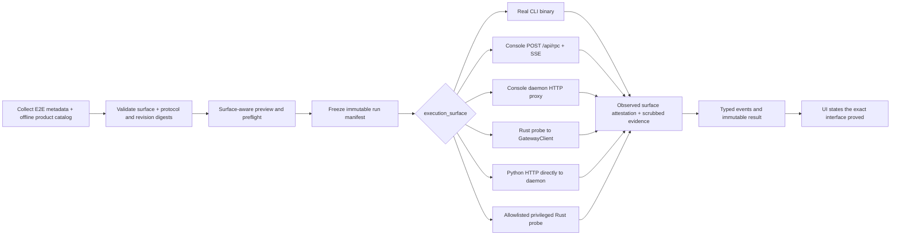

# EphemeralOS Live E2E Control Room — Normative System Specification

| Field                                                         | Value                                                                                |
| ------------------------------------------------------------- | ------------------------------------------------------------------------------------ |
| Status                                                        | Proposed v1 implementation contract; blocking design decisions resolved              |
| Date                                                          | 2026-07-12                                                                           |
| Test repository root (`TEST_REPOSITORY_ROOT`)                 | `/Users/yifanxu/Ephemeral-AI-Lab/ephemeral-sandbox-test`                             |
| E2E source root (`E2E_SOURCE_ROOT`)                           | `<TEST_REPOSITORY_ROOT>/e2e`                                                         |
| Benchmark source/configuration root (`BENCHMARK_SOURCE_ROOT`) | `<TEST_REPOSITORY_ROOT>/benchmark`                                                   |
| Product checkout                                              | `/Users/yifanxu/Ephemeral-AI-Lab/ephemeral-sandbox`                                  |
| Mutable workspace store (`WORKSPACE_STORE_ROOT`)              | `/Users/yifanxu/Ephemeral-AI-Lab/ephemeral-sandbox-test-workspace`                   |
| Durable E2E workspace root (`E2E_WORKSPACE_ROOT`)             | `<WORKSPACE_STORE_ROOT>/e2e`                                                         |
| Durable benchmark workspace root (`BENCHMARK_WORKSPACE_ROOT`) | `<WORKSPACE_STORE_ROOT>/benchmark`                                                   |
| Benchmark implementation                                      | `<PRODUCT_ROOT>/benchmark` unless separately extracted by an explicit product change |
| Product catalog source                                        | `ephemeral-sandbox/crates/sandbox-operations/catalog`                                |
| Product catalog projection                                    | `sandbox_operation_contract::catalog_to_value`                                       |
| Design                                                        | [e2e-test-design.md](e2e-test-design.md)                                             |
| Web UI design                                                 | [e2e-test-ui-design.md](e2e-test-ui-design.md)                                       |
| Delivery plan                                                 | [e2e-test-implementation-plan.md](e2e-test-implementation-plan.md)                   |

The words **MUST**, **MUST NOT**, **SHOULD**, **SHOULD NOT**, and **MAY** are
normative. Examples are illustrative unless they use one of those words.

This document is the product and data contract. If an implementation choice can
change what a user sees, what a run executes, how a verdict is produced, or
whether evidence is trustworthy, that choice MUST conform to this document and
MUST NOT be deferred as an unspecified implementation detail.

## 1. Purpose and success condition

The Live E2E Control Room is a local catalog, execution controller, live result
viewer, historical run browser, and reusable-workspace manager for the
EphemeralOS Docker-backed pytest suite.

Before a run, it MUST let a first-time user answer:

1. Which cases match a domain, family, group, scenario, feature, title,
   description, validation, or stable ID?
2. What does each expanded case claim to prove?
3. Which named validations prove each feature claim?
4. Which exact cases, policies, resources, and workspaces will be used?
5. Is the environment ready, degraded, unsupported, or blocked?

During and after a run, it MUST let the user answer:

1. Which cases are queued, running, passed, failed, skipped, cancelled, errored,
   or not run, and why?
2. What is the first failure, its lifecycle phase and failure kind, and which
   later outcomes are causally downstream of it?
3. When did every test, phase, validation, cleanup action, and telemetry channel
   start and finish, and how long did it take?
4. Which structured evidence supports each validation, which evidence is
   partial or unavailable, and what was truncated or dropped?
5. Which sandbox, session, container, cgroup, workspace, test attempt, and run
   produced the evidence?
6. What resources and evidence the run consumed and retained?

The Control Room is a structured test-contract and evidence system first. Raw
pytest output and logs are bounded diagnostic evidence; they are not a substitute
for named validation state, typed failures, or telemetry availability.

## 2. V1 decisions and explicit boundaries

1. Pytest remains the only test executor. The controller selects and supervises
   collected pytest items; it does not create a second execution engine.
2. V1 has one controller, one append-only event writer, one controller-wide
   active run across the UI and every API client, and one serial test execution
   lane. Admission from any client receives the same typed active-run conflict.
3. `fail_fast_mode` is `off` by default. V1 also supports `run`; no domain,
   family, group, or feature-scoped fail-fast modes exist in v1.
4. The E2E catalog and UI accept arbitrary registered string `domain_id`,
   `family_id`, and `group_id` values. They MUST NOT contain an allowlist or
   switch for the current taxonomy.
5. The Rust product-operation domain enum remains intentionally closed. Adding
   a new product-operation domain legitimately requires changes to its Rust
   contract and exhaustive Rust consumers. That closed Rust boundary MUST NOT
   force a frontend route, card, icon, color, or component change.
6. `compound` is an E2E domain supplied by E2E taxonomy metadata, not a Rust
   product-operation domain. Its complexity values and scenarios are
   registry-driven. `simple`, `medium`, and `complex` are seeded values, not a
   UI or path allowlist.
7. Runtime, Manager, and Observability ownership identifies the primary product
   contract. Using Observability evidence does not reclassify a Runtime or
   Manager case as Observability. An explicit cross-domain assertion belongs to
   Compound only when the scenario intentionally proves a shared-context
   contract across subject domains.
8. Product catalog data and E2E taxonomy metadata are merged through one
   deterministic collection path. There is no duplicate Python family registry
   and no hand-maintained frontend taxonomy.
9. Every product-facing expanded case has a stable structured identity,
   canonical ownership, a meaningful description, at least one direct
   registered feature, and at least one declared named validation.
10. One immutable run manifest, one append-only typed **execution** stream per
    run, one deterministic execution reducer, and atomic projections are
    authoritative for live and historical verdict state. Catalog refresh and
    post-completion retention each have their own single-writer journal so a
    purge never rewrites or appends to a terminal execution stream.
11. A run can be admitted only from a ready preview pinned to a catalog revision,
    preflight snapshot, selection, and policies.
12. Cleanup and teardown remain mandatory after failure, fail-fast, cancellation,
    and controller interruption whenever the process can still perform them.
13. Missing telemetry is never represented as zero. Supporting telemetry changes
    evidence health, not the test verdict, unless an explicit named validation
    declares telemetry as a required input.
14. Production UI state comes from catalog, preview, run, and history APIs.
    Fixture or demo data is always visibly labeled and cannot show a live or safe
    operational claim.
15. The prepared `testbed` workspace is immutable. Each managed attempt uses a
    fresh clone; historical roots are never remounted or modified in place.
16. `ephemeral-sandbox-test` is the version-controlled
    `TEST_REPOSITORY_ROOT`. Its direct `e2e/` child is `E2E_SOURCE_ROOT` and
    owns the controller, Python suites, metadata, schemas, UI, unit tests, and
    source-controlled test support. Its direct `benchmark/` child is
    `BENCHMARK_SOURCE_ROOT` and owns
    benchmark test source/configuration that is safe to externalize. Collection
    MUST be byte-for-byte read-only with respect to both source subtrees.
17. Mutable test data, generated reports, and artifacts live only in the
    separately configured, non-versioned `WORKSPACE_STORE_ROOT`. Its
    independently marker-owned `e2e` and `benchmark` leaves are the only
    workspace ownership roots. The store parent, test repository, source
    subtrees, and product checkout are never purge roots. Legacy mutable data
    MUST be classified and migrated only after stable case identities are
    frozen and before a workspace
    marker is initialized.
18. Every product case declares one immutable `execution_surface`. Product
    operation tests default to `cli`; console, direct HTTP, gateway, and
    privileged daemon tests opt in explicitly. A transport driver such as
    `GatewayClient` is implementation evidence, not an execution surface.
19. E2E source MUST NOT import `sandbox-console` application handlers. Shared
    protocol, discovery, authentication, request construction, correlation,
    framing, and error primitives live below applications in product-owned Rust
    crates. Console routing, SSE/HTTP projection, caching, proxy policy, and
    browser security remain console-owned and are tested across real HTTP
    boundaries.
20. A narrow product-workspace `sandbox-e2e-probe` is the only v1 live gateway
    or direct daemon RPC adapter outside the real CLIs and console. Its direct
    daemon commands are compile-time allowlisted; arbitrary operation names,
    envelopes, endpoints, credentials, or wire bytes are rejected before any
    discovery or connection.

### 2.1 Included in v1

- Versioned product-catalog export, deterministic E2E catalog collection, and
  automatic debounced whole-catalog refresh after source/registry/product-build
  changes.
- Generic browsing and selection for registered domains, families, groups,
  features, Compound complexities/scenarios, and expanded cases.
- Stable feature registry, direct/effective tag provenance, and named validation
  mappings.
- Exact preview, preflight, workspace/telemetry policy confirmation, admission,
  fail-fast, cancellation, and child-run retry.
- Live and historical timing, typed failure, causal event, structured evidence,
  `standard-v1` plus bounded `diagnostic-burst-v1` telemetry, resource-
  consumption summaries, and cleanup views.
- Prepared workspace creation, clone-based use, retention, quarantine, safety
  verification, and lineage.
- Loopback API, append-only replayable events, restart recovery, bounded
  evidence retention, explicit run/workspace purge, and truthful purge history.
- Responsive and keyboard-accessible React/Mantine UI using generic components,
  with complete task flows at 375, 390, 768, 1024, and 1440 CSS pixels and at
  200% browser zoom.
- Boundary-specific runners and evidence for real CLI, console RPC, console
  HTTP proxy, shared gateway RPC, direct daemon HTTP, and privileged direct
  daemon RPC, with surface-aware preflight, timeout/cancellation semantics,
  correlation, structured errors, and sink-level secret scrubbing.
- Rust/Python bidirectional protocol fixtures, protocol/fixture digests frozen
  into collection and run records, and CI gates that reject incompatible
  product, probe, or E2E revisions before a live run.

### 2.2 Excluded from v1

This is the complete v1 exclusion list. Any behavior required elsewhere in this
specification and not listed here remains a v1 release requirement.

- **V1-X1 — Alternate test semantics:** replacing pytest, adding a workflow DSL,
  or automatically turning every raw Python assertion into a named validation.
- **V1-X2 — Distributed scale:** xdist, parallel/distributed/remote execution,
  multiple controllers, multiple active runs, or multiple execution lanes.
  These are scale features, not prerequisites for a complete single-controller
  Control Room.
- **V1-X3 — Scoped fail-fast:** domain-, family-, group-, or feature-scoped
  fail-fast. V1 includes deterministic run-scoped opt-in fail-fast.
- **V1-X4 — General infrastructure frameworks:** a database, external queue,
  authoritative mutable global result store, runtime plugin framework, or
  generic workflow engine. V1 includes exactly one schema-versioned, atomic,
  rebuildable, non-authoritative run-summary lookup projection at
  `runs/run-summaries.json`. It is derived solely from authoritative per-run
  artifacts and their current retention overlays so complete history filtering
  does not require an unbounded directory scan. It is never verdict, recovery,
  retention, artifact-authorization, or run-lifecycle authority.
- **V1-X5 — Incremental catalog merging:** incremental diff/merge publication.
  V1 still detects source, registry, and product-build changes automatically and
  performs a debounced whole-catalog atomic refresh.
- **V1-X6 — Arbitrary browser execution input:** browser-provided commands,
  pytest arguments, environment variables, host paths, or shell input.
- **V1-X7 — In-place workspace reuse:** v1 reuse always clones an eligible
  source into a fresh owned attempt.
- **V1-X8 — Automatic retained-evidence eviction:** v1 includes manifest caps,
  disk admission and emergency reserve, explicit containment-checked purge, and
  truthful purge tombstones; it never deletes retained evidence merely to admit
  a new run.
- **V1-X9 — In-process attempt continuation after interruption:** v1 performs
  deterministic terminal recovery only with the exact admitted controller
  bundle and offers a child-run retry; it does not continue an interrupted
  pytest process or attempt cross-version controller recovery.
- **V1-X10 — Bespoke presentation:** domain/family/Compound-specific pages,
  required domain icon/color systems, per-domain status semantics, flame graphs,
  or channel-specific profiler dashboards. Generic charts, tables, evidence
  panels, and neutral display fallbacks are included.
- **V1-X11 — Behavior-changing validation lifecycle plugins:** adding arbitrary
  named or optional validations and generic bounded evidence with the one v1
  lifecycle is metadata-driven and included. Only a plugin/type that introduces
  genuinely different lifecycle or verdict semantics is deferred and requires
  a deliberate schema-major design change.

The eleven IDs above are exhaustive; thematic paraphrases are non-normative and
MUST NOT be used to infer an additional exclusion. In particular, v1 still
includes catalog freshness, diagnostic evidence, numeric performance/resource
summaries, purge/history integrity, responsive operation, generic telemetry
comprehension, strict metadata migration, and every other positive requirement
in this specification.

## 3. Architecture and authority

### 3.1 Required catalog flow

The only supported production flow is:

```text
Rust product catalog projection + E2E taxonomy/features registries
    -> pytest collection and parameter expansion
    -> validation and deterministic merge
    -> atomic versioned combined catalog
    -> generic API projection
    -> generic UI components
```

No UI component, API route, or reducer MAY infer taxonomy from a source folder,
hard-code current family/domain IDs, or maintain a competing list.

### 3.2 Source ownership

| Concern | Canonical owner |
|---|---|
| Product operation domains, families, operations, labels, and descriptions | Rust product operation catalog |
| Product catalog projection envelope and merged ordering | `crates/sandbox-console/src/catalog.rs::catalogs()` |
| Product catalog inner record serialization | `sandbox_operation_contract::catalog_to_value` |
| E2E-only domains and families, groups, product-family augmentation, Compound complexities/scenarios, owner IDs, and optional display/order metadata | `e2e/metadata/taxonomy.yaml` |
| Feature IDs, labels, descriptions, lifecycle, and replacements | `e2e/metadata/features.yaml` |
| Test title, description, owner reference, taxonomy references, direct features, validation declarations, and policies | Thin pytest annotation |
| Parameter-case identity and case-specific metadata selection | Explicit `e2e_case` record on each `pytest.param` |
| Expanded runnable node and source location | Pytest collection |
| Combined catalog revision | Deterministic catalog collector |
| Executable E2E source identity | Canonical `ExecutionInputManifest@1` produced by collection; Git state is display provenance only |
| Controller/reducer identity and recovery compatibility | `ControllerBundleIdentity@1` computed at startup as the digest of the immutable packaged controller bundle; v1 recovery requires exact digest equality |
| Exact run selection and policies | Immutable preview followed by frozen run manifest |
| Bytes executed by an admitted run | Verified run-owned execution-source snapshot plus frozen runner, product-binary, and image identities |
| Execution and phase outcomes | Pytest reports normalized to typed events |
| Validation history and telemetry lifecycle | Append-only `events.jsonl` and referenced artifacts |
| Current run state | Deterministic reducer projected atomically to `run.json` |
| Per-attempt result | Atomic `result.json` after teardown/finalization |
| Historical display | Frozen run manifest, events, results, and evidence |
| Historical run lookup | Atomic `runs/run-summaries.json`, a disposable projection derived only from authoritative per-run artifacts and current retention overlays |
| Artifact retrieval ownership | Run-local `run.json.artifacts_by_id` folded from accepted `artifact.created` events, plus the current retention overlay |
| Prepared template and workspace lineage | `template.json` and `workspace.json` |

Decorators reference registry IDs; they MUST NOT duplicate family/group/feature
labels or descriptions. The UI MAY use optional display metadata but MUST have a
neutral text fallback derived from the ID.

### 3.3 Offline Rust catalog bridge

The collector MUST obtain product taxonomy from a single offline command,
planned as:

```text
sandbox-console --print-catalog
```

The console merger owns a versioned `ProductCatalogProjection` envelope with
`schema_version`, `catalog_revision`, and `catalogs`. The offline command and
the console product-catalog endpoint MUST emit canonically identical semantic
payloads from `crates/sandbox-console/src/catalog.rs::catalogs()`, whose inner
records use the exact `sandbox_operation_contract::catalog_to_value` serializer.
The command MUST exit before configuration loading, Docker/gateway checks, or
server startup. Collection MUST NOT depend on a running console and MUST NOT
reproduce Rust family arrays in Python.

The combined collector uses the inner `operation_execution_space` as the
authoritative product `domain_id`. It deterministically qualifies each Rust
family as `<domain_id>.<rust-family-id>`; for example `runtime.file` and
`manager.management`. Any existing outer property name is a compatibility alias
only: it cannot override the inner value, and disagreement is a projection
error rather than a silent rename.

### 3.4 Domain openness and the closed Rust boundary

The combined catalog represents domain IDs as validated strings. Current seeded
domains are `runtime`, `manager`, `observability`, and `compound`, but this list
is descriptive, not a schema enum.

- A new E2E-only domain is added in `taxonomy.yaml` plus tests.
- A new family under an existing product domain is added to the Rust product
  catalog plus E2E groups/tests.
- A new product-operation domain requires the intentional Rust enum/catalog/API
  changes, plus E2E taxonomy/tests where relevant.
- In all cases the generic Control Room UI and routes require no source change.

`config` is not implicitly a domain. A configuration case belongs to the domain
whose contract it proves, to Compound if it intentionally proves a cross-domain
shared-context contract, or to Harness if it only verifies readiness.

### 3.5 Source, workspace, and dependency boundary

V1 has three configured roots and four fixed derived roots. No root is derived
from the browser, process working directory, `TMPDIR`, or a home cache:

| Root | V1 role | Mutation rule |
|---|---|---|
| `TEST_REPOSITORY_ROOT` = `ephemeral-sandbox-test` | Git repository containing tracked test source | Contributor writes tracked files; controller collection is byte-for-byte read-only |
| `E2E_SOURCE_ROOT` = `<TEST_REPOSITORY_ROOT>/e2e` | E2E controller, suites, metadata, schemas, UI, and unit tests | Contributor/build writes only; collection and execution source capture are byte-for-byte read-only |
| `BENCHMARK_SOURCE_ROOT` = `<TEST_REPOSITORY_ROOT>/benchmark` | Benchmark-owned test source/configuration | Contributor/build writes only; never an E2E purge target |
| `PRODUCT_ROOT` = `ephemeral-sandbox` | Product binaries, CLIs, console, gateway, daemon, shared Rust crates, benchmark implementation, and probe source | E2E invokes/builds declared targets; it never edits product source |
| `WORKSPACE_STORE_ROOT` = `ephemeral-sandbox-test-workspace` | Non-versioned parent for mutable test systems | Never an ownership or purge root |
| `E2E_WORKSPACE_ROOT` = `<WORKSPACE_STORE_ROOT>/e2e` | Owned testbed/attempt roots, catalogs, reports, runs, evidence, and rebuildable tooling cache | Controller-owned, marker-checked, and purgeable only through the E2E workspace contract |
| `BENCHMARK_WORKSPACE_ROOT` = `<WORKSPACE_STORE_ROOT>/benchmark` | Benchmark fixtures/runs/results/runtime data | Benchmark-owned and never used as E2E source or an E2E purge target |

Only `TEST_REPOSITORY_ROOT`, `PRODUCT_ROOT`, and `WORKSPACE_STORE_ROOT` are
startup configuration. The four source/workspace leaves above are exact
derivations and have no independent path override in v1. The store root has no
ownership marker and cannot be a deletion target. CI MUST pass the three
configured roots explicitly. The
controller records the test-repository revision and E2E input digest, product
revision, product `Cargo.lock` digest, Rust toolchain digest, probe input digest,
and probe binary digest. A product/probe revision mismatch is a blocking
preflight error.

Product-owned crates never depend on the external test repository. E2E source
consumes product behavior only through real binaries/public HTTP
boundaries and the fixed probe process contract. No relative Cargo path
dependency crosses the repository boundary in CI. If a future E2E-only Rust
crate is added under `E2E_SOURCE_ROOT`, it uses an exact product Git/registry revision and a
committed lockfile; a local path override is developer-only and makes the run
non-releaseable unless revision equality is proved.

The existing product `benchmark/backend` Rust package remains under
`PRODUCT_ROOT` in v1 because it inherits the product Cargo workspace's package,
dependency, lint, and lockfile configuration. Moving it to another source
repository is a separate extraction: shared dependencies must first be
published or Git-pinned and that repository must own a lockfile. Mutable
benchmark workspace data nevertheless remains isolated at
`BENCHMARK_WORKSPACE_ROOT`.

### 3.6 Execution-surface and reuse contract

`execution_surface` is exactly:

```text
cli | console_rpc | console_http_proxy | gateway_rpc |
daemon_http | direct_daemon_rpc
```

It identifies the boundary the test proves. `surface_driver` is derived by the
collector/controller and is exactly `cli_subprocess | console_http | rust_probe |
python_http | python_conformance`; it is never user-selectable. The normal live
catalog excludes `python_conformance`, which is reserved for offline protocol
fixture tests.

| Surface | Boundary proved | V1 runner and shared code | Access and defaults | Required evidence and failure contract |
|---|---|---|---|---|
| `cli` | Public user-facing CLI parsing, defaults, output, exit behavior, and its downstream request | Real configured CLI subprocess; the CLI uses product contracts/client code | Default for product operations; CLI-owned auth/config; 180 s overall unless case metadata narrows/extends it | Executable identity/digest, sanitized argv, stdout/stderr, exit/signal, parsed response, request/correlation ID, timing; timeout terminates the process group and remote outcome is `unknown` if dispatch may have occurred |
| `console_rpc` | Public console `POST /api/rpc` and its one-shot/SSE projection | Real console HTTP boundary; console uses `sandbox_operation_client::GatewayClient` and shared Rust protocol code | Explicit console tests only; console health/auth is required; console-configured RPC timeout plus a manifest-frozen client deadline | HTTP status/headers, ordered partial logs, one terminal SSE result/error, request ID, disconnect stage; never auto-replay an operation after dispatch |
| `console_http_proxy` | Public console daemon HTTP proxy, including path/header/body/security policy | Real console `/s/...` or `/api/sandboxes/...` HTTP route | Explicit console-proxy tests only; console and daemon endpoint required; console proxy timeouts | Proxy status/headers, bounded body, endpoint-resolution and proxy stage, correlation; distinct from direct daemon HTTP |
| `gateway_rpc` | Internal product gateway protocol, not CLI or console behavior | `sandbox-e2e-probe gateway-rpc` using contracts, `sandbox-protocol`, and `GatewayClient` | Explicit protocol/adapter tests; shared gateway discovery/auth; 180 s overall | Typed request/result, bounded log frames, protocol version/digest, request ID and stage; no Python live wire client |
| `daemon_http` | Sandbox daemon's HTTP endpoint directly | Independent Python standards HTTP client; only typed endpoint discovery is shared through the probe/shared resolver | Explicit daemon HTTP tests; no console preflight; 10 s request default; retry only declared idempotent readiness probes | Method and scrubbed URL, status/headers, bounded/truncated body, timing, DNS/connect/read stage; operation-bearing requests are never automatically retried |
| `direct_daemon_rpc` | Privileged private daemon RPC needed for lifecycle setup/teardown | Fixed probe subcommands only: `create-workspace-session` and `destroy-workspace-session`, using shared daemon RPC/endpoint/provider primitives | Privileged, non-user-selectable operation; exact allowlist and credentials; 180 s overall | Privilege badge, fixed command identity, endpoint source without secret values, typed result/stage/correlation; non-allowlisted input is rejected before discovery or I/O |

All surfaces execute serially in v1. Tests select a surface in source metadata;
ordinary UI users select cases and policies, never substitute a surface or
driver. The preview and result copy MUST say exactly what was proved, such as
“Real CLI → gateway”, “Console `/api/rpc` → gateway”, “Console HTTP proxy →
daemon HTTP”, “Direct gateway RPC · internal”, “Direct daemon HTTP · console
bypassed”, or “Privileged daemon RPC · allowlisted”. Calling `GatewayClient`
directly never satisfies a
`console_rpc` test, and routing daemon HTTP through console never satisfies a
`daemon_http` test.

The runtime workflow is:



The offline product catalog projection is metadata input only. Using
`sandbox-console --print-catalog` does not assign `console_rpc`, select a runtime
driver, or require a running console. Console downtime blocks only
`console_rpc` and `console_http_proxy` cases.

## 4. Catalog identity, taxonomy, and annotation

### 4.1 Structured stable identity

Every expanded case is identified by the ordered pair:

```text
(test_id, case_id)
```

- `test_id` identifies the semantic test definition and is globally unique.
- `case_id` identifies one expanded parameter case within the test.
- A non-parametrized test uses the explicit `case_id: "default"`.
- Both IDs MUST match `[a-z0-9][a-z0-9._-]*`, MUST NOT contain `/`, and MUST NOT
  be derived from collection position, source path, line, or pytest node ID.
- The pair, not a lossy concatenation, is the key in schemas and APIs.
- UI display MAY use `test_id[case_id]` but MUST preserve both fields separately.

Moving or renaming a source file changes `nodeid` and source metadata but MUST
NOT change `test_id`, `case_id`, feature history, or run comparison identity.

### 4.2 Taxonomy IDs

`domain_id`, `family_id`, `group_id`, `complexity_id`, `scenario_id`,
`feature_id`, `validation_id`, and `owner_id` are opaque stable strings. Consumers
MUST compare exact IDs and MUST NOT parse semantics from dotted segments.

Conventions are:

- qualified product family: `runtime.file`
- qualified group: `runtime.file.read_write_edit`
- semantic test: `runtime.file.read-window`
- parameter case: `offset-limit`
- Compound scenario: `compound.lifecycle-observability`

These conventions improve readability but do not make folder layout or prefix
parsing authoritative.

### 4.3 Taxonomy registry

`e2e/metadata/taxonomy.yaml` MUST contain:

- E2E-only domain records, including `compound`
- E2E-only family records beneath those domains and augmentation records for
  Rust-owned product families
- groups and their `domain_id`/`family_id`
- Compound complexity records and scenarios
- canonical owner records referenced by tests
- optional direct feature IDs on family augmentations, and one or more direct
  active feature IDs on every group and scenario
- optional `label`, `description`, `order`, `icon`, and display token metadata

Runtime, Manager, and Observability domain/family titles and descriptions remain
owned by the Rust product catalog. The taxonomy registry MUST NOT duplicate them.
An unknown product family reference or a group whose parent does not exist fails
collection.

Optional display metadata never controls behavior. Unknown or missing icon/color
metadata uses a neutral fallback and never blocks rendering.

Seeded Compound complexities are registry records:

| `complexity_id` | Meaning |
|---|---|
| `simple` | Happy-path lifecycle across at least two subject domains without concurrency |
| `medium` | Multiple transitions or a negative path, normally spanning all three seeded product domains |
| `complex` | Concurrency, faults, multiple sandboxes, recovery, or soak behavior |

Adding a complexity or scenario requires taxonomy and test metadata only. No
path grammar, API switch, route, component, color, or icon change is permitted.

### 4.4 Required expanded-case contract

The live catalog is a discriminated union keyed by required
`catalog_kind: product | harness`; consumers MUST validate the applicable arm
rather than filling in product fields for a Harness diagnostic.

Every expanded record shares:

- globally stable `test_id` and `case_id`;
- title, meaningful non-empty description, validated `owner_id`, current pytest
  `nodeid`, source-relative path, and line;
- one or more declared named validations with description, lifecycle phase,
  required/optional status, and generic bounded evidence declarations;
- workspace, telemetry, execution-label, resource, and exclusivity policies;
- optional explicit bounded `parameter_summary`; arbitrary pytest parameter
  objects are never introspected or serialized; and
- `metadata_status: ready | legacy | invalid` and `runnable: boolean`.

A `catalog_kind=product` record additionally MUST contain exactly one topology
leaf: `group_id` for an operation-family case or `scenario_id` plus derived
`complexity_id` for Compound. It contains derived domain/family topology, one or
more direct active feature IDs, direct/inherited/effective feature provenance,
complete validation-to-feature mappings, and exactly one immutable
`execution_surface` with derived `surface_driver`,
`surface_privilege=public | internal | privileged`, versioned timeout/retry
policy, and expected surface attestation. Compound records additionally contain
ordered components, component roles, subject domains, shared-context boundary,
and teardown contract.

A `catalog_kind=harness` record is a runner/readiness diagnostic, not a product
topology leaf. It MUST omit domain, family, group, scenario, complexity, product
feature references, and validation-to-product-feature mappings; product
feature references on Harness records are collection errors rather than
non-counting pseudo-coverage. `execution_surface` is optional. When omitted,
`surface_driver`, privilege, boundary attestation, surface-specific preflight,
and surface events are also omitted and the result carries
`product_boundary_claim=not_applicable` with the user-facing statement
“Harness diagnostic — no product boundary claimed.” When a Harness diagnostic
really crosses one of the six registered product boundaries, it may declare
that surface and then obeys the identical driver, preflight, attestation, and
pass-precondition contract as a product case.

Runnable Harness cases use the same generic selection, preview, admission,
execution, event, result, retry, and history paths as product cases and remain
searchable from Runner Health. They never count as product declaration or
execution coverage. Framework unit tests are not included in the live catalog.

`e2e_case.parameter_summary` is optional presentation metadata owned by the
annotation author; the collector MUST NOT call `repr`, `str`, or a serializer on
an arbitrary pytest parameter value. The summary is deterministic JSON composed
only of objects/arrays and scalar string, finite number, boolean, or null values.
It is limited to 16 entries/elements per container, 64 Unicode code points per
key, 256 per
string, four nesting levels, and 4 KiB of canonical UTF-8 JSON per expanded
case. The collector applies the evidence sensitive-key and secret scrubber
before publication, replacing a detected value with an explicit redaction
marker and count. Non-finite, non-JSON, over-depth, or over-limit summaries are
local collection errors. When absent, the UI shows the stable `case_id` and any
declared case label; it never reconstructs values from pytest `nodeid`.

### 4.5 Thin annotation model

The implementation MUST use a thin decorator/marker and a validation recorder,
not a second test framework. A normative shape is:

```python
@e2e_test(
    test_id="runtime.file.read-window",
    owner_id="sandbox-runtime",
    group_id="runtime.file.read_write_edit",
    title="Windowed sessionless read",
    description="Returns only the requested line window and metadata.",
    direct_feature_ids=(
        "runtime.file.read",
        "behavior.windowing",
        "contract.structured-response",
        "quality.teardown",
    ),
    validations=(
        validation(
            validation_id="window-content-matches",
            description="Only the requested lines are returned.",
            feature_ids=("runtime.file.read", "behavior.windowing"),
            phase="verify",
            required=True,
        ),
        validation(
            validation_id="pagination-metadata-matches",
            description="Offset and limit metadata are exact.",
            feature_ids=("runtime.file.read", "contract.structured-response"),
            phase="verify",
            required=True,
        ),
        validation(
            validation_id="teardown-clean",
            description="Sandbox and session cleanup completes.",
            feature_ids=("quality.teardown",),
            phase="teardown",
            required=True,
        ),
    ),
    workspace=workspace_policy(
        mode="fresh-owned-clone",
        source_policy="template-or-eligible-retained",
        result_policy="eligible-if-safe",
    ),
    telemetry=telemetry_policy("standard-v1"),
    execution_surface="cli",
    resource_claims=resource_claims(
        sandboxes=(1, 1), sessions=(0, 1), exclusive_locks=()
    ),
)
@pytest.mark.parametrize(
    "offset,limit",
    [pytest.param(3, 3, id="offset-limit", marks=e2e_case(case_id="offset-limit"))],
)
def test_sessionless_read_window(offset, limit, validations):
    with validations.check("window-content-matches") as check:
        check.equal(actual_lines, expected_lines)
```

`catalog_kind` defaults to `product` in the authoring helper but is explicit in
the expanded record. A product decorator references exactly one topology leaf:
`group_id` for an operation-family case or `scenario_id` for Compound. Domain,
family, and complexity are derived from the validated taxonomy and are not
repeated. A Harness decorator sets `catalog_kind="harness"`, omits the topology
leaf and product features, and declares named diagnostic validations without
product-feature mappings. `e2e_case` is attached exactly once to each
`pytest.param`; its `case_id` MUST equal the explicit pytest `id`.

The decorator declares the complete allowed validation-template universe once.
Runtime code references only a declared `validation_id`; it does not repeat
descriptions or feature mappings. Any runtime validation ID absent from the
frozen contract is a contract error.

`WorkspacePolicy` is a versioned declaration, not an overloaded reuse boolean.
V1 `mode` is exactly `none | fresh-owned-clone | owned-invalid-path-staging`.
For `fresh-owned-clone`, `source_policy` is `template-only |
template-or-eligible-retained` and `result_policy` is `never |
eligible-if-safe`. `none` forbids a workspace bind. `owned-invalid-path-staging`
constructs a missing or invalid path only below controller-owned attempt
staging and always has `result_policy=never`. Other field combinations fail
collection. The preview resolves an allowed source to an exact template or
retained-workspace revision; the attempt manifest records that source and the
new clone. Source selection and whether the resulting workspace may later
become reusable are therefore distinct, inspectable decisions.

### 4.6 Inheritance and parameter-case rules

Inheritance is field-specific and deterministic:

- Domain/family/group/scenario features are inherited and retain source
  provenance.
- Each expanded product case MUST still have a nonempty direct feature list;
  inheritance cannot hide a missing direct declaration. Harness records MUST
  have no direct, inherited, or effective product feature list.
- Base title, description, owner, topology, policies, direct features, and
  validation templates define the case's allowed universe.
- A case record MAY set a title suffix, description addition, complete
  `direct_feature_ids` replacement, complete `validation_ids` subset, and only
  the typed policy overrides explicitly allowed by the base declaration.
- A case record MUST NOT silently add an undeclared validation or mutate a
  validation description, phase, required flag, or feature mapping.
- After product-case expansion, every direct case feature MUST be mapped by at
  least one declared case validation. Every product validation MUST map to one
  or more effective case features. Harness validations instead carry
  `coverage_eligible=false` and no product-feature mapping.
- Parameter order changes MUST NOT change identity. Duplicate or missing case IDs
  fail collection.

Pytest smoke/difficulty markers remain `execution_labels`; they do not define
groups, features, Compound complexity, or stable identity.

### 4.7 Source layout

Metadata is canonical; source layout is a maintainability convention. The target
layout is:

```text
e2e/<domain-slug>/<family-slug>/<group-slug>/test_*.py
e2e/compound/<complexity-slug>/<scenario-slug>/test_*.py
e2e/harness/test_*.py
e2e/core/                    # support code, no collected tests
e2e/unit/                    # framework unit tests, not live catalog
e2e/metadata/{taxonomy.yaml,features.yaml}
e2e/web/                     # production UI
```

A source move MUST preserve structured identity. Path linting MAY report a
convention mismatch, but no historical identity or feature mapping may derive
from a path.

Collection and collection hooks MUST be side-effect free: no report, screenshot,
cache, summary, workspace, or artifact may be written below a suite directory by
`pytest --collect-only`. Generated state belongs to the durable store or an
explicit disposable cache outside source.

## 5. Feature registry and coverage truth

### 5.1 Registry contract

`e2e/metadata/features.yaml` is the sole E2E feature registry. Each record has:

- stable `feature_id`
- label
- meaningful description
- kind: `operation | behavior | quality | contract`
- required `owner_id` and optional owning `domain_id`
- for `kind: operation`, required `operation_ref` containing `domain_id`,
  `family_id`, and `operation_id`, validated against `ProductCatalogProjection`
- lifecycle: `active | deprecated`
- required `replacement_feature_id` when deprecated, unless there is no
  replacement and the deprecation explanation says so

For operation features, product identity and product label/description are
derived from `operation_ref`; the feature description may state the tested claim
but cannot contradict the product projection. Unknown feature references fail
collection. New references to deprecated features fail collection and identify
the replacement. Only an explicitly `metadata_status: legacy`, `runnable: false`
record may retain an unchanged deprecated reference in warn mode; it remains a
warning and does not count as ready coverage. Strict mode rejects every
deprecated reference.

Renaming a label or moving a source folder does not change feature identity or
historical snapshots.

### 5.2 Direct, inherited, and effective tags

Every product expanded case and every Compound scenario MUST have at least one
direct active feature. Groups have direct features. Families MAY expose product
features derived from the Rust operation catalog and MAY receive E2E behavior or
quality features through taxonomy metadata.

The catalog and UI MUST expose, for every effective feature:

- whether it is direct or inherited
- all provenance nodes that contributed it
- which named validations map to it
- whether mappings are required or optional

The UI MUST use distinct text/badges for direct and inherited tags; tooltip-only
or color-only provenance is insufficient.

### 5.3 Search, filters, and feature views

Feature search matches normalized `feature_id`, label, and description. A feature
view lists all matching expanded cases and the exact validations mapped to the
feature. Its filter state is represented in the URL and is shareable.

Selecting a feature for execution MUST pass through the same exact expanded-case
preview as every other selection. A feature filter is not itself a frozen run.

### 5.4 Coverage semantics

The system distinguishes:

- directly tagged cases
- effectively/inherited tagged cases
- declared required and optional validation mappings
- latest execution outcome for those mappings
- metadata gaps and deprecated references
- no mapped validation

Raw case count is displayed only as case count. It MUST NOT be labeled feature
coverage. A feature claim counts as declared coverage only through mapped named
validations; latest-run proof is reported separately from declaration coverage.
Parametrized cases do not inflate a unique-validation metric: views MUST expose
both distinct validation declarations and expanded case outcomes.

## 6. Deterministic combined catalog

### 6.1 Catalog lifecycle

Catalog refresh occurs on controller startup, through an explicit refresh
action, and after controller-detected input changes. The watched fingerprint
covers `e2e/**/*.py`, both metadata registries, collector/schema code, the
resolved `sandbox-console --print-catalog` binary, and the complete local Rust
dependency input closure for `sandbox-console` (workspace/package manifests,
`Cargo.lock`, `build.rs`, and source files) obtained from locked Cargo metadata.
A portable two-second fingerprint poll is the correctness path; native
filesystem notification MAY only accelerate it. Changes are debounced for 500
ms. Concurrent notifications coalesce, and a change observed during refresh
schedules exactly one follow-up refresh. V1 still performs a full atomic
collection—there is no separate incremental merge path.

Collection also emits `ExecutionInputManifest@1`, a canonical sorted manifest
of every local file the runner may import, execute, configure, or read for test
semantics. Its repository-owned input-root policy includes all E2E test,
`conftest`, helper, annotation/reporter/plugin, registry/schema, and pytest
configuration sources plus any explicitly declared repository-local support
package. Each entry is a source-relative path, regular-file type, mode, size,
and SHA-256 content digest. The manifest includes its policy revision and rejects
symlinks, devices, sockets, FIFOs, path escape, duplicate canonical paths, and
undeclared local imports. `e2e_source_revision` is the SHA-256 of these canonical
manifest bytes and contents; the Git commit, branch, and clean/dirty state are
informational provenance only. A dirty uncommitted edit therefore changes the
source revision just as a committed edit does.

When the Rust input fingerprint differs from the build stamp, refresh first
runs the fixed repository-owned command `cargo build --manifest-path
<PRODUCT_ROOT>/Cargo.toml --locked -p sandbox-console --bin sandbox-console`
with `cwd=PRODUCT_ROOT` and
`CARGO_TARGET_DIR=<E2E_WORKSPACE_ROOT>/tooling/sandbox-console/<input-digest>/target`.
No browser field can alter the command, working directory, manifest, or target.
Successful output records its input fingerprint and binary digest before
export. Build/metadata failure is a local catalog diagnostic, leaves the
last-good revision stale, and blocks admission. This closes the gap where a
Rust catalog source changes but a previously built binary does not.

Each refresh MUST:

1. append `catalog.refresh_started` with an attempt ID;
2. run the offline Rust catalog export;
3. read and validate both E2E registries;
4. collect and expand every pytest item without running session-finish artifact
   hooks or other source-tree side effects;
5. aggregate all diagnostics rather than stopping at the first metadata error;
6. validate identity, registry references, inheritance, validation mappings,
   parameter summaries, execution-input completeness, path safety, and
   determinism;
7. produce the full candidate catalog in temporary storage;
8. atomically publish it only if every required validation succeeds; and
9. append `catalog.refresh_succeeded` or `catalog.refresh_failed`.

As soon as an input fingerprint changes, `CatalogHealth.stale=true` and
admission is blocked until a matching refresh succeeds. An invalid candidate
MUST NOT replace the last-good catalog. The controller
serves the last-good revision with a visible stale/invalid banner and blocks new
run admission until the current source can produce a valid catalog. Historical
runs remain available. With no last-good catalog, the UI presents a catalog
error state rather than an empty catalog.

On `catalog.refresh_succeeded`, the controller publishes a new
`catalog_revision` notification. An open Catalog page invalidates its one
catalog query and refetches it; other pages invalidate only catalog-dependent
queries. Therefore a newly saved, valid annotated pytest case appears in the UI
without a controller restart, route edit, card edit, or manual frontend
registration. An invalid new case leaves the last-good catalog visible and
shows the collection diagnostic instead.

The normal network budget is intentionally small: browsing uses one combined
catalog query; starting a run uses one preview request followed by one admission
request; live state uses one SSE connection after the initial snapshot; and
large evidence is fetched only when opened. The collector performs taxonomy,
feature, annotation, and pytest joins once, so the browser never performs
follow-up joins per row or per test.

The combined `catalog_revision` includes `e2e_source_revision`; changing
executable test/support bytes invalidates previews even when collected titles,
IDs, and validations would otherwise be identical. Git provenance never stands
in for this content identity.

### 6.2 Diagnostics

Each diagnostic has:

- stable error code and severity
- source-relative file and line/column when available
- `test_id` and `case_id` when expansion has identified them
- metadata field and invalid value
- conflicting source location for duplicate IDs
- suggested correction or replacement when known

Duplicate case identities, unknown or invalid taxonomy references, unknown
features, invalid deprecated references, missing direct tags, missing required
metadata, unstable parameter IDs, undeclared runtime validations, and unmapped
validations are local collection errors. They are never silently dropped.

Warn mode may catalog explicitly marked legacy cases with structured missing
fields and `runnable=false`. `ready` requires `runnable=true`; an invalid
candidate record is never published as a browseable case and exists only in
diagnostics/health. Malformed annotations and duplicate identities fail in both modes.
Strict mode rejects every product case that is legacy, incomplete, deprecated,
or position-identified.

### 6.3 Versioning and deterministic revision

All persisted and API schemas use a `major.minor` string such as `"1.0"`.

- Additive optional fields increment the minor version.
- Removing, renaming, changing the type of, or changing the meaning of a required
  field increments the major version.
- Consumers accept the supported major, ignore unknown fields, and validate all
  required fields. A newer minor with valid required fields MUST render through
  generic fallbacks.
- An unsupported major produces a typed visible incompatibility error and blocks
  admission; it MUST NOT render an empty catalog.

`catalog_revision` is a content hash over the canonical semantic catalog. Arrays
use deterministic ordering by `(order is absent, order, stable ID)`, so
explicitly ordered records precede unordered records. Titles, labels,
descriptions, display metadata, policies, and every other user-visible or
execution-relevant semantic field **do** affect the canonical bytes and
revision; they never affect array ordering unless an explicit `order` value
changes. Only `generated_at`, refresh-attempt identity, diagnostics, and
host-specific absolute paths are excluded from the revision.

### 6.4 Minimum catalog envelope

```json
{
  "schema_version": "1.0",
  "catalog_revision": "sha256:...",
  "generated_at": "2026-07-12T12:00:00+08:00",
  "metadata_mode": "strict",
  "source_revisions": {
    "product_catalog": "sha256:...",
    "e2e_source": "sha256:...",
    "taxonomy": "sha256:...",
    "features": "sha256:..."
  },
  "source_provenance": {
    "git_commit": "...", "git_dirty": true
  },
  "domains": [],
  "families": [],
  "groups": [],
  "complexities": [],
  "scenarios": [],
  "owners": [],
  "features": [],
  "cases": [],
  "health": {
    "collected_cases": 373,
    "ready_cases": 373,
    "legacy_cases": 0,
    "warning_count": 0
  }
}
```

Catalog arrays are typed by their schemas, not arbitrary objects. Referential
integrity is checked before publication. Empty registered families/groups are
valid and render as `0 cases`; execution is disabled with an explicit empty-state
message. A test reference to an unregistered parent is invalid.

### 6.5 Genericity acceptance matrix

| Extension | Permitted required changes | Forbidden required changes |
|---|---|---|
| Test in existing group | Test code and annotation/case metadata | UI row/count/card, route, switch, icon, color |
| Group in existing family | One taxonomy group record and tests | Frontend navigation or component change |
| Product family in existing domain | Rust catalog family/operations plus taxonomy groups/tests | Frontend or API shape change |
| Feature | One feature record plus test/validation references | Feature page implementation or hard-coded filter |
| Optional validation | Declaration and recorder call | New result state or bespoke UI |
| New validation “type” using the same lifecycle | Named declaration plus generic bounded evidence shape/reference | Type registry, reducer branch, card, or page |
| Truly new validation lifecycle/verdict behavior | Deliberate schema-major and recorder/reducer conformance change | Pretending metadata alone can change verdict semantics |
| Compound scenario or complexity | Taxonomy record and tests | Path enum, route, card, icon, color, or component |
| E2E-only domain | Taxonomy record and tests | UI redesign or route switch |
| Product-operation domain | Intentional Rust contract/catalog/exhaustive-consumer changes plus E2E metadata/tests | UI redesign or route switch |

For Scenario C, a new product family changes the concrete current path pattern
`crates/sandbox-operations/catalog/src/<domain>/<family>.rs`, its parent
`crates/sandbox-operations/catalog/src/<domain>.rs`, applicable route/export
aggregation/tests in that crate, `e2e/metadata/taxonomy.yaml`, optional
`e2e/metadata/features.yaml` only when it introduces new claims, and the four
`e2e/<domain>/<family>/<group>/test_*.py` sources. Frontend components, routes,
styles, icons, ordering arrays, API handlers, and hand-maintained taxonomy
documentation require **no change**; an automated patch-scope fixture enforces
that budget.

## 7. Named validations and verdict semantics

### 7.1 State machines and allowed transitions

Lifecycle phase is independent of outcome and is exactly `setup | execute |
verify | teardown`. The generated state schema and reducer enforce this table:

| Entity | Initial | Allowed transitions | Terminal |
|---|---|---|---|
| Run | `queued` | `queued -> {running, cancelling, error}`; `running -> {cancelling, passed, failed, error, cancelled}`; `cancelling -> {cancelled, failed, error}` | `passed`, `failed`, `error`, `cancelled` |
| Test | `queued` | `queued -> {running, not_run}`; `running -> {passed, failed, skipped, cancelled, error}` | `passed`, `failed`, `skipped`, `cancelled`, `error`, `not_run` |
| Validation or phase | `declared` | `declared -> {running, skipped, not_run}`; `running -> {passed, failed, cancelled, error}` | `passed`, `failed`, `skipped`, `cancelled`, `error`, `not_run` |
| Cleanup | `declared` | `declared -> {running, not_run}`; `running -> {passed, error}` | `passed`, `error`, `not_run` |

Terminal states are immutable. Started work can never become `not_run`.
Mandatory cleanup in `error` or `not_run` prevents a test from passing and
quarantines its workspace.

`skipped`, `cancelled`, `error`, and `not_run` are not aliases:

- `skipped`: an explicit pytest or frozen applicability decision declined work.
- `cancelled`: work started and an authorized cancellation interrupted it.
- `error`: the execution/recording lifecycle cannot support a trustworthy
  normal verdict.
- `not_run`: declared or selected work never started for a causal reason.

Every `not_run` terminal carries one generated `NotRunReason` and
`caused_by_seq`:

```text
fail_fast | user_cancel | controller_restart | prior_phase_terminal |
test_skipped | not_applicable | unsupported_by_policy | run_start_error |
contract_error | storage_exhausted
```

`run_start_error` may refer to the causal run event before any test exists.
Unknown state or reason values under a supported schema major make the
projection incompatible; the reducer never guesses.

Every manifest-declared phase or cleanup action that cannot start receives its
own `phase.not_run` or `cleanup.not_run` event; absence is never inferred from a
later test terminal. A mandatory cleanup action in `not_run` prevents pass and
quarantines the workspace even when its causal predecessor is already known.

### 7.2 Failure records and causal ordering

Statuses stay small; explanation lives in structured `failures[]`. Each failure
contains `failure_id`, `failure_kind`, `reason_code`, phase, summary, bounded
detail, full run/test/case/attempt/validation correlation where applicable,
source location, causal event sequence, observed/completed timestamps, evidence
references, and a deterministic `primary` flag.

`FailureKind` is exactly:

```text
assertion | setup | fixture | infrastructure | timeout | teardown |
cancellation | recorder | contract | telemetry_collector | controller_restart
```

`reason_code` refines a kind without expanding the top-level state vocabulary;
examples include `required_validation_missing`, `undeclared_validation`,
`duplicate_transition`, `cleanup_deadline_exceeded`, and
`telemetry_dependency_unavailable`.

`first_failure_id` is the failure with the lowest causal event sequence.
`primary_failure_id` is the earliest failure in the verdict class that
determines the terminal result, using `error > failed > cancelled`. They may
differ: an assertion can remain first while a later teardown infrastructure
failure becomes primary and makes the test `error`. The UI MUST show both and
preserve every failure.

A supporting-only telemetry collector failure creates channel
`availability=error` and degrades evidence health; it does not create a test
error. `telemetry_collector` affects the verdict only when it invalidates the
execution lifecycle or prevents a required `validation_bound` dependency from
being evaluated.

### 7.3 Validation lifecycle

Every declared validation begins as `declared`. Starting it emits exactly one
`validation.started`; reaching a normal terminal emits exactly one
`validation.finished`. A declared validation that will not start emits the
explicit terminal event `validation.not_run` with state, reason, and cause.

- Started but unfinished work becomes `cancelled` for authorized cancellation
  or `error` for interruption/recorder/controller failure; never `not_run`.
- Teardown validations remain declared/runnable after an earlier phase failure.
  They are terminalized only after teardown/cleanup is attempted or its bounded
  deadline makes further execution impossible.
- A named product assertion in teardown may finish `failed` with
  `failure_kind=assertion`; pytest teardown machinery or mandatory cleanup
  failure is `error` with `failure_kind=teardown` or `infrastructure`.

Terminal validation evidence MAY include bounded expected/actual values, error,
duration, and opaque evidence references. Omission never means pass.

### 7.4 Raw assertions

Raw Python assertions remain valid implementation checks. They do not
automatically create named validations and the UI MUST NOT invent a validation
name for them. A raw assertion failure produces a test `failed` record with
`failure_kind: assertion`; subsequently unreachable declared validations become
causal `not_run` records.

Important user-facing product claims MUST use declared named validations.

V1 deliberately has one named-validation lifecycle and no behavior-bearing
`validation_type` field. Contributors may add arbitrary named validations and
generic labeled evidence shapes without infrastructure or UI changes. A request
for different transition or verdict semantics is not a metadata-only “type”; it
must reopen the schema major and reducer contract so history cannot be
reinterpreted silently.

### 7.5 Deterministic result folding

The reducer folds only after pytest call reporting and mandatory teardown/
cleanup finalization:

1. Any infrastructure, setup, fixture, recorder, controller, timeout, or
   teardown condition that prevents a trustworthy product verdict makes the
   test `error`. Supporting-only telemetry degradation is excluded.
2. Otherwise, any failed named validation or raw product assertion makes the
   test `failed`.
3. An optional validation may be skipped or not applicable without blocking a
   pass, but that decision MUST be an explicit applicability/skip outcome from
   the frozen contract. It cannot silently disappear. If it runs and fails, it
   is still a failed claim and fails the test.
4. A required validation that never ran prevents a pass. If no earlier failure,
   skip, cancellation, or error explains it, emit `failure_kind: contract` and
   make the test `error`.
5. A started test interrupted by authorized cancellation is `cancelled` after
   cleanup, unless cleanup/teardown produces `error`.
6. A test intentionally skipped before product execution is `skipped` and each
   applicable validation is `skipped` or causal `not_run` as declared by policy.
7. A selected test that never started is `not_run` with a reason and causal
   reference.
8. A test is `passed` only when pytest setup/call/teardown succeeds and all
   required applicable validations pass.

Run folding precedence is `error`, then `failed`, then `cancelled`, then
`passed`. A run with no error/failure/cancellation and only passed/skipped tests
is `passed`, while the UI still reports the exact skipped count. Fail-fast
produces a failed run, not a cancelled run.

## 8. Catalog discovery, selection, preview, and admission

### 8.1 Search contract

The controller owns one versioned `CatalogQuery`; the API parser and URL-state
normalizer consume the same schema. It has normalized `q`, `catalog_revision`,
`cursor`, `page_size`, sort, and repeatable facets:

```text
catalog_kind | runnable | domain_id | family_id | group_id | complexity_id |
scenario_id | feature_id | owner_id | validation_id | metadata_status |
execution_surface | execution_label
```

`catalog_kind` is exactly `product | harness`; Compound cases are product proof
and use `product`; `runnable` accepts canonical `true | false`. The Catalog route
defaults to `product`; Runner Health pins `harness`, and its runnable action also
pins `runnable=true`. Both consume the same query, pagination,
selection-expression, preview, and execution APIs rather than client-side
filtering or a Harness endpoint.

Topology and feature facets match only records that own those fields. Because
Harness records are forbidden from referencing product features, every feature
query and feature-coverage projection is product-only without a client-side
exclusion rule. A Harness record with no execution surface remains discoverable
under `catalog_kind=harness` and simply does not match an `execution_surface`
facet.

Result filtering belongs to run history, not the catalog: the catalog does not
pretend that an old or retried result is current test metadata. One generic
catalog search indexes:

- domain, family, group, complexity, scenario, feature, owner, test, case, and
  validation IDs
- their labels, titles, and descriptions
- source path as a secondary diagnostic field

Text search uses Unicode normalization plus case-insensitive matching. Exact ID
matches rank before label/title matches, which rank before description matches.
Free text is ANDed with facets; facets combine as AND across fields and OR within
repeated values of one field. Pagination is cursor-based with deterministic
canonical order, defaults to 50, and is capped at 200 records per response.

Filter and sort state MUST be reflected in canonical URL query parameters. A
shared URL reconstructs the same catalog view against a named catalog revision or
visibly reports that the revision is no longer current. Feature pages are generic
filtered views, not hand-built pages.

### 8.2 Selection contract

Users can select:

- one expanded case
- all cases in a group, family, domain, Compound complexity, or scenario
- all cases matching one or more features
- a mixed set assembled from filtered results with explicit exclusions

The controller owns `SelectionExpression`:

```text
catalog_revision + ordered clauses(case | node | query | feature) +
explicit exclusions(test_id, case_id)
```

The browser stores that expression for its session and the UI maintains one
persistent tray, but it never expands or truncates the authoritative selection.
Preview alone resolves it to exact ordered case pairs. Parent-node selection
therefore remains an expression until preview; changing filters does not erase
explicit clauses. “Clear selection” is distinct from “clear filters.”

### 8.3 Preview contract

Preview states are:

```text
checking | ready | blocked | stale
```

Creating a preview resolves the server-validated selection expression to an
ordered list of exact
`(test_id, case_id)` values and freezes:

- complete selected catalog records and `catalog_revision`, including frozen
  topology, labels/descriptions, direct/effective features and provenance,
  validation mappings, display metadata, schema versions, policies, and
  resource claims
- selection query, inclusions, exclusions, and deterministic ordering
- validation count and per-case purpose
- workspace/template policy and exact prospective clone mode
- telemetry policy and expected/optional/unsupported channels
- resource and exclusivity requirements
- each product case's required `execution_surface`, and each Harness case's
  optional surface; when present, its derived driver and privilege, expected
  boundary attestation, connect/idle/overall deadlines, and no-replay/
  idempotency policy; when absent, explicit
  `product_boundary_claim=not_applicable`
- `e2e_source_revision` and execution-input-manifest digest; product source,
  protocol-contract, fixture, and Cargo.lock/toolchain revisions; verified
  `ControllerBundleIdentity@1`, `RunnerBundleIdentity@1`, CLI/console/probe/
  gateway binary identities, and immutable Docker image IDs/content digests
  where applicable
- only the surface-relevant Docker, gateway, CLI, console, daemon endpoint,
  probe, credential, workspace-store, disk-capacity, catalog-validity, and
  exclusive-lane preflight results
- `fail_fast_mode`
- expected sandbox/container/workspace scope where knowable
- expiry, dependency digest, and opaque preview token

`ControllerBundleIdentity@1` is computed before the controller opens the store
for mutation. It is the digest of one immutable packaged controller bundle,
including executable/runtime identity, locked dependencies, schemas, reducer,
and recovery code. Its `controller_revision` is included in the preview
dependency digest and admitted manifest. V1 recovery is permitted only when the
current digest exactly equals the admitted digest. Cross-version compatibility
matrices, role-by-role digests, and compatibility fixture registries are
deferred until a demonstrated need exists.

`RunnerBundleIdentity@1` is controller-owned and records the Python executable
content digest, interpreter/pytest versions, the canonical file manifest and
digests of the reporter/plugins/configuration loaded by the child, and the
resolved lock/environment identity. A package version string alone is not
identity. Each `ProductBinaryIdentity@1` records logical role, canonical
executable digest, build/input revision where available, and expected path role
without making a browser path authoritative. Each `ImageIdentity@1` records the
logical image role, display tag if any, engine image ID, and immutable content
digest; every sandbox/container creation uses the frozen ID/digest, never a
mutable tag lookup. Preview reports expected and observed identities and blocks
on mismatch or an identity that cannot be verified.

Each preflight item owns a stable `check_id`, `state=checking | ready | warning |
blocked`, and `condition=pending | satisfied | degraded | unsupported |
unavailable | error`. It also records whether the capability is required, a
typed reason code, plain-language message, observed time, evidence reference,
and recovery action. `condition` states what was observed; `state` states its
admission effect. Thus an unsupported capability whose frozen policy is
`block` is `blocked`; optional supporting telemetry and a validation dependency
whose frozen `unsupported_policy=skip` are `warning`. No consumer may infer
policy from `condition` alone.

A preview expires ten minutes after creation. A preflight observation older than
60 seconds is stale at admission. Its immutable dependency digest covers catalog
revision, selection expression, policies, template, durable preflight inputs,
and source/image/runner revisions. Volatile controller-lane ownership is a live
preflight/admission overlay, not a digest input: a busy lane changes the preview
check to `blocked(active_run_conflict)`, and the controller automatically
reevaluates that check to `ready` when the lane becomes free if every immutable
digest input and age bound still pass. A preview becomes `stale` when an
immutable digest input changes or its token expires. The review screen MUST
show every expanded case before admission; a collapsed summary is not sufficient
as the only representation.

### 8.4 Admission contract

Only a `ready` preview token can create a run. Admission rechecks every digest
input and the one-run lane atomically. The first unique pair of
`(Idempotency-Key, request_digest)` reserves the preview token; atomically
renaming the complete staged run directory into its final run directory is the
commit point. Before that rename, the controller copies every
`ExecutionInputManifest@1` entry into `execution-source/` beneath owned staging
without hardlinks, validates allowed object types and the complete canonical
digest, makes the snapshot non-writable, and writes
`execution-input-manifest.json` plus `manifest.json`. Disk preflight includes
the exact snapshot bytes and finalization reserve. A staging failure leaves no
run and consumes neither the token nor idempotency reservation. The
same key and digest returns the recorded run; the same key with a different
digest returns `409 idempotency_mismatch`. After a crash, a committed manifest
without `run.admitted` is recovered by appending that event; it never creates a
second run. A reserved but uncommitted token is safely retriable.

The browser submits stable case identities and the opaque preview token. It never
submits or overrides an execution surface, driver, direct RPC operation,
endpoint, credential, pytest node ID, path, flag, shell text, or environment.

If another run wins the lane between the last preview check and admission,
admission returns typed `409 active_run_conflict` containing the active run ID
and does not mutate either run. This race consumes neither the preview token nor
the idempotency-key reservation. The same preview/admission may be retried after
the lane is free, subject to complete immutable-digest and preflight-age
revalidation. Empty previews are blocked.

The admitted manifest freezes the expected and observed controller,
execution-input, runner, product-binary, probe/offline-binary, and image
identities. Before the single pytest child starts, the controller revalidates
its own bundle, the snapshot, and every external identity. It launches with
`execution-source/` as its only
repository-local import/configuration root, a sanitized `PYTHONPATH`, and the
frozen binaries/image IDs. The live checkout is never an execution root. The
runner validates the source manifest at bootstrap and the controller revalidates
it after child exit. An unexpected snapshot or pinned-identity mutation is a
typed `contract`/`run_start_error` before execution or runner `error` after
start; no later case starts, every unreachable declaration and unstarted case
is materialized causally, cleanup remains mandatory, and the workspace is
quarantined. Editing the live checkout after admission cannot change the bytes
used by the active run.

## 9. Execution, fail-fast, cancellation, and retry

### 9.1 Serial execution

The manifest order is the execution order. The controller invokes only the
catalog-owned pytest node corresponding to the next case and admits no second
test until the current test and its cleanup are terminal. Queue state is derived
from the manifest and reducer; a redundant event for every queued item is not
required.

The one pytest child collects and executes exclusively from the committed
run-owned execution snapshot and frozen controller/runner/product/image
identities. Every result records the actual identities attested at controller
dispatch and runner bootstrap so history can prove they equal the manifest; a
display tag, Git commit, or source path alone is insufficient provenance.

Within a selected product item, or a surface-declaring Harness item, the surface
runner MUST match the immutable catalog and manifest record. Before product I/O
it emits an observed attestation containing the runner kind and secret-free
boundary identity. The reporter rejects a missing/mismatched attestation as
`failure_kind=contract`; it never falls back to another surface. A no-surface
Harness diagnostic emits no surface lifecycle and cannot claim a product
boundary. `cli` invokes the real configured executable,
`console_rpc` and `console_http_proxy` cross the real console HTTP boundary,
`gateway_rpc` and `direct_daemon_rpc` invoke fixed probe subcommands, and
`daemon_http` connects directly with the independent Python HTTP adapter.

Connect, idle, and overall deadlines are distinct where streaming applies. The
default overall deadlines are those in §3.6 and may be overridden only by
validated case metadata within controller bounds. No operation-bearing CLI,
POST, gateway request, or daemon RPC is automatically replayed after dispatch.
On local timeout/cancellation after possible dispatch, the attempt records
`remote_outcome=unknown` unless a correlated terminal server result or proven
server-side cancellation exists. Console SSE reconnect may replay already
persisted log/result events by cursor but MUST NOT submit the operation again or
duplicate log records.

### 9.2 Fail-fast

`fail_fast_mode: off` is the default and is shown in preview. With
`fail_fast_mode: run`, the first failure/error signal that makes the current test
unable to pass MUST:

1. persist `run.fail_fast_triggered` referencing the causal test, validation or
   pytest report event;
2. latch the scheduler so no unstarted test is admitted;
3. allow the current test to reach mandatory teardown and cleanup;
4. continue recording telemetry through cleanup and its final sample;
5. materialize unreachable non-teardown validations as causal `not_run` only
   after teardown finalization;
6. materialize all unstarted tests as `not_run` with
   `reason: fail_fast` and the causal run/test/case/validation/event references;
7. finish the run as `failed` unless an error condition takes precedence.

Fail-fast never sends a kill signal to the current test merely because an
assertion failed. If future versions add concurrency, already-running tests must
finish their current test and cleanup while no new tests start; v1 has only one
running test.

The UI wording MUST be causal, for example: “Stopped by fail-fast after
`test-id[case-id]` › `validation-id` failed.” It MUST show `not run` as a separate
count and state, not as skipped, cancelled, pending, or error.

### 9.3 Cancellation

Cancellation appends `run.cancel_requested`, changes the run to `cancelling`,
stops new test admission, and follows a controller-owned, versioned
`CancellationPolicy` frozen in preview and manifest:

```text
interrupt_grace_ms=10000 | termination_grace_ms=5000 |
cleanup_deadline_ms=30000 |
signal_strategy_id=posix-process-group-v1 | windows-job-object-v1
```

The controller derives—not the browser—the one strategy supported by host
health and freezes it in preview and manifest. `posix-process-group-v1` maps the
three stages to `SIGINT`, `SIGTERM`, and `SIGKILL` for the proven runner process
group. `windows-job-object-v1` maps them to `CTRL_BREAK`, job termination, and
forced job termination. Unsupported strategy is a blocking preflight. The
policy first sends the strategy's graceful interrupt, persists
`run.cancel_escalated` before any terminate/kill escalation, and persists
`cleanup.deadline_exceeded` if mandatory cleanup exceeds its deadline. The
active test attempts cleanup and becomes `cancelled` unless a cleanup/teardown
error takes precedence. Never-started tests become
`not_run(reason=user_cancel)` with causal references.

If bounded cleanup is exhausted, remaining started work becomes `error` with
`reason_code=cleanup_deadline_exceeded`; the
workspace is quarantined. A cancellation arriving after a recorded failure does
not erase that failure. Run folding precedence remains deterministic.

### 9.4 Retry and resume

An attempt is never resumed in place. Retry creates a child run through a new
preview with `parent_run_id` and exactly one `retry_mode`:

```text
failed | not_run | failed_and_not_run
```

V1 schedules each selected case at most once in a run. Manifest commit allocates
exactly one fresh `attempt_id` for every selected case and fixes
`attempt_number=1`, including a case that later becomes `not_run`. Reporter
events may reference only that manifest attempt. A child retry allocates a new
run and a new attempt ID, again numbered 1, and links history through
`parent_run_id` plus stable `(test_id, case_id)`. The `attempt-<n>` storage path
is a forward-compatible schema reservation; `<n>` has only the legal value `1`
in v1 and does not imply hidden in-run retries.

`failed` selects failed/error cases; `not_run` selects never-started cases;
`failed_and_not_run` selects both. Cancelled cases are not silently included and
must be explicitly selected through the normal catalog if desired.

The retry preview shows its exact cases and current policies. It uses the current
valid catalog only when every historical identity still resolves; unresolved or
changed cases are shown and block admission until the user chooses a valid
selection. Historical results remain linked to the parent and are never mutated.

## 10. Typed events, reducer, streaming, and restart

### 10.1 Event envelope

Each event stream is append-only. Run events use the run-local `events.jsonl`;
catalog refresh events use `catalog/events.jsonl`; post-completion retention
events use the run-local `retention-events.jsonl`. The controller is the single
writer for all streams. It validates a reporter message's schema, correlation,
and allowed transition against the current projection before assigning a
sequence. A rejected candidate is never authoritative. Instead the controller
appends a valid `run.interrupted` with `failure_kind=contract|recorder`, the
last-valid sequence, and a bounded diagnostic reference, then follows normal
cleanup and terminalization. A valid candidate receives a gap-free `seq`, is
persisted and flushed as one complete JSON line, then updates projections and
broadcasts. A client MUST never receive an event that has not been persisted.

There is one deliberately narrower intake result. A structurally valid,
correlation-matching `telemetry.batch` for a channel already closed by its
persisted `telemetry.summary` is classified as **late telemetry before journal
candidate validation**. It receives no sequence, is never persisted in the run
journal, and does not interrupt or rewrite the run. The controller records only
a bounded, scrubbed, non-authoritative diagnostic containing channel ID,
producer instance, observed time, and cumulative late-message/byte counts; it
does not retain the late sample payload. A message that is malformed,
mis-correlated, targets an unknown channel, or attempts any other transition is
an invalid authoritative candidate and follows the interruption contract above.

Every event contains:

```json
{
  "schema_version": "1.0",
  "stream_id": "run:run-uuid",
  "seq": 42,
  "at": "2026-07-12T12:03:14.102+08:00",
  "monotonic_ns": 123456789,
  "monotonic_origin_id": "runner-process-id:boot-uuid",
  "producer": "pytest-reporter",
  "producer_instance_id": "runner-process-id",
  "producer_revision": "sha256:runner-bundle-revision",
  "type": "validation.finished",
  "run_id": "run-uuid",
  "test_id": "runtime.file.read-window",
  "case_id": "offset-limit",
  "attempt_id": "attempt-uuid",
  "attempt_number": 1,
  "phase": "verify",
  "validation_id": "window-content-matches",
  "execution_surface": "cli",
  "surface_driver": "cli_subprocess",
  "caused_by_seq": 40,
  "payload": {
    "status": "passed",
    "evidence_ids": ["evidence-uuid"]
  }
}
```

Run events require `run_id`. Catalog events instead require
`catalog_refresh_attempt_id`; fields that do not apply are omitted, not set to
invented empty identities. Recovery-produced events additionally require the
registered `recovery_id`; plan steps and external-action records also require
their deterministic `recovery_step_id`. Those fields are omitted from ordinary
admission execution rather than filled with sentinel values. Wall time is for human correlation. Duration uses the
producer's monotonic clock only when start and finish share
`monotonic_origin_id`; values from different origins are never subtracted.
Interrupted cross-origin duration uses persisted wall-clock bounds and is marked
`timing_quality=interrupted_estimate`, never presented as monotonic precision.
Events scoped to a declared product transport or surface-declaring case also
require `execution_surface`, `surface_driver`, and the manifest-owned surface
contract version. Values are copied from the immutable manifest; a producer
cannot redefine them. A no-surface Harness event omits those fields and carries
the manifest-owned `product_boundary_claim=not_applicable`; omission on a
product case is invalid. Secret-free `request_id`/correlation and
`surface_stage` are present when known.

Every event requires `producer_revision`. Controller-originated events use the
active `ControllerBundleIdentity@1.controller_revision`; reporter or in-child
collector events use the manifest-frozen runner bundle revision; a controller-
hosted collector uses the controller revision. At process handshake, the
controller binds each authenticated `producer_instance_id` to its allowed
revision. A missing, changed, or unmanifested revision is an invalid candidate,
not an informational string. Catalog events use the current controller revision;
run events retain the revision that actually produced each event, so a recovery
event never masquerades as having been written by the admission controller.

### 10.2 Required event registry

V1 event names are:

```text
catalog.refresh_started | catalog.refresh_succeeded | catalog.refresh_failed
run.admitted | run.started | run.fail_fast_triggered | run.cancel_requested |
run.cancel_escalated | run.interrupted | run.finished
recovery.session_registered | recovery.action_started |
recovery.action_finished
test.started | test.finished | test.not_run
surface.started | surface.evidence | surface.finished
phase.started | phase.finished | phase.not_run
validation.started | validation.finished | validation.not_run
cleanup.started | cleanup.finished | cleanup.not_run | cleanup.deadline_exceeded
telemetry.started | telemetry.batch | telemetry.availability_changed |
telemetry.correlation_changed | telemetry.finalization_started |
telemetry.stopped | telemetry.summary
log.chunk | log.truncated
artifact.created | artifact.rejected
retention.purge_started | retention.object_purged | retention.purge_failed |
retention.purge_completed
```

Every start payload names the entity and policy revision. Every terminal payload
contains explicit terminal `status`, `reason_code` where applicable,
`failure_ids`, and evidence IDs. `test.not_run`, `phase.not_run`,
`validation.not_run`, and `cleanup.not_run` require `NotRunReason` plus
`caused_by_seq`; `run.fail_fast_triggered` requires the exact
case/validation/failure cause; cancellation events require policy/deadline and
signal stage; cleanup events require attempted/outstanding resource summaries;
telemetry events require channel, evidence role, correlation generation,
coverage/count/drop data; `telemetry.finalization_started` requires the declared
channel end, expected producer acknowledgements, and absolute monotonic/wall
deadline; log events require byte/record offsets and omission
counts. `artifact.created` requires an opaque `artifact_id`, media type, actual
persisted size and digest, scrub/scan status, and validated relative storage
reference. `artifact.rejected` requires a non-retrievable `candidate_id`,
producer, declared name/media/size when known, scrub/scan outcome, and typed
rejection reason; observed size or digest is present only when safely computed,
no payload is persisted, and no artifact ID or storage reference is issued.
The reducer folds each valid `artifact.created` into the owning run's
`run.json.artifacts_by_id`. Each entry preserves artifact ID, producer and
test/case/attempt/validation correlation, media type, persisted size/digest,
scrub/scan state, and validated run-relative storage reference. This run-local
map survives terminal evidence purge as ownership/tombstone metadata; the
retention overlay, not file absence alone, decides whether retrieval returns
content or typed 410. No rejected candidate enters the map.

`recovery.session_registered` is appended and fsynced before that recovery
session may signal a process, invoke cleanup, or append a lifecycle terminal
event. It contains a unique `recovery_id`, a prior-session reference when one
exists, the complete active `ControllerBundleIdentity@1`, the admitted identity
reference, the admitted/current bundle digests and exact-equality decision, the folded
journal-prefix digest/last sequence, and start time. Every later recovery-
produced event carries that `recovery_id` and a deterministic
`recovery_step_id`. External actions use write-ahead
`recovery.action_started` and terminal `recovery.action_finished` events with
action kind, exact target identity, idempotency/reconciliation policy, attempt,
disposition, and evidence. Session state is derived without a closing side-
channel: a later registration supersedes the previous session, the session
whose prefix contains `run.finished` is complete, and the last registered
nonterminal session is active or manual-intervention according to its folded
action state. The reducer rejects a duplicate logical step, a second
`run.interrupted`, or conflicting target/disposition even when it comes from a
new controller revision.

Retention events live in the run's separate
`retention-events.jsonl`, name the immutable completion projection they overlay,
and require scope, containment-checked relative object, byte count, outcome, and
cause. Each `retention.purge_started` freezes a transaction ID and the complete
producer `ControllerBundleIdentity@1`; later events in that transaction carry
the transaction ID and matching `producer_revision`. `retention.json` retains
the current transaction's complete producer identity and bounded prior
transaction summaries, while the surviving retention journal remains the full
history. Thus every retained producer revision is resolvable after execution-
evidence purge. Retention events never change the execution verdict. The controller contract owns a
JSON Schema for each payload and its allowed predecessor/state transitions.

`surface.started` records the expected boundary and runner before product I/O.
`surface.evidence` carries bounded stdout/stderr, HTTP/SSE, protocol-log, or
endpoint evidence after ingress redaction. `surface.finished` contains the
observed attestation, stage, terminal status, retry/replay decision,
`remote_outcome=known | unknown`, and typed error. Exactly one surface terminal
event is required for every started product case and every surface-declaring
Harness case. A no-surface Harness case MUST emit no surface event; its product-
boundary proof state is `not_applicable`, not `unavailable`. A `console_rpc`
stream may emit
ordered partial logs and then one terminal error; a reconnect deduplicates by
cursor and never re-dispatches the operation.

Any unknown event type under a supported schema major makes the projection
incompatible. Adding an observational event still requires a known registry and
minor-capability update; v1 has no untrusted "optional event" escape hatch.

### 10.3 Deterministic reducer and projections

The reducer is a pure function of manifest plus ordered events. `run.json` and
each `result.json` include `applied_through_seq`. Projection writes use temporary
files plus atomic replace. Replaying the same event prefix MUST produce
byte-equivalent semantic state regardless of SSE delivery grouping.

Every test, phase, validation, cleanup action, and telemetry channel projection
records start time, optional finish time, elapsed duration, current/terminal
state, causal reason, and evidence references. `failures[]` preserves every
failure and separately identifies `first_failure_id` and `primary_failure_id`.
The persisted run projection exposes `recovery_state: none | recovering |
complete | manual_intervention`, orthogonal to verdict, plus ordered
`recovery_sessions[]`. Each session entry contains its `recovery_id`, sequence,
complete controller identity, admitted identity reference, exact-digest
decision, observed prefix digest/sequence, derived status
`superseded | active | manual_intervention | complete`, action dispositions,
first/last event times, and successor reference where applicable. The terminal
projection and `recovery-sessions.json` retain this complete ordered registry
after raw execution evidence is purged. The direct run API adds
a non-authoritative current-controller overlay
`recovery_compatibility: exact_match | mismatch` with complete current/
admission controller identity references and a typed reason/action. `mismatch`
never rewrites the last valid projection and the UI MUST label it “Recovery
blocked — controller bundle changed,” not show the persisted pre-crash
`running` value as current work.
When recovery does append events, terminal run and affected result projections
persist the complete admission/recovery controller identities and compatibility
decision evidence as survivor provenance.

Every per-attempt `result.json` and its run projection record either the
declared `execution_surface`, derived `surface_driver`, privilege, timeout/retry
policy, expected and observed attestations, request/correlation IDs, protocol/
fixture digests, executable/build identity, terminal surface stage, and remote-
outcome certainty, or the no-surface Harness value
`product_boundary_claim=not_applicable`. Redaction counts and evidence
references apply in both arms. These fields survive evidence purge as truth
about what boundary was exercised—or that none was claimed.

### 10.4 SSE snapshot and reconnect

The run snapshot response includes `applied_through_seq=N`. The first native
`EventSource` connection uses `/events?after=N`; on automatic reconnect a valid
`Last-Event-ID` header takes precedence, with `after` as fallback. SSE `id` is
the decimal sequence and `event` is the event type. The server replays persisted
events after that watermark before live delivery. Duplicate sequence numbers are
ignored; a detected gap or incompatible event causes a full snapshot refetch.

Every 5 seconds the server sends a browser-visible SSE transport event with no
`id` field:

```text
event: stream.heartbeat
data: {"at":"2026-07-12T12:03:15.000+08:00","applied_through_seq":42}
```

`stream.heartbeat` is not an `EventEnvelope`, is not in the persisted event
registry, does not increment sequence, and is never reduced into run state. The
native `EventSource` client registers an explicit `stream.heartbeat` listener;
either a persisted event or this named transport event resets its freshness
timer. No such delivery for 15 seconds marks the stream stale and reconnects
with bounded backoff capped at 60 seconds. Connection status remains visible at
every required width and at 200% browser zoom.

### 10.5 Active-run restart recovery

On startup, the controller first acquires the exclusive controller/store-writer
lock and then the single-run recovery lock, before reading a run journal or
appending recovery state. It retains both through all per-run recovery,
retention reconciliation, and the final history-projection commit. It then scans
manifests without a terminal `run.finished` and compares the admitted and
current `ControllerBundleIdentity@1` digests. Any digest mismatch blocks
recovery in v1. The controller keeps both locks,
does not signal a PID, append an event, run cleanup, mutate a projection, or
admit another run, and exposes the typed `recovery_compatibility=mismatch`
overlay with both revisions and recovery action. The old persisted `running`
state is historical last-valid state, not a claim that work is still executing.

For an exact-bundle run, v1 does not pretend to resume the same pytest process or
active attempt. Recovery itself MUST be crash-recoverable. After folding the
valid journal prefix and before any external or lifecycle mutation, the
controller appends and fsyncs `recovery.session_registered` with a fresh
`recovery_id`, the complete current bundle and exact-digest evidence, the
prior recovery ID, and the exact prefix digest/last sequence it observed.
`RunProjection.recovery_sessions[]` preserves those registrations in sequence
order; its derived status is `superseded`, `active`, `manual_intervention`, or
`complete`. The array and full identities survive execution-evidence purge.

The controller constructs a deterministic recovery plan whose
`recovery_step_id` values are derived from run ID, target identity, action kind,
and manifest declaration—not from controller revision or retry count. It folds
all prior sessions and appends only missing valid steps:

1. verify both lock identities and the one active-run invariant;
2. validate runner PID, process-start identity, runner instance ID, and exact
   run ownership. Before each bounded signal step, fsync
   `recovery.action_started`; after observing disposition, append
   `recovery.action_finished`. A later recovery session MUST NOT re-issue a
   signal step whose write-ahead event exists. It instead reconciles the exact
   process identity: an exited process receives a single reconciled finish; a
   still-live or ambiguous process produces `signal_outcome_unknown` and
   `manual_intervention`, with both locks retained and no terminalization;
3. append `run.interrupted` exactly once per run, with
   `failure_kind=controller_restart`, the producing `recovery_id`, complete
   admission/recovery identity references and exact-digest decision,
   and `process_disposition=terminated | already_exited |
   ownership_unproven | signal_outcome_unknown`. A later session reuses this
   event as cause and MUST NOT append another interruption;
4. finish the active validation and phase as `error`, then materialize every
   remaining unreachable manifest-declared validation and lifecycle phase as
   its own causal `validation.not_run` or `phase.not_run`;
5. attempt each reachable run-scoped cleanup without broad Docker cleanup.
   Every cleanup has a deterministic step ID and write-ahead action record.
   After a crash, the next session first tests the exact resource postcondition;
   it records a reconciled success if already satisfied, otherwise it may
   resume only a declared idempotent cleanup against the same validated
   resource identity and logical idempotency key. A non-idempotent or ambiguous
   action becomes `manual_intervention`, never a blind retry. Ordinary
   `cleanup.started`/`cleanup.finished` or causal `cleanup.not_run` events remain
   the user-visible lifecycle record, and no logical cleanup terminal is
   duplicated. Active workspaces are quarantined. A mandatory cleanup `error`
   or `not_run` blocks pass independently of the restart cause;
6. preserve already-terminal telemetry summaries and finalize only nonterminal
   channels from persisted data through ordinary deterministic availability
   rules, adding `reason_code=controller_restart` where interruption affects
   coverage;
7. append `test.finished(status=error)` only after cleanup and telemetry are
   terminal;
8. append `test.not_run(reason=controller_restart)` once for every queued case;
   and
9. append `run.finished(status=error)` exactly once. Terminal `run.json`,
   affected `result.json`, and the survivor `recovery-sessions.json` retain the
   complete admission identity, ordered recovery-session identities and
   exact-digest decisions, prefix/action dispositions, and event producer
   revisions, so purge cannot erase provenance.

If controller B crashes after any recovery event boundary, controller C first
registers a new session, folds B's prefix, and resumes only missing plan steps.
It never edits a projection directly, repeats `run.interrupted`, repeats a
logical terminal event, or blindly repeats an external action. A truncated
uncommitted final line is quarantined under the ordinary journal rule and is
not treated as a completed write-ahead action. If safe reconciliation is
impossible, `recovery_state=manual_intervention`; the controller retains both
locks, admits no run, and exposes the exact blocked step and operator action.
Holding the exclusive store-writer lock prevents an unproven legacy writer from
being accepted as a second authoritative writer.

The user may then create a child retry preview. Completed runs load solely from
frozen files and MUST NOT be rewritten by the current catalog.

## 11. Cross-domain observability evidence

### 11.1 Evidence role versus ownership

Each telemetry/evidence reference has a role:

```text
supporting | validation_bound
```

- `supporting` evidence is diagnostic and does not change the verdict.
- `validation_bound` requires `validation_id` and a manifest-frozen dependency
  contract (channel, minimum availability/coverage, threshold, and
  `unsupported_policy=block | skip`); that validation's ordinary result rules
  determine the verdict.
- A telemetry collector failure is not silently converted into a product
  assertion. If a required validation cannot evaluate because its collector
  failed, the validation/test is `error`, not failed and not passed.
- A valid measurement that violates an explicit product threshold makes the
  named validation `failed`.

For any validation-bound dependency known to be unsupported at preview, `block`
blocks admission. `skip` admits with a named warning and freezes the platform
applicability decision. Before product execution the bound validation becomes
explicit `skipped(reason=unsupported_by_policy)`. If that validation is
required, the case becomes `skipped`, never passed; its other declarations
become causal `not_run` as applicable and mandatory cleanup still runs. If the
validation is optional, only that validation is skipped: product execution
continues and the case may pass when pytest, cleanup, and every required
applicable validation pass. If support was advertised but collection later
becomes unavailable/error/invalid, either policy and either requiredness yields
validation/test `error(telemetry_dependency_unavailable)` because an expected
validation input failed operationally; optional never means ignore an error
after the check became applicable.

Primary test ownership never changes because of supporting evidence. A test of
the telemetry mechanism itself belongs to Observability. A deliberate
cross-domain shared-context assertion belongs to Compound.

### 11.2 `standard-v1` policy

Every product run uses a previewed telemetry policy. `standard-v1` is the v1
default and requires:

- always-collected structured operation logs, correlation identifiers, lifecycle
  timing, and per-channel availability;
- default-on 1 Hz CPU, memory, cgroup, relevant process/container, and disk-I/O
  samples where the platform supports them;
- disk-capacity snapshots at test start, test end, and a relevant capacity
  failure;
- cgroup identity, version, controller availability, limits, and usage;
- sandbox, session, command-session, container, workspace, run, test, case, and
  attempt IDs when those resources exist;
- required count/min/max/p50/p95 performance summaries for every supported
  numeric standard channel, with typed unsupported/not-applicable summaries
  rather than omission; and
- high-rate diagnostics only through the concrete `diagnostic-burst-v1` test
  policy declared before preview.

Sampling begins at `test.started`, attaches newly created resource identities as
they appear, and stops only after teardown/cleanup and a final boundary sample.
Telemetry may stream during execution, but every streamed batch is persisted
first. `standard-v1` freezes `sample_interval_ms=1000`,
`sample_jitter_ms=250`, `maximum_gap_ms=2500`,
`minimum_coverage_ratio=0.90`, and `finalization_grace_ms=5000` in the manifest.

`diagnostic-burst-v1` augments rather than replaces `standard-v1`. From
`test.started` it adds separately summarized 100 ms CPU, memory, cgroup-usage,
relevant process/container, and disk-I/O channels where supported, plus the same
correlated structured operation trace. Each resource joins after registration.
Its burst interval is `min(test duration through cleanup, 120000 ms)`; standard
1 Hz channels continue after the burst. The manifest freezes
`sample_interval_ms=100`, `sample_jitter_ms=25`, `maximum_gap_ms=250`,
`minimum_coverage_ratio=0.90`, `maximum_duration_ms=120000`, at most eight burst
channels, the ordinary 5-second finalization grace, and all standard evidence
caps. A burst channel finalizes against only its declared burst interval and
uses `reason_code=burst_window_complete` when the 120-second boundary, rather
than test end, closed it.

The policy is selected only by typed test/case metadata, never a free-form
browser value. Controller health publishes the provider support matrix; preview
shows supported/unsupported burst channels, estimates their bounded disk cost,
and applies each `validation_bound` dependency's explicit
`unsupported_policy`: `block` blocks, while `skip` warns and freezes the bound
validation's platform-not-applicable skip. Requiredness then determines whether
the whole case skips or an optional validation alone skips under §11.1.
Supporting-only unsupported channels warn and remain typed gaps. The
generic numeric chart/table renders these channels without a profiler-specific
route. On its versioned reference suite the burst policy MUST stay below 10%
median wall-time and CPU overhead relative to `standard-v1`; a failed gate blocks
the Control Room v1 release and cannot be hidden by lowering collection without
a policy revision.

### 11.3 Availability and truthfulness

Telemetry channel availability is exactly:

```text
available | partial | unsupported | unavailable | error | invalid
```

Its collection lifecycle is exactly:

```text
scheduled | collecting | finalizing | finalized
```

At a channel's declared end, the controller persists
`telemetry.finalization_started`, requests stop, and moves the channel to
`finalizing`. Each expected provider takes its final boundary sample, persists
remaining batches, and then acknowledges with `telemetry.stopped`. As soon as
all expected acknowledgements have arrived and persisted intake queues are
drained, the controller emits `telemetry.summary` immediately and the channel is
`finalized`; there is no minimum grace sleep. If that has not happened by the
manifest-frozen `finalization_grace_ms` deadline, the controller closes at the
deadline with truthful `partial`, `unavailable`, or `error` reasons and explicit
missing-ack/drop counts. `telemetry.summary` is the only intake-closing event.

- `unsupported`: platform/provider cannot supply the channel.
- `unavailable`: expected channel has no measurements for a known operational
  reason.
- `partial`: some expected interval/samples are missing or truncated.
- `error`: collector failed.
- `invalid`: internally inconsistent measurements cannot be trusted.

Zero is a real measured numeric value only when accompanied by a valid sample.
Missing, delayed, dropped, unsupported, or inconsistent data MUST render as a
gap/state, never a zero-valued sample.

Each channel summary records intended interval, actual coverage interval, first
and last sample time, expected and persisted sample counts, drop count, maximum
gap, final availability/reason, unit, provider, platform, and cgroup version where
applicable. For a channel scheduled over inclusive monotonic bounds,
`expected_count=max(1, floor(duration_ms/sample_interval_ms)+1)`. Each expected
tick accepts at most one nearest sample within `sample_jitter_ms`; exact duplicate
`(channel_id, source_id, monotonic_origin_id, monotonic_ns)` records are counted
once. Valid delayed/out-of-order records observed before finalization are sorted;
timestamps outside the origin interval or otherwise impossible make the channel
`invalid`.

`available` requires coverage at least `minimum_coverage_ratio`, no gap above
`maximum_gap_ms`, no drop/cap/collector error, and valid units/order. Some valid
data below that contract is `partial`; no data follows the explicit unsupported,
unavailable, or error cause. `finalization_grace_ms` is the maximum deadline
defined above, never a mandatory delay. `telemetry.summary` closes channel intake permanently.
A message observed afterward is rejected/quarantined as a bounded recorder
diagnostic; it never rewrites the frozen summary, evidence health, or verdict.

`EvidenceHealth` is deterministic: `complete` when every manifest-required
supporting channel is available and no evidence truncates; `invalid` when any
such channel is invalid; `unavailable` when none of the required supporting
channels yields usable evidence; otherwise `degraded`. Validation-bound channels
also follow their declared validation dependency independently.

### 11.4 Bounds, overhead, retention, and redaction

`standard-v1` bounds are:

- at most 32 telemetry channels per test;
- at most 16 KiB per sample record and 256 records or 1 MiB per batch, whichever
  comes first;
- at most 10,000 persisted raw samples per channel per test;
- an in-memory queue of at most 1,000 records per collector, with every dropped
  record counted;
- 5 MiB raw log bytes per test, retaining the first and last halves plus omitted
  byte and record counts;
- at most 64 KiB JSON payload per event; larger evidence becomes an artifact;
- at most 25 MiB per artifact, 100 MiB artifacts per test, and 2 GiB retained
  evidence per run;
- at most 1,000 events or 1 MiB pending per SSE client; a slow client is
  disconnected and resumes from persisted sequence rather than losing events;
- all evidence retained with the run in v1; there is no automatic eviction.

The manifest freezes these numeric limits. Hitting a cap changes the relevant
channel to `partial` and emits `log.truncated` or an availability-change event.
Summaries remain available even when raw data is truncated.

The versioned `ResourceConsumptionSummary`, owned by the evidence reducer and
stored at test and run scope, exposes wall duration, CPU time, peak memory,
cgroup limits and peak usage, disk read/write bytes, disk-capacity start/end/
delta, process/container/sandbox counts and lifetimes, workspace bytes, and
retained log/sample/artifact bytes. Every value includes unit, coverage,
availability, and aggregation method. Test peaks use `max`; monotonic counters
use last-minus-first; capacity deltas use end-minus-start; run roll-up sums only
additive quantities and uses `max` for peaks. Unsupported inputs stay typed gaps.

Registered secret values and sensitive-key patterns are redacted before disk,
event persistence, or SSE. For each registered value the scrubber covers exact
UTF-8, JSON-escaped, URL-percent-encoded, POSIX-shell-quoted, standard base64,
and URL-safe base64 forms. Streaming scrubbers retain
`maximum_variant_bytes-1` overlap so chunk boundaries cannot bypass a match. Raw
environment dumps and nested archives are forbidden. Binary artifacts are
accepted only from allowlisted producers and must pass a secret scan; otherwise
`artifact.rejected` records the reason. Redaction summaries report counts/rule
IDs and artifact scan status, never secret values.

On a defined reference suite, `standard-v1` MUST add less than 2% median wall
time and CPU overhead compared with telemetry disabled, using repeated controlled
runs. Failing this gate blocks default-on release; it does not justify silently
dropping data.

### 11.5 Navigation and degraded example

A validation detail links to telemetry with a preselected interval from the
validation's start through finish, including surrounding context. Telemetry
views expose gaps, drops, truncation, and availability in text and do not rely on
color.

If a Runtime case passes its assertions while cgroup memory samples stop halfway
and logs truncate, its truthful presentation is:

```text
Test: passed
Evidence health: degraded
Cgroup memory: partial (last sample, missing interval, counts, reason shown)
Logs: truncated (retained/omitted byte and record counts shown)
```

That test remains Runtime. It changes to failed or error only if an explicit
declared validation consumed the channel under the rules above.

## 12. Compound scenarios

Compound is a first-class E2E domain, not a saved filter over unrelated tests. A
Compound case runs one intentional shared context and scenario-level validations.

Each scenario record MUST declare:

- stable `scenario_id`, title, description, owner, and `complexity_id`
- at least two distinct subject domains
- ordered components with role `subject | fixture | evidence`
- shared sandbox/workspace boundary
- explicit teardown contract
- direct feature IDs
- one or more cross-domain named validation templates

Fixture and evidence components do not inflate subject ownership. Runtime or
Observability calls used only for setup/evidence do not automatically make a
Manager test Compound.

The initial medium scenario is:

```text
manager.create -> runtime.exec/write/read ->
observability.scoped-snapshot -> manager.destroy
```

It proves creation, runtime visibility, observability correlation, and clean
teardown against one shared sandbox and one run-scoped workspace. This seed does
not create special UI behavior.

## 13. Durable workspace contract

### 13.1 Root and ownership

The local v1 `E2E_WORKSPACE_ROOT` is the fixed marker-owned leaf:

```text
/Users/yifanxu/Ephemeral-AI-Lab/ephemeral-sandbox-test-workspace/e2e
```

It is derived exactly from `WORKSPACE_STORE_ROOT` and cannot be redirected by
`E2E_SOURCE_ROOT`, the current directory, `TMPDIR`, an environment alias, or a
browser value. The other fixed
children are `E2E_SOURCE_ROOT=<TEST_REPOSITORY_ROOT>/e2e`,
`BENCHMARK_SOURCE_ROOT=<TEST_REPOSITORY_ROOT>/benchmark`, and
`BENCHMARK_WORKSPACE_ROOT=<WORKSPACE_STORE_ROOT>/benchmark`.
Compatibility aliases MAY be inspected only to produce a migration diagnostic;
they never become runtime configuration.

`TEST_REPOSITORY_ROOT` MUST be the Git worktree root. `WORKSPACE_STORE_ROOT` is
external to both Git repositories, has no ownership marker, and is never a
purge target. Each derived leaf has an independent marker and lifecycle. Source
identity is computed from declared execution inputs, never by recursively
hashing a repository or workspace parent.

Before creating a directory or ownership marker, the controller MUST resolve
all existing ancestors without following a final symlink and compare canonical
paths plus available device/inode identities. `PRODUCT_ROOT`,
`TEST_REPOSITORY_ROOT`, and `WORKSPACE_STORE_ROOT` MUST be pairwise disjoint
with no equality, aliasing, or containment. The four derived children MUST
resolve to their exact canonical locations. The validator rejects aliases between source and workspace
leaves, symlinks in a managed path, either Git metadata tree, `/`, the user's
home, either repository itself, or the unowned workspace store as a workspace
leaf. A missing leaf is validated through its nearest existing
ancestor and revalidated after race-safe creation.

An initialized workspace root contains immutable `root.json` with schema
version, kind, workspace-store UUID, repository identity, expected relative
path, and creation time. Before writing, cloning, purging, or deleting, the
controller MUST verify that:

- all three configured roots are absolute and match the canonical startup record,
  and all four derived children match their exact relative locations;
- it is not `/`, the user's home, either source subtree, either Git metadata
  tree, the product checkout, the sibling benchmark workspace root, the test
  repository, or the unowned workspace store;
- no path segment from the nearest validated existing ancestor to the workspace
  leaf is a symlink;
- the ownership marker has the expected kind and store identity; and
- the target resolves beneath the owned root without following an escaping
  symlink.

### 13.2 Prepared testbed workspace

The prepared testbed lives at this fixed path beneath
`<E2E_WORKSPACE_ROOT>`:

```text
testbed/{template.json,root/}
```

`template.json` records schema version, template ID/revision, creation and
verification time, source lineage, digest, size, and validation status. The
template is Ready only after ownership, path-safety, manifest, and digest checks.
It is never passed directly to `--workspace-bind-root`.

The template and every retained clone store a canonical tree manifest sorted by
relative byte path. Its SHA-256 digest covers relative path, object type, mode,
size, and file-content SHA-256. Only regular files and directories are reusable;
symlinks, hardlinks to another tree object, sockets, devices, FIFOs, and
security-relevant extended attributes reject reuse. Sparse files are hashed as
their logical byte content. All traversal, copy, verification, and purge work is
descriptor-relative with no-follow/open-beneath semantics (or an equivalently
race-safe platform primitive), so a symlink swap cannot escape the owned root.

### 13.3 Per-attempt clone and retention

Each managed case attempt with an existing bind root receives:

```text
attempts/<run-id>/<test-key>/<case-key>/attempt-<n>/root/
```

`<test-key>` and `<case-key>` are containment-safe storage keys mapped beside
the separate semantic `test_id` and `case_id` in the run manifest. They are not
UI identity and MUST NOT be derived by concatenating or path-escaping IDs.

Clone allocation begins after `test.started` as the test's explicit `setup`
phase and completes before sandbox creation. `phase.started/finished` payloads
report clone source, bytes/files copied, duration, and structured failure; the
UI therefore never leaves a large clone looking merely queued. The exact
resolved path passed to the product is recorded. A case testing an invalid or nonexistent bind path
creates that condition below owned attempt staging, records the exceptional
mode, and is never reusable.

The attempt root is retained in place beneath `<E2E_WORKSPACE_ROOT>`; there is no
duplicate `retained/` tree or mutable global result index. The corresponding
run stores an immutable workspace-lineage record and later purge tombstone, not
a second copy of the filesystem. Failed, cancelled, interrupted,
degraded-cleanup, and unsafe roots remain Evidence only.

### 13.4 Reuse eligibility and states

Reuse requires all of:

- explicit test policy allowing clone reuse
- passed test result
- clean sandbox/session teardown and cleanup validations
- finalized workspace state
- matching digest
- safety scan with no blocked object
- supported owned workspace mode

Reuse copies without following symlinks into a fresh staging destination under
`<E2E_WORKSPACE_ROOT>/tmp/<run-id>/` and atomically publishes it into the new
attempt's `root/` on the same filesystem. The source is never mounted or
modified again.

Workspace states are:

```text
active | finalized | quarantined | purged
```

An active workspace found after process death becomes quarantined. Purge removes
only the validated owned `root/` and preserves `workspace.json` as a lineage
tombstone. Broad cleanup is forbidden; cleanup is scoped by run and resource
identifiers.

All managed workspace staging, temporary config, archives, compiler output, and
adversarial scratch fixtures live beneath
`<E2E_WORKSPACE_ROOT>/tmp/<run-id>/`; managed tests MUST NOT place them in an
implicit pytest temp root, `/tmp`, the caller's working directory, or a home
cache. An explicitly named offline unit test may use the test runner's isolated
temporary directory only when it never becomes a bind root or retained E2E
evidence. There is no independent workspace-path override in UI-controlled or
strict runs.

`workspace.json` includes structured run/test/case/attempt IDs, state, relative
root, exact resolved bind path, template/source lineage, image/source revision,
created/finalized times, test/cleanup results, digest/size, reuse policy,
eligibility/blockers, safety scan, immutable `retention_state_at_completion`,
and the current purge tombstone. Purge appends the availability change only to
`retention-events.jsonl`; historical UI says, for example, “Retained at
completion; purged at <time>,” without changing the old verdict or completion
snapshot.

## 14. Storage, API, and security

### 14.1 Disk admission and retention

Preview computes `required_bytes` from each selected case's manifest-frozen
evidence cap plus its measured/template workspace estimate and the exact
execution-source snapshot size. Admission records
`available_bytes`, `required_bytes`, `safety_margin_bytes=max(1 GiB,
10% of required_bytes)`, and a separately preallocated
`emergency_finalization_reserve_bytes=64 MiB`. Admission requires the explicit
inequality `available_bytes >= required_bytes + safety_margin_bytes +
emergency_finalization_reserve_bytes`. Evidence remains until an explicit
containment-checked terminal-run purge. V1 never auto-evicts history.

If free space reaches the emergency reserve during a run, the scheduler admits
no further test, allows the active case to reach bounded cleanup/finalization,
uses the reserve only for terminal state/evidence, marks queued cases
`not_run(reason=storage_exhausted)`, and ends the run `error`. Purge preserves a
run/workspace tombstone and is forbidden for an active or recovering run.

Run purge is a fixed `retained_evidence` scope, not an arbitrary path request.
Its complete removable set is the containment-checked raw execution
`events.jsonl`, bounded log/telemetry/artifact payloads, workspace `root/`
directories, `execution-source/` bytes, and the terminal run's restart-only
`controller.json`. It journals
`retention.purge_started`, journals every planned object, deletes only that
fixed set, journals each object outcome, then commits
`retention.purge_completed`; a partial failure records
`retention.purge_failed` and remains safely retryable. The complete survivor set
is immutable `manifest.json`, `execution-input-manifest.json`, terminal
`run.json`, per-case `result.json`, every
`workspace.json` lineage tombstone, `retention.json`, and
`retention-events.jsonl`, plus `recovery-sessions.json` when any recovery was
registered. Retained projections may
keep opaque evidence IDs, but evidence APIs return typed `410 evidence_purged`.
History remains searchable and displays the frozen verdict, validation state,
resource-consumption summary, `retention_state_at_completion`, purge actor/time/
bytes, and unavailable-evidence explanation. Purge never recomputes a verdict.

### 14.2 Durable layout

```text
ephemeral-sandbox-test/                  # TEST_REPOSITORY_ROOT; Git repository
├── .git/
├── e2e/                                 # E2E_SOURCE_ROOT; tracked implementation
└── benchmark/                           # BENCHMARK_SOURCE_ROOT; tracked source/config

ephemeral-sandbox-test-workspace/        # WORKSPACE_STORE_ROOT; never own/purge as a whole
├── benchmark/                           # BENCHMARK_WORKSPACE_ROOT; independently marker-owned
│   └── root.json
└── e2e/                                 # E2E_WORKSPACE_ROOT; marker-owned
        ├── root.json
        ├── TEST-REPORT.md               # append-only live-test report
        ├── testbed/
        │   ├── template.json
        │   └── root/
        ├── attempts/
        │   └── <run-id>/<test-key>/<case-key>/attempt-<n>/
        │       ├── workspace.json
        │       └── root/
        ├── quarantine/                  # recovered/unassigned unsafe roots only
        ├── tmp/                         # same-filesystem staging, scoped by run
        ├── runs/
        │   ├── run-summaries.json       # disposable lookup projection
        │   └── <run-id>/
        │       ├── manifest.json
        │       ├── execution-input-manifest.json
        │       ├── execution-source/
        │       ├── run.json
        │       ├── events.jsonl
        │       ├── retention.json
        │       ├── retention-events.jsonl
        │       ├── controller.json
        │       ├── recovery-sessions.json
        │       ├── tests/
        │       │   └── <test-key>/<case-key>/attempt-<n>/result.json
        │       ├── telemetry/
        │       │   └── <test-key>/<case-key>/attempt-<n>/
        │       ├── workspace-lineage/
        │       │   └── <test-key>/<case-key>/attempt-<n>/workspace.json
        │       └── artifacts/
        ├── catalog/
        │   ├── current.json
        │   ├── health.json
        │   ├── diagnostics.json
        │   └── events.jsonl
        └── tooling/
            ├── sandbox-console/<input-digest>/
            │   ├── build-stamp.json
            │   └── target/
            └── sandbox-e2e-probe/<input-digest>/
                ├── build-stamp.json
                └── target/
```

`catalog/health.json` holds refresh/admission state;
`catalog/diagnostics.json` holds the latest bounded structured diagnostics; and
`current.json` is always the last-good atomic publication. Directories are
created lazily. While a run is active, `controller.json` records restart-critical
process-start identity, controller/runner instance IDs, heartbeat, and the
scoped resource registry. It never stores the loopback bearer nonce, its value,
or a reversible derivative; that nonce exists only in controller/page memory.
`recovery-sessions.json` is an atomic survivor projection of the ordered,
event-authoritative recovery-session registrations. It is never a second event
or verdict authority.
`manifest.json` contains frozen selected catalog records, the execution-input
manifest/source digest, admission `ControllerBundleIdentity@1`, and every
expected/observed runner, binary, and image identity rather than a redundant
second `catalog.json`.
`retention.json` is a mutable atomic overlay derived solely from the separate
retention journal; it cannot change the immutable completion projection or
verdict. After a completed purge, every member of the fixed removable set—and no
survivor—must be absent exactly as the retention journal records.

`runs/run-summaries.json` is the controller-owned lookup projection for
`GET /api/v1/runs`. Its versioned envelope contains `schema_version`,
`generation`, `generated_at`, `source_run_count`, and ordered `runs`. Each
`RunSummary` contains only query and row-display data: `run_id`, creation/start/
completion timestamps, terminal status and result, `parent_run_id`,
catalog/source revisions, domain and feature ID sets, case-status counts, first-
failure reference, evidence health, immutable completion-retention state,
current retention state/purge summary, and the source manifest/run/retention
projection digests used to derive it. The controller derives every
row from that run's `manifest.json`, atomic `run.json`, and current
`retention.json`; it MUST NOT infer missing data, replay a competing verdict, or
use this file to recover a run or authorize evidence.

Only a run with a committed terminal `run.json` is indexable; an active or
recovering run remains available through its direct run resource and is never
misrepresented as historical merely because its manifest exists.
`source_run_count`, `indexed_run_count`, and `discovered_run_count` count only
such terminal runs; all three are equal when health is `ready`.

The controller builds a complete candidate under the exclusive store-writer
lock, validates every row, writes and syncs a sibling temporary file, and
atomically replaces `run-summaries.json`. A committed terminal or recovery
projection, or a committed retention-overlay change, invalidates the
affected summary and schedules a coalesced rebuild. Missing, corrupt, stale, or
unsupported projection data is never interpreted as empty history. The file may
be deleted and reconstructed without loss from the authoritative per-run
artifacts and current retention overlays.

`tooling/sandbox-console` is an owned rebuildable cache, not run evidence. Its
stamp records locked dependency-input digest, command/policy revision, binary
path/digest, build start/end, and bounded diagnostic reference. A versioned
controller policy gives it a 5 GiB cache ceiling; before a required build the controller may
containment-check and clean only this target, then rebuild. Tooling cleanup never
deletes catalog history or run evidence and a failed rebuild leaves the
last-good catalog stale.

Stored paths are relative to the owned run root except the explicitly displayed
configured store and resolved bind paths. APIs expose opaque artifact IDs or
validated relative paths, never arbitrary host paths.

### 14.3 Minimum API surface

The local API provides typed versioned responses for:

```text
GET  /api/v1/health
GET  /api/v1/catalog/health
POST /api/v1/catalog/refresh
GET  /api/v1/catalog
GET  /api/v1/catalog/cases/:test_id/:case_id
GET  /api/v1/features/:feature_id
POST /api/v1/run-previews
GET  /api/v1/run-previews/:preview_id
POST /api/v1/runs
GET  /api/v1/runs
GET  /api/v1/runs/:run_id
GET  /api/v1/runs/:run_id/events
POST /api/v1/runs/:run_id/cancel
POST /api/v1/runs/:run_id/purge
GET  /api/v1/runs/:run_id/tests/:test_id/cases/:case_id
GET  /api/v1/runs/:run_id/tests/:test_id/cases/:case_id/telemetry
GET  /api/v1/runs/:run_id/artifacts/:artifact_id
GET  /api/v1/workspaces
POST /api/v1/workspaces/initialize
POST /api/v1/templates/testbed/prepare
POST /api/v1/workspaces/:workspace_id/verify
POST /api/v1/workspaces/:workspace_id/purge
```

Retry uses ordinary `POST /api/v1/run-previews` with `parent_run_id` and one
`retry_mode`; there is no divergent retry endpoint. Bodies and manifests always
represent a case as separate `test_id` and `case_id` fields.

Generic catalog filtering uses the shared `CatalogQuery`; there are no
per-domain or per-family endpoints. Run history uses a cursor, maximum page size
200, and deterministic `(created_at descending, run_id ascending)` ordering.
Its typed query owns `result`, `parent_run_id`, `catalog_revision`,
`source_revision`, repeatable `domain_id`, repeatable `feature_id`,
`evidence_health`, and `current_retention_state`. Different fields combine with
AND; repeated domain or feature values combine with OR within that field. The
same normalized names and values appear in shareable Runs-page URLs and the
server response echoes the normalized query.

`GET /api/v1/runs` reads only the validated history projection during normal
queries; it does not scan `runs/` per request. Both this response and
`GET /api/v1/health` expose `history_projection` whose `state` is one of
`ready | rebuilding | stale | error`, plus `serving_last_good`, `generation`,
`generated_at`, `last_success_at`, `indexed_run_count`, `discovered_run_count`,
and a typed
optional `reason`. Startup validates projection schema and recorded source digests
after run recovery. If rebuilding can safely serve a compatible last-good file,
the list returns it with `state=rebuilding` or `stale` and a visible freshness
warning. With no compatible last-good file it returns typed, retryable
`503 history_rebuilding` (or non-retryable `history_incompatible` for an
authoritative input schema mismatch), never a successful empty page. A failed
rebuild preserves a compatible last-good file as visibly stale; otherwise health
is `error` and history is unavailable. Projection state cannot block direct
lookup of a known run through `GET /api/v1/runs/:run_id`.

Artifact retrieval is deliberately run-scoped. The controller resolves
`artifact_id` only within the named run's `run.json.artifacts_by_id`, verifies
the stored relative reference beneath that run with the descriptor-relative
containment contract, and consults the run's current retention overlay before
opening it. An artifact ID from another run, an unknown ownership record, or a
syntactically invalid/traversal-shaped identifier returns typed
`404 artifact_not_found` without revealing whether the ID exists elsewhere. A
correctly owned artifact removed by committed purge
returns typed `410 evidence_purged`. A mapped, unpurged entry whose stored
reference is invalid, escapes containment, is missing, or fails its persisted
size/digest returns typed `500 artifact_corrupt`, marks store/evidence health
degraded, and returns no payload; corruption is never mislabeled as unknown or
purged. There is no global artifact lookup index or fallback search across run
directories.
Telemetry/event sample pages are capped at 1,000 records. Typed error responses
include code, message, retryability, and relevant IDs. Loading, empty, stale,
blocked, incompatible, and server-error states remain distinguishable.

### 14.4 Controller security

1. The controller binds only to loopback. Every request, including reads,
   validates an exact configured Host/authority allowlist; cross-origin CORS
   headers are omitted and foreign preflights are rejected.
2. Mutating requests additionally validate exact same Origin and a per-process
   nonce. The nonce is injected only into the loopback app bootstrap document,
   rotates on every controller process start, and is held in page memory rather
   than URL, cookie, or persistent browser storage. A stale tab receives typed
   `409 nonce_expired` with `retryable=false` and a safe reload action; the
   rejected request performs no mutation. Bootstrap responses use `no-store`
   and the same Host validation.
3. Run selection resolves exclusively to catalog-owned identities and node IDs.
4. The browser cannot submit arbitrary pytest arguments, environment, paths, or
   shell text.
5. Artifact/workspace reads remain beneath validated owned roots. Artifacts are
   served as attachment with `X-Content-Type-Options: nosniff`, `Cache-Control:
   no-store`, and sandbox CSP, or from an unprivileged separate origin. Active
   HTML/SVG/script media types are never rendered inline on the API origin.
6. Test IDs, case IDs, artifact names, and stored relative paths are validated
   against traversal and separator injection.
7. Secrets, tokens, raw environment dumps, and unredacted credentials MUST NOT
   enter catalogs, events, results, artifacts, logs, or browser responses.
8. One-active-run conflicts and stale preview failures do not mutate state.
9. Malicious web origins and DNS-rebinding-style Host headers are in threat
   scope. A malicious process already running as the same OS user, which can
   directly read the owned store, is explicitly outside the v1 web threat model.

## 15. Generic UI and execution workflow

### 15.1 Information architecture

The production UI uses generic routes and components:

- Catalog/search with taxonomy facets and persistent selection tray
- Generic node/case detail rendered by schema data
- Feature-filtered catalog view
- Run preview/review
- Live/historical run view using the same result components
- Runner Health and workspace management

There are no bespoke Runtime, Manager, Observability, Compound, family, or group
pages. A domain/family URL is a generic catalog filter. The UI MUST render an
unknown supported-schema domain/family with neutral text/icon/color fallback.

### 15.2 Case comprehension and selection

Before selection, each case detail shows title, description, owner, taxonomy,
direct/effective features with provenance, named validations with phase/required
status/mappings, parameter identity, workspace policy, telemetry policy, and
execution labels.

The user can select a case or any supported aggregate without knowing pytest
paths or CLI arguments. Selection checkboxes have clear parent/partial states.
Mixed selection, explicit exclusions, filter changes, and “select all matching”
must have distinct and predictable behavior.

“Review run” is the only enabled execution action before a preview is ready.
“Start run” appears in the review step and is disabled with a textual reason when
the preview is checking, blocked, or stale. Ambiguous buttons such as an
unqualified “Run all” are forbidden.

### 15.3 Live and historical truth

The run header shows textual state, connection freshness, elapsed/completion
time, catalog/source revision, fail-fast mode, workspace policy, telemetry
health, and counts for every test state. Counts identify their unit; tests and
validations are never added into one total.

Catalog rows, test detail, preview, live case detail, history, and stored result
views show the immutable surface proof label. `direct_daemon_rpc` is always
marked “Privileged direct daemon RPC”; `daemon_http` and
`console_http_proxy` never share a label. Detail shows the observed attestation,
driver, protocol/binary identity, terminal transport stage, and remote-outcome
certainty without exposing credentials or secret-bearing URLs.

The run body provides:

- ordered test list with queued/running/terminal state
- first-failure banner linked to the exact test, phase, validation, event, and
  evidence interval
- per-test phases, named validations, start/finish/duration, typed failures, and
  critical evidence
- event/trace timeline with causal links
- cleanup and workspace outcome
- supporting telemetry availability, summaries, gaps, drops, and truncation
- explicit reasons for skipped, cancelled, error, and not-run outcomes

Raw logs are a subordinate evidence tab and never the only failure explanation.
Already declared validations show `declared`, not a fabricated latest pass. A
test detail may show latest result only when the result is visibly identified by
run and time.

The same frozen run components render history after completion or restart.
Historical deep links include run, test, case, validation, and evidence interval
where applicable. Current catalog labels never overwrite historical labels.

### 15.4 Loading, error, and fixture states

Every asynchronous surface defines loading, empty, filtered-empty, stale,
blocked, incompatible-schema, permission/safety rejection, disconnected,
reconnecting, and server-error feedback with a safe retry action where
appropriate. Disabled controls state why.

Fixture/prototype mode has a persistent “Demo data — not connected to a runner”
banner. It MUST NOT display “live,” “safe,” “ready,” or a current connection state
without an equally prominent fixture qualifier. Enabled demo controls must work;
nonfunctional controls are disabled and labeled.

### 15.5 Accessibility and responsive contracts

Status MUST use text plus shape/icon; color alone is insufficient. All actions,
filters, disclosures, validation rows, and selection controls are keyboard
operable with visible focus and meaningful accessible names. Native buttons,
inputs, lists, tables, and disclosure elements are preferred over custom ARIA
widgets. V1 uses native list/disclosure/tab elements where they satisfy the
interaction; any custom tree or tab introduced in v1 MUST implement its complete
keyboard pattern.

Interactive targets are at least 44 by 44 CSS pixels. Body text remains legible
and workflows remain operable at 200% browser zoom. Critical state—run status,
fail-fast/cancellation state, connection freshness, first failure, and start/
cancel actions—MUST NOT be hidden at any required width or at 200% zoom.

Required behavior by viewport:

| Width | Contract |
|---:|---|
| 1440 | Full catalog/run split views may appear; no page-level overflow |
| 1024 | Compact navigation and two-pane views may remain, but connection/run state stays visible |
| 768 | Inspector stacks or becomes a drawer; selection remains reachable; no crowded horizontal primary navigation |
| 390 | Single-column task flow; filters, selection, and exact preview use full-screen surfaces; all metadata/counts/actions fit |
| 375 | Same complete workflow as 390, tested independently for minimum-width clipping |

Only intentionally wide raw-data tables may scroll horizontally and they MUST
provide a readable card/detail alternative. Logs may scroll within their region;
the page itself must not require horizontal scrolling.

Automated browser checks at all five widths and again at 200% zoom cover
search, mixed selection, preview, start, live failure navigation, cancel,
reconnect, history, keyboard-only operation, focus order, target sizing/spacing,
and reflow. Release requires zero applicable WCAG 2.2 AA violations; a
tooling false positive needs a reviewed, documented exception with manual proof
rather than being ignored by severity.

### 15.6 Scale and data density

Catalog, history, preview, event, and telemetry views use cursor pagination and
virtualization. No browser surface renders more than 200 result rows at once;
the exact preview/manifest selection remains complete server-side and is
browseable page by page without truncation. A 10,000-expanded-case catalog and a
long run with 100,000 persisted events are normative fixture sizes for search,
selection across pages, first-failure navigation, replay, memory, and all
required-width layout tests. “Select all matching” operates on the
revision-bound query, never only the currently loaded page.

## 16. Current baseline and migration

The dated 2026-07-12 inventory expanded to 373 collected cases:

| Area | Collected cases | Initial migration destination |
|---|---:|---|
| Runtime | 226 | Product catalog families `runtime.command` or `runtime.file` plus registered groups |
| Manager | 103 | Product catalog family `manager.management` plus registered groups |
| Observability | 2 | Product catalog family plus registered snapshot group |
| Config/cross-surface | 31 | Case-by-case product, Compound, or Harness ownership |
| Harness/preflight | 11 | Runner Health, excluded from product coverage |

The source contained 273 test functions, 153 docstrings, and 1,174 raw
assertions. These counts are reconciliation inputs, never UI constants.

Migration modes are:

| Mode | Behavior |
|---|---|
| `warn` | Explicit legacy records appear with structured gaps; malformed metadata and duplicate identities still fail |
| `strict` | Every product case satisfies complete stable identity, ownership, direct feature, validation, mapping, policy, and parameter contracts |

Migration MUST first classify every existing payload beneath legacy
`ephemeral-sandbox-test-workspace`, `ephemeral-sandbox-test-state`, and
intermediate `ephemeral-sandbox-test/{workspace,state,.state}` as a source
checkout, ownership-marked mutable payload, or unknown. Direct `e2e/` and
`benchmark/` children are the canonical source destinations and MUST NOT be
treated as legacy when they satisfy the source-role checks. Validated benchmark
mutable data moves to `ephemeral-sandbox-test-workspace/benchmark`; validated
E2E mutable data moves to `ephemeral-sandbox-test-workspace/e2e`; tracked E2E
and benchmark source moves only to the direct `e2e/` and `benchmark/` children.
Unowned, ambiguous, corrupt, or conflicting contents stop migration with a
diagnostic. Migration MUST verify
manifests/digests and new ownership before removing an old marker or payload,
and MUST never overlay source on mutable data.

Before any source move, collection MUST freeze and verify every existing stable
`(test_id, case_id)` pair so history never inherits path-based identity. After
that identity gate, mutable-data migration, and deletion-safety tests pass,
`ephemeral-sandbox-test` may be initialized or adopted as the test Git
repository. Existing `ephemeral-sandbox/e2e` source then moves to
`ephemeral-sandbox-test/e2e`; benchmark-owned source/config moves to
`ephemeral-sandbox-test/benchmark`. Startup records the configured
all three configured roots plus all four fixed derived roots for
provenance; root discovery, product binary/config lookup, subprocess working
directories, and report paths MUST stop assuming E2E source is beneath the
product Cargo root. Tests that
inspect Rust implementation source directly must become public catalog,
protocol, or behavior assertions.

The migration then makes collection side-effect free and cleanup failures
observable, and establishes the product bridge, registries, schemas, atomic
publication, preview/events/reducer, workspace/controller/telemetry, generic UI,
and family-by-family annotations. Product shared crates and the fixed probe stay
in `ephemeral-sandbox`; only E2E-owned application/test source moves.

Family moves occur one family at a time with collected-count, identity,
selector-reference, and collection-side-effect checks. Old pytest node IDs in
source, CI, and documentation are inventoried and updated before removal. Stable
structured identity preserves history across each move.

Existing rich evidence MUST be normalized before assertions are rewritten when
that evidence is needed to explain a named validation; strict-mode release
cannot leave such a validation explainable only by unstructured raw logs. The
catalog shows migration gaps honestly throughout rollout. Strict mode is the
release gate.

## 17. Automatable system acceptance criteria

V1 is accepted only when all criteria below pass.

### 17.1 Catalog and genericity

1. **Given** a clean worktree, **when** collection-only refresh runs, **then** no
   source-tree file changes and no Docker-backed test executes.
2. **Given** a valid catalog A and invalid candidate B containing duplicate case
   identity, unknown feature, and an unmapped required validation, **when** B is
   collected, **then** all three local diagnostics are returned, A remains the
   last-good catalog, admission is blocked, and no partial B is published.
3. **Given** a supported same-major catalog with an unknown optional field,
   fifth E2E domain, new family, empty group, and missing display icon, **when**
   the generic UI loads, **then** every node renders with neutral fallbacks and no
   frontend source change.
4. **Given** a source move and parameter reorder, **when** collection reruns,
   **then** every `(test_id, case_id)` and feature mapping is unchanged.
5. **Given** a new family, group, feature, Compound complexity, and scenario,
   **when** their legitimate Rust/registry/test changes are collected, **then**
   API/UI/search/selection expose them without route, card, switch, color, or icon
   changes.
5a. **Given** several watched inputs change within one debounce window and once
    more during collection, **when** automatic refresh settles, **then** exactly
    two whole refresh attempts occur, admission remains blocked while stale, and
    only the final valid revision is published.
5b. **Given** base validation templates and two parameter cases with different
    direct-feature replacements/subsets, **when** collection expands them,
    **then** the golden catalog matches the merge algebra; an inline undeclared
    validation and mismatched pytest/case ID each fail locally.
5c. **Given** only a local Rust catalog dependency source changes, **when** the
    watcher settles, **then** the fixed locked console build runs beneath the E2E
    store, its input/binary digests update, the new product projection is
    collected, and build failure keeps last-good stale without source mutation.
5d. **Given** only a title, description, label, or display hint changes, **when**
    collection succeeds, **then** `catalog_revision` changes, explicit ordering
    is unchanged, and every stable test/case/topology/feature identity remains
    unchanged.
5e. **Given** parameter values whose `repr` leaks a secret or is huge,
    non-serializable, non-finite, or cyclic, **when** collection expands them,
    **then** the collector never invokes value conversion; an absent explicit
    summary falls back to stable case identity, while a supplied invalid,
    over-limit, or secret-bearing summary is locally rejected or explicitly
    redacted under the frozen contract.
5f. **Given** a runnable no-surface Harness diagnostic and a runnable
    surface-declaring Harness diagnostic, **when** they are collected, filtered,
    selected, run, retried, and opened from history, **then** both use the generic
    flow; only the latter requires surface proof; neither has product topology,
    feature mappings, or product coverage; and any attempted Harness product
    feature reference fails collection.
5g. **Given** an uncommitted executable E2E/helper/config edit, **when** the
    fingerprint settles, **then** `ExecutionInputManifest@1`,
    `e2e_source_revision`, and `catalog_revision` change, the old preview becomes
    stale, and Git commit/dirty metadata remains provenance rather than identity.

### 17.2 Preview and execution

6. **Given** a mixed filtered selection with parameter expansion, **when** a
   preview becomes ready, **then** it displays the exact ordered cases,
   validations, policies, resources, and preflight snapshot that appear in the
   admitted manifest.
7. **Given** a changed catalog or preflight dependency, **when** an old preview
   token is admitted, **then** it is rejected as stale without creating a run.
8. **Given** two identical admission requests with one idempotency key, **when**
   both complete, **then** exactly one run exists.
9. **Given** five serial tests and `fail_fast_mode: run`, **when** test 2's third
   validation fails, **then** test 2 completes cleanup, tests 3–5 are causal
   `not_run`, the run is failed, and the retry preview can select failed,
   not-run, or both.
10. **Given** an active cancellation, **when** graceful cleanup succeeds,
    **then** the active test is cancelled, unstarted tests are causal `not_run`,
    workspace state is final/evidence-only, and no state is mislabeled skipped.
10a. **Given** a pytest process ignores graceful interrupt and cleanup exceeds
     its deadline, **when** cancellation escalates, **then** interrupt,
     terminate/kill, and deadline events are causal and timestamped, the run
     reaches `error`, the workspace is quarantined, and it never remains
     indefinitely `cancelling`.
10b. **Given** a ready preview while another client owns the lane, **when** the
     lane becomes free and two clients race admission, **then** the preview check
     automatically returns to ready if all immutable inputs remain valid, one
     request wins, the loser receives non-mutating `active_run_conflict`, and the
     loser consumes neither token nor idempotency reservation.
10c. **Given** a three-case admitted run and a live-checkout edit after commit,
     **when** all cases execute, **then** every child import/config/test byte and
     result identity comes from the same verified run-owned snapshot; the edit
     affects only the next catalog refresh and cannot split one run across source
     revisions.
10d. **Given** runner, controller, product-binary, or image identity drift before
     admission or child start, **when** identities are rechecked, **then**
     admission becomes stale/blocked or the run ends with typed causal
     `run_start_error` without executing a product case; mutation after a pinned
     container/process starts is retained as a typed identity/contract error and
     cannot be reported as pass.
10e. **Given** only a transitive scheduler, adapter, telemetry-finalizer,
     cleanup, reducer, or recovery dependency changes, **when** controller
     identity is recomputed, **then** `controller_revision` changes and every
     old preview becomes stale even if version/Git labels do not change.

### 17.3 Result and event truth

11. **Given** table-driven assertion, setup, fixture, infrastructure, timeout, skip,
    cancellation, recorder, controller, telemetry-collector, and teardown
    outcomes, **when** events are folded, **then** each exact state/failure-kind
    combination matches this specification.
12. **Given** a required validation that never starts without an earlier causal
    outcome, **when** folding completes, **then** the validation/test is contract
    error and cannot pass.
13. **Given** an assertion followed by teardown failure, **when** the result is
    final, **then** the assertion remains first failure, teardown is additionally
    visible, and terminal test state is error.
14. **Given** any persisted event prefix, **when** it is replayed repeatedly,
    **then** projections, timings, failures, and `applied_through_seq` are
    semantically identical.
15. **Given** a snapshot through sequence N and then an SSE disconnect, **when**
    the initial client connects with `?after=N` and later reconnects with
    `Last-Event-ID`, **then** it applies exactly N+1 onward without duplication
    or regression.
16. **Given** controller restart during an active test, **when** recovery runs,
    **then** scoped cleanup is attempted, running work becomes error, unstarted
    work becomes causal `not_run`, active workspaces are quarantined, evidence is
    retained, and the run terminates error.
16a. **Given** an invalid reporter transition or correlation, **when** it reaches
     the journal, **then** the candidate receives no sequence and is not
     persisted; a valid interruption/diagnostic event is appended after the last
     valid sequence and normal cleanup precedes terminal test/run events.
16b. **Given** a controller crash and restart under a different controller
     bundle, **when** recovery evaluates the run, **then** a compatible bundle
     proves exact supported contract-tuple membership, appends events with its
     own `producer_revision`, and records both complete admission/recovery
     identities and compatibility evidence in terminal survivors after purge,
     while an unsupported bundle signals no process, appends
     and mutates nothing, blocks new admission, and exposes a typed incompatible
     recovery action rather than presenting the last persisted `running` state
     as live.
16c. **Given** any selected case, **when** manifest commit, reporter handshake,
     replay, and child retry are exercised, **then** that case has one manifest-
     allocated attempt with number 1, starts at most once in the run, and a retry
     creates a distinct child run/attempt rather than a second in-run attempt.
16d. **Given** a terminal predecessor prevents phases, validations, or cleanup
     declarations from starting, **when** folding completes, **then** each has an
     explicit causal not-run event, every mandatory cleanup declaration is
     terminal, and no absence is inferred as success.

### 17.4 Telemetry and security

17. **Given** a Runtime test whose assertions pass while memory sampling stops
    and logs exceed 5 MiB, **when** it finalizes, **then** the test is “passed,
    evidence degraded,” samples show a partial gap rather than zero, logs retain
    bounded head/tail and omission counts, and ownership remains Runtime.
18. **Given** unsupported, delayed, unavailable, error, and inconsistent telemetry
    adapters, **when** each is exercised, **then** availability is respectively
    truthful, no missing value is synthesized, and explicit validation inputs
    follow the declared verdict rules.
19. **Given** injected credentials in environment, command output, structured
    logs, and telemetry labels, **when** evidence streams and persists, **then** no
    secret appears in events, files, API responses, or browser content and
    redaction counts remain visible.
20. **Given** the controlled reference suite, **when** repeated runs compare
    `standard-v1` with telemetry disabled, **then** median wall-time and CPU
    overhead are each below 2%.
20a. **Given** samples at every coverage/jitter/gap boundary, duplicates,
     out-of-order delivery, and a batch at grace−1/grace/grace+1, **when**
     channels finalize, **then** counts and availability match the frozen
     formula; post-summary messages are quarantined and do not rewrite history.
20b. **Given** a supporting collector crash and the same crash for a required
     validation-bound dependency, **when** results fold, **then** the first case
     can pass with degraded evidence and the second becomes validation/test
     error with `telemetry_dependency_unavailable`.
20c. **Given** a hostile Host read, foreign-Origin mutation, and scripted
     HTML/SVG artifact, **when** requests execute, **then** none can read/mutate
     the API or execute with API-origin authority.
20d. **Given** encoded and chunk-split secret canaries plus a binary/archive
     artifact, **when** evidence is ingested, **then** all supported variants are
     scrubbed and forbidden artifacts are rejected with scan status.
20e. **Given** a case declaring `diagnostic-burst-v1`, **when** it runs beyond
     120 seconds with one unsupported supporting channel, **then** supported
     burst channels sample at the frozen 100 ms contract only through the burst
     window, standard channels continue through cleanup, the unsupported channel
     is a typed warning/gap, disk/caps/summaries are exact, the generic chart/table
     renders, and measured overhead remains below 10%.
20f. **Given** a page opened before controller restart, **when** it submits a
     mutation with the rotated nonce, **then** the API returns non-mutating
     `nonce_expired`, reads still require the valid Host, and reload bootstraps a
     new memory-only nonce.
20g. **Given** one channel whose producers acknowledge immediately and one whose
     producer stalls, **when** finalization begins, **then** both enter
     `finalizing`; the first emits its summary immediately after persisted queues
     drain with no five-second sleep, while the second closes no later than the
     frozen five-second maximum with truthful missing-ack/drop counts and partial,
     unavailable, or error availability.

### 17.5 Workspace, UI, and release proof

21. **Given** a managed existing bind root, **when** an attempt starts, **then** a
    fresh verified clone is passed to the product and its exact path/lineage is
    retained. Historical/template roots are never mounted or mutated.
22. **Given** an injected sandbox destroy failure, **when** cleanup runs, **then**
    remaining cleanup continues, the failure is structured teardown evidence,
    the test cannot pass, and the workspace is not reusable.
23. **Given** the production UI at 375, 390, 768, 1024, and 1440 CSS pixels at
    normal and 200% browser zoom, **when**
    the first-time search-to-run, failure, reconnect, cancellation, and history
    journeys execute by keyboard and pointer, **then** no critical state is
    hidden, no page-level overflow/clipping occurs, targets are at least 44 by
    44 CSS pixels, focus is visible, reflow remains operable,
    and automated/manual accessibility reports zero applicable WCAG 2.2 AA
    violations. Only a verified tooling false positive may have a reviewed,
    documented exception with manual proof; a real applicable violation blocks
    v1 release.
24. **Given** fixture data, **when** the prototype/UI renders, **then** a persistent
    demo qualifier is present and no live/safe/ready claim can be mistaken for
    runner state.
25. **Given** strict metadata and the real Docker environment, **when** the final
    scheduled proof runs, **then** catalog/pytest expanded counts reconcile, all
    migrated product cases satisfy the contracts, the Runtime/Manager/
    Observability pilots and a medium Compound scenario pass, retained evidence
    is complete or truthfully degraded, and run-scoped cleanup is recorded.
26. **Given** a symlink/hardlink/FIFO/device/xattr/sparse-file and a concurrent
    symlink-swap fixture, **when** template verification, clone, reuse, or purge
    runs, **then** disallowed objects fail locally, allowed content hashes
    canonically, and no operation escapes the owned descriptor root.
27. **Given** insufficient admission space or a mid-run emergency-reserve
    threshold, **when** the controller evaluates/runs the selection, **then** it
    either blocks before commit or finalizes the active case, marks queued cases
    `storage_exhausted`, preserves tombstones, and never auto-evicts history.
28. **Given** 10,000 cases, a cross-page selection, and 100,000 run events,
    **when** the production browser searches, previews, reconnects, and opens the
    first failure, **then** exact server-side selection is untruncated, no surface
    renders over 200 rows, and memory/interaction budgets remain passing.
29. **Given** a completed run with workspaces, telemetry, logs, artifacts, and
    result summaries, **when** retained-evidence purge completes, **then** only
    the specified survivor set remains, containment is proven, retention events
    and byte counts reconcile, every retention transaction's
    `producer_revision` resolves to its frozen complete controller identity,
    evidence endpoints return typed 410, and history
    still shows the frozen verdict/consumption summary and purge tombstones; an
    active or recovering run is refused without deletion.
30. **Given** authoritative run artifacts for more than one page of filtered
    history and a missing, corrupt, stale, or unsupported history projection,
    **when** the controller starts or a source/retention commit invalidates the
    projection, **then** it atomically rebuilds `runs/run-summaries.json`
    solely from each run's manifest, run projection, and current retention
    overlay; health and the Runs UI show rebuilding/stale/error truthfully; a
    compatible last-good projection remains visibly stale; absence of one is a
    typed unavailable response rather than empty history; and the rebuilt
    filters, ordering, pagination, verdicts, and purge state exactly match the
    authoritative per-run artifacts without modifying them, while a direct read
    of a known run remains available throughout.
31. **Given** an artifact owned by run A, run B, a purged artifact record, and a
    corrupted unpurged ownership reference,
    **when** clients request each combination through
    `/api/v1/runs/:run_id/artifacts/:artifact_id`, **then** the matching unpurged
    pair is served with the required download protections, the cross-run and
    unknown pairs return indistinguishable typed 404 responses without a global
    search, the purged matching pair returns typed 410, the corrupted matching
    pair returns typed 500 and degraded health without bytes, and traversal or
    storage-reference substitution cannot escape the named run root.
32. **Given** a product-operation case with no explicit surface override,
    **when** it is collected and run, **then** it resolves immutably to `cli`,
    invokes the attested real CLI executable, retains scrubbed argv/stdout/stderr/
    exit/timing evidence, and cannot pass through console or a direct client.
33. **Given** a `console_rpc` case whose gateway disconnects after partial logs,
    **when** the controller runs it, **then** the request crosses real
    `POST /api/rpc`, ordered partial logs and exactly one terminal error are
    retained, reconnect does not re-dispatch or duplicate logs, and a direct
    `GatewayClient` invocation cannot satisfy its attestation.
34. **Given** console is stopped and daemon HTTP is healthy, **when** a
    `daemon_http` case runs, **then** only surface-relevant preflight is required,
    the request reaches daemon HTTP directly and captures status/headers/bounded
    body/stage/timing; a separate `console_http_proxy` case is blocked.
35. **Given** any direct daemon RPC operation other than the two fixed workspace-
    session commands, **when** it is supplied through metadata, API, UI, or probe
    input, **then** collection or the probe rejects it before endpoint/credential
    discovery and no socket or side effect occurs.
36. **Given** Rust request/framing/version fixtures change while the independent
    Python conformance fixture remains old, **when** offline CI and collection
    run, **then** bidirectional fixture/digest validation fails before admission,
    the diagnostic is visible in health/preview/UI, and catalog projection alone
    is never treated as protocol compatibility proof.
37. **Given** console is absent or down while the real CLIs and gateway are
    healthy, **when** catalog collection and CLI cases run, **then** the offline
    metadata projection needs no running console, CLI cases remain runnable, and
    only console surfaces are blocked.
38. **Given** sentinel credentials in token files, subprocess output, transport
    errors, exception text, URLs, structured events, and artifacts, **when** every
    surface fails, **then** ingress and sink redaction remove all variants from
    stderr, events, stored evidence, API/SSE, and UI while retaining redaction
    counts; token files are atomically created with owner-only permissions and
    no start command prints a token.
39. **Given** tracked source at `ephemeral-sandbox-test/{e2e,benchmark}` and
    independently marker-owned mutable roots at
    `ephemeral-sandbox-test-workspace/{e2e,benchmark}`, **when** collection,
    purge, quarantine, tooling-cache cleanup, and benchmark cleanup run, **then**
    tracked source is byte-identical, neither repository nor the workspace store
    passes an ownership check, and only the intended marked mutable
    leaf can be mutated.
40. **Given** different E2E/product revisions, Cargo.lock/toolchain digests, or a
    probe built from a different product revision, **when** preview evaluates the
    run, **then** it blocks with a paired-revision diagnostic; an additive
    product compatibility change, pinned E2E update, and later removal are the
    only allowed cross-repository breaking-change sequence.
41. **Given** the controller starts from an unrelated working directory with a
    different `TMPDIR`, **when** it prepares the testbed, clones an attempt,
    stages an adversarial fixture, and quarantines a recovered root, **then**
    workspace roots resolve beneath
    `<E2E_WORKSPACE_ROOT>/{testbed,attempts,quarantine}`, staging resolves
    beneath `<E2E_WORKSPACE_ROOT>/tmp`, and no browser, environment alias, pytest
    temp root, CWD, or home-cache value can redirect them elsewhere.
42. **Given** the strict release catalog contains runnable Harness diagnostics,
    **when** final proof runs, **then** at least one no-surface runner/readiness
    diagnostic completes through ordinary preview/admission/events/result/history,
    remains excluded from product coverage, and no Harness-only executor, route,
    or command exists.
43. **Given** a controller is killed after each possible persisted recovery-event
    boundary and the exact same controller bundle restarts, **when** it registers
    a new recovery session and folds the valid prefix, **then** the final projection is
    deterministic; `run.interrupted`, lifecycle terminals, and logical cleanup
    terminals occur at most once; no already-started signal step is re-issued;
    every uncertain external action is reconciled or blocks as manual
    intervention; and the post-purge survivor preserves every B/C session,
    complete bundle identity, compatibility decision, action disposition, and
    resolvable producer revision.
44. **Given** a controller-owned module is not imported during startup and its
    source bytes change after bundle identity is computed, **when** a later code
    path tries to import or reload it, **then** the immutable import guard blocks
    execution and admission with a typed bundle-stale diagnostic; no event is
    emitted under the old `controller_revision`; rebuilding/restarting creates a
    new complete bundle identity before mutation resumes.
45. **Given** disposable source repositories and an external workspace store
    containing sentinels under both marked leaves, **when** cleanup, collection,
    watch, hashing, lint, and packaging commands run, **then** source commands do
    not ingest or delete workspace payloads and workspace commands cannot target
    the store parent or either repository.
46. **Given** a developer saves a valid newly annotated pytest case, **when** the
    debounced watcher completes whole-catalog collection, **then** the UI
    invalidates and refetches its catalog query and shows the case without a
    restart, frontend registration, route edit, or per-test API request.
