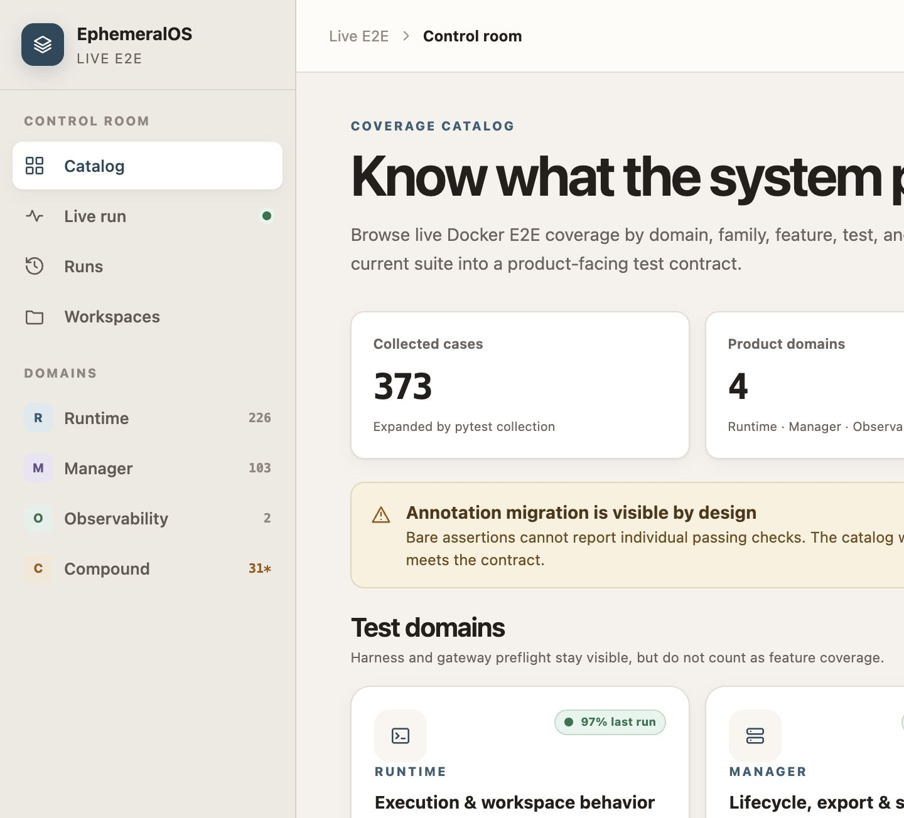
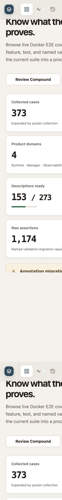
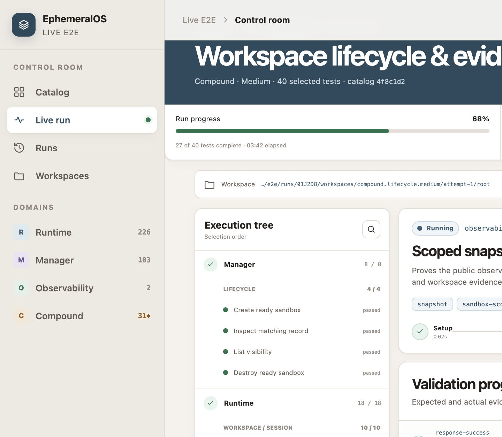
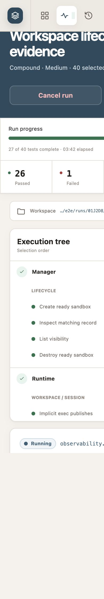
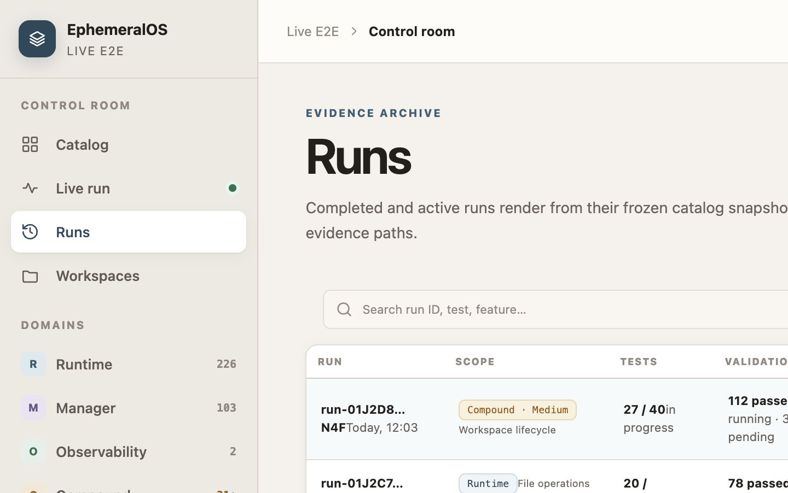
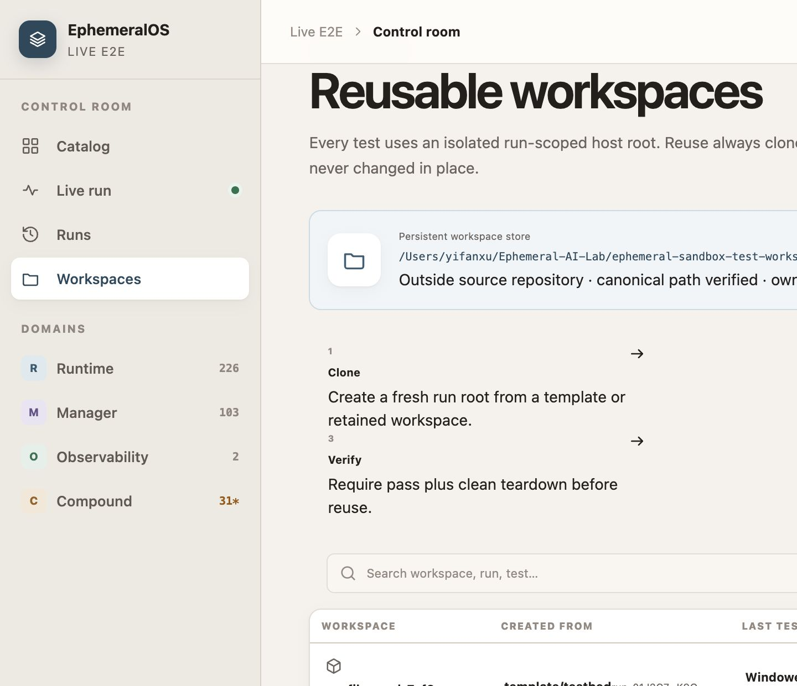

# EphemeralOS E2E Control Room — Layout and Theme

| Field | Value |
| --- | --- |
| Status | Intended production visual target |
| Applies to | `/e2e/catalog`, `/e2e/runs`, `/e2e/runs/:run_id`, `/e2e/workspaces`, and Runner health |
| Interaction authority | [e2e-test-ui-design.md](e2e-test-ui-design.md) |
| Migration execution | [e2e-test-ui-migration-spec.md](e2e-test-ui-migration-spec.md) |
| Reference assets | [`assets/e2e-ui-reference/`](assets/e2e-ui-reference/) |
| Historical source | `ephemeral-sandbox@54ed152e3:e2e/ui-prototype` |

This document defines the layout and visual theme the production React Control
Room must adopt. The historical static prototype supplies composition and visual
language. It does not supply production routes, data, state, or accessibility
behavior.

## 1. Authority and interpretation

Use the following priority when sources disagree:

1. the system and technical contracts own data, safety, state, and actions;
2. `e2e-test-ui-design.md` owns information architecture, interaction, copy,
   responsive behavior, and accessibility;
3. this document owns visual hierarchy, layout composition, and theme;
4. the attached JPGs clarify intended appearance;
5. the prototype HTML and CSS are historical evidence, not production source.

Adopt the prototype's visual language without restoring its hash routing, fixed
sample counts, editable-looking paths, or feature-specific page components. A
production screen must never invent a metric or state to make the screenshot
look complete.

The recoverable origin is product commit `54ed152e3` (`docs(e2e): add live
control room design prototype`, 2026-07-12). Commit `a88e8c9ef` removed that tree
during suite extraction, and external test-repository commit `b58d810` preserved
the same files at `<E2E_SOURCE_ROOT>/web/prototype`. The JPGs attached here are
byte-identical copies of that preserved set.

## 2. Visual intent

The Control Room is a calm editorial operations console. It combines generous
headings and whitespace with dense, structured test data. It should feel closer
to a carefully typeset engineering report than a generic component-library
dashboard.

The defining characteristics are:

- warm neutral canvas and navigation surfaces;
- white raised cards with quiet borders and soft brown-gray shadows;
- dark ink, slate-blue navigation, and semantic green/amber/red/violet accents;
- large editorial page titles paired with compact operational metadata;
- persistent navigation on desktop and compact icon navigation on mobile;
- strong grouping through space and surface changes instead of heavy rules;
- monospaced treatment only for IDs, digests, paths, counts, and evidence;
- status communicated by label, icon, and color together;
- restrained motion limited to state transitions and direct feedback.

Do not introduce glassmorphism, neon accents, saturated gradients, dashboard
charts without a named diagnostic need, decorative animation, or dark mode as
part of this migration.

## 3. Reference screenshots

The screenshots are checked into this documentation tree so review does not
depend on another repository or a local development server.

### 3.1 Catalog — desktop target



Normative qualities: persistent left navigation, breadcrumb top bar, editorial
headline, four-card metric strip, visible warning treatment, domain cards, and
clear separation between summary and detailed browsing.

### 3.2 Catalog — mobile target



Normative qualities: compact icon navigation, one-column cards, full-width
actions, no horizontal page overflow, and preserved heading hierarchy.

### 3.3 Live run — desktop target



Normative qualities: slate run hero, progress and state strip, workspace
identity, execution tree, and a larger evidence/detail working surface.

### 3.4 Live run — mobile target



Normative qualities: stacked run summary, reachable first failure and actions,
single-column execution/detail content, and no loss of state labels.

### 3.5 Runs and Workspaces





Normative qualities: operational tables with readable row hierarchy, restrained
filters, prominent selection/detail, and safety facts before destructive action.

### 3.6 Supporting composition references

These screenshots provide reusable catalog and detail patterns. They do not
authorize separate production routes for known domains.

| Reference | Production use |
| --- | --- |
| [Runtime](assets/e2e-ui-reference/runtime.jpg) | Family rail, feature grouping, and case rows |
| [Manager](assets/e2e-ui-reference/manager.jpg) | Dense case browsing and semantic status |
| [Observability](assets/e2e-ui-reference/observability.jpg) | Compact low-count domain presentation |
| [Compound](assets/e2e-ui-reference/compound.jpg) | Cross-domain topology and validation composition |
| [Test detail](assets/e2e-ui-reference/test-detail.jpg) | Purpose, validations, evidence, metadata, and lineage layout |

## 4. Theme tokens

The initial production tokens should reproduce the reference palette. Token
names express purpose so later contrast adjustments do not require component
rewrites.

### 4.1 Surfaces and text

| Token | Initial value | Use |
| --- | --- | --- |
| `--e2e-canvas` | `#f5f2ed` | Page background |
| `--e2e-nav` | `#eee9e2` | Desktop and compact navigation |
| `--e2e-surface` | `#fffdf9` | Top bar and primary warm surfaces |
| `--e2e-surface-raised` | `#ffffff` | Cards, tables, drawers, dialogs |
| `--e2e-surface-subtle` | `#f9f6f1` | Inset rows, fields, disclosures |
| `--e2e-surface-blue` | `#f0f5f8` | Selected or informational inset |
| `--e2e-ink` | `#241f1c` | Primary text |
| `--e2e-ink-soft` | `#6c625c` | Body secondary text |
| `--e2e-ink-faint` | `#928881` | Nonessential metadata after contrast proof |
| `--e2e-line` | `#e3ddd5` | Default border |
| `--e2e-line-strong` | `#d4cabf` | Active and structural border |

### 4.2 Brand and semantic colors

| Meaning | Foreground | Soft surface |
| --- | --- | --- |
| Navigation/information | `#395f76` | `#dce9ef` |
| Navigation emphasis | `#29495d` | `#f0f5f8` |
| Ready/passed/safe | `#23734c` | `#e8f4ed` |
| Warning/stale/blocked | `#9c5a08` | `#fbf0de` |
| Failed/error/unsafe | `#af3b3b` | `#fbeaea` |
| Secondary taxonomy | `#66528c` | `#eee9f7` |

Every semantic treatment must meet WCAG 2.2 AA against its surface. If an
initial reference value fails, adjust the token rather than weakening the
contrast requirement.

### 4.3 Typography

- UI font: `Inter`, then the existing system sans-serif stack. Do not fetch a
  web font at runtime.
- Code font: `SFMono-Regular`, `Consolas`, `Liberation Mono`, then monospace.
- Page title: `clamp(30px, 3.2vw, 45px)`, weight 650–700, line-height 1.08,
  letter-spacing approximately `-0.045em`.
- Section title: 21px, weight 650–700, line-height 1.2.
- Card title and ordinary body: 14–16px according to density.
- Operational metadata: 11–12px only when nonessential; never place required
  actions or failure reasons below 12px.
- Mobile body and form controls: at least 16px where browser zoom behavior or
  readability would otherwise suffer.
- Uppercase eyebrow and column labels: 10–11px with deliberate letter spacing.

Headlines use proportional type. IDs, revisions, durations, sequence numbers,
counts, and evidence values use monospace. Long identities wrap within their
own disclosure; they do not widen the page.

### 4.4 Shape, depth, and motion

| Token | Value |
| --- | --- |
| Small radius | `7px` |
| Control/card radius | `11px` |
| Large feature-card radius | `16px` |
| Small shadow | `0 1px 2px rgb(45 35 27 / 5%), 0 4px 14px rgb(45 35 27 / 4%)` |
| Raised shadow | `0 12px 32px rgb(45 35 27 / 10%)` |
| Direct feedback | 120–180ms color, border, opacity, or transform transition |

Hover may raise a navigable card by at most 2px. Controls and table rows must
not resize or reflow on hover. All motion is removed or reduced under
`prefers-reduced-motion`.

### 4.5 Icons and imagery

Use one outlined SVG icon language with approximately 1.8px strokes. Icons are
supporting labels, never the only state signal. Do not use emoji icons. The UI
does not need decorative photography or generated illustration.

## 5. Application shell

### 5.1 Desktop, 1181px and wider

```text
┌──────────────────┬────────────────────────────────────────────────┐
│ Brand            │ Breadcrumb/context                Health/state │
│                  ├────────────────────────────────────────────────┤
│ Catalog          │                                                │
│ Live run         │             Route content                      │
│ Runs             │                                                │
│ Workspaces       │                                                │
│                  │                                                │
│ Dynamic domains  │                                                │
│ and counts       │                                                │
│                  │                                                │
│ Runner summary   │                                                │
└──────────────────┴────────────────────────────────────────────────┘
```

- Sidebar: fixed, 236px wide, warm neutral background, full viewport height.
- Top bar: fixed, 58px high, aligned to the route-content column.
- Content: maximum width 1660px, centered, with 24–50px horizontal padding.
- Route padding starts at approximately 38px below the top bar and ends with at
  least 70px bottom space.
- Domain navigation is generated from catalog facets. It must not be a frontend
  allowlist or create separate domain routes.
- Health remains a drawer action in the top bar even if the reference prototype
  used a workspace popover.

### 5.2 Compact desktop, 901–1180px

- Sidebar contracts to 210px.
- Four-column metric/domain grids become two columns.
- Catalog, Runs, and Workspaces secondary panels stack when necessary.
- Live run keeps execution and detail columns while space permits.

### 5.3 Tablet, 681–900px

- Persistent sidebar becomes a 59px horizontal navigation bar.
- The brand remains visible; route items scroll horizontally if necessary.
- The route context bar becomes sticky rather than fixed.
- Main content uses 18px side padding.
- Detail panels and the run execution tree stack vertically.

### 5.4 Phone, 375–680px

- Navigation uses the compact brand mark and icon-plus-accessible-name controls.
- Page content is one column.
- Primary actions span the available width when paired.
- Filters, catalog detail, Review, evidence, and Health use full-screen drawers
  or dialogs as required by `e2e-test-ui-design.md`.
- Sticky selection/action bars respect safe-area insets and do not cover focused
  controls or the final row.
- Page-level horizontal scrolling is forbidden.

## 6. Route layouts

### 6.1 Catalog

The Catalog route has two states within one route contract.

**Overview state** — no query, domain, family, feature, test, or case is selected:

1. eyebrow and editorial purpose heading;
2. search and primary catalog action;
3. truthful summary metrics derived from the current catalog projection;
4. current catalog diagnostic or migration notice when one exists;
5. dynamic domain cards with counts and readiness summaries;
6. current-run and recent-run context when supplied by the projection.

Do not reproduce the screenshot's sample counts. Omit a summary card if the
backend does not own the value.

**Browse state** — entered by search, filter, or detail route state:

```text
┌───────────────┬──────────────────────────────┬─────────────────────┐
│ Search        │ Match count and filter chips │ Selected case       │
│ Domains       │ Case rows                    │ Purpose              │
│ Diagnostics   │                              │ Validations          │
│ Filters       │                              │ Coverage/evidence    │
├───────────────┴──────────────────────────────┴─────────────────────┤
│ Exact revision-qualified selection                    Review run  │
└───────────────────────────────────────────────────────────────────┘
```

At 1440px, show rail, results, and detail. At 1024px, show rail and results with
detail in a sheet. Below that, use a single result column with full-screen filter
and detail surfaces. Case rows retain the scan order and behavior in the UI
design; the screenshots only determine their visual treatment.

### 6.2 Review run

- Desktop: large raised dialog centered over the warm canvas.
- Mobile: full-screen surface.
- Scope and exact revision appear first, followed by boundaries, execution,
  evidence/cleanup, inputs, and preflight.
- Start remains the only primary action.
- A disabled Start always has an adjacent reason, not only a tooltip.

### 6.3 Live and historical run

```text
┌───────────────────────────────────────────────────────────────────┐
│ Slate run hero: result/title, selection, timing, actions          │
├───────────────────────────────┬──────┬──────┬──────┬──────────────┤
│ Progress                      │ pass │ fail │ rest │ stream state │
├───────────────────────────────────────────────────────────────────┤
│ Workspace/evidence identity and retention truth                  │
├──────────────────────────┬────────────────────────────────────────┤
│ Execution/case tree      │ First failure and selected case       │
│                          │ validations, cleanup, evidence, logs  │
└──────────────────────────┴────────────────────────────────────────┘
```

- The slate hero uses `--e2e-blue-dark` with white text.
- First failure is visible without opening a drawer.
- Primary error remains distinct when it differs from first failure.
- The execution column is narrower than the detail column.
- Live and historical views share this composition; live adds stream freshness
  and permitted Cancel, while history uses the same projection without live
  controls.
- On mobile, the order is hero, first failure, progress, actions, case tree,
  selected detail, evidence, and logs.

### 6.4 Runs

- Editorial heading and concise filters precede the working surface.
- Desktop uses a run table plus selected-run detail panel.
- Rows show the complete run summary required by the UI design, not just ID and
  result.
- On narrow screens, rows become cards; result, time, counts, and evidence remain
  visible without horizontal scrolling.

### 6.5 Workspaces

The page order is:

1. editorial heading and safety description;
2. Capacity and persistent-store safety surface;
3. Template state;
4. compact lifecycle principles;
5. Active attempts;
6. Quarantine;
7. Recent purges.

The reference store card and table styling are normative. Absolute paths remain
read-only and move to Health when the interaction design requires it. Purge is
shown only when the server projects eligibility and always uses a semantic
confirmation.

### 6.6 Runner health

Health is a right-side raised drawer on desktop and full-screen on phone. It uses
the same card, label, status, and identity treatments as the route pages. Group
content by operator decision exactly as specified in `e2e-test-ui-design.md`;
do not turn the drawer into a settings or infrastructure page.

## 7. Component appearance rules

- Cards use white raised surfaces, 1px warm borders, and small shadows.
- Selected rows use a pale blue surface and 3px inset blue marker.
- Form fields use subtle warm surfaces and explicit labels.
- Buttons use 44px minimum pointer targets in production even when the static
  prototype used smaller controls.
- Primary buttons use slate blue; destructive actions use semantic red and are
  never the default visual emphasis.
- Status badges use soft semantic surfaces, text labels, and a dot or SVG icon.
- Tables use uppercase compact headers and ordinary sentence-case row content.
- Empty, loading, stale, error, and partial states occupy the same working
  surface as successful content so the page does not jump unpredictably.
- Tooltips explain; they do not contain required action reasons or unique facts.

## 8. Visual acceptance

The migrated UI is visually accepted only when:

1. the shell, palette, typography, cards, spacing, and route compositions are
   recognizably consistent with the attached screenshots;
2. Catalog and Live Run match the reference hierarchy at 1440px and 390px;
3. all four routes remain usable at 375, 390, 768, 1024, and 1440px and at 200%
   zoom without page-level horizontal overflow;
4. every text/background pair and focus indicator passes WCAG 2.2 AA;
5. status never relies on color alone;
6. long IDs, paths, failure messages, and translated-like fixture strings do not
   break the shell;
7. all screenshots are generated from deterministic fixtures and contain no
   developer-machine absolute path or mutable live data;
8. interaction and safety acceptance in `e2e-test-ui-design.md` remains green.

Visual similarity never overrides truthful state, safe action projection,
keyboard order, focus behavior, or responsive readability.
