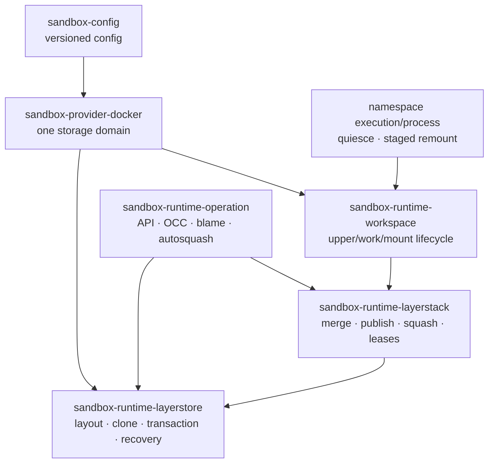

# LayerStack 2.0 implementation specification

Status: **BLOCKED_BY_EXPERIMENT**

Target repository: `ephemeral-sandbox`

Documentation branch: `layerstack_2_0`

Runtime implementation started: **NO**

This document is deliberately implementation-ready, but it does not authorize
changes to the runtime. Global Gate A requires independent macOS, Windows, and
Linux feasibility passes; the macOS snapshot in
[the experiment](02-macos-docker-experiment.md) is not satisfied. In the first
discovery run that reached `FICLONE`, Docker Desktop's default named volume was
ext4-family and returned `EOPNOTSUPP`. A qualifying, Docker-native,
reflink-capable storage domain still has to be found without adding a device,
helper daemon, plugin, privilege, host installation, or VM customization.

No simulated number, Linux-only result, direct `FICLONE` microbenchmark, or
loop-device experiment can change this status.

## 1. Entry and exit gates

There are two non-circular gates:

| Gate | Work allowed | Required result |
|---|---|---|
| A-macOS | Disposable external reference primitive and measurement harness only | Phase 0 passes on every supported stock macOS Docker Desktop architecture |
| A-Windows | Disposable external reference primitive and measurement harness only | Phase 0 passes on every supported stock Windows Docker Desktop/WSL 2 architecture |
| A-Linux | Disposable external reference primitive and measurement harness only | Phase 0 passes in every declared native-Linux filesystem/runtime cell |
| A — global backend feasibility | No product implementation | A-macOS ∧ A-Windows ∧ A-Linux, with reviewed receipts and evidence digests |
| B — product acceptance | Feature-gated LayerStack 2.0 implementation after global Gate A | The integrated runtime passes every correctness, blame, storage, performance, remount, crash, image, and memory gate in every mandatory platform lane |

Before global Gate A, do not add LayerStack 2.0 product code, schemas,
migrations, or configuration to `ephemeral-sandbox`. After global Gate A,
experimental implementation
may begin, but it remains disabled and unmergeable as a production default
until Gate B. A failed Gate B removes or revises the experiment-only code; it
does not silently relax thresholds.

Each Gate A branch uses a standalone test reference primitive that calls raw
`FICLONE`, FIEMAP, and `mount(2)` with the exact exported production options.
Gate B repeats the proof through the real `layerstore` and v2 mount builder.
This makes feasibility non-circular without allowing test code to define the
product contract.

Executable authorities are peer branches in
`ephemeral-sandbox-layerstack-2-experiment`: `macos_experiment`,
`windows_experiment`, and `linux_experiment`, run in that order. Every receipt
records its platform branch commit, shared-protocol commit, exact environment
cell, and raw evidence-bundle SHA-256. One branch can never satisfy another
branch's gate.

Assign one agent to each platform branch. Each branch must contain a
platform-specific `README.md` defining stock-host setup, execution ownership,
paired benchmark statistics, acceptance metrics, append-only evidence rules,
cleanup/stop conditions, and the final report template. The assigned agent
changes and reports only its branch; a separate reviewer signs its verdict.
Each branch also carries a self-contained `AGENT-PROMPT.md` of no more than
3,900 characters for handing that contract to the assigned agent.

The runtime repository currently has its own main-only contribution rule. This
specification does not override repository-local instructions. The
`layerstack_2_0` branch named above is the documentation branch; runtime branch
or worktree mechanics must be resolved under the runtime repository's rules
only after global Gate A.

## 2. Product contract

LayerStack 2.0 must preserve these external behaviors:

- any currently supported OCI Linux image works without binaries, libraries,
  hooks, or filesystem support inside the image;
- all agents in one sandbox continue to share one ordinary `/workspace`
  mount and the same live upperdir;
- reads, writes, `mmap`, executable files, xattrs, symlinks, hardlinks,
  whiteouts, opaque directories, and sparse files retain normal filesystem
  semantics;
- publish and amend keep current optimistic-concurrency behavior;
- squash is storage-correct without requiring live remount;
- live remount keeps the existing fail-closed quiesce and PONR rules; and
- `file_blame` returns the same exact published line ownership, including
  after squash, remount, restart, and recovery.

Internal formats are not compatibility boundaries. A broad rewrite is
permitted where it deletes dual-write races, unbounded heap state, or
cross-volume data copies. The extensibility goal is a small storage primitive
with explicit capabilities—not a generic plugin framework.

## 3. Proposed component boundary

Add one focused primitive crate and keep product policy in the existing
owners:

```text
crates/sandbox-runtime/layerstore/       package: sandbox-runtime-layerstore
├── src/layout.rs                        v2 path and fd-relative rules
├── src/probe.rs                         storage-domain capability probe
├── src/extent_transfer.rs               reflink/copy implementation
├── src/metastore.rs                     bounded SQLite pool + transactions
├── src/schema.rs                        format version and migrations
├── src/recovery.rs                      orphan/referenced-object recovery
├── src/receipt.rs                       stable operation evidence
└── src/error.rs                         classified storage failures
```



Ownership rules:

- `layerstore` owns local durability, object identity, metadata transactions,
  recovery, and extent-transfer capability. It never owns merge semantics.
- `layerstack` owns layer ordering, path resolution, publish plans, squash
  winner selection, whiteouts, and lease rewrite policy.
- `operation` owns user-facing OCC resolution, publisher identity, line-range
  calculation, blame responses, and API errors.
- `workspace` owns session upper/work directory lifecycle and mount handles.
- `namespace-execution` and `namespace-process` continue to own task quiesce,
  pin inspection, namespace entry, and staged mount switching.
- `sandbox-provider-docker` owns Docker volume placement and exact security
  configuration. It must not contain filesystem-specific product semantics.

`layerstore` is Linux-only at runtime but cross-compiles as part of the same
binary. OCI images remain unaware of it. The crate must expose a testable
trait boundary for fault injection, not a public dynamic storage-plugin ABI.

## 4. Versioned storage layout

One v2 storage domain is mounted at `/eos/storage`; all payload-bearing paths
must have the same filesystem identity and `st_dev`:

```text
/eos/storage/
├── format
├── metadata/layerstack.db{,-wal,-shm}
├── objects/<object-id>/fs/
├── sessions/<session-id>/upper/
├── sessions/<session-id>/work.<generation>/
├── sessions/<session-id>/staging-root/
├── sessions/<session-id>/rollback-root/
├── staging/<operation-id>/
├── export/<request-id>/
└── lost+found/<recovery-id>/
```

The immutable `format` record contains at least:

```text
magic = "ephemeral-layerstack"
layout_version = 2
storage_domain_id = <uuid>
created_by_build = <build-id>
```

Every open validates `format`, database domain identity, filesystem identity,
and single-writer ownership before serving requests. Payload paths are opened
from a trusted directory fd using no-follow, beneath-only rules. Before stock
SQLite opens a pathname, the daemon verifies that its metadata parent is the
expected directory beneath the trusted root, owned and mode-restricted, and
contains no symlink component. WAL/SHM sidecars remain confined there. This
design does not require a custom SQLite VFS. Object directories are immutable
after they become `committed`.

The shared image base is imported into `objects` once. Session upperdirs are
created inside the same domain. This changes the current Docker topology in
which layer stack, workspace scratch, and shared base are separate volumes.

## 5. Metadata schema and transaction rules

Use bundled SQLite in WAL mode as a local metadata engine. File payloads never
enter the database. Exact column types and indexes may change during
implementation, but the following logical tables are required:

| Table | Purpose and required key |
|---|---|
| `storage_domain` | singleton format, schema, probe result, selected mode, daemon epoch |
| `objects` | object ID, kind, state, logical bytes, creation transaction, durable path |
| `revisions` | immutable manifest revision, parent, operation identity, committed time |
| `revision_layers` | ordered layer IDs keyed by revision and ordinal |
| `leases` | persistent lease ID, revision, owner epoch, state, expiry/recovery policy |
| `lease_layers` | exact objects pinned by a lease |
| `substitutions` | old run → compact object, generation, source revision |
| `publish_commits` | idempotency key, expected/blame-base/result revision, state, owner, event digest |
| `pending_publish_paths` | invisible, batch-staged path metadata for one pending publish |
| `blame_events` | publish identity, normalized path, owner, before/after digest, `upsert`/`delete`, prior/resulting head |
| `blame_ranges` | event and ordered line ranges; query index by path/head event |
| `blame_heads` | current revision/path → event, content digest, line/range counts |
| `recovery_queue` | staged objects, parked remounts, and deterministic cleanup work |

Required integrity constraints:

1. a committed revision cannot reference a non-committed object;
2. every changed or deleted path in a visible publish has exactly one matching
   transition; an upsert installs its new event as head, while a delete has no
   ranges and preserves its prior query-visible head (or no head), and the
   visible path/event/range counts and digest agree;
3. a no-op publish has neither a new revision nor a blame event;
4. every live lease resolves to an immutable revision and exact object set;
5. squash substitution cannot delete or unpin any object needed by a live
   old lease;
6. operation idempotency returns the already-committed result without
   duplicating a layer or blame event; and
7. pending publish rows are invisible to manifest and blame readers.

SQLite and filesystem rename are not one atomic transaction. The ordering
contract bridges them:

```text
build private staged object
  → fsync every file and directory
  → rename into immutable object namespace
  → fsync object parent
  → stage invisible blame/path rows in bounded transactions
  → BEGIN IMMEDIATE metadata transaction
  → validate expected revision, blame base, object identity, row counts/digest
  → expose object + revision + blame heads + lease effects together
  → reply
```

Before the metadata commit, a promoted object is an unreachable orphan and
boot recovery may remove it. After the commit, the object must already be
durable. Missing or corrupt referenced objects fail readiness and enter
quarantine; they are never guessed or silently removed from a manifest.

Large publishes do not hold one unbounded transaction open. They reserve a
stable idempotency key, spill exact origin data to file-backed temporary state,
and stage invisible rows in byte-limited batches. A short final transaction
validates the staged event count/digest and changes the single visibility
state. No filesystem I/O, hashing, range derivation, client wait, or queue wait
may occur inside that final transaction. Recovery deletes or resumes stale
pending rows by idempotency key and daemon epoch.

The primary database is retention-proportional on disk. Only its resident
cache, WAL, temporary work, and queues are strictly bounded. The storage
domain reserves recovery space and has separate admission high-water marks for
objects, metadata, staging, exports, `lost+found`, and parked remounts. Hitting
a high-water mark rejects new work before visibility; it never deletes live
payload or blame to make room.

## 6. Extent-transfer contract

Implement the narrow API described in the architecture document. Linux tries
whole-file clone first, then classified fallbacks according to the selected
mode. The destination remains private until complete and durable.

Fallback classification is strict:

| Error/result | `required` | `preferred` | `disabled` |
|---|---|---|---|
| proven clone success | use clone | use clone | do not attempt clone |
| `EOPNOTSUPP`/`ENOTTY` from a validated capability miss | fail operation/startup | select copy for the boot and emit reason | copy |
| `EXDEV` or mismatched filesystem identity | fail invariant | fail invariant | fail invariant |
| `EPERM`/`EACCES` | fail security/invariant | fail security/invariant | fail |
| `ENOSPC`/`EDQUOT`/`EIO`/read-only/corruption | fail hard | fail hard | fail hard |
| source identity changed | retry bounded OCC path or fail conflict | same | same |

`preferred` does not mean arbitrary per-file fallback. A real startup probe
selects clone or copy for the storage domain and persists the selection. An
unexpected runtime fallback marks the domain degraded and fails benchmark
qualification. A partial destination is unlinked through the recovery queue.

Buffered transfer uses one fixed buffer with a compile-time upper bound. It
must handle short reads/writes, sparse ranges, interruption, and file growth
according to existing OCC identity rules. Hashing is streaming; no full file
is reread into a `Vec`.

## 7. Publish and exact file-blame

The current best-effort ordering—publish layer and active manifest, then
append audit NDJSON—must be removed. It permits committed bytes with missing
or stale blame. V2 uses one logical publication transaction:

1. `operation` reads structural origins and prior ownership against explicit
   `expected_revision` and `blame_base_revision`, then calculates exact ranges.
2. `layerstack` creates a private `L` object using extent transfer for regular
   files and exact recreation for other inode types.
3. The object is made durable and promoted but is not yet reachable.
4. Exact path/range rows are staged invisibly in bounded batches with a
   changed-path count, before/after digests, line/range counts, and event-set
   digest.
5. One short metadata transaction revalidates both base revisions and exposes
   the object, revision, ordered manifest, publish identity, and all blame
   heads together.
6. Commit makes content and blame visible together; only then may the request
   return success.

If either base revision is stale, discard the derived rows and recompute the
complete OCC resolve and ownership mapping. Never transplant ranges derived
from the wrong prior content. All changed and deleted paths, delete
transitions/resulting heads, the manifest, and the publish identity are
all-or-nothing.

Crash oracle:

- old revision visible implies old blame;
- new revision visible implies matching new blame;
- newly committed content is never attributed to the previous owner; and
- an unrecoverable provenance inconsistency fails closed as `unknown` plus
  unhealthy storage, never as a plausible but false owner.

Every request has a stable idempotency key. If SQLite `COMMIT` returns an
uncertain result or the daemon dies after commit but before reply, retry first
queries that key: committed returns the same revision/event set, pending is
recovered or safely retried, and absent restarts from the declared base. It
must never create a second layer or duplicate ownership event.

Internally, `file_blame_page(path, cursor, limit)` performs an indexed query
for the blame head of the current published revision and returns ordered,
coalesced ranges in a bounded page. The existing public `file_blame(path)`
contract remains exact: operation streams internal pages into a
quota-controlled file-backed spool, then serves the original whole-array JSON
without holding it in heap. It must not expand an owner per line or load all
history/all paths on startup. A public cursor endpoint is additive only after
separate API approval; v2 must not introduce a new lower legacy-response limit.

Known semantics to preserve are: attribution is published-only; an unaudited
base-only or absent path is `NotFound`; deletion keeps the last published
attribution because blame is a pure provenance-store read. A delete transition
records `after_digest = NULL`, its prior head, no ranges, and that same prior
head as its resulting query head; a delete without a prior audited head keeps
`NotFound`. Recreate records the recreating publisher. Non-text/ignored
wholesale attribution remains the existing synthetic range, and path keys use
existing `LayerPath` normalization. Before implementation, v1 characterization fixtures must freeze
rename/copy, empty and binary content, trailing-newline changes, huge sparse
range sets, mixed-owner conflicts, and delete/recreate output byte-for-byte.
Squash, lease rewrite, and remount create no ownership.

A later provenance-retention feature needs its own explicit product policy;
layer GC is not provenance GC. The domain quota may reject future publishes,
but it cannot silently truncate blame history.

During migration, remove or replace the existing eager audit `HashMap`,
best-effort append, and “runtime must not depend on SQLite” guards. Preserve a
versioned read-only NDJSON importer only for offline v1 migration; do not run
two writable blame stores.

## 8. Squash, leases, and remount

Squash keeps the existing plan/build/commit split:

1. under a shared storage lock, select contiguous runs and acquire a durable
   plan lease;
2. outside the lock, build immutable `S` objects;
3. clone regular-file winners, while preserving guest hardlink groups,
   symlinks, modes, ownership, xattrs, sparse layout, whiteouts, and opaque
   directories;
4. under an exclusive metadata transaction, re-read the head and reject a run
   that is no longer contiguous;
5. commit the compact revision and persistent substitutions; and
6. retain old objects until every old lease is released.

Current squash already hardlinks immutable regular-file winners and is
payload-byte efficient. LayerStack 2.0 is not accepted on a claim that squash
became faster; it must demonstrate non-regression and gains in OverlayFS
copy-up and publish.

The remount workflow remains:

```text
commit squash independently
  → acquire replacement lease before releasing old
  → enter per-session admission gate
  → verify OverlayFS/no child mounts
  → discover namespace ∪ cgroup tasks
  → stop and prove every thread state
  → rediscover and inspect namespace/cwd/root/fds/maps
  → mount NEW using same upperdir + fresh workdir
  → move OLD to rollback (PONR)
  → move NEW to /workspace and verify
  → strict unmount OLD; never lazy detach
  → resume immediately after verified success
  → release OLD lease
  → install NEW handle under the short manager-state lock
```

For sanctioned rollback `EBUSY`, resume on NEW and install the NEW handle
while retaining OLD in the persistent parked lease. Tests preserve these
shipped orderings; LayerStack 2.0 does not extend the frozen interval to cover
metadata cleanup or manager bookkeeping.

Before PONR, uncertainty cleans NEW, keeps OLD, and resumes. After PONR,
uncertainty keeps tasks frozen and destroys the session. `EBUSY` parks OLD
with both leases until ordinary session teardown. Reflink does not weaken any
pin or quiesce proof.

Lease recovery is type-specific:

| Lease type | Boot proof and recovery |
|---|---|
| live session | reconstruct only after persisted session, holder PID/start identity, mount IDs, and cgroup membership agree; otherwise destroy then release |
| squash plan | a dead-epoch plan with no committed compact revision is aborted and its unreachable object reaped before release |
| replacement | retain old and new until the visible mount generation is proven; apply the normal pre/post-PONR oracle |
| parked rollback | keep pinned across restart until strict unmount or proven session destroy; never expire only by time |

Substitutions are durable facts, not leases. Epoch, heartbeat, and owner
identity accelerate classification but never alone prove that an object is
safe to collect.

## 9. Memory-free data-path contract

“Memory free” means no resident payload and no unbounded daemon-owned state;
it does not mean zero descriptors, control records, or reclaimable kernel page
cache. The implementation must satisfy these code-level rules:

| Resource | Hard rule |
|---|---|
| File bytes | never cached by the daemon; clone or fixed-size streaming only |
| Hashing/diff input | exact streaming/external-memory algorithm; no file-sized `Vec`, per-line owner array, or approximation |
| Blame | indexed disk lookup; memory proportional only to one bounded response page |
| Manifest | active chain has a configured hard bound; history is paged |
| SQLite | one writer, bounded readers, fixed page-cache ceiling, file-backed temp, bounded WAL/checkpoint |
| Work | count- and byte-weighted queue with backpressure; no task per path or per agent |
| Leases/substitutions | persisted and fetched by key; bounded live-session cache only |
| Metrics | fixed-cardinality dimensions; no path, object, agent, or request IDs as labels |
| Exports | bounded file-backed spool with deterministic cleanup |
| FIEMAP benchmark | separate process after quiescence; never a daemon-wide extent index |

Recommended initial hard ceilings, subject to the experiment but not user
tuning, are one metadata writer, at most four read connections, a 32 MiB
SQLite page-cache budget, a 64 MiB WAL checkpoint target with a 256 MiB hard
health limit, a 1 MiB transfer buffer per active transfer, and a bounded
transfer concurrency derived from the daemon memory budget. The aggregate
buffer ceiling—not only the per-transfer size—must be enforced with permits.
Gate B additionally runs the experiment's fixed 64 GiB qualification profile:
12 GiB staging, 2 GiB export, 2 GiB recovery/quarantine, 16 GiB total
transient allocation, a 4 GiB recovery-only reserve, a 44 GiB normal-state
admission high-water, and at most 64 parked remounts. Production sizing may
differ, but every value remains explicit and boundary-tested.

Set and verify explicit SQLite controls: `mmap_size=0`, negative `cache_size`
derived from the byte ceiling, file-backed temporary storage, WAL mode,
`wal_autocheckpoint` plus an explicit byte/deadline checkpoint policy,
`journal_size_limit`, finite `busy_timeout`, bounded read-result pages, and a
maximum reader lifetime so a stuck reader cannot pin WAL forever. Run the one
blocking writer on a dedicated bounded worker; do not create a connection per
agent or hold an async executor thread inside SQLite.

Admission is weighted by aggregate bytes as well as operation count. It has
hard limits for in-flight transfer buffers, paths, normalized path bytes,
owners, origin/range rows, response bytes, staged metadata, and one operation's
disk spill. Exact over-limit operations are either processed as bounded staged
batches with a final visibility marker or rejected before publication with a
stable resource-limit error. They are never partially attributed.

Every allocation that can outlive a request needs an owner, a bound, and a
cleanup/recovery path. Cancellation must drop permits, close fds, unlink
private staging, and roll back the database transaction. GC is an explicit
disk-object reachability/recovery job; correctness cannot depend on a
stop-the-world or heap garbage collector.

Readiness becomes false on unbounded WAL, recovery backlog above its hard
ceiling, missing referenced objects, metadata corruption, or an unknown
storage mode. Page cache is reported separately from anonymous RSS so normal
Linux caching is not misdiagnosed as a daemon leak.

Liveness may remain up while readiness is false only when the daemon can still
serve diagnosis and bounded cleanup safely. Tests cover checkpoint starvation,
a stalled writer, queue saturation, reader expiry, database integrity failure,
recovery-quota exhaustion, and cancellation at every permit/transaction
boundary.

## 10. Platform and security implementation

Platform support follows the Docker Linux-container model:

- Linux uses the host Linux kernel;
- macOS uses the Docker Desktop Linux VM; and
- Windows uses Docker Desktop's WSL 2 Linux-container backend.

There is no native macOS/Windows OverlayFS implementation. Capability is
decided by a probe on the exact mounted storage domain, not by platform name
or filesystem allowlist. Arbitrary OCI image support follows from using the
Linux VFS and requiring no image-side tooling.

The candidate Docker HostConfig must be mechanically identical to current
production except for volume layout. In particular, it adds no capability,
privileged flag, device, device-cgroup rule, `/dev/fuse`, loop device, helper
container, volume plugin, socket, seccomp/AppArmor exception, host package, or
Docker VM modification. Current production capabilities such as `SYS_ADMIN`
and `NET_ADMIN` must be recorded exactly; the design must not inaccurately
claim a `SYS_ADMIN`-only baseline.

The macOS and Windows lanes run from ordinary, non-elevated host accounts.
Windows qualification forbids UAC elevation, `wsl --mount`, a custom WSL
distro/kernel/VHDX, Docker data-root or settings changes, and any new Windows
service, filter driver, helper, or volume plugin. It does not claim native
Windows-container support. Linux qualification records exact kernel,
architecture, filesystem feature bits, rootful/rootless mode, user namespace,
cgroup mode, seccomp, and LSM cell. The runtime never provisions, reformats,
or remounts a host filesystem to manufacture reflink support.

Global Gate A passes only when every declared macOS architecture, Windows
architecture/WSL 2 cell, and mandatory native-Linux filesystem/runtime cell
has its own reviewed receipt. Copy mode can remain a correctness fallback,
but it cannot be counted as a passing reflink result.

If the only reflink-capable backend violates this rule, that platform gate
fails and global Gate A remains blocked, so this implementation is not built.
The correct fallback is v1 or v2-copy mode—not a hidden operational
dependency.

## 11. Configuration and compatibility

Proposed configuration:

```yaml
runtime:
  layerstack:
    layout: v1              # v1 | v2
    extent_sharing: disabled # required | preferred | disabled
    max_active_layers: 500  # hard mount/memory admission ceiling
```

Rollout rules:

- defaults remain `v1` and `disabled` until Gate B and an explicit rollout
  decision;
- `layout=v2, extent_sharing=disabled` is the co-located-copy control and
  emergency mode;
- `required` fails readiness unless the persisted startup probe passes;
- `preferred` selects one mode for the boot and emits a reason; it does not
  silently downgrade a required deployment; and
- the storage-domain format, selected mode, backend identity, and probe receipt
  are visible through stable observability.

Production autosquash may target a lower depth (currently 100 in the shipped
configuration), but it is not the hard safety bound. When a publish would
exceed `max_active_layers` and squash cannot safely restore capacity, reject
the publish before commit with `LayerLimitReached`; never allocate an
unbounded active manifest or hope a background worker catches up.

New sandboxes may select v2 after qualification. Existing v1 sandboxes remain
v1; do not auto-migrate a live workspace in the first release. An optional
later offline migration must:

1. stop and prove no live session or writer;
2. import immutable layers and the current manifest into a new v2 domain;
3. import and validate NDJSON blame into the same transactional history;
4. compare canonical tree, manifest, blame, and object digests;
5. atomically select v2 only after verification; and
6. retain the recoverable v1 source until a separately approved cleanup.

No in-place format conversion and no dual-writable v1/v2 period are allowed.

## 12. Runtime change map

After global Gate A, implementation is expected to touch at least these areas. Exact
module splits may change, but ownership must not drift.

| Area | Principal paths | Required change |
|---|---|---|
| New primitive | `crates/sandbox-runtime/layerstore/` | layout, probe, extent transfer, SQLite metastore, recovery, receipts |
| Workspace manifest | workspace `Cargo.toml` files and dependency rules | add the narrow crate edge and remove obsolete no-SQLite guard intentionally |
| Docker topology | `crates/sandbox-provider-docker/src/runtime.rs`, `archive.rs` | create/mount one v2 storage domain; persist version; preserve exact security profile |
| Configuration | `crates/sandbox-config/` | versioned layout/mode parsing and safe defaults |
| Layer storage | `crates/sandbox-runtime/layerstack/src/storage/` | fd-relative v2 object store and transaction adapter |
| Publish data | `layerstack/src/stack/layer/write.rs`, `stack/ops/publish.rs` | replace full `std::fs::copy` path with extent transfer and receipts |
| Squash | `layerstack/src/stack/squash/` | reflink immutable winners, preserve guest hardlinks, transactional substitution |
| Leases | `layerstack/src/stack/lease/` | persistent epochs, replacements, boot recovery, bounded live cache |
| Blame/OCC | `crates/sandbox-runtime/operation/src/file/`, `operation/src/layerstack/` | one publish transaction, indexed blame, remove best-effort dual write/eager global replay |
| Blame contract | operation contract/catalog/client crates | preserve exact whole-array API via internal paging + disk spool; any public cursor form is separately approved and additive |
| Workspace lifecycle | `crates/sandbox-runtime/workspace/src/lifecycle/` | v2 upper/work paths, persisted generation, recovery integration |
| Namespace runtime | namespace execution/process remount modules | preserve gate/quiesce/PONR behavior; add v2 receipts only |
| Daemon | `crates/sandbox-daemon/` | boot probe, domain recovery, health gates, bounded resource initialization |
| Observability/tests | existing metrics, snapshot/dependency guards, E2E repositories | stable receipts, memory metrics, fault injection, v1/v2 paired corpus |

Delete or retire after v2 acceptance:

- cross-volume publish copies for v2;
- best-effort post-publish blame append;
- full audit replay into an unbounded process-global map;
- ephemeral-only lease/substitution state needed for v2 recovery; and
- dependency tests that forbid the explicitly approved embedded metastore.

Keep the v1 implementation until rollout and rollback evidence permits a
separate removal decision.

## 13. Errors, receipts, and observability

Public errors must preserve existing API compatibility where possible, while
internally classifying at least:

```text
UnsupportedStorageCapability
StorageIdentityMismatch
ReflinkRequiredButUnavailable
SourceIdentityChanged
LayerLimitReached
ResourceAdmissionExceeded
MetadataConflict
MetadataCorruption
ReferencedObjectMissing
StorageFull
StorageIo
RecoveryIncomplete
RemountBlockedPrePonr
RemountUncertainPostPonr
```

Every publish, squash, and remount writes a bounded receipt keyed by operation
ID. Required low-cardinality metrics include:

- selected storage mode and probe outcome;
- transfer count/bytes by `reflink`, `copy_file_range`, or `buffered`;
- unexpected fallback count and classified reason;
- published logical bytes and measured allocation delta;
- metadata transaction latency, conflicts, WAL bytes, and checkpoint result;
- bounded queue depth and wait time;
- recovery backlog, orphan bytes, live leases, and parked remounts;
- anonymous RSS/PSS, cgroup memory, open fds, threads, and health state; and
- remount phase durations including actual frozen interval.

Never use path, object ID, sandbox ID, agent ID, request ID, or layer ID as a
metrics label. Detailed IDs belong in bounded structured logs or persisted
receipts with retention.

## 14. Staged implementation after global Gate A

| Phase | Deliverable | Exit condition |
|---|---|---|
| 0 | External backend + production-mount feasibility harnesses | A-macOS, A-Windows, and A-Linux pass; global Gate A is reviewed with raw artifact digests |
| 1 | `layerstore` layout, probe, transfer, receipts, fault-injection tests | clone/copy identity, partial cleanup, fixed-memory and unsupported-path tests pass |
| 2 | bounded metastore, schema, boot recovery, health | crash matrix proves old-or-new state and bounded WAL/RSS |
| 3 | v2 Docker/workspace topology behind disabled config | arbitrary image/session tests pass; exact security diff empty |
| 4 | transactional publish + exact blame | paired v1/v2 provenance corpus and every publish crash boundary pass |
| 5 | squash, persistent leases/substitutions | deep/racing squash, restart, GC, and canonical tree tests pass |
| 6 | same-upper remount integration | pin matrix, PONR faults, active-service continuity and blame pass |
| 7 | full benchmark and 24-hour health soak | every Gate B table is filled from retained raw evidence and passes |
| 8 | guarded rollout and rollback drill | explicit approval; default remains unchanged until the rollout decision |

Each phase adds a closed failpoint at its durability boundaries. Crash tests
use `SIGKILL` after a flushed phase marker; returned errors are not substitutes
for power/process-loss ordering tests.

## 15. Required test suites

Unit and property tests:

- clone/copy classification, short I/O, sparse extents, identity races;
- path normalization/no-follow containment and arbitrary byte names where
  currently supported;
- schema constraints, idempotency, WAL recovery, orphan collection;
- OCC merge and exact blame range equivalence;
- squash newest-wins, whiteouts, opaque dirs, xattrs, hardlink groups; and
- bounded queues, cancellation permit release, fixed-cardinality metrics.

Build qualification includes the existing Linux target matrix, including the
project's musl/static lanes and supported architectures, with bundled SQLite
requiring no dynamic package in the image. Record binary-size and cold-start
deltas, license inventory, and cross-compile results; replacing the dependency
guard is an explicit reviewed architecture change, not a test deletion done to
make CI green.

Paired integration tests compare v1 and v2 after every operation using a
canonical snapshot of content digest, type, mode, UID/GID, xattrs, symlink,
hardlink identity, sparse layout, active manifest, and `file_blame`. Generated
IDs are normalized; everything else must match exactly.

Live Docker E2E tests run feature by feature and retain append-only command,
good-result, defect, and fix records. They include:

- Ubuntu, Debian, Alpine, native architecture, and supported emulation images
  pinned by digest;
- one, five, and twenty agents sharing one workspace;
- publish/amend conflicts, deletes, binary/ignored files, deep history;
- squash depths 8, 100, and 499 with racing publish;
- idle, eligible active, pinned, and adversarial remount cases;
- daemon/runner kills, Docker restart, ENOSPC, fsync failure, and corruption;
- 1/10/50 GiB payload scaling, 1k/10k/100k files, and 10k sessions; and
- at least a 24-hour mixed workload with continuous health probes.

The experiment document owns numeric thresholds and benchmark statistics.
This spec does not duplicate or weaken them.

## 16. Rollout and rollback

After Gate B only:

1. ship v2 compiled but default-off;
2. enable `layout=v2, extent_sharing=disabled` for internal canaries;
3. enable `preferred` only on a domain whose persisted probe selected clone;
4. enable `required` for performance qualification and strict deployments;
5. compare receipts, blame, health, and allocation continuously; and
6. stop creating v2 sandboxes on any invariant, corruption, memory, or
   unexpected-fallback signal.

Rollback stops creating v2 sandboxes and drains existing v2 sessions with the
same binary. It does not reinterpret v2 storage as v1. Existing v1 creation
remains available until v2 has completed an explicitly approved stability
window. Data-destructive removal of v1 code or old stores is a separate
decision with its own recovery plan.

## 17. Acceptance checklist

- [ ] A-macOS, A-Windows, and A-Linux each pass on their declared stock
      platform cells without extra privilege, device, helper, plugin, host
      install, VM customization, or storage provisioning.
- [ ] Intel and Apple Silicon macOS claims are separately qualified where both
      are supported; Linux and Windows Docker/WSL claims have their own runs.
- [ ] Real production OverlayFS copy-up and publish retain shared extents.
- [ ] Candidate reflink-sensitive space beats both controls; tiny-edit latency
      beats vanilla; and no-sharing, unrelated, and read-only paths remain
      within their predeclared non-regression margins versus co-located copy.
- [ ] Arbitrary supported OCI images and multi-agent sharing are unchanged.
- [ ] Exact file blame is transactionally paired with every committed publish.
- [ ] Blame is identical through squash, remount, restart, delete, and crash.
- [ ] Squash remains independently correct and live remount remains fail-closed.
- [ ] Active execution has no request gaps/errors beyond the approved pause SLO.
- [ ] No daemon payload cache, eager global history index, or unbounded queue,
      WAL, metrics cardinality, descriptor, task, lease, or recovery growth.
- [ ] Anonymous RSS and cgroup memory pass every size-scaling and 24-hour soak
      threshold with zero OOM, panic, restart, or health failure.
- [ ] Crash/ENOSPC/fsync fault matrices prove deterministic old-or-new recovery.
- [ ] Raw artifacts, environment, commands, binary/image digests, and evidence
      bundle SHA-256 are retained and independently reviewed.
- [ ] Gate B is explicitly approved before changing any production default.

Until every global Gate A prerequisite is checked, this document remains
**BLOCKED_BY_EXPERIMENT** and the runtime implementation remains **NO**.
