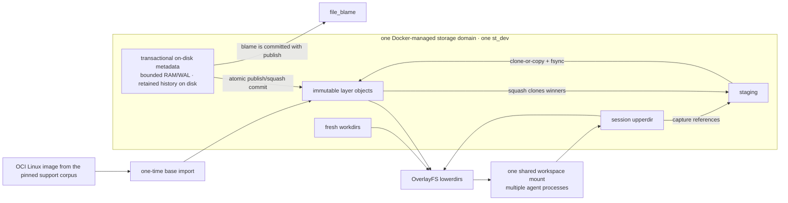

# LayerStack 2.0: reflink-backed OverlayFS

Status: **DESIGN PROPOSED — IMPLEMENTATION BLOCKED**

Experiment verdict: **INCONCLUSIVE — GATE A UNSATISFIED**

Documentation branch: `layerstack_2_0`

## Decision

LayerStack 2.0 keeps OverlayFS as the live Linux workspace and makes reflink
the preferred local data-sharing primitive. It does **not** put FastCDC, a
chunk CAS, FUSE, or a userspace VFS on the command I/O path.

The design has two independent planes:

- a same-filesystem data plane that lets Linux OverlayFS and LayerStack use
  extent cloning when the backing filesystem actually supports it; and
- a transactional, disk-backed metadata plane for manifests, leases,
  substitutions, and file-blame provenance.

Reflink is a capability, not an assumption. Linux OverlayFS currently tries
  `vfs_clone_file_range()` before copying file data during copy-up, but the
filesystem, mount topology, and kernel decide whether the clone succeeds. The
experiment must demonstrate shared physical extents and copy-on-write
independence on the actual Docker Desktop storage volume. An ioctl return code
or logical byte count alone is not proof.

## Design at a glance

The current Docker provider mounts the layer stack, workspace scratch, and
shared base as different volumes. That topology prevents end-to-end reflink.
LayerStack 2.0 therefore uses one versioned storage domain for the layer stack
and all session `upper`/`work` directories. A base from an arbitrary OCI image
is imported into that domain once and remains shared as an immutable lower
layer.

## Non-negotiable gates

Global Gate A (backend feasibility) must pass before LayerStack 2.0 product
code is added to `ephemeral-sandbox`. It is the conjunction of independently
reviewed A-macOS, A-Windows, and A-Linux receipts. Each platform Gate A is
limited to a disposable standalone harness proving all of the following on the
exact stock production storage path:

1. immutable objects, staging, `upperdir`, and `workdir` occupy one storage
   domain;
2. a seeded, incompressible, fully allocated source of at least 1 GiB directly
   clones with at least 99% of allocated payload shared, allowing at most one
   filesystem block per mapped extent of reconciliation error; after one
   aligned 4 KiB overwrite, the source hash is exact and both shared-byte loss
   and exclusive-byte growth are no greater than
   `max(128 KiB, two reported filesystem extent-granularity units,
   32 × filesystem block size)`;
3. OverlayFS mounted with the exported production options retains at least 99%
   of unchanged allocated payload during real copy-up under the same
   reconciliation and mutation bounds;
4. the raw and canonical security profiles show no privilege, capability,
   device, helper, plugin, host-installation, or security-policy delta; and
5. teardown leaves no experiment-owned mount, process, volume, path, or helper.

The versioned security canonicalizer may normalize only timestamps,
runtime-generated IDs, semantically irrelevant ordering, and declared
experiment paths. It never normalizes security, capabilities, devices,
namespaces, propagation, helpers, Docker/VM settings, or host changes, and each
receipt retains the raw snapshot, canonical snapshot, both diffs, and the
canonicalizer digest.

Gate B starts only after product implementation is allowed by global Gate A.
It repeats the feasibility proof through the integrated runtime and runs the
full correctness, storage, performance, squash/remount/quiesce, exact-blame,
crash/recovery, supported-image, and bounded-memory suite. Gate B must pass
before merge as a production-ready path or any default rollout. A Gate B
mismatch blocks Gate B and requires discrepancy review and rerun; it does not
rewrite a historical, evidence-addressed Gate A receipt.

The notes dated 2026-07-19 are unverified imported discovery context because no
sealed receipt and evidence digest accompany them. They suggest that Docker
Desktop's default ext4-family named volume returned `EOPNOTSUPP`, but they do
not change any gate or constitute a measured result. A-macOS therefore remains
unsatisfied and product implementation remains blocked. If no Docker-native
backend can satisfy Gate A, the platform verdict is `FAIL`; a loop device,
privileged container, FUSE dependency, or host plugin cannot manufacture a
passing result.

## Documents

1. [Architecture and invariants](01-architecture.md)
2. [macOS Docker experiment and acceptance gates](02-macos-docker-experiment.md)
3. [Implementation specification](03-implementation-spec.md)

Executable experiment plans and append-only run records live in the dedicated
[`ephemeral-sandbox-layerstack-2-experiment`](https://github.com/Ephemeral-AI-Lab/ephemeral-sandbox-layerstack-2-experiment)
repository. Its independent peer branches are `macos_experiment`,
`windows_experiment`, and `linux_experiment`; their platform owners may execute
in parallel. The documentation copy states the architecture gate; the
platform-branch `EXPERIMENT.md` is the run authority.

The Windows branch qualifies only the stock Docker Desktop WSL 2
Linux-container backend. It does not claim standalone WSL 2, native Windows
containers, or a custom kernel, distribution, or VHDX.

One platform agent owns each branch. Its branch-local `README.md` is the
operator contract for stock-host setup, randomized A/B/C benchmark analysis,
acceptance metrics, artifact sealing, and final-report formulation;
`AGENT-PROMPT.md` is its self-contained handoff capped at 3,900 characters,
and `RUN-REPORT.md` is append-only. An agent may not edit another platform's
result or reuse its capability verdict.

The implementation specification is intentionally ready for review but has a
hard blocked header. Filling tables with simulated numbers does not unblock it;
the raw run artifacts and their digest are part of the gate.

## Primary references

- [Ephemeral Sandbox architecture](https://ephemeral-sandbox.com/architecture)
- [Squash and live remount](https://ephemeral-sandbox.com/architecture/squash-remount)
- [Linux OverlayFS documentation](https://docs.kernel.org/filesystems/overlayfs.html)
- [Linux OverlayFS copy-up source](https://github.com/torvalds/linux/blob/master/fs/overlayfs/copy_up.c)
- [Docker volumes](https://docs.docker.com/engine/storage/volumes/)
