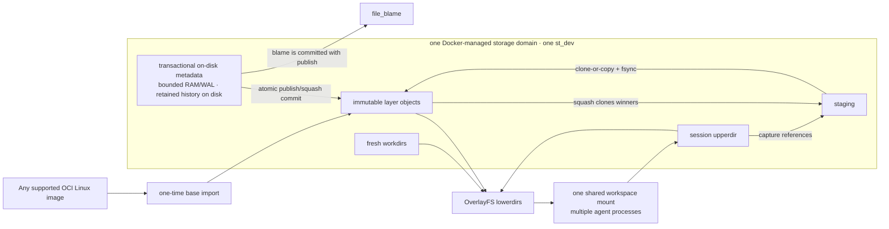

# LayerStack 2.0: reflink-backed OverlayFS

Status: **DESIGN PROPOSED — IMPLEMENTATION BLOCKED**

Experiment verdict: **INCONCLUSIVE — GATE A UNSATISFIED**

Documentation branch: `layerstack_2_0`

## Decision

LayerStack 2.0 keeps OverlayFS as the live Linux workspace and makes reflink
the preferred local data-sharing primitive. It does **not** put FastCDC, a
chunk CAS, FUSE, or a userspace VFS on the command I/O path.

The design has two independent planes:

- a same-filesystem data plane that lets Linux OverlayFS and LayerStack use
  extent cloning when the backing filesystem actually supports it; and
- a transactional, disk-backed metadata plane for manifests, leases,
  substitutions, and file-blame provenance.

Reflink is a capability, not an assumption. Linux OverlayFS currently tries
  `vfs_clone_file_range()` before copying file data during copy-up, but the
filesystem, mount topology, and kernel decide whether the clone succeeds. The
experiment must demonstrate shared physical extents and copy-on-write
independence on the actual Docker Desktop storage volume. An ioctl return code
or logical byte count alone is not proof.

## Design at a glance

The current Docker provider mounts the layer stack, workspace scratch, and
shared base as different volumes. That topology prevents end-to-end reflink.
LayerStack 2.0 therefore uses one versioned storage domain for the layer stack
and all session `upper`/`work` directories. A base from an arbitrary OCI image
is imported into that domain once and remains shared as an immutable lower
layer.

## Non-negotiable gates

Global Gate A (backend feasibility) must pass before LayerStack 2.0 product
code is added to `ephemeral-sandbox`. It is the conjunction of independently
reviewed macOS, Windows, and Linux platform gates. Gate B (full product
acceptance) must pass before
merge as a production-ready path or any default rollout. The requirements are:

1. macOS Docker Desktop proves real OverlayFS copy-up sharing and LayerStack
   clone sharing on allocated extents;
2. the candidate adds no privilege, capability, device, FUSE mount, plugin,
   helper daemon, seccomp exception, or host installation relative to the
   production baseline;
3. reflink-sensitive space beats vanilla LayerStack and the co-located copy
   control; tiny-edit latency beats vanilla, while unrelated and no-sharing
   paths do not regress the co-located copy control beyond their declared
   margins;
4. squash, lease rewrite, same-upperdir remount, and active-execution quiesce
   preserve their fail-closed contracts;
5. file contents and exact `file_blame` ranges remain identical through
   publish, squash, remount, restart, and injected crashes;
6. daemon memory remains bounded: no resident payload cache, no global chunk
   index, no growth proportional to retained layers, file bytes, or completed
   operations; and
7. arbitrary-image and fallback tests pass on the supported Docker host matrix;
   a cross-platform **reflink-backed** release additionally requires the real
   reflink gates to pass on every host/architecture in that matrix.

The 2026-07-19 discovery run already disqualified Docker Desktop's default
ext4-family named volume: `FICLONE` returned `EOPNOTSUPP`. That is not a full
candidate run, so the overall verdict remains inconclusive, but A-macOS is
unsatisfied and product implementation remains blocked. If no Docker-native
backend can satisfy the constraints, the final experiment verdict is `FAIL`.
The team must not disguise a loop-device, privileged, FUSE, or host-plugin
requirement as a reflink success.

## Documents

1. [Architecture and invariants](01-architecture.md)
2. [macOS Docker experiment and acceptance gates](02-macos-docker-experiment.md)
3. [Implementation specification](03-implementation-spec.md)

Executable experiment plans and append-only run records live in the dedicated
[`ephemeral-sandbox-layerstack-2-experiment`](https://github.com/Ephemeral-AI-Lab/ephemeral-sandbox-layerstack-2-experiment)
repository. Its peer branches are
`macos_experiment`, `windows_experiment`, and `linux_experiment`, executed in
that order. The documentation copy states the architecture gate; the
platform-branch `EXPERIMENT.md` is the run authority.

One platform agent owns each branch. Its branch-local `README.md` is the
operator contract for stock-host setup, randomized A/B/C benchmark analysis,
acceptance metrics, artifact sealing, and final-report formulation;
`AGENT-PROMPT.md` is its self-contained handoff capped at 3,900 characters,
and `RUN-REPORT.md` is append-only. An agent may not edit another platform's
result or reuse its capability verdict.

The implementation specification is intentionally ready for review but has a
hard blocked header. Filling tables with simulated numbers does not unblock it;
the raw run artifacts and their digest are part of the gate.

## Primary references

- [Ephemeral Sandbox architecture](https://ephemeral-sandbox.com/architecture)
- [Squash and live remount](https://ephemeral-sandbox.com/architecture/squash-remount)
- [Linux OverlayFS documentation](https://docs.kernel.org/filesystems/overlayfs.html)
- [Linux OverlayFS copy-up source](https://github.com/torvalds/linux/blob/master/fs/overlayfs/copy_up.c)
- [Docker volumes](https://docs.docker.com/engine/storage/volumes/)
