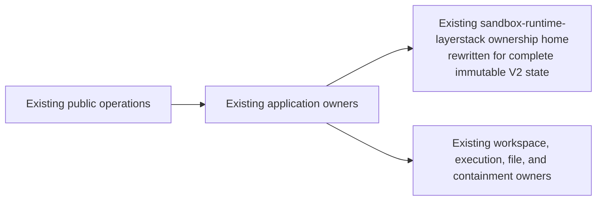

# State Storage V2 migration implementation plan

Status: **HISTORICAL APPENDIX — SUPERSEDED AS AN EXECUTION PLAN**

> **Current V2 authority:** use the human-doc
> [Phase 01 winner](../../ephemeral-sandbox-v2/architecture_design.md) and
> [implementation-plan compatibility map](../README.md). This package records
> an older candidate-generation and gate/packet design. Its statements that R0
> is unselected, Phase 0/1 selection is `NOT_RUN`, accepted winners are zero,
> or a tournament/packet should be executed are preserved historical facts,
> not instructions for Phase 02 onward. Translate historical `StateId` to
> `VersionId`; do not import a raw-ID reference, physical storage method,
> component count, or decision status from this appendix.

Original package status: **DESIGN DRAFT — ARTIFACT-SYSTEM AND PHASE 0 PACKET
PREPARATION ONLY**

This package defines how to select, falsify, build, and migrate State Storage
V2. It does not accept an architecture or algorithm. Architecture selection and
physical-method selection are one joint `H_PROFILE` tournament with status
`NOT_RUN`; accepted joint winners are `0`.

## Decisions at a glance

| Question | Current answer | Confidence boundary |
|---|---|---|
| Top-level phases | **3 operational envelopes** containing 11 ordered gates | smallest conservative grouping currently justified; a static-role two-envelope challenger remains unproved and the global minimum is `OPEN` |
| Mandatory new packages, components, deployables, services, ports, traits, facades, or aggregate Backend APIs | **0** in the zero-addition reference challenger | R0 is a candidate, not a winner; the global architectural floor is `OPEN` |
| Baseline semantic ownership questions | **3**: application decision, selected-state truth, and applicable native effects | not a proved role count: Phase 0 must generate all five set partitions of these questions, and a role is never a component, module, trait, API, process, or package count |
| Exact responsibility, call-edge, component, authority, package, process, and method counts | **`OPEN`** | measured output of Phase 1, never inferred from diagram boxes |
| New algorithms | **0 mandated / 0 proved / 0 selected** | 21 audit families are questions, not produced algorithms |
| Immutable checkpoint COW | **one physical dependency closure per `StateId`** | hard semantic law, purpose-independent and terminal-path complete |
| MCTS / parallel rollout | **outside storage** | callers compose checkpoint/root/fork/OCC operations |
| File API | **`file_{verb}`** | `file_read(workspace_session_id?)` chooses committed snapshot or named live session |
| Performance guarantee now | **none** | no V2 candidate or matched incumbent has qualified |

## Zero-addition architecture challenger: R0

R0 changes the existing ownership graph in place:



R0 adds nothing by default. It rewrites the existing LayerStack ownership home
and deletes LayerStack semantics: layer history, squash/autosquash, depth
lookup, layer GC, parent-applied reconstruction, and legacy lease behavior.
Current application owners keep authorization and ordering; current runtime
owners keep native effects. Deterministic portable identity is required, but a
named canonical module is not.

This is a **source-boundary hypothesis**, not a claim that today's LayerStack
is already a complete V2 authority. The clean pinned e497 tree contains the V1
LayerStack implementation. It does **not** contain `mpla-poc`,
`layerstack-core`, or the local dependency edges attributed to those historical
experiments. Those names are incomparable historical context, never current
source anchors or selectable deletion targets. Phase 0 regenerates every
anchor, writer, dependency, and topology transform from the pinned tree; final
API, component, package, helper, and format counts remain `OPEN`.

The diagram is not a component or API count. Phase 1 must replace it with the
compiled call/writer graph and exact independent counts. Phase 0 generates all
five set partitions of the three baseline ownership questions and every finite
compile-valid deletion/placement transform over packages and edges that
actually exist in e497. Each generated candidate must compile or carry an
independently checkable `INAPPLICABLE` proof. A larger boundary is eligible only
when deleting it produces a concrete failing execution and its before/after
ledger shows lower total state, calls, failure branches, or resource cost.
`NO_WINNER` is valid.

See [architecture selection](design/architecture-selection.md), the
[R0 challenger](design/architecture.md), and [source-layout challenger](design/source-layout.md).

## What the aggressive simplification removed

| Removed assumption | Replacement |
|---|---|
| new `StateStore` package/component/API as the floor | test repurposing an existing storage ownership home; final organization stays open |
| aggregate `WorkspaceBackend` component, trait, facade, or API | reuse or narrow the actual calls from existing application owners to applicable current effect owners; final call graph stays open |
| mandatory canonical module/package | deterministic pure behavior placed only after dependency/deletion evidence |
| any fixed responsibility or ownership-role count | generate all ownership-question partitions; count accepted compiled edges and authorities independently |
| new lifecycle/coordinator component | keep ordering in existing application owners |
| global Governor/admission ledger | each owner charges its own bounded debt; aggregate placement remains open |
| OCI-shaped core or speculative WASI/Firecracker plugin system | runtime-private Linux implementation plus disposable future conformance spikes |
| separate architecture then method gates | one joint topology × method `H_PROFILE` tournament; a method-induced ownership graph cannot be projected onto a topology chosen earlier |
| five top-level phases | three permission/risk envelopes and 11 content-addressed gates |
| generic `2x` storage/memory rule | measure actual write-new-before-delete-old overlap; accepted no-alias references stay one closure |
| Stage 4.6 as a reproducible winner/baseline | sealed historical negative evidence, classified `INCOMPARABLE` for matched decisions |

This is simplification of commitments, not deletion of invariants. Unique
selected-state writing, crash/recovery safety, runtime containment, finite
resources, migration fencing, exact artifact identity, and independent
qualification remain mandatory.

R0's preselection budget is deliberately zero: zero new architectural
boundaries, zero new generic APIs, zero new runtime seams, zero new algorithm
authorities, and zero mandatory physical storage fields. A joint candidate may
add one only after showing the concrete retained behavior that fails without
it and why derivation, co-location, an existing owner, or a direct function
call cannot satisfy that behavior. The accepted compiled profile—not this
document—supplies the final counts.

## Exact zero-copy COW law

For every `N >= 1` roots naming the same accepted `StateId` **whose accepted
canonical bytes are identical**:

```text
immutable_physical_closure_bytes(N roots, same StateId)
  = immutable_physical_closure_bytes(1 root, that StateId)

for every whole accepted no-alias reference create, move, or ownership transfer:
  selected-state immutable payload bytes read    = 0
  selected-state immutable payload bytes written = 0
  total selected-state immutable payload bytes copied = 0
  new root-private physical closure bytes         = 0
```

This includes checkpoint, reference-only fork, rollback-to-existing,
`commit_fork` winner transfer, same-state no-op publication, deletion and
last-reference races, failure, timeout/cancel, duplicate/stale input, crash,
restart, and recovery. Only bounded root/provenance/control metadata I/O may
occur and must be measured separately. Validation, warming, prefetch, or
recovery cannot hide immutable payload work.

`StateId` is a finite digest, so digest equality alone is not a mathematical
proof of fact equality. Candidate-bearing admission, import, recovery, and
index rebuild compare the complete canonical candidate bytes against the
already admitted bytes whenever the candidate digest is occupied. Equal bytes
coalesce; unequal bytes fail closed as
`T03_REJECTION / STATE_ID_COLLISION` before any alias, head, root, mapping,
index entry, closure, revision, custody, or capacity claim. A reference-only
transition accepts only a previously admitted, authorized no-alias binding; it
does not receive candidate bytes and performs zero immutable-payload I/O or
copy. Candidate-bearing input presented at a reference API is rejected or
routed to admission before entering that fast path. A forced-collision seam
exercises all candidate-bearing ingress, including reference-API ingress,
without making the accepted reference path reread payload. It is a test
mechanism, not a selected product algorithm, interface, field, or component.

Divergent successors, active workspaces, staging, backup holds, readers,
recovery reserve, and cleanup debt are different charged populations. Reflink
and FUSE are prohibited even as optional/private accelerators. A selected
runtime may use only an explicitly qualified runtime-internal OverlayFS,
native/VM snapshot, private storage-driver acceleration, or dedup hint; it must
preserve every result, durability, identity, privilege, and resource gate when
that acceleration is disabled. Canonical hard links represent an actual link
group inside one captured filesystem only and never authorize writable sharing
between workspaces or states.

## Memory and automatic cleanup

The current proposed evidence envelope separates scopes:

- selected-state managed heap: exact `8 MiB` cap, `4 MiB` normal target, and
  at most one `2 MiB` claim per admitted heavy operation;
- storage qualification containment: exact `memory.high=64 MiB`,
  `memory.max=96 MiB`, zero swap; and
- every untrusted runtime tree: its own finite parent cgroup or proved
  runtime-equivalent boundary.

These are proposed gates, not measured V2 results. Every buffer, queue, task,
FD, worker, permit, cache entry, scratch artifact, mutable allocation, and
cleanup debt must have one owner, a finite charge before allocation, and a
terminal/restart recovery rule. Caches are optional, nondurable, finite,
evictable, and automatically cleaned. Evidence covers the normative
`operation × terminal × applicable fault` product; a success-only sample is
insufficient.

See [storage model](design/storage-model.md), [requirements](design/requirements.md),
and [qualification gates](qualification/gates.md).

## Three phases, 11 gates

| Phase | Permission/risk envelope | Ordered gate outputs |
|---:|---|---|
| 0 | independent, candidate-blind facts and judge; no candidate evaluation | **1:** evidence/judge seal |
| 1 | reversible non-live selection, implementation, qualification; legacy remains sole live truth | **2:** joint topology × method `H_PROFILE`/`NO_WINNER` → **3:** `H_FMT` → **4:** `Hstore` → **5:** `Hpermanent` → **6:** `H_PRECUTOVER` → **7:** byte-identical `Hqual` |
| 2 | separately authorized live mutation, one-way activation, observation, compatibility retirement, changed-artifact release | **8:** exact cutover → **9:** bounded observation → **10:** compatibility retirement/build `H_RELEASE` → **11:** total QG disposition, exact-artifact qualification, new-release-epoch fleet rebind, old-process drain, and live release |

The two phase boundaries correspond to capability changes:

- `0 -> 1`: candidate authors must not define or tune the judge that evaluates
  them.
- `1 -> 2`: non-live authority must not preauthorize live mutation, the
  irreversible `V2Writable` transition, or the later first public V2 operation
  acknowledgment before exact qualified bytes exist.

Three is therefore the smallest conservative operational grouping currently
justified, not a theorem. Phase 0 must also test the strongest two-envelope
variant that keeps an independently sealed judge through static role and
artifact separation; it may replace this grouping only if it proves identical
noninterference and stop semantics. The exact gate chain remains strict;
collapsing phase labels does not collapse hashes, independent acceptors,
evidence scopes, invalidation, or stop conditions. Destructive legacy-byte
deletion is a separately signed post-release action outside the mandatory DAG.

See the [phase index](phases/README.md) and [ordering rationale](phases/phase-isolation-and-ordering.md).

## Execution artifacts

The [execution contract](execution/README.md) predeclares one packet shape for
every gate, a machine-readable [3-phase/11-gate catalog](execution/gates.json),
an independently published mutable [execution record](execution/state.json),
six byte-format schemas, transitive invalidation rules, and a fail-closed
validator. Only the
[Phase 0 evidence-seal packet](execution/phase-00/00-evidence-seal/packet.md) is
instantiated; it is `DRAFT / NOT_RUN`. Phase 1 and Phase 2 packet directories
are intentionally absent until their exact predecessors pass and their
capabilities are separately authorized.

Each successor consumes both the predecessor manifest digest and independent
acceptance digest. The manifest hashes controlled packet/evidence bytes but
excludes itself and `acceptance.json`; this prevents circular identity while
letting the exact input-lock producer authenticate the post-result seal and a
different acceptor bind one exact manifest. An execution packet records
work—it cannot select a design by being created, accept its own output, or let
a gate exit authorize a new phase.

The static catalog never carries current status. Accepted canonical packets
remain immutable as later gates are instantiated. Every non-bootstrap frontier
advance or invalidation retains the exact prior state, authenticates one
state-last transition, and is usable only after an independently verified
external conditional-write or fenced-lease commit receipt binds the exact raw
successor and prior token. If an input changes, the complete obsolete lineage
is archived by exact manifest digest and the transition records the full
transitive suffix; the historical five-valued verdict is never rewritten as a
sixth gate result.

## API and rollout boundary

The public namespace remains `file_{verb}`. For `file_read`:

- omitted `workspace_session_id`: capture one committed revision once and read
  that immutable view;
- supplied `workspace_session_id`: authorize and read the exact named live
  workspace-session generation through its current effect owner.

Writes/edits require an accepted live workspace target; immutable committed
state is never mutated. MCTS and parallel-rollout selection, scoring,
scheduling, backpropagation, and pruning remain external policy. Inactive roots
hold no mutable runtime allocation, worker, FD, queue, or cache.

See [public API](design/public-api.md) and [application coordination](design/application-coordination.md).

## Performance and Stage 4.6

The historical P4 run recorded a matched-first-three candidate median and ratio
denominator of `58.136209 ms`, an all-five candidate median of `62.567625 ms`,
an all-five candidate maximum of `65.937250 ms`, and a control median of
`36.444 ms` (the matched-subset candidate was about `1.595x` slower). Values `5.8136209 ms`
(candidate/10) and `0.36444 ms` (control/100) are unmeasured stress hypotheses,
not gates or guarantees.

The P4 20-artifact manifest verifies, and individual staged/helper digests are
known. Exact dirty/untracked source, the exact host scorecard artifact, and the
complete transitive causal build/configuration closure are not retained.
Therefore `R_stage46 = INCOMPARABLE`; only the single Phase 0-frozen
`QG-PERF-001` contract against a newly attested matched incumbent may decide a
performance win. The separate P1 memory receipt (`102,543,360 B`) cannot be
joined to P4 timing.

See [Stage 4.6 evidence](evidence/stage-04-6-baseline.md) and the
[source manifest](evidence/source-manifest.md).

## Read order and authority

1. [Requirements](design/requirements.md).
2. [Architecture selection](design/architecture-selection.md),
   [architecture challenger](design/architecture.md), [source layout](design/source-layout.md),
   and [runtime-effect laws](design/runtime-effects.md).
3. [Storage model](design/storage-model.md), [public API](design/public-api.md),
   and [migration/cutover](design/migration-cutover.md).
4. [Method registry](algorithms/registry.md), [selection protocol](algorithms/selection-protocol.md),
   and [decision ledger](decisions/README.md).
5. [Phases](phases/README.md), [gates](qualification/gates.md), and
   [traceability](traceability.md).
6. [Execution artifact contract](execution/README.md), immutable
   [gate catalog](execution/gates.json), mutable
   [execution record](execution/state.json), active
   [Phase 0 packet](execution/phase-00/00-evidence-seal/packet.md), and
   [handoff](HANDOFF.md).

If documents conflict, stop; a summary or review record never overrides its
owning contract.

## Workspace posture

- Docs package: `/Users/yifanxu/Ephemeral-AI-Lab/ephemeral-sandbox-docs/implementation-plan/new_2.0_migration_implementation_plan`
  on `layerstack_2_0`; it is untracked amid unrelated owner changes.
- Reserved clean implementation worktree:
  `/Users/yifanxu/Ephemeral-AI-Lab/ephemeral-sandbox-new-2.0`, branch
  `codex/new-2.0-storage-core`, at `origin/main`
  `e4974d1f9aac702b35e052629cb070c897989352`.
- No product code changed. No build, gateway rebuild, staging, commit, push,
  cutover, retirement, or deletion was performed.

Owner acceptance authorizes only Phase 0. It does not accept R0, a physical
method, schema, source layout, production artifact, live migration, or future
runtime promise.
