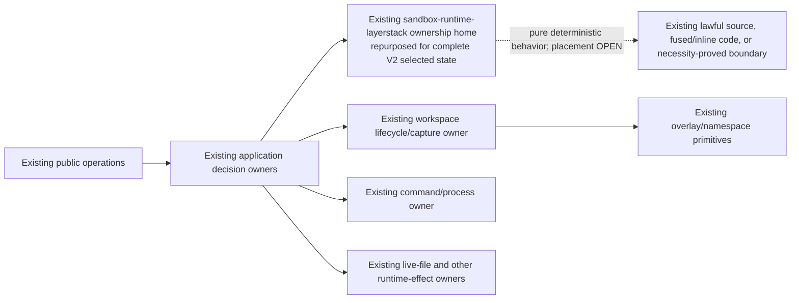

# Minimum in-place architecture challenger

> **HISTORICAL CHALLENGER RECORD.** Current Phase 01 subsequently selected R0
> jointly with filesystem-native complete-Version storage. The `NOT_RUN` and
> zero-winner statements below describe this older exercise, not current
> program status. See the current
> [architecture](../../../ephemeral-sandbox-v2/architecture_design.md) and
> [archive compatibility map](../../README.md).

## Status

R0 is the zero-addition boundary-compatible reference candidate, not the
production architecture or a proved minimum. `DEC-012` is `NOT_RUN`, the
accepted winner count is zero, and `NO_WINNER` remains valid. A package-deleting
fusion or any other complete smaller candidate remains eligible.

R0 begins with the owners already present in the pinned product tree. It adds
no mandatory package, module, component, deployable, trait, port, facade,
service, registry, plugin layer, RPC, or aggregate Backend API. Exact reason-to-
change, call-edge, component, authority, package, process, and method counts are
all `OPEN` evidence outputs.

“Boundary-compatible” means only that the current Cargo dependency position can
host the narrow selected-state responsibility without reversing the observed
application-to-state direction. It does not mean current LayerStack code is a
complete V2 implementation. The clean pinned e497 tree contains the legacy V1
LayerStack implementation and its actual consumers; it contains no current
`mpla-poc`, `layerstack-core`, EOS-LS3/V2/V3 storage candidate, generation-GC
handoff, or storage-helper package. Historical experiment receipts that mention
those names are incomparable evidence, not current-source anchors.

## Zero-addition concrete hypothesis



The package name `layerstack` is an observed source anchor, not permission to
retain layer semantics. R0 rewrites that ownership home in place and deletes
layer history, squash/autosquash, depth lookup, layer GC, legacy leases, and
parent-applied reconstruction from the V2 steady state. A later rename may be
selected, but old and new packages may not coexist merely to stage the rename.
The actual-source package-disposition family must also try deleting LayerStack
or any other generated in-scope package after moving its retained behavior to a
lawful extant owner. The actual-source placement family must try every generated
lawful owner for selected state and pure computation. Neither a package nor a
placement is preselected.

The diagram is not a component or API count. Each arrow must be replaced by
the actual compiled call graph during Phase 1, and each existing box may contain
several independently owned decisions or effects.

## Three candidate accountabilities, zero new components

R0 starts with three accountability labels. A label is not a required crate,
trait, service, process, component, or proved semantic boundary:

| Label | Candidate reason to change | R0 location hypothesis, not a decision |
|---|---|---|
| application decision owner | authorize and order request binding, replay visibility, selected-state calls, native effects, cleanup, and response | existing manager/runtime application paths |
| selected-state owner | uniquely publish/recover heads, roots, revisions, immutable custody, portable facts, and `StateId` | repurposed existing LayerStack ownership home or a smaller fused winner |
| native-effect owners | realize, fence, capture, execute, read/mutate live files, contain, and dispose exact runtime generations | applicable existing workspace/overlay/execution/file owners; never one aggregate Backend by assumption |

The three-label split is only one partition. Phase 0 must generate all five set
partitions of `A = application decision`, `S = selected state`, and
`N = native effect` before results are visible:

| Partition | Mandatory fusion challenge |
|---|---|
| `A | S | N` | keep all three accountability rows distinct; R0 is one placement of this partition |
| `A+S | N` | one owner is accountable for application decisions and selected-state writing; native effects remain separate |
| `A+N | S` | one owner is accountable for application decisions and native effects; selected state remains separate |
| `S+N | A` | one owner is accountable for selected state and native effects; application decisions remain separate |
| `A+S+N` | one accountability owner covers all retained behavior |

Every partition is crossed with every compatible actual-source placement,
package disposition, and physical profile. Each emitted pair must compile or
carry an independently checkable `INAPPLICABLE` proof against a Phase-0-frozen
product/security rule that does not assume the three-label split. Silence,
co-location alone, or an architecture law derived from R0 cannot eliminate a
partition.

The following traces are candidate falsifiers for the fusion tournament. They
do not establish that three separate accountability owners are necessary:

| Accountability removed or fused | Candidate failing execution to make executable |
|---|---|
| application decision owner | an operation spanning durable state and a non-transactional native effect has no owner for authorization, ordering, custody, ambiguity, cleanup, and the one public outcome; assigning that work to either subordinate owner reverses a dependency and mixes policy with mechanism |
| selected-state owner | two paths may select heads/roots or recover revisions without one authoritative serialization point, so OCC, ABA prevention, and fail-closed recovery have no unique truth |
| native-effect owner | a host/runtime effect either cannot occur or moves inside selected-state ownership, leaking paths, mounts, namespaces, devices, VM/WASI/OCI handles, and independent failure/resource debt into portable truth |

Co-location is not by itself semantic fusion. The partition manifest determines
whether grouped labels have one authority/reason-to-change row; the compiled
call, data, fault, and writer graphs determine whether that claim is true. A
candidate may use one, two, or three accountability owners and fewer source
modules, packages, components, processes, or deployables.

Everything else is placed inside one of those owners or deleted:

- canonicalization, hashing, validation, and codecs are pure functions, not an
  authority or mandatory package;
- resource charging belongs to the owner that allocates; an aggregate governor
  is forbidden unless a joint candidate proves a cross-owner atomic-admission
  need that cannot be expressed at an existing composition point;
- migration/import compatibility follows the one normative dependency graph in
  [the migration contract](migration-cutover.md#normative-import-dependency-direction),
  is temporary, and is removed before `H_RELEASE`; and
- MCTS/search is external caller policy, not storage or runtime architecture.

R0 proposes no fourth accountability label. Migration is temporary code,
evidence/judging is a delivery concern, resource charging stays with the
allocating owner, and pure computation has no lifecycle or authority. This R0
budget does not eliminate any of the five mandatory fusion partitions. Adding a
fourth label requires an executable trace in which every generated partition
and direct pure-function placement fails to own a necessary state transition,
external effect, privilege, synchronization point, or finite resource debt. A
name, pattern, future runtime, or test seam is not such a trace.

R0 therefore starts with this exact *preselection* architecture budget:

| Added commitment | R0 budget |
|---|---:|
| components, modules, packages, services, processes, or deployables | 0 |
| traits, ports, facades, registries, plugins, RPCs, or aggregate Backend APIs | 0 |
| coordinators, global governors, caches, workers, or algorithm authorities | 0 |
| mandatory physical tables, files, records, indexes, or fields | 0 |

This is not a claim that the compiled V2 result contains no code or persistent
facts. It means nothing new is pre-authorized merely because the design can
name it. Phase 1A may retain or add an element only with its deletion
counterexample, complete cost, and proof that a smaller realization fails.

Pure computation is not an authority. Co-location does not make two effects
atomic. Process separation does not create semantic ownership. Joint Phase 1A
must inventory actual writers and effect decision points instead of inferring
them from nouns in this document, and must prefer a complete total-fusion or
package-deleting candidate whenever it preserves these laws at lower total
cost.

## Boundary laws

- **ARCH-BND-001 — unique selected-state writer.** Exactly one selected
  implementation writes authoritative V2 heads, revisions, retained roots, and
  immutable-custody selection. R0 tests the repurposed existing LayerStack
  ownership unit. No second selector, writable legacy fallback, or generic
  repository wrapper is allowed.
- **ARCH-BND-002 — portable selected-state transition.** The compiled transition
  that computes or writes selected state accepts portable facts and may use only
  deterministic portable computation and selected persistence primitives. It
  never imports a runtime brand or migration reader and never invokes a mutable
  runtime effect. A fused accountability owner may also own application or
  native-effect decisions, but that does not permit those values/effects to enter
  the selected-state transition.
- **ARCH-BND-003 — native-effect privacy.** Current runtime effect owners may
  receive bounded portable facts and opaque generation/effect identities, but
  runtime-native paths, mounts, namespaces, devices, snapshots, VM/WASI
  handles, provider identities, and OCI values never enter selected identity or
  public/core values. A native-effect transition never writes selected-state
  truth. A partition that groups `N` with `S` must prove this remains true or
  produce an independently checkable `INAPPLICABLE` result under `REQ-PRO-005`.
- **ARCH-BND-004 — coordination behavior, placement open.** Authorization,
  durable preparation, runtime dispatch, cleanup, terminalization, and response
  require one accountable ordering path. R0 uses existing application owners;
  another mandatory partition may fuse that accountability if every hard law
  still passes. No partition gets an added coordinator component, facade,
  journal, or service without a necessity trigger. Exact owner and call-edge
  counts remain open.
- **ARCH-BND-005 — behavior before organization.** Deterministic canonical
  bytes, identity, bounded validation, and independent vectors are required;
  no named canonical module/package/component is. Retain, fuse, or repurpose
  existing pure code only after compile, dependency, and deletion evidence.
- **ARCH-BND-006 — bounded local ownership.** Each resource/effect owner charges
  before allocation and reconstructs only its own debt. Aggregate admission
  placement is open; no combined Store-plus-runtime ledger or standalone
  Governor is presumed.

## Cross-effect law

Selected-state persistence and mutable runtime effects are not one atomic
transaction. For every accepted operation spanning both, Phase 1 must name:

1. the existing authorization/fence owner;
2. every actual call edge and capacity acquisition;
3. durable request binding and effect custody before irreversible dispatch;
4. the exact generation-bound effect owner;
5. cancellation, crash, retry, compensation, uncertainty, and quarantine;
6. cleanup/join/capacity visibility; and
7. one terminal public/replay visibility point.

A selected-state transition must not call a runtime effect, and a native-effect
transition must not write selected truth. R0 uses existing application code for
the ordering. A fused partition may remove that owner boundary only if its
compiled transition graph preserves the same non-atomicity, portable-data, and
effect-custody laws; otherwise that emitted pair is `INAPPLICABLE`. An ambiguous
command or file mutation is never silently retried; commit-before-
response is resolved from durable truth without redispatch.

## Exact COW and external search policy

One **accepted, no-alias** `StateId` names one immutable physical dependency
closure regardless of root count. A digest of canonical bytes is only a
candidate identifier. Candidate-bearing admission compares complete canonical
candidate bytes with the already admitted bytes when the digest is occupied:
equal bytes coalesce; unequal bytes terminate as
`T03_REJECTION / STATE_ID_COLLISION` without an alias, head, root, mapping,
index entry, revision, custody claim, or capacity credit. A reference-only
transition consumes only a previously admitted, authorized no-alias binding;
it neither receives nor rereads immutable payload. Candidate-bearing input at
a reference API is rejected or routed to admission before fast-path entry.
Checkpoint creation, reference-only fork,
rollback-to-existing, `commit_fork` winner transfer, same-state no-op
publication, and every same-accepted-`StateId` reference move or ownership
transfer have
the following whole-operation totals on success and every terminal, crash,
restart, recovery, deletion, and last-root path:

```text
selected-state immutable payload bytes read         = 0
selected-state immutable payload bytes written      = 0
total selected-state immutable payload bytes copied = 0
new root-private physical closure bytes              = 0
```

Only bounded root/provenance/control metadata I/O is allowed and measured
separately. Validation, warming, prefetch, recovery, or another label cannot
hide payload work. A separately admitted runtime-owner-private realization is
outside these selected-state counters but inside the complete workflow's
resource, I/O, and latency accounting; it cannot relabel selected-state copying.
Divergent successors and active mutable workspaces are separately charged; they
do not weaken the same-state law.
Collision admission, exact-byte comparison, bounded quarantine/cleanup, and
terminal replay are separately charged from COW. Import, recovery, index
rebuild, and readiness fail closed if a candidate digest cannot be proved to
bind exactly one canonical byte string.

MCTS and parallel rollout selection, expansion, simulation, scoring,
backpropagation, scheduling, and pruning remain external product policy. They
compose accepted root/checkpoint/fork/OCC operations. Storage owns no search
tree, rollout scheduler, task fanout, score, or per-rollout cache. An inactive
root holds no mutable runtime allocation, worker, FD, or cache.

## File API law

The public namespace remains `file_{verb}`; it does not grow
`workspace_file_{verb}` aliases. `file_read` has one optional
`workspace_session_id`:

- omitted: capture one committed revision once and read that immutable view;
- supplied: authorize and read the exact named live workspace-session
  generation through its existing runtime effect owner.

The two targets share public framing and limits, not authority or physical
implementation. V2 `file_write` and `file_edit` require an accepted live
workspace target; they never mutate an immutable committed state.

## Portability and deployment

Linux is the first conformance subject. OCI remains import/export only. WASI
and Firecracker are disposable experiments until accepted; `unsupported` is a
valid result. A future runtime must prove the same portable facts, fencing,
capture, effect, containment, resource, restart, and cleanup laws before it can
replace or extend an existing effect owner. Future intent does not justify a
core runtime enum, plugin API, facade, package, service, or deployable today.

R0 adds zero mandatory deployables and communicates through existing in-process
ownership paths. The final topology and every exact count remain open until
`DEC-012` accepts measured evidence.

## Three-phase migration

- **Phase 0:** freeze the independent judge and evidence.
- **Phase 1:** jointly select one complete ownership × physical-method profile;
  implement the permanent and migration-only paths; seal and qualify exact non-live
  `H_PRECUTOVER`. No live V2 acknowledgment is permitted.
- **Phase 2:** cut over `H_PRECUTOVER`, observe it, remove compatibility, build
  and requalify changed `H_RELEASE`, then release. Destructive legacy-byte
  deletion remains separately authorized after release.

## Reopening conditions

Any new writer, call direction, component, package, process, deployable,
abstraction family, aggregate runtime seam, admission owner, or durable truth
reopens `DEC-012`. A future runtime reopens only the laws its evidence actually
challenges.
