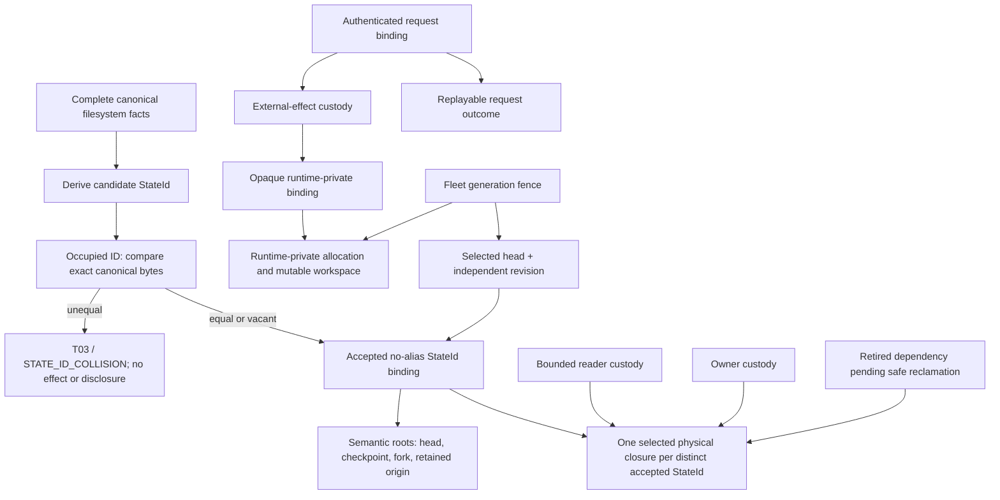
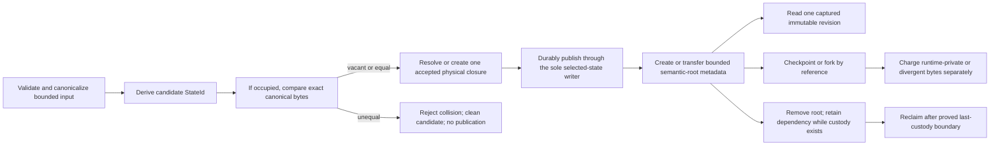

# Storage model contract index

Status: **SELECTION-NEUTRAL REVIEW CONTRACT — NO ARCHITECTURE OR PHYSICAL
METHOD SELECTED**

## Responsibility and authority

This document has only two normative responsibilities:

1. give reviewers one compact route through the storage contracts; and
2. define the common cost-record fields with which every candidate and every
   operation is compared.

It does not own a component topology, file layout, record schema, algorithm,
runtime adapter, phase graph, threshold, or winner. Those facts remain in their
owning contracts:

| Question | Sole owning contract |
|---|---|
| product behavior, identity, resources, terminals, faults, portability, prohibitions | [requirements](requirements.md) |
| candidate generation, deletion tests, joint architecture × physical-method choice | [architecture selection](architecture-selection.md) |
| zero-addition in-place reference challenger and boundary laws | [architecture](architecture.md) |
| canonical bytes and identity | [canonical format](canonical-format.md) |
| selected-state semantics, exact COW, OCC, recovery, retirement | [selected-state laws](state-store.md) |
| application ordering, replay, file operations, checkpoints/forks | [application coordination](application-coordination.md) |
| runtime effects, containment, runtime-private state, future adapters | [runtime-effect laws](runtime-effects.md) |
| public operation names and workspace-session behavior | [public API](public-api.md) |
| importer direction, fleet fence, cutover, compatibility retirement | [migration and cutover](migration-cutover.md) |
| method census and exact current algorithm count | [method registry](../algorithms/registry.md) |
| proof, cost, Pareto, novelty, holdout, and no-winner procedure | [selection protocol](../algorithms/selection-protocol.md) |
| numeric pass/fail predicates and evidence | [qualification gates](../qualification/gates.md) |
| current ordered phase/gate data | [gate catalog](../execution/gates.json) |

If prose here appears to select or contradict an owner, stop and follow the
owner. A future agent updates the owner first, then this index only if routing
or cost-field coverage changed.

## Current answer, without pretending a decision exists

| User question | Conclusive current answer |
|---|---|
| How many selected storage architectures? | **0.** Joint Gate 1A is `NOT_RUN`. |
| How many selected physical methods? | **0.** No hash, codec, layout, index, synchronization, reclamation, or scratch method has won. |
| How many new algorithms are mandated, proved, or selected? | **0 / 0 / 0.** The 21 functional families in the method registry are an audit census, not 21 algorithms. Standard-library and deletion outcomes are preferred where they satisfy the same contract. |
| Is Stage 4.6 the implementation base or a guaranteed comparator? | **No.** It is retained negative/reference evidence and is currently `INCOMPARABLE`; the clean product base is current main at the recorded e497 identity. |
| How many phases and gates exist in the current catalog? | **3 phases and 11 causal gates.** These counts are catalog data and a conservative current grouping, not validator literals or a global-minimum theorem. |
| What may execute now? | Artifact-system and Phase 0 packet preparation only. The active packet remains `DRAFT / NOT_RUN`; no result-bearing Phase 0 authority is sealed. |

## Simplicity and extensibility rule

The first implementation hypothesis is the
[zero-addition in-place challenger](architecture.md): pure canonical behavior
inside a lawful existing package plus effects performed by existing named
owners. It adds no component, service, process, port, registry, facade, plugin
system, or aggregate backend. This is a challenger, not a winner.

Joint Gate 1A may add a boundary only when an executable counterexample proves
that keeping the responsibility in an existing owner breaks at least one
accepted invariant—for example exclusive state ownership, a different
durability transaction, a privilege boundary, independent resource custody, or
a compile-time dependency rule. Every addition must also beat its fused and
deleted variants under the same correctness and cost record.

This produces a small implementation pattern without preselecting a topology:

```text
pure semantic function
  -> existing authority that owns the required state or effect
  -> runtime-private realization, only when an effect is required
```

The pattern is the smallest **candidate-construction rule**, not a mandatory
three-box architecture. A compiler-valid one-owner function is enough when no
cross-authority transition exists. A port or adapter becomes eligible only at
an actual authority/runtime boundary and only after its deletion test fails.

Extensibility means one stable semantic contract and explicit effect ownership,
not a menu of strategies. Canonical facts, `StateId`, selected-state behavior,
and public results contain no OCI, OverlayFS, WASI, Firecracker, VM, image,
snapshot-driver, or host-path identity. Current Linux/OCI realization details
stay private to the current runtime-effect owner. A future WASI or Firecracker
adapter must independently implement the same accepted effect contract and may
return `unsupported`; the current design adds no speculative plugin registry,
runtime enum, or generic backend.

## Semantic storage structure

The structure below is a truth-and-custody map. It is not a component, table,
record, or directory diagram.



The semantic distinctions are mandatory because they have different identity,
authority, lifetime, or recovery rules:

| Semantic fact | Why it cannot be silently collapsed |
|---|---|
| accepted `StateId` binding | identifies exact complete immutable canonical bytes/facts after no-alias admission; a digest hit alone is not equality, a mutable head revision, a physical locator, or a runtime handle |
| selected head + revision | supplies current-selection authority and OCC; identical content does not erase the accepted transition |
| semantic root | preserves a checkpoint, fork, head, or retained origin without copying its immutable closure |
| physical dependency closure | realizes one distinct state under the selected profile; representation remains open |
| owner and reader custody | prevent premature retirement during durable transitions and bounded reads |
| accepted request binding and outcome | provide authenticated replay semantics without redispatch |
| external-effect custody | resolves ambiguous mutating effects independently of public result retention |
| opaque runtime binding/workspace | belongs to the runtime-effect owner and never becomes canonical selected state |
| fleet generation fence | prevents mixed-generation selection during migration; it is not a state revision |

Before proposing a stored field or object, a candidate must try, in order:

1. delete it when its behavior is not required;
2. derive it from already authoritative bounded facts;
3. colocate it in an existing transaction when identity, authority, lifetime,
   recovery, and contention remain unambiguous; and
4. persist it separately only with a concrete ambiguity, ABA, replay,
   durability, recovery, cleanup, privilege, or resource counterexample.

That rule permits zero additional storage structures. It also prevents
“extensibility” from becoming an unused abstraction.

## Workflow

The owner documents define exact state machines. The cross-contract workflow is
only:



For a mutating runtime effect, application coordination first authenticates and
normalizes one request, captures the expected selected revision, durably
records the request/effect transition owned by the appropriate authority,
dispatches once through the runtime-effect owner, resolves ambiguity, then
publishes any new immutable selected state under OCC. Selected semantic state
and external runtime effects are not falsely presented as one atomic commit.

## Exact zero-copy COW law

For a single immutable state \(S\) with selected physical dependency closure
\(C(S)\), \(N\) semantic roots do not create \(N\) closures:

```text
D_selected(N, S)
  = D_closure(C(S))
  + sum(i = 1..N, D_root_metadata(i))
```

Therefore the immutable/checkpoint base is exactly **1× per distinct accepted
no-alias `StateId`**, not \(N×\). Root metadata may grow with the number of roots, but it
is bounded, separately attributed, and is not payload.

For every already accepted same-`StateId` checkpoint, reference-only fork,
rollback-to-existing-state, root move, ownership transfer, same-state
publication, and winning-fork root transfer—including every success, error,
duplicate, stale revision, cancellation, timeout, crash, restart, recovery,
delete, and last-root race:

```text
selected immutable payload bytes read       = 0
selected immutable payload bytes written    = 0
selected immutable payload bytes copied     = 0
new root-private physical closure bytes      = 0
```

Validation, warming, prefetch, verification, or recovery cannot be relabeled to
escape this whole-operation law. If such work reads payload, the candidate
fails the reference-only operation. Divergent successor content and
runtime-private mutable realization are allowed only as different, explicitly
charged categories.

The law does not authorize an occupied candidate digest to enter the fast path.
Candidate publication, import, recovery, and index reconstruction compare exact
canonical bytes before coalescing. Their bounded comparison I/O/CPU, scratch,
temporary custody, crash/replay, and cleanup are admission costs. Unequal bytes
return `STATE_ID_COLLISION`; no accepted ID, alias, head, root, mapping, index,
closure, revision, custody, capacity credit, or incumbent disclosure changes.

For multiple distinct states:

```text
D_total
  = D_unique_selected_closures
  + D_root_metadata
  + D_divergent_unshared_bytes
  + D_runtime_private
  + D_live_scratch
  + D_retired_pending_safe_reclamation
```

The candidate must demonstrate which bytes are shared and why, but cannot
assume block-level deduplication, reflink, FUSE, or a filesystem-specific
feature. Reflink and FUSE are prohibited in every role, including optional or
runtime-private acceleration. Any other qualified runtime-private acceleration
does not weaken the selected-state COW law.

## Memory use and safety

Memory is justified only for bounded in-flight computation:

- canonical encode/decode windows;
- bounded read/write and transport buffers;
- bounded merge/fan-in windows when an admitted method needs them;
- finite request, root, reader, custody, queue, and cancellation control state;
  and
- bounded runtime-private realization owned and contained by its runtime.

Memory is not durable truth, a repository-sized index, an indefinite pin, a
persistent cache, a full-tree materialization requirement, or a substitute for
storage accounting. There is no selected persistent storage cache. Any
candidate volatile cache is optional derived state and must have one owner,
precharged bytes and entries, deterministic eviction, cancellation-safe
release, terminal/restart cleanup, and a measured zero-work cleanup plateau.
Deleting the cache must preserve correctness.

Every resource dimension is admitted before first use. The exact population,
unit, owner, ceiling, acquisition order, overload result, terminal cleanup, and
recovery evidence are frozen by Phase 0 and qualified under
[resource gates](../qualification/gates.md#qg-res-001--capacity-memory-and-concurrency).
Partial multi-resource acquisition either cannot occur or is rolled back before
any durable or external effect. Cancellation joins descendants before volatile
claims return. Durable cleanup debt stays charged until evidence proves
reclamation.

Trusted storage-side work and each untrusted sandbox runtime have independent
finite containment. One cgroup, process limit, or observed heap cannot stand in
for the other. Process descendants, file descriptors, mappings, queues,
temporary files, inodes, tasks, and retained retired bytes are included.

The memory record for every operation reports:

```text
steady resident bytes
peak incremental bytes
bytes by owner and containment boundary
entries/windows/fan-in represented by those bytes
reservation granted before first allocation
overload disposition
terminal and cancellation cleanup latency
post-cleanup plateau and permitted measurement error
```

## Common cost record

Big-O alone hides constants, I/O direction, copy amplification, retained space,
contention, and cleanup. Every operation × terminal × applicable-fault cell
uses the same record:

| Dimension | Required fields |
|---|---|
| identity | operation, semantic cell, artifact hashes, environment, selected profile, input distribution |
| variables | bytes, entries, path/name bytes, roots, distinct states, changed bytes, concurrency, fan-out, queue depth, merge fan-in, pass count |
| latency/CPU | best, expected, worst, and amortized bounds with explicit preconditions; measured distribution when required |
| payload I/O | selected immutable bytes read/written/copied; divergent bytes read/written; runtime-private bytes |
| metadata I/O | reads, writes, syncs, directory syncs, transaction/conditional-write count |
| storage | shared closure, root metadata, divergent private, scratch peak, retired pending, final persistent delta |
| memory/resources | heap/RSS/cgroup peak, buffers, mappings, FDs, inodes, tasks, workers, queues, permits |
| concurrency | linearization point, synchronization operations, contention regime, retry/abort work |
| cleanup | terminal owner, cleanup work/latency, restart work, plateau, unreclaimed debt |
| evidence quality | analytical/measured label, provenance, sample/corpus, uncertainty/error, comparator eligibility |

An analytical upper bound is not a measurement. An empirical median is not a
worst-case bound. A historical result is not comparable unless exact
artifact/corpus/environment and the Phase 0 comparator contract admit it.

## Operation complexity obligations

The table gives unavoidable work or hard invariants. It does not choose an
upper-bound algorithm; every candidate supplies and proves its own bound.

Let:

```text
B       canonical input or returned payload bytes
F       filesystem facts examined
K       returned entries
P       normalized path/name bytes examined
R_root  number of semantic-root rows
R_pin   number of pin or backup-hold rows
R_view  number of live reader or read-view rows
R_cust  number of unresolved custody rows relevant to the operation
U       number of distinct accepted live no-alias StateIds
Delta   divergent or changed canonical bytes
C       admitted concurrency
W       bounded I/O window
J       external-sort merge fan-in
L       number of merge passes
```

| Operation class | Unavoidable work / invariant | Candidate must additionally prove |
|---|---|---|
| validate + canonical encode + identify/admit new facts | \(\Omega(B + F)\) byte/fact inspection when identity is not already trusted; an occupied ID additionally requires exact canonical equality | deterministic bound, bounded windowing, malformed-input limit, canonical equivalence, collision cleanup/replay |
| decode / reconstruct | \(\Omega(B + F)\) for a complete returned realization | bounded memory, corruption localization, no history-depth term |
| lookup metadata | at least \(\Omega(P)\) to consume the path | worst/expected metadata I/O and adversarial-name behavior independent of LayerStack depth |
| read range | \(\Omega(P + B_{returned})\) | exact revision capture, authorization, bounded buffer, corruption/error costs |
| deterministic list | \(\Omega(P + K + returned-name-bytes)\) | stable order, pagination/cursor rule, bounded memory and adversarial directory behavior |
| accepted same-state checkpoint/fork/root transfer | exact selected-payload read/write/copy = `0`; new private closure = `0` | authoritative no-alias binding; name every scanned or indexed population; give finite exact best, expected, worst, and amortized metadata-I/O, update, memory, synchronization, and contention bounds as functions of every applicable metadata cardinality (`R_root`, `R_pin`, `R_view`, `R_cust`, and any candidate-specific row set); keep those bounds independent of selected immutable closure/payload bytes; prove last-root races |
| create divergent successor | at least the bytes/facts whose canonical truth must be consumed or emitted | full cost vector; no claim that \(\Delta\)-only work is possible until the selected representation proves it |
| publish/OCC commit | at least one authenticated current-revision decision | exact linearization, sync/conditional-write vector, conflict/retry work, crash cuts |
| rollback to existing state | same zero-copy law when the target no-alias `StateId` is already accepted | authorization, revision, metadata, custody, stale/duplicate behavior |
| request replay | at least authenticated binding lookup and exact outcome return | freshness, pruning, disclosure, no external-effect redispatch |
| delete/prune/root release | bounded root transition; payload copy remains zero | reader/owner custody, last-reference safety, retained-space bound, cleanup plateau |
| recovery/scrub | no universal bound is assumed | bytes/facts scanned, repair authority, restart budget, corruption outcomes, whether work is eager or bounded/lazy |
| migration/import | \(\Omega\) of actual legacy facts/bytes that must be interpreted | source coverage, idempotence, fence checks, capacity/scratch peak, crash/restart |
| runtime realization | selected state remains immutable | runtime-private bytes, containment, activation/teardown, unsupported result for an unimplemented runtime |
| optional external ordering/sort | \(\Omega(X)\) to consume \(X\) input bytes | exact run/pass I/O, scratch lifetime, fan-in memory/FD caps, stable ordering, failure cleanup |

No operation receives a performance guarantee until the exact selected artifact
passes the sole Phase-0-frozen `QG-PERF-001` comparator. The goal is to improve
on the qualified incumbent, but documentation cannot guarantee an unbuilt
winner.

## Why an external sort can show 2× I/O or scratch

There is no blanket two-copy storage rule. If one candidate uses an external
merge sort over \(X\) source bytes, its accounting is event-based:

```text
I/O
  = source bytes read
  + initial run bytes written
  + sum(each merge pass input bytes read + output bytes written)
  + framing/control I/O
```

When run bytes are approximately \(X\), `L` counts merge passes after initial
run generation, and the accounting includes the source read plus initial-run
write, this is approximately:

```text
X source read + X initial-run write + 2XL merge I/O
  = 2X(1 + L)
```

The formula is a candidate-specific byte-I/O upper model, not a disk-capacity
law and not evidence that checkpoints are copied. Exact accounting must name
whether the final merge streams directly to its consumer, whether that final
stream is already included in the last-pass read/write pair, whether framing
changes byte length, and which initial/final reads are included; otherwise the
shorthand is rejected.

During a crash-safe merge pass, old runs and newly written runs may coexist
until the new pass is durable. That can approach one input-run set plus one
output-run set—roughly 2× the **temporary sortable data**—but:

- it is bounded scratch, not a second immutable selected-state base;
- it is charged separately from \(D_closure(C(S))\);
- it exists only if the chosen method requires it;
- previous runs are reclaimed at the proved commit boundary;
- failure/cancellation/restart must leave no uncharged scratch; and
- another candidate with lower peak scratch is preferred when all hard gates
  and earlier lexicographic costs are equal.

Accordingly, the only universal checkpoint statement remains:

```text
N roots for one accepted no-alias StateId -> one immutable physical closure (1×), never N×
```

Neither `D_sort_peak <= 2 × ...` nor `2X(1 + passes)` is a universal design
requirement. Both must be derived from the exact selected sort event trace—or
deleted when no external sort wins.

## Checkpoint, fork, MCTS, and parallel rollout

Storage knows checkpoints and roots; it does not own MCTS policy, rollout
scheduling, scoring, backpropagation, or pruning. External orchestration may
start bounded fan-out from an accepted immutable checkpoint:

```text
one checkpoint StateId / one immutable closure
  -> N bounded root references
  -> zero or more independently charged divergent workspaces
  -> explicit winner root transfer or complete loser cleanup
```

Inactive roots retain no mutable runtime allocation, worker, descriptor, queue,
permit, or cache. Active divergent work is runtime-private or a newly published
distinct state and is not relabeled as a checkpoint copy. Phase 0 freezes
fan-out populations and caps; qualification covers `1/2/4/16/64/maximum`,
admitted active rollouts, all terminal states, cancellation, crash/restart,
winner/loser races, and cleanup plateau.

## Storage safety and automatic cleanup checklist

| Concern | Required evidence | Owner |
|---|---|---|
| duplicate immutable base | per-operation payload counters prove exact zero-copy COW | selected-state laws + `QG-SEM-001` |
| volatile cache | correctness passes with cache disabled; entry/byte cap, eviction, every-terminal cleanup, zero-work plateau | resource contract + `QG-RES-001` |
| persistent cache/index | absent unless Gate 1A independently proves necessity; current requirements prohibit repository-sized/persistent cache assumptions | requirements + Gate 1A |
| scratch files/runs | precharged bytes/inodes, unique ownership, crash discovery, bounded restart cleanup, final plateau | selected profile + `QG-RES-001` |
| reader/owner pins | bounded acquisition, cancellation-safe release, no premature reclamation, no indefinite lease | selected-state laws |
| retired dependencies | remain charged and inaccessible for reuse until the exact safe boundary | selected-state laws + operations gate |
| corrupt/partial publication | fail closed, preserve prior authoritative revision, prove every crash cut | canonical/selected-state laws + `QG-CRASH-001` |
| request/effect ambiguity | replay does not redispatch; recovery owns unresolved effects | application/runtime-effect laws |
| untrusted runtime growth | independent cgroup or proved equivalent includes descendants and teardown | runtime-effect laws + `QG-RES-001` |
| process restart | durable truth reconstructs without resident index/cache or elapsed-time inference | selected profile + crash qualification |

“Auto-cleaned” means the owner and trigger are deterministic and independently
measured. It never means an unbounded best-effort background task.

## Candidate rejection rules

A profile is rejected before performance scoring if it:

- copies selected immutable payload for an accepted same-state reference operation;
- treats a raw digest match as equality, aliases unequal canonical bytes, or lets
  a colliding candidate mutate authority/capacity or disclose the incumbent;
- stores canonical truth in memory or runtime-private state;
- adds a field, service, adapter, cache, index, registry, or background worker
  without defeating its deletion/fusion challenger;
- embeds OCI/Linux/runtime-specific identity in canonical or selected semantic
  state;
- exposes physical layout or runtime method choices through the public API;
- relies on LayerStack depth, writable dual truth, persistent refcounts,
  reflink, FUSE, a database/KV abstraction, or unbounded resident metadata;
- cannot precharge every resource dimension or clean every terminal/fault cell;
- cannot resolve external-effect ambiguity without unsafe redispatch;
- changes the judge, holdout, thresholds, or comparator after seeing results;
  or
- lacks exact source/build/run provenance.

Only survivors enter the guardrail-constrained Pareto and lexicographic
procedure. `NO_WINNER` is required if none survive.

## Research and experiment backlog

These are Phase 0 questions, not selected mechanisms:

| Question to freeze or falsify | Evidence needed | Decision point |
|---|---|---|
| Can an even smaller package-deleting topology satisfy every owner law? | generated compile-valid transforms, deletion counterexamples, call/authority graph | Gate 1A |
| Which physical representations satisfy full semantics without forbidden dependencies? | finite profile product, standard-first alternatives, crash/resource proofs | Gate 1A |
| Can canonicalization remain streaming for the maximum admitted tree? | adversarial trees, bounded-window proof, exact memory/I/O | Phase 0 protocol; Gate 1B |
| Does identity admission remain no-alias under a forced digest collision? | qualification-only injectable digest seam, exact-byte oracle, publish/import/recovery/index/rebuild/ref-fast-path/last-root cases, production-build absence proof | Phase 0 protocol; Gate 1B/1C/1E |
| Is external sorting needed at all? | maximum-directory corpus, standard in-memory/streaming alternatives, cap proof | Gate 1A/1B |
| How is corruption detected and localized? | bit-flip/truncation/reordering corpus, recovery outcomes, scan costs | Phase 0; Gate 1B/1C |
| What is the exact root/reader/retirement race model? | executable model plus last-root, crash, timeout, cancellation schedule | Phase 0; Gate 1C |
| How are request outcomes safely pruned without redispatch? | freshness proof, replay corpus, retention bound, disclosure tests | Phase 0; Gate 1D |
| What maximum checkpoint and rollout fan-out is admitted? | workload population, capacity model, `1/2/4/16/64/max` measurements | Phase 0 |
| Do caches help after their cleanup and containment cost? | cache-disabled control, churn/fault experiments, plateau evidence | Gate 1A/1C |
| Can WASI or Firecracker satisfy the current semantic/effect contract? | disposable adapter spike and conformance result, including `unsupported` | Gate 1A/1D |
| How much migration scratch and retained capacity is required? | actual-source inventory, import rehearsal, crash/restart event trace | Gate 1E/1F |
| Which metrics detect leak, cleanup, corruption, or fence drift? | bounded-cardinality metric contract and fault-injection sensitivity | Phase 0; Gate 1F/2B |
| How are encryption, secret handling, and tenant separation preserved? | threat model, key/credential ownership, zeroization and disclosure tests | Phase 0 security contract |
| How are backup/restore and disaster recovery validated? | exact artifact/state identities, restore drills, RPO/RTO contract if applicable | Phase 0; Gate 1F |

Add a question only when it maps to an owning requirement, decision, gate, and
falsifiable evidence record. Do not add a component merely to “leave room” for
the answer.

## Phase handoff

Phase 0 must freeze the finite candidate universe, operation/terminal/fault
population, exact cost variables, numeric resource caps, comparator, corpus,
holdout, and evidence procedures without selecting a profile. Gate 1A jointly
evaluates complete topology × physical-method pairs. Later gates implement and
qualify only the accepted exact pair. The current sequence is read from
`execution/gates.json`; this index deliberately does not copy its transition
table.

Any new measurement, field, algorithm, component, runtime promise, or threshold
written here before its owner accepts it is a contract violation, not
preparation.
