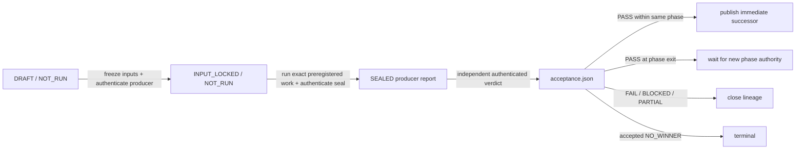

# Execution artifact contract

Status: **HISTORICAL EXECUTION ARTIFACT CONTRACT — DO NOT RUN FOR CURRENT V2**

> This directory's three-phase gate system is superseded as the current V2
> execution path. Preserve it as evidence only. Current work follows the
> [V2 program plan](../../../ephemeral-sandbox-v2/PLAN.md), selected
> [R0 architecture](../../../ephemeral-sandbox-v2/architecture_design.md), and
> [archive compatibility map](../../README.md).

This directory turns the three-phase migration plan into reproducible records.
It does not select an architecture, storage profile, component, algorithm,
schema, runtime, or benchmark winner. The current catalog has three operational
phases and 11 causal gates; the validator derives both counts and all paths from
the catalog rather than hard-coding them.

The machine topology is [`gates.json`](gates.json), mutable lifecycle state is
[`state.json`](state.json), and the human causal argument is
[`phases/phase-isolation-and-ordering.md`](../phases/phase-isolation-and-ordering.md).
If an execution record conflicts with an owning requirement, phase, selection,
or qualification document, stop and repair the conflict. An artifact packet
cannot overrule its source contract.

## Directory contract

```text
execution/
  README.md
  gates.json                         # immutable ordered gates and legal PASS outputs
  state.json                         # authenticated frontier plus its latest transition
  validate.py                        # dependency-free fail-closed validator
  schemas/
    gate-catalog.schema.json
    execution-state.schema.json
    manifest.schema.json
    acceptance.schema.json
    input-lock.schema.json
    phase-entry-attestation.schema.json
  packet-template/
    packet.md                         # five exact marker-separated responsibilities
    manifest.json
    acceptance.json
  phase-00/
    00-evidence-seal/                # sole instantiated packet; DRAFT / NOT_RUN
      <same three persistent files>
      evidence/                      # created only when real immutable bytes exist
  phase-01/                          # absent until Phase 0 PASS plus new phase authority
  phase-02/                          # absent until Phase 1F PASS plus new phase authority
  history/                           # absent until a packet archive or prior state exists
    states/<prior-state-sha256>.json # exact raw predecessor state for transition proof
    <gate-id>--<manifest-sha256>/    # exact invalidated packet bytes
```

No empty future phase, packet, history, or evidence directory is permitted.
Canonical packet paths are derived from catalog rows. `state.json` stores the
instantiated catalog-prefix length, invalidation history, and at most one
authenticated transition from an exact retained predecessor state. It does not
repeat an active gate, stop state, gate list, phase graph, or phase authority.
The final instantiated packet and its independent disposition derive the
frontier:

- `NOT_RUN` is the single open gate;
- `PARTIAL`, `FAIL`, or `BLOCKED` closes that lineage;
- same-phase `PASS` requires publication of the immediate successor;
- cross-phase `PASS` waits for separate next-phase authority;
- exact Phase 1A `NO_WINNER` is terminal; and
- final Phase 2D `PASS` completes the mandatory DAG.

## One packet, three persistent files

| File | Sole responsibility | Why it remains separate |
|---|---|---|
| `packet.md` | exact marker-separated plan/specification/decisions, algorithms, experiments/benchmarks, verification, and handoff responsibilities | all five share one writer, lock instant, invalidation frontier, result-access boundary, and producer seal; exact ordered markers preserve independent semantic validation and domain-separated section hashes |
| `manifest.json` | producer seal over every controlled byte and declared output | it must be finalized before an independent verdict and cannot hash that verdict |
| `acceptance.json` | independent verdict over one exact manifest and legal output set | fusion would permit self-acceptance or create a hash cycle |

Three is the current locally irreducible stopping point. A hostile 7→3
countermodel proved that the five former Markdown files had no independent
writer, time, hash, invalidation, reuse, or acceptance boundary; retaining
them separately was presentation structure, not architecture. They are now
five ordered regions inside `packet.md`, including nested plan/specification/
decision and experiment/benchmark markers. `validate.py` checks every region
independently. The exact digest of a region named `s` is derivable as:

```text
SHA-256("ephemeral-sandbox/v2/packet-section" || NUL ||
        UTF-8(s) || NUL || exact-region-UTF-8-bytes)
```

The whole-file artifact digest in `manifest.json` binds all region bytes and
their order, so persisting five redundant section digests would add fields
without adding integrity. The two JSON files remain separate because they sit
at different authority and hash boundaries. `evidence/` is on demand, not a
fourth placeholder: it appears only when an immutable input, receipt, lock, or
result exists. Additional packet-root files are forbidden; all additional
controlled bytes live below `evidence/`.

## Six formats, not six services

The six schemas describe byte formats. They do not prescribe components,
classes, daemons, databases, or deployment boundaries.

`validate.py` is the sole package-acceptance authority. The six JSON Schemas
are interoperability projections of that executable contract, not a second
topology owner. The validator canonicalizes every non-annotation schema branch
and compares it with a reviewed semantic-projection digest. Adding a permissive
or reject-all branch, weakening a pattern, removing an unknown-field guard, or
changing any other validation keyword therefore fails even if the root property
names remain unchanged. `$schema`, `$id`, `title`, and `description` are the only
excluded annotations; `$schema` and `$id` are checked separately. An intended
schema-body change requires simultaneous validator-contract review and a new
hostile seal. Catalog cardinality is never embedded in the execution-state
schema: the current 11 gates and every future legal count are derived only from
`gates.json`.

| Format | Writer and time | Irreducible boundary |
|---|---|---|
| gate catalog | plan owner before execution | immutable order and legal output sets must not move with mutable progress |
| execution state | authenticated lifecycle publisher after packet visibility | frontier advance/invalidation must bind exact prior state and packet bytes without rewriting accepted packets |
| manifest | gate producer after controlled bytes stop changing | the producer needs an acyclic exact content seal |
| acceptance | independent acceptor after manifest sealing | the verdict must bind producer bytes without being authored by the producer |
| input lock | authenticated gate producer before any result access | preregistration and consumed authority/input bytes must be provably frozen |
| phase-entry attestation | authenticated phase authorizer before result dispatch | exact actors, capabilities, validity, revocation, and receipt binding cannot be inferred from predecessor success or mutable state |

Identity repeats only across one of these authority/time boundaries, where a
wrong-path write, stale lineage, swapped artifact, or offline archive must fail
by direct comparison. The same producer triple deliberately appears in the
pre-result input lock and the post-result manifest seal; exact equality proves
that the preregistered producer, not another actor, sealed the result. Derivable
projections are removed: no active-gate field, stop-state field, standalone
transition-effect record, packet-authority field, or second topology table
exists.

## Packet lifecycle



`DRAFT` is preparation only. It has no input lock, result evidence, final
producer report, or acceptance. `INPUT_LOCKED` means only that exact pre-result
bytes and authority are frozen; it is not a result or verdict. `SEALED` means
the exact input-lock producer has signed the final manifest after controlled
bytes stopped changing. `INVALIDATED` is a lifecycle fact in `state.json`,
never an editable status in preserved packet bytes.

`SEALED / NOT_RUN` is the legal interval after the authenticated producer
report exists and before the independent acceptor writes a verdict. The sealed
manifest must already pass its own external policy binding in that interval;
leaving acceptance at `NOT_RUN` never postpones or bypasses producer-seal
authentication.

Every pre-result packet declares every catalog-allowed output ID as `EXPECTED`.
A sealed producer may change rows to `PRODUCED` or `NOT_APPLICABLE`; a final
independent `PASS` promotes only the exact produced digest set allowed by the
catalog. Non-PASS verdicts accept no outputs. Producer report status and
acceptor disposition remain separate so an acceptor can reject or downgrade
without rewriting producer bytes.

## Authority contract

### One principal representation

Every authenticated actor is the exact triple:

```text
principal_id
credential_fingerprint
control_domain_fingerprint
```

An authenticated action also carries a bounded base64url `proof`. A phase
actor additionally carries a sorted, duplicate-free list of exact
`produce:<gate-id>` and `accept:<gate-id>` capabilities; wildcards, roles, and
scope strings grant no authority. The union of those lists must cover exactly
both capabilities for every gate in the phase, so entry cannot silently leave
a later gate unauthorized or grant authority outside the phase. No actor may
hold both capabilities for the same gate. Producer and acceptor must differ on
all three axes. The phase authorizer must differ from every actor on all three
axes. The verifier selected for an artifact must likewise be independent from
the actions it verifies.

The fingerprints inside a packet are claims to be authenticated, not
self-proving facts. The external verifier must derive credential validity and
control-domain membership from signed trust evidence. It must not accept a
packet's control-domain string merely because the JSON is well formed.

Each action proof binds the complete action rather than only proving possession
of a credential. The policy-selected verifier computes RFC 8785 JSON Canonical
Serialization of the artifact after removing only the action's `proof` member,
prefixes the canonical bytes with the exact domain string and NUL byte below,
and verifies the proof over the resulting SHA-256 digest:

| Packet action | Omitted member | Exact domain string |
|---|---|---|
| phase authorization | `authorizer.proof` in the phase-entry attestation | `ephemeral-sandbox/v2/phase-authorizer` |
| gate input lock | `producer.proof` in the input lock | `ephemeral-sandbox/v2/gate-producer` |
| gate result seal | `producer.proof` in the sealed manifest | `ephemeral-sandbox/v2/gate-producer-seal` |
| gate acceptance | `accepted_by.proof` in the acceptance | `ephemeral-sandbox/v2/gate-acceptor` |

No other field is omitted. This binds the proof to the catalog, phase, gate,
lineage, timestamps, capabilities or outputs, predecessor or manifest edges,
and disposition present in that artifact while keeping the hash graph acyclic.
The sealed manifest producer triple must equal the input-lock producer triple
exactly; the two proofs cover different bytes and times and are never copied.
The local validator deliberately treats `proof` as bounded opaque base64url;
only the externally pinned verifier interprets its signature/evidence format.

An authenticated execution-state transition uses the same rule independently:
remove only `transition.published_by.proof`, use exact domain
`ephemeral-sandbox/v2/state-publisher`, and bind the resulting canonical state
bytes. Its `published_by` action principal and the publication provider named
by `transition.publication.authority` must differ on principal, credential, and
control-domain axes. The external state verifier additionally proves the
provider's genuine committed receipt; a self-authored transition is not a
commit.

### Phase entry and transitive inheritance

The first locked gate of each phase contains exactly two extra input-lock
snapshots:

```text
authority/phase-<id>-authorization.receipt
authority/phase-<id>-entry-attestation.json
```

The roles are exactly `phase authorization receipt` and
`phase entry authorization attestation`. The attestation binds the catalog,
phase-entry gate, lineage, exact receipt digest, authenticated phase actors,
their exact gate capabilities, the distinct authorizer, validity interval, and
revocation evidence.

A later same-phase gate must not repeat or replace those authority pointers.
Its exact predecessor row resolves to preserved manifest and acceptance bytes;
the validator follows that chain transitively until it reaches the first gate
of the same phase. Every traversed predecessor must be an independently
accepted `PASS`. Phase exit never creates successor-phase authority.

### External per-artifact verifier policy

Protected artifacts are the phase-entry attestation, every input lock, every
sealed manifest, every final acceptance, and every non-bootstrap execution
state. They require two CLI arguments from an authenticated execution wrapper:

```text
--authority-verifier-policy <absolute-path>
--authority-verifier-policy-sha256 <sha256-of-exact-policy-bytes>
```

The policy remains outside this mutable package under independently
authenticated, versioned, write-denied custody. It is deliberately not a
seventh package schema. The validator opens its normalized absolute path once
with no-follow component traversal, hashes and parses the same raw bytes from
that descriptor, and never reopens the pathname. Policy version is exactly
`3`; its exact root fields are `policy_version`, `catalog_sha256`, and
`bindings`. Each sorted, unique binding contains:

```text
key:
  kind                    phase-entry-attestation | input-lock | manifest |
                          acceptance | execution-state
  phase_id
  gate_id
  lineage_id
  artifact_sha256
  bound_sha256
use:                      CURRENT_AUTHORITY | HISTORICAL_VERIFY_ONLY |
                          ONE_SHOT_STATE_COMMIT
verifier:
  principal_id
  credential_fingerprint
  control_domain_fingerprint
  executable              absolute, regular, executable, no symlink indirection
  build_sha256
  trust_root_sha256
```

The validator derives every lookup key from structurally valid artifact bytes;
the packet or state cannot choose its verifier or trust root. The exact
bindings are:

- phase-entry attestation bytes to exact authorization-receipt bytes;
- input-lock bytes to the transitive phase-entry attestation bytes;
- sealed manifest bytes to exact input-lock bytes;
- final acceptance bytes to exact manifest bytes; and
- each non-bootstrap execution-state object to the exact retained prior-state
  bytes named by `transition.prior_state_sha256`.

Per-artifact bindings allow current and preserved historical artifacts to use
different retained verifier builds or trust roots after rotation. Replacing a
global verifier tuple is insufficient because it makes either current or
historical evidence unverifiable. One exact binding cannot be both current and
historical simultaneously. `ONE_SHOT_STATE_COMMIT` is neither: it proves one
exact frontier publication and is not reusable phase authority.

The validator derives use rather than accepting a mode from packet bytes. Only
protected artifacts in the still-open canonical phase are
`CURRENT_AUTHORITY`; archived packets, completed earlier phases, and closed
`PARTIAL`/`FAIL`/`BLOCKED` lineages are `HISTORICAL_VERIFY_ONLY`. At a
cross-phase wait or terminal state no reusable current grant exists. Rotating a
verifier or trust root during an open phase invalidates that lineage: retained
old rows verify only the old exact bytes, while a new exact lineage receives
new current bindings.

Use is derived independently for each protected artifact, not inherited from
the packet that happens to consume it. Thus a canonical phase-entry
attestation can remain `CURRENT_AUTHORITY` while an invalidated descendant's
lock and acceptance are `HISTORICAL_VERIFY_ONLY`. Ordinary same-phase
invalidation does not manufacture a new phase grant; changing the attestation,
its verifier, or its trust root still invalidates the phase-entry lineage.

For each binding, the validator pins policy bytes, verifier build bytes,
trust-root identity, artifact bytes, bound bytes, catalog, phase, gate, lineage,
and use. Verifier code is dispatched only after every non-executable package,
filesystem, schema, lineage, and package-seal check has passed. Any policy
path/digest/shape/binding error is a dispatch barrier, and the first authority
failure prevents all later verifier launches in that run. The normalized
verifier locator is opened once with no-follow component traversal. The source
must be a regular, executable, non-write-mode object of at most 64 MiB. The
validator copies its exact bounded bytes into a new close-on-successful-exec
anonymous executable memfd,
checks that the source identity did not change during the copy, removes write
mode from the clone, and atomically applies
`F_SEAL_WRITE | F_SEAL_GROW | F_SEAL_SHRINK | F_SEAL_SEAL`. It verifies the
complete seal mask, closes the source, and only then hashes and parses the
sealed clone. A source change during copying fails source-identity or build-
digest validation; a source change after sealing cannot change the clone.

The sealed clone must be a self-contained native ELF32 or ELF64 object. A
strict fail-closed parser rejects truncated objects, unsupported class or byte
order, malformed or out-of-bounds headers, program tables, or segments,
`PT_INTERP`, and `DT_NEEDED`. Thus the exact post-seal hashed object is the
complete native loader/library closure. The verifier contract also forbids
delegation to an unpinned plugin, helper, interpreter, shared object, or
dynamically loaded code. The validator rechecks the seal mask in parent and
child and executes that descriptor on Linux with fixed `argv[0]` and
environment, `/dev/null` stdin, a 30-second wall deadline, a bounded CPU
interval, and separate 64-KiB stdout/stderr limits. It accepts only
exit `0`, stdout exactly `PASS\\n`, and empty stderr. There is no source-path,
interpreter, dynamic-loader, shared-library, helper, plugin, unsealed-FD, or
copy-to-disk execution fallback; protected validation fails closed without
memfd sealing and exact-descriptor execution.

The immutability closure has an explicit finite resource cost. Bindings are
verified sequentially. One dispatch owns at most one 64-MiB sealed memfd, one
transient copy chunk of at most 1 MiB, the read-only source descriptor, the
clone descriptor, two pipes, one selector, and one child. After exact-fd exec,
the child maps the memfd instead of receiving a second verifier-byte buffer; it
is capped at 256 MiB of address space, 32 descriptors, zero regular-file output
bytes, no core dump, and the bounded CPU/wall interval. Protected dispatch
fails closed unless the validator has nonzero real, effective, and saved UIDs
and empty inherited, permitted, effective, and ambient Linux capability sets;
only then is `RLIMIT_NPROC = 1` an enforceable one-process bound rather than a
privilege-sensitive hint. `/proc/self/status` absence or malformed capability
state also fails closed.

The brief pre-exec child inherits validator mappings through OS COW and performs
only fixed setup. The watchdog continues after early stdout/stderr closure.
Normal watchdog and exceptional finalization paths invoke one process-group
termination primitive and retry interrupted direct-child reaping. Every open,
clone, pipe, selector, process group, timeout, output-overflow, rejection, and
exception path therefore closes, reaps, or kills its owned resource. The
close-on-exec clone is never cached and is closed by the parent after that
binding. This verifier memory is control-plane scratch, not selected-state
payload and not an exception to the zero-copy COW law.

This is deliberately narrower than V1 sandbox process isolation. A V1
workspace admits a bounded process tree and relies on an externally managed
PIDs cgroup plus process-scope supervision; it does not prove one process with
`RLIMIT_NPROC`. Reusing that launcher here would make package verification
depend on an OCI daemon, cgroup-management authority, and a live sandbox
control plane. The package verifier therefore remains a local, unprivileged,
single-process, fail-closed bootstrap path. This choice neither selects OCI for
the storage architecture nor prevents a future runtime adapter from enforcing
the equivalent bound with a WASI- or Firecracker-native supervisor.

The verifier owns proof, signature, credential, revocation, control-domain,
trust-policy, and provider-receipt semantics. For an `execution-state` binding,
it retrieves under the pinned trust root the signed receipt named by
`transition.publication.operation_id` and proves `COMMITTED`, the exact raw
successor digest, exact prior token/digest, method-specific lease/fence values,
and object identity. The lifecycle publisher, commit provider, and verifier
must be independent on all three identity axes. Independently authenticated,
write-denied source custody and retained audit evidence remain mandatory for
provenance and pre-clone admission. They are no longer the only protection for
the digest-to-execution interval: the post-copy build digest and irreversible
memfd seals make the executed bytes immutable even if the source inode or
pathname changes after cloning.

For `transition.kind == INVALIDATE`, the validator also supplies exactly these
fixed locator arguments after resolving one receipt row from the canonical
replacement lineage:

```text
--invalidation-receipt <absolute-content-addressed-path>
--invalidation-receipt-sha256 <trigger_sha256>
--invalidation-owner-gate-id <earliest-affected-gate-id>
```

These arguments do not make the package row self-authenticating. A
`ONE_SHOT_STATE_COMMIT` verifier may return `PASS` only after opening the exact
receipt without symlink traversal, hashing those bytes, authenticating their
external format under the binding's pinned trust root, and proving that the
authenticated receipt binds all of the following at once:

- the exact `transition.prior_state_sha256` and retained prior-state bytes;
- the exact ordered `transition.prior_packets` frontier, including every
  manifest and acceptance digest;
- the exact `transition.replacement` and `invalidations[-1].trigger_sha256`;
- one explicit changed consumed input, authority/revocation, schema/build, or
  evidence-predicate identity; and
- the earliest owner derived from that changed dependency.

Arbitrary content-addressed bytes, a valid receipt for another prior state,
frontier, replacement, trigger basis, or owner, and a valid receipt preserved
in a later or unrelated lineage must all fail. This remains an opaque external
evidence format under the existing verifier/trust-root boundary; it does not
create a seventh package schema or service.

The checked-in Phase 0 draft and exact bootstrap `state.json` contain no
protected artifact and therefore do not require a policy yet. Before any
result-bearing Phase 0 action, the packet must move to `INPUT_LOCKED` with valid
phase authority and the policy must be supplied. Every later state advance or
invalidation likewise requires its one-shot state binding and genuine commit
receipt.

## Dependency and publication rules

1. **Eligibility first.** Phase 0's checked-in draft is the sole bootstrap
   exception. A same-phase successor is published only after exact predecessor
   `PASS`. A later phase is first published as an authority-bearing
   `INPUT_LOCKED` packet after predecessor acceptance and separate phase
   authorization.
2. **Exact edges.** `manifest.json` is the sole machine owner of the immediate
   predecessor lineage, manifest digest, and acceptance digest. The plan region
   of `packet.md` names the logical consumer relationship without copying
   digest literals.
3. **Input lock before results.** Snapshot `packet.md` and every other
   pre-result input as exact bytes or a canonical immutable receipt under
   `evidence/input-lock/snapshots/`. Build `evidence/input-lock.json`; it never
   hashes itself or a manifest. The locked and sealed `packet.md` must remain
   byte-identical to its snapshot. Its exact markers preserve the five
   separately validated semantic responsibilities.
4. **Immutable evidence.** Raw results use content-addressed or unique run
   paths. Correction adds a superseding object; it never overwrites old bytes.
5. **Acyclic authenticated producer seal.** After work, hash every controlled
   regular file except `manifest.json` and `acceptance.json`; finalize outputs,
   report, and `generated_at`; copy the exact input-lock producer triple into
   the manifest; sign the manifest under the distinct result-seal domain; set
   maturity `SEALED`; and stop changing controlled bytes.
6. **Independent verdict.** The authenticated acceptor verifies phase
   authority, the input-lock proof, exact producer equality, the separately
   authenticated manifest seal, evidence, gate predicates, and legal output
   set, then writes the one final acceptance over the exact manifest.
7. **Successor consumes both seals.** Neither the predecessor manifest nor its
   acceptance alone is sufficient.

### Atomic visibility and concurrency

The raw SHA-256 of prior `state.json` bytes is the authenticated predecessor
identity. Before any transition, preserve those exact bytes at
`history/states/<prior-state-sha256>.json`. The successor state contains one
general transition—not a second event log—with:

- `kind`: `ADVANCE` or `INVALIDATE`;
- that exact prior-state digest and the exact complete prior packet prefix;
- the one replacement gate/lineage;
- one canonical UTC audit time and authenticated lifecycle publisher; and
- publication intent: method, unique operation ID, prior token, optional
  lease/fencing values, and an independent commit-provider principal.

`publication.prior_token` is the provider's bounded opaque concurrency token;
it is not silently inferred from the predecessor digest and need not equal it.
The independent provider receipt must bind that exact token and the exact raw
predecessor digest to the same committed successor and object identity. A
provider whose native conditional token is the raw digest may use the same
bytes for both fields, but the artifact contract does not require that storage
mechanism.

For `ADVANCE`, the replacement is exactly the next gate and the frontier grows
by one. For `INVALIDATE`, the replacement is exactly the earliest affected
gate, the latest invalidation event archives the complete causal suffix derived
from the authenticated prior frontier, and the new frontier ends at that one
replacement. Neither transition kind may self-declare or omit part of its
prefix/suffix.

Build a complete packet in a private same-filesystem staging directory, verify
and sync its bytes, and rename it into an absent canonical path before
publishing state. Then perform exactly one genuine conditional write against
the prior token or one exclusive lease/fence commit. Filesystem rename supplies
atomic file visibility but is never treated as compare-and-swap. State is
written last, and the policy-selected independent verifier must retrieve the
provider's signed receipt by operation ID and prove the exact raw successor,
prior token/digest, object identity, and `COMMITTED` result. A visible state
without that external policy binding and receipt is unusable, not provisional
authority.

A crash may leave an unreferenced packet, retained prior state, or rejected
successor, but none advances authority. Reconciliation verifies the whole
bounded retained state chain, exact packet bytes, external receipts, and unique
operation IDs. Ambiguity fails closed. The exact one-packet bootstrap with
`transition: null` is the only exception.

Timestamps are canonical UTC audit labels, not concurrency clocks. Digest
edges and custody serialization establish order.

## Invalidation and history

Any changed consumed byte, accepted decision, authority, corpus, comparator,
schema, build, or evidence predicate invalidates the earliest owning gate and
its transitive instantiated suffix. Under the genuine conditional-write or
exclusive-lease publication protocol:

1. preserve each affected packet byte-for-byte at
   `history/<gate-id>--<manifest-sha256>/`;
2. preserve exact prior `state.json` raw bytes under their digest;
3. construct one replacement packet at the earliest affected gate and preserve
   the content-addressed, externally authenticated trigger receipt in it; the
   receipt must carry the exact causal bindings required by the one-shot state
   verifier above;
4. append exactly one invalidation event whose `affected` rows equal the full
   archived suffix from the authenticated prior frontier;
5. publish one authenticated `INVALIDATE` transition whose `prior_packets`
   equal the complete prior prefix and whose replacement equals that packet;
6. verify the independent signed commit receipt before treating the frontier as
   usable; and
7. block every downstream gate until the replacement chain is accepted.

Archived predecessor edges must resolve to retained exact packet bytes.
Historical acceptance is never rewritten. A changed protocol after result
access is a new run and lineage, not an edit.

Packet `$schema` strings are immutable format identifiers written for the
canonical packet layout. After byte-for-byte archival they are resolved by
the package validator against the corresponding schema `$id`; they are not
filesystem paths to rewrite inside historical bytes.

History, evidence, verifier subprocesses, and lifecycle staging must not create
unbounded local caches. The package validator rejects cache/build directories,
temporary/editor files, symlinks, FIFOs, sockets, devices, empty directories,
and undeclared file types. Runtime evidence procedures must name ownership,
caps, overload behavior, every-terminal cleanup, crash reconciliation, and
retention policy in the packet.

## Template and active packet

[`packet-template/`](packet-template/) is reusable for any eligible gate.
Copy all three files, replace every placeholder, derive exact outputs from the
catalog, use the next contiguous lineage, and start `DRAFT / NOT_RUN`.
Do not copy an acceptance, result, input lock, or future-phase assumption.

Only [`phase-00/00-evidence-seal/`](phase-00/00-evidence-seal/) is currently
instantiated. It is a preparation packet, not Phase 0 execution. Its five
marker-delimited `packet.md` regions are complete enough for review, but its
input lock, authority snapshots, result evidence, producer seal, and
independent verdict do not exist.

## Validation

From the plan-package root:

```bash
python3 -B execution/validate.py
```

The draft passes without authority arguments because it contains no protected
artifact. Once any packet is `INPUT_LOCKED` or `SEALED`, or any acceptance is
final, or any non-bootstrap state exists, invoke on Linux:

```bash
python3 -B execution/validate.py \\
  --authority-verifier-policy /absolute/write-denied/authority-policy.json \\
  --authority-verifier-policy-sha256 <exact-policy-sha256>
```

Before relying on protected dispatch on a host, exercise the one-open/no-follow,
sealed-clone, and exact-object execution contract:

```bash
python3 -B execution/validate.py --self-test-authority-fd-exec
```

On Linux this rejects dynamic/malformed fixtures; proves writes and truncation
of the sealed memfd fail; mutates the opened source inode in place; replaces
its path; and proves only the unchanged, post-seal hashed clone executes. When
run with privilege it additionally proves that privileged dispatch is
ineligible, creates a real background descendant, injects a parent-side post-
fork `EIO`, and requires the descendant-held lifetime pipe to close before
success. The fixture kills its whole group before reporting failure, so a
regression cannot leave its test process behind. Nonprivileged Linux exercises
the enforceable one-process path. On a platform without memfd seals plus exact-
descriptor execution the test proves fail-closed behavior; such a platform can
validate this unprotected draft but cannot validate a protected execution
lineage.

The validator checks schema/root-field parity, strict JSON duplicate-member
rejection, catalog-derived paths and transitions, packet inventories, fused
note markers, input snapshots, digest coverage, exact predecessor/history
resolution, transitive phase authority, three-axis actor independence,
separate input-lock/manifest/acceptance proofs, sealed exact-fd per-artifact
verifier dispatch, the complete retained state/receipt chain, invalidation closure,
local links, forbidden filesystem entries, and the package manifest. A
validator `PASS` means the
artifact contract is structurally consistent. It does not mean a phase gate
passed or that any architecture, method, algorithm, performance claim,
migration, cutover, retirement, release, or deletion is accepted.
