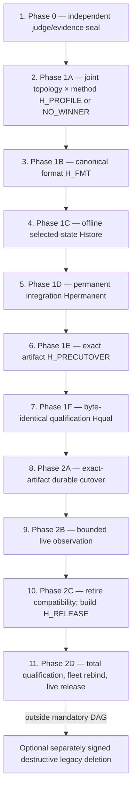

# Phase isolation and ordering rationale

Status: **SUPPORTING RATIONALE — NO ARCHITECTURE OR METHOD SELECTED**

This document explains the strongest currently justified three-envelope graph
and its 11-node causal gate chain. It creates no requirement or permission.
Authority remains with [the phase index](README.md), the three numbered phase
files, [requirements](../design/requirements.md),
[architecture selection](../design/architecture-selection.md),
[method selection](../algorithms/selection-protocol.md), and
[qualification gates](../qualification/gates.md).

Only artifact-system and Phase 0 packet preparation are authorized. No durable
Phase 0 authority receipt or authenticated phase-entry authorization attestation
is sealed. The joint Phase 1A
topology × physical-profile tournament is `NOT_RUN`; no profile has won.
Supporting rationale cannot authorize Phase 0 execution, Phase 1, Phase 2, or
optional destruction.

## Non-circular definitions

A **capability** is a concrete class of effect an actor is authorized to cause:
seal a judge, evaluate/build only isolated artifacts, or mutate live truth.

A **phase** is a maximal contiguous work interval entered by one explicit
external authorization whose actor set and maximum capability/risk class are
fixed at entry. A phase ends before work would need a broader actor capability
or before that authorization could responsibly exist. Internal events may
irreversibly narrow remaining choices; they cannot broaden the phase ceiling.

A **gate** is an independently accepted, content-addressed predicate over exact
inputs, output bytes, evidence scope, and rejection/invalidation rules. Passing
a gate may permit the next ordered action already inside the current phase or
narrow the legal branch. It cannot grant a capability absent from phase entry,
authorize another phase, change evidence scope, or qualify different bytes.

Thus a hash/signature is not automatically a phase, and a phase is not defined
as “whatever contains these gates.” The observable test is:

```text
new external actor capability required?  -> phase boundary
same capability ceiling; exact proof required before next action? -> gate
```

## Complete three-phase, 11-gate graph



The 11 nodes remain independently auditable. Compressing top-level phases does
not fuse hashes, reuse evidence, skip actors, weaken stop rules, or let one
scope qualify another.

## The three permission/risk envelopes

| Phase | Actors admitted | Maximum capability fixed at entry | Failure/rollback class |
|---:|---|---|---|
| [0](00-independent-judge-and-evidence-seal.md) | owner plus candidate-independent evidence/judge maintainers; current operators supply read-only facts | inventory and seal facts, requirements, corpus/holdout, oracle, candidate closure, thresholds, and provenance | reseal; no candidate result, production dependency, or V2 truth exists |
| [1](01-non-live-selection-implementation-and-qualification.md) | candidate/implementation producers plus independent gate acceptors; current authorities participate only in isolated shadow/rehearsal | evaluate, build, and qualify isolated artifacts; legacy remains sole live writable/acknowledging truth | reject, invalidate, rebuild, or discard; no live truth changes; `NO_WINNER` is terminal |
| [2](02-irreversible-cutover-observation-retirement-and-release.md) | explicitly authorized change/operator authorities, every writer/selector, independent live/release acceptors, incident owners | mutate the live fleet using exact accepted artifacts; cross the one-way global `V2Writable` transition; complete activation and open ingress; later retire compatibility and release changed qualified bytes | before the global transition only the higher-generation abort; after it V2-only repair/restore/roll-forward; data deletion remains unauthorized |

No phase exit self-authorizes its successor. Every phase entry also requires a
separate attestation authenticated through the externally pinned per-artifact
verifier policy. It binds the exact receipt, actor principal/credential/control-
domain triples, exact gate capabilities, validity/revocation fact, catalog,
phase, gate, and lineage. Later same-phase gates inherit it only through exact
accepted predecessor bytes. Phase 1 can exist
only after the judge is sealed; Phase 2 authorization can exist responsibly
only after exact `H_PRECUTOVER` and `Hqual` exist.

## Why every gate follows its predecessors

Dependencies are cumulative. A gate consumes all applicable earlier facts and
is invalidated by any changed consumed byte or decision.

| Node | Binding output | Why it cannot move earlier |
|---:|---|---|
| 1 | candidate-independent judge seal | It defines the comparison universe and therefore precedes result-bearing work. |
| 2 | accepted joint `H_PROFILE` or `NO_WINNER` | Topology and its physical method are mutually constraining. The tournament must judge each complete compile-valid pair against uncontaminated requirements and actual source/authority/runtime costs; selecting either projection first can discard the only valid pair or retain a needless boundary. Correctness and deletion gates precede performance inside this one gate. |
| 3 | `H_FMT` naming exact `H_PROFILE` | Persistent identity cannot be implemented before the complete topology/profile wins; production code must reproduce rather than redefine selection evidence. |
| 4 | `Hstore` naming exact `H_FMT` | Durable records, recovery, and physical closure cannot depend on mutable canonical grammar. |
| 5 | `Hpermanent` naming exact `Hstore` | Cross-authority application/current-runtime-effect work requires already qualified selected-state behavior and may not redefine identity/storage policy. |
| 6 | exact `H_PRECUTOVER` naming prior hashes | The temporary migration unit may depend only on the inventoried read-only legacy adapter, accepted pure canonical functions/types, and the narrow selected-state import command; permanent V2 code may not depend on migration code. That exact graph, fence, configuration, schemas, binary, dependencies, and runbooks must be assembled before exact-artifact qualification. |
| 7 | `Hqual` naming byte-identical `H_PRECUTOVER` | Shadow/import success cannot substitute for full independent qualification, restart/barrier faulting, restore, and dress rehearsal of the bytes proposed for live use. |
| 8 | accepted exact-artifact cutover record | Live mutation requires a separately authorized window and the exact qualified artifact; the durable installation barrier must complete before the global transition, and public ingress must remain closed until complete selector activation is reconstructible. |
| 9 | accepted full observation horizon | Compatibility must remain available while V2 behavior, recovery, cleanup, containment, and operations are observed under live load. |
| 10 | exact changed `H_RELEASE` build plus total QG disposition | Removing compatibility before observation would destroy the fallback/read evidence under test; removal changes bytes and therefore produces a new identity. Every QG ID must be rerun or carry an accepted executable complete-closure non-impact proof. |
| 11 | independently qualified and fleet-live `H_RELEASE` | Stable `H_PRECUTOVER` evidence and receipts cannot qualify or activate changed bytes. Exact `H_RELEASE` needs a new release epoch, install/activation receipts, old-process drain, durable fleet completion, and live attestation before ingress opens. |

## Why the former split safely collapses

The former graph promoted each of these evidence transitions to a top-level
phase:

```text
judge -> selection -> non-live production -> live observation -> retirement
```

That was over-segmented. Two fusions are safe because the signed causal gates
already provide the needed evidence isolation:

- selection plus format/selected-state/integration/precutover qualification share
  one non-live capability ceiling and discard/rebuild recovery class; gate
  1A–1F hashes preserve winner-before-implementation and exact-byte order; and
- cutover, observation, compatibility retirement, and changed release all sit
  within one owner-authorized live-change program; gates 2A–2D preserve the
  irreversible boundary, observation hold, changed identity, and fresh
  qualification. Activation only narrows later legal actions.

The fusion removes two administrative promotion boundaries, not one proof,
hash, actor separation, crash cut, stop condition, or owner decision over live
risk.

## Why two top-level phases are not yet conservatively justified

Any two-envelope linear compression must fuse either 0+1 or 1+2:

| Proposed fusion | Concrete failure |
|---|---|
| 0 + 1 without proved static noninterference | Candidate actors can tune candidate closure, fixtures, thresholds, corpus split, or holdout after learning results. Administrative role labels alone are insufficient. |
| 1 + 2 | The authorization issued before a winner or exact qualified artifact exists already includes live-fleet mutation and irreversible activation, or a later internal signature silently enlarges the phase ceiling. Either form defeats the conservative rule that live authority is granted only over exact accepted hashes. |

The strongest unresolved two-envelope challenger is
`{Phase 0 + Phase 1 under static noninterfering roles, Phase 2 live}`. It may
win only by proving all of the following before candidate work: a judge
principal with exclusive holdout/oracle custody; candidate principals with no
read or write path to judge state; immutable capability/ACL rules; dispatch
disabled until the exact judge seal exists; independent acceptance; complete
reopening/invalidation behavior; and evidence that neither shared process,
filesystem, cache, log, administrator, nor timing channel defeats those
properties. The current package has no such proof, so it conservatively keeps
the boundary. It also does not claim the challenger is impossible.

A one-envelope challenger additionally preauthorizes irreversible live
capability before exact accepted bytes exist and is not conservatively
justified. The **global minimum is `OPEN`**. Three is the smallest grouping
currently justified by the written evidence, a falsifiable local selection
rather than a mathematical theorem.

## Exact irreversible boundary and durable fleet barrier

```text
LegacyWritable(g)
  -> QuiescedForImport(g+1)
       -> LegacyWritable(g+2)  # only before global V2Writable transition
       -> V2Writable(g+2, ingress=closed)  # irreversible rollback boundary
            -> V2Writable(g+2, ingress=open)  # durable fleet completion first
```

Before the global `V2Writable(g+2)` transition, every inventoried authority must durably
install and synchronize exact inert `g+2` activation material bound to
`H_PRECUTOVER`, acknowledge it durably, and participate in a fleet barrier
whose complete set reconstructs identically after restart. Missing, stale, or
ambiguous state blocks. Timing, process-local counters, and best-effort
broadcast are not proof.

The successful atomic selection of exact `V2Writable(g+2)` under the barrier
bound to exact `H_PRECUTOVER` is the irreversible rollback boundary. Ingress is
still closed, so this transition does not permit a public V2 operation
acknowledgment. Every authority must then activate exact `g+2` and emit a
durable generation-bound control-plane receipt; laggards fail closed. Only
after the complete activation-receipt set reconstructs identically after
restart may the protocol durably record fleet completion and open generation-
bound ingress. That opening is the first possible public V2 operation
acknowledgment boundary. Crash recovery derives direction from durable fleet,
local-selector, receipt, completion, and ingress facts, never memory or elapsed
time.

This added barrier detail does not select a controller, database, RPC, lease,
record encoding, or second selector. Joint gate 1A must choose the smallest
complete topology/profile that proves the semantics; gates 1F and 2A fault and
attest it.

## Reopening and invalidation

| Change or failure | Earliest owner | Required consequence |
|---|---|---|
| Phase 0 fact, requirement, scope, fixture, threshold, corpus/holdout, comparator, or authorization rule | Phase 0 | invalidate all consuming Phase 1/2 results and reseal before evaluation |
| topology, physical method, parameter, helper/process/resource realization, or fleet protocol | 1A | new joint `H_PROFILE`; invalidate 1B–1F and Phase 2 |
| canonical grammar/decoder | 1B | new `H_FMT`; invalidate 1C–1F and Phase 2; reopen 1A if the profile changed |
| selected-state implementation/recovery/resource law | 1C | new `Hstore`; invalidate 1D–1F and Phase 2 |
| permanent application/current-Linux integration or topology need | 1D, or 1A for profile topology | new `Hpermanent`; invalidate 1E–1F and Phase 2 |
| importer/fence/config/schema/build/runbook or any precutover byte | owning 1B–1E | new `H_PRECUTOVER`; rerun 1F completely |
| qualification environment/evidence | 1F or owning input | requalify unchanged exact bytes or rebuild from the owning gate |
| live drift before the global transition | owning Phase 1 gate | block transition; never cut over drifted bytes |
| barrier ambiguity before the global transition | 2A | reconstruct or take only the qualified higher-generation abort |
| failure after the global transition | 2A/2B incident lineage | keep ingress closed until safe when needed; V2-only roll-forward/restore; never reopen writable legacy |
| retirement target or `H_RELEASE` bytes | 2C | rebuild exact `H_RELEASE` and total QG disposition; rerun all required 2D qualification and fleet-rebinding work at a new release epoch |
| `H_RELEASE` expected fleet set, receipt, epoch, or live attestation changes | 2D | invalidate 2D; keep ingress closed when already activated and reconstruct/roll forward under a new exact release lineage |
| destructive target/policy/command | post-release action | new distinct signature and evidence; no inherited Phase 2 approval |

## Permitted parallelism

Parallel lanes are allowed only after their common inputs are sealed: complete
joint-profile candidate lanes within 1A; implementation/test shards against
one accepted predecessor; independent gate runners against identical
`H_PRECUTOVER` or `H_RELEASE`; and bounded operational evidence collection
after one exact activation. A lane may not inspect another lane's holdout,
change a shared judge, race ahead of a prerequisite hash, rebuild the artifact
it qualifies, acquire a capability outside its phase, or promote partial
evidence.

The result is three top-level permission files plus 11 retained causal gates.
That is aggressive simplification with explicit proof custody, not a reduction
obtained by hiding gates or collapsing evidence scopes.
